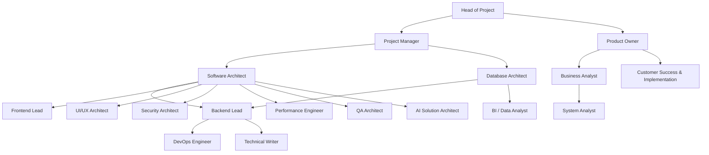
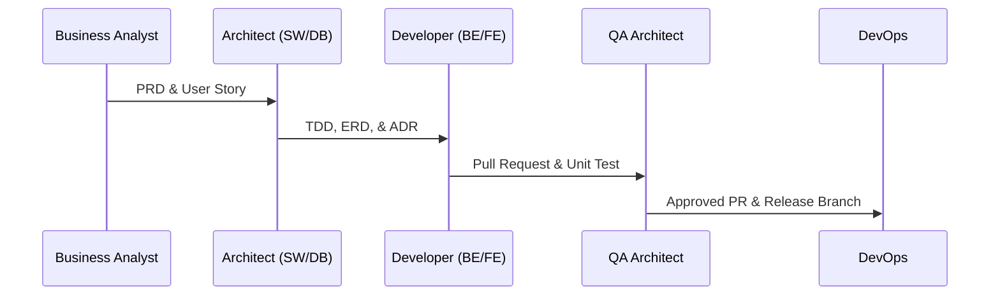

# FINAL BOSS - SIKAD v4.0 & AETHER PLATFORM COMPLETE KNOWLEDGE BASE

> **Project:** SIKAD v4.0 & AETHER Platform
> **Consolidated On:** 25 Juni 2026
> **Total Files Consolidated:** 320

This document is a complete consolidation of all documentation, specification, handbook, testing, and migration SQL files in this repository. All original source files remain intact in the repository.

---

## TABLE OF CONTENTS

- [INCONSISTENCY_FIX_LIST.md](#file-inconsistency_fix_list-md)
- [package.json](#file-package-json)
- [.agents/AGENTS.md](#file-agents-agents-md)
- [00-Platform/README.md](#file-00-platform-readme-md)
- [00-Platform/00.01-PLATFORM_PRD.md](#file-00-platform-00-01-platform_prd-md)
- [00-Platform/00.02-PLATFORM_ARCHITECTURE.md](#file-00-platform-00-02-platform_architecture-md)
- [00-Platform/00.03-PLATFORM_ROADMAP.md](#file-00-platform-00-03-platform_roadmap-md)
- [00-Platform/00.04-MODULE_BREAKDOWN.md](#file-00-platform-00-04-module_breakdown-md)
- [00-Platform/00.05-DEVELOPMENT_PLAN.md](#file-00-platform-00-05-development_plan-md)
- [00-Platform/00.06-MVP_SCOPE.md](#file-00-platform-00-06-mvp_scope-md)
- [00-Platform/00.07-RELEASE_PLAN.md](#file-00-platform-00-07-release_plan-md)
- [00-Platform/00.08-RISK_REGISTER.md](#file-00-platform-00-08-risk_register-md)
- [00-Platform/00.09-DEPENDENCY_MAP.md](#file-00-platform-00-09-dependency_map-md)
- [00-Platform/00.10-IMPLEMENTATION_SEQUENCE.md](#file-00-platform-00-10-implementation_sequence-md)
- [docs/00 ALUR KETERKAITAN LENGKAP.md](#file-docs-00-alur-keterkaitan-lengkap-md)
- [docs/00 PRD REVISION LOG.md](#file-docs-00-prd-revision-log-md)
- [docs/04-API-Specification.md](#file-docs-04-api-specification-md)
- [docs/05-RLS-Policy-Specification.md](#file-docs-05-rls-policy-specification-md)
- [docs/06-Migration-Plan-v3-to-v4.0.md](#file-docs-06-migration-plan-v3-to-v4-0-md)
- [docs/07-Deployment-Architecture.md](#file-docs-07-deployment-architecture-md)
- [docs/08-Testing-Strategy-TDD-UAT.md](#file-docs-08-testing-strategy-tdd-uat-md)
- [docs/09-Project-Structure.md](#file-docs-09-project-structure-md)
- [docs/10-Implementation-Roadmap.md](#file-docs-10-implementation-roadmap-md)
- [docs/11-Coding-Standards.md](#file-docs-11-coding-standards-md)
- [docs/12-AI-Agents.md](#file-docs-12-ai-agents-md)
- [docs/13-Architecture-Decision-Records.md](#file-docs-13-architecture-decision-records-md)
- [docs/14-UI-Design-System.md](#file-docs-14-ui-design-system-md)
- [docs/15-State-Management-Strategy.md](#file-docs-15-state-management-strategy-md)
- [docs/16-Sync-Conflict-Specification.md](#file-docs-16-sync-conflict-specification-md)
- [docs/17-Security-Hardening.md](#file-docs-17-security-hardening-md)
- [docs/18-Performance-Optimization.md](#file-docs-18-performance-optimization-md)
- [docs/19-Monitoring-Observability.md](#file-docs-19-monitoring-observability-md)
- [docs/20-Backup-Recovery-Runbook.md](#file-docs-20-backup-recovery-runbook-md)
- [docs/21-UAT-Test-Cases.md](#file-docs-21-uat-test-cases-md)
- [docs/22-Release-Checklist.md](#file-docs-22-release-checklist-md)
- [docs/23-Operations-Manual.md](#file-docs-23-operations-manual-md)
- [docs/24-User-Manual.md](#file-docs-24-user-manual-md)
- [docs/25-CI-CD-Workflow-Specification.md](#file-docs-25-ci-cd-workflow-specification-md)
- [docs/26-Testing-Suite-Specification.md](#file-docs-26-testing-suite-specification-md)
- [docs/27-Architecture-Remediation-Plan.md](#file-docs-27-architecture-remediation-plan-md)
- [docs/28-Advanced-Architecture-Remediation-Plan.md](#file-docs-28-advanced-architecture-remediation-plan-md)
- [docs/SQL QUERY.txt](#file-docs-sql-query-txt)
- [docs/workflow.md](#file-docs-workflow-md)
- [docs/03-Database-Dictionary/03-Database-Dictionary.md](#file-docs-03-database-dictionary-03-database-dictionary-md)
- [docs/03-Database-Dictionary/03.1-Database-Constraints.md](#file-docs-03-database-dictionary-03-1-database-constraints-md)
- [docs/03-Database-Dictionary/03.2-Database-Indexes.md](#file-docs-03-database-dictionary-03-2-database-indexes-md)
- [docs/03-Database-Dictionary/03.3-Database-Triggers.md](#file-docs-03-database-dictionary-03-3-database-triggers-md)
- [docs/03-Database-Dictionary/03.4-Database-Views.md](#file-docs-03-database-dictionary-03-4-database-views-md)
- [docs/01-Database-Dictionary/01-Database-Dictionary.md](#file-docs-01-database-dictionary-01-database-dictionary-md)
- [docs/01-Database-Dictionary/01.2-Attendance-Rapor-Alumni-RBAC.md](#file-docs-01-database-dictionary-01-2-attendance-rapor-alumni-rbac-md)
- [docs/01-Database-Dictionary/01.3-Promotion-Archive-Lifecycle-.md](#file-docs-01-database-dictionary-01-3-promotion-archive-lifecycle-md)
- [docs/01-Database-Dictionary/01.4-Indexing-Constraints-RLS-Dic.md](#file-docs-01-database-dictionary-01-4-indexing-constraints-rls-dic-md)
- [docs/01-SQL/SECTION 001 — EXTENSIONS.sql](#file-docs-01-sql-section-001-—-extensions-sql)
- [docs/01-SQL/SECTION 002 — ENUMS.sql](#file-docs-01-sql-section-002-—-enums-sql)
- [docs/01-SQL/SECTION 003 — RBAC.txt](#file-docs-01-sql-section-003-—-rbac-txt)
- [docs/01-SQL/SECTION 004 — MASTER DATA.txt](#file-docs-01-sql-section-004-—-master-data-txt)
- [docs/01-SQL/SECTION 005 — ACADEMIC STRUCTURE 01.txt](#file-docs-01-sql-section-005-—-academic-structure-01-txt)
- [docs/01-SQL/SECTION 005 — ACADEMIC STRUCTURE 02.txt](#file-docs-01-sql-section-005-—-academic-structure-02-txt)
- [docs/01-SQL/SECTION 005 — ACADEMIC STRUCTURE 03.txt](#file-docs-01-sql-section-005-—-academic-structure-03-txt)
- [docs/01-SQL/SECTION 006 — TEACHING WORKLOAD 01.txt](#file-docs-01-sql-section-006-—-teaching-workload-01-txt)
- [docs/01-SQL/SECTION 006 — TEACHING WORKLOAD 02.txt](#file-docs-01-sql-section-006-—-teaching-workload-02-txt)
- [docs/01-SQL/SECTION 007 — ASSESSMENT.txt](#file-docs-01-sql-section-007-—-assessment-txt)
- [docs/01-SQL/SECTION 008 — ATTENDANCE.txt](#file-docs-01-sql-section-008-—-attendance-txt)
- [docs/01-SQL/SECTION 009 — RAPOR.txt](#file-docs-01-sql-section-009-—-rapor-txt)
- [docs/01-SQL/SECTION 010 — ALUMNI.txt](#file-docs-01-sql-section-010-—-alumni-txt)
- [docs/01-SQL/SECTION 011 — PROMOTION & GRADUATION.txt](#file-docs-01-sql-section-011-—-promotion-&-graduation-txt)
- [docs/01-SQL/SECTION 012 — ARCHIVE.txt](#file-docs-01-sql-section-012-—-archive-txt)
- [docs/01-SQL/SECTION 013 — MONITORING & SYNC.txt](#file-docs-01-sql-section-013-—-monitoring-&-sync-txt)
- [docs/02-TDD/02.1-TDD-Authentication-RBAC.md](#file-docs-02-tdd-02-1-tdd-authentication-rbac-md)
- [docs/02-TDD/02.2-TDD-Guru-Management.md](#file-docs-02-tdd-02-2-tdd-guru-management-md)
- [docs/02-TDD/02.3-TDD-Siswa-Management.md](#file-docs-02-tdd-02-3-tdd-siswa-management-md)
- [docs/02-TDD/02.4-TDD-Academic-Term.md](#file-docs-02-tdd-02-4-tdd-academic-term-md)
- [docs/02-TDD/02.5-TDD-Kelas.md](#file-docs-02-tdd-02-5-tdd-kelas-md)
- [docs/02-TDD/02.6-TDD-Pembagian-Mengajar.md](#file-docs-02-tdd-02-6-tdd-pembagian-mengajar-md)
- [docs/02-TDD/02.7-TDD-Assessment.md](#file-docs-02-tdd-02-7-tdd-assessment-md)
- [docs/02-TDD/02.8-TDD-Kehadiran.md](#file-docs-02-tdd-02-8-tdd-kehadiran-md)
- [docs/02-TDD/02.9-TDD-Rapor.md](#file-docs-02-tdd-02-9-tdd-rapor-md)
- [docs/02-TDD/02.10-TDD-Promotion-Engine.md](#file-docs-02-tdd-02-10-tdd-promotion-engine-md)
- [docs/02-TDD/02.11-TDD-Graduation-Engine.md](#file-docs-02-tdd-02-11-tdd-graduation-engine-md)
- [docs/02-TDD/02.12-TDD-Sync-Engine.md](#file-docs-02-tdd-02-12-tdd-sync-engine-md)
- [docs/02-TDD/02.13-TDD-Monitoring-Conflict-Cen.md](#file-docs-02-tdd-02-13-tdd-monitoring-conflict-cen-md)
- [docs/02-TDD/02.14-TDD-Archive-Engine.md](#file-docs-02-tdd-02-14-tdd-archive-engine-md)
- [docs/02-TDD/02.16-TDD-Tugas-Tambahan-Engine.md](#file-docs-02-tdd-02-16-tdd-tugas-tambahan-engine-md)
- [docs/02-TDD/02.17-TDD-Reporting-Analytics-Eng.md](#file-docs-02-tdd-02-17-tdd-reporting-analytics-eng-md)
- [docs/02-TDD/02.18-TDD-Kepala-Sekolah-Dashboar.md](#file-docs-02-tdd-02-18-tdd-kepala-sekolah-dashboar-md)
- [docs/02-TDD/02.19-TDD-Kurikulum-Dashboard.md](#file-docs-02-tdd-02-19-tdd-kurikulum-dashboard-md)
- [docs/02-TDD/02.20-TDD-Export-Engine.md](#file-docs-02-tdd-02-20-tdd-export-engine-md)
- [docs/engineering-handbook/00-Engineering-Handbook.md](#file-docs-engineering-handbook-00-engineering-handbook-md)
- [docs/engineering-handbook/01-Project-Governance.md](#file-docs-engineering-handbook-01-project-governance-md)
- [docs/engineering-handbook/02-Organization-Structure.md](#file-docs-engineering-handbook-02-organization-structure-md)
- [docs/engineering-handbook/03-Engineering-Workflow.md](#file-docs-engineering-handbook-03-engineering-workflow-md)
- [docs/engineering-handbook/04-Project-Lifecycle.md](#file-docs-engineering-handbook-04-project-lifecycle-md)
- [docs/engineering-handbook/05-RACI-Matrix.md](#file-docs-engineering-handbook-05-raci-matrix-md)
- [docs/engineering-handbook/06-Definition-of-Ready.md](#file-docs-engineering-handbook-06-definition-of-ready-md)
- [docs/engineering-handbook/07-Definition-of-Done.md](#file-docs-engineering-handbook-07-definition-of-done-md)
- [docs/engineering-handbook/08-Head-of-Project.md](#file-docs-engineering-handbook-08-head-of-project-md)
- [docs/engineering-handbook/09-Project-Manager.md](#file-docs-engineering-handbook-09-project-manager-md)
- [docs/engineering-handbook/10-Product-Owner.md](#file-docs-engineering-handbook-10-product-owner-md)
- [docs/engineering-handbook/11-Business-Analyst.md](#file-docs-engineering-handbook-11-business-analyst-md)
- [docs/engineering-handbook/12-System-Analyst.md](#file-docs-engineering-handbook-12-system-analyst-md)
- [docs/engineering-handbook/13-Software-Architect.md](#file-docs-engineering-handbook-13-software-architect-md)
- [docs/engineering-handbook/14-Database-Architect.md](#file-docs-engineering-handbook-14-database-architect-md)
- [docs/engineering-handbook/15-Backend-Lead.md](#file-docs-engineering-handbook-15-backend-lead-md)
- [docs/engineering-handbook/16-Frontend-Lead.md](#file-docs-engineering-handbook-16-frontend-lead-md)
- [docs/engineering-handbook/17-UIUX-Architect.md](#file-docs-engineering-handbook-17-uiux-architect-md)
- [docs/engineering-handbook/18-Security-Architect.md](#file-docs-engineering-handbook-18-security-architect-md)
- [docs/engineering-handbook/19-Performance-Engineer.md](#file-docs-engineering-handbook-19-performance-engineer-md)
- [docs/engineering-handbook/20-QA-Architect.md](#file-docs-engineering-handbook-20-qa-architect-md)
- [docs/engineering-handbook/21-AI-Solution-Architect.md](#file-docs-engineering-handbook-21-ai-solution-architect-md)
- [docs/engineering-handbook/22-DevOps-Engineer.md](#file-docs-engineering-handbook-22-devops-engineer-md)
- [docs/engineering-handbook/23-Technical-Writer.md](#file-docs-engineering-handbook-23-technical-writer-md)
- [docs/engineering-handbook/24-Engineering-Standards.md](#file-docs-engineering-handbook-24-engineering-standards-md)
- [docs/engineering-handbook/25-Code-Review-Standards.md](#file-docs-engineering-handbook-25-code-review-standards-md)
- [docs/engineering-handbook/26-Git-Workflow.md](#file-docs-engineering-handbook-26-git-workflow-md)
- [docs/engineering-handbook/27-Branching-Strategy.md](#file-docs-engineering-handbook-27-branching-strategy-md)
- [docs/engineering-handbook/28-Documentation-Standards.md](#file-docs-engineering-handbook-28-documentation-standards-md)
- [docs/engineering-handbook/29-Artifact-Matrix.md](#file-docs-engineering-handbook-29-artifact-matrix-md)
- [docs/engineering-handbook/30-Input-Output-Matrix.md](#file-docs-engineering-handbook-30-input-output-matrix-md)
- [docs/engineering-handbook/31-Review-Approval-Matrix.md](#file-docs-engineering-handbook-31-review-approval-matrix-md)
- [docs/engineering-handbook/32-Sprint-Responsibility.md](#file-docs-engineering-handbook-32-sprint-responsibility-md)
- [docs/engineering-handbook/33-Risk-Management.md](#file-docs-engineering-handbook-33-risk-management-md)
- [docs/engineering-handbook/34-RFC-Process.md](#file-docs-engineering-handbook-34-rfc-process-md)
- [docs/engineering-handbook/35-ADR-Governance.md](#file-docs-engineering-handbook-35-adr-governance-md)
- [docs/engineering-handbook/36-Release-Management.md](#file-docs-engineering-handbook-36-release-management-md)
- [docs/engineering-handbook/37-Quality-Gates.md](#file-docs-engineering-handbook-37-quality-gates-md)
- [docs/engineering-handbook/38-KPI-Performance.md](#file-docs-engineering-handbook-38-kpi-performance-md)
- [docs/engineering-handbook/39-Checklists.md](#file-docs-engineering-handbook-39-checklists-md)
- [docs/engineering-handbook/40-Assessment-Integration-Blueprint.md](#file-docs-engineering-handbook-40-assessment-integration-blueprint-md)
- [docs/engineering-handbook/Appendix/Checklists/README.md](#file-docs-engineering-handbook-appendix-checklists-readme-md)
- [docs/engineering-handbook/Appendix/Examples/README.md](#file-docs-engineering-handbook-appendix-examples-readme-md)
- [docs/engineering-handbook/Appendix/Glossary/Glossary.md](#file-docs-engineering-handbook-appendix-glossary-glossary-md)
- [docs/engineering-handbook/Appendix/Templates/README.md](#file-docs-engineering-handbook-appendix-templates-readme-md)
- [docs/supabase/migrations/000_foundation/000_extensions.sql](#file-docs-supabase-migrations-000_foundation-000_extensions-sql)
- [docs/supabase/migrations/000_foundation/001_enums.sql](#file-docs-supabase-migrations-000_foundation-001_enums-sql)
- [docs/supabase/migrations/000_foundation/002_domains.sql](#file-docs-supabase-migrations-000_foundation-002_domains-sql)
- [docs/supabase/migrations/000_foundation/003_helper_functions.sql](#file-docs-supabase-migrations-000_foundation-003_helper_functions-sql)
- [docs/supabase/migrations/100_rbac/100_roles.sql](#file-docs-supabase-migrations-100_rbac-100_roles-sql)
- [docs/supabase/migrations/100_rbac/101_permissions.sql](#file-docs-supabase-migrations-100_rbac-101_permissions-sql)
- [docs/supabase/migrations/100_rbac/102_role_permissions.sql](#file-docs-supabase-migrations-100_rbac-102_role_permissions-sql)
- [docs/supabase/migrations/100_rbac/103_user_roles.sql](#file-docs-supabase-migrations-100_rbac-103_user_roles-sql)
- [docs/supabase/migrations/100_rbac/104_rbac_seed.sql](#file-docs-supabase-migrations-100_rbac-104_rbac_seed-sql)
- [docs/supabase/migrations/200_master/200_gurus.sql](#file-docs-supabase-migrations-200_master-200_gurus-sql)
- [docs/supabase/migrations/200_master/201_siswas.sql](#file-docs-supabase-migrations-200_master-201_siswas-sql)
- [docs/supabase/migrations/200_master/202_mata_pelajarans.sql](#file-docs-supabase-migrations-200_master-202_mata_pelajarans-sql)
- [docs/supabase/migrations/200_master/203_tugas_tambahan_types.sql](#file-docs-supabase-migrations-200_master-203_tugas_tambahan_types-sql)
- [docs/supabase/migrations/200_master/204_master_seed.sql](#file-docs-supabase-migrations-200_master-204_master_seed-sql)
- [docs/supabase/migrations/300_academic/300_academic_terms.sql](#file-docs-supabase-migrations-300_academic-300_academic_terms-sql)
- [docs/supabase/migrations/300_academic/301_kelas.sql](#file-docs-supabase-migrations-300_academic-301_kelas-sql)
- [docs/supabase/migrations/300_academic/302_riwayat_kelas.sql](#file-docs-supabase-migrations-300_academic-302_riwayat_kelas-sql)
- [docs/supabase/migrations/300_academic/303_wali_kelas_histori.sql](#file-docs-supabase-migrations-300_academic-303_wali_kelas_histori-sql)
- [docs/supabase/migrations/300_academic/304_mutasi_siswa.sql](#file-docs-supabase-migrations-300_academic-304_mutasi_siswa-sql)
- [docs/supabase/migrations/400_workload/400_pembagian_mengajar.sql](#file-docs-supabase-migrations-400_workload-400_pembagian_mengajar-sql)
- [docs/supabase/migrations/400_workload/401_tugas_tambahan_assignments.sql](#file-docs-supabase-migrations-400_workload-401_tugas_tambahan_assignments-sql)
- [docs/supabase/migrations/400_workload/402_teacher_workload_functions.sql](#file-docs-supabase-migrations-400_workload-402_teacher_workload_functions-sql)
- [docs/supabase/migrations/400_workload/403_teacher_workload_views.sql](#file-docs-supabase-migrations-400_workload-403_teacher_workload_views-sql)
- [docs/supabase/migrations/500_assessment/500_assessment_types.sql](#file-docs-supabase-migrations-500_assessment-500_assessment_types-sql)
- [docs/supabase/migrations/500_assessment/501_assessments.sql](#file-docs-supabase-migrations-500_assessment-501_assessments-sql)
- [docs/supabase/migrations/500_assessment/502_assessment_details.sql](#file-docs-supabase-migrations-500_assessment-502_assessment_details-sql)
- [docs/supabase/migrations/500_assessment/503_assessment_locking.sql](#file-docs-supabase-migrations-500_assessment-503_assessment_locking-sql)
- [docs/supabase/migrations/500_assessment/504_assessment_functions.sql](#file-docs-supabase-migrations-500_assessment-504_assessment_functions-sql)
- [docs/supabase/migrations/500_assessment/505_assessment_transfer.sql](#file-docs-supabase-migrations-500_assessment-505_assessment_transfer-sql)
- [docs/supabase/migrations/500_assessment/505_assessment_views.sql](#file-docs-supabase-migrations-500_assessment-505_assessment_views-sql)
- [docs/supabase/migrations/500_assessment/506_assessment_input_rules.sql](#file-docs-supabase-migrations-500_assessment-506_assessment_input_rules-sql)
- [docs/supabase/migrations/600_attendance/600_kehadiran.sql](#file-docs-supabase-migrations-600_attendance-600_kehadiran-sql)
- [docs/supabase/migrations/600_attendance/601_rekap_kehadiran.sql](#file-docs-supabase-migrations-600_attendance-601_rekap_kehadiran-sql)
- [docs/supabase/migrations/600_attendance/602_attendance_functions.sql](#file-docs-supabase-migrations-600_attendance-602_attendance_functions-sql)
- [docs/supabase/migrations/600_attendance/603_attendance_views.sql](#file-docs-supabase-migrations-600_attendance-603_attendance_views-sql)
- [docs/supabase/migrations/700_rapor/700_catatan_wali_kelas.sql](#file-docs-supabase-migrations-700_rapor-700_catatan_wali_kelas-sql)
- [docs/supabase/migrations/700_rapor/701_rapor_snapshots.sql](#file-docs-supabase-migrations-700_rapor-701_rapor_snapshots-sql)
- [docs/supabase/migrations/700_rapor/702_rapor_pdf.sql](#file-docs-supabase-migrations-700_rapor-702_rapor_pdf-sql)
- [docs/supabase/migrations/700_rapor/703_rapor_versioning.sql](#file-docs-supabase-migrations-700_rapor-703_rapor_versioning-sql)
- [docs/supabase/migrations/700_rapor/704_rapor_views.sql](#file-docs-supabase-migrations-700_rapor-704_rapor_views-sql)
- [docs/supabase/migrations/800_promotion/800_promotion_jobs.sql](#file-docs-supabase-migrations-800_promotion-800_promotion_jobs-sql)
- [docs/supabase/migrations/800_promotion/801_promotion_details.sql](#file-docs-supabase-migrations-800_promotion-801_promotion_details-sql)
- [docs/supabase/migrations/800_promotion/802_graduation_jobs.sql](#file-docs-supabase-migrations-800_promotion-802_graduation_jobs-sql)
- [docs/supabase/migrations/800_promotion/803_graduation_details.sql](#file-docs-supabase-migrations-800_promotion-803_graduation_details-sql)
- [docs/supabase/migrations/800_promotion/804_promotion_functions.sql](#file-docs-supabase-migrations-800_promotion-804_promotion_functions-sql)
- [docs/supabase/migrations/800_promotion/805_graduation_functions.sql](#file-docs-supabase-migrations-800_promotion-805_graduation_functions-sql)
- [docs/supabase/migrations/900_alumni/900_alumni.sql](#file-docs-supabase-migrations-900_alumni-900_alumni-sql)
- [docs/supabase/migrations/900_alumni/901_alumni_snapshots.sql](#file-docs-supabase-migrations-900_alumni-901_alumni_snapshots-sql)
- [docs/supabase/migrations/900_alumni/902_alumni_views.sql](#file-docs-supabase-migrations-900_alumni-902_alumni_views-sql)
- [docs/supabase/migrations/1000_archive/1000_academic_snapshots.sql](#file-docs-supabase-migrations-1000_archive-1000_academic_snapshots-sql)
- [docs/supabase/migrations/1000_archive/1001_archive_jobs.sql](#file-docs-supabase-migrations-1000_archive-1001_archive_jobs-sql)
- [docs/supabase/migrations/1000_archive/1002_archive_records.sql](#file-docs-supabase-migrations-1000_archive-1002_archive_records-sql)
- [docs/supabase/migrations/1000_archive/1003_term_finalization_logs.sql](#file-docs-supabase-migrations-1000_archive-1003_term_finalization_logs-sql)
- [docs/supabase/migrations/1000_archive/1004_lifecycle_functions.sql](#file-docs-supabase-migrations-1000_archive-1004_lifecycle_functions-sql)
- [docs/supabase/migrations/1100_audit/1100_audit_logs.sql](#file-docs-supabase-migrations-1100_audit-1100_audit_logs-sql)
- [docs/supabase/migrations/1100_audit/1101_soft_delete_logs.sql](#file-docs-supabase-migrations-1100_audit-1101_soft_delete_logs-sql)
- [docs/supabase/migrations/1100_audit/1102_audit_functions.sql](#file-docs-supabase-migrations-1100_audit-1102_audit_functions-sql)
- [docs/supabase/migrations/1100_audit/1103_audit_triggers.sql](#file-docs-supabase-migrations-1100_audit-1103_audit_triggers-sql)
- [docs/supabase/migrations/1200_sync/1200_sync_queue.sql](#file-docs-supabase-migrations-1200_sync-1200_sync_queue-sql)
- [docs/supabase/migrations/1200_sync/1201_conflict_queue.sql](#file-docs-supabase-migrations-1200_sync-1201_conflict_queue-sql)
- [docs/supabase/migrations/1200_sync/1202_sync_metadata.sql](#file-docs-supabase-migrations-1200_sync-1202_sync_metadata-sql)
- [docs/supabase/migrations/1200_sync/1203_sync_logs.sql](#file-docs-supabase-migrations-1200_sync-1203_sync_logs-sql)
- [docs/supabase/migrations/1200_sync/1204_device_health.sql](#file-docs-supabase-migrations-1200_sync-1204_device_health-sql)
- [docs/supabase/migrations/1200_sync/1205_sync_functions.sql](#file-docs-supabase-migrations-1200_sync-1205_sync_functions-sql)
- [docs/supabase/migrations/1200_sync/1206_conflict_resolution.sql](#file-docs-supabase-migrations-1200_sync-1206_conflict_resolution-sql)
- [docs/supabase/migrations/1300_analytics/1300_analytics_jobs.sql](#file-docs-supabase-migrations-1300_analytics-1300_analytics_jobs-sql)
- [docs/supabase/migrations/1300_analytics/1301_analytics_snapshots.sql](#file-docs-supabase-migrations-1300_analytics-1301_analytics_snapshots-sql)
- [docs/supabase/migrations/1300_analytics/1302_materialized_views.sql](#file-docs-supabase-migrations-1300_analytics-1302_materialized_views-sql)
- [docs/supabase/migrations/1300_analytics/1303_dashboard_views.sql](#file-docs-supabase-migrations-1300_analytics-1303_dashboard_views-sql)
- [docs/supabase/migrations/1400_indexes/1400_indexes_master.sql](#file-docs-supabase-migrations-1400_indexes-1400_indexes_master-sql)
- [docs/supabase/migrations/1400_indexes/1401_jsonb_indexes.sql](#file-docs-supabase-migrations-1400_indexes-1401_jsonb_indexes-sql)
- [docs/supabase/migrations/1400_indexes/1402_rls_indexes.sql](#file-docs-supabase-migrations-1400_indexes-1402_rls_indexes-sql)
- [docs/supabase/migrations/1500_triggers/1500_updated_at_triggers.sql](#file-docs-supabase-migrations-1500_triggers-1500_updated_at_triggers-sql)
- [docs/supabase/migrations/1500_triggers/1501_version_triggers.sql](#file-docs-supabase-migrations-1500_triggers-1501_version_triggers-sql)
- [docs/supabase/migrations/1500_triggers/1502_soft_delete_triggers.sql](#file-docs-supabase-migrations-1500_triggers-1502_soft_delete_triggers-sql)
- [docs/supabase/migrations/1500_triggers/1503_analytics_triggers.sql](#file-docs-supabase-migrations-1500_triggers-1503_analytics_triggers-sql)
- [docs/supabase/migrations/1500_triggers/1504_notification_triggers.sql](#file-docs-supabase-migrations-1500_triggers-1504_notification_triggers-sql)
- [docs/supabase/migrations/1600_views/1600_v_teacher_workload.sql](#file-docs-supabase-migrations-1600_views-1600_v_teacher_workload-sql)
- [docs/supabase/migrations/1600_views/1601_v_student_current_class.sql](#file-docs-supabase-migrations-1600_views-1601_v_student_current_class-sql)
- [docs/supabase/migrations/1600_views/1602_v_assessment_progress.sql](#file-docs-supabase-migrations-1600_views-1602_v_assessment_progress-sql)
- [docs/supabase/migrations/1600_views/1603_v_attendance_summary.sql](#file-docs-supabase-migrations-1600_views-1603_v_attendance_summary-sql)
- [docs/supabase/migrations/1600_views/1604_v_rapor_completion.sql](#file-docs-supabase-migrations-1600_views-1604_v_rapor_completion-sql)
- [docs/supabase/migrations/1600_views/1605_v_curriculum_health.sql](#file-docs-supabase-migrations-1600_views-1605_v_curriculum_health-sql)
- [docs/supabase/migrations/1600_views/1606_v_alumni_statistics.sql](#file-docs-supabase-migrations-1600_views-1606_v_alumni_statistics-sql)
- [docs/supabase/migrations/1600_views/1607_v_dashboard_kepsek.sql](#file-docs-supabase-migrations-1600_views-1607_v_dashboard_kepsek-sql)
- [docs/supabase/migrations/1600_views/1608_v_dashboard_kurikulum.sql](#file-docs-supabase-migrations-1600_views-1608_v_dashboard_kurikulum-sql)
- [docs/supabase/migrations/1700_rls/1700_rls_guru.sql](#file-docs-supabase-migrations-1700_rls-1700_rls_guru-sql)
- [docs/supabase/migrations/1700_rls/1701_rls_wali_kelas.sql](#file-docs-supabase-migrations-1700_rls-1701_rls_wali_kelas-sql)
- [docs/supabase/migrations/1700_rls/1702_rls_bk.sql](#file-docs-supabase-migrations-1700_rls-1702_rls_bk-sql)
- [docs/supabase/migrations/1700_rls/1703_rls_kurikulum.sql](#file-docs-supabase-migrations-1700_rls-1703_rls_kurikulum-sql)
- [docs/supabase/migrations/1700_rls/1704_rls_admin.sql](#file-docs-supabase-migrations-1700_rls-1704_rls_admin-sql)
- [docs/supabase/migrations/1800_seed/1800_seed_roles.sql](#file-docs-supabase-migrations-1800_seed-1800_seed_roles-sql)
- [docs/supabase/migrations/1800_seed/1801_seed_permissions.sql](#file-docs-supabase-migrations-1800_seed-1801_seed_permissions-sql)
- [docs/supabase/migrations/1800_seed/1802_seed_assessment_types.sql](#file-docs-supabase-migrations-1800_seed-1802_seed_assessment_types-sql)
- [docs/supabase/migrations/1800_seed/1803_seed_tugas_tambahan.sql](#file-docs-supabase-migrations-1800_seed-1803_seed_tugas_tambahan-sql)
- [docs/supabase/migrations/1900_maintenance/1900_backup_views.sql](#file-docs-supabase-migrations-1900_maintenance-1900_backup_views-sql)
- [docs/supabase/migrations/1900_maintenance/1901_health_check.sql](#file-docs-supabase-migrations-1900_maintenance-1901_health_check-sql)
- [docs/supabase/migrations/1900_maintenance/1902_maintenance_jobs.sql](#file-docs-supabase-migrations-1900_maintenance-1902_maintenance_jobs-sql)
- [docs/supabase/migrations/1900_maintenance/1903_cleanup_jobs.sql](#file-docs-supabase-migrations-1900_maintenance-1903_cleanup_jobs-sql)
- [bin/aether.js](#file-bin-aether-js)
- [node_modules/.package-lock.json](#file-node_modules-package-lock-json)
- [node_modules/anymatch/README.md](#file-node_modules-anymatch-readme-md)
- [node_modules/anymatch/index.js](#file-node_modules-anymatch-index-js)
- [node_modules/anymatch/package.json](#file-node_modules-anymatch-package-json)
- [node_modules/binary-extensions/binary-extensions.json](#file-node_modules-binary-extensions-binary-extensions-json)
- [node_modules/binary-extensions/index.js](#file-node_modules-binary-extensions-index-js)
- [node_modules/binary-extensions/package.json](#file-node_modules-binary-extensions-package-json)
- [node_modules/binary-extensions/readme.md](#file-node_modules-binary-extensions-readme-md)
- [node_modules/braces/README.md](#file-node_modules-braces-readme-md)
- [node_modules/braces/index.js](#file-node_modules-braces-index-js)
- [node_modules/braces/lib/compile.js](#file-node_modules-braces-lib-compile-js)
- [node_modules/braces/lib/constants.js](#file-node_modules-braces-lib-constants-js)
- [node_modules/braces/lib/expand.js](#file-node_modules-braces-lib-expand-js)
- [node_modules/braces/lib/parse.js](#file-node_modules-braces-lib-parse-js)
- [node_modules/braces/lib/stringify.js](#file-node_modules-braces-lib-stringify-js)
- [node_modules/braces/lib/utils.js](#file-node_modules-braces-lib-utils-js)
- [node_modules/braces/package.json](#file-node_modules-braces-package-json)
- [node_modules/chalk/package.json](#file-node_modules-chalk-package-json)
- [node_modules/chalk/readme.md](#file-node_modules-chalk-readme-md)
- [node_modules/chalk/source/index.js](#file-node_modules-chalk-source-index-js)
- [node_modules/chalk/source/utilities.js](#file-node_modules-chalk-source-utilities-js)
- [node_modules/chalk/source/vendor/ansi-styles/index.js](#file-node_modules-chalk-source-vendor-ansi-styles-index-js)
- [node_modules/chalk/source/vendor/supports-color/browser.js](#file-node_modules-chalk-source-vendor-supports-color-browser-js)
- [node_modules/chalk/source/vendor/supports-color/index.js](#file-node_modules-chalk-source-vendor-supports-color-index-js)
- [node_modules/chokidar/README.md](#file-node_modules-chokidar-readme-md)
- [node_modules/chokidar/index.js](#file-node_modules-chokidar-index-js)
- [node_modules/chokidar/lib/constants.js](#file-node_modules-chokidar-lib-constants-js)
- [node_modules/chokidar/lib/fsevents-handler.js](#file-node_modules-chokidar-lib-fsevents-handler-js)
- [node_modules/chokidar/lib/nodefs-handler.js](#file-node_modules-chokidar-lib-nodefs-handler-js)
- [node_modules/chokidar/package.json](#file-node_modules-chokidar-package-json)
- [node_modules/commander/Readme.md](#file-node_modules-commander-readme-md)
- [node_modules/commander/index.js](#file-node_modules-commander-index-js)
- [node_modules/commander/lib/argument.js](#file-node_modules-commander-lib-argument-js)
- [node_modules/commander/lib/command.js](#file-node_modules-commander-lib-command-js)
- [node_modules/commander/lib/error.js](#file-node_modules-commander-lib-error-js)
- [node_modules/commander/lib/help.js](#file-node_modules-commander-lib-help-js)
- [node_modules/commander/lib/option.js](#file-node_modules-commander-lib-option-js)
- [node_modules/commander/lib/suggestSimilar.js](#file-node_modules-commander-lib-suggestsimilar-js)
- [node_modules/commander/package-support.json](#file-node_modules-commander-package-support-json)
- [node_modules/commander/package.json](#file-node_modules-commander-package-json)
- [node_modules/fill-range/README.md](#file-node_modules-fill-range-readme-md)
- [node_modules/fill-range/index.js](#file-node_modules-fill-range-index-js)
- [node_modules/fill-range/package.json](#file-node_modules-fill-range-package-json)
- [node_modules/glob-parent/CHANGELOG.md](#file-node_modules-glob-parent-changelog-md)
- [node_modules/glob-parent/README.md](#file-node_modules-glob-parent-readme-md)
- [node_modules/glob-parent/index.js](#file-node_modules-glob-parent-index-js)
- [node_modules/glob-parent/package.json](#file-node_modules-glob-parent-package-json)
- [node_modules/is-binary-path/index.js](#file-node_modules-is-binary-path-index-js)
- [node_modules/is-binary-path/package.json](#file-node_modules-is-binary-path-package-json)
- [node_modules/is-binary-path/readme.md](#file-node_modules-is-binary-path-readme-md)
- [node_modules/is-extglob/README.md](#file-node_modules-is-extglob-readme-md)
- [node_modules/is-extglob/index.js](#file-node_modules-is-extglob-index-js)
- [node_modules/is-extglob/package.json](#file-node_modules-is-extglob-package-json)
- [node_modules/is-glob/README.md](#file-node_modules-is-glob-readme-md)
- [node_modules/is-glob/index.js](#file-node_modules-is-glob-index-js)
- [node_modules/is-glob/package.json](#file-node_modules-is-glob-package-json)
- [node_modules/is-number/README.md](#file-node_modules-is-number-readme-md)
- [node_modules/is-number/index.js](#file-node_modules-is-number-index-js)
- [node_modules/is-number/package.json](#file-node_modules-is-number-package-json)
- [node_modules/normalize-path/README.md](#file-node_modules-normalize-path-readme-md)
- [node_modules/normalize-path/index.js](#file-node_modules-normalize-path-index-js)
- [node_modules/normalize-path/package.json](#file-node_modules-normalize-path-package-json)
- [node_modules/picomatch/README.md](#file-node_modules-picomatch-readme-md)
- [node_modules/picomatch/index.js](#file-node_modules-picomatch-index-js)
- [node_modules/picomatch/lib/constants.js](#file-node_modules-picomatch-lib-constants-js)
- [node_modules/picomatch/lib/parse.js](#file-node_modules-picomatch-lib-parse-js)
- [node_modules/picomatch/lib/picomatch.js](#file-node_modules-picomatch-lib-picomatch-js)
- [node_modules/picomatch/lib/scan.js](#file-node_modules-picomatch-lib-scan-js)
- [node_modules/picomatch/lib/utils.js](#file-node_modules-picomatch-lib-utils-js)
- [node_modules/picomatch/package.json](#file-node_modules-picomatch-package-json)
- [node_modules/readdirp/README.md](#file-node_modules-readdirp-readme-md)
- [node_modules/readdirp/index.js](#file-node_modules-readdirp-index-js)
- [node_modules/readdirp/package.json](#file-node_modules-readdirp-package-json)
- [node_modules/to-regex-range/README.md](#file-node_modules-to-regex-range-readme-md)
- [node_modules/to-regex-range/index.js](#file-node_modules-to-regex-range-index-js)
- [node_modules/to-regex-range/package.json](#file-node_modules-to-regex-range-package-json)
- [src/core/AgentManager.js](#file-src-core-agentmanager-js)
- [src/core/ContextEngine.js](#file-src-core-contextengine-js)
- [src/core/EventBus.js](#file-src-core-eventbus-js)
- [src/core/FileWatcher.js](#file-src-core-filewatcher-js)
- [src/core/KnowledgeGraph.js](#file-src-core-knowledgegraph-js)
- [src/core/LockManager.js](#file-src-core-lockmanager-js)
- [src/core/ProjectManager.js](#file-src-core-projectmanager-js)
- [src/core/TaskEngine.js](#file-src-core-taskengine-js)
- [src/core/WorkflowEngine.js](#file-src-core-workflowengine-js)
- [src/tests/run-tests-epic2.js](#file-src-tests-run-tests-epic2-js)
- [src/tests/run-tests-epic3.js](#file-src-tests-run-tests-epic3-js)
- [src/tests/run-tests.js](#file-src-tests-run-tests-js)

---

<a name="file-inconsistency_fix_list-md"></a>
## FILE: INCONSISTENCY_FIX_LIST.md

# DAFTAR INKONSISTENSI - HASIL AUDIT FINAL v2.0

> **Tanggal Audit:** 25 Juni 2026  
> **Tanggal Update:** 25 Juni 2026 (After Full Audit Round 2)  
> **Status:** ✅ ALL ISSUES RESOLVED  
> **Prioritas:** N/A

---

## RINGKASAN EKSEKUTIF

Berdasarkan audit menyeluruh pada codebase (Round 2), berikut temuan aktual:

| Kategori                                      | Jumlah Masalah | Status   | Catatan                          |
| --------------------------------------------- | -------------- | -------- | -------------------------------- |
| Inkonsistensi Versi                           | 0 masalah      | ✅ BENAR | Semua dokumen sudah v4.0         |
| Inkonsistensi Nama Modul (Asesmen/Assessment) | 0 lokasi aktif | ✅ BENAR | Tidak ada tabel/code `asesmen_*` |
| Inkonsistensi Kapitalisasi                    | 0 masalah      | ✅ BENAR | Terminologi sudah konsisten      |
| Inkonsistensi Path/Folder                     | 0 masalah      | ✅ BENAR | Prefix `#` sudah dihapus         |
| Inkonsistensi Tabel/API Naming                | 0 tabel        | ✅ BENAR | Sudah pakai English naming       |
| Inkonsistensi Store/Variable                  | 0 file         | ✅ BENAR | Tidak ada `useAsesmenStore.ts`   |
| Inkonsistensi Referensi Cross-Dokumen         | 0 lokasi       | ✅ BENAR | Cross-refs sudah konsisten       |
| Inkonsistensi Formatting Path                 | 0 masalah      | ✅ FIXED | Absolute path sudah dikonversi   |
| Inkonsistensi SQL Migration Comments          | 0 masalah      | ✅ BENAR | Headers sudah konsisten v4.0     |
| Inkonsistensi Database Schema & Blueprint     | 0 masalah      | ✅ BENAR | Blueprint sudah diupdate         |

---

## HASIL AUDIT DETAIL

### 1. INKONSISTENSI VERSI - ✅ BENAR

Semua 113+ dokumen menggunakan versi **v4.0** secara konsisten.

### 2. INKONSISTENSI NAMA MODUL - ✅ BENAR

**Pengecekan Aktual:**

| #   | Item Dicek                    | Status       | Keterangan            |
| --- | ----------------------------- | ------------ | --------------------- |
| 2.1 | `asesmen_ruangs` tabel        | ✅ TIDAK ADA | Tidak ada di codebase |
| 2.2 | `asesmen_pengawases` tabel    | ✅ TIDAK ADA | Tidak ada di codebase |
| 2.3 | `asesmen_pesertas` tabel      | ✅ TIDAK ADA | Tidak ada di codebase |
| 2.4 | `useAsesmenStore.ts`          | ✅ TIDAK ADA | Tidak ada di codebase |
| 2.5 | `AsesmenRoomCard` component   | ✅ TIDAK ADA | Tidak ada di codebase |
| 2.6 | `AsesmenLevelPanel` component | ✅ TIDAK ADA | Tidak ada di codebase |
| 2.7 | `cached_asesmen_pengawases`   | ✅ TIDAK ADA | Tidak ada di codebase |
| 2.8 | `asesmenActiveTab` variable   | ✅ TIDAK ADA | Tidak ada di codebase |

**Catatan:** Referensi `asesmen_*` hanya ada di `PRD REVISION LOG.md` yang merupakan **revision history** (dokumentasi perubahan dari v3 ke v4).

### 3. INKONSISTENSI PATH FORMATTING - ✅ FIXED

| #   | Lokasi                                | Status   | Keterangan                             |
| --- | ------------------------------------- | -------- | -------------------------------------- |
| 3.1 | `docs/00 ALUR KETERKAITAN LENGKAP.md` | ✅ FIXED | Absolute path dikonversi ke `.task.md` |

### 4. TABLE/API NAMING - ✅ BENAR

Semua tabel sudah menggunakan English naming:

- `assessments`
- `assessment_types`
- `assessment_details`
- `assessment_locks`

### 5. STORE/VARIABLE NAMING - ✅ BENAR

Tidak ada file store dengan naming "Asesmen" di codebase.

### 6. FOLDER/PATH - ✅ BENAR

Prefix `#` sudah dihapus dari folder `docs/`.

---

## KESIMPULAN

### ✅ SEMUA MASALAH TELAH DISELESAIKAN

| Fase | Deskripsi                       | Status                |
| ---- | ------------------------------- | --------------------- |
| 1    | Inkonsistensi Versi             | ✅ DONE               |
| 2    | Penyelarasan Rombel -> Real     | ✅ DONE               |
| 3    | Rename Modul & Blueprint        | ✅ DONE               |
| 4    | Path Cleanup & Terminologi      | ✅ DONE               |
| 5    | Penyelarasan Dokumen Teknis TDD | ✅ DONE               |
| 6    | Rename Database Tables          | ✅ DONE (tidak perlu) |
| 7    | Rename Store Files              | ✅ DONE (tidak perlu) |
| 8    | Update SQL Migration Comments   | ✅ DONE               |
| 9    | Final Cross-Document References | ✅ DONE               |
| 10   | Absolute Path Fix               | ✅ DONE (Round 2)     |

### Estimasi Effort Actual: **0 jam**

---

## DOKUMEN TERKAIT

| Dokumen               | Lokasi                                                 |
| --------------------- | ------------------------------------------------------ |
| Engineering Handbook  | `docs/engineering-handbook/00-Engineering-Handbook.md` |
| PRD Revision Log      | `docs/00 PRD REVISION LOG.md`                          |
| AI Agent Rules        | `.agents/AGENTS.md`                                    |
| Platform README       | `00-Platform/README.md`                                |
| Grand Integration Map | `docs/00 ALUR KETERKAITAN LENGKAP.md`                  |

---

_Audit Final Round 2 by: AI Analysis_  
_Audit Date: 25 Juni 2026_


---

<a name="file-package-json"></a>
## FILE: package.json

```json
{
  "name": "aether-platform",
  "version": "1.0.0",
  "description": "AI Engineering Workspace Platform (AEWP) - Codename: AETHER",
  "type": "module",
  "main": "bin/aether.js",
  "bin": {
    "aether": "./bin/aether.js"
  },
  "scripts": {
    "test": "node src/tests/run-tests.js"
  },
  "dependencies": {
    "better-sqlite3": "^9.4.3",
    "chalk": "^5.3.0",
    "chokidar": "^3.5.3",
    "commander": "^11.0.0"
  }
}
```


---

<a name="file-agents-agents-md"></a>
## FILE: .agents/AGENTS.md

# INTRUKSI KEPATUHAN AI AGENT SIKAD v4.0 (WORKSPACE RULES)

> [!IMPORTANT]
> Seluruh AI Agent yang bekerja pada workspace proyek SIKAD v4.0 ini **WAJIB** membaca dan mematuhi tata kelola tim serta standar teknis yang tertulis di dalam direktori `docs/engineering-handbook/` sebelum melakukan analisis rencana, penulisan kode, atau pengujian.

---

## 1. Prosedur Wajib Sebelum Mengambil Tindakan (Mandatory Onboarding)
Sebelum memulai tugas apa pun (baik investigasi maupun pembuatan rencana implementasi), AI Agent wajib membaca berkas-berkas tata kelola berikut:
1. [00-Engineering-Handbook.md](../docs/engineering-handbook/00-Engineering-Handbook.md) - Sebagai gambaran besar standar rekayasa.
2. [06-Definition-of-Ready.md](../docs/engineering-handbook/06-Definition-of-Ready.md) dan [07-Definition-of-Done.md](../docs/engineering-handbook/07-Definition-of-Done.md) - Sebagai gatekeeper kelayakan sebelum pengerjaan dimulai dan setelah selesai.
3. Berkas peran teknis yang relevan dengan tugas yang diberikan di dalam folder `docs/engineering-handbook/` (lihat Bagian 2 di bawah).

---

## 2. Adopsi Peran Teknis & Kepatuhan Job Desk
AI Agent harus secara eksplisit mengadopsi peran teknis sesuai dengan jenis perubahan yang dilakukan, dan bertindak sesuai dengan instruksi kerja masing-masing peran yang terdokumentasi di berkas handbooks terkait:
* **Perubahan Struktur Arsitektur**: Adopsi peran **Software Architect** dan patuhi panduan [13-Software-Architect.md](../docs/engineering-handbook/13-Software-Architect.md).
* **Modifikasi Skema Database**: Adopsi peran **Database Architect** dan patuhi panduan [14-Database-Design.md](../docs/engineering-handbook/14-Database-Architect.md).
* **Pengerjaan API & Backend**: Adopsi peran **Backend Lead** dan patuhi panduan [15-Backend-Lead.md](../docs/engineering-handbook/15-Backend-Lead.md).
* **Pengerjaan React/Zustand UI**: Adopsi peran **Frontend Lead** dan patuhi panduan [16-Frontend-Lead.md](../docs/engineering-handbook/16-Frontend-Lead.md).
* **Keamanan Data & RLS Policy**: Adopsi peran **Security Architect** dan patuhi panduan [18-Security-Architect.md](../docs/engineering-handbook/18-Security-Architect.md).
* **Pengujian Fitur & UAT**: Adopsi peran **QA Architect** dan patuhi panduan [20-QA-Architect.md](../docs/engineering-handbook/20-QA-Architect.md).
* **Penyusunan Release & Deployment**: Adopsi peran **DevOps Engineer** dan patuhi panduan [22-DevOps-Engineer.md](../docs/engineering-handbook/22-DevOps-Engineer.md).

---

## 3. Aturan Kualitas & Proses Tinjauan (Quality Gates)
* **Kepatuhan DoR (Definition of Ready)**: Rencana implementasi tidak boleh dieksekusi sebelum memenuhi kriteria DoR (memiliki User Stories formal, skenario Gherkin, dan Story Points Fibonacci).
* **RACI Matrix Compliance**: AI Agent harus merujuk pada [05-RACI-Matrix.md](../docs/engineering-handbook/05-RACI-Matrix.md) untuk mengetahui siapa penanggung jawab (Accountable) dan siapa yang menyetujui (Approver) setiap komponen sebelum menyarankan penggabungan kode.
* **Penyelarasan Konflik**: Jika terjadi perbedaan implementasi offline cache, AI Agent wajib menyelaraskannya dengan panduan [33-Risk-Management.md](../docs/engineering-handbook/33-Risk-Management.md) dan [40-Assessment-Integration-Blueprint.md](../docs/engineering-handbook/40-Assessment-Integration-Blueprint.md).


---

<a name="file-00-platform-readme-md"></a>
## FILE: 00-Platform/README.md

# 00-Platform — AI Engineering Workspace Platform (AETHER)

> **Document Version**: 1.1 | **Last Updated**: Juni 2026 | **Status**: ACTIVE

## Konteks Proyek Induk

Platform AETHER lahir dari kebutuhan nyata proyek **SIKAD v4.0** — sebuah sistem informasi kurikulum dan administrasi akademik berskala enterprise. Selama pengembangan SIKAD v4.0, ditemukan bahwa kolaborasi multi-agent AI (ChatGPT, Claude Code, Gemini CLI, Cursor, Windsurf) memerlukan **standar tata kelola workspace** agar agen dapat bekerja sesuai aturan tim engineering tanpa melanggar handbook, RACI matrix, atau Definition of Done.

Folder `docs/engineering-handbook/` di workspace ini merupakan **contoh implementasi pertama** (reference implementation) dari aturan tata kelola yang akan distandarisasi oleh AETHER.

## Urutan Baca Dokumen

Dokumen-dokumen berikut harus dibaca secara berurutan agar pemahaman terbangun secara progresif:

```text
┌─────────────────────────────────────────────────────────┐
│  URUTAN BACA FONDASI PLATFORM AETHER                    │
├─────────────────────────────────────────────────────────┤
│                                                         │
│  1. 00.01-PLATFORM_PRD.md          ← APA yang dibangun │
│       ↓                                                 │
│  2. 00.02-PLATFORM_ARCHITECTURE.md ← BAGAIMANA bangunan│
│       ↓                                                 │
│  3. 00.03-PLATFORM_ROADMAP.md      ← KAPAN dibangun    │
│       ↓                                                 │
│  4. 00.04-MODULE_BREAKDOWN.md      ← SIAPA (modul)     │
│       ↓                                                 │
│  5. 00.05-DEVELOPMENT_PLAN.md      ← BERAPA usahanya   │
│       ↓                                                 │
│  6. 00.06-MVP_SCOPE.md             ← SEBERAPA besar    │
│       ↓                                                 │
│  7. 00.07-RELEASE_PLAN.md          ← BAGAIMANA rilis    │
│       ↓                                                 │
│  8. 00.08-RISK_REGISTER.md         ← APA risikonya     │
│       ↓                                                 │
│  9. 00.09-DEPENDENCY_MAP.md        ← SIAPA butuh SIAPA │
│       ↓                                                 │
│ 10. 00.10-IMPLEMENTATION_SEQUENCE  ← URUTAN optimal     │
│                                                         │
└─────────────────────────────────────────────────────────┘
```

## Peta Hubungan Antar Dokumen (Document Dependency Graph)

```text
00.01 PRD ──────────────────> 00.02 Architecture ──────> 00.03 Roadmap
  │                               │        │                   │
  │ Goals, Persona                │        │ Layers            │ Phases
  │                               │        │                   │
  v                               v        v                   v
00.06 MVP Scope              00.04 Module Breakdown       00.05 Dev Plan
  │                               │                           │
  │ Release Boundaries            │ 16 Modules + API          │ Epic/Story/SP
  │                               │                           │
  v                               v                           v
00.07 Release Plan           00.09 Dependency Map        00.10 Impl Sequence
                                  │                           │
                                  └─────────┬─────────────────┘
                                            v
                                  00.08 Risk Register
```

## Referensi Proyek Terkait

| Referensi | Lokasi |
|-----------|--------|
| PRD SIKAD v4.0 | `docs/00 PRD REVISION LOG.md` |
| Engineering Handbook | `docs/engineering-handbook/` |
| AI Agent Rules | `.agents/AGENTS.md` |
| Integration Blueprint | `docs/engineering-handbook/40-Assessment-Integration-Blueprint.md` |


---

<a name="file-00-platform-00-01-platform_prd-md"></a>
## FILE: 00-Platform/00.01-PLATFORM_PRD.md

# 00.01 - PRODUCT REQUIREMENT DOCUMENT (PRD)
## AI Engineering Workspace Platform (AEWP) - Codename: AETHER

> **Document Version**: 1.1 | **Last Updated**: Juni 2026 | **Status**: APPROVED

---

### 0. KONTEKS PROYEK INDUK (PROJECT ORIGIN CONTEXT)
Platform AETHER lahir dari kebutuhan nyata proyek **SIKAD v4.0** — Sistem Informasi Kurikulum dan Administrasi Akademik berskala enterprise yang dibangun menggunakan arsitektur Offline-First, Clean Architecture, dan Dual-Layer Kelas (Real/Dapo). Selama pengembangan SIKAD v4.0, kolaborasi multi-agent AI (ChatGPT, Claude Code, Gemini CLI, Cursor, Windsurf) menunjukkan kelemahan kritis: agen bekerja silo, melanggar tata kelola tim (`docs/engineering-handbook/`), dan sering merusak konsistensi arsitektur.

AETHER didesain untuk menyelesaikan masalah tersebut secara umum dan reusable, sehingga handbook SIKAD v4.0 menjadi **reference implementation pertama** dari standar tata kelola workspace AI engineering.

---

### 1. TUJUAN (PURPOSE)
Dokumen ini bertujuan mendefinisikan kebutuhan produk, visi, sasaran, batasan, serta metrik keberhasilan untuk **AI Engineering Workspace Platform (AEWP - AETHER)**. Platform ini dirancang sebagai sistem operasi workspace berbasis dokumentasi dan alur kerja (workflow-driven) yang memungkinkan kolaborasi multi-agent AI (seperti ChatGPT, Claude Code, Gemini CLI, Cursor, Windsurf, dan LLM internal) secara terstruktur, otonom, dan kompatibel dengan standar rekayasa perangkat lunak enterprise.

### 2. RUANG LINGKUP (SCOPE)
* **In-Scope**:
  * Standarisasi struktur direktori workspace, repositori konfigurasi agent (`.agents`), dan format deklarasi tugas (`task.md`, `implementation_plan.md`, `walkthrough.md`).
  * Sistem orkestrasi alur kerja multi-agent yang netral vendor (vendor-neutral).
  * Mekanisme sinkronisasi konteks dan graf pengetahuan (knowledge graph) antar-agent.
  * Mesin penilai kualitas kepatuhan (rule engine) berbasis statis (linting) dan dinamis (perilaku execution).
  * Antarmuka terpadu untuk monitoring aktivitas agent.
* **Out-of-Scope**:
  * Pembuatan LLM proprietary baru.
  * IDE fisik mandiri (platform ini menempel pada IDE yang ada seperti VS Code/Cursor).
  * Hosting infrastructure cloud mandiri (bersifat self-hosted / local-first).

### 3. DEPENDENCY
* **Hardware/OS Dependency**: Windows 10/11, macOS, Linux (POSIX-compliant terminal execution).
* **Software Dependency**:
  * Node.js v18+ / Python 3.10+ (sebagai run-time platform core).
  * Git v2.30+ untuk pelacakan perubahan.
  * CLI tools dari masing-masing AI vendor (misal: Claude CLI, Gemini API SDK).

### 4. INPUT
* **Context Input**: Struktur repositori target, manual tata kelola tim (`docs/engineering-handbook/`), aturan main proyek (`AGENTS.md`).
* **Operational Input**: Deskripsi tugas (User Stories, Gherkin Scenarios), API Key LLM provider, batasan token/biaya, dan file konfigurasi lokal.

### 5. OUTPUT
* **Dokumentasi Output**: Rencana implementasi terenkripsi/terstruktur, log kepatuhan (compliance logs), visualisasi dependency map.
* **Operational Output**: Artifact kode yang siap dideploy, test suite report, status sinkronisasi multi-agent, dashboard analisis performa agent.

### 6. DELIVERABLE
* Berkas konfigurasi platform (`aether-config.json`).
* CLI platform Core (`aether-cli`).
* Spesifikasi Integrasi Multi-Agent SDK.
* Dokumen PRD Final (berkas ini) yang tersimpan di `/00-Platform/00.01-PLATFORM_PRD.md`.

### 7. ACCEPTANCE CRITERIA
* Platform harus mampu dimuat oleh minimal 3 AI agent berbeda (Claude Code, Gemini CLI, Cursor) tanpa kegagalan parsing konfigurasi dasar.
* Waktu inisialisasi workspace baru kurang dari 5 detik.
* Tingkat kepatuhan (compliance score) agen terhadap berkas aturan main (`AGENTS.md`) terdokumentasi 100% pada log eksekusi.
* Seluruh berkas dokumentasi harus bebas dari placeholder (`TODO`, `TBD`, `dan seterusnya`).

### 8. RISK & MITIGATION
* **Risiko Vendor Lock-In**: Ketergantungan berlebih pada salah satu provider API LLM.
  * *Mitigasi*: Gunakan arsitektur adapter/gateway yang netral vendor (seperti Vercel AI SDK atau LangChain abstraction).
* **Risiko Kehilangan Konteks (Context Drift)**: Multi-agent menimpa pekerjaan satu sama lain secara tidak sengaja.
  * *Mitigasi*: Implementasikan transaction locks pada file level dan integrasi otomatis dengan sistem kontrol versi Git.

### 9. FUTURE EXTENSION
* Integrasi dengan repositori berbasis grafik (Knowledge Graph Database seperti Neo4j).
* Ekosistem Marketplace modul/plugin AI agent pihak ketiga.
* Mekanisme auto-remediation (penyembuhan otomatis berbasis pengujian mandiri).

---

### 10. SPESIFIKASI DETAIL PRODUK (PRODUCT SPECIFICATIONS)

#### A. Vision
Menjadi sistem operasi workspace de-facto untuk kolaborasi manusia dan multi-agent AI, yang menjembatani jurang pemisah antara fleksibilitas LLM generatif dengan ketatnya standar pengembangan perangkat lunak tingkat enterprise.

#### B. Problem Statement
AI Agent saat ini bekerja secara silo, tidak memiliki memori jangka panjang yang terbagi (shared long-term memory), sering melanggar panduan tata kelola tim lokal, serta rentan merusak struktur kode akibat kurangnya pemahaman konteks arsitektur secara holistik. Hal ini menyebabkan hasil pekerjaan AI sulit diintegrasikan ke proyek skala besar tanpa pengawasan konstan dari engineer senior.

#### C. Goals
* **Standardisasi**: Menyediakan satu set aturan main workspace yang dapat dibaca dan dipatuhi oleh semua AI agent.
* **Orkestrasi**: Mengatur pembagian tugas antar-agent (misal: satu bertindak sebagai software architect, yang lain menulis unit test, yang lain mereview).
* **Kepatuhan (Compliance)**: Mencegah perubahan kode yang melanggar standard handbook (DoR/DoD).

#### D. Non-Goals
* Mengganti peran developer manusia.
* Menyediakan tools deployment (CI/CD) mandiri (platform memanfaatkan CI/CD yang sudah ada seperti GitHub Actions).

#### E. Stakeholder & Persona
* **Stakeholder**: Chief Technology Officer (CTO), Head of Engineering, AI Engineering Lead.
* **Persona**:
  1. *AI Agent (ChatGPT/Claude/Gemini/Cursor)*: Pengguna aktif platform yang membaca rule, menerima task, dan memodifikasi file.
  2. *Lead Architect (Human)*: Pengguna yang menetapkan batas arsitektur, menyetujui implementation plan, dan menerima walkthrough.
  3. *Developer / Administrator (Human)*: Pengguna yang memantau konsumsi token dan performa pengerjaan agent.

#### F. Functional Requirements
1. **Workspace Initializer**: Kemampuan inisialisasi lingkungan kerja modular standar dalam satu perintah CLI (`aether init`).
2. **Context Engine**: Menyimpan dan menyebarkan kondisi terkini workspace (file aktif, dependensi, schema database) kepada semua agent yang terdaftar.
3. **Workflow Engine**: Sistem pelacakan tugas (`task.md`) dengan status: *Uncompleted*, *In-Progress*, dan *Completed*.
4. **Rule Enforcement**: Parser otomatis yang menguji hasil kerja agent terhadap aturan di `docs/engineering-handbook/` dan `.agents/AGENTS.md`.

#### G. Non-Functional Requirements
1. **Security**: Penyimpanan kredensial/API Key menggunakan enkripsi lokal (AES-256).
2. **Performance**: Overhead komputasi platform di level lokal tidak boleh melebihi 2% CPU dan 100MB RAM.
3. **Interoperability**: Format konfigurasi wajib menggunakan standar terbuka (JSON/YAML) yang mudah di-parse oleh skrip Python/JavaScript dasar.

#### H. Success Metrics
* Pengurangan durasi orientasi (onboarding) agen AI baru pada codebase kompleks dari hitungan jam menjadi <1 menit.
* Penurunan tingkat kesalahan sintaksis/arsitektur pasca-edit agen AI sebesar 80%.
* Konsumsi token LLM yang lebih efisien (hemat 30%) karena transfer konteks yang terarah.

#### I. Business Value
* Mempercepat time-to-market pengembangan fitur aplikasi enterprise.
* Mengurangi biaya operasional engineering dengan memanfaatkan agen AI otonom yang bekerja 24/7 di bawah pengawasan terstruktur.

#### J. Constraints
* Harus berjalan di lingkungan lokal developer tanpa ketergantungan wajib pada koneksi cloud eksternal (kecuali API Call LLM).
* Ukuran repositori lokal platform tidak boleh melebihi 50MB.

#### K. Assumptions
* Agen AI yang digunakan memiliki kemampuan minimal membaca struktur file lokal dan menjalankan instruksi command line terisolasi.

#### L. Future Vision
AETHER berkembang menjadi jaringan workspace terdesentralisasi di mana ribuan agen AI terspesialisasi dapat berkolaborasi di berbagai organisasi secara aman menggunakan protokol enkripsi zero-knowledge.


---

<a name="file-00-platform-00-02-platform_architecture-md"></a>
## FILE: 00-Platform/00.02-PLATFORM_ARCHITECTURE.md

# 00.02 - PLATFORM ARCHITECTURE
## AI Engineering Workspace Platform (AEWP) - Codename: AETHER

> **Document Version**: 1.1 | **Last Updated**: Juni 2026 | **Status**: APPROVED

---

### 1. TUJUAN (PURPOSE)
Dokumen ini mendefinisikan arsitektur sistematis untuk **AI Engineering Workspace Platform (AEWP - AETHER)**. Tujuannya adalah menyediakan cetak biru (blueprint) arsitektur yang modular, bersih (clean architecture), berorientasi event (event-driven), dan mandiri (vendor-neutral) guna mengoordinasikan interaksi antara developer manusia dan multi-agent AI di dalam repositori.

### 2. RUANG LINGKUP (SCOPE)
* **In-Scope**:
  * Arsitektur level tinggi (High-Level Architecture) dan diagram konteks.
  * Pembagian layer arsitektur (Core, Context, Knowledge, Workflow, Agent Layer).
  * Data Flow dan Event Flow sistem.
  * Alur interaksi AI dengan workspace.
  * Strategi integrasi tools eksternal (Git, IDE, SDK).
* **Out-of-Scope**:
  * Arsitektur deployment infra multi-cluster Kubernetes (platform berjalan local-first).
  * Desain detail dari model bahasa (LLM) itu sendiri.

### 3. DEPENDENCY
* **Dokumen Dependen**: `00.01-PLATFORM_PRD.md` (sebagai basis fungsionalitas produk).
* **Teknologi**: Node.js/TypeScript run-time environment, event emitter library, file watcher daemon.

### 4. INPUT
* **Input Arsitektural**: File-file konfigurasi proyek, status state database local, git hooks trigger, file log repositori.

### 5. OUTPUT
* **Output Arsitektural**: Representasi data graf dependensi (dependency graph), payload event alur kerja, tokenized system prompts, execution logs.

### 6. DELIVERABLE
* Berkas arsitektur platform (/00-Platform/00.02-PLATFORM_ARCHITECTURE.md).
* Skema antarmuka API (TypeScript interfaces) untuk modular extension.

### 7. ACCEPTANCE CRITERIA
* Diagram arsitektur harus secara jelas memetakan Separation of Concerns antar layer.
* Desain arsitektur harus mendukung decoupling penuh antara modul Core dengan adapter AI Agent.
* Komunikasi antar layer harus bersifat asinkron dan menggunakan pola Event-Driven.
* Tidak mengandung placeholder atau notasi rancangan yang belum selesai (`TODO`, `TBD`).

### 8. RISK & MITIGATION
* **Risiko Latensi Event Watcher**: File watcher membebani disk I/O pada repositori berukuran sangat besar.
  * *Mitigasi*: Gunakan teknik debouncing, throttling, dan ignoring direktori build/temp (seperti `.git`, `node_modules`).
* **Risiko Race Conditions**: Dua AI agent mencoba menulis ke file yang sama secara bersamaan.
  * *Mitigasi*: Implementasikan transaction queue berbasis lockfile di level platform kernel.

### 9. FUTURE EXTENSION
* Dukungan arsitektur terdistribusi (Distributed Multi-Agent Consensus).
* Penyimpanan graf konteks berbasis Cloud Sync (End-to-End Encrypted).

---

### 10. DETAIL DESAIN ARSITEKTUR (ARCHITECTURAL DESIGN DETAILS)

#### A. High Level Architecture
AETHER dirancang dengan pendekatan *Local-First Clean Architecture*. Sistem terdiri dari **16 modul** yang dikelompokkan ke dalam 5 layer fungsional, berinteraksi melalui Event Bus pusat.

```text
+=====================================================================+
|                      IDE / HUMAN DEVELOPER                          |
+=====================================================================+
                                | (Read/Write)
                                v
+=====================================================================+
|                       WORKSPACE FILE SYSTEM                         |
+=====================================================================+
          |                                             ^
          | (Watch Events)                              | (Modify Files)
          v                                             |
+=====================================================================+
|                         AETHER PLATFORM                             |
|                                                                     |
|  ┌─── KERNEL LAYER ──────────────────────────────────────────────┐  |
|  │  [Project Manager]  [Event Bus]  [Security Engine]            │  |
|  └───────────────────────────────────────────────────────────────┘  |
|                         ↕ Event Pub/Sub                             |
|  ┌─── CONTEXT & KNOWLEDGE LAYER ─────────────────────────────────┐  |
|  │  [Document Engine] [Context Engine] [Knowledge Graph]         │  |
|  │  [Version Manager]                                            │  |
|  └───────────────────────────────────────────────────────────────┘  |
|                         ↕ Event Pub/Sub                             |
|  ┌─── WORKFLOW & TASK LAYER ─────────────────────────────────────┐  |
|  │  [Task Engine] [Workflow Engine] [Rule Engine]                │  |
|  │  [Decision Engine]                                            │  |
|  └───────────────────────────────────────────────────────────────┘  |
|                         ↕ Event Pub/Sub                             |
|  ┌─── AGENT & PROMPT LAYER ──────────────────────────────────────┐  |
|  │  [Agent Manager] [Prompt Engine] [Quality Engine]             │  |
|  └───────────────────────────────────────────────────────────────┘  |
|                         ↕ Event Pub/Sub                             |
|  ┌─── EXTENSION & TELEMETRY LAYER ───────────────────────────────┐  |
|  │  [Plugin Engine] [Monitoring Engine] [Release Manager]        │  |
|  └───────────────────────────────────────────────────────────────┘  |
|                                                                     |
+=====================================================================+
                                ^
                                | (API Gateway / Adapters)
                                v
+=====================================================================+
|              AI AGENTS (Claude, Gemini, Cursor, etc.)                |
+=====================================================================+
```

**Keterangan 16 Modul per Layer:**

| Layer | Modul | Fungsi Utama |
|-------|-------|--------------|
| Kernel | Project Manager | Inisialisasi workspace & konfigurasi |
| Kernel | Event Bus | Pub/Sub pusat komunikasi antar modul |
| Kernel | Security Engine | Enkripsi kredensial & validasi keamanan |
| Context & Knowledge | Document Engine | Baca/tulis berkas markdown |
| Context & Knowledge | Context Engine | Database state lokal (SQLite) |
| Context & Knowledge | Knowledge Graph | Graf dependensi & relasi kode |
| Context & Knowledge | Version Manager | Integrasi Git & commit otomatis |
| Workflow & Task | Task Engine | Parser & updater `task.md` |
| Workflow & Task | Workflow Engine | Orkestrasi alur kerja multi-agent |
| Workflow & Task | Rule Engine | Evaluasi kepatuhan terhadap handbook |
| Workflow & Task | Decision Engine | Analisis trade-off solusi teknis |
| Agent & Prompt | Agent Manager | Registrasi & profil peran agen AI |
| Agent & Prompt | Prompt Engine | Perakitan system prompt terarah |
| Agent & Prompt | Quality Engine | DoD enforcement & auto-remediation |
| Extension & Telemetry | Plugin Engine | Pemuatan plugin pihak ketiga |
| Extension & Telemetry | Monitoring Engine | Pelacakan token & log aktivitas |
| Extension & Telemetry | Release Manager | Migrasi versi & rollback |

#### B. Diagram Konteks (Context Diagram)
AETHER bertindak sebagai middleware (OS virtual) yang membungkus repositori mentah menjadi workspace cerdas terkelola.

```text
                       +-------------------+
                       | Human Developer   |
                       +-------------------+
                                 |
                                 | Mengelola Aturan & Goal
                                 v
+---------------+      +-------------------+      +-------------------+
|  Git System   |<---->|    AETHER OS      |<---->|   AI CLI Agents   |
| (VCS History) |      | (Context & Rules) |      |   (Executors)     |
+---------------+      +-------------------+      +-------------------+
                                 ^
                                 | Query & Update Konteks
                                 v
                       +-------------------+
                       | Local File DB     |
                       |  (SQLite/JSON)    |
                       +-------------------+
```

#### C. Diagram Komponen (Component Diagram)
AETHER memiliki 4 komponen kernel utama yang saling terlepas (decoupled):
1. **Aether Kernel (CLI & Core)**: Entry point eksekusi instruksi, pembacaan konfigurasi dasar, dan koordinasi startup.
2. **Event Bus (Central Dispatcher)**: Mengelola publikasi dan langganan (pub/sub) dari event-event file system dan agent activity.
3. **Context Database**: Database internal lokal (local file SQLite/IndexedDB) untuk memetakan skema database target, diagram relasi, serta status file secara berkala.
4. **Agent Gateway Adapter**: Modul translasi untuk menstandarkan format input/output dari berbagai API LLM.

#### D. Data Flow (Alur Data)
Alur data berjalan dalam siklus satu arah (unidirectional data flow) untuk menjaga konsistensi state:

```text
[File Perubahan] -> [Event Watcher] -> [Event Bus] -> [Context Updater] -> [Knowledge Graph Update]
                                                                                   |
[System Prompt Generation] <- [Context Injector] <---------------------------------+
           |
           v
[AI Agent Gateway] -> [Eksekusi Perintah] -> [Verify DoD] -> [Commit to Git]
```

1. Perubahan file terdeteksi oleh watcher lokal.
2. Watcher mengirimkan event mentah ke Event Bus.
3. Context Updater membaca event tersebut dan memperbarui skema cache lokal.
4. Knowledge Graph menghubungkan perubahan file dengan fitur bisnis terkait.
5. Saat AI Agent meminta tugas, Context Injector merakit System Prompt terpersonalisasi yang memuat skema terbaru, mengurangi context window waste.
6. AI Agent memproses tugas dan menulis hasil kembali ke workspace.
7. Quality Gate (DoD) dijalankan secara otomatis sebelum perubahan dilakukan/di-commit.

#### E. Event Flow (Alur Event)
Sistem menggunakan arsitektur Event-Driven. Berikut adalah siklus hidup event utama dalam workspace:

```text
Event: Workspace.Initialized
  └─ Event: Task.Created (Oleh Manusia / PM Agent)
       └─ Event: Task.Assigned (Ke AI Developer Agent)
            └─ Event: Context.Locked (Mencegah modifikasi file terkait oleh agent lain)
                 └─ Event: File.Modified (Perubahan kode lokal)
                      └─ Event: QualityGate.Triggered (Pengujian unit test & lint)
                           ├─ Status: PASS -> Event: Task.Completed -> Event: Context.Unlocked
                           └─ Status: FAIL -> Event: Task.Failed -> Trigger Auto-Remediation Loop
```

#### F. Layer Architecture (Arsitektur Lapisan)
AETHER membagi tanggung jawab ke dalam 4 lapisan bersih (Clean Layers):
1. **Presentation Layer (IDE Interface & CLI)**: Menyediakan output konsol dan status visual (dashboard).
2. **Workflow & Application Layer**: Mengimplementasikan proses bisnis platform (aturan main, penugasan, analisis DoD).
3. **Domain Layer**: Berisi entitas murni (Tasks, Rules, AgentProfile, Repositories) yang tidak tergantung pada library pihak ketiga.
4. **Infrastructure Layer**: Berisi implementasi detail (File Watcher, SQLite database, Git CLI, HTTP Clients).

#### G. Modular Architecture (Desain Modul)
Setiap modul di AETHER adalah plugin mandiri yang mendaftarkan dirinya ke Aether Kernel pada fase inisialisasi. Antarmuka plugin standar ditentukan sebagai berikut:

```typescript
interface IAetherPlugin {
  name: string;
  version: string;
  initialize(context: IPlatformContext): Promise<void>;
  shutdown(): Promise<void>;
}
```

#### H. Strategi Integrasi (Integration Strategy)
* **IDE Integration**: Menggunakan file-based komunikasi (`.aether/ipc.json`) atau port TCP lokal untuk berkomunikasi dengan extension IDE Cursor / VS Code.
* **VCS Integration**: Menggunakan git hooks (`pre-commit`, `post-merge`) untuk menangkap perubahan dan memicu pemetaan ulang graf dependensi secara real-time.
* **LLM Integration**: Adapter terisolasi yang mengimplementasikan antarmuka parser prompt terstandarisasi untuk mengoptimalkan context compression.

#### I. AI Interaction Flow (Alur Interaksi AI)
Berikut cara agen AI berinteraksi dengan workspace terkelola AETHER:

```text
+------------------+          +--------------------+          +--------------------+
|  AI Agent CLI    |          |    AETHER Kernel   |          |  Workspace State   |
+------------------+          +--------------------+          +--------------------+
         |                              |                               |
         | 1. Query Current Task        |                               |
         |----------------------------->|                               |
         |                              | 2. Fetch Active Task & Rules  |
         |                              |------------------------------>|
         |                              | 3. Assemble Rich Prompt       |
         |                              |<------------------------------|
         | 4. Return Context + Prompts  |                               |
         |<-----------------------------|                               |
         |                              |                               |
         | 5. Perform Code Edit         |                               |
         |------------------------------------------------------------->|
         |                              |                               |
         | 6. Request DoD Check         |                               |
         |----------------------------->|                               |
         |                              | 7. Execute Lint & Unit Tests  |
         |                              |------------------------------>|
         |                              | 8. Status PASS / FAIL         |
         |                              |<------------------------------|
         | 9. Complete / Fail Task      |                               |
         |<-----------------------------|                               |
```


---

<a name="file-00-platform-00-03-platform_roadmap-md"></a>
## FILE: 00-Platform/00.03-PLATFORM_ROADMAP.md

# 00.03 - PLATFORM ROADMAP
## AI Engineering Workspace Platform (AEWP) - Codename: AETHER

> **Document Version**: 1.1 | **Last Updated**: Juni 2026 | **Status**: APPROVED

---

### 1. TUJUAN (PURPOSE)
Dokumen ini menetapkan peta jalan pembangunan bertahap (roadmap) dari **AI Engineering Workspace Platform (AEWP - AETHER)**. Tujuannya adalah memandu arah pengembangan dari tahap pondasi dasar (Phase 0) hingga fitur skala besar enterprise (Phase 9) secara logis dan terstruktur.

### 2. RUANG LINGKUP (SCOPE)
* **In-Scope**:
  * Rincian Fase 0 s.d Fase 9 beserta tujuan, fitur, deliverable, dependensi, milestone, dan kriteria keluar (exit criteria) masing-masing.
  * Penjadwalan alur rilis modular.
* **Out-of-Scope**:
  * Jadwal tanggal rilis kalender spesifik (menggunakan milestones/fase fungsional).

### 3. DEPENDENCY
* **Dokumen Dependen**: `00.01-PLATFORM_PRD.md` (kebutuhan produk) dan `00.02-PLATFORM_ARCHITECTURE.md` (blok bangunan arsitektur).

### 4. INPUT
* **Input Perencanaan**: Prioritas fitur bisnis, kapasitas tim (AI + Manusia), serta kompleksitas teknis setiap modul.

### 5. OUTPUT
* **Output Perencanaan**: Milestone peta jalan yang jelas, checklist exit criteria untuk setiap transisi fase, diagram lintasan fase.

### 6. DELIVERABLE
* Berkas roadmap lengkap (/00-Platform/00.03-PLATFORM_ROADMAP.md).
* Matriks kesiapan peluncuran (Launch Readiness Matrix).

### 7. ACCEPTANCE CRITERIA
* Setiap fase (Fase 0 s.d 9) harus terdokumentasi secara lengkap tanpa placeholder.
* Exit criteria per fase harus memiliki metrik kuantitatif (dapat diukur).
* Alur ketergantungan antar fase harus logis (misalnya, Context Engine harus ada sebelum Knowledge Engine).

### 8. RISK & MITIGATION
* **Risiko Scope Creep**: Penambahan fitur di luar fase yang sedang berjalan yang menghambat kemajuan.
  * *Mitigasi*: Terapkan aturan pembatasan cakupan (scope freeze) yang ketat; ide baru harus dicatat untuk fase berikutnya.
* **Risiko Kegagalan Exit Criteria**: Tim tidak bisa melangkah ke fase berikutnya karena kriteria keluar tidak realistis.
  * *Mitigasi*: Lakukan tinjauan berkala (sprint review) untuk menyesuaikan kriteria keluar tanpa mengorbankan kualitas inti.

### 9. FUTURE EXTENSION
* Penyusunan roadmap untuk integrasi hardware accelerator (GPU-native optimizations).
* Roadmap ekspansi ke multi-cloud federated workspaces.

---

### 10. DETAIL TAHAPAN ROADMAP (DETAILED PHASES ROADMAP)

#### Phase 0: Foundation
* **Tujuan**: Membangun landasan workspace, struktur repositori dasar, standarisasi CLI, dan protokol konfigurasi.
* **Fitur**:
  * CLI Bootstrap (`aether init`).
  * Schema Parser untuk `.aether/config.json`.
  * Workspace standard folder layout generator.
* **Deliverable**: CLI Core dan template konfigurasi workspace.
* **Dependency**: Tidak ada (fase awal).
* **Milestone**: M0.1 - Inisialisasi workspace berhasil dalam satu perintah CLI tanpa error.
* **Exit Criteria**: Struktur workspace terbuat dengan benar; CLI mampu membaca dan menampilkan status konfigurasi.

#### Phase 1: Core Engine
* **Tujuan**: Membangun sistem operasi minimal dengan Event Bus internal dan file watcher lokal.
* **Fitur**:
  * Reactive File Watcher (memantau perubahan kode secara real-time).
  * Centralized Event Bus (Pub/Sub system).
  * Transaction File Locker.
* **Deliverable**: Modul watcher, modul Event Bus, dan mekanisme concurrency control.
* **Dependency**: Phase 0.
* **Milestone**: M1.1 - Event sistem dipicu secara otomatis setiap kali ada perubahan berkas di luar folder terabaikan.
* **Exit Criteria**: Event disalurkan dengan latensi di bawah 50ms tanpa memory leak setelah 1000 event berturut-turut.

#### Phase 2: Context Engine
* **Tujuan**: Menyediakan data context terstruktur tentang workspace (skema DB, types, dependensi file) secara real-time.
* **Fitur**:
  * Local DB Cache (menggunakan SQLite).
  * Context Assembler (membuat snapshot kondisi workspace).
  * Context Window Optimizer (mengurangi redundancy informasi).
* **Deliverable**: Modul database konteks dan API Context Provider.
* **Dependency**: Phase 1.
* **Milestone**: M2.1 - Context Engine mampu mengekstrak skema database aktif dan menyediakannya dalam format terstandardisasi.
* **Exit Criteria**: Snapshot konteks dapat dibuat dalam waktu <100ms dan ukurannya terkompresi hingga 50% dibanding file mentah.

#### Phase 3: Knowledge Graph
* **Tujuan**: Membangun graf pengetahuan lokal (Knowledge Graph) untuk memetakan hubungan konseptual kode.
* **Fitur**:
  * Dependency Graph Generator.
  * Dynamic Code Symbol Mapper.
  * Semantic Search Indexer lokal.
* **Deliverable**: Modul Knowledge Graph dan mesin index pencarian semantik.
* **Dependency**: Phase 2.
* **Milestone**: M3.1 - Visualisasi ketergantungan antar modul dalam workspace berhasil dibuat.
* **Exit Criteria**: Akurasi pemetaan simbol kode dan dependensinya mencapai 98% setelah diuji pada proyek berskala menengah.

#### Phase 4: Workflow Engine
* **Tujuan**: Mengelola tugas, siklus hidup pengerjaan fitur, status pengerjaan, dan tracking kemajuan.
* **Fitur**:
  * Automated Task Tracker (`task.md` parser/generator).
  * Kanban-like State Management.
  * Implementation Plan Manager (`implementation_plan.md` validator).
* **Deliverable**: Modul Workflow Manager dan parser file markdown dinamis.
* **Dependency**: Phase 1.
* **Milestone**: M4.1 - Pembaruan otomatis status tugas (`task.md`) melalui event-driven trigger.
* **Exit Criteria**: Parser `task.md` dapat melakukan sinkronisasi dua arah tanpa merusak format tulisan manual buatan manusia.

#### Phase 5: Agent Manager & Prompt Engine
* **Tujuan**: Mengintegrasikan agen AI eksternal ke dalam workspace melalui adapter netral-vendor dan menyediakan mesin perakitan prompt terarah.
* **Fitur**:
  * API Gateway Agent (Claude, Gemini, OpenAI).
  * Agent Profile Manager (mengatur peran agent seperti Architect, PM, Dev).
  * Multi-Agent Coordinator.
* **Deliverable**: Sekumpulan SDK Adapter Agent dan Modul Orkestrator Peran.
* **Dependency**: Phase 2, Phase 4.
* **Milestone**: M5.1 - Dua agen AI berbeda (misal Claude dan Gemini) bekerja berurutan menyelesaikan satu workflow fitur yang sama.
* **Exit Criteria**: Gateway dapat mendistribusikan prompt dan menerima respons valid dari 3 API LLM yang berbeda tanpa error timeout.

#### Phase 6: Quality Engine
* **Tujuan**: Memastikan kualitas kode hasil edit agen AI memenuhi standar kualitas proyek (DoD & test coverage).
* **Fitur**:
  * Auto-Linter & Formatter Checker.
  * Test Runner Executor.
  * Auto-Remediation Loop (mengarahkan agen memicu perbaikan jika test gagal).
* **Deliverable**: Modul Quality Gate dan executor script.
* **Dependency**: Phase 4.
* **Milestone**: M6.1 - Siklus perbaikan otomatis (auto-remediation loop) berjalan sukses ketika linter melaporkan kesalahan format.
* **Exit Criteria**: Kode yang lolos Quality Gate dijamin bebas dari error kompilasi dan minimal memiliki test coverage 80% (jika unit test tersedia).

#### Phase 7: Dashboard
* **Tujuan**: Menyediakan antarmuka visual (Web UI / TUI) bagi pengguna manusia untuk memantau performa agen.
* **Fitur**:
  * Token Usage Tracker (pemantauan biaya).
  * Real-Time Action Logger (melihat apa yang sedang diketik agen).
  * Compliance Score Board.
* **Deliverable**: Aplikasi dashboard web lokal (single-page application) dan antarmuka TUI (Terminal User Interface).
* **Dependency**: Phase 2, Phase 5.
* **Milestone**: M7.1 - Dashboard berhasil menyajikan visualisasi data penggunaan token dan timeline eksekusi agen.
* **Exit Criteria**: Dashboard ter-render dalam waktu <1 detik dan menggunakan WebSocket lokal dengan konsumsi bandwidth minimal.

#### Phase 8: Marketplace
* **Tujuan**: Menyediakan wadah bagi pengembang pihak ketiga untuk membagikan plugin, adapter agent, dan rule set kustom.
* **Fitur**:
  * Plugin Package Manager (`aether install`).
  * Custom Rule Set Sharing.
  * Marketplace Registry Client.
* **Deliverable**: Modul Plugin Installer dan dokumentasi integrasi developer pihak ketiga.
* **Dependency**: Phase 0, Phase 5.
* **Milestone**: M8.1 - Berhasil menginstal modul adapter agen baru dari registry eksternal menggunakan perintah CLI.
* **Exit Criteria**: Penginstalan plugin baru tidak mengganggu kestabilan kernel utama dan memiliki isolasi sandbox yang aman.

#### Phase 9: Enterprise Features
* **Tujuan**: Menyediakan keamanan tingkat lanjut, audit log komparatif, dan skalabilitas untuk kolaborasi tim berskala besar.
* **Fitur**:
  * Role-Based Access Control (RBAC) untuk AI.
  * Cryptographic Audit Logs (catatan aktivitas agent yang tidak dapat diubah / tamper-proof).
  * Shared Team Context Synchronization (sinkronisasi konteks antar developer/agen melalui server terpusat).
* **Deliverable**: Modul Keamanan Enterprise, Audit Ledger, dan Server Sinkronisasi Tim.
* **Dependency**: Phase 7, Phase 8.
* **Milestone**: M9.1 - Audit log aktivitas agen berhasil di-sign menggunakan kunci kriptografi dan diverifikasi integritasnya.
* **Exit Criteria**: Sistem audit log terbukti tahan dari upaya manipulasi manual; sinkronisasi context antar-tim berjalan di bawah 2 detik dengan enkripsi end-to-end.


---

<a name="file-00-platform-00-04-module_breakdown-md"></a>
## FILE: 00-Platform/00.04-MODULE_BREAKDOWN.md

# 00.04 - MODULE BREAKDOWN
## AI Engineering Workspace Platform (AEWP) - Codename: AETHER

> **Document Version**: 1.1 | **Last Updated**: Juni 2026 | **Status**: APPROVED

---

### 1. TUJUAN (PURPOSE)
Dokumen ini mendefinisikan rincian dekomposisi modular dari **AI Engineering Workspace Platform (AEWP - AETHER)**. Tujuannya adalah menjabarkan tanggung jawab (responsibility), dependensi, rancangan antarmuka API, format input/output, serta daur hidup (lifecycle) dari setiap modul inti platform.

### 2. RUANG LINGKUP (SCOPE)
* **In-Scope**:
  * Penjabaran detail untuk 16 modul platform: Project Manager, Document Engine, Rule Engine, Context Engine, Knowledge Graph, Agent Manager, Workflow Engine, Task Engine, Decision Engine, Prompt Engine, Plugin Engine, Quality Engine, Monitoring Engine, Security Engine, Version Manager, dan Release Manager.
* **Out-of-Scope**:
  * Implementasi kode baris per baris (source code) untuk setiap modul.

### 3. DEPENDENCY
* **Dokumen Dependen**: `00.02-PLATFORM_ARCHITECTURE.md` (arsitektur komponen terpadu).

### 4. INPUT
* **Input Desain**: Spesifikasi teknis Clean Architecture, kriteria fungsionalitas modul dari PRD.

### 5. OUTPUT
* **Output Desain**: Pemetaan modul, tanda tangan metode API (TypeScript interfaces), deskripsi daur hidup state modul.

### 6. DELIVERABLE
* Berkas spesifikasi modul (/00-Platform/00.04-MODULE_BREAKDOWN.md).
* File definisi type (.d.ts) dasar untuk integrasi plugin.

### 7. ACCEPTANCE CRITERIA
* Semua 16 modul wajib dibahas secara lengkap tanpa menyisakan placeholder.
* Setiap modul wajib mendefinisikan metode API publik secara konkret (nama fungsi, parameter, return type).
* Daur hidup (lifecycle) setiap modul harus dijelaskan sejak diinisialisasi hingga dimatikan.

### 8. RISK & MITIGATION
* **Risiko Tight Coupling**: Hubungan antar modul terlalu ketat sehingga menyulitkan kustomisasi.
  * *Mitigasi*: Wajibkan semua komunikasi lintas modul melalui Event Bus atau interfaces abstrak, bukan instansiasi kelas langsung.
* **Risiko Inkonsistensi API**: Perubahan tanda tangan metode di satu modul memecah modul lain.
  * *Mitigasi*: Terapkan skema API versioning di tingkat interface dan pengujian tipe statis secara otomatis.

### 9. FUTURE EXTENSION
* Mekanisme hot-swapping modul saat runtime tanpa merestart kernel utama platform.
* Dukungan modul berbasis remote RPC (Remote Procedure Call) lintas mesin.

---

### 10. RINCIAN MODUL PLATFORM (DETAILED MODULE SPECIFICATION)

#### 1. Project Manager
* **Responsibility**: Mengelola meta-informasi proyek target, inisialisasi konfigurasi workspace, memetakan cakupan direktori proyek aktif.
* **Dependency**: Tidak ada.
* **API**:
  * `initializeProject(path: string): Promise<IProject>`
  * `getProjectMeta(): IProjectMeta`
  * `updateProjectConfig(config: Partial<IConfig>): Promise<void>`
* **Input**: Path absolut folder target, file `aether-config.json`.
* **Output**: Status inisialisasi, objek metadata proyek.
* **Lifecycle**: `bootstrap` -> `active` -> `suspend` -> `destroy`.

#### 2. Document Engine
* **Responsibility**: Melakukan pemindaian, ekstraksi, pembacaan, dan penulisan berkas dokumentasi markdown.
* **Dependency**: Project Manager.
* **API**:
  * `readDocument(docPath: string): Promise<IMarkdownAST>`
  * `writeDocument(docPath: string, content: string): Promise<void>`
  * `parseMarkdown(content: string): IMarkdownAST`
* **Input**: File markdown mentah, objek AST (Abstract Syntax Tree).
* **Output**: Struktur AST markdown, file `.md` yang diperbarui di disk.
* **Lifecycle**: `init` -> `ready` -> `active` (read/write loop) -> `shutdown`.

#### 3. Rule Engine
* **Responsibility**: Melakukan evaluasi terhadap berkas aturan kerja (`docs/engineering-handbook/`, `.agents/AGENTS.md`) dan memverifikasi kepatuhan agen.
* **Dependency**: Document Engine.
* **API**:
  * `loadRules(): Promise<IRuleSet>`
  * `validateAction(action: IAgentAction): Promise<IValidationResult>`
  * `getRuleDetails(ruleId: string): IRule`
* **Input**: Konfigurasi rule set, tindakan agen (file edit, console command).
* **Output**: Skor kepatuhan, daftar pelanggaran aturan (violations list).
* **Lifecycle**: `load` -> `evaluate` (on-action trigger) -> `unload`.

#### 4. Context Engine
* **Responsibility**: Mengelola database state lokal (SQLite) yang menyimpan status workspace saat ini, skema tabel, dan struktur API.
* **Dependency**: Project Manager, Event Bus.
* **API**:
  * `buildWorkspaceSnapshot(): Promise<IContextSnapshot>`
  * `updateContextDatabase(events: IFileEvent[]): Promise<void>`
  * `queryContextSchema(domain: string): Promise<ISchemaDetail>`
* **Input**: File system events (create/update/delete), query schema.
* **Output**: Database file (.db) ter-update, JSON snapshot konteks.
* **Lifecycle**: `start` -> `indexing` -> `idle` -> `update` -> `stop`.

#### 5. Knowledge Graph
* **Responsibility**: Membuat representasi grafis (node & edge) relasi konseptual antar komponen kode, dependensi file, dan aturan bisnis.
* **Dependency**: Context Engine, Document Engine.
* **API**:
  * `generateDependencyGraph(): Promise<IGraph>`
  * `findImpactedNodes(filePath: string): Promise<INode[]>`
  * `addSemanticEdge(nodeA: string, nodeB: string, relation: string): void`
* **Input**: Kode sumber (source code symbols), database konteks.
* **Output**: Struktur data graf relasi (adjacency list / JSON graph representation).
* **Lifecycle**: `build` -> `query-active` -> `rebuild` (on-file-change) -> `destroy`.

#### 6. Agent Manager
* **Responsibility**: Mengelola registrasi agen AI, mengonfigurasi profil peran (Architect, PM, Dev, QA), dan melacak status ketersediaan.
* **Dependency**: Security Engine.
* **API**:
  * `registerAgent(agent: IAgentProfile): Promise<void>`
  * `getAvailableAgents(): Promise<IAgentProfile[]>`
  * `setAgentStatus(agentId: string, status: AgentStatus): void`
* **Input**: Profil agen (nama, versi, model LLM, prompt sistem, role).
* **Output**: Daftar agen terdaftar, status kesiapan agen.
* **Lifecycle**: `register` -> `standby` -> `executing` -> `deregister`.

#### 7. Workflow Engine
* **Responsibility**: Mengatur orkestrasi alur kerja multi-agent, mendistribusikan tahapan implementasi, dan memastikan alur berjalan sesuai urutan logis.
* **Dependency**: Agent Manager, Task Engine.
* **API**:
  * `startWorkflow(workflowId: string): Promise<void>`
  * `transitionToNextStep(workflowId: string): Promise<void>`
  * `abortWorkflow(workflowId: string, reason: string): Promise<void>`
* **Input**: Definisi alur kerja (workflow template), status transisi.
* **Output**: Log transisi alur kerja, state workflow ter-update.
* **Lifecycle**: `initialize` -> `running` -> `paused` -> `completed` / `aborted`.

#### 8. Task Engine
* **Responsibility**: Membaca, membagi, melacak, dan memperbarui berkas `task.md` secara terstruktur dan otonom.
* **Dependency**: Document Engine.
* **API**:
  * `parseTaskFile(path: string): Promise<ITask[]>`
  * `updateTaskStatus(taskId: string, status: TaskStatus): Promise<void>`
  * `generateTaskTemplate(tasks: ITask[]): string`
* **Input**: Berkas `task.md` markdown, perubahan status tugas.
* **Output**: Array objek tugas, file `task.md` yang diperbarui.
* **Lifecycle**: `load` -> `parsing` -> `updating` -> `save` -> `unload`.

#### 9. Decision Engine
* **Responsibility**: Membantu agen AI memilih jalur eksekusi terbaik ketika dihadapkan pada beberapa alternatif solusi teknis (analisis trade-off).
* **Dependency**: Rule Engine, Knowledge Graph.
* **API**:
  * `evaluateOptions(options: IOption[]): Promise<IDecision>`
  * `logDecision(decision: IDecision): Promise<void>`
  * `getDecisionHistory(): Promise<IDecisionLog[]>`
* **Input**: Opsi solusi teknis (beserta estimasi performa, risiko, dependensi).
* **Output**: Opsi terpilih yang paling optimal beserta rasionalnya.
* **Lifecycle**: `trigger` -> `evaluating` -> `decided` -> `persist`.

#### 10. Prompt Engine
* **Responsibility**: Merakit prompt sistem untuk agen AI dengan menggabungkan instruksi tata kelola (`AGENTS.md`), tugas aktif (`task.md`), dan konteks kode relevan secara efisien.
* **Dependency**: Context Engine, Task Engine.
* **API**:
  * `assembleSystemPrompt(agentId: string, taskId: string): Promise<string>`
  * `compressContext(rawContext: string, limitToken: number): string`
  * `registerPromptTemplate(name: string, template: string): void`
* **Input**: ID agen, ID tugas, batas kapasitas token LLM.
* **Output**: String prompt komparatif terkompresi yang siap dikirim ke LLM.
* **Lifecycle**: `init` -> `template-loading` -> `compiling` -> `destroy`.

#### 11. Plugin Engine
* **Responsibility**: Menyediakan mekanisme pemuatan dinamis bagi plugin pihak ketiga (dynamic modular extensibility).
* **Dependency**: Project Manager.
* **API**:
  * `loadPlugin(pluginPath: string): Promise<IAetherPlugin>`
  * `unloadPlugin(pluginId: string): Promise<void>`
  * `listInstalledPlugins(): IInstalledPlugin[]`
* **Input**: Lokasi folder plugin, metadata manifest plugin.
* **Output**: Instansiasi plugin yang aktif, pembersihan resource.
* **Lifecycle**: `discover` -> `validate` -> `mount` -> `active` -> `unmount`.

#### 12. Quality Engine
* **Responsibility**: Menjalankan pengujian (linter, unit test, integration test) dan menguji kepatuhan terhadap kriteria Definition of Done (DoD).
* **Dependency**: Rule Engine.
* **API**:
  * `runQualityCheck(taskId: string): Promise<IQualityCheckReport>`
  * `executeTests(testPattern: string): Promise<ITestResult>`
  * `checkLintStandards(): Promise<ILintReport>`
* **Input**: Kode sumber target, skrip pengetesan proyek, parameter linter.
* **Output**: Laporan kelayakan Quality Gate (Pass/Fail).
* **Lifecycle**: `idle` -> `testing` -> `analyzing` -> `reporting` -> `idle`.

#### 13. Monitoring Engine
* **Responsibility**: Melacak aktivitas runtime agen, mengukur penggunaan token LLM, menghitung estimasi biaya, dan mencatat log eksekusi.
* **Dependency**: Agent Manager.
* **API**:
  * `logAgentAction(action: IAgentAction): void`
  * `trackTokenUsage(agentId: string, tokens: ITokensTracked): void`
  * `generateAnalyticsReport(): IAnalyticsReport`
* **Input**: Log eksekusi agen, data payload API LLM.
* **Output**: Metrik penggunaan token, visualisasi timeline aktivitas.
* **Lifecycle**: `active` (monitoring loop) -> `persist-logs` -> `archive`.

#### 14. Security Engine
* **Responsibility**: Mengelola enkripsi kredensial lokal (API Keys), melakukan enkripsi data sensitif di database, dan membatasi akses agen.
* **Dependency**: Tidak ada.
* **API**:
  * `encryptCredential(keyName: string, plainText: string): Promise<void>`
  * `decryptCredential(keyName: string): Promise<string>`
  * `verifyExecutionSafety(command: string): Promise<boolean>`
* **Input**: Kredensial mentah, perintah terminal (shell commands).
* **Output**: Ciphertext terenkripsi, status keamanan perintah (Safe/Unsafe).
* **Lifecycle**: `setup` -> `ready` -> `active` -> `clear-cache`.

#### 15. Version Manager
* **Responsibility**: Mengelola integrasi dengan Git lokal, mengotomatiskan pembuatan commit message berbasis perubahan kode, dan menangani branch.
* **Dependency**: Project Manager.
* **API**:
  * `createGitCommit(message: string): Promise<string>`
  * `createBranch(branchName: string): Promise<void>`
  * `checkoutRevision(hash: string): Promise<void>`
* **Input**: Diff perubahan file, metadata commit.
* **Output**: Hash commit git baru, status repositori bersih.
* **Lifecycle**: `init` -> `watch-vcs` -> `commit-trigger` -> `idle`.

#### 16. Release Manager
* **Responsibility**: Mengatur proses transisi rilis platform (Alpha -> Beta -> Stable) dan mengotomatiskan migrasi database cache lokal jika terjadi update struktur.
* **Dependency**: Version Manager, Context Engine.
* **API**:
  * `buildReleaseArtifacts(): Promise<IReleaseArtifact>`
  * `executeDatabaseMigration(targetVersion: string): Promise<void>`
  * `triggerRollback(targetVersion: string): Promise<void>`
* **Input**: Versi target SemVer, skrip migrasi SQL.
* **Output**: Status keberhasilan migrasi/rollback, berkas rilis final.
* **Lifecycle**: `prepare` -> `migrating` -> `validating` -> `done` / `rollback`.


---

<a name="file-00-platform-00-05-development_plan-md"></a>
## FILE: 00-Platform/00.05-DEVELOPMENT_PLAN.md

# 00.05 - DEVELOPMENT PLAN
## AI Engineering Workspace Platform (AEWP) - Codename: AETHER

> **Document Version**: 1.1 | **Last Updated**: Juni 2026 | **Status**: APPROVED

---

### 1. TUJUAN (PURPOSE)
Dokumen ini menyusun rencana pengembangan teknis yang terstruktur untuk **AI Engineering Workspace Platform (AEWP - AETHER)**. Perencanaan ini menggunakan metodologi Agile yang dipecah dari tingkat Epic, Feature, Story, Task, hingga Subtask, dilengkapi estimasi poin kompleksitas berbasis skala Fibonacci.

### 2. RUANG LINGKUP (SCOPE)
* **In-Scope**:
  * Struktur hirarki Agile pengembangan platform AETHER.
  * Estimasi bobot kompleksitas (Story Points) untuk setiap Task.
  * Pembagian modul ke dalam Epic yang logis.
* **Out-of-Scope**:
  * Penugasan nama developer manusia secara individual (bersifat resource-neutral).

### 3. DEPENDENCY
* **Dokumen Dependen**: `00.03-PLATFORM_ROADMAP.md` (roadmap pengembangan fase-fase) dan `00.04-MODULE_BREAKDOWN.md` (dekomposisi modul).

### 4. INPUT
* **Input Perencanaan**: Bobot kompleksitas teknis, ketersediaan library penunjang, persyaratan fungsionalitas PRD.

### 5. OUTPUT
* **Output Perencanaan**: Backlog Agile terstruktur, estimasi total Story Points, pemetaan tugas kritis.

### 6. DELIVERABLE
* Berkas rencana pembangunan (/00-Platform/00.05-DEVELOPMENT_PLAN.md).
* Dashboard backlog kesiapan sprint (Sprint Backlog Sheet).

### 7. ACCEPTANCE CRITERIA
* Rencana pembangunan wajib diurai secara lengkap dari tingkat Epic hingga Subtask tanpa placeholder.
* Setiap Task wajib memiliki nilai estimasi kompleksitas Fibonacci (1, 2, 3, 5, 8, 13).
* Jumlah akumulasi Story Points terdokumentasi di akhir setiap Epic.

### 8. RISK & MITIGATION
* **Risiko Underestimation**: Estimasi Story Points terlalu rendah untuk tugas-tugas inti AI integrasi.
  * *Mitigasi*: Lakukan "Spike Task" (eksplorasi teknis terisolasi) berbobot 1-2 SP sebelum memulai task integrasi LLM yang rumit.
* **Risiko Bottleneck Parallel Tracks**: Tugas-tugas tingkat atas terhambat karena tugas pondasi belum selesai.
  * *Mitigasi*: Definisikan secara ketat prasyarat (pre-requisites) antar tugas dan gunakan stub data untuk bypass dependensi.

### 9. FUTURE EXTENSION
* Integrasi perencanaan pengembangan dengan alat manajemen proyek otomatis (Jira API / GitHub Projects Sync CLI).

---

### 10. BACKLOG PERENCANAAN PENGEMBANGAN (DEVELOPMENT BACKLOG SUMMARY)

#### EPIC 1: FOUNDATION & CORE RUNTIME ENGINE (Total: 21 Story Points)

##### Feature 1.1: Workspace Bootstrapper CLI
* **Story 1.1.1**: Sebagai pengembang, saya ingin memiliki perintah CLI untuk menginisialisasi workspace terkelola secara otomatis.
  * **Task 1.1.1.1**: Membuat parser argumen CLI menggunakan library Node.js (misal Commander). (Complexity: 2 SP)
    * *Subtask*: Unit test parser input CLI.
    * *Subtask*: Handler output warna-warni (Chalk) untuk konsol.
  * **Task 1.1.1.2**: Membuat generator template folder terstruktur (`00-Platform/`, `.agents/`, `docs/`). (Complexity: 3 SP)
    * *Subtask*: Script auto-generate file default `.aether/config.json`.
    * *Subtask*: Validasi struktur path folder target.

##### Feature 1.2: Event Bus & Watcher
* **Story 1.2.1**: Sebagai sistem, saya ingin memantau perubahan berkas repositori secara real-time dan menyebarkan event ke modul terkait.
  * **Task 1.2.1.1**: Implementasi File Watcher dengan ignoring rule untuk node_modules/git. (Complexity: 5 SP)
    * *Subtask*: Chokidar watcher setup.
    * *Subtask*: Ignored list parser.
  * **Task 1.2.1.2**: Pembuatan sistem Pub/Sub Event Bus internal. (Complexity: 3 SP)
    * *Subtask*: Event registry class.
    * *Subtask*: Event payload validator (TypeScript type safe).

##### Feature 1.3: Concurrency & Lock Manager
* **Story 1.3.1**: Sebagai sistem, saya ingin mencegah beberapa agen memodifikasi file yang sama secara bersamaan.
  * **Task 1.3.1.1**: Implementasi Lockfile Transaction Manager. (Complexity: 8 SP)
    * *Subtask*: System file-lock check (`.aether/locks/`).
    * *Subtask*: Timeout auto-release mechanism.
    * *Subtask*: Unit test race conditions simulation.

---

#### EPIC 2: CONTEXT & KNOWLEDGE GRAPH ENGINE (Total: 34 Story Points)

##### Feature 2.1: Context SQLite Cache DB
* **Story 2.1.1**: Sebagai sistem, saya ingin menyimpan informasi skema database dan file dependency secara lokal agar kueri berjalan cepat.
  * **Task 2.1.1.1**: Inisialisasi SQLite database local schema. (Complexity: 5 SP)
    * *Subtask*: Script migrasi tabel database internal.
    * *Subtask*: Wrapper query interface.
  * **Task 2.1.1.2**: Implementasi module parser skema database target. (Complexity: 8 SP)
    * *Subtask*: Parser DDL SQL ke skema JSON.
    * *Subtask*: Sync script antara live database target dengan context cache.

##### Feature 2.2: Semantic Dependency Graph
* **Story 2.2.1**: Sebagai agen AI, saya ingin mengetahui dependensi dan dampak dari perubahan suatu file terhadap modul lainnya.
  * **Task 2.2.1.1**: Pembuatan mesin graf dependensi file (Dependency Graph Parser). (Complexity: 13 SP)
    * *Subtask*: Abstract Syntax Tree (AST) parser untuk TypeScript imports.
    * *Subtask*: Adjacency list generator.
  * **Task 2.2.1.2**: Integrasi pencarian semantik (Local Vector Index). (Complexity: 8 SP)
    * *Subtask*: Sentence embedding generator client.
    * *Subtask*: K-Nearest Neighbors (KNN) query engine lokal.

---

#### EPIC 3: AGENT GATEWAY & WORKFLOW ENGINE (Total: 34 Story Points)

##### Feature 3.1: Vendor-Neutral Agent Gateway
* **Story 3.1.1**: Sebagai pengembang, saya ingin mengintegrasikan berbagai API LLM tanpa merubah kode inti orkestrator.
  * **Task 3.1.1.1**: Membuat interface gateway standard AI Agent. (Complexity: 5 SP)
    * *Subtask*: Interface abstract class definition.
    * *Subtask*: Error handler wrapper untuk API rate limits.
  * **Task 3.1.1.2**: Pembuatan module Adapter untuk Claude API, Gemini API, dan OpenAI API. (Complexity: 8 SP)
    * *Subtask*: Claude SDK integration.
    * *Subtask*: Gemini SDK integration.
    * *Subtask*: OpenAI SDK integration.

##### Feature 3.2: Interactive Workflow Orchestrator
* **Story 3.2.1**: Sebagai manajer proyek, saya ingin mengatur kolaborasi multi-agent untuk menyelesaikan siklus hidup fitur.
  * **Task 3.2.1.1**: Implementasi Parser berkas `task.md`. (Complexity: 8 SP)
    * *Subtask*: Markdown task parser regex/AST.
    * *Subtask*: State synchronization writer.
  * **Task 3.2.1.2**: Modul orkestrator transisi peran (Agent Role Coordinator). (Complexity: 13 SP)
    * *Subtask*: Desain logic pemindahan token tugas dari Architect -> Developer -> QA.
    * *Subtask*: Verifikasi pre-requisites tugas sebelum berpindah status.

---

#### EPIC 4: QUALITY GATE & MONITORING DASHBOARD (Total: 29 Story Points)

##### Feature 4.1: Quality Gate (DoD Enforcement)
* **Story 4.1.1**: Sebagai sistem, saya ingin memastikan kode yang dibuat agen AI bebas dari kesalahan kompilasi dan lulus pengujian linter.
  * **Task 4.1.1.1**: Implementasi Executor Test Runner & Linter. (Complexity: 8 SP)
    * *Subtask*: Child process executor runner.
    * *Subtask*: Output log parser untuk mengekstrak error code.
  * **Task 4.1.1.2**: Mekanisme Auto-Remediation Loop. (Complexity: 13 SP)
    * *Subtask*: Logic pembuatan error prompt terarah dari output log test gagal.
    * *Subtask*: Token limit guard untuk menghentikan loop perbaikan tak terbatas.

##### Feature 4.2: Local Monitoring Dashboard
* **Story 4.2.1**: Sebagai pengguna manusia, saya ingin memantau konsumsi token dan aktivitas agen secara visual.
  * **Task 4.2.2.1**: Pembuatan REST API lokal untuk statistik agen. (Complexity: 5 SP)
    * *Subtask*: HTTP endpoint setup (Express/Fastify lokal).
    * *Subtask*: Database query logs.
  * **Task 4.2.2.2**: Dashboard Web Single-Page Application (SPA) dengan WebSocket real-time. (Complexity: 8 SP)
    * *Subtask*: Visualisasi grafik konsumsi token (biaya).
    * *Subtask*: Panel logs real-time berbasis WebSocket.
    * *Subtask*: Responsive layout & theming.

---

#### EPIC 5: SECURITY, PLUGIN & VERSION CONTROL (Total: 26 Story Points)

##### Feature 5.1: Security Engine
* **Story 5.1.1**: Sebagai administrator, saya ingin API Key dan kredensial sensitif tersimpan terenkripsi secara lokal.
  * **Task 5.1.1.1**: Implementasi modul enkripsi AES-256 untuk credential store lokal. (Complexity: 5 SP)
    * *Subtask*: Key derivation function (PBKDF2).
    * *Subtask*: Encrypted file read/write.
  * **Task 5.1.1.2**: Implementasi Command Safety Validator untuk menyensor perintah berbahaya. (Complexity: 5 SP)
    * *Subtask*: Regex pattern matcher untuk API key patterns.
    * *Subtask*: Whitelist/blacklist command registry.

##### Feature 5.2: Plugin Engine
* **Story 5.2.1**: Sebagai developer pihak ketiga, saya ingin membuat dan memuat plugin kustom ke dalam workspace AETHER.
  * **Task 5.2.1.1**: Implementasi dynamic module loader dengan sandbox isolation. (Complexity: 8 SP)
    * *Subtask*: Plugin manifest validator.
    * *Subtask*: Lifecycle hook management (init/shutdown).
    * *Subtask*: Plugin dependency resolver.

##### Feature 5.3: Version Manager (Git Integration)
* **Story 5.3.1**: Sebagai agen AI, saya ingin perubahan kode saya di-commit secara otomatis ke Git dengan pesan deskriptif.
  * **Task 5.3.1.1**: Implementasi Git CLI wrapper dan auto-commit generator. (Complexity: 8 SP)
    * *Subtask*: Diff parser dan summarizer.
    * *Subtask*: Branch management (create/checkout).
    * *Subtask*: Pre-commit hook integration.

---

#### EPIC 6: DECISION ENGINE & PROMPT ENGINE (Total: 21 Story Points)

##### Feature 6.1: Decision Engine
* **Story 6.1.1**: Sebagai agen AI, saya ingin mendapatkan rekomendasi jalur eksekusi terbaik ketika dihadapkan pada beberapa alternatif solusi.
  * **Task 6.1.1.1**: Implementasi Trade-off Analyzer dengan scoring matrix. (Complexity: 8 SP)
    * *Subtask*: Option evaluator (risk × complexity × impact).
    * *Subtask*: Decision log persister.

##### Feature 6.2: Prompt Engine
* **Story 6.2.1**: Sebagai sistem, saya ingin merakit system prompt yang efisien dengan menggabungkan konteks, tugas, dan aturan secara otomatis.
  * **Task 6.2.1.1**: Implementasi Context-Aware Prompt Assembler. (Complexity: 8 SP)
    * *Subtask*: Token budget calculator.
    * *Subtask*: Context compression algorithm.
    * *Subtask*: Prompt template registry.
  * **Task 6.2.1.2**: Implementasi Credential Scrubber untuk menyensor data sensitif dari prompt payload. (Complexity: 5 SP)
    * *Subtask*: Regex-based API key detector.
    * *Subtask*: Redaction engine.

---

#### EPIC 7: RELEASE MANAGER (Total: 13 Story Points)

##### Feature 7.1: Release & Migration Manager
* **Story 7.1.1**: Sebagai administrator platform, saya ingin transisi versi platform berjalan aman dengan migrasi database otomatis dan rollback jika gagal.
  * **Task 7.1.1.1**: Implementasi Database Migration Runner dengan auto-backup. (Complexity: 8 SP)
    * *Subtask*: Schema version checker.
    * *Subtask*: Transactional SQL migration executor.
    * *Subtask*: Auto-backup snapshot sebelum migrasi.
  * **Task 7.1.1.2**: Implementasi Rollback Executor. (Complexity: 5 SP)
    * *Subtask*: Restore dari backup file.
    * *Subtask*: Health check post-rollback (`aether doctor`).

---

### GRAND TOTAL STORY POINTS

| Epic | Nama | Story Points |
|------|------|--------------|
| Epic 1 | Foundation & Core Runtime Engine | 21 SP |
| Epic 2 | Context & Knowledge Graph Engine | 34 SP |
| Epic 3 | Agent Gateway & Workflow Engine | 34 SP |
| Epic 4 | Quality Gate & Monitoring Dashboard | 34 SP |
| Epic 5 | Security, Plugin & Version Control | 26 SP |
| Epic 6 | Decision Engine & Prompt Engine | 21 SP |
| Epic 7 | Release Manager | 13 SP |
| **TOTAL** | | **183 SP** |


---

<a name="file-00-platform-00-06-mvp_scope-md"></a>
## FILE: 00-Platform/00.06-MVP_SCOPE.md

# 00.06 - MVP SCOPE
## AI Engineering Workspace Platform (AEWP) - Codename: AETHER

> **Document Version**: 1.1 | **Last Updated**: Juni 2026 | **Status**: APPROVED

---

### 1. TUJUAN (PURPOSE)
Dokumen ini mendefinisikan batasan ruang lingkup (scope boundary) pengembangan untuk setiap tahapan siklus produk dari **AI Engineering Workspace Platform (AEWP - AETHER)**. Tujuannya adalah memastikan fokus pembangunan terarah mulai dari Minimum Viable Product (MVP), Beta, Stable, Enterprise, hingga rencana perluasan masa depan (Future).

### 2. RUANG LINGKUP (SCOPE)
* **In-Scope**:
  * Pendefinisian fitur yang termasuk dan tidak termasuk dalam setiap fase rilis (MVP, Beta, Stable, Enterprise, Future).
  * Kriteria penentuan kesiapan rilis produk.
* **Out-of-Scope**:
  * Implementasi pengetesan performa skala rilis besar.

### 3. DEPENDENCY
* **Dokumen Dependen**: `00.01-PLATFORM_PRD.md` (kebutuhan produk) dan `00.05-DEVELOPMENT_PLAN.md` (backlog rencana pembangunan).

### 4. INPUT
* **Input Perencanaan**: Kebutuhan pengguna, tingkat urgensi fitur, kompleksitas pengerjaan modul, ketersediaan sumber daya.

### 5. OUTPUT
* **Output Perencanaan**: Matriks cakupan fitur (Feature Scope Matrix) per tahap rilis, kriteria transisi rilis.

### 6. DELIVERABLE
* Berkas spesifikasi MVP & rilis (/00-Platform/00.06-MVP_SCOPE.md).
* Dokumen check-off kesiapan MVP (MVP Readiness Checklist).

### 7. ACCEPTANCE CRITERIA
* Batasan cakupan untuk kelima tahap (MVP, Beta, Stable, Enterprise, Future) wajib dijelaskan secara menyeluruh tanpa placeholder.
* Setiap tahap harus memiliki daftar fitur konkret dan indikator keberhasilan rilis.
* Harus terdapat kejelasan transisi fitur (misalnya, fitur apa yang naik kelas dari Beta ke Stable).

### 8. RISK & MITIGATION
* **Risiko Keterlambatan MVP (MVP Delay)**: Terlalu banyak fitur dimasukkan ke dalam MVP sehingga waktu rilis molor.
  * *Mitigasi*: Patuhi prinsip kelayakan minimal (minimally viable); fitur non-kritikal seperti Dashboard visual diturunkan ke fase Beta/Stable.
* **Risiko Ketidakstabilan Rilis Beta**: Fitur baru di tahap Beta merusak fungsionalitas dasar MVP yang sudah berjalan stabil.
  * *Mitigasi*: Gunakan teknik Feature Flags untuk mengisolasi fitur Beta dari lingkungan produksi primer.

### 9. FUTURE EXTENSION
* Rencana ekspansi integrasi dengan platform DevOps cloud-native (seperti AWS CodePipeline / GCP Cloud Build).

---

### 10. SPESIFIKASI BATASAN CAKUPAN RILIS (RELEASE SCOPE BOUNDARIES)

#### A. Minimum Viable Product (MVP)
* **Deskripsi**: Rilis pertama yang berfokus menyediakan kapabilitas orkestrasi single-agent dasar di lingkungan lokal dengan kepatuhan standard handbook minimal. **Dipecah menjadi 3 sub-rilis bertahap** untuk menghindari scope creep.

##### MVP-0: Micro-MVP (Target: ~5 SP)
* **Fitur**:
  * CLI bootstrap dasar (`aether init`).
  * Generator template folder terstruktur (`00-Platform/`, `.agents/`, `docs/`).
  * Parser konfigurasi `.aether/config.json`.
* **Kriteria Sukses**: Perintah `aether init` menghasilkan struktur workspace lengkap dalam satu eksekusi tanpa error.

##### MVP-1: Functional MVP (Target: ~13 SP)
* **Fitur** (di atas MVP-0):
  * Integrasi parser berkas `task.md` dasar (status check/update).
  * Adapter tunggal agen AI (Claude API).
  * Event Bus internal minimal (single-subscriber).
* **Kriteria Sukses**: Agen tunggal dapat membaca `task.md`, mengedit satu file target, dan memperbarui status tugas di markdown tanpa intervensi manusia.

##### MVP-2: Usable MVP (Target: ~21 SP)
* **Fitur** (di atas MVP-1):
  * Parser aturan main (`AGENTS.md`) untuk mengevaluasi parameter file write sederhana.
  * Penyimpanan database cache lokal SQLite untuk struktur file dasar.
  * File Watcher dasar dengan ignoring rule.
* **Kriteria Sukses**: Agen tunggal bekerja dalam siklus penuh (baca tugas → edit kode → validasi aturan → perbarui status) dengan context awareness dasar dari SQLite cache.

#### B. Beta
* **Deskripsi**: Memperluas kapabilitas platform ke arah kolaborasi multi-agent, pengetesan otomatis, dan visualisasi aktivitas dasar.
* **Fitur Utama**:
  * Orkestrasi multi-agent (pembagian peran Architect, Developer, QA).
  * Tambahan adapter agen untuk Gemini API dan OpenAI API.
  * Implementasi modularitas Plugin dasar (memuat plugin lokal).
  * Modul Quality Gate dasar (menjalankan linter check dan unit test runner secara lokal).
  * Dashboard web lokal minimal (REST API endpoints + static HTML viewer).
* **Kriteria Sukses Rilis**: Sistem mampu menangani alur kerja multi-agent di mana output agen Architect dibaca oleh agen Developer untuk diimplementasikan, lalu diverifikasi oleh linter.

#### C. Stable
* **Deskripsi**: Rilis versi produksi yang aman, andal, berperforma tinggi, dan siap digunakan dalam aktivitas pengembangan harian pengembang profesional secara penuh.
* **Fitur Utama**:
  * Event Bus internal yang teruji dengan debouncing dan file lock mutlak.
  * Sistem pencarian semantik (Local Vector Index) dan Knowledge Graph dependensi file penuh.
  * Dukungan hot-swapping plugin pihak ketiga.
  * Modul Auto-Remediation Loop pada Quality Gate (mencegah komit jika pengetesan gagal dan meminta AI memperbaiki kodenya sendiri).
  * Dashboard monitoring real-time berbasis WebSocket lengkap dengan pelacakan konsumsi token & estimasi biaya.
* **Kriteria Sukses Rilis**: Nol kasus race condition penulisan file, kegagalan orkestrasi di bawah 1% pada 100 siklus eksekusi, serta akurasi dependency graph mencapai 98%.

#### D. Enterprise
* **Deskripsi**: Penyesuaian platform untuk kebutuhan tim berskala besar dengan fokus pada keamanan tingkat lanjut, auditabilitas, dan kolaborasi terdistribusi.
* **Fitur Utama**:
  * Role-Based Access Control (RBAC) untuk membatasi akses baca/tulis AI agent ke direktori sensitif.
  * Cryptographic Audit Logs (penyimpanan tamper-proof aktivitas agen menggunakan blockchain-like hashing lokal).
  * Sinkronisasi konteks terdistribusi (Shared Team Context DB) menggunakan enkripsi end-to-end (AES-GCM).
  * Integrasi dengan Single Sign-On (SSO) perusahaan dan audit compliance tracker.
* **Kriteria Sukses Rilis**: Keamanan data terjamin 100% (agen tidak dapat menembus direktori di luar izin RBAC), log aktivitas terbukti tidak dapat dimanipulasi secara ilegal, dan sinkronisasi context berjalan mulus lintas perangkat.

#### E. Future
* **Deskripsi**: Rencana perluasan jangka panjang yang mengeksplorasi automasi tingkat tinggi dan optimalisasi pemrosesan AI tingkat lanjut.
* **Fitur Utama**:
  * Fully Autonomous Auto-healing Workspace (sistem mendeteksi bug pada sistem produksi, menulis issue, mendelegasikan tugas ke agen, menguji, dan mendeploy perbaikan secara mandiri).
  * Optimasi token cache tingkat GPU (Native CUDA Prompt Caching).
  * Ekosistem Marketplace terdesentralisasi untuk modul agen pihak ketiga.
* **Kriteria Sukses Rilis**: Workspace mampu mempertahankan performa dan stabilitas aplikasi target secara otonom tanpa intervensi developer manusia selama lebih dari 30 hari operasional.


---

<a name="file-00-platform-00-07-release_plan-md"></a>
## FILE: 00-Platform/00.07-RELEASE_PLAN.md

# 00.07 - RELEASE PLAN
## AI Engineering Workspace Platform (AEWP) - Codename: AETHER

> **Document Version**: 1.1 | **Last Updated**: Juni 2026 | **Status**: APPROVED

---

### 1. TUJUAN (PURPOSE)
Dokumen ini menyusun strategi rilis, migrasi, penomoran versi (versioning), serta rencana pemulihan (rollback) untuk **AI Engineering Workspace Platform (AEWP - AETHER)**. Tujuannya adalah memastikan setiap peluncuran versi platform berjalan aman, terdokumentasi, dan tidak mengganggu stabilitas proyek aktif pengembang.

### 2. RUANG LINGKUP (SCOPE)
* **In-Scope**:
  * Strategi peluncuran bertahap (Alpha, Closed Beta, Open Beta, Stable, LTS, Enterprise).
  * Skema versioning SemVer (Semantic Versioning) untuk platform dan plugin.
  * Prosedur migrasi database cache lokal (SQLite).
  * Mekanisme dan pemicu pemulihan (rollback plan).
* **Out-of-Scope**:
  * Infrastruktur server CI/CD eksternal.

### 3. DEPENDENCY
* **Dokumen Dependen**: `00.03-PLATFORM_ROADMAP.md` (tahapan roadmap) dan `00.06-MVP_SCOPE.md` (cakupan fitur per fase).

### 4. INPUT
* **Input Perencanaan**: Kebutuhan rilis bisnis, parameter kepatuhan audit keamanan, file skema database migrasi, metadata SemVer.

### 5. OUTPUT
* **Output Perencanaan**: Prosedur rilis langkah-demi-langkah (release runbook), script otomatisasi migrasi database, skema fallback rollback.

### 6. DELIVERABLE
* Berkas rencana rilis (/00-Platform/00.07-RELEASE_PLAN.md).
* File skrip otomasi rollback versi lokal (`aether-rollback.sh`).

### 7. ACCEPTANCE CRITERIA
* Strategi rilis untuk seluruh 6 tahap (Alpha s.d Enterprise) wajib dijelaskan lengkap tanpa placeholder.
* Skema versioning SemVer harus mendefinisikan dengan jelas apa yang memicu kenaikan Major, Minor, dan Patch.
* Prosedur rollback harus memuat indikator kegagalan yang memicu pembatalan rilis otomatis.

### 8. RISK & MITIGATION
* **Risiko Data Loss saat Migrasi**: Kegagalan migrasi skema database lokal SQLite merusak cache data workspace sebelumnya.
  * *Mitigasi*: Wajibkan pembuatan snapshot backup database otomatis (`aether_backup_timestamp.db`) sebelum skrip migrasi dijalankan.
* **Risiko Inkonsistensi Versi Agen**: LLM eksternal melakukan update API yang memecah kompatibilitas versi stabil saat ini.
  * *Mitigasi*: Terapkan locking versi API SDK pihak ketiga di adapter modul dan sediakan mode fallback API.

### 9. FUTURE EXTENSION
* Mekanisme rilis berbasis Canary Deployment untuk modul orkestrasi AI agent tingkat enterprise.

---

### 10. STRATEGI RILIS & PENATAAN VERSI (DETAILED RELEASE STRATEGY)

#### A. Ringkasan Tahapan Rilis (Release Stage Summary)

| Tahap | Target Audiens | Frekuensi Rilis | Stabilitas | Fitur Kunci |
|-------|----------------|-----------------|------------|-------------|
| Alpha | Tim internal AETHER | Mingguan | Sangat rendah | CLI core, Event Bus, adapter tunggal |
| Closed Beta | 10-20 engineer terpilih | Dua mingguan | Cukup stabil | Multi-agent, Quality Gate linter |
| Open Beta | Komunitas umum | Bulanan | Stabil (non-kritis) | Knowledge Graph, Dashboard UI |
| Stable | Developer profesional | Triwulanan | Sangat stabil | Full orchestration, auto-remediation |
| LTS | Tim enterprise menengah | Patch 18 bulan | Sangat stabil | Security patches, zero feature addition |
| Enterprise | Perusahaan besar | Sesuai SLA | Sangat stabil | RBAC, audit logs, team sync |

#### B. Detail Strategi Rilis Bertahap (Release Stages)
1. **Alpha**:
   * *Target Audiens*: Tim internal developer AETHER.
   * *Fokus*: Pengujian fungsionalitas dasar CLI core, Event Bus, dan adapter tunggal.
   * *Frekuensi Rilis*: Mingguan (sprint-based).
   * *Stabilitas*: Sangat tidak stabil (sering terjadi breaking changes).
2. **Closed Beta**:
   * *Target Audiens*: Kelompok kecil engineer terpilih (10-20 pengguna).
   * *Fokus*: Validasi kegunaan orkestrasi multi-agent dan Quality Gate linter di repositori dunia nyata.
   * *Frekuensi Rilis*: Dua mingguan.
   * *Stabilitas*: Cukup stabil, namun fitur baru mungkin mengandung bug minor.
3. **Open Beta**:
   * *Target Audiens*: Komunitas pengembang umum.
   * *Fokus*: Pengujian skalabilitas parser, pemetaan Knowledge Graph pada repositori berukuran besar, dan stabilitas Dashboard UI lokal.
   * *Frekuensi Rilis*: Bulanan.
   * *Stabilitas*: Stabil untuk penggunaan non-kritis; telemetry diaktifkan untuk melacak bug.
4. **Stable**:
   * *Target Audiens*: Penggunaan produksi oleh pengembang profesional secara individual.
   * *Fokus*: Reliabilitas tinggi, optimalisasi konsumsi token LLM, dan bebas dari isu race condition.
   * *Frekuensi Rilis*: Triwulanan (setiap 3 bulan).
   * *Stabilitas*: Sangat stabil; perubahan kode melalui peninjauan ketat (DoD).
5. **LTS (Long-Term Support)**:
   * *Target Audiens*: Tim pengembangan enterprise berskala menengah.
   * *Fokus*: Keamanan, stabilitas jangka panjang, dan pemeliharaan patch bug tanpa penambahan fitur baru yang berisiko merusak sistem.
   * *Frekuensi Rilis*: Dukungan patch keamanan selama 18 bulan sejak rilis LTS diumumkan.
6. **Enterprise**:
   * *Target Audiens*: Perusahaan berskala besar dengan kebutuhan kepatuhan regulasi ketat.
   * *Fokus*: Fitur keamanan RBAC untuk agen, audit log tamper-proof, dan sinkronisasi context tim terenkripsi.
   * *Frekuensi Rilis*: Sesuai kesepakatan tingkat layanan (SLA) perusahaan.

#### B. Skema Versioning (Semantic Versioning - SemVer)
Platform menggunakan penomoran versi standar `MAJOR.MINOR.PATCH` (contoh: `1.4.2`):
* **MAJOR**: Kenaikan versi major dipicu oleh perubahan arsitektur inti yang tidak kompatibel dengan versi sebelumnya (breaking changes). Contoh: perubahan total skema database konteks yang memerlukan penghapusan cache lama, atau perubahan format prompt generator inti.
* **MINOR**: Kenaikan versi minor dipicu oleh penambahan fitur baru yang kompatibel dengan versi sebelumnya. Contoh: penambahan adapter agen AI baru (misal adapter DeepSeek), atau penambahan widget dashboard baru.
* **PATCH**: Kenaikan versi patch dipicu oleh perbaikan bug (bug fixes) yang tidak mempengaruhi fungsionalitas publik. Contoh: optimalisasi performa pencarian string di parser, atau perbaikan typo pada CLI output.

#### C. Rencana Migrasi Database (Migration Plan)
Setiap update versi minor/major yang memerlukan perubahan skema database lokal SQLite wajib mengikuti prosedur migrasi berikut:
1. **Pendeteksian Versi**: Saat platform dijalankan, modul `Release Manager` membaca tabel `aether_system_version` di database SQLite lokal.
2. **Auto-Backup**: Jika versi aplikasi lebih baru daripada versi database, sistem menyalin berkas database aktif (`aether.db`) menjadi `aether_backup_v[CurrentVersion]_[Timestamp].db`.
3. **Eksekusi Script Migrasi**: Menjalankan file migrasi SQL terisolasi secara transaksional (menggunakan perintah `BEGIN TRANSACTION` dan `COMMIT`).
4. **Validasi Skema**: Memverifikasi keberadaan tabel dan kolom baru. Jika lolos, tabel `aether_system_version` diperbarui ke versi target.

#### D. Rencana Rollback (Rollback Plan)
Rollback dipicu secara otomatis atau manual jika terjadi kondisi berikut:
* **Pemicu Rollback**:
  * Kegagalan migrasi database di tengah jalan (error SQL script).
  * CLI platform hang/crash berulang kali (fatal crash loop) setelah update dijalankan.
  * Terjadi lonjakan konsumsi token LLM tidak wajar yang disebabkan oleh looping tak terbatas pada modul Auto-Remediation (token consumption anomaly).
* **Prosedur Rollback**:
  1. Hentikan seluruh proses daemon file watcher dan agen yang aktif (`aether stop`).
  2. Kembalikan berkas eksekusi platform ke versi sebelumnya menggunakan git checkout atau restore paket distribusi.
  3. Pulihkan database lokal dengan menyalin file backup (`aether_backup_v[PreviousVersion]_[Timestamp].db`) kembali menjadi `aether.db`.
  4. Jalankan pengujian kesehatan platform (`aether doctor`) untuk memverifikasi status operasional telah kembali normal.


---

<a name="file-00-platform-00-08-risk_register-md"></a>
## FILE: 00-Platform/00.08-RISK_REGISTER.md

# 00.08 - RISK REGISTER
## AI Engineering Workspace Platform (AEWP) - Codename: AETHER

> **Document Version**: 1.1 | **Last Updated**: Juni 2026 | **Status**: APPROVED

---

### 1. TUJUAN (PURPOSE)
Dokumen ini mendokumentasikan analisis risiko menyeluruh (risk register) untuk **AI Engineering Workspace Platform (AEWP - AETHER)**. Tujuannya adalah mengidentifikasi potensi hambatan teknis, arsitektural, keamanan, dan operasional, serta menetapkan langkah-mitigasi (mitigation) dan kontingensi (contingency) yang terukur.

### 2. RUANG LINGKUP (SCOPE)
* **In-Scope**:
  * Identifikasi risiko di 8 domain utama: Technical Risk, Architecture Risk, AI Risk, Security Risk, Performance Risk, Documentation Risk, Scalability Risk, dan Maintenance Risk.
  * Penilaian probabilitas (Low/Medium/High) dan dampak (Low/Medium/High).
  * Rencana mitigasi proaktif dan kontingensi reaktif.
* **Out-of-Scope**:
  * Risiko finansial pendanaan proyek eksternal.

### 3. DEPENDENCY
* **Dokumen Dependen**: `00.02-PLATFORM_ARCHITECTURE.md` (arsitektur platform) dan `00.07-RELEASE_PLAN.md` (prosedur rollback rilis).

### 4. INPUT
* **Input Penilaian**: Studi literatur interaksi LLM, parameter benchmark performa I/O lokal, analisis ancaman keamanan siber (threat modeling).

### 5. OUTPUT
* **Output Penilaian**: Matriks Penilaian Risiko (Risk Assessment Matrix), bagan alur mitigasi darurat.

### 6. DELIVERABLE
* Berkas register risiko (/00-Platform/00.08-RISK_REGISTER.md).
* Dashboard pelacakan insiden (Incident Tracking Sheet) di tingkat platform.

### 7. ACCEPTANCE CRITERIA
* Seluruh 8 domain risiko wajib dianalisis secara mendalam tanpa placeholder.
* Setiap risiko harus memiliki nilai Probabilitas, Dampak, langkah Mitigasi konkret, dan rencana Kontingensi.
* Kriteria klasifikasi dampak harus didefinisikan dengan jelas (misalnya dampak terhadap stabilitas kode).

### 8. RISK & MITIGATION
* **Risiko Kegagalan Mitigasi**: Solusi mitigasi yang dirancang ternyata tidak efektif menyelesaikan masalah di lapangan.
  * *Mitigasi*: Lakukan simulasi kegagalan (chaos engineering) pada modul core platform secara berkala di tahap Alpha/Beta.
* **Risiko Over-Mitigation**: Menghabiskan terlalu banyak waktu untuk memitigasi risiko dengan probabilitas sangat rendah.
  * *Mitigasi*: Fokuskan sumber daya utama pada risiko berkategori dampak tinggi (High Impact) dan probabilitas tinggi (High Probability).

### 9. FUTURE EXTENSION
* Integrasi register risiko dengan sistem pemantauan ancaman otomatis waktu nyata (Real-Time Threat Detection System).

---

### 10. MATRIKS REGISTER RISIKO DETAIL (DETAILED RISK REGISTER MATRIX)

#### Risk Heatmap (Probability × Impact)

```text
                 │  Low Impact  │  Med Impact  │  High Impact │
─────────────────┼──────────────┼──────────────┼──────────────┤
 High Probability │              │ RISK-T01     │ RISK-AI01    │
                 │              │ RISK-DOC01   │              │
─────────────────┼──────────────┼──────────────┼──────────────┤
 Med Probability  │              │ RISK-PF01    │ RISK-AR01    │
                 │              │              │ RISK-SC01    │
─────────────────┼──────────────┼──────────────┼──────────────┤
 Low Probability  │              │ RISK-SL01    │ RISK-MN01    │
─────────────────┴──────────────┴──────────────┴──────────────┘
```

#### Ringkasan Risiko (Risk Summary Table)

| Risk ID | Domain | Probability | Impact | Status |
|---------|--------|-------------|--------|--------|
| RISK-T01 | Technical | High | Medium | OPEN |
| RISK-AR01 | Architecture | Medium | High | OPEN |
| RISK-AI01 | AI / Halusinasi | High | High | OPEN |
| RISK-SC01 | Security | Medium | High | OPEN |
| RISK-PF01 | Performance | Medium | Medium | OPEN |
| RISK-DOC01 | Documentation | High | Medium | OPEN |
| RISK-SL01 | Scalability | Low | Medium | OPEN |
| RISK-MN01 | Maintenance | Low | High | OPEN |

---

#### RISK-T01: Technical Risk (Risiko Teknis)
* **Deskripsi**: Terjadi ketidakcocokan eksekusi command line antar sistem operasi (Windows PowerShell vs Linux Bash).
* **Probability**: High
* **Impact**: Medium
* **Mitigation**: Gunakan pustaka pembungkus command line (seperti `cross-spawn` atau shell-neutral wrapper) pada Node.js, dan hindari penggunaan perintah shell native OS secara langsung.
* **Contingency**: Sediakan modul adapter CLI khusus untuk masing-masing tipe OS dan buat file konfigurasi command aliases lokal.

#### RISK-AR01: Architecture Risk (Risiko Arsitektural)
* **Deskripsi**: Perubahan arsitektur modul inti di masa mendatang memecah kompatibilitas plugin pihak ketiga yang telah terinstal.
* **Probability**: Medium
* **Impact**: High
* **Mitigation**: Wajibkan penggunaan API Interface abstrak yang ter-versioning secara ketat. Seluruh komunikasi lintas modul wajib melalui Event Bus.
* **Contingency**: Sediakan adapter kompatibilitas (Polyfill Modul) untuk menerjemahkan panggilan API lama ke struktur arsitektur baru.

#### RISK-AI01: AI Risk (Risiko AI / Halusinasi)
* **Deskripsi**: Agen AI melakukan edit kode secara salah (halusinasi) yang menyebabkan kerusakan sintaksis atau logika di luar cakupan tugas.
* **Probability**: High
* **Impact**: High
* **Mitigation**: Batasi cakupan write-file agen AI menggunakan lockfile, dan jalankan parser AST statis untuk memvalidasi keabsahan sintaksis file yang diubah sebelum disimpan secara permanen.
* **Contingency**: Integrasikan secara otomatis dengan Git lokal untuk memicu `git checkout [file]` dan revert file ke kondisi stabil terakhir jika verifikasi sintaksis gagal.

#### RISK-SC01: Security Risk (Risiko Keamanan)
* **Deskripsi**: Agen AI secara tidak sengaja membocorkan API Key atau kredensial database sensitif ke server LLM pihak ketiga melalui payload prompt.
* **Probability**: Medium
* **Impact**: High
* **Mitigation**: Implementasikan filter regex otomatis pada Prompt Engine yang menyensor string berpola kunci API (misalnya berpola `sk-...` atau `AIzaSy...`) sebelum dikirim ke LLM.
* **Contingency**: Hapus (revoke) API Key yang terdeteksi bocor secara otomatis menggunakan script integrasi API LLM provider dan terbitkan key baru.

#### RISK-PF01: Performance Risk (Risiko Performa)
* **Deskripsi**: File Watcher memakan kapasitas CPU yang tinggi ketika melakukan pemindaian pada direktori dengan ratusan ribu file.
* **Probability**: Medium
* **Impact**: Medium
* **Mitigation**: Konfigurasikan ignore list file watcher secara ketat untuk mengabaikan direktori build, `.git`, `node_modules`, `dist`, dan folder cache internal.
* **Contingency**: Ubah mekanisme pemindaian dari real-time watcher menjadi manual-trigger watcher (dijalankan hanya saat agen meminta tugas).

#### RISK-DOC01: Documentation Risk (Risiko Dokumentasi)
* **Deskripsi**: Dokumentasi pedoman proyek (`docs/`) menjadi tidak selaras dengan perkembangan kode aktual (stale documentation), menyesatkan pemahaman agen AI.
* **Probability**: High
* **Impact**: Medium
* **Mitigation**: Terapkan Quality Gate wajib yang mencocokkan versi DDL database aktual dengan dokumentasi dictionary secara otomatis menggunakan skrip validasi komparatif.
* **Contingency**: Tandai dokumentasi yang tidak cocok dengan status `STALE: REQUIRES UPDATE` dan instruksikan agen AI pertama untuk memperbarui dokumentasi sebelum menyentuh file kode.

#### RISK-SL01: Scalability Risk (Risiko Skalabilitas)
* **Deskripsi**: Ukuran basis data konteks SQLite lokal membengkak hingga ukuran gigabyte akibat penyimpanan log aktivitas agen yang terlalu detail.
* **Probability**: Low
* **Impact**: Medium
* **Mitigation**: Terapkan kebijakan retensi log aktivitas agen (maksimal 30 hari) dan kompresi data historis secara otomatis.
* **Contingency**: Jalankan perintah SQLite `VACUUM` secara terjadwal untuk mereklamasi ruang penyimpanan disk yang tidak terpakai.

#### RISK-MN01: Maintenance Risk (Risiko Pemeliharaan)
* **Deskripsi**: Proyek AETHER menjadi sulit dipelihara karena tidak adanya developer manusia yang memahami alur kerja internal orkestrator agen yang rumit.
* **Probability**: Low
* **Impact**: High
* **Mitigation**: Wajibkan penulisan dokumentasi arsitektur dan keputusan desain (Architecture Decision Records) untuk setiap modifikasi kode utama.
* **Contingency**: Gunakan modul agen AI internal khusus (Aether Maintenance Agent) yang dilatih menggunakan dokumentasi ADR untuk memandu developer manusia baru memahami repositori.


---

<a name="file-00-platform-00-09-dependency_map-md"></a>
## FILE: 00-Platform/00.09-DEPENDENCY_MAP.md

# 00.09 - DEPENDENCY MAP
## AI Engineering Workspace Platform (AEWP) - Codename: AETHER

> **Document Version**: 1.1 | **Last Updated**: Juni 2026 | **Status**: APPROVED

---

### 1. TUJUAN (PURPOSE)
Dokumen ini memetakan seluruh ketergantungan (dependencies) langsung maupun tidak langsung antar modul dalam **AI Engineering Workspace Platform (AEWP - AETHER)**. Tujuannya adalah memandu developer memahami dampak perubahan suatu modul terhadap modul lainnya melalui tabel matriks dependensi dan representasi diagram visual.

### 2. RUANG LINGKUP (SCOPE)
* **In-Scope**:
  * Matriks Dependensi antar 16 modul platform.
  * Penjelasan dependensi langsung (direct) dan tidak langsung (indirect).
  * Visualisasi diagram alur ketergantungan modul berbasis ASCII / Mermaid.
* **Out-of-Scope**:
  * Peta dependensi library node_modules eksternal pihak ketiga secara spesifik.

### 3. DEPENDENCY
* **Dokumen Dependen**: `00.04-MODULE_BREAKDOWN.md` (rincian modul) dan `00.05-DEVELOPMENT_PLAN.md` (Epic Feature Backlog).

### 4. INPUT
* **Input Pemetaan**: Definisi API modul, daur hidup modul, parameter data flow platform.

### 5. OUTPUT
* **Output Pemetaan**: Matriks dependensi, diagram graf berarah dependensi (directed dependency graph).

### 6. DELIVERABLE
* Berkas peta dependensi (/00-Platform/00.09-DEPENDENCY_MAP.md).
* File JSON representasi graf dependensi (`aether-dependencies.json`).

### 7. ACCEPTANCE CRITERIA
* Ketergantungan untuk seluruh 16 modul wajib dipetakan secara lengkap tanpa placeholder.
* Wajib menggunakan diagram ASCII atau Mermaid untuk visualisasi ketergantungan modular.
* Perbedaan antara dependensi langsung dan tidak langsung harus didefinisikan secara konseptual.

### 8. RISK & MITIGATION
* **Risiko Circular Dependency (Ketergantungan Melingkar)**: Dua modul saling membutuhkan satu sama lain (misal Modul A membutuhkan Modul B, dan Modul B membutuhkan Modul A) sehingga menyebabkan deadlock startup.
  * *Mitigasi*: Pisahkan kode yang saling tergantung menjadi interface independen atau gunakan perantara Event Bus.
* **Risiko Kompleksitas Graph (Spaghetti Architecture)**: Terlalu banyak garis ketergantungan tidak langsung yang menyulitkan isolasi modul.
  * *Mitigasi*: Batasi akses langsung antar-layer; gunakan arsitektur facade untuk menyederhanakan komunikasi.

### 9. FUTURE EXTENSION
* Parser otomatis berbasis static analysis (AST) untuk menghasilkan diagram dependensi real-time dari kode sumber aktual.

---

### 10. PEMETAAN DEPENDENSI MODUL (DETAILED MODULE DEPENDENCY MAP)

#### A. Tabel Matriks Ketergantungan (Dependency Matrix Table)

Keterangan:
* **D**: Direct Dependency (Ketergantungan Langsung)
* **I**: Indirect Dependency (Ketergantungan Tidak Langsung melalui modul perantara)
* **-**: Tidak ada ketergantungan

```text
Modul Asal        | PM | DE | RE | CE | KG | AM | WE | TE | DEc| PE | PlE| QE | ME | SE | VM | RM |
------------------+----+----+----+----+----+----+----+----+----+----+----+----+----+----+----+----+
1. Project Mgr (PM)| -  | -  | -  | -  | -  | -  | -  | -  | -  | -  | -  | -  | -  | -  | -  | -  |
2. Doc Engine (DE) | D  | -  | -  | -  | -  | -  | -  | -  | -  | -  | -  | -  | -  | -  | -  | -  |
3. Rule Engine (RE)| I  | D  | -  | -  | -  | -  | -  | -  | -  | -  | -  | -  | -  | -  | -  | -  |
4. Context Eng(CE) | D  | -  | -  | -  | -  | -  | -  | -  | -  | -  | -  | -  | -  | -  | -  | -  |
5. Know Graph (KG) | I  | D  | -  | D  | -  | -  | -  | -  | -  | -  | -  | -  | -  | -  | -  | -  |
6. Agent Mgr (AM)  | -  | -  | -  | -  | -  | -  | -  | -  | -  | -  | -  | -  | -  | D  | -  | -  |
7. Workflow Eng(WE)| I  | I  | -  | I  | -  | D  | -  | D  | -  | -  | -  | -  | -  | I  | -  | -  |
8. Task Engine (TE)| I  | D  | -  | -  | -  | -  | -  | -  | -  | -  | -  | -  | -  | -  | -  | -  |
9. Decision (DEc)  | I  | I  | D  | I  | D  | -  | -  | -  | -  | -  | -  | -  | -  | -  | -  | -  |
10.Prompt Eng (PE) | I  | I  | -  | D  | -  | -  | -  | D  | -  | -  | -  | -  | -  | -  | -  | -  |
11.Plugin Eng (PlE)| D  | -  | -  | -  | -  | -  | -  | -  | -  | -  | -  | -  | -  | -  | -  | -  |
12.Quality Eng (QE)| I  | I  | D  | I  | -  | -  | -  | -  | -  | -  | -  | -  | -  | -  | -  | -  |
13.Monitor Eng (ME)| -  | -  | -  | -  | -  | D  | -  | -  | -  | -  | -  | -  | -  | -  | -  | -  |
14.Security Eng(SE)| -  | -  | -  | -  | -  | -  | -  | -  | -  | -  | -  | -  | -  | -  | -  | -  |
15.Version Mgr (VM)| D  | -  | -  | -  | -  | -  | -  | -  | -  | -  | -  | -  | -  | -  | -  | -  |
16.Release Mgr (RM)| I  | I  | -  | D  | -  | -  | -  | -  | -  | -  | -  | -  | -  | -  | D  | -  |
```

*Keterangan Singkatan Kolom:*
PM = Project Manager | DE = Document Engine | RE = Rule Engine | CE = Context Engine | KG = Knowledge Graph | AM = Agent Manager | WE = Workflow Engine | TE = Task Engine | DEc = Decision Engine | PE = Prompt Engine | PlE = Plugin Engine | QE = Quality Engine | ME = Monitoring Engine | SE = Security Engine | VM = Version Manager | RM = Release Manager

#### B. Penjelasan Hubungan Ketergantungan Utama

##### 1. Ketergantungan Langsung (Direct Dependencies)
* **Document Engine -> Project Manager**: Document Engine memerlukan path absolut proyek dari Project Manager untuk melakukan operasi I/O file secara aman di dalam repositori target.
* **Rule Engine -> Document Engine**: Rule Engine membaca isi berkas aturan markdown menggunakan parser Document Engine.
* **Knowledge Graph -> Context Engine & Document Engine**: Knowledge Graph memetakan simbol dan relasi file yang tersimpan di dalam SQLite database milik Context Engine, serta menggunakan AST parser milik Document Engine.
* **Workflow Engine -> Agent Manager & Task Engine**: Workflow Engine mengoordinasikan transisi penugasan ke agen yang terdaftar di Agent Manager, dan memperbarui berkas `task.md` menggunakan API Task Engine.
* **Prompt Engine -> Context Engine & Task Engine**: Prompt Engine menggabungkan snapshot konteks terbaru (Context Engine) dan tugas aktif (Task Engine) menjadi payload prompt sistem.

##### 2. Ketergantungan Tidak Langsung (Indirect Dependencies)
* **Workflow Engine -> Document Engine (melalui Task Engine)**: Workflow Engine memodifikasi berkas tugas (`task.md`) dengan memanfaatkan perantara API Task Engine yang pada akhirnya melakukan penulisan berkas menggunakan Document Engine.
* **Release Manager -> Document Engine (melalui Context Engine)**: Release Manager membutuhkan data struktur skema dari Context Engine untuk migrasi database, di mana Context Engine secara berkala menyegarkan datanya dari file system melalui pembacaan Document Engine.
* **Decision Engine -> Project Manager (melalui Knowledge Graph & Context Engine)**: Decision Engine menganalisis trade-off dependensi file dari data graf (Knowledge Graph) yang datanya dikumpulkan dari database lokal (Context Engine) yang diinisialisasi oleh Project Manager.

#### C. Representasi Diagram Visual (Visual Directed Graph)

Arah panah (`A -> B`) menandakan bahwa **A membutuhkan B (A depends on B)**.
Diagram dikelompokkan per layer arsitektur agar mudah dibaca.

```text
┌────────────────────────── KERNEL LAYER ──────────────────────────────┐
│                                                                     │
│  ┌─────────────────┐   ┌─────────────┐   ┌──────────────────┐       │
│  │ Project Manager │   │  Event Bus  │   │ Security Engine  │       │
│  │   (No Deps)     │   │  (No Deps)  │   │   (No Deps)      │       │
│  └───────┬─────────┘   └──────┬──────┘   └────────┬─────────┘       │
│          │                    │                    │                 │
└──────────┼────────────────────┼────────────────────┼─────────────────┘
           │                    │                    │
           v                    v                    v
┌──────────────── CONTEXT & KNOWLEDGE LAYER ──────────────────────────┐
│                                                                     │
│  ┌──────────────┐  ┌───────────────┐  ┌───────────────┐             │
│  │Doc Engine    │  │Context Engine │  │Version Manager│             │
│  │ (→PM)        │  │ (→PM, EvtBus) │  │ (→PM)         │             │
│  └──────┬───────┘  └───────┬───────┘  └───────────────┘             │
│         │                  │                                        │
│         v                  v                                        │
│  ┌──────────────────────────────────┐                                │
│  │ Knowledge Graph (→DocEng, CtxEng)│                                │
│  └──────────────────────────────────┘                                │
│                                                                     │
└─────────┬──────────────────┬────────────────────────────────────────┘
          │                  │
          v                  v
┌──────────────── WORKFLOW & TASK LAYER ──────────────────────────────┐
│                                                                     │
│  ┌───────────────┐  ┌───────────────┐  ┌────────────────────┐       │
│  │ Task Engine   │  │ Rule Engine   │  │ Decision Engine    │       │
│  │ (→DocEng)     │  │ (→DocEng)     │  │ (→RuleEng, KGraph) │       │
│  └───────┬───────┘  └───────┬───────┘  └────────────────────┘       │
│          │                  │                                       │
└──────────┼──────────────────┼───────────────────────────────────────┘
           │                  │
           v                  v
┌──────────────── AGENT & PROMPT LAYER ──────────────────────────────┐
│                                                                     │
│  ┌─────────────────────┐  ┌──────────────────────────────────┐      │
│  │ Agent Manager       │  │ Prompt Engine                    │      │
│  │ (→SecurityEng)      │  │ (→CtxEng, TaskEng)               │      │
│  └─────────┬───────────┘  └──────────────────────────────────┘      │
│            │                                                        │
│            v                                                        │
│  ┌─────────────────────┐  ┌──────────────────────────────────┐      │
│  │ Workflow Engine     │  │ Quality Engine                   │      │
│  │ (→AgentMgr, TaskEng)│  │ (→RuleEng)                       │      │
│  └─────────────────────┘  └──────────────────────────────────┘      │
│                                                                     │
└─────────────────────────────────────────────────────────────────────┘
                              │
                              v
┌──────────────── EXTENSION & TELEMETRY LAYER ───────────────────────┐
│                                                                     │
│  ┌─────────────────┐  ┌──────────────────┐  ┌──────────────────┐    │
│  │ Plugin Engine   │  │ Monitoring Engine│  │ Release Manager  │    │
│  │ (→PM)           │  │ (→AgentMgr)      │  │ (→VerMgr, CtxEng)│    │
│  └─────────────────┘  └──────────────────┘  └──────────────────┘    │
│                                                                     │
└─────────────────────────────────────────────────────────────────────┘
```

**Legenda**: PM = Project Manager | EvtBus = Event Bus | DocEng = Document Engine | CtxEng = Context Engine | KGraph = Knowledge Graph | RuleEng = Rule Engine | AgentMgr = Agent Manager | TaskEng = Task Engine | VerMgr = Version Manager | SecurityEng = Security Engine


---

<a name="file-00-platform-00-10-implementation_sequence-md"></a>
## FILE: 00-Platform/00.10-IMPLEMENTATION_SEQUENCE.md

# 00.10 - IMPLEMENTATION SEQUENCE
## AI Engineering Workspace Platform (AEWP) - Codename: AETHER

> **Document Version**: 1.1 | **Last Updated**: Juni 2026 | **Status**: APPROVED

---

### 1. TUJUAN (PURPOSE)
Dokumen ini menetapkan urutan implementasi paling optimal untuk membangun **AI Engineering Workspace Platform (AEWP - AETHER)**. Tujuannya adalah merasionalkan urutan pengerjaan modul, memetakan Jalur Kritis (Critical Path), mengidentifikasi tugas yang terblokir (Blocked Tasks), serta menentukan Quality Gates pada setiap akhir tahapan.

### 2. RUANG LINGKUP (SCOPE)
* **In-Scope**:
  * Urutan pembangunan modul langkah-demi-langkah berdasarkan ketergantungan teknis.
  * Analisis Jalur Kritis (Critical Path Method) dari awal hingga rilis.
  * Pembagian lintasan pengembangan paralel (Parallel Development Tracks).
  * Pemetaan Blocked Tasks dan Risk Points.
  * Standarisasi Quality Gates untuk memvalidasi kelayakan kelanjutan proyek.
* **Out-of-Scope**:
  * Pembagian jam kerja harian individu developer.

### 3. DEPENDENCY
* **Dokumen Dependen**: `00.05-DEVELOPMENT_PLAN.md` (backlog Agile) dan `00.09-DEPENDENCY_MAP.md` (pemetaan ketergantungan).

### 4. INPUT
* **Input Urutan**: Matriks dependensi modul, ketersediaan library Node.js, estimasi Story Points dari Development Plan.

### 5. OUTPUT
* **Output Urutan**: Visualisasi urutan implementasi, jadwal kritis, instruksi bypass blocker.

### 6. DELIVERABLE
* Berkas urutan implementasi (/00-Platform/00.10-IMPLEMENTATION_SEQUENCE.md).
* Template checklist Quality Gates per gerbang rilis.

### 7. ACCEPTANCE CRITERIA
* Urutan implementasi harus mencakup seluruh 16 modul platform secara eksplisit tanpa placeholder.
* Jalur Kritis (Critical Path) harus didefinisikan secara konkret dari awal (Project Manager) hingga akhir (Release Manager).
* Quality Gate pada setiap lintasan wajib memiliki kriteria kelulusan (pass/fail) yang dapat diuji.

### 8. RISK & MITIGATION
* **Risiko Penyimpangan Jalur Kritis (Critical Path Delay)**: Keterlambatan di modul pondasi (misal Event Bus) memundurkan jadwal rilis seluruh platform.
  * *Mitigasi*: Berikan prioritas alokasi sumber daya tertinggi pada modul yang berada di Jalur Kritis.
* **Risiko Kegagalan Paralelisme**: Tim paralel mengembangkan modul yang spesifikasi API-nya ternyata berubah di tengah jalan.
  * *Mitigasi*: Kunci (freeze) spesifikasi API kontrak di awal sprint sebelum tim paralel mulai menulis kode.

### 9. FUTURE EXTENSION
* Otomatisasi pemantauan kemajuan implementasi menggunakan visualisasi Gantt Chart dinamis yang terhubung dengan Git commit.

---

### 10. DETAIL ANALISIS URUTAN IMPLEMENTASI (DETAILED IMPLEMENTATION SEQUENCE)

#### A. Jalur Kritis (Critical Path)
Jalur Kritis merupakan urutan tugas terpanjang yang menentukan durasi minimal pengerjaan proyek. Jika ada satu modul dalam jalur ini terlambat, maka rilis produk keseluruhan akan tertunda.

Jalur Kritis AETHER adalah sebagai berikut:

```text
[Project Manager] -> [Event Bus] -> [Document Engine] -> [Context Engine] -> [Task Engine] -> [Prompt Engine] -> [Agent Manager] -> [Workflow Engine] -> [Quality Engine] -> [Release Manager]
```

*Rasionalisasi Jalur Kritis:*
1. **Project Manager** wajib pertama kali dibuat untuk mengetahui path direktori proyek target.
2. **Event Bus** adalah tulang punggung komunikasi seluruh platform; tanpa Event Bus, tidak ada modul yang bisa berkomunikasi satu sama lain via pub/sub.
3. **Document Engine** membaca file markdown; tanpanya, tidak ada modul lain yang bisa membaca aturan (`docs/`) atau tugas (`task.md`).
4. **Context Engine** menyimpan metadata repositori ke SQLite untuk digunakan oleh Prompt Engine; bergantung pada Event Bus untuk menerima file change events.
5. **Task Engine** menguraikan tugas aktif (`task.md`) yang menjadi input wajib bagi prompt.
6. **Prompt Engine** menyusun system prompt yang menggabungkan konteks dan tugas.
7. **Agent Manager** mengelola registrasi agen AI yang akan menerima prompt tersebut.
8. **Workflow Engine** menggerakkan alur eksekusi tugas agen.
9. **Quality Engine** memvalidasi keabsahan edit kode yang dilakukan oleh agen (DoD).
10. **Release Manager** menandai rilis dan memigrasi versi sistem jika Quality Gate terpenuhi.

#### B. Lintasan Pengerjaan Paralel (Parallel Development Tracks)
Untuk mempercepat pengembangan, modul-modul di luar Jalur Kritis dapat dikerjakan secara paralel oleh tim yang berbeda setelah modul prasyarat diselesaikan:

1. **Lintasan Paralel 1 - Keamanan (Security Track)**:
   * Modul: **Security Engine**.
   * Prasyarat: Dapat dikerjakan sejak awal (Phase 0) karena bersifat mandiri (nol dependensi).
   * Sinkronisasi: Diintegrasikan ke **Agent Manager** di pertengahan Phase 5 untuk enkripsi API Key agen.
2. **Lintasan Paralel 2 - Aturan & Kebijakan (Compliance Track)**:
   * Modul: **Rule Engine**.
   * Prasyarat: Memerlukan **Document Engine** (selesai).
   * Sinkronisasi: Diintegrasikan ke **Quality Engine** (untuk DoD check) dan **Decision Engine**.
3. **Lintasan Paralel 3 - Ekstensibilitas (Plugin Track)**:
   * Modul: **Plugin Engine**.
   * Prasyarat: Memerlukan **Project Manager** (selesai).
   * Sinkronisasi: Diintegrasikan dengan orkestrator agen di Phase 8.
4. **Lintasan Paralel 4 - Analisis & Dashboard (Telemetry Track)**:
   * Modul: **Monitoring Engine** & **Decision Engine**.
   * Prasyarat: Memerlukan **Agent Manager** dan **Context Engine** (selesai).
   * Sinkronisasi: Menyajikan data aktivitas agen di dashboard visual pada Phase 7.

#### C. Modul Terblokir (Blocked Tasks)
* **Prompt Engine** terblokir sampai **Context Engine** dan **Task Engine** selesai dibangun (karena Prompt Engine membutuhkan injeksi data skema database dan data tugas aktif).
* **Workflow Engine** terblokir sampai **Agent Manager** dan **Task Engine** selesai dibangun (karena alur kerja memerlukan agen pengeksekusi dan berkas `task.md` terstruktur).
* **Quality Engine** terblokir sampai **Rule Engine** selesai dibangun (karena Quality Gate memerlukan modul validator aturan untuk menilai kepatuhan agen).
* **Release Manager** terblokir sampai **Version Manager** selesai (karena migrasi database dan rilis memerlukan integrasi kontrol versi Git untuk commit/rollback).

#### D. Titik Risiko (Risk Points)
* **Risk Point 1 (Phase 2 - Context Extraction)**: Keterlambatan saat mengekstrak skema database relasional target secara otomatis.
  * *Penanganan*: Sediakan schema generator cadangan berbasis manual-input JSON schema jika parser DDL SQL otomatis gagal membaca skema.
* **Risk Point 2 (Phase 5 - API Rate Limit)**: Pengerjaan **Agent Engine** terhambat karena kuota API LLM (Claude/Gemini) habis atau terkena throttling saat testing.
  * *Penanganan*: Sediakan LLM Mock Server lokal yang meniru respon API LLM dengan menggunakan respon statis (stub data).

#### E. Quality Gates (Gerbang Kualitas)
Proyek tidak boleh melangkah ke fase berikutnya sebelum lolos dari Quality Gate di akhir fase sebelumnya:

##### Gate 1 (Akhir Phase 1: Core Foundation)
* *Kriteria Kelulusan*: CLI Aether sukses diinisialisasi; Event Bus mendistribusikan event perubahan file di bawah 50ms; file locking mencegah race condition pada pengujian concurrency.

##### Gate 2 (Akhir Phase 3: Knowledge Indexing)
* *Kriteria Kelulusan*: Kueri database konteks mengembalikan data skema yang valid; dependency graph ter-render 100% tanpa error circular reference; local semantic index mengembalikan hasil pencarian yang relevan.

##### Gate 3 (Akhir Phase 5: Agent Orchestration)
* *Kriteria Kelulusan*: Parser `task.md` berhasil memperbarui status markdown; prompt terakit secara efisien tanpa melebihi token limit; agen AI merespon dan berhasil melakukan edit file yang ditugaskan.

##### Gate 4 (Akhir Phase 7: Dashboard & Quality)
* *Kriteria Kelulusan*: Quality Engine memicu rollback otomatis jika linter gagal; dashboard menyajikan data penggunaan token dengan akurasi 100% cocok dengan tagihan API LLM.


---

<a name="file-docs-00-alur-keterkaitan-lengkap-md"></a>
## FILE: docs/00 ALUR KETERKAITAN LENGKAP.md

# # 00 - ALUR KETERKAITAN LENGKAP (GRAND INTEGRATION MAP)

## SIKAD v4.0 Core Application & AETHER Platform Integration

> **Document Version**: 1.0 | **Last Updated**: Juni 2026 | **Status**: ACTIVE

---

### 1. PETA RELASI TIGA PILAR (THREE-PILLAR ARCHITECTURE MAP)

Sistem kerja pada repositori **SIKAD v4.0** ditopang oleh tiga pilar utama yang saling terintegrasi: **Target Codebase (SIKAD v4.0)**, **Workspace Middleware (AETHER)**, dan **Workspace Governance (Engineering Handbook & Agent Rules)**.

```text
+====================================================================================+
|                              WORKSPACE GOVERNANCE                                  |
|  - [AGENTS.md] Workspace Rules                                                     |
|  - [docs/engineering-handbook/] (00-Handbook, 06-DoR, 07-DoD, 13-Architect, etc.)  |
+====================================================================================+
                                           |
                   Mengevaluasi Kepatuhan  |  Mendikte Aturan Prompt & Quality Gate
                                           v
+====================================================================================+
|                               AETHER PLATFORM                                      |
|  - [00-Platform/] (00.01 PRD s.d 00.10 Sequence)                                   |
|  - 16 Core Engine Modules (Project Mgr, Event Bus, Context Eng, Quality Eng, dll.) |
+====================================================================================+
           |                                                       ^
           | Menginspeksi & Memodifikasi                           | Mengirimkan Event
           v                                                       | & Status Database
+====================================================================================+
|                             SIKAD v4.0 APPLICATION                                 |
|  - Database: Supabase / PostgreSQL Migrations ([docs/supabase/migrations/])       |
|  - Logic & UI: React SPA / Zustand Store / Dexie.js Offline Database               |
|  - Testing: Vitest TDD Testing Suites ([docs/02-TDD/])                           |
+====================================================================================+
```

---

### 2. SIKLUS EKSEKUSI TUGAS AGEN AI (AGENT EXECUTION CYCLE)

Diagram berikut menjelaskan alur interaksi end-to-end ketika seorang AI Agent menerima tugas di dalam workspace ini:

```text
 [1. TUJUAN] ────────────────> [2. ANALISIS KONTEKS] ───────────────> [3. PERAKITAN PROMPT]
  Manusia/PM membuat           AETHER Context Engine                 AETHER Prompt Engine
  fitur baru di task.md        membaca skema DB & file               menggabungkan tugas, kode
                               dependency via SQLite                 aktif, & aturan Handbook
                                                                                 │
                                                                                 v
 [6. KOMIT GIT] <───────────── [5. QUALITY GATE (DoD)] <───────────── [4. EKSEKUSI KODE]
  AETHER Version Manager       AETHER Quality Engine                 AI Agent mengadopsi peran
  melakukan auto-commit        menjalankan unit test &               (misal: Frontend Lead)
  dan push                     linter (Auto-Remediation)             dan memodifikasi kode
```

1. **Inisiasi Tugas (Task Initiation)**: Goal pengerjaan didefinisikan dalam [task.md](.task.md) oleh developer manusia.
2. **Pengumpulan Konteks (Context Gathering)**: `AETHER Context Engine` membaca database state lokal (SQLite) untuk memetakan dependency file dan skema database SIKAD v4.0 yang relevan.
3. **Perakitan Prompt Berorientasi Aturan (Rule Injection)**: `AETHER Prompt Engine` merakit payload prompt dengan memasukkan batasan arsitektur dari [AGENTS.md](../.agents/AGENTS.md) dan handbook teknis terkait.
4. **Adopsi Peran & Modifikasi Kode (Execution)**: AI Agent mengadopsi peran spesifik (misal: _Database Architect_ untuk file `.sql` atau _Frontend Lead_ untuk Zustand store) dan mengeksekusi perubahan kode pada aplikasi SIKAD v4.0.
5. **Quality Gate & Auto-Remediation (DoD Validation)**: `AETHER Quality Engine` menjalankan Vitest suite dan linter. Jika terjadi error, sistem memicu _Auto-Remediation Loop_ untuk meminta AI memperbaiki kodenya sendiri.
6. **Version Control & Release**: Setelah lolos Quality Gate, `AETHER Version Manager` secara otomatis memicu Git commit dengan ringkasan perubahan (diff summary).

---

### 3. MATRIKS PEMETAAN FILE & TANGGUNG JAWAB (DOCUMENT MAPPING MATRIX)

Tabel berikut memetakan keterkaitan fungsional antara dokumen spesifikasi di dalam folder `docs/`, modul orkestrator di `00-Platform/`, dan peran penanggung jawab berdasarkan RACI Matrix:

| No  | Dokumen Spesifikasi SIKAD v4.0                                         | Modul AETHER Terkait | Peran Handbooks (RACI) | File Target Kode / SQL               |
| :-- | :--------------------------------------------------------------------- | :------------------- | :--------------------- | :----------------------------------- |
| 1   | [00 PRD REVISION LOG.md](00%20PRD%20REVISION%20LOG.md)                 | `Project Manager`    | **Product Owner**      | -                                    |
| 2   | [04-API-Specification.md](04-API-Specification.md)                     | `Prompt Engine`      | **Backend Lead**       | `docs/supabase/migrations/`          |
| 3   | [05-RLS-Policy-Specification.md](05-RLS-Policy-Specification.md)       | `Security Engine`    | **Security Architect** | RLS Policies di migrasi SQL          |
| 4   | [06-Migration-Plan-v3-to-v4.0.md](06-Migration-Plan-v3-to-v4.0.md)     | `Release Manager`    | **Database Architect** | SQLite migrations & Supabase scripts |
| 5   | [14-UI-Design-System.md](14-UI-Design-System.md)                       | `Document Engine`    | **Frontend Lead**      | React Components & CSS Variables     |
| 6   | [15-State-Management-Strategy.md](15-State-Management-Strategy.md)     | `Context Engine`     | **Frontend Lead**      | Zustand Stores & Dexie.js cache      |
| 7   | [16-Sync-Conflict-Specification.md](16-Sync-Conflict-Specification.md) | `Workflow Engine`    | **Software Architect** | Dexie sync queues & handlers         |
| 8   | [26-Testing-Suite-Specification.md](26-Testing-Suite-Specification.md) | `Quality Engine`     | **QA Architect**       | `docs/02-TDD/` test files            |

---

### 4. STUDI KASUS INTEGRASI: MODUL ASSESSMENT (ASSESSMENT MODULE INTEGRATION PATHWAY)

Sebagai contoh konkret, modul **Assessment (Invigilation & Rooming)** yang telah diintegrasikan ke dalam SIKAD v4.0 mengikuti jalur keterkaitan berikut:

```text
                     [00 PRD REVISION LOG (Revision 2)]
                    Mendefinisikan Configurable Assessment
                                     │
                                     v
             [docs/engineering-handbook/40-Assessment-Blueprint]
                    Rancangan teknis modul Assessment
                                     │
                                     v
                  [supabase/migrations/500_assessment/]
                     Skema tabel & PL/pgSQL locking triggers
                                     │
                                     v
                    [docs/02-TDD/02.7-TDD-Assessment.md]
                     Unit testing Vitest untuk validasi logika
                                     │
                                     v
                        [AETHER Quality Engine Validation]
                     Menjalankan test otomatis sebelum commit
```

1. **Requirement Level**: PRD Revision Log menetapkan penghapusan status _hardcode_ tipe ujian (UH, PTS, PAS) dan mengubahnya menjadi dynamic table `assessment_types` pada database SIKAD v4.0.
2. **Architecture Blueprint**: [40-Assessment-Integration-Blueprint.md](engineering-handbook/40-Assessment-Integration-Blueprint.md) menguraikan cara mengintegrasikan modul assessment tanpa mengganggu domain utama lainnya.
3. **Database Schema**: Migrasi SQL di folder [supabase/migrations/500_assessment/](supabase/migrations/500_assessment/) merealisasikan tabel `assessments` dan trigger PL/pgSQL locking.
4. **TDD Level**: Dokumen [02.7-TDD-Assessment.md](02-TDD/02.7-TDD-Assessment.md) memuat skenario Gherkin (Given/When/Then) dan pengujian Vitest untuk menjamin aturan alokasi ruang tidak terlanggar.
5. **Execution Verification**: AETHER Platform menggunakan `Quality Engine` untuk memverifikasi file migrasi database dan unit testing di atas sebelum memperbolehkan `Version Manager` membuat commit Git.


---

<a name="file-docs-00-prd-revision-log-md"></a>
## FILE: docs/00 PRD REVISION LOG.md

\# PRD REVISION LOG


\## SIKAD v4.0 Final Architecture Alignment


Version: 4.0.1


Status: REQUIRED REVISION


\---


\# REVISION 1


\## Academic Term Menjadi Core Domain


\### Sebelum


Academic Term dianggap modul konfigurasi.


\---


\### Sesudah


Academic Term menjadi:


```text

CORE DOMAIN

```


Seluruh transaksi akademik wajib memiliki:


```text

academic\_term\_id

```


\---


\### Tabel Wajib


```text

kelas

pembagian\_mengajar

assessments

kehadiran

rapor\_snapshots

riwayat\_kelas

promotion\_jobs

graduation\_jobs

archive\_jobs

```


\---


\# REVISION 2


\## Configurable Assessment Engine


\### Sebelum


Assessment menggunakan:


```text

UH

PTS

PAS

```


atau enum statis.


\---


\### Sesudah


Assessment menggunakan:


```text

assessment\_types

```


yang dapat dikonfigurasi.


\---


\### Dampak


Tidak ada hardcode:


```text

UH1

UH2

UH3

PTS

PAS

```


di source code.


\---


\# REVISION 3


\## Guru Identity Unification


\### Sebelum


```text

auth.users

guru\_id

```


berbeda.


\---


\### Sesudah


```text

gurus.id

=

auth.users.id

```


\---


\### Dampak


RLS lebih sederhana.


Contoh:


```sql

guru\_id = auth.uid()

```


\---


\# REVISION 4


\## Kelas Bayangan Dihapus Total


\### Sebelum


```text

kelas\_real

kelas\_bayangan

mengajar\_bayangan

```


\---


\### Sesudah


Satu tabel:


```text

kelas

```


dan:


```text

pembagian\_mengajar

```


\---


\### ENUM


```text

REAL

DAPO

```


\---


\# REVISION 5


\## Alumni Hybrid Architecture


\### Sebelum


Seluruh data alumni berada di tabel relasional.


\---


\### Sesudah


Menggunakan:


```text

alumni

\+

alumni\_snapshots(JSONB)

```


\---


\### Tujuan


```text

Query cepat

Storage hemat

Riwayat lengkap

```


\---


\# REVISION 6


\## Snapshot First Strategy


\### Sebelum


Archive menggunakan record per record.


\---


\### Sesudah


Arsitektur utama:


```text

Snapshot

↓

Archive

↓

Read Only

```


\---


\### Tabel Utama


```text

academic\_snapshots

```


\---


\### Status


```text

archive\_records

```


menjadi:


```text

OPTIONAL

```


\---


\# REVISION 7


\## Promotion Engine


Tambahkan modul baru:


```text

Promotion Engine

```


\---


\### Fitur


```text

Validation

Batch Processing

Rollback

Monitoring

```


\---


\### Tabel Baru


```text

promotion\_jobs

promotion\_details

```


\---


\# REVISION 8


\## Graduation Engine


Tambahkan modul baru.


\---


\### Fitur


```text

Graduation

Alumni Conversion

Snapshot

Rollback

```


\---


\### Tabel Baru


```text

graduation\_jobs

graduation\_details

```


\---


\# REVISION 9


\## Sync Engine Formalization


\### Sebelum


Dexie hanya cache.


\---


\### Sesudah


Dexie menjadi:


```text

Operational Offline Database

```


\---


\### Tambahkan


```text

sync\_queue

conflict\_queue

device\_health

sync\_logs

```


\---


\# REVISION 10


\## Conflict Resolution Center


Tambahkan modul baru.


\---


\### Fitur


```text

Conflict Detection

Conflict Review

Conflict Resolution

Conflict Analytics

```


\---


\### Role


```text

ADMIN

KURIKULUM

```


\---


\# REVISION 11


\## Monitoring Center


Tambahkan modul:


```text

Monitoring Dashboard

```


\---


\### Monitoring


```text

Sync Health

Database Health

Device Health

Alert Center

```


\---


\# REVISION 12


\## Archive Engine


Tambahkan modul baru.


\---


\### Fungsi


```text

Snapshot

Archive

Restore

Read Only

```


\---


\### Mode


```text

Snapshot Only (Default)

Physical Archive (Future)

```


\---


\# REVISION 13


\## Rapor Versioning


Tambahkan:


```text

version

```


pada snapshot rapor.


\---


\### Mendukung


```text

Reopen Rapor

Re-Finalize

History Tracking

```


\---


\# REVISION 14


\## Device Management


Tambahkan:


```text

trusted\_devices

```


\---


\### Tujuan


```text

Offline Session

Device Monitoring

Security Tracking

```


\---


\# REVISION 15


\## Data Retention Policy


Tambahkan kebijakan resmi.


\---


\### Audit Logs


```text

10 Tahun

```


\---


\### Alumni


```text

Permanen

```


\---


\### Snapshot


```text

Permanen

```


\---


\### Sync Logs


```text

1 Tahun

```


\---


\# REVISION 16


\## New Go Live Requirements


Tambahkan syarat baru.


\---


\### Wajib Lulus


```text

Promotion Engine


Graduation Engine


Sync Queue


Conflict Center


Archive Engine


Monitoring Dashboard

```


\---


\# REVISION 17


\## New Production Architecture


Final Architecture:


AUTH

↓

RBAC

↓

ACADEMIC TERM

↓

MASTER DATA

↓

PEMBAGIAN MENGAJAR

↓

ASSESSMENT

↓

KEHADIRAN

↓

RAPOR

↓

PROMOTION

↓

GRADUATION

↓

ARCHIVE

↓

ALUMNI


Parallel:


DEXIE

↓

SYNC ENGINE

↓

CONFLICT CENTER

↓

SUPABASE


Monitoring:


AUDIT

↓

MONITORING CENTER


```

```

# REVISION 18

## Exam Rooming & Invigilation Engine (Modul Asesmen)

### Sebelum
Modul kepengawasan dan pembagian ruang ujian diatur secara terpisah, menggunakan skema data semi-terstruktur JSONB pada satu tabel tunggal `kepangawasan` dan `kepangawasan_kartu_guru` serta penyimpanan draft plaintext pada `localStorage` browser yang tidak aman dari serangan pencurian data XSS.

---

### Sesudah
Modul Asesmen dinormalisasi penuh dan diselaraskan secara penuh ke dalam arsitektur utama SIKAD v4.0 dengan ketentuan spesifikasi sebagai berikut:

#### 1. Skema Database Relasional (Supabase)
Tabel-tabel relasional menggantikan database NoSQL lama:
- **`asesmen_ruangs`**:
  - `id` (VARCHAR(50), Primary Key) -> UUID string.
  - `nama_ruang` (VARCHAR(100), NOT NULL) -> Nama ruang ujian (contoh: "Ruang 01").
  - `kapasitas` (INTEGER, NOT NULL) -> Kapasitas kursi peserta.
  - `semester_id` (VARCHAR(50), NOT NULL, FK ke `semesters.id`).
- **`asesmen_pesertas`**:
  - `id` (VARCHAR(50), Primary Key) -> UUID string.
  - `siswa_id` (VARCHAR(50), NOT NULL, FK ke `siswas.id`).
  - `ruang_id` (VARCHAR(50), NOT NULL, FK ke `asesmen_ruangs.id`).
  - `no_peserta` (VARCHAR(50), UNIQUE, NOT NULL).
  - `nomor_meja` (INTEGER, NOT NULL).
  - `semester_id` (VARCHAR(50), NOT NULL, FK ke `semesters.id`).
  - *Constraints*: `uq_siswa_asesmen_semester` komposit unik `(siswa_id, semester_id)` menjamin 1 siswa hanya terdaftar di 1 ruang dalam 1 semester.
- **`asesmen_pengawases`**:
  - `id` (VARCHAR(50), Primary Key) -> UUID string.
  - `guru_id` (VARCHAR(50), NOT NULL, FK ke `gurus.id`).
  - `ruang_id` (VARCHAR(50), NOT NULL, FK ke `asesmen_ruangs.id`).
  - `tanggal` (DATE, NOT NULL).
  - `sesi` (VARCHAR(50), NOT NULL).
  - `semester_id` (VARCHAR(50), NOT NULL, FK ke `semesters.id`).
  - *Constraints*: `uq_guru_ruang_tanggal_sesi` komposit unik `(guru_id, tanggal, sesi)` mencegah guru ditugaskan mengawasi ganda di slot waktu yang sama.

#### 2. IndexedDB & Volatile Key Security
- **Volatile Zustand Key**: Kunci enkripsi (`encryptionKey`) disimpan hanya di memori volatile Zustand (`useAuthStore`) dan dihapus otomatis saat browser ditutup/reload.
- **IndexedDB Encryption**: Data transaksional PII (Personally Identifiable Information) disimpan terenkripsi AES-GCM 256-bit di `sikad_offline_db` (store: `offline_sync_queue`, `cached_asesmen_pengawases`).
- **localStorage**: Hanya diperbolehkan menyimpan konfigurasi UI non-sensitif (`asesmenActiveTab`, filter, draf level settings).

#### 3. Offline Sync Engine & Transition Lock
- **Offline Queue**: Operasi offline masuk ke `offline_sync_queue` di IndexedDB dan dikirim ke Supabase via SDK Client (`.upsert()`) saat online menggunakan retry *Exponential Backoff & Jitter*.
- **Database Lock**: Trigger PostgreSQL `check_assessment_lock_trigger` membatalkan kueri manipulasi nilai jika periode asesmen dikunci (`is_locked = true`), melempar SQLSTATE `45000` dengan pesan "Data Asesmen Terkunci".

#### 4. Gherkin Acceptance Criteria
- **Alokasi Massal**:
  ```gherkin
  Skenario: Operator melakukan alokasi ruang ujian massal secara otomatis
    Dengan (Given) Operator login dengan hak akses Operator Kurikulum
    Dan (And) Data siswa aktif kelas 10 sebanyak 120 siswa telah terdaftar
    Dan (And) Tersedia 4 ruang kelas dengan kapasitas masing-masing ruang adalah 30 kursi
    Ketika (When) Operator mengklik "Generate Ruang Massal" di UI
    Maka (Then) Sistem membagi 120 siswa tersebut secara merata ke dalam 4 ruang kelas
    Dan (And) Sistem menyimpan data pembagian ke tabel "asesmen_pesertas" Supabase
  ```
- **Penjadwalan Offline**:
  ```gherkin
  Skenario: Operator menyusun ketersediaan pengawas guru saat kondisi jaringan offline
    Dengan (Given) Operator di halaman Matriks dengan kondisi jaringan Offline
    Dan (And) Zustand memuat volatile "encryptionKey" di memori aplikasi
    Ketika (When) Operator mencentang ketersediaan Guru "Budi" pada sesi 1
    Maka (Then) Antrean offline sync terenkripsi AES-GCM ditulis ke IndexedDB
    Dan (And) Status visual pada matriks menunjukkan indikasi pending (oranye)
    Ketika (When) Koneksi internet kembali pulih (Online)
    Maka (Then) Sync engine otomatis mengirim batch upsert ke tabel "asesmen_pengawases"
    Dan (And) Status visual berubah menjadi sukses (biru)
  ```
- **Assessment Lock**:
  ```gherkin
  Skenario: Sistem menolak perubahan nilai jika status asesmen telah terkunci
    Dengan (Given) Database memiliki data asesmen dengan status "is_locked = true"
    Ketika (When) Guru melakukan UPDATE nilai siswa melalui pemanggilan API
    Maka (Then) Database trigger membatalkan transaksi & melempar error SQLSTATE "45000"
  ```

#### 5. Task Breakdown & Story Points (24 SP)
- **DB-01**: Migrasi database relasional `asesmen_ruangs`, `asesmen_pesertas`, `asesmen_pengawases` (3 SP)
- **DB-02**: Trigger `check_assessment_lock_trigger` PostgreSQL (2 SP)
- **FE-01**: Helper `LocalEncryptor` (AES-GCM PBKDF2 + Zustand volatile key) (5 SP)
- **FE-02**: Offline Sync Engine (IndexedDB Queue + Backoff) (8 SP)
- **FE-03**: React modular components (`AsesmenRoomCard`, `AsesmenLevelPanel`) (3 SP)
- **BE-01**: Optimasi API Kueri join relasional Supabase client (3 SP)

#### 6. React Modular Project Structure
Logika dipetakan ke folder `src/modules/assessment/`:
- `pages/` (JadwalUjianPage, JadwalMengawasiPage, PembagianRuangPage, KartuPengawasPage, PembagianRuangSiswaPage)
- `components/` (AsesmenRoomCard, AsesmenLevelPanel, AsesmenToggle)
- `services/` (assessmentService.ts)
- `store/` (useAsesmenStore.ts, useOfflineSyncStore.ts)
- `types/` (index.ts)


---

<a name="file-docs-04-api-specification-md"></a>
## FILE: docs/04-API-Specification.md

# 04-API-Specification.md

# API SPECIFICATION

## SIKAD v4.0

Version: 4.0

Status: APPROVED

Architecture:

```text
React 19
↓
TanStack Query
↓
Service Layer
↓
Supabase Client
↓
PostgreSQL + RLS
```

---

# TUJUAN

Dokumen ini mendefinisikan standar API seluruh modul SIKAD v4.0.

---

# API PRINCIPLES

## Principle 1

Frontend tidak boleh mengakses database secara langsung.

Semua akses harus melalui:

```text
Repository Layer
↓
Service Layer
↓
Supabase
```

---

## Principle 2

Semua endpoint mengembalikan:

```typescript
{
 success:boolean;
 data:any;
 error?:string;
 meta?:object;
}
```

---

## Principle 3

Pagination wajib.

---

# STANDARD RESPONSE

## Success

```json
{
  "success": true,
  "data": {}
}
```

---

## Error

```json
{
  "success": false,
  "error": "DATA_NOT_FOUND"
}
```

---

# AUTHENTICATION API

Base:

```text
/api/auth
```

---

## Login

```http
POST /api/auth/login
```

Request:

```json
{
  "email":"guru@sikad.sch.id",
  "password":"*****"
}
```

---

Response:

```json
{
 "success":true,
 "data":{
   "user":{},
   "session":{}
 }
}
```

---

## Logout

```http
POST /api/auth/logout
```

---

## Current User

```http
GET /api/auth/me
```

---

# GURU API

Base:

```text
/api/gurus
```

---

## List Guru

```http
GET /api/gurus
```

Query:

```text
?page=1
&limit=20
&search=
```

---

## Detail Guru

```http
GET /api/gurus/{id}
```

---

## Create Guru

```http
POST /api/gurus
```

---

## Update Guru

```http
PUT /api/gurus/{id}
```

---

## Deactivate Guru

```http
PATCH /api/gurus/{id}/deactivate
```

---

# SISWA API

Base:

```text
/api/siswas
```

---

## List

```http
GET /api/siswas
```

Filters:

```text
kelas
tingkat
status
```

---

## Detail

```http
GET /api/siswas/{id}
```

---

## Create

```http
POST /api/siswas
```

---

## Update

```http
PUT /api/siswas/{id}
```

---

# ACADEMIC TERM API

Base:

```text
/api/academic-terms
```

---

## Active Term

```http
GET /api/academic-terms/active
```

---

## List

```http
GET /api/academic-terms
```

---

## Create

```http
POST /api/academic-terms
```

---

## Activate

```http
POST /api/academic-terms/{id}/activate
```

---

# KELAS API

Base:

```text
/api/kelas
```

---

## List

```http
GET /api/kelas
```

Filter:

```text
academic_term_id
tingkat
jenis
```

---

## Create

```http
POST /api/kelas
```

---

## Update

```http
PUT /api/kelas/{id}
```

---

## Assign Wali Kelas

```http
POST /api/kelas/{id}/wali-kelas
```

---

# PEMBAGIAN MENGAJAR API

Base:

```text
/api/pembagian-mengajar
```

---

## List

```http
GET /api/pembagian-mengajar
```

---

## Create

```http
POST /api/pembagian-mengajar
```

---

## Bulk Import

```http
POST /api/pembagian-mengajar/import
```

---

## Workload Summary

```http
GET /api/pembagian-mengajar/workload
```

---

# TUGAS TAMBAHAN API

Base:

```text
/api/tugas-tambahan
```

---

## List Assignment

```http
GET /api/tugas-tambahan
```

---

## Create Assignment

```http
POST /api/tugas-tambahan
```

---

## Workload

```http
GET /api/tugas-tambahan/workload
```

---

# ASSESSMENT API

Base:

```text
/api/assessments
```

---

## List

```http
GET /api/assessments
```

---

## Detail

```http
GET /api/assessments/{id}
```

---

## Create

```http
POST /api/assessments
```

Request:

```json
{
  "assessment_type_id":"",
  "pembagian_mengajar_id":"",
  "judul":"PH 1",
  "bobot":20
}
```

---

## Finalize

```http
POST /api/assessments/{id}/finalize
```

---

# NILAI API

Base:

```text
/api/assessment-details
```

---

## Bulk Save

```http
POST /api/assessment-details/bulk-save
```

Request:

```json
{
 "assessment_id":"",
 "details":[]
}
```

---

## Update Nilai

```http
PUT /api/assessment-details/{id}
```

---

# KEHADIRAN API

Base:

```text
/api/kehadiran
```

---

## Daily Attendance

```http
POST /api/kehadiran
```

---

## Bulk Attendance

```http
POST /api/kehadiran/bulk
```

---

## Summary

```http
GET /api/kehadiran/summary
```

---

# RAPOR API

Base:

```text
/api/rapor
```

---

## Generate

```http
POST /api/rapor/generate
```

---

## Finalize

```http
POST /api/rapor/finalize
```

---

## Reopen

```http
POST /api/rapor/reopen
```

---

## Get Snapshot

```http
GET /api/rapor/{id}
```

---

# PROMOTION API

Base:

```text
/api/promotion
```

---

## Preview

```http
POST /api/promotion/preview
```

---

## Execute

```http
POST /api/promotion/execute
```

---

## Status

```http
GET /api/promotion/{id}
```

---

# GRADUATION API

Base:

```text
/api/graduation
```

---

## Preview

```http
POST /api/graduation/preview
```

---

## Execute

```http
POST /api/graduation/execute
```

---

## Status

```http
GET /api/graduation/{id}
```

---

# REPORTING API

Base:

```text
/api/reports
```

---

## Academic Report

```http
GET /api/reports/academic
```

---

## Attendance Report

```http
GET /api/reports/attendance
```

---

## Teacher Workload

```http
GET /api/reports/workload
```

---

## Curriculum Report

```http
GET /api/reports/curriculum
```

---

# DASHBOARD API

## Kepala Sekolah

```http
GET /api/dashboard/kepsek
```

---

## Kurikulum

```http
GET /api/dashboard/kurikulum
```

---

# EXPORT API

Base:

```text
/api/export
```

---

## Excel

```http
POST /api/export/excel
```

---

## PDF

```http
POST /api/export/pdf
```

---

## ZIP

```http
POST /api/export/zip
```

---

## Download

```http
GET /api/export/{id}/download
```

---

# MONITORING API

Base:

```text
/api/monitoring
```

---

## System Health

```http
GET /api/monitoring/health
```

---

## Conflict Queue

```http
GET /api/monitoring/conflicts
```

---

## Resolve Conflict

```http
POST /api/monitoring/conflicts/{id}/resolve
```

---

# ARCHIVE API

Base:

```text
/api/archive
```

---

## Create Job

```http
POST /api/archive
```

---

## Status

```http
GET /api/archive/{id}
```

---

## Restore

```http
POST /api/archive/{id}/restore
```

---

# REALTIME CHANNELS

## Assessment

```text
assessment-updates
```

---

## Attendance

```text
attendance-updates
```

---

## Dashboard

```text
dashboard-updates
```

---

## Monitoring

```text
monitoring-updates
```

---

# API VERSIONING

Current:

```text
v1
```

Format:

```text
/api/v1/*
```

---

# RATE LIMIT

## Standard User

```text
100 requests/minute
```

---

## Admin

```text
300 requests/minute
```

---

# ERROR CODES

```text
AUTH_REQUIRED

ACCESS_DENIED

DATA_NOT_FOUND

VALIDATION_ERROR

DUPLICATE_DATA

ACADEMIC_TERM_LOCKED

RAPOR_FINALIZED

SYNC_CONFLICT

INTERNAL_SERVER_ERROR
```

---

# ACCEPTANCE CRITERIA

✓ RESTful Structure

✓ Versioned API

✓ Pagination Support

✓ Filtering Support

✓ Bulk Operations

✓ Realtime Ready

✓ RLS Compatible

✓ Offline Sync Compatible

✓ Audit Compatible

✓ Monitoring Compatible

---

# IMPLEMENTATION NOTE

Untuk SIKAD v4.0 yang menggunakan Supabase, layer API ini direalisasikan melalui:

```text
Repository Pattern
↓
Service Layer
↓
Supabase Client
```

bukan backend Express/NestJS terpisah.

Dengan demikian:

```text
React
↓
Service
↓
Supabase
```

tetap sederhana, tetapi seluruh kode aplikasi tetap mengikuti kontrak API yang konsisten dan mudah dimigrasikan ke backend dedicated di masa depan.


---

<a name="file-docs-05-rls-policy-specification-md"></a>
## FILE: docs/05-RLS-Policy-Specification.md

# 05-RLS-Policy-Specification.md

# ROW LEVEL SECURITY (RLS)

## SIKAD v4.0

Version: 4.0

Status: APPROVED

Security Level:

```text
HIGH
```

---

# TUJUAN

Menjamin bahwa:

```text
Guru hanya melihat data miliknya

Wali Kelas hanya melihat kelasnya

BK hanya melihat data yang diizinkan

Kurikulum dapat mengelola akademik

Kepala Sekolah hanya membaca

Admin mengelola sistem
```

---

# SECURITY PRINCIPLE

## Database First Security

Hak akses tidak boleh ditentukan oleh:

```text
Frontend
Menu
Button
```

---

Hak akses wajib ditentukan oleh:

```text
RLS Policy
```

---

# ROLE HIERARCHY

```text
ADMIN

KURIKULUM

KEPALA_SEKOLAH

WALI_KELAS

BK

GURU
```

---

# USER CONTEXT

Semua policy menggunakan:

```sql
auth.uid()
```

---

Relasi:

```text
auth.users.id
=
gurus.id
```

---

# GURUS

## SELECT

Guru dapat membaca:

```sql
gurus.id = auth.uid()
```

---

Kurikulum:

```text
ALL
```

---

Admin:

```text
ALL
```

---

# SISWAS

## GURU

Hanya siswa yang diajar.

Policy:

```sql
EXISTS(
 SELECT 1
 FROM pembagian_mengajar pm
 WHERE pm.guru_id = auth.uid()
)
```

---

## WALI KELAS

Hanya siswa perwalian.

---

## BK

Seluruh siswa.

---

## KURIKULUM

Seluruh siswa.

---

# KELAS

## GURU

Hanya kelas yang diajar.

---

## WALI KELAS

Hanya kelas perwalian.

---

## KURIKULUM

CRUD.

---

# PEMBAGIAN MENGAJAR

## GURU

SELECT:

```sql
guru_id = auth.uid()
```

---

UPDATE:

```text
DENY
```

---

## KURIKULUM

CRUD.

---

# TUGAS TAMBAHAN

## GURU

Hanya tugas miliknya.

---

Policy:

```sql
guru_id = auth.uid()
```

---

# ASSESSMENTS

## GURU

Hanya assessment miliknya.

---

Policy:

```sql
EXISTS(
 SELECT 1
 FROM pembagian_mengajar
 WHERE
 guru_id = auth.uid()
)
```

---

## WALI KELAS

READ ONLY.

---

## KURIKULUM

CRUD.

---

# ASSESSMENT DETAILS

## GURU

Hanya nilai assessment miliknya.

---

CREATE:

```text
ALLOW
```

---

UPDATE:

```text
ALLOW
```

---

DELETE:

```text
DENY
```

---

Jika assessment:

```text
FINALIZED
```

↓

UPDATE:

```text
DENY
```

---

# KEHADIRAN

## GURU

CRUD kelas yang diajar.

---

## WALI KELAS

CRUD kelas perwalian.

---

## BK

READ.

---

## KURIKULUM

CRUD.

---

# RAPOR

## GURU

READ.

---

## WALI KELAS

CRUD.

---

## KURIKULUM

CRUD.

---

## KEPALA SEKOLAH

READ.

---

# PROMOTION

## KURIKULUM

EXECUTE.

---

## ADMIN

EXECUTE.

---

## GURU

DENY.

---

# GRADUATION

## KURIKULUM

EXECUTE.

---

## ADMIN

EXECUTE.

---

## GURU

DENY.

---

# ALUMNI

## BK

READ.

---

## KURIKULUM

READ.

---

## ADMIN

CRUD.

---

# AUDIT LOGS

## ADMIN

READ.

---

## KURIKULUM

READ.

---

## USER

NO ACCESS.

---

# ANALYTICS SNAPSHOTS

## KEPALA SEKOLAH

READ.

---

## KURIKULUM

READ.

---

## ADMIN

READ.

---

# EXPORT JOBS

## USER

Hanya job miliknya.

Policy:

```sql
user_id = auth.uid()
```

---

## ADMIN

ALL.

---

# CONFLICT QUEUE

## ADMIN

ALL.

---

## KURIKULUM

ALL.

---

## GURU

Hanya konflik miliknya.

---

# DEVICE HEALTH

## USER

Own Device.

---

## ADMIN

ALL.

---

# ARCHIVE

## ADMIN

CRUD.

---

## KURIKULUM

READ.

---

# SOFT DELETE RULE

Semua query wajib:

```sql
deleted_at IS NULL
```

---

# FINALIZED RULE

Jika:

```text
assessment.stage = FINALIZED
```

↓

Tidak boleh:

```text
UPDATE
DELETE
```

---

Jika:

```text
rapor finalized
```

↓

Tidak boleh:

```text
UPDATE
DELETE
```

---

# ACADEMIC TERM LOCK

Jika:

```text
academic_term.finalized = true
```

↓

Semua transaksi:

```text
READ ONLY
```

---

# SECURITY AUDIT

Semua aksi berikut dicatat:

```text
LOGIN

LOGOUT

CREATE

UPDATE

DELETE

EXPORT

FINALIZE

PROMOTION

GRADUATION
```

---

# SECURITY ACCEPTANCE CRITERIA

✓ Least Privilege

✓ No Cross-Class Access

✓ No Cross-Teacher Access

✓ RLS Enforced

✓ Audit Logged

✓ Finalized Protected

✓ Academic Term Lock

✓ Export Protected

✓ Multi Device Safe


---

<a name="file-docs-06-migration-plan-v3-to-v4-0-md"></a>
## FILE: docs/06-Migration-Plan-v3-to-v4.0.md

# 06-Migration-Plan-v3-to-v4.0.md

# MIGRATION PLAN

## SIKAD v3 → SIKAD v4.0

Version: 4.0

Status: APPROVED

Risk Level:

```text
HIGH
```

Estimated Duration:

```text
2 - 4 Weeks
```

---

# TUJUAN

Migrasi dilakukan untuk memindahkan seluruh data dan proses bisnis dari:

```text
SIKAD v3
```

ke:

```text
SIKAD v4.0
```

tanpa kehilangan:

```text
Data Guru
Data Siswa
Riwayat Kelas
Nilai
Kehadiran
Rapor
Tugas Tambahan
```

---

# TARGET AKHIR

Setelah migrasi selesai:

```text
✓ PostgreSQL Aktif

✓ Supabase Aktif

✓ RLS Aktif

✓ Academic Term Engine Aktif

✓ Assessment Engine Aktif

✓ Sync Engine Aktif

✓ Monitoring Aktif

✓ Archive Aktif

✓ Reporting Aktif
```

---

# STRATEGI MIGRASI

Menggunakan pendekatan:

```text
Expand
↓
Migrate
↓
Validate
↓
Switch
↓
Cleanup
```

---

# PHASE M0

## Discovery & Audit

Durasi:

```text
2-3 Hari
```

---

# Aktivitas

Inventaris seluruh:

```text
Tabel
Sheet
API
View
Script
Cron
```

---

# Output

## Migration Inventory

Contoh:

| Modul Lama        | Status    |
| ----------------- | --------- |
| guru              | migrate   |
| siswa             | migrate   |
| nilai             | transform |
| kelas_bayangan    | merge     |
| mengajar_bayangan | merge     |
| rapor             | snapshot  |

---

# PHASE M1

## Database Preparation

Durasi:

```text
2 Hari
```

---

# Aktivitas

Deploy seluruh:

```text
Schema Baru
ENUM
Index
Constraint
Trigger
View
RLS
```

---

# Output

```text
Database Kosong
Siap Migrasi
```

---

# PHASE M2

## Identity Migration

Durasi:

```text
1 Hari
```

---

# Tujuan

Menyatukan:

```text
auth.users
=
gurus.id
```

---

# Flow

```text
Guru Lama
↓
Create Auth User
↓
Get UUID
↓
Insert Guru
```

---

# Mapping Table

## migration_guru_map

| old_id | new_uuid |
| ------ | -------- |
| 13     | UUID     |
| 14     | UUID     |

---

# VALIDATION

```text
Jumlah Guru Lama
=
Jumlah Guru Baru
```

---

# PHASE M3

## Academic Term Migration

Durasi:

```text
1 Hari
```

---

# Tujuan

Mengubah:

```text
2024/2025
GANJIL
```

menjadi:

```text
academic_term_id
```

---

# Mapping

## migration_term_map

| Old              | New  |
| ---------------- | ---- |
| 2024/2025 GANJIL | UUID |
| 2024/2025 GENAP  | UUID |

---

# PHASE M4

## Kelas Consolidation

Durasi:

```text
2 Hari
```

---

# Sebelum

```text
kelas_real

kelas_bayangan
```

---

# Sesudah

```text
kelas
```

---

# Mapping

```text
kelas_real
→
jenis=REAL
```

---

```text
kelas_bayangan
→
jenis=DAPO
```

---

# VALIDATION

Tidak boleh ada:

```text
Duplicate Class
```

---

# PHASE M5

## Pembagian Mengajar Consolidation

Durasi:

```text
2 Hari
```

---

# Sebelum

```text
mengajar

mengajar_bayangan
```

---

# Sesudah

```text
pembagian_mengajar
```

---

# Mapping

```text
mengajar
→
REAL
```

---

```text
mengajar_bayangan
→
DAPO
```

---

# VALIDATION

Tidak boleh ada:

```text
Duplicate Assignment
```

---

# PHASE M6

## Student Migration

Durasi:

```text
1 Hari
```

---

# Migrasi

```text
siswas
riwayat_kelas
```

---

# Validation

```text
Jumlah Siswa Aktif
=
Jumlah Siswa Baru
```

---

# PHASE M7

## Assessment Migration

Durasi:

```text
3-5 Hari
```

---

# PALING KRITIS

Karena struktur berubah total.

---

# Sebelum

```text
nilai
```

flat table.

---

# Sesudah

```text
assessments
+
assessment_details
```

---

# Flow

```text
Mapel
+
Guru
+
Kelas
+
Jenis Nilai
```

↓

Generate:

```text
assessment header
```

↓

Generate:

```text
assessment_details
```

---

# Contoh

## Lama

| siswa | mapel | nilai |
| ----- | ----- | ----- |
| A     | MTK   | 90    |
| B     | MTK   | 85    |

---

## Baru

### assessments

| id | mapel |
| -- | ----- |
| X  | MTK   |

---

### assessment_details

| assessment | siswa | nilai |
| ---------- | ----- | ----- |
| X          | A     | 90    |
| X          | B     | 85    |

---

# VALIDATION

```text
Jumlah Nilai Lama
=
Jumlah Nilai Baru
```

---

# PHASE M8

## Attendance Migration

Durasi:

```text
1 Hari
```

---

# Mapping

```text
absensi
```

↓

```text
kehadiran
```

---

# VALIDATION

Total:

```text
HADIR
SAKIT
IZIN
ALPA
```

harus sama.

---

# PHASE M9

## Rapor Migration

Durasi:

```text
2 Hari
```

---

# Flow

```text
Rapor Lama
↓
Transform
↓
rapor_snapshots
```

---

# Output

```text
version = 1
```

---

# PHASE M10

## Tugas Tambahan Migration

Durasi:

```text
1 Hari
```

---

# Mapping

Data:

```text
Wali Kelas
Operator
Pembina
BK
Kurikulum
```

↓

```text
tugas_tambahan_assignments
```

---

# PHASE M11

## Alumni Migration

Durasi:

```text
2 Hari
```

---

# Flow

```text
Alumni Lama
↓
Create Alumni
↓
Generate Snapshot
```

---

# Hybrid Model

```text
alumni
+
alumni_snapshots
```

---

# PHASE M12

## Analytics Bootstrap

Durasi:

```text
1 Hari
```

---

# Generate

```text
analytics_snapshots
```

---

# Generate

```text
teacher_workload_snapshot
```

---

# PHASE M13

## Verification

Durasi:

```text
2 Hari
```

---

# Row Count Validation

Bandingkan:

```text
OLD
vs
NEW
```

---

# Referential Validation

Cek:

```text
Orphan Record
```

---

# Duplicate Validation

Cek:

```text
Duplicate Data
```

---

# PHASE M14

## User Acceptance Testing

Durasi:

```text
3-5 Hari
```

---

# Skenario

```text
Login

Input Nilai

Input Kehadiran

Generate Rapor

Promotion

Graduation

Export
```

---

# PHASE M15

## Production Cutover

Durasi:

```text
1 Hari
```

---

# Flow

```text
Freeze v3
↓
Backup
↓
Final Sync
↓
Switch DNS
↓
Go Live
```

---

# ROLLBACK PLAN

Jika gagal:

```text
Go Live Fail
↓
Restore Backup
↓
Rollback DNS
↓
Return To v3
```

---

# MIGRATION VALIDATION RULES

Migrasi wajib gagal jika:

```text
Guru Hilang

Siswa Hilang

Nilai Hilang

Kelas Hilang

Mapping Hilang

Term Tidak Valid
```

---

# SUCCESS CRITERIA

## Data

```text
100% Record Migrated
```

---

## Integrity

```text
0 Orphan Record
```

---

## Security

```text
100% RLS Active
```

---

## Performance

```text
Dashboard < 2 sec

Rapor < 5 sec

Workload < 1 sec
```

---

# DELIVERABLES

✓ Migration Scripts

✓ Validation Scripts

✓ Rollback Scripts

✓ Mapping Tables

✓ Migration Logs

✓ Cutover Checklist

✓ Go Live Checklist

✓ Post Migration Report

---

# FINAL RECOMMENDATION

Jangan melakukan migrasi langsung:

```text
v3
→
v4.0
```

sekali jalan.

Gunakan pendekatan:

```text
v3
↓
Database Baru
↓
Dry Run 1
↓
Dry Run 2
↓
UAT
↓
Production
```

Minimal lakukan:

```text
2 kali Dry Run
```

sebelum Go Live agar seluruh transformasi:

```text
Nilai
Rapor
Pembagian Mengajar
Alumni
```

terbukti aman dan dapat direproduksi.


---

<a name="file-docs-07-deployment-architecture-md"></a>
## FILE: docs/07-Deployment-Architecture.md

# 07-Deployment-Architecture.md

# DEPLOYMENT ARCHITECTURE

## SIKAD v4.0

Version: 4.0

Status: APPROVED

Environment:

```text
Development
Staging
Production
```

---

# TUJUAN

Dokumen ini mendefinisikan arsitektur deployment SIKAD v4.0 mulai dari:

```text
Developer Laptop
↓
Staging
↓
Production
↓
Monitoring
↓
Backup
↓
Recovery
```

---

# HIGH LEVEL ARCHITECTURE

```text
┌─────────────────────┐
│     End User        │
└──────────┬──────────┘
           │
           ▼
┌─────────────────────┐
│ React 19 Frontend   │
│ PWA + Tauri v2      │
└──────────┬──────────┘
           │
           ▼
┌─────────────────────┐
│ Supabase Platform   │
├─────────────────────┤
│ Authentication      │
│ PostgreSQL          │
│ Realtime            │
│ Storage             │
│ Edge Functions      │
└──────────┬──────────┘
           │
           ▼
┌─────────────────────┐
│ Monitoring Layer    │
└─────────────────────┘
```

---

# TARGET PLATFORM

## Web

Deployment:

```text
PWA
```

---

Support:

```text
Chrome
Edge
Firefox
Safari
```

---

## Desktop

Deployment:

```text
Tauri v2
```

---

Output:

```text
Windows EXE
Windows MSI
```

---

# ENVIRONMENT STRATEGY

## Development

Purpose:

```text
Local Development
```

---

Database:

```text
Supabase Development Project
```

---

Branch:

```text
develop
```

---

## Staging

Purpose:

```text
UAT
QA
Testing
```

---

Database:

```text
Supabase Staging Project
```

---

Branch:

```text
staging
```

---

## Production

Purpose:

```text
Live System
```

---

Database:

```text
Supabase Production Project
```

---

Branch:

```text
main
```

---

# SOURCE CONTROL

Platform:

```text
GitHub
```

---

Branching:

```text
main
staging
develop
feature/*
hotfix/*
```

---

# GIT FLOW

```text
feature
↓
develop
↓
staging
↓
main
```

---

# FRONTEND DEPLOYMENT

## Recommended

```text
Cloudflare Pages
```

---

Alternative:

```text
Vercel
Netlify
Firebase Hosting
```

---

# BUILD FLOW

```text
GitHub Push
↓
Build
↓
Test
↓
Deploy
```

---

# DOMAIN STRUCTURE

## Production

```text
app.sikad.sch.id
```

---

## Staging

```text
staging.sikad.sch.id
```

---

## API

```text
supabase.co
```

---

# SUPABASE ARCHITECTURE

Services:

```text
Auth
Database
Realtime
Storage
Edge Functions
```

---

# AUTH

Provider:

```text
Email Password
```

---

Future:

```text
Google Login
SSO
```

---

# DATABASE

Engine:

```text
PostgreSQL 16
```

---

Extensions:

```text
pgcrypto
uuid-ossp
pg_stat_statements
```

---

# STORAGE

Buckets:

```text
avatars
exports
rapor
archive
documents
```

---

# REALTIME

Channels:

```text
assessment-updates
attendance-updates
dashboard-updates
monitoring-updates
```

---

# DESKTOP ARCHITECTURE

## Tauri

```text
React
↓
Rust Runtime
↓
Windows
```

---

Benefits:

```text
Small Size
Fast Startup
Secure
```

---

# OFFLINE ARCHITECTURE

```text
React
↓
Dexie
↓
Sync Queue
↓
Supabase
```

---

# LOCAL DATABASE

Engine:

```text
IndexedDB
```

---

Wrapper:

```text
Dexie.js
```

---

# DEPLOYMENT PIPELINE

## CI

GitHub Actions

---

Jobs:

```text
Lint
Type Check
Unit Test
Build
```

---

# CD

Deploy:

```text
Staging
Production
```

---

# PIPELINE FLOW

```text
Push
↓
Lint
↓
Test
↓
Build
↓
Deploy
↓
Smoke Test
```

---

# ENVIRONMENT VARIABLES

## Frontend

```env
VITE_SUPABASE_URL=

VITE_SUPABASE_ANON_KEY=

VITE_APP_VERSION=

VITE_ENVIRONMENT=
```

---

## Secrets

Stored In:

```text
GitHub Secrets
```

---

Never Stored In:

```text
Source Code
Repository
Frontend Constants
```

---

# DATABASE MIGRATION FLOW

Tool:

```text
Supabase CLI
```

---

Flow:

```text
Migration File
↓
Review
↓
Staging
↓
Production
```

---

# MIGRATION RULES

Never:

```text
Edit Existing Migration
```

---

Always:

```text
Create New Migration
```

---

# BACKUP STRATEGY

## Database

Frequency:

```text
Daily
```

---

Retention:

```text
30 Hari
```

---

## Archive Snapshot

Retention:

```text
Permanent
```

---

## Export Files

Retention:

```text
30 Hari
```

---

# RECOVERY OBJECTIVES

## RPO

```text
24 Jam
```

Maximum data loss.

---

## RTO

```text
4 Jam
```

Maximum downtime.

---

# OBSERVABILITY

## Application Monitoring

Track:

```text
Frontend Errors
API Errors
Sync Failures
Conflict Queue
```

---

## Database Monitoring

Track:

```text
Slow Query
Storage Growth
Connection Count
```

---

## Business Monitoring

Track:

```text
Login Activity
Assessment Activity
Rapor Activity
Promotion Activity
Graduation Activity
```

---

# SECURITY ARCHITECTURE

## Layer 1

```text
Authentication
```

---

## Layer 2

```text
RBAC
```

---

## Layer 3

```text
RLS
```

---

## Layer 4

```text
Audit Logs
```

---

# PRODUCTION CHECKLIST

## Infrastructure

```text
✓ Domain

✓ SSL

✓ Supabase

✓ Storage

✓ Backup
```

---

## Security

```text
✓ RLS

✓ Audit

✓ HTTPS

✓ Secrets
```

---

## Application

```text
✓ Build Success

✓ UAT Passed

✓ Migration Success

✓ Dashboard Verified
```

---

# DISASTER RECOVERY PLAN

## Scenario 1

Database Failure

Flow:

```text
Restore Backup
↓
Verify Integrity
↓
Open Access
```

---

## Scenario 2

Deployment Failure

Flow:

```text
Rollback Release
↓
Restore Previous Build
```

---

## Scenario 3

Migration Failure

Flow:

```text
Rollback Migration
↓
Restore Snapshot
↓
Retry
```

---

# SCALABILITY TARGET

## Initial

```text
50 Guru
1000 Siswa
```

---

## Medium

```text
250 Guru
5000 Siswa
```

---

## Large

```text
1000 Guru
25000 Siswa
```

---

# ACCEPTANCE CRITERIA

✓ Multi Environment

✓ CI/CD Pipeline

✓ Backup Strategy

✓ Disaster Recovery

✓ Offline Support

✓ Desktop Support

✓ Monitoring

✓ Secure Secrets

✓ Migration Workflow

✓ Production Ready

---

# FINAL DEPLOYMENT PRINCIPLE

SIKAD v4.0 menggunakan pendekatan:

```text
Cloud First
Offline Capable
Database Centric
RLS Secured
Snapshot Driven
```

dengan:

```text
React 19
+
Supabase
+
Dexie
+
Tauri v2
```

sebagai arsitektur produksi utama yang siap digunakan untuk sekolah tunggal maupun multi-sekolah di masa depan.


---

<a name="file-docs-08-testing-strategy-tdd-uat-md"></a>
## FILE: docs/08-Testing-Strategy-TDD-UAT.md

# 08-Testing-Strategy-TDD-UAT.md

# TESTING STRATEGY

## SIKAD v4.0

Version: 4.0

Status: APPROVED

Priority:

```text
CRITICAL
```

---

# TUJUAN

Memastikan seluruh fitur SIKAD v4.0 memenuhi:

```text
Functional Correctness
Data Integrity
Security
Performance
Reliability
Offline Capability
```

sebelum:

```text
Go Live Production
```

---

# TESTING PYRAMID

```text
                UAT
                 ▲
                 │
         Integration Test
                 ▲
                 │
            Unit Test
```

---

# TARGET COVERAGE

| Layer                | Target |
| -------------------- | ------ |
| Unit Test            | ≥ 80%  |
| Integration Test     | ≥ 70%  |
| UAT Scenario         | 100%   |
| Critical Flow        | 100%   |
| Migration Validation | 100%   |

---

# TEST ENVIRONMENTS

## Development

Purpose:

```text
Developer Testing
```

---

## Staging

Purpose:

```text
QA
UAT
Performance Testing
```

---

## Production

Purpose:

```text
Smoke Test Only
```

---

# TEST DATA STRATEGY

## Small Dataset

```text
10 Guru
50 Siswa
```

---

## Medium Dataset

```text
50 Guru
500 Siswa
```

---

## Production Simulation

```text
100 Guru
1500 Siswa
```

---

# UNIT TEST STRATEGY

Framework:

```text
Vitest
```

---

Coverage:

```text
Service
Repository
Utility
Business Rules
```

---

# MODULES

## Academic Term

Test:

```text
Create Term

Activate Term

Deactivate Term

Single Active Term Validation
```

---

## Guru

Test:

```text
Create Guru

Update Guru

Deactivate Guru

Role Assignment
```

---

## Siswa

Test:

```text
Create Siswa

Update Siswa

Soft Delete

Validation
```

---

## Assessment

Test:

```text
Create Assessment

Finalize Assessment

Version Increment

Validation
```

---

## Kehadiran

Test:

```text
Input Kehadiran

Bulk Kehadiran

Attendance Summary
```

---

## Rapor

Test:

```text
Generate

Finalize

Reopen

Versioning
```

---

## Promotion

Test:

```text
Promotion Validation

Promotion Execution

Rollback
```

---

## Graduation

Test:

```text
Graduation Validation

Graduation Execution

Snapshot Creation
```

---

## Workload Engine

Test:

```text
JP Mengajar

JP Tambahan

Total JP

Status Beban
```

---

# INTEGRATION TEST STRATEGY

Framework:

```text
Vitest + Supabase Test Project
```

---

# FLOW TESTING

## Assessment Flow

```text
Create Assessment
↓
Input Nilai
↓
Finalize
↓
Generate Rapor
```

---

Expected:

```text
Success
```

---

## Kehadiran Flow

```text
Input Kehadiran
↓
Summary
↓
Analytics
```

---

Expected:

```text
Accurate Summary
```

---

## Promotion Flow

```text
Generate Preview
↓
Execute
↓
Riwayat Kelas
```

---

Expected:

```text
Target Class Correct
```

---

## Graduation Flow

```text
Graduate Student
↓
Create Alumni
↓
Create Snapshot
```

---

Expected:

```text
No Data Loss
```

---

# DATABASE TESTING

## Constraint Testing

Validate:

```text
Unique Constraints

Foreign Keys

Check Constraints
```

---

Expected:

```text
Reject Invalid Data
```

---

# Trigger Testing

Validate:

```text
Audit Trigger

Version Trigger

Timestamp Trigger
```

---

Expected:

```text
Automatic Execution
```

---

# View Testing

Validate:

```text
Teacher Workload View

Dashboard View

Analytics View
```

---

Expected:

```text
Accurate Data
```

---

# RLS TESTING

Priority:

```text
VERY HIGH
```

---

# TEST MATRIX

| Role       | Test          |
| ---------- | ------------- |
| Guru       | Own Data Only |
| Wali Kelas | Own Class     |
| BK         | Allowed Data  |
| Kurikulum  | Academic Data |
| Kepsek     | Read Only     |
| Admin      | Full Access   |

---

# EXAMPLE

Guru A:

Attempt:

```text
Read Nilai Guru B
```

Expected:

```text
403 Access Denied
```

---

# OFFLINE TESTING

Priority:

```text
CRITICAL
```

---

# Scenario 1

Input Nilai Offline

Flow:

```text
Disconnect Internet
↓
Input Nilai
↓
Save Dexie
```

Expected:

```text
Success
```

---

# Scenario 2

Sync Recovery

Flow:

```text
Offline
↓
Input Data
↓
Online
↓
Auto Sync
```

Expected:

```text
Queue Empty
```

---

# Scenario 3

Conflict Detection

Flow:

```text
Cloud Edit
+
Local Edit
```

Expected:

```text
Conflict Queue Created
```

---

# PERFORMANCE TESTING

## Dashboard

Target:

```text
< 2 sec
```

---

## Workload

Target:

```text
< 1 sec
```

---

## Assessment Save

Target:

```text
< 500 ms
```

---

## Rapor Generate

Target:

```text
< 5 sec
```

---

## Bulk Export

Target:

```text
40 PDF < 30 sec
```

---

# LOAD TESTING

## Concurrent Users

Initial Target:

```text
25 Concurrent Users
```

---

Medium:

```text
100 Concurrent Users
```

---

# Scenarios

```text
Input Nilai

Input Kehadiran

Generate Rapor

Dashboard Access
```

---

# SECURITY TESTING

## Authentication

Test:

```text
Invalid Login

Expired Session

Token Manipulation
```

---

Expected:

```text
Blocked
```

---

## Authorization

Test:

```text
Role Escalation
```

Expected:

```text
Blocked
```

---

## RLS Bypass

Test:

```text
Direct Query
```

Expected:

```text
Blocked
```

---

# MIGRATION TESTING

## Dry Run 1

Dataset:

```text
Copy Production
```

---

Validate:

```text
Row Count

Integrity

Performance
```

---

## Dry Run 2

Repeat.

---

Expected:

```text
Same Result
```

---

# UAT STRATEGY

Participants:

```text
Admin

Kurikulum

Wali Kelas

Guru

BK

Kepala Sekolah
```

---

# UAT PHASE 1

## Master Data

Checklist:

```text
Create Guru

Create Siswa

Create Kelas
```

---

# UAT PHASE 2

## Akademik

Checklist:

```text
Pembagian Mengajar

Assessment

Nilai

Kehadiran
```

---

# UAT PHASE 3

## Rapor

Checklist:

```text
Generate

Finalize

Export
```

---

# UAT PHASE 4

## Promotion

Checklist:

```text
Preview

Execute

Validate
```

---

# UAT PHASE 5

## Graduation

Checklist:

```text
Graduate

Validate Alumni

Validate Snapshot
```

---

# UAT PHASE 6

## Dashboard

Checklist:

```text
Kepala Sekolah

Kurikulum

Monitoring
```

---

# UAT SIGN OFF

Required:

```text
Admin
Kurikulum
Kepala Sekolah
```

---

# REGRESSION TESTING

Mandatory Before Release:

```text
Authentication

Assessment

Kehadiran

Rapor

Promotion

Graduation

Sync Engine
```

---

# RELEASE GATES

## Gate 1

```text
Unit Test Pass
```

---

## Gate 2

```text
Integration Test Pass
```

---

## Gate 3

```text
RLS Validation Pass
```

---

## Gate 4

```text
Migration Validation Pass
```

---

## Gate 5

```text
UAT Approved
```

---

## Gate 6

```text
Performance Approved
```

---

# GO LIVE CHECKLIST

```text
✓ Backup Created

✓ Migration Success

✓ RLS Active

✓ Dashboard Verified

✓ Sync Engine Verified

✓ Export Verified

✓ Monitoring Active
```

---

# POST GO LIVE

Monitoring Period:

```text
14 Hari
```

---

Daily Checks:

```text
Sync Queue

Conflict Queue

Audit Logs

Performance

User Feedback
```

---

# SUCCESS CRITERIA

## Functional

```text
100% UAT Passed
```

---

## Security

```text
0 Critical Vulnerability
```

---

## Performance

```text
All SLA Met
```

---

## Migration

```text
0 Data Loss
```

---

## Reliability

```text
0 Critical Incident
```

---

# FINAL TESTING PRINCIPLE

Tidak ada fitur yang dianggap selesai hanya karena:

```text
Developer Test Passed
```

Fitur dianggap selesai jika:

```text
Unit Test
+
Integration Test
+
RLS Test
+
UAT Test
+
Performance Test
```

seluruhnya lulus dan terdokumentasi.


---

<a name="file-docs-09-project-structure-md"></a>
## FILE: docs/09-Project-Structure.md

# 09-Project-Structure.md

# PROJECT STRUCTURE

## SIKAD v4.0

Version: 4.0

Status: APPROVED

---

# TUJUAN

Menetapkan struktur proyek standar yang:

* Modular
* Scalable
* Offline First
* AI Agent Friendly
* Enterprise Maintainable

---

# ROOT STRUCTURE

```text
sikad-v4/

├── docs/
├── scripts/
├── supabase/
├── src/
├── public/
├── tests/
├── desktop/
├── .github/
├── package.json
├── vite.config.ts
├── tauri.conf.json
└── README.md
```

---

# DOCUMENTATION

```text
docs/

├── 00-Product-Architecture/
├── 01-PRD/
├── 02-TDD/
├── 03-Database/
├── 04-API/
├── 05-RLS/
├── 06-Migration/
├── 07-Deployment/
├── 08-Testing/
├── ADR/
└── CHANGELOG/
```

---

# SUPABASE

```text
supabase/

├── migrations/
├── seeds/
├── policies/
├── functions/
├── views/
├── triggers/
└── storage/
```

---

# SOURCE CODE

```text
src/

├── app/
├── modules/
├── shared/
├── infrastructure/
├── database/
├── services/
├── hooks/
├── routes/
├── store/
├── types/
└── utils/
```

---

# APP LAYER

```text
src/app/

├── providers/
├── layouts/
├── router/
├── theme/
└── config/
```

---

# MODULES

Feature Based Architecture

```text
src/modules/
```

---

# MODULE LIST

```text
authentication/
academic-term/
guru/
siswa/
kelas/
pembagian-mengajar/
tugas-tambahan/
assessment/
kehadiran/
rapor/
promotion/
graduation/
archive/
reporting/
export/
monitoring/
dashboard-kurikulum/
dashboard-kepsek/
settings/
```

---

# MODULE TEMPLATE

Contoh:

```text
assessment/

├── pages/
├── components/
├── services/
├── repositories/
├── hooks/
├── schemas/
├── types/
├── store/
└── tests/
```

---

# SHARED COMPONENTS

```text
src/shared/

├── components/
├── forms/
├── tables/
├── charts/
├── dialogs/
├── layout/
└── icons/
```

---

# INFRASTRUCTURE

```text
src/infrastructure/

├── supabase/
├── dexie/
├── realtime/
├── export/
├── monitoring/
└── auth/
```

---

# LOCAL DATABASE

```text
src/database/

├── dexie/
│   ├── schema.ts
│   ├── migrations/
│   └── sync/
│
└── repositories/
```

---

# SERVICES

Cross Module Services

```text
src/services/

├── sync/
├── analytics/
├── workload/
├── archive/
├── export/
└── notification/
```

---

# ROUTES

```text
src/routes/

├── public.tsx
├── protected.tsx
├── guru.tsx
├── kurikulum.tsx
├── admin.tsx
└── dashboard.tsx
```

---

# STATE MANAGEMENT

```text
src/store/

├── authStore.ts
├── appStore.ts
├── settingsStore.ts
└── syncStore.ts
```

Framework:

```text
Zustand
```

---

# TESTS

```text
tests/

├── unit/
├── integration/
├── e2e/
├── rls/
└── performance/
```

---

# DESKTOP

```text
desktop/

├── src-tauri/
├── icons/
├── installers/
└── release/
```

---

# GITHUB

```text
.github/

├── workflows/
│
├── ci.yml
├── staging.yml
└── production.yml
```

---

# FILE NAMING STANDARD

Components:

```text
PascalCase.tsx
```

---

Hooks:

```text
useSomething.ts
```

---

Services:

```text
somethingService.ts
```

---

Repositories:

```text
somethingRepository.ts
```

---

Stores:

```text
somethingStore.ts
```

---

# IMPORT RULES

Allowed:

```text
module
↓
shared
↓
infrastructure
```

---

Forbidden:

```text
module A
↓
module B
```

langsung.

Harus melalui service/repository.

---

# DEPENDENCY RULE

```text
UI
↓
Hooks
↓
Service
↓
Repository
↓
Supabase
```

---

# ACCEPTANCE CRITERIA

✓ Modular Structure

✓ Feature Based

✓ Offline Ready

✓ AI Agent Friendly

✓ Tauri Ready

✓ Testing Ready

✓ Supabase Ready

✓ Enterprise Scale Ready


---

<a name="file-docs-10-implementation-roadmap-md"></a>
## FILE: docs/10-Implementation-Roadmap.md

# 10-Implementation-Roadmap.md

# IMPLEMENTATION ROADMAP

## SIKAD v4.0

Version: 4.0

Status: APPROVED

Estimated Duration:

```text
10 – 14 Minggu
```

---

# IMPLEMENTATION PRINCIPLE

Jangan membangun berdasarkan menu.

Bangun berdasarkan dependency.

---

# PHASE 0

## Foundation Setup

Durasi:

```text
1 Minggu
```

---

# Deliverables

```text
Project Structure

Supabase Project

GitHub Repository

CI/CD

Dexie Setup

Authentication Setup
```

---

# Output

```text
Login Berfungsi
Environment Siap
```

---

# PHASE 1

## Security & Quota Foundation

Durasi:

```text
1 Minggu
```

---

# Implement

```text
Roles

Permissions

User Roles

RLS Policies

Audit Logs

Supabase Quota & Transaction Audits
```

---

# Output

```text
Security & Transaction Layer Aktif
```

---

# PHASE 2

## Master Data

Durasi:

```text
1 Minggu
```

---

# Implement

```text
Guru

Siswa

Academic Term

Mata Pelajaran
```

---

# Output

```text
Master Data Stabil
```

---

# PHASE 3

## Academic Structure

Durasi:

```text
1 Minggu
```

---

# Implement

```text
Kelas

Riwayat Kelas

Pembagian Mengajar
```

---

# Output

```text
Struktur Akademik Aktif
```

---

# PHASE 4

## Teacher Workload Engine

Durasi:

```text
1 Minggu
```

---

# Implement

```text
Tugas Tambahan

Workload Engine

Workload View

Workload Snapshot
```

---

# Output

```text
Rekap JP Berfungsi
```

---

# PHASE 5

## Assessment Engine

Durasi:

```text
2 Minggu
```

---

# Implement

```text
Assessment Types

Assessments

Assessment Details

Assessment Finalization

Configurable Assessment
```

---

# Output

```text
Input Nilai Stabil
```

---

# PHASE 6

## Attendance Engine

Durasi:

```text
1 Minggu
```

---

# Implement

```text
Kehadiran

Attendance Summary

Analytics Trigger
```

---

# Output

```text
Absensi Berfungsi
```

---

# PHASE 7

## Rapor Engine

Durasi:

```text
1 Minggu
```

---

# Implement

```text
Rapor Snapshot

Catatan Wali Kelas

Finalization

Versioning
```

---

# Output

```text
Rapor Berfungsi
```

---

# PHASE 8

## Promotion & Graduation

Durasi:

```text
1 Minggu
```

---

# Implement

```text
Promotion Engine

Graduation Engine

Alumni Engine

Archive Engine
```

---

# Output

```text
Naik Kelas & Lulus
```

---

# PHASE 9

## Offline First & Quota Optimization Layer

Durasi:

```text
1 Minggu
```

---

# Implement

```text
Dexie Schema

Sync Queue

Conflict Queue

Retry Strategy

Batch/Bulk Sync RPC (`bulk_upsert_nilai`)

Debounced Sync Algorithm (30s)

Cache-aside read storage for master tables
```

---

# Output

```text
Offline & Quota Optimized Sync Working
```

---

# PHASE 10

## Reporting & Dashboard

Durasi:

```text
1 Minggu
```

---

# Implement

```text
Analytics Engine

Dashboard Kurikulum

Dashboard Kepala Sekolah
```

---

# Output

```text
Monitoring Aktif
```

---

# PHASE 11

## Export Engine

Durasi:

```text
3 Hari
```

---

# Implement

```text
Excel Export

PDF Export

ZIP Export
```

---

# Output

```text
Dokumen Siap Cetak
```

---

# PHASE 12

## Migration

Durasi:

```text
3–5 Hari
```

---

# Implement

```text
Migration Scripts

Validation Scripts

Dry Run 1

Dry Run 2
```

---

# Output

```text
Database v4.0 Terisi
```

---

# PHASE 13

## UAT

Durasi:

```text
1 Minggu
```

---

# Peserta

```text
Admin

Kurikulum

Guru

Wali Kelas

Kepala Sekolah
```

---

# Output

```text
UAT Approved
```

---

# PHASE 14

## Production Release

Durasi:

```text
2 Hari
```

---

# Checklist

```text
Backup

Migration

Deployment

Smoke Test

Monitoring
```

---

# Output

```text
Go Live
```

---

# PHASE 15

## User Onboarding & CS Training

Durasi:

```text
1 Minggu
```

---

# Implement

```text
Elderly User Accessibility Onboarding

Action-First Beranda Layout Training

Video Guide Walkthrough Deployment

Teacher System Adoption Monitoring
```

---

# Output

```text
Guru Lansia Nyaman Menggunakan & Adopsi Sistem Tinggi
```

---

# CRITICAL PATH

```text
Authentication
↓
RLS
↓
Academic Term
↓
Kelas
↓
Pembagian Mengajar
↓
Assessment
↓
Rapor
↓
Promotion
↓
Graduation
```

---

# NON-CRITICAL PATH

```text
Export

Dashboard

Analytics
```

---

# RISK MATRIX

## HIGH

```text
Assessment Migration

Rapor Migration

Sync Engine

RLS
```

---

## MEDIUM

```text
Dashboard

Reporting

Export
```

---

## LOW

```text
Master Data
```

---

# TEAM ALLOCATION

## AI Agent A

```text
Database
Migration
RLS
```

---

## AI Agent B

```text
Frontend
UI
Forms
```

---

## AI Agent C

```text
Business Logic
Services
Testing
```

---

## AI Agent D

```text
QA
UAT
Documentation
```

---

# FINAL DEFINITION OF READY

Sebelum coding dimulai harus tersedia:

```text
✓ PRD

✓ TDD

✓ ERD

✓ Database Dictionary

✓ API Specification

✓ RLS Specification

✓ Migration Plan

✓ Deployment Architecture

✓ Testing Strategy
```

---

# FINAL DEFINITION OF DONE

SIKAD v4.0 dinyatakan selesai apabila:

```text
✓ Semua Modul Implemented

✓ Semua Test Passed

✓ RLS Active

✓ Offline Sync Stable

✓ Migration Successful

✓ UAT Approved

✓ Production Stable 14 Hari
```

---

# RECOMMENDATION

Untuk proyek SIKAD v4.0, urutan implementasi paling aman adalah:

```text
Database First
↓
Security First
↓
Business Engine
↓
UI Layer
↓
Offline Layer
↓
Analytics
↓
Migration
↓
Go Live
```

Bukan:

```text
UI First
↓
Database Belakangan
```

karena sebagian besar kompleksitas SIKAD berada pada model data, RLS, sinkronisasi offline, dan engine akademiknya.


---

<a name="file-docs-11-coding-standards-md"></a>
## FILE: docs/11-Coding-Standards.md

# 11-Coding-Standards.md

# CODING STANDARDS

## SIKAD v4.0

Version: 4.0

Status: APPROVED

---

# TUJUAN

Dokumen ini mendefinisikan standar coding seluruh source code SIKAD v4.0 agar:

* Konsisten
* Mudah dipelihara
* Mudah direview
* AI Friendly
* Scalable

---

# GENERAL PRINCIPLES

## Rule 1

Kode harus:

```text
Readable > Clever
```

---

## Rule 2

Hindari:

```text
Magic Number
Magic String
```

---

## Rule 3

Semua business logic wajib berada di:

```text
Service Layer
```

Bukan:

```text
Component
Page
```

---

# TYPESCRIPT RULES

## Strict Mode

Wajib:

```json
{
  "strict": true
}
```

---

## Any

Dilarang:

```typescript
const data:any
```

---

Gunakan:

```typescript
interface
type
```

---

# NAMING CONVENTION

## Component

```typescript
TeacherTable.tsx
AssessmentForm.tsx
```

---

## Hook

```typescript
useAssessment.ts

useCurrentTerm.ts
```

---

## Service

```typescript
assessmentService.ts

raporService.ts
```

---

## Repository

```typescript
assessmentRepository.ts
```

---

## Store

```typescript
authStore.ts
```

---

# FILE SIZE LIMIT

## Component

Maximum:

```text
300 Lines
```

---

## Service

Maximum:

```text
500 Lines
```

---

Jika lebih:

```text
Refactor
```

---

# COMPONENT RULES

## Component Responsibility

Satu komponen:

```text
Satu Tanggung Jawab
```

---

Bad:

```text
Form
Table
Modal
Business Logic
```

dalam satu file.

---

Good:

```text
Form

Table

Modal

Service
```

terpisah.

---

# SERVICE RULES

Service berisi:

```text
Business Logic
Validation
Workflow
```

---

Contoh:

```typescript
assessmentService.finalize()
```

---

# REPOSITORY RULES

Repository hanya:

```text
CRUD
Database Access
```

---

Tidak boleh:

```text
Business Logic
```

---

# DATABASE RULES

Semua query:

```text
Repository Layer
```

---

Dilarang:

```typescript
supabase
```

langsung dari:

```text
Component
Page
```

---

# STATE MANAGEMENT

Library:

```text
Zustand
```

---

Store hanya untuk:

```text
UI State

Session State

Global State
```

---

Tidak untuk:

```text
Business Logic
```

---

# FORM RULES

Library:

```text
React Hook Form
```

---

Validation:

```text
Zod
```

---

# TABLE RULES

Library:

```text
TanStack Table
```

---

# QUERY RULES

Library:

```text
TanStack Query
```

---

Semua server state wajib menggunakan:

```text
useQuery
useMutation
```

---

# ERROR HANDLING

Wajib:

```typescript
try
catch
```

---

Format:

```typescript
{
 success:false,
 error:"..."
}
```

---

# LOGGING

Allowed:

```typescript
logger.info()
logger.error()
```

---

Forbidden:

```typescript
console.log()
```

Production.

---

# IMPORT ORDER

```text
React

Libraries

Shared

Module

Local
```

---

# CSS RULES

Framework:

```text
TailwindCSS
```

---

Gunakan:

```text
Design Tokens
```

---

Dilarang:

```text
Inline Style
```

kecuali kebutuhan khusus.

---

# ACCESS CONTROL

Frontend:

```text
Hide UI
```

---

Backend:

```text
RLS
```

---

Jangan pernah menganggap:

```text
Hidden Button
=
Security
```

---

# TESTING RULES

Setiap service wajib memiliki:

```text
Unit Test
```

---

Setiap workflow wajib memiliki:

```text
Integration Test
```

---

# GIT RULES

Commit Format:

```text
feat:

fix:

refactor:

test:

docs:
```

---

Contoh:

```text
feat(assessment): add finalize workflow
```

---

# BRANCH RULES

```text
feature/*
bugfix/*
hotfix/*
```

---

# CODE REVIEW CHECKLIST

✓ Type Safe

✓ No Any

✓ Tested

✓ RLS Compatible

✓ No Business Logic In UI

✓ No Direct Supabase Access

✓ Error Handling

✓ Naming Consistent

---

# PERFORMANCE RULES

Target:

```text
Initial Load < 3 sec

Dashboard < 2 sec

Query < 300 ms
```

---

# FINAL PRINCIPLE

SIKAD v4.0 mengikuti prinsip:

```text
Clean Architecture
+
Feature Based Structure
+
Repository Pattern
+
Service Pattern
+
Offline First
```


---

<a name="file-docs-12-ai-agents-md"></a>
## FILE: docs/12-AI-Agents.md

# 12-AI-Agents.md

# AI AGENTS SPECIFICATION

## SIKAD v4.0

Version: 4.0

Status: APPROVED

---

# TUJUAN

Dokumen ini mendefinisikan pembagian tugas AI Agent agar pengembangan paralel tetap konsisten.

Target:

```text
Claude
Cline
Antigravity
Codex
GPT
```

---

# GLOBAL RULES

Semua agent wajib:

* Mengikuti PRD
* Mengikuti TDD
* Mengikuti ERD
* Mengikuti Coding Standards
* Tidak membuat struktur sendiri

---

# AGENT 1

## Database Architect

Role:

```text
Database
Migration
RLS
Performance
```

---

Ownership:

```text
supabase/

migrations/

policies/

views/

triggers/
```

---

Tasks:

```text
Schema

Indexes

Constraints

Views

Materialized Views

RLS Policies
```

---

Forbidden:

```text
React UI
```

---

# AGENT 2

## Backend Domain Engineer

Role:

```text
Business Logic
Service Layer
Repository Layer
```

---

Ownership:

```text
services/

repositories/
```

---

Tasks:

```text
Assessment Engine

Workload Engine

Promotion Engine

Graduation Engine

Archive Engine
```

---

Forbidden:

```text
Database Migration
```

---

# AGENT 3

## Frontend Application Engineer

Role:

```text
UI
Forms
Tables
Navigation
```

---

Ownership:

```text
pages/

components/

hooks/
```

---

Tasks:

```text
CRUD

Dashboard

Data Entry

User Experience
```

---

Forbidden:

```text
Business Logic
```

---

# AGENT 4

## Offline & Sync Engineer

Role:

```text
Dexie

Offline

Realtime

Conflict Resolution
```

---

Ownership:

```text
database/dexie

services/sync
```

---

Tasks:

```text
Sync Queue

Conflict Queue

Retry Engine

Offline Cache
```

---

Forbidden:

```text
Assessment Rules
```

---

# AGENT 5

## Reporting & Analytics Engineer

Role:

```text
Analytics

Dashboard

Reporting

Export
```

---

Ownership:

```text
reporting/

dashboard/

export/
```

---

Tasks:

```text
Analytics Snapshot

KPI Engine

PDF Export

Excel Export
```

---

# AGENT 6

## QA & Security Engineer

Role:

```text
Testing

Audit

Security
```

---

Ownership:

```text
tests/

security/
```

---

Tasks:

```text
Unit Test

Integration Test

RLS Validation

Performance Test

UAT Checklist
```

---

# DEVELOPMENT FLOW

```text
Database Agent
↓
Backend Agent
↓
Frontend Agent
↓
Sync Agent
↓
Analytics Agent
↓
QA Agent
```

---

# TASK HANDOFF FORMAT

Setiap agent wajib menghasilkan:

```markdown
## Completed

...

## Changed Files

...

## Dependencies

...

## Risks

...
```

---

# PULL REQUEST TEMPLATE

```markdown
Feature:

Files:

Database Impact:

RLS Impact:

Tests:

Risks:
```

---

# CONFLICT RESOLUTION

Jika dua agent mengubah:

```text
Entity Sama
```

maka prioritas:

```text
Database Architect
↓
Backend Engineer
↓
Frontend Engineer
```

---

# AGENT OUTPUT RULES

Setiap agent wajib:

✓ TypeScript Strict

✓ No Any

✓ Testable

✓ Modular

✓ RLS Compatible

✓ Offline Compatible

---

# CLAUDE CONFIG

Recommended Role:

```text
Backend Domain Engineer
```

Karena kuat pada:

```text
Architecture
Refactoring
Business Logic
```

---

# GPT CONFIG

Recommended Role:

```text
Database Architect
QA Engineer
```

Karena kuat pada:

```text
Schema
Documentation
Analysis
```

---

# CLINE CONFIG

Recommended Role:

```text
Frontend Engineer
Implementation Agent
```

Karena kuat pada:

```text
Code Generation
Multi-file Refactor
Execution
```

---

# ANTIGRAVITY CONFIG

Recommended Role:

```text
Full Stack Support Agent
```

Digunakan untuk:

```text
Refactor
Boilerplate
Utility
Testing
```

---

# FINAL TEAM STRUCTURE

```text
Database Architect

Backend Domain Engineer

Frontend Engineer

Offline Sync Engineer

Reporting Engineer

QA Engineer
```

---

# FINAL PRINCIPLE

AI Agent tidak boleh:

```text
Menebak Arsitektur
Menambah Tabel Baru
Mengubah Workflow Inti
Mengubah ERD
```

tanpa perubahan resmi pada:

```text
PRD
TDD
ERD
```

Seluruh implementasi harus tunduk pada spesifikasi SIKAD v4.0 sebagai single source of truth.


---

<a name="file-docs-13-architecture-decision-records-md"></a>
## FILE: docs/13-Architecture-Decision-Records.md

# 13-Architecture-Decision-Records.md

# ARCHITECTURE DECISION RECORDS (ADR)

## SIKAD v4.0

Version: 4.0

Status: APPROVED

---

# TUJUAN

Dokumen ini mencatat seluruh keputusan arsitektur utama SIKAD v4.0 beserta alasan teknisnya.

Dokumen ini menjadi referensi resmi ketika:

```text
Developer Baru Masuk

Refactoring

Audit Sistem

Migrasi Teknologi

Evaluasi Arsitektur
```

---

# FORMAT ADR

Setiap keputusan menggunakan format:

```text
ID
Status
Tanggal
Keputusan
Alternatif
Konsekuensi
```

---

# ADR-001

## Supabase Sebagai Backend Platform

Status:

```text
ACCEPTED
```

---

# Keputusan

SIKAD menggunakan:

```text
Supabase
```

sebagai platform backend utama.

---

# Alternatif

```text
Firebase

Laravel

NestJS

ExpressJS
```

---

# Alasan

```text
PostgreSQL Native

RLS Native

Realtime Native

Storage Native

Auth Native

Cepat Dikembangkan
```

---

# Konsekuensi

```text
Ketergantungan pada Supabase

Perlu memahami PostgreSQL dan RLS
```

---

# ADR-002

## PostgreSQL Sebagai Single Source Of Truth

Status:

```text
ACCEPTED
```

---

# Keputusan

Seluruh data akademik disimpan di:

```text
PostgreSQL
```

---

# Tidak Diizinkan

```text
Google Sheet Sebagai Database

File JSON Sebagai Database
```

---

# Alasan

```text
ACID

Referential Integrity

Scalable

Audit Friendly
```

---

# ADR-003

## Dexie Sebagai Offline Database

Status:

```text
ACCEPTED
```

---

# Keputusan

Offline Storage menggunakan:

```text
Dexie.js
```

---

# Alternatif

```text
LocalStorage

SessionStorage

SQLite WASM
```

---

# Alasan

```text
IndexedDB

Mature

Large Dataset

Offline First
```

---

# Konsekuensi

Perlu:

```text
Sync Engine

Conflict Resolution

Version Tracking
```

---

# ADR-004

## Tauri Sebagai Desktop Platform

Status:

```text
ACCEPTED
```

---

# Keputusan

Desktop App menggunakan:

```text
Tauri v2
```

---

# Alternatif

```text
Electron
```

---

# Alasan

```text
Ukuran Build Kecil

Memori Rendah

Keamanan Lebih Baik
```

---

# Target

```text
< 15 MB
```

---

# ADR-005

## UUID Everywhere

Status:

```text
ACCEPTED
```

---

# Keputusan

Semua Primary Key menggunakan:

```text
UUID
```

---

# Tidak Diizinkan

```text
Auto Increment Integer
```

---

# Alasan

```text
Multi Device

Sync Friendly

Distributed Safe
```

---

# ADR-006

## Guru ID = Auth User ID

Status:

```text
ACCEPTED
```

---

# Keputusan

```text
gurus.id
=
auth.users.id
```

---

# Alasan

Mempermudah:

```text
RLS

Audit

Ownership

Authentication
```

---

# ADR-007

## Academic Term Centric Architecture

Status:

```text
ACCEPTED
```

---

# Keputusan

Semua transaksi akademik wajib memiliki:

```text
academic_term_id
```

---

# Berlaku Untuk

```text
kelas

pembagian_mengajar

assessments

kehadiran

rapor
```

---

# Tidak Berlaku Untuk

```text
gurus

siswas

mata_pelajarans
```

---

# Alasan

```text
Multi Tahun Ajaran

Histori

Audit
```

---

# ADR-008

## Kelas Tunggal Dengan ENUM

Status:

```text
ACCEPTED
```

---

# Keputusan

Menggunakan:

```text
kelas
```

tunggal.

---

# ENUM

```text
REAL

DAPO
```

---

# Menggantikan

```text
kelas_real

kelas_bayangan
```

---

# Manfaat

```text
Query Lebih Sederhana

Maintenance Lebih Mudah
```

---

# ADR-009

## Pembagian Mengajar Tunggal

Status:

```text
ACCEPTED
```

---

# Keputusan

Menggunakan:

```text
pembagian_mengajar
```

tunggal.

---

# ENUM

```text
REAL

DAPO
```

---

# Menggantikan

```text
mengajar

mengajar_bayangan
```

---

# ADR-010

## Configurable Assessment

Status:

```text
ACCEPTED
```

---

# Keputusan

Jenis penilaian tidak hardcoded.

---

# Menggunakan

```text
assessment_types
```

---

# Contoh

```text
PH

UH

PTS

PAS

Proyek

Portofolio
```

---

# Alasan

Siap perubahan kurikulum nasional.

---

# ADR-011

## Header Detail Assessment

Status:

```text
ACCEPTED
```

---

# Struktur

```text
assessments
↓
assessment_details
```

---

# Menggantikan

```text
flat nilai table
```

---

# Manfaat

```text
Normalisasi

Skalabilitas

Reporting
```

---

# ADR-012

## Snapshot Based Rapor

Status:

```text
ACCEPTED
```

---

# Keputusan

Rapor final disimpan sebagai:

```text
rapor_snapshots
```

---

# Alasan

```text
Audit

Versioning

Legal Archive
```

---

# ADR-013

## Hybrid Alumni Architecture

Status:

```text
ACCEPTED
```

---

# Struktur

```text
alumni
+
alumni_snapshots
```

---

# Bukan

```text
JSON Only

Table Only
```

---

# Alasan

```text
Performa

Efisiensi Storage

Kemudahan Pencarian
```

---

# ADR-014

## Snapshot Driven Analytics

Status:

```text
ACCEPTED
```

---

# Dashboard Tidak Membaca

```text
assessment_details

kehadiran
```

langsung.

---

# Dashboard Membaca

```text
analytics_snapshots
```

---

# Alasan

```text
Performa

Skalabilitas

Stabilitas
```

---

# ADR-015

## RLS As Primary Security Layer

Status:

```text
ACCEPTED
```

---

# Keputusan

Keamanan utama berada di:

```text
PostgreSQL RLS
```

---

# Bukan

```text
Frontend
```

---

# Alasan

```text
Tidak Bisa Dibypass
```

---

# ADR-016

## Repository Pattern

Status:

```text
ACCEPTED
```

---

# Flow

```text
UI
↓
Hook
↓
Service
↓
Repository
↓
Supabase
```

---

# Alasan

```text
Maintainable

Testable

Modular
```

---

# ADR-017

## Service Layer Business Logic

Status:

```text
ACCEPTED
```

---

# Business Logic

Harus berada pada:

```text
Service Layer
```

---

# Tidak Diizinkan

```text
Business Logic di Component
```

---

# ADR-018

## Offline First Strategy

Status:

```text
ACCEPTED
```

---

# Prioritas

```text
Local Save
↓
Queue
↓
Cloud Sync
```

---

# Bukan

```text
Cloud First
```

---

# Alasan

```text
Kondisi Internet Sekolah Tidak Stabil
```

---

# ADR-019

## Last Write Wins + Conflict Queue

Status:

```text
ACCEPTED
```

---

# Resolusi Konflik

Default:

```text
Last Write Wins
```

---

# Konflik Kompleks

```text
Conflict Queue
```

---

# Alasan

```text
Sederhana

Cepat

Masih Bisa Direview
```

---

# ADR-020

## Snapshot Before Archive

Status:

```text
ACCEPTED
```

---

# Sebelum Archive

Wajib:

```text
Generate Snapshot
```

---

# Alasan

```text
Data Recovery

Audit

Compliance
```

---

# ADR-021

## Dashboard Separation

Status:

```text
ACCEPTED
```

---

# Dashboard Kepala Sekolah

```text
Read Only

Executive
```

---

# Dashboard Kurikulum

```text
Operational

Actionable
```

---

# Alasan

Peran berbeda.

---

# ADR-022

## Export Engine Terpusat

Status:

```text
ACCEPTED
```

---

# Semua Export

Wajib melalui:

```text
Export Engine
```

---

# Tidak Diizinkan

```text
Export Logic Per Modul
```

---

# ADR-023

## Database First Development

Status:

```text
ACCEPTED
```

---

# Urutan Pengembangan

```text
Database
↓
RLS
↓
Service
↓
UI
```

---

# Bukan

```text
UI First
```

---

# ADR-024

## Single Source Of Truth

Status:

```text
ACCEPTED
```

---

# Hierarki Dokumen

```text
PRD
↓
TDD
↓
ERD
↓
Database
↓
Code
```

---

Jika terjadi konflik:

```text
Code Salah
Bukan PRD
```

---

# FINAL ARCHITECTURE PRINCIPLE

SIKAD v4.0 dibangun berdasarkan:

```text
PostgreSQL First

Offline First

RLS First

Snapshot Driven

Academic Term Centric

Configurable Assessment

Hybrid Alumni

Repository Pattern

Service Pattern

Analytics Layer

Enterprise Maintainable
```

---

# CHANGE CONTROL

Perubahan terhadap ADR wajib melalui:

```text
Review Arsitektur
↓
Approval
↓
Update ADR
↓
Update PRD/TDD
↓
Implementasi
```

Tidak diperbolehkan mengubah arsitektur langsung di level kode.


---

<a name="file-docs-14-ui-design-system-md"></a>
## FILE: docs/14-UI-Design-System.md

# 14-UI-Design-System.md

# UI DESIGN SYSTEM

## SIKAD v4.0

Version: 4.0

Status: APPROVED

Design Philosophy:

```text
Clean
Professional
Fast
Accessible
Mobile First
Data Driven
```

---

# TUJUAN

Menjamin seluruh UI SIKAD memiliki:

```text
Konsistensi

Keterbacaan

Kecepatan Penggunaan

Aksesibilitas

Kemudahan Maintenance
```

---

# DESIGN PRINCIPLES

## Principle 1

Data lebih penting daripada dekorasi.

---

## Principle 2

Form lebih penting daripada animasi.

---

## Principle 3

Mobile First.

---

## Principle 4

Dashboard harus fokus pada informasi.

---

## Principle 5

Seluruh komponen reusable.

---

# DESIGN LANGUAGE

Style:

```text
Modern Enterprise Dashboard
```

---

Inspirasi:

```text
Linear

Stripe Dashboard

Notion

Vercel Dashboard

Supabase Studio
```

---

# COLOR SYSTEM

## Primary

```text
Primary 50  #EEF4FF
Primary 100 #D9E7FF
Primary 200 #BAD3FF
Primary 300 #8EB6FF
Primary 400 #5D92FF
Primary 500 #356EFF
Primary 600 #1D4ED8
Primary 700 #1E40AF
Primary 800 #1E3A8A
Primary 900 #172554
```

---

## Neutral

```text
Gray 50  #F9FAFB
Gray 100 #F3F4F6
Gray 200 #E5E7EB
Gray 300 #D1D5DB
Gray 400 #9CA3AF
Gray 500 #6B7280
Gray 600 #4B5563
Gray 700 #374151
Gray 800 #1F2937
Gray 900 #111827
```

---

## Success

```text
Green 500
Green 600
```

---

## Warning

```text
Amber 500
Amber 600
```

---

## Danger

```text
Red 500
Red 600
```

---

## Info

```text
Sky 500
Sky 600
```

---

# STATUS COLORS

## Academic

```text
Draft       = Gray

Published   = Blue

Finalized   = Green
```

---

## Attendance

```text
Hadir = Green

Izin = Amber

Sakit = Sky

Alpa = Red
```

---

## Workload

```text
Underload = Amber

Ideal = Green

Overload = Red
```

---

# TYPOGRAPHY

Font:

```text
Inter
```

Fallback:

```text
Segoe UI

Arial
```

---

# FONT SCALE

## Display

```text
48px
```

---

## H1

```text
36px
```

---

## H2

```text
30px
```

---

## H3

```text
24px
```

---

## H4

```text
20px
```

---

## Body

```text
18px
```

---

## Small

```text
14px
```

---

# SPACING SYSTEM

Base Unit:

```text
4px
```

---

Scale:

```text
1 = 4px

2 = 8px

3 = 12px

4 = 16px

5 = 20px

6 = 24px

8 = 32px

10 = 40px

12 = 48px
```

---

# BORDER RADIUS

## Small

```text
8px
```

---

## Medium

```text
12px
```

---

## Large

```text
16px
```

---

## Card

```text
16px
```

---

# SHADOWS

## Card

```text
shadow-sm
```

---

## Modal

```text
shadow-lg
```

---

## Floating

```text
shadow-xl
```

---

# LAYOUT SYSTEM

## Container

```text
max-width: 1440px
```

---

## Content Padding

Desktop:

```text
24px
```

---

Mobile:

```text
16px
```

---

# GRID SYSTEM

Desktop:

```text
12 Columns
```

---

Tablet:

```text
8 Columns
```

---

Mobile:

```text
4 Columns
```

---

# BUTTON SYSTEM

## Primary Button

Purpose:

```text
Main Action
```

---

Style:

```text
bg-primary-600

text-white

hover:bg-primary-700
```

---

## Secondary Button

```text
border

background white
```

---

## Danger Button

```text
bg-red-600
```

---

## Ghost Button

```text
Transparent
```

---

# BUTTON SIZE

## Small

```text
h-10
```

---

## Medium

```text
h-12
```

---

## Large

```text
h-14
```

---

# CARD SYSTEM

Default:

```text
rounded-2xl

border

bg-white

shadow-sm
```

---

Padding:

```text
24px
```

---

# FORM SYSTEM

## Input Height

```text
56px
```

---

## Textarea Min Height

```text
120px
```

---

## Label

```text
Font Medium
```

---

## Validation

Color:

```text
Red 600
```

---

# TABLE SYSTEM

Primary Data Component.

---

# Table Rules

Header:

```text
Sticky
```

---

Row Height:

```text
64px
```

---

Cell Padding:

```text
16px
```

---

# TABLE COLORS

Header:

```text
Gray 50
```

---

Hover:

```text
Primary 50
```

---

Selected:

```text
Primary 100
```

---

# MODAL SYSTEM

Width:

## Small

```text
480px
```

---

## Medium

```text
720px
```

---

## Large

```text
960px
```

---

# DRAWER SYSTEM

Used For:

```text
Detail View

Quick Edit

Preview
```

---

# BADGE SYSTEM

## Success

```text
Green
```

---

## Warning

```text
Amber
```

---

## Danger

```text
Red
```

---

## Info

```text
Blue
```

---

# DASHBOARD SYSTEM

Priority:

```text
Cards
Charts
Tables
```

---

# KPI CARD

Structure:

```text
Label

Value

Trend

Icon
```

---

Height:

```text
120px
```

---

# CHART SYSTEM

Library:

```text
Recharts
```

---

Allowed:

```text
Line

Bar

Area

Donut
```

---

Avoid:

```text
3D Chart

Pie Explosion

Decorative Chart
```

---

# ICON SYSTEM

Library:

```text
Lucide React
```

---

Forbidden:

```text
Mixed Icon Library
```

---

# LOADING SYSTEM

## Skeleton

Required.

---

Forbidden:

```text
Blank Screen
```

---

# EMPTY STATE

Must Show:

```text
Icon

Title

Description

Action
```

---

# ERROR STATE

Must Show:

```text
Error Message

Retry Button
```

---

# MOBILE DESIGN

Priority:

```text
Teacher Usage
```

---

Target Width:

```text
360px+

390px+

412px+
```

---

# RESPONSIVE BREAKPOINTS

```text
sm = 640

md = 768

lg = 1024

xl = 1280

2xl = 1536
```

---

# ACCESSIBILITY

Target:

```text
WCAG AAA (Khusus Pengguna Lansia)
```

---

## Aksesibilitas Khusus Lansia

```text
1. Font Size Toggle (A- / A / A+) di navbar untuk zoom teks dinamis s.d 150%.
2. Desain Layout "Action-First": Kurangi teks narasi panjang, tampilkan tombol tindakan menu besar.
3. Rasio Kontras Minimum 7:1 untuk teks utama terhadap latar belakang.
```

---

Requirements:

```text
Keyboard Navigation

Visible Focus

Color Contrast

Screen Reader Labels
```

---

# DARK MODE

Phase:

```text
Future Release
```

---

Current:

```text
Light Mode Only
```

---

# COMPONENT LIBRARY

Recommended:

```text
shadcn/ui
```

---

Base:

```text
Radix UI
```

---

# DESIGN TOKENS

File:

```text
src/app/theme/tokens.ts
```

---

Must Contain:

```text
Colors

Spacing

Typography

Radius

Shadow
```

---

# ACCEPTANCE CRITERIA

✓ Consistent UI

✓ Mobile Friendly

✓ Enterprise Style

✓ Accessible

✓ Reusable Components

✓ Dashboard Ready

✓ Data Entry Optimized

✓ Tailwind Compatible

✓ shadcn Compatible

✓ Future Dark Mode Ready

---

# FINAL DESIGN PRINCIPLE

SIKAD v4.0 bukan aplikasi promosi atau marketing.

SIKAD adalah:

```text
Data Intensive System
```

Maka prioritas desain adalah:

```text
Readability
↓
Speed
↓
Consistency
↓
Aesthetics
```

bukan:

```text
Animation
↓
Visual Effects
↓
Decoration
```


---

<a name="file-docs-15-state-management-strategy-md"></a>
## FILE: docs/15-State-Management-Strategy.md

# 15-State-Management-Strategy.md

# STATE MANAGEMENT STRATEGY

## SIKAD v4.0

Version: 4.0

Status: APPROVED

---

# TUJUAN

Dokumen ini mendefinisikan strategi pengelolaan state pada SIKAD v4.0 agar:

```text
Predictable
Maintainable
Offline First
Realtime Ready
Scalable
```

---

# DESIGN PRINCIPLE

## Golden Rule

Gunakan state sekecil mungkin.

---

Jangan menyimpan data di state jika:

```text
Bisa dihitung

Bisa di-query ulang

Bisa dibaca dari cache
```

---

# STATE HIERARCHY

SIKAD menggunakan 4 lapisan state:

```text
React Local State
↓
Zustand
↓
TanStack Query
↓
Dexie Offline Cache
```

---

# STATE RESPONSIBILITY MATRIX

| Layer          | Tujuan           |
| -------------- | ---------------- |
| React State    | UI State         |
| Zustand        | Global App State |
| TanStack Query | Server State     |
| Dexie          | Offline State    |

---

# LAYER 1

## REACT LOCAL STATE

Digunakan untuk:

```text
Modal Open

Drawer Open

Selected Row

Expanded Row

Tab Active

Filter UI
```

---

Contoh:

```typescript
const [open,setOpen] = useState(false)
```

---

Tidak digunakan untuk:

```text
Data Guru

Data Siswa

Data Assessment
```

---

# LAYER 2

## ZUSTAND

Digunakan untuk:

```text
Authentication

Application Settings

Current Academic Term

Sidebar State

Sync Status

Theme
```

---

# AUTH STORE

```typescript
AuthStore
```

---

Menyimpan:

```text
User

Role

Permissions

Session
```

---

# APP STORE

```typescript
AppStore
```

---

Menyimpan:

```text
Current School

Current Academic Term

Global Config
```

---

# UI STORE

```typescript
UiStore
```

---

Menyimpan:

```text
Sidebar

Drawer

Fullscreen
```

---

# SYNC STORE

```typescript
SyncStore
```

---

Menyimpan:

```text
Queue Count

Conflict Count

Last Sync

Online Status
```

---

# YANG DILARANG DI ZUSTAND

```text
Daftar Guru

Daftar Siswa

Daftar Nilai

Daftar Kehadiran
```

---

Alasan:

```text
Server State
```

---

# LAYER 3

## TANSTACK QUERY

Digunakan untuk:

```text
Server State
```

---

# Contoh

```typescript
useQuery()

useMutation()

useInfiniteQuery()
```

---

# Data Yang Wajib Menggunakan Query

```text
Guru

Siswa

Kelas

Pembagian Mengajar

Assessment

Kehadiran

Rapor

Alumni
```

---

# QUERY KEY STANDARD

## Guru

```typescript
["gurus"]
```

---

Detail

```typescript
["guru", id]
```

---

## Siswa

```typescript
["siswas"]
```

---

Detail

```typescript
["siswa", id]
```

---

## Assessment

```typescript
["assessments"]
```

---

Detail

```typescript
["assessment", id]
```

---

# CACHE STRATEGY

## Static Data

```text
30 Menit
```

---

Contoh:

```text
Mata Pelajaran

Roles

Permissions
```

---

## Semi Dynamic

```text
5 Menit
```

---

Contoh:

```text
Guru

Siswa

Kelas
```

---

## Dynamic

```text
30 Detik
```

---

Contoh:

```text
Assessment

Kehadiran

Dashboard
```

---

# MUTATION STRATEGY

Semua mutation menggunakan:

```typescript
useMutation()
```

---

Flow:

```text
Mutate
↓
Invalidate Query
↓
Refetch
```

---

# OPTIMISTIC UPDATE

Digunakan untuk:

```text
Attendance

Assessment Input

Workload Assignment
```

---

Tidak digunakan untuk:

```text
Promotion

Graduation

Archive
```

---

# LAYER 4

## DEXIE OFFLINE CACHE

Digunakan untuk:

```text
Offline Data
```

---

# Tujuan

```text
Offline Read

Offline Write

Sync Queue

Conflict Queue
```

---

# DATA YANG DISIMPAN

```text
Assessment

Assessment Detail

Kehadiran

Workload

Sync Queue
```

---

# TIDAK DISIMPAN

```text
Audit Logs

Analytics Snapshot

Archive Snapshot
```

---

# DATA FLOW

ONLINE

```text
Supabase
↓
TanStack Query
↓
UI
```

---

OFFLINE

```text
Dexie
↓
UI
```

---

SYNC

```text
Dexie
↓
Sync Queue
↓
Supabase
```

---

# CURRENT TERM STRATEGY

Current Academic Term:

```typescript
AppStore
```

---

Karena digunakan hampir seluruh modul.

---

# AUTH STRATEGY

Source:

```text
Supabase Auth
```

---

Mirror:

```text
AuthStore
```

---

# PERMISSION STRATEGY

Source:

```text
Database
```

---

Cache:

```text
AuthStore
```

---

Refresh:

```text
Login

Role Change

Permission Change
```

---

# DASHBOARD STRATEGY

Dashboard tidak membaca:

```text
assessment_details
```

langsung.

---

Dashboard membaca:

```text
analytics_snapshots
```

---

Disimpan menggunakan:

```text
TanStack Query
```

---

# FORM STRATEGY

Library:

```text
React Hook Form
```

---

Form State:

```text
Local State
```

---

Tidak disimpan ke:

```text
Zustand
```

---

# TABLE STRATEGY

Table State:

```text
Pagination

Sorting

Filtering

Column Visibility
```

---

Disimpan:

```text
Local State
```

---

# REALTIME STRATEGY

Source:

```text
Supabase Realtime
```

---

Flow:

```text
Realtime Event
↓
Invalidate Query
↓
Refetch
```

---

Tidak langsung:

```text
Mutasi Zustand
```

---

# OFFLINE FIRST STRATEGY

Saat user menyimpan data:

```text
Save Dexie
↓
Success UI
↓
Queue Sync
↓
Supabase
```

---

Bukan:

```text
Save Supabase
↓
Save Dexie
```

---

# CONFLICT STRATEGY

Jika konflik:

```text
Create Conflict Record
```

---

Simpan ke:

```text
conflict_queue
```

---

Tampilkan pada:

```text
Monitoring Center
```

---

# MEMORY MANAGEMENT

## Query Cache

Auto Cleanup:

```text
30 Menit
```

---

## Dexie Cache

Retention:

```text
90 Hari
```

---

## Sync Queue

Retention:

```text
Until Synced
```

---

# ANTI PATTERN

## Forbidden

```typescript
useEffect(() => {
 loadData()
})
```

---

Gunakan:

```typescript
useQuery()
```

---

## Forbidden

```typescript
Store All Data In Zustand
```

---

Gunakan:

```text
TanStack Query
```

---

## Forbidden

```typescript
Supabase Direct In Component
```

---

Gunakan:

```text
Repository
↓
Service
```

---

# STATE OWNERSHIP

## React State

Owner:

```text
Component
```

---

## Zustand

Owner:

```text
Application
```

---

## Query

Owner:

```text
Server
```

---

## Dexie

Owner:

```text
Offline Engine
```

---

# ACCEPTANCE CRITERIA

✓ No Data Duplication

✓ No Server State In Zustand

✓ Offline First

✓ Realtime Ready

✓ Query Driven

✓ Sync Queue Ready

✓ Conflict Queue Ready

✓ Memory Efficient

✓ Scalable

---

# FINAL STATE PRINCIPLE

SIKAD v4.0 menggunakan prinsip:

```text
React State
Untuk UI

Zustand
Untuk Global State

TanStack Query
Untuk Server State

Dexie
Untuk Offline State
```

Dengan aturan utama:

```text
Jika Data Berasal Dari Server
↓
Gunakan Query

Jika Data Berasal Dari User Interface
↓
Gunakan React State

Jika Data Bersifat Global
↓
Gunakan Zustand

Jika Data Harus Tetap Ada Saat Offline
↓
Gunakan Dexie
```


---

<a name="file-docs-16-sync-conflict-specification-md"></a>
## FILE: docs/16-Sync-Conflict-Specification.md

# 16-Sync-Conflict-Specification.md

# SYNC & CONFLICT SPECIFICATION

## SIKAD v4.0

Version: 4.0

Status: APPROVED

Priority:

```text
CRITICAL
```

---

# TUJUAN

Dokumen ini mendefinisikan arsitektur sinkronisasi offline-first SIKAD v4.0.

Tujuan utama:

```text
Internet Putus ≠ Pekerjaan Hilang

Internet Lambat ≠ Sistem Tidak Bisa Digunakan

Multi Device ≠ Data Rusak
```

---

# DESIGN PRINCIPLE

## Offline First

Prioritas utama:

```text
Local Save
↓
Queue
↓
Cloud Sync
```

---

Bukan:

```text
Cloud Save
↓
Local Save
```

---

# SOURCE OF TRUTH

## Online

```text
PostgreSQL (Supabase)
```

adalah:

```text
Single Source Of Truth
```

---

## Offline

```text
Dexie
```

adalah:

```text
Working Copy
```

---

# CORE COMPONENTS

```text
Dexie Local DB

Sync Queue

Conflict Queue

Sync Engine

Realtime Listener

Monitoring Center
```

---

# HIGH LEVEL FLOW

```text
User Input
     │
     ▼
Dexie Save
     │
     ▼
Sync Queue
     │
     ▼
Sync Engine
     │
     ▼
Supabase
     │
     ▼
Realtime Event
     │
     ▼
Other Devices
```

---

# DEXIE SCHEMA

## sync_queue

```typescript
{
 id:string;
 table_name:string;
 record_id:string;

 operation:
   "INSERT"
 | "UPDATE"
 | "DELETE";

 payload:any;

 version:number;

 created_at:string;

 status:
   "PENDING"
 | "SYNCING"
 | "SYNCED"
 | "FAILED";
}
```

---

# conflict_queue

```typescript
{
 id:string;

 table_name:string;

 record_id:string;

 local_data:any;

 remote_data:any;

 local_version:number;

 remote_version:number;

 conflict_type:string;

 created_at:string;

 resolved:boolean;
}
```

---

# TRACKED MODULES

Wajib masuk Sync Queue:

```text
Assessment

Assessment Detail

Kehadiran

Tugas Tambahan

Catatan Wali Kelas
```

---

Opsional:

```text
User Preference

UI Settings
```

---

Tidak Disinkronkan:

```text
Audit Logs

Analytics Snapshot

System Monitoring
```

---

# RECORD VERSIONING

Semua tabel transaksi wajib memiliki:

```sql
version INTEGER
```

---

Contoh:

```text
Version 1
↓
Update
↓
Version 2
↓
Update
↓
Version 3
```

---

# LAST MODIFIED

Semua tabel transaksi wajib memiliki:

```sql
updated_at
```

---

Digunakan untuk:

```text
Conflict Detection

Sync Ordering

Audit
```

---

# SYNC ENGINE

Lokasi:

```text
src/services/sync
```

---

Komponen:

```text
SyncManager

SyncWorker

ConflictDetector

RetryManager
```

---

# SYNC INTERVAL

## Online

```text
Debounced Batch Sync (30 Detik jeda ketik / 5 Menit berkala)
```

---

## Reconnect

```text
Didebounse 10 Detik
```

---

## Manual

```text
Sync Now Button (Tombol Besar dengan indikator data lokal tertunda)
```

---

# SYNC PRIORITY

Level 1

```text
Assessment Detail
```

---

Level 2

```text
Assessment
```

---

Level 3

```text
Kehadiran
```

---

Level 4

```text
Lainnya
```

---

# BATCH INSERT/UPDATE STRATEGY (BULK OPERATION)

Flow:

```text
Input/Update Nilai Massal di UI
              │
              ▼
Simpan ke Dexie DB Lokal (Instan)
              │
              ▼
Tumpuk Mutasi di Sync Queue (Akumulasi)
              │
              ▼
Picu Sync (Debounce 30s / Tombol Manual)
              │
              ▼
Kirim Satu Panggilan Batch RPC ke Supabase (`bulk_upsert_nilai`)
              │
              ▼
Ubah Status Queue Menjadi SYNCED
```

---

# DELETE STRATEGY

Menggunakan:

```text
Soft Delete
```

---

Bukan:

```text
Hard Delete
```

---

# SOFT DELETE FLOW

```text
deleted_at
```

diisi.

---

Masuk queue.

---

Sinkronisasi ke cloud.

---

# CONFLICT DETECTION

Konflik terjadi jika:

```text
Local Version
≠
Remote Version
```

---

atau

```text
Remote Updated At
>
Local Updated At
```

---

# CONFLICT TYPES

## TYPE 1

Update vs Update

---

## TYPE 2

Update vs Delete

---

## TYPE 3

Delete vs Update

---

## TYPE 4

Schema Conflict

````

Versi aplikasi berbeda.

---

# RESOLUTION STRATEGY

## SIMPLE CONFLICT

Gunakan:

```text
Last Write Wins
````

---

Contoh:

```text
Cloud
08:00

Local
08:05
```

---

Hasil:

```text
Local Menang
```

---

# COMPLEX CONFLICT

Masuk:

```text
Conflict Queue
```

---

Tidak otomatis diselesaikan.

---

# DATA CLASSIFICATION

## LOW RISK

Boleh Last Write Wins.

```text
Catatan

Deskripsi

Komentar
```

---

## MEDIUM RISK

Perlu validasi.

```text
Kehadiran
```

---

## HIGH RISK

Wajib Conflict Queue.

```text
Nilai

Rapor

Promotion

Graduation
```

---

# ASSESSMENT CONFLICT RULE

Jika:

```text
Assessment Finalized
```

---

Maka:

```text
Reject Update
```

---

Buat:

```text
Conflict Queue
```

---

# RAPOR CONFLICT RULE

Jika:

```text
Rapor Finalized
```

---

Tidak boleh:

```text
Overwrite
```

---

Harus:

```text
Conflict Queue
```

---

# PROMOTION CONFLICT RULE

Tidak boleh:

```text
Auto Merge
```

---

Selalu:

```text
Manual Review
```

---

# GRADUATION CONFLICT RULE

Tidak boleh:

```text
Auto Merge
```

---

Selalu:

```text
Manual Review
```

---

# RETRY STRATEGY

Jika jaringan gagal:

```text
1s
↓
5s
↓
15s
↓
60s
↓
60s
↓
60s
```

Loop.

---

# FAILED STRATEGY

Jika:

```text
5 kali gagal
```

---

Status:

```text
FAILED
```

---

Masuk Monitoring.

---

# REALTIME STRATEGY

Source:

```text
Supabase Realtime
```

---

Flow:

```text
Cloud Change
↓
Realtime Event
↓
Invalidate Cache
↓
Refresh UI
```

---

# MULTI DEVICE SCENARIO

Device A:

```text
Laptop
```

---

Device B:

```text
Desktop
```

---

Flow:

```text
A Update
↓
Cloud
↓
Realtime
↓
B Refresh
```

---

# DEVICE REGISTRY

Tabel:

```text
user_devices
```

---

Digunakan untuk:

```text
Monitoring

Debugging

Sync Health
```

---

# CONFLICT CENTER

Lokasi:

```text
Monitoring Center
```

---

Menampilkan:

```text
Conflict ID

Table

Record

User

Time

Status
```

---

# CONFLICT RESOLUTION UI

Pilihan:

## Use Local

```text
Local Menang
```

---

## Use Remote

```text
Cloud Menang
```

---

## Merge Manual

```text
Editor
```

---

# SYNC DASHBOARD

Menampilkan:

```text
Pending Queue

Failed Queue

Conflict Queue

Last Sync

Device Status
```

---

# HEALTH SCORE

Formula:

```text
100
-
Failed Sync
-
Conflict
```

---

Range:

```text
90-100 Healthy

70-89 Warning

<70 Critical
```

---

# OFFLINE INDICATOR

Status:

```text
ONLINE

OFFLINE

SYNCING

CONFLICT
```

---

Harus selalu terlihat.

---

# ACCEPTANCE TESTS

## Test 1

Offline Save

Expected:

```text
Success
```

---

## Test 2

Reconnect

Expected:

```text
Auto Sync
```

---

## Test 3

Multi Device Update

Expected:

```text
Realtime Refresh
```

---

## Test 4

Conflict Create

Expected:

```text
Conflict Queue
```

---

## Test 5

Resolve Conflict

Expected:

```text
Queue Cleared
```

---

# PERFORMANCE TARGET

Queue Processing:

```text
< 3 Detik
```

---

Conflict Detection:

```text
< 500 ms
```

---

Realtime Update:

```text
< 2 Detik
```

---

Offline Save:

```text
< 100 ms
```

---

# ACCEPTANCE CRITERIA

✓ Offline First

✓ Auto Retry

✓ Conflict Detection

✓ Manual Resolution

✓ Multi Device Safe

✓ Realtime Ready

✓ Monitoring Ready

✓ Dexie Compatible

✓ Supabase Compatible

---

# FINAL SYNC PRINCIPLE

SIKAD v4.0 mengadopsi:

```text
Offline First
+
Queue Based Sync
+
Version Based Conflict Detection
+
Last Write Wins
+
Manual Conflict Resolution
```

dengan aturan utama:

```text
Data Tidak Boleh Hilang

Lebih Baik Konflik Terdeteksi
Daripada Konflik Tidak Terlihat

Lebih Baik Queue Menumpuk
Daripada Data Hilang
```


# ADR-025

## Assessment Draft Locking

Status:

```text
ACCEPTED
```

---

# Keputusan

Assessment yang sedang dikerjakan guru akan masuk status:

```text
LOCKED_DRAFT
```

selama sesi editing aktif.

---

# Tujuan

Mengurangi konflik:

```text
Guru A
dan
Guru B
```

yang mengedit assessment yang sama pada waktu bersamaan.

---

# Mekanisme

Saat guru membuka assessment:

```text
Assessment Open
↓
Create Draft Session
↓
Create Lock Record
```

---

Tabel:

```sql
assessment_locks
```

```sql
CREATE TABLE assessment_locks (
    assessment_id UUID PRIMARY KEY,
    user_id UUID NOT NULL,
    device_id UUID NOT NULL,
    locked_at TIMESTAMPTZ NOT NULL,
    expires_at TIMESTAMPTZ NOT NULL
);
```

---

# Lock Duration

Default:

```text
15 Menit
```

---

Auto Renew:

```text
Setiap 60 Detik
```

selama pengguna masih aktif.

---

# Lock Expiration

Jika:

```text
Browser Closed

Crash

Internet Putus
```

maka:

```text
expires_at
```

akan menghapus lock secara otomatis.

---

# Behaviour

User lain dapat:

```text
Read
```

tetapi tidak dapat:

```text
Edit
```

selama lock masih aktif.

---

# Result

Mengurangi sebagian besar konflik nilai sebelum masuk Sync Engine.

---

# ADR-026

## Soft Lock Editing

Status:

```text
ACCEPTED
```

---

# Keputusan

Sistem menerapkan:

```text
Soft Lock
```

untuk transaksi akademik kritis.

---

# Scope

```text
Assessment

Assessment Detail

Kehadiran

Rapor Draft
```

---

# Hard Lock vs Soft Lock

Hard Lock:

```text
Tidak Bisa Dibuka User Lain
```

---

Soft Lock:

```text
Masih Bisa Dibuka
Read Only
```

---

# UI Behaviour

Saat record sedang diedit:

```text
🔒 Sedang Diedit Oleh:
Nama Guru

Jam:
08:15
```

ditampilkan pada layar.

---

# Override

Hanya role:

```text
ADMIN
KURIKULUM
```

yang dapat melakukan:

```text
Force Unlock
```

---

# Audit

Setiap Force Unlock dicatat ke:

```text
audit_logs
```

---

# Manfaat

```text
Mengurangi Konflik

Meningkatkan Konsistensi Data
```

---

# KEBIJAKAN CACHE & EFISIENSI KUOTA SUPABASE

Untuk meminimalkan transaksi database ke Supabase dan menghemat kuota operasional:

## 1. Kebijakan Cache-Aside Master Data
- **Tabel Statis:** `academic_terms`, `gurus`, `siswas`, `mata_pelajarans` hanya diunduh sekali di awal sesi.
- **Penyimpanan:** Data master disimpan di Dexie.js database lokal.
- **Aturan Akses:** Aplikasi dilarang melakukan query langsung (`SELECT`) ke Supabase untuk data master tersebut. Semua pembacaan dilakukan dari Dexie DB lokal.

## 2. Penghematan Transaksi Baca (Read Quota)
- Dasbor analitik membaca data agregasi dari `analytics_snapshots` (JSONB) yang diperbarui terjadwal, bukan menghitung ulang query `kehadiran` dan `assessments` secara langsung.
- Data riwayat akademik alumni disimpan secara permanen di database lokal IndexedDB setelah penutupan term ajaran.


---

<a name="file-docs-17-security-hardening-md"></a>
## FILE: docs/17-Security-Hardening.md

# 17-Security-Hardening.md

# SECURITY HARDENING

## SIKAD v4.0

Version: 4.0

Status: APPROVED

Security Level:

```text
HIGH
```

Classification:

```text
School Academic Information System
```

---

# TUJUAN

Dokumen ini mendefinisikan lapisan keamanan tambahan di luar:

```text
Authentication
Authorization
RLS
```

untuk memastikan:

```text
Confidentiality

Integrity

Availability

Auditability
```

---

# SECURITY MODEL

SIKAD menggunakan:

```text
Defense In Depth
```

---

# SECURITY LAYERS

```text
Layer 1
Infrastructure

Layer 2
Authentication

Layer 3
Authorization

Layer 4
RLS

Layer 5
Audit

Layer 6
Monitoring

Layer 7
Backup
```

---

# THREAT MODEL

## Risiko Utama

```text
Credential Theft

Privilege Escalation

Unauthorized Access

Data Corruption

Sync Manipulation

Data Loss

Export Abuse
```

---

# AUTHENTICATION HARDENING

## Password Policy

Minimum:

```text
8 Characters
```

---

Recommended:

```text
12 Characters
```

---

Must Contain:

```text
Uppercase

Lowercase

Number
```

---

# Session Management

Source:

```text
Supabase Auth
```

---

Session Timeout:

```text
8 Jam
```

---

Idle Timeout:

```text
2 Jam
```

---

# Concurrent Session

Allowed:

```text
3 Device
```

per user.

---

Jika lebih:

```text
Force Revoke Old Session
```

---

# MFA ROADMAP

Phase:

```text
v5
```

---

Method:

```text
Authenticator App
```

---

# AUTHORIZATION HARDENING

## Principle

```text
Least Privilege
```

---

Default:

```text
DENY
```

---

Baru diberikan:

```text
ALLOW
```

melalui role.

---

# ROLE PROTECTION

Tidak boleh ada role:

```text
SUPER_ADMIN
```

di frontend.

---

Semua role berasal dari:

```text
Database
```

---

# RLS HARDENING

## Mandatory

Seluruh tabel transaksi wajib:

```text
RLS ENABLED
```

---

Validation Script:

```sql
SELECT *
FROM pg_tables
WHERE rowsecurity = false;
```

---

Hasil:

```text
0 Rows
```

---

# SERVICE ROLE PROTECTION

Tidak boleh:

```text
Service Key
```

digunakan pada frontend.

---

Hanya boleh:

```text
Server Side

Edge Functions
```

---

# API HARDENING

## Input Validation

Semua request wajib:

```text
Zod Validation
```

---

Tidak boleh:

```text
Trust Client Input
```

---

# Request Size Limit

Default:

```text
5 MB
```

---

Export:

```text
50 MB
```

---

# RATE LIMIT

## Login

```text
5 Attempt
Per 15 Menit
```

---

## Export

```text
20 Request
Per Jam
```

---

## CRUD

```text
100 Request
Per Menit
```

---

# DATABASE HARDENING

## Constraint First

Seluruh validasi penting wajib ada di:

```text
Database
```

---

Bukan hanya:

```text
Frontend
```

---

# Foreign Key Protection

Mandatory:

```text
ON DELETE RESTRICT
```

atau

```text
ON DELETE SET NULL
```

---

Hindari:

```text
ON DELETE CASCADE
```

untuk data akademik.

---

# AUDIT HARDENING

## Audit Logs

Tidak boleh:

```text
UPDATE
```

---

Tidak boleh:

```text
DELETE
```

---

Audit bersifat:

```text
Append Only
```

---

# Mandatory Audit Events

```text
Login

Logout

Create

Update

Delete

Export

Finalize

Promotion

Graduation

Archive
```

---

# EXPORT SECURITY

## Export Tracking

Seluruh export dicatat.

---

Tabel:

```text
export_logs
```

---

Menyimpan:

```text
User

File

Module

Timestamp

IP

Device
```

---

# WATERMARKING

Dokumen PDF:

```text
Generated By

User

Timestamp
```

---

# FILE STORAGE SECURITY

## Bucket Visibility

Default:

```text
Private
```

---

Forbidden:

```text
Public Bucket
```

untuk:

```text
Rapor

Dokumen

Arsip
```

---

# FILE TYPE VALIDATION

Allowed:

```text
PDF

PNG

JPG

JPEG

XLSX
```

---

Blocked:

```text
EXE

BAT

JS

SH

DLL
```

---

# FILE SIZE LIMIT

Avatar:

```text
2 MB
```

---

Document:

```text
10 MB
```

---

Archive:

```text
50 MB
```

---

# OFFLINE SECURITY

## Dexie Encryption

Sensitive Tables:

```text
sync_queue

conflict_queue
```

---

Encrypted:

```text
AES-256
```

---

# Local Logout

Saat logout:

```text
Clear Session

Clear Token

Clear Sensitive Cache
```

---

# DEVICE MANAGEMENT

## user_devices

Track:

```text
Device ID

Browser

OS

Last Login

Last Sync
```

---

# Suspicious Device

Jika:

```text
New Device
```

---

Create:

```text
Security Alert
```

---

# SYNC SECURITY

## Queue Signature

Setiap sync_queue memiliki:

```text
Checksum
```

---

Tujuan:

```text
Tamper Detection
```

---

# Conflict Queue Protection

Tidak boleh:

```text
Auto Resolve
```

untuk:

```text
Rapor

Graduation

Promotion
```

---

# SQL INJECTION

Mitigation:

```text
Parameterized Query
```

---

Forbidden:

```typescript
raw string query
```

---

# XSS PROTECTION

## Input Sanitization

Gunakan:

```text
DOMPurify
```

untuk:

```text
Catatan

Komentar

Deskripsi
```

---

# CSRF

Untuk Edge Function:

```text
JWT Validation
```

---

Mandatory.

---

# SECURITY HEADERS

Mandatory:

```text
X-Frame-Options

X-Content-Type-Options

Referrer-Policy

Content-Security-Policy
```

---

# CSP

Default:

```text
deny inline script
```

---

# LOGGING SECURITY

Forbidden:

```text
Password

Token

JWT

Service Key
```

---

di log.

---

# ERROR HANDLING

Frontend:

```text
Generic Message
```

---

Backend:

```text
Detailed Log
```

---

Contoh:

User:

```text
Terjadi Kesalahan
```

---

Log:

```text
Constraint Violation
Assessment ID xxx
```

---

# BACKUP SECURITY

## Database

Encrypted Backup

---

Retention:

```text
30 Hari
```

---

# Archive Snapshot

Retention:

```text
Permanent
```

---

# DISASTER RECOVERY

Target:

## RPO

```text
24 Jam
```

---

## RTO

```text
4 Jam
```

---

# SECURITY MONITORING

Track:

```text
Failed Login

Permission Denied

Export Activity

Conflict Activity

Sync Failure

Large Upload
```

---

# ALERT LEVELS

## LOW

```text
Single Failed Login
```

---

## MEDIUM

```text
Multiple Failed Login
```

---

## HIGH

```text
Mass Export

Privilege Escalation Attempt

RLS Violation Attempt
```

---

# SECURITY TESTING

Required:

```text
Authentication Test

Authorization Test

RLS Test

XSS Test

Upload Test

Export Test

Sync Tampering Test
```

---

# PENETRATION TEST CHECKLIST

Verify:

```text
Cannot Access Other Teacher Data

Cannot Access Other Class Data

Cannot Modify Finalized Data

Cannot Bypass RLS

Cannot Upload Executable

Cannot Use Service Key
```

---

# SECURITY ACCEPTANCE CRITERIA

✓ RLS Enabled On All Tables

✓ No Service Key Exposure

✓ Audit Immutable

✓ Export Logged

✓ Offline Cache Protected

✓ Sync Queue Protected

✓ CSP Enabled

✓ Input Validated

✓ Upload Restricted

✓ Backup Encrypted

---

# SECURITY MATURITY ROADMAP

## v4.0

```text
RLS

Audit

Encryption

Monitoring
```

---

## v4.0 baru

```text
MFA

SSO

Device Approval

Advanced Threat Detection
```

---

# FINAL SECURITY PRINCIPLE

SIKAD v4.0 mengadopsi prinsip:

```text
Zero Trust
```

dengan asumsi:

```text
Client Tidak Dipercaya

Browser Tidak Dipercaya

Network Tidak Dipercaya

Frontend Tidak Dipercaya
```

dan hanya:

```text
PostgreSQL + RLS + Audit
```

yang menjadi sumber otoritas keamanan utama sistem.


---

<a name="file-docs-18-performance-optimization-md"></a>
## FILE: docs/18-Performance-Optimization.md

# 18-Performance-Optimization.md

# PERFORMANCE OPTIMIZATION

## SIKAD v4.0

Version: 4.0

Status: APPROVED

Priority:

```text
CRITICAL
```

---

# TUJUAN

Dokumen ini mendefinisikan standar performa SIKAD v4.0 untuk memastikan sistem tetap responsif pada kondisi:

```text
100+ Guru

1500+ Siswa

100.000+ Record Nilai

Multi Device

Realtime Active

Offline Sync Active
```

---

# PERFORMANCE PRINCIPLE

## Rule #1

Jangan optimasi frontend jika masalah ada di database.

---

## Rule #2

Jangan optimasi database jika masalah ada di query.

---

## Rule #3

Dashboard tidak boleh membaca tabel transaksi besar secara langsung.

---

## Rule #4

Lebih baik membuat snapshot daripada menghitung ulang 100.000 record.

---

# PERFORMANCE TARGETS

| Feature          | Target  |
| ---------------- | ------- |
| Login            | < 2s    |
| Dashboard        | < 2s    |
| Open Assessment  | < 1s    |
| Save Assessment  | < 500ms |
| Attendance Save  | < 300ms |
| Generate Rapor   | < 5s    |
| Export PDF Kelas | < 30s   |
| Offline Save     | < 100ms |
| Queue Sync       | < 3s    |
| Realtime Refresh | < 2s    |

---

# DATABASE PERFORMANCE

## Golden Rule

```text
Database First Optimization
```

---

# INDEX STRATEGY

Semua Foreign Key wajib memiliki index.

---

Contoh:

```sql
CREATE INDEX idx_assessment_guru
ON assessments(guru_id);

CREATE INDEX idx_assessment_kelas
ON assessments(kelas_id);

CREATE INDEX idx_assessment_term
ON assessments(academic_term_id);
```

---

# COMPOSITE INDEX

Assessment Query:

```sql
CREATE INDEX idx_assessment_lookup
ON assessments(
  academic_term_id,
  guru_id,
  kelas_id
);
```

---

Attendance Query:

```sql
CREATE INDEX idx_attendance_lookup
ON attendances(
 academic_term_id,
 kelas_id,
 tanggal
);
```

---

# PARTIAL INDEX

Untuk data aktif:

```sql
CREATE INDEX idx_siswa_active
ON siswas(status)
WHERE status='AKTIF';
```

---

# QUERY OPTIMIZATION

## Forbidden

```sql
SELECT *
```

---

Gunakan:

```sql
SELECT
id,
nama,
nip
```

---

# Pagination

Wajib.

---

Forbidden:

```sql
SELECT semua siswa
```

---

Gunakan:

```sql
LIMIT 50
OFFSET 0
```

---

# CURSOR PAGINATION

Untuk:

```text
Audit Logs

Export Logs

Monitoring Logs
```

---

Gunakan:

```sql
created_at
```

sebagai cursor.

---

# MATERIALIZED VIEW STRATEGY

Digunakan untuk:

```text
Analytics

Dashboard

Workload Summary
```

---

# dashboard_summary_mv

Berisi:

```text
Jumlah Guru

Jumlah Siswa

Jumlah Kelas

Jumlah Assessment
```

---

Refresh:

```text
Setiap 1 Jam
```

---

# workload_summary_mv

Berisi:

```text
Total JP

JP Tambahan

Total Beban
```

---

Refresh:

```text
Setiap 15 Menit
```

---

# SNAPSHOT STRATEGY

## Dashboard

Tidak membaca:

```text
assessment_details
```

langsung.

---

Membaca:

```text
analytics_snapshots
```

---

# ANALYTICS SNAPSHOT

Tabel:

```sql
analytics_snapshots
```

---

Berisi:

```text
Daily KPI

Monthly KPI

Semester KPI
```

---

# APPLICATION PERFORMANCE

## React Strategy

Gunakan:

```text
React.memo
```

untuk:

```text
Table

Chart

Heavy Components
```

---

# Memoization

Gunakan:

```typescript
useMemo()

useCallback()
```

---

Untuk:

```text
Expensive Calculation
```

---

# Lazy Loading

Semua halaman besar wajib:

```typescript
React.lazy()
```

---

Modul:

```text
Analytics

Dashboard

Monitoring

Archive
```

---

# ROUTE SPLITTING

Wajib.

---

Contoh:

```typescript
const AssessmentPage =
lazy(...)
```

---

# TABLE PERFORMANCE

Library:

```text
TanStack Table
```

---

# Virtualization

Gunakan:

```text
TanStack Virtual
```

---

Untuk:

```text
> 100 Rows
```

---

# SEARCH PERFORMANCE

Gunakan:

```typescript
debounce(300)
```

---

Untuk:

```text
Search Guru

Search Siswa

Search Assessment
```

---

# CACHE STRATEGY

## Query Cache

Static:

```text
30 Menit
```

---

Semi Dynamic:

```text
5 Menit
```

---

Dynamic:

```text
30 Detik
```

---

# PREFETCH STRATEGY

Saat membuka:

```text
Daftar Assessment
```

---

Prefetch:

```text
Assessment Detail
```

---

Saat membuka:

```text
Daftar Kelas
```

---

Prefetch:

```text
Daftar Siswa
```

---

# DEXIE PERFORMANCE

## Local Read

Target:

```text
< 50 ms
```

---

## Local Write

Target:

```text
< 100 ms
```

---

# BULK OPERATION

Gunakan:

```typescript
bulkPut()
```

---

Bukan:

```typescript
for(...)
put()
```

---

# SYNC PERFORMANCE

## Batch Sync

Default:

```text
50 Record
```

per batch.

---

Maximum:

```text
200 Record
```

---

# Queue Processing

Target:

```text
< 3 Detik
```

---

# REALTIME PERFORMANCE

Realtime digunakan hanya untuk:

```text
Assessment

Attendance

Monitoring
```

---

Tidak digunakan untuk:

```text
Analytics

Archive

Export
```

---

# DASHBOARD PERFORMANCE

## Forbidden

Dashboard Query:

```sql
COUNT(*)
```

pada tabel besar setiap refresh.

---

Gunakan:

```text
analytics_snapshots
```

---

# KPI STRATEGY

Refresh:

```text
5 Menit
```

---

Bukan:

```text
Realtime
```

---

# EXPORT PERFORMANCE

## PDF

Gunakan:

```text
Background Job
```

---

Untuk:

```text
> 40 Rapor
```

---

# Excel

Gunakan:

```text
Streaming Export
```

---

Untuk:

```text
> 5000 Rows
```

---

# ATTENDANCE PERFORMANCE

Input:

```text
Bulk Save
```

---

Bukan:

```text
1 Request
Per Siswa
```

---

# ASSESSMENT PERFORMANCE

Input nilai:

```text
Bulk Update
```

---

Bukan:

```text
Update Per Cell
```

ke server.

---

# LOCKING PERFORMANCE

## Assessment Lock

TTL:

```text
15 Menit
```

---

Renew:

```text
60 Detik
```

---

Expired Lock Cleanup:

```text
5 Menit
```

---

# ARCHIVE PERFORMANCE

Archive Query:

```text
Read Snapshot
```

---

Bukan:

```text
Recalculate History
```

---

# MONITORING PERFORMANCE

## Metrics

Track:

```text
Query Time

API Time

Sync Time

Export Time

Render Time
```

---

# SLOW QUERY THRESHOLD

Warning:

```text
> 500 ms
```

---

Critical:

```text
> 1000 ms
```

---

# FRONTEND BUNDLE

Target:

```text
Initial JS < 500 KB
```

---

# Tauri Build

Target:

```text
Installer < 15 MB
```

---

# MEMORY TARGET

Browser:

```text
< 250 MB
```

---

Desktop:

```text
< 300 MB
```

---

# LOAD TEST TARGET

Concurrent Users:

```text
50
```

minimum.

---

Target:

```text
100
```

recommended.

---

# STRESS TEST TARGET

Assessment Details:

```text
200.000+
```

records.

---

Attendance:

```text
500.000+
```

records.

---

Audit Logs:

```text
1.000.000+
```

records.

---

# PERFORMANCE TEST SUITE

Mandatory:

```text
Database Benchmark

API Benchmark

Sync Benchmark

Dashboard Benchmark

Export Benchmark
```

---

# ACCEPTANCE CRITERIA

✓ Login < 2s

✓ Dashboard < 2s

✓ Save Nilai < 500ms

✓ Offline Save < 100ms

✓ Sync < 3s

✓ Export 40 Rapor < 30s

✓ Realtime < 2s

✓ Query < 300ms Average

✓ No N+1 Query

✓ No Full Table Scan

---

# PERFORMANCE BUDGET

## Database

```text
Average Query
< 300ms
```

---

## API

```text
Average Response
< 500ms
```

---

## Frontend

```text
Initial Render
< 2s
```

---

## Sync

```text
Conflict Detection
< 500ms
```

---

# PERFORMANCE REVIEW CHECKLIST

✓ Index Available

✓ Composite Index Available

✓ Query Profile Checked

✓ No SELECT *

✓ Pagination Applied

✓ Snapshot Used

✓ Materialized View Used

✓ Virtualized Table Used

✓ Batch Sync Used

✓ Bundle Size Verified

---

# FINAL PERFORMANCE PRINCIPLE

SIKAD v4.0 mengadopsi prinsip:

```text
Measure First
↓
Optimize Second
```

dengan prioritas optimasi:

```text
Database
↓
Query
↓
API
↓
Sync Engine
↓
Frontend
```

dan bukan:

```text
Frontend
↓
Frontend
↓
Frontend
```

karena lebih dari 80% masalah performa sistem akademik berasal dari model data, query, dan proses agregasi yang tidak efisien.


---

<a name="file-docs-19-monitoring-observability-md"></a>
## FILE: docs/19-Monitoring-Observability.md

# 19-Monitoring-Observability.md

# MONITORING & OBSERVABILITY

## SIKAD v4.0

Version: 4.0

Status: APPROVED

Priority:

```text
CRITICAL
```

---

# TUJUAN

Dokumen ini mendefinisikan strategi observability dan monitoring untuk memastikan:

```text
Masalah Terdeteksi Sebelum Dilaporkan User

Kegagalan Sinkronisasi Terlihat

Pelanggaran Keamanan Terlihat

Performa Selalu Terukur

Audit Mudah Dilakukan
```

---

# OBSERVABILITY PILLARS

SIKAD mengadopsi 3 pilar observability:

```text
Metrics
Logs
Traces
```

---

# OBSERVABILITY ARCHITECTURE

```text
Frontend
    │
    ▼
Application Metrics
    │
    ▼
Monitoring Service
    │
    ▼
Dashboard Monitoring
    │
    ▼
Alert Engine
```

---

# MONITORING LAYERS

## Layer 1

Infrastructure

---

## Layer 2

Database

---

## Layer 3

API

---

## Layer 4

Application

---

## Layer 5

Business Process

---

## Layer 6

Security

---

# MONITORING DASHBOARD

Lokasi:

```text
Monitoring Center
```

---

Menu:

```text
System Health

Database

API

Sync Engine

Conflict Center

Security

Audit

Performance
```

---

# SYSTEM HEALTH DASHBOARD

Menampilkan:

```text
Status Sistem

Online Users

Sync Health

API Health

Database Health
```

---

# HEALTH STATUS

## Healthy

```text
Green
```

Score:

```text
90-100
```

---

## Warning

```text
Amber
```

Score:

```text
70-89
```

---

## Critical

```text
Red
```

Score:

```text
<70
```

---

# DATABASE MONITORING

Track:

```text
Connection Count

Slow Queries

Query Duration

Storage Usage

Index Usage

Deadlocks
```

---

# DATABASE KPI

## Average Query

Target:

```text
<300 ms
```

---

## Slow Query

Warning:

```text
>500 ms
```

---

Critical:

```text
>1000 ms
```

---

# STORAGE KPI

Warning:

```text
80%
```

---

Critical:

```text
90%
```

---

# API MONITORING

Track:

```text
Response Time

Success Rate

Error Rate

Request Count
```

---

# API KPI

Average:

```text
<500 ms
```

---

Warning:

```text
>1000 ms
```

---

Critical:

```text
>2000 ms
```

---

# ERROR RATE

Healthy:

```text
<1%
```

---

Warning:

```text
1-5%
```

---

Critical:

```text
>5%
```

---

# FRONTEND MONITORING

Track:

```text
Render Time

Bundle Size

Page Load

Crash Rate
```

---

# PAGE LOAD KPI

Target:

```text
<2 sec
```

---

# CRASH RATE KPI

Target:

```text
0%
```

---

Warning:

```text
>1%
```

---

# SYNC ENGINE MONITORING

Priority:

```text
VERY HIGH
```

---

# TRACK

```text
Pending Queue

Failed Queue

Conflict Queue

Sync Duration

Last Sync
```

---

# SYNC KPI

Pending Queue:

```text
<100
```

---

Failed Queue:

```text
0
```

---

Conflict Queue:

```text
<10
```

---

# SYNC HEALTH SCORE

Formula:

```text
100
-
(Failed × 5)
-
(Conflict × 2)
```

---

# STATUS

Healthy:

```text
90-100
```

---

Warning:

```text
70-89
```

---

Critical:

```text
<70
```

---

# CONFLICT CENTER

Menampilkan:

```text
Conflict ID

Module

User

Device

Created At

Status
```

---

# CONFLICT ANALYTICS

Track:

```text
Total Conflict

Resolved

Unresolved

Average Resolution Time
```

---

# SECURITY MONITORING

Track:

```text
Failed Login

Permission Denied

Export Activity

RLS Violation

Suspicious Device

Mass Data Access
```

---

# SECURITY EVENTS

## Low

```text
Single Failed Login
```

---

## Medium

```text
Multiple Failed Login
```

---

## High

```text
Mass Export
```

---

## Critical

```text
Privilege Escalation

RLS Bypass Attempt
```

---

# AUDIT MONITORING

Source:

```text
audit_logs
```

---

Track:

```text
Create

Update

Delete

Finalize

Promotion

Graduation

Archive
```

---

# AUDIT DASHBOARD

Filter:

```text
User

Module

Date

Action
```

---

# PERFORMANCE MONITORING

Track:

```text
Assessment Save

Attendance Save

Generate Rapor

Export PDF

Export Excel
```

---

# KPI TARGETS

Assessment Save:

```text
<500 ms
```

---

Attendance Save:

```text
<300 ms
```

---

Generate Rapor:

```text
<5 sec
```

---

Export 40 Rapor:

```text
<30 sec
```

---

# BUSINESS MONITORING

Track:

```text
Active Users

Assessments Created

Attendance Submitted

Rapor Finalized

Promotion Executed

Graduation Executed
```

---

# EXECUTIVE KPI

Dashboard Kepala Sekolah:

```text
Jumlah Guru

Jumlah Siswa

Jumlah Kelas

Tingkat Kehadiran

Status Penilaian
```

---

# KURIKULUM KPI

Dashboard Kurikulum:

```text
Assessment Progress

Teacher Workload

Attendance Completion

Rapor Completion
```

---

# ALERT ENGINE

## Channels

```text
In App Notification

Dashboard Alert

Email (Future)
```

---

# ALERT RULES

## Database

```text
Query >1000 ms
```

Alert.

---

## API

```text
Error Rate >5%
```

Alert.

---

## Sync

```text
Failed Queue >0
```

Alert.

---

## Security

```text
RLS Violation
```

Immediate Alert.

---

# INCIDENT SEVERITY

## P1

Critical

Examples:

```text
Database Down

Sync Engine Down

Authentication Down
```

---

Response Target:

```text
15 Menit
```

---

## P2

High

Examples:

```text
Export Failure

Dashboard Failure
```

---

Response Target:

```text
1 Jam
```

---

## P3

Medium

Examples:

```text
Slow Query

Minor UI Error
```

---

Response Target:

```text
24 Jam
```

---

# APPLICATION LOGGING

## Log Levels

```text
DEBUG

INFO

WARN

ERROR

FATAL
```

---

# PRODUCTION RULE

Forbidden:

```typescript
console.log()
```

---

Use:

```typescript
logger.info()

logger.warn()

logger.error()
```

---

# STRUCTURED LOGGING

Format:

```json
{
  "timestamp":"",
  "module":"",
  "action":"",
  "user_id":"",
  "status":"",
  "duration_ms":0
}
```

---

# TRACE STRATEGY

Setiap request memiliki:

```text
trace_id
```

---

Flow:

```text
Frontend
↓
API
↓
Database
```

---

Contoh:

```text
TRACE-2026-000001
```

---

# RETENTION POLICY

## Application Logs

```text
30 Hari
```

---

## Audit Logs

```text
Permanent
```

---

## Security Logs

```text
365 Hari
```

---

## Monitoring Metrics

```text
180 Hari
```

---

# MONITORING TABLES

Tambahan tabel:

```sql
system_metrics
```

---

```sql
sync_metrics
```

---

```sql
security_events
```

---

```sql
application_logs
```

---

# OBSERVABILITY DASHBOARD

Tabs:

```text
Overview

Database

API

Performance

Sync

Conflict

Security

Audit
```

---

# DAILY HEALTH CHECK

Dijalankan otomatis.

---

Validasi:

```text
Database Online

API Online

Queue Empty

No Critical Alert

Backup Success
```

---

# WEEKLY REVIEW

Review:

```text
Slow Query

Security Events

Conflict Trends

Storage Growth

Top Errors
```

---

# MONTHLY REVIEW

Review:

```text
Performance Trends

Capacity Planning

Incident Analysis

Backup Validation
```

---

# ACCEPTANCE CRITERIA

✓ Database Metrics Visible

✓ API Metrics Visible

✓ Sync Metrics Visible

✓ Security Events Visible

✓ Audit Searchable

✓ Conflict Monitor Active

✓ Alerts Working

✓ Structured Logging Active

✓ Trace ID Available

✓ Daily Health Check Running

---

# OBSERVABILITY MATURITY MODEL

Level 1

```text
Logs
```

---

Level 2

```text
Logs + Metrics
```

---

Level 3

```text
Logs + Metrics + Traces
```

---

Target SIKAD v4.0:

```text
Level 3
```

---

# FINAL OBSERVABILITY PRINCIPLE

SIKAD v4.0 mengadopsi prinsip:

```text
If You Can't Measure It
You Can't Improve It
```

dan:

```text
Every Error

Every Sync

Every Export

Every Critical Action
```

harus dapat:

```text
Dilihat

Ditelusuri

Diaudit

Dianalisis
```

melalui Monitoring Center sebagai pusat observability sistem.


---

<a name="file-docs-20-backup-recovery-runbook-md"></a>
## FILE: docs/20-Backup-Recovery-Runbook.md

# 20-Backup-Recovery-Runbook.md

# BACKUP & RECOVERY RUNBOOK

## SIKAD v4.0

Version: 4.0

Status: APPROVED

Priority:

```text
CRITICAL
```

---

# TUJUAN

Dokumen ini mendefinisikan prosedur:

```text
Backup

Restore

Recovery

Disaster Recovery

Business Continuity
```

untuk memastikan:

```text
Data Tidak Hilang

Operasional Cepat Pulih

Audit Terjamin

Go Live Aman
```

---

# RECOVERY OBJECTIVES

## RPO

Recovery Point Objective

Target:

```text
24 Jam
```

Maksimum kehilangan data:

```text
≤ 24 Jam
```

---

## RTO

Recovery Time Objective

Target:

```text
4 Jam
```

Maksimum downtime:

```text
≤ 4 Jam
```

---

# BACKUP STRATEGY

## Rule Utama

Tidak ada data penting yang hanya berada pada:

```text
Browser

Laptop Guru

Device User
```

---

Data wajib tersimpan di:

```text
Supabase PostgreSQL
```

dan memiliki backup.

---

# DATA CLASSIFICATION

## Tier 1

Critical

```text
Users

Roles

Permissions

Guru

Siswa

Kelas

Pembagian Mengajar

Assessment

Assessment Detail

Kehadiran

Rapor

Promotion

Graduation
```

---

## Tier 2

Important

```text
Audit Logs

Monitoring Logs

Export Logs

Analytics Snapshot
```

---

## Tier 3

Recoverable

```text
Cache

Dexie

Temporary Export
```

---

# BACKUP SCOPE

Wajib dibackup:

```text
Database

Storage

Migration

Configuration

Source Code
```

---

# DATABASE BACKUP

Source:

```text
PostgreSQL
```

---

Frequency:

```text
Daily
```

---

Time:

```text
02:00 WIB
```

---

Retention:

```text
30 Hari
```

---

# WEEKLY SNAPSHOT

Frequency:

```text
Weekly
```

---

Retention:

```text
12 Minggu
```

---

# MONTHLY SNAPSHOT

Frequency:

```text
Monthly
```

---

Retention:

```text
12 Bulan
```

---

# YEARLY SNAPSHOT

Frequency:

```text
Yearly
```

---

Retention:

```text
Permanent
```

---

# STORAGE BACKUP

Backup:

```text
Rapor PDF

Dokumen

Archive

Export
```

---

Frequency:

```text
Daily
```

---

Retention:

```text
30 Hari
```

---

# SOURCE CODE BACKUP

Repository:

```text
GitHub
```

---

Branches:

```text
main

staging

develop
```

---

Backup:

```text
Mirror Repository
```

---

Frequency:

```text
Weekly
```

---

# CONFIGURATION BACKUP

Backup:

```text
Supabase Config

RLS Policies

Environment Template

Deployment Config
```

---

Location:

```text
Private Repository
```

---

# BACKUP ENCRYPTION

Algorithm:

```text
AES-256
```

---

Required For:

```text
Database Backup

Storage Backup
```

---

# BACKUP VALIDATION

## Rule

Backup tidak dianggap valid hanya karena berhasil dibuat.

---

Backup harus:

```text
Berhasil Direstore
```

---

# VALIDATION SCHEDULE

Monthly:

```text
Restore Test
```

---

Quarterly:

```text
Full Disaster Recovery Test
```

---

# RESTORE PROCEDURE

## Scenario 1

Human Error

Contoh:

```text
Data Terhapus

Data Rusak
```

---

Steps:

```text
1. Identifikasi Tabel

2. Identifikasi Waktu

3. Restore Backup

4. Validasi Data

5. Audit
```

---

Target:

```text
< 1 Jam
```

---

# SCENARIO 2

Database Corruption

---

Symptoms:

```text
Data Tidak Konsisten

Foreign Key Rusak

Migration Gagal
```

---

Procedure:

```text
1. Lock Sistem

2. Backup Current State

3. Restore Snapshot

4. Validate

5. Reopen Access
```

---

Target:

```text
< 4 Jam
```

---

# SCENARIO 3

Supabase Outage

---

Procedure:

```text
1. Verify Outage

2. Inform Admin

3. Freeze Critical Operations

4. Monitor Recovery

5. Resume Service
```

---

Target:

```text
Mengikuti SLA Supabase
```

---

# SCENARIO 4

Accidental Migration Failure

---

Symptoms:

```text
Missing Tables

Broken Views

Failed Constraints
```

---

Procedure:

```text
1. Stop Deployment

2. Rollback Migration

3. Restore Snapshot

4. Validate Schema
```

---

Target:

```text
< 2 Jam
```

---

# SCENARIO 5

Storage Bucket Corruption

---

Procedure:

```text
1. Lock Upload

2. Restore Storage Backup

3. Verify Documents

4. Reopen Upload
```

---

# SCENARIO 6

RLS Policy Failure

---

Symptoms:

```text
Unauthorized Access

Access Denied Everywhere
```

---

Procedure:

```text
1. Disable New Deployments

2. Restore Previous Policy Version

3. Run Security Validation

4. Reopen Access
```

---

# SCENARIO 7

Sync Engine Failure

---

Symptoms:

```text
Queue Menumpuk

Sync Tidak Jalan
```

---

Procedure:

```text
1. Pause Sync

2. Backup Queue

3. Fix Root Cause

4. Replay Queue

5. Validate
```

---

# SCENARIO 8

Conflict Queue Explosion

Definition:

```text
Conflict Queue > 100
```

---

Procedure:

```text
1. Stop Auto Sync

2. Analyze Pattern

3. Resolve Conflict

4. Resume Sync
```

---

# DISASTER RECOVERY

## Level P1

Critical

Examples:

```text
Database Down

Auth Down

Data Corruption
```

---

Response:

```text
Immediate
```

---

Target:

```text
15 Menit
```

---

# LEVEL P2

High

Examples:

```text
Export Failure

Monitoring Failure

Storage Failure
```

---

Target:

```text
1 Jam
```

---

# LEVEL P3

Medium

Examples:

```text
UI Bug

Minor Sync Issue
```

---

Target:

```text
24 Jam
```

---

# RECOVERY CHECKLIST

## Database

```text
✓ Tables Exist

✓ Constraints Exist

✓ Indexes Exist

✓ Views Exist
```

---

## Security

```text
✓ RLS Active

✓ Auth Working

✓ Audit Active
```

---

## Application

```text
✓ Login Working

✓ Assessment Working

✓ Attendance Working

✓ Rapor Working
```

---

## Sync

```text
✓ Queue Processing

✓ Conflict Detection

✓ Realtime Working
```

---

# POST RECOVERY VALIDATION

Mandatory:

```text
User Login

Assessment Save

Attendance Save

Generate Rapor

Export PDF

Sync Test
```

---

# RECOVERY TEAM

## Incident Commander

Responsibilities:

```text
Decision Making

Communication

Approval
```

---

## Database Lead

Responsibilities:

```text
Restore

Migration

Validation
```

---

## Application Lead

Responsibilities:

```text
Frontend

Backend

Testing
```

---

## Security Lead

Responsibilities:

```text
Audit

RLS

Access Validation
```

---

# COMMUNICATION PLAN

## Internal

```text
Admin

Kurikulum

Kepala Sekolah
```

---

## Status Levels

```text
Investigating

Identified

Recovering

Resolved
```

---

# BUSINESS CONTINUITY

Jika cloud tidak tersedia:

```text
Guru Tetap Input Data
↓
Dexie Offline
↓
Queue
↓
Sync Setelah Online
```

---

Tujuan:

```text
Proses Pembelajaran Tetap Berjalan
```

---

# ARCHIVE STRATEGY

Sebelum:

```text
Promotion

Graduation

Archive
```

---

Wajib:

```text
Generate Snapshot
```

---

Snapshot menjadi:

```text
Recovery Point
```

---

# BACKUP AUDIT

Track:

```text
Backup Created

Backup Failed

Restore Started

Restore Completed

Restore Failed
```

---

Tabel:

```sql
backup_logs
```

---

Fields:

```text
id

backup_type

started_at

completed_at

status

file_size

created_by
```

---

# AUTOMATED HEALTH CHECK

Daily:

```text
Backup Success

Storage Health

Database Health

Queue Health
```

---

Alert jika:

```text
Backup Gagal
```

---

# ACCEPTANCE CRITERIA

✓ Daily Backup

✓ Weekly Snapshot

✓ Monthly Snapshot

✓ Yearly Snapshot

✓ Encrypted Backup

✓ Restore Tested

✓ Disaster Recovery Tested

✓ Queue Recovery Available

✓ Audit Trail Available

✓ Business Continuity Available

---

# RECOVERY MATURITY MODEL

Level 1

```text
Manual Backup
```

---

Level 2

```text
Automated Backup
```

---

Level 3

```text
Automated Backup
+
Restore Validation
```

---

Target SIKAD v4.0:

```text
Level 3
```

---

# FINAL BACKUP PRINCIPLE

SIKAD v4.0 mengadopsi prinsip:

```text
Backup Is Useless
If Restore Has Never Been Tested
```

dan:

```text
Every Critical Data
Must Exist
In At Least
Two Independent Locations
```

serta:

```text
Recovery Is A Feature

Not A Documentation Exercise
```


---

<a name="file-docs-21-uat-test-cases-md"></a>
## FILE: docs/21-UAT-Test-Cases.md

# 21-UAT-Test-Cases.md

# USER ACCEPTANCE TEST (UAT)

## SIKAD v4.0

Version: 4.0

Status: APPROVED

Priority:

```text
MANDATORY BEFORE GO LIVE
```

---

# TUJUAN

Memastikan seluruh proses bisnis sekolah berjalan sesuai kebutuhan pengguna nyata sebelum sistem digunakan secara resmi.

---

# PESERTA UAT

| Role           | Jumlah |
| -------------- | ------ |
| Admin          | 1      |
| Kurikulum      | 1      |
| Wali Kelas     | 2      |
| Guru Mapel     | 3      |
| BK             | 1      |
| Kepala Sekolah | 1      |

---

# KRITERIA KELULUSAN UAT

## Per Test Case

```text
PASS
FAIL
BLOCKED
```

---

## Go Live Requirement

```text
≥ 95% PASS
0 Critical FAIL
0 Security FAIL
0 Data Integrity FAIL
```

---

# UAT-001

## Login System

### Role

Semua Role

---

### Langkah

```text
1. Buka aplikasi

2. Login menggunakan akun valid

3. Verifikasi dashboard tampil
```

---

### Expected Result

```text
Berhasil login

Role sesuai

Menu sesuai hak akses
```

---

### Priority

```text
CRITICAL
```

---

# UAT-002

## Login Gagal

### Langkah

```text
1. Masukkan password salah

2. Klik login
```

---

### Expected Result

```text
Login ditolak

Pesan error muncul
```

---

# UAT-003

## Academic Term Activation

### Role

Kurikulum

---

### Langkah

```text
1. Buat term baru

2. Aktifkan term
```

---

### Expected Result

```text
Hanya 1 term aktif
```

---

# UAT-004

## CRUD Guru

### Role

Admin

---

### Langkah

```text
Tambah Guru

Edit Guru

Nonaktifkan Guru
```

---

### Expected Result

```text
Data tersimpan

Audit tercatat
```

---

# UAT-005

## CRUD Siswa

### Role

Admin

---

### Expected Result

```text
Data siswa valid

Tidak ada duplikasi NISN
```

---

# UAT-006

## CRUD Mata Pelajaran

### Role

Kurikulum

---

### Expected Result

```text
Mapel berhasil dibuat
```

---

# UAT-007

## Pembuatan Kelas REAL

### Role

Kurikulum

---

### Expected Result

```text
Kelas REAL tersimpan
```

---

# UAT-008

## Pembuatan Kelas DAPODIK

### Role

Kurikulum

---

### Expected Result

```text
Kelas DAPODIK tersimpan
```

---

# UAT-009

## Pembagian Mengajar

### Role

Kurikulum

---

### Langkah

```text
Mapping Guru

Mapping Mapel

Mapping Kelas
```

---

### Expected Result

```text
Beban mengajar terbentuk
```

---

# UAT-010

## Assignment Wali Kelas

### Role

Kurikulum

---

### Expected Result

```text
Satu kelas memiliki wali kelas
```

---

# UAT-011

## Input Tugas Tambahan

### Role

Kurikulum

---

### Expected Result

```text
JP tambahan terhitung
```

---

# UAT-012

## Workload Calculation

### Role

Kurikulum

---

### Expected Result

```text
JP Mengajar

JP Tambahan

Total JP
```

terhitung benar.

---

# UAT-013

## Assessment Creation

### Role

Guru

---

### Langkah

```text
Buat assessment baru
```

---

### Expected Result

```text
Assessment berhasil dibuat
```

---

# UAT-014

## Assessment Draft Lock

### Role

Guru

---

### Langkah

```text
Guru A membuka assessment

Guru B membuka assessment yang sama
```

---

### Expected Result

```text
Guru B hanya Read Only
```

---

# UAT-015

## Input Nilai

### Role

Guru

---

### Expected Result

```text
Nilai tersimpan
```

---

# UAT-016

## Bulk Input Nilai

### Role

Guru

---

### Expected Result

```text
Seluruh nilai tersimpan
```

---

# UAT-017

## Assessment Finalization

### Role

Guru

---

### Expected Result

```text
Assessment terkunci
```

---

# UAT-018

## Edit Finalized Assessment

### Role

Guru

---

### Expected Result

```text
Ditolak
```

---

# UAT-019

## Kehadiran Harian

### Role

Guru

---

### Expected Result

```text
Absensi tersimpan
```

---

# UAT-020

## Bulk Kehadiran

### Role

Guru

---

### Expected Result

```text
Semua absensi tersimpan
```

---

# UAT-021

## Catatan Wali Kelas

### Role

Wali Kelas

---

### Expected Result

```text
Catatan tersimpan
```

---

# UAT-022

## Generate Rapor

### Role

Wali Kelas

---

### Expected Result

```text
Rapor terbentuk
```

---

# UAT-023

## Finalisasi Rapor

### Role

Wali Kelas

---

### Expected Result

```text
Rapor Snapshot dibuat
```

---

# UAT-024

## Edit Rapor Final

### Role

Wali Kelas

---

### Expected Result

```text
Ditolak
```

---

# UAT-025

## Promotion Preview

### Role

Kurikulum

---

### Expected Result

```text
Preview akurat
```

---

# UAT-026

## Promotion Execution

### Role

Kurikulum

---

### Expected Result

```text
Riwayat kelas dibuat
```

---

# UAT-027

## Graduation Preview

### Role

Kurikulum

---

### Expected Result

```text
Data siswa valid
```

---

# UAT-028

## Graduation Execution

### Role

Kurikulum

---

### Expected Result

```text
Alumni terbentuk

Snapshot dibuat
```

---

# UAT-029

## Archive Generation

### Role

Kurikulum

---

### Expected Result

```text
Snapshot tersimpan
```

---

# UAT-030

## Export Excel

### Role

Admin

---

### Expected Result

```text
File valid
```

---

# UAT-031

## Export PDF

### Role

Admin

---

### Expected Result

```text
PDF valid
```

---

# UAT-032

## Dashboard Kurikulum

### Role

Kurikulum

---

### Expected Result

```text
Data KPI tampil
```

---

# UAT-033

## Dashboard Kepala Sekolah

### Role

Kepala Sekolah

---

### Expected Result

```text
Data executive tampil
```

---

# UAT-034

## Audit Log

### Role

Admin

---

### Expected Result

```text
Semua perubahan tercatat
```

---

# UAT-035

## Role Permission Validation

### Role

Semua

---

### Expected Result

```text
Menu sesuai role
```

---

# UAT-036

## RLS Validation

### Role

Guru

---

### Langkah

```text
Akses data guru lain
```

---

### Expected Result

```text
Ditolak
```

---

# UAT-037

## Offline Assessment

### Role

Guru

---

### Langkah

```text
Matikan internet

Input nilai
```

---

### Expected Result

```text
Tetap tersimpan
```

---

# UAT-038

## Offline Attendance

### Role

Guru

---

### Expected Result

```text
Tetap tersimpan
```

---

# UAT-039

## Reconnect Sync

### Role

Guru

---

### Langkah

```text
Online kembali
```

---

### Expected Result

```text
Queue tersinkronisasi
```

---

# UAT-040

## Conflict Queue

### Role

Admin

---

### Langkah

```text
Buat konflik data
```

---

### Expected Result

```text
Conflict Queue muncul
```

---

# UAT-041

## Resolve Conflict

### Role

Admin

---

### Expected Result

```text
Conflict selesai
```

---

# UAT-042

## Monitoring Center

### Role

Admin

---

### Expected Result

```text
Semua metric tampil
```

---

# UAT-043

## Backup Verification

### Role

Admin

---

### Expected Result

```text
Backup tersedia
```

---

# UAT-044

## Restore Verification

### Role

Admin

---

### Expected Result

```text
Restore berhasil
```

---

# UAT-045

## Multi Device Assessment

### Role

Guru

---

### Langkah

```text
Laptop

Desktop
```

---

### Expected Result

```text
Realtime berjalan
```

---

# UAT-046

## Device Registration

### Role

Admin

---

### Expected Result

```text
Device tercatat
```

---

# UAT-047

## Security Event Logging

### Role

Admin

---

### Expected Result

```text
Event keamanan tercatat
```

---

# UAT-048

## Export Logging

### Role

Admin

---

### Expected Result

```text
Export tercatat
```

---

# UAT-049

## Performance Validation

### Expected Result

```text
Dashboard < 2 detik

Save Nilai < 500 ms

Sync < 3 detik
```

---

# UAT-050

## End-to-End Academic Cycle

### Skenario

```text
Buat Tahun Ajaran
↓
Buat Kelas
↓
Mapping Mengajar
↓
Input Nilai
↓
Input Kehadiran
↓
Generate Rapor
↓
Naik Kelas
↓
Lulus
↓
Archive
```

---

### Expected Result

```text
Seluruh proses berhasil
```

---

# UAT SIGN OFF

## Admin

```text
Nama:
Tanda Tangan:
Tanggal:
```

---

## Kurikulum

```text
Nama:
Tanda Tangan:
Tanggal:
```

---

## Kepala Sekolah

```text
Nama:
Tanda Tangan:
Tanggal:
```

---

# FINAL UAT PRINCIPLE

SIKAD v4.0 dianggap siap Go-Live bukan ketika:

```text
Developer Mengatakan Selesai
```

tetapi ketika:

```text
Admin Lulus UAT
+
Kurikulum Lulus UAT
+
Kepala Sekolah Menyetujui
```

dan seluruh proses akademik dari awal tahun ajaran hingga arsip alumni berhasil dijalankan tanpa kehilangan data, pelanggaran keamanan, atau konflik sinkronisasi yang tidak terselesaikan.


---

<a name="file-docs-22-release-checklist-md"></a>
## FILE: docs/22-Release-Checklist.md

# 22-Release-Checklist.md

# RELEASE CHECKLIST

## SIKAD v4.0

Version: 4.0

Status: APPROVED

Purpose:

```text
Go-Live Validation
```

---

# TUJUAN

Dokumen ini digunakan sebelum:

```text
Staging Release

Production Release

Hotfix Release

Major Upgrade
```

untuk memastikan sistem siap digunakan.

---

# RELEASE TYPES

## Release Type A

Patch Release

Contoh:

```text
4.0.1
4.0.2
```

---

Perubahan:

```text
Bug Fix

Minor Improvement
```

---

## Release Type B

Minor Release

Contoh:

```text
4.6
```

---

Perubahan:

```text
New Module

Enhancement
```

---

## Release Type C

Major Release

Contoh:

```text
4.0
```

---

Perubahan:

```text
Architecture

Database

Security
```

---

# PRE-RELEASE APPROVAL

## Product Owner

Status:

```text
[ ] Approved
```

---

## Kurikulum

Status:

```text
[ ] Approved
```

---

## Kepala Sekolah

Status:

```text
[ ] Approved
```

---

## Technical Lead

Status:

```text
[ ] Approved
```

---

# SOURCE CODE CHECKLIST

## Git Status

```text
[ ] No Uncommitted Changes
[ ] No Debug Code
[ ] No Temporary Files
```

---

## Branch Validation

```text
[ ] Merge To Main Completed
[ ] Release Tag Created
[ ] Version Updated
```

---

## Code Review

```text
[ ] Peer Review Complete
[ ] Technical Review Complete
[ ] Security Review Complete
```

---

# CODING STANDARD CHECKLIST

```text
[ ] ESLint Passed
[ ] TypeScript Passed
[ ] Build Passed
[ ] No Any Abuse
[ ] No Console Log
[ ] No Dead Code
```

---

# SECURITY CHECKLIST

## Authentication

```text
[ ] Login Working
[ ] Logout Working
[ ] Session Validation Working
```

---

## Authorization

```text
[ ] RBAC Working
[ ] Permission Validation Working
```

---

## RLS

```text
[ ] All Transaction Tables Protected
[ ] RLS Test Passed
[ ] Cross User Access Blocked
```

---

## Secrets

```text
[ ] Service Key Not Exposed
[ ] Environment Variables Protected
[ ] API Keys Protected
```

---

# DATABASE CHECKLIST

## Migration

```text
[ ] Migration Applied
[ ] Migration Verified
[ ] Rollback Script Available
```

---

## Constraints

```text
[ ] Foreign Keys Valid
[ ] Unique Constraints Valid
[ ] Check Constraints Valid
```

---

## Indexes

```text
[ ] Critical Indexes Created
[ ] Composite Indexes Created
[ ] Slow Query Review Passed
```

---

# DATA VALIDATION CHECKLIST

## Guru

```text
[ ] Count Valid
[ ] UUID Mapping Valid
```

---

## Siswa

```text
[ ] Count Valid
[ ] NISN Unique
```

---

## Kelas

```text
[ ] REAL Valid
[ ] DAPODIK Valid
```

---

## Pembagian Mengajar

```text
[ ] Guru Mapping Valid
[ ] Mapel Mapping Valid
```

---

# ACADEMIC TERM CHECKLIST

```text
[ ] Active Academic Term Exists
[ ] Only One Active Term
[ ] Promotion Rules Valid
[ ] Graduation Rules Valid
```

---

# ASSESSMENT CHECKLIST

```text
[ ] Assessment Types Configured
[ ] Assessment Draft Lock Active
[ ] Assessment Finalization Working
```

---

# RAPOR CHECKLIST

```text
[ ] Generate Rapor Passed
[ ] Snapshot Created
[ ] Finalization Passed
```

---

# TUGAS TAMBAHAN CHECKLIST

```text
[ ] Master Tugas Tambahan Valid
[ ] JP Calculation Valid
[ ] Workload Summary Valid
```

---

# OFFLINE FIRST CHECKLIST

## Dexie

```text
[ ] Dexie Schema Updated
[ ] Migration Tested
```

---

## Sync Queue

```text
[ ] Queue Working
[ ] Retry Working
[ ] Failed Queue Empty
```

---

## Conflict Queue

```text
[ ] Detection Working
[ ] Resolution Working
```

---

# PERFORMANCE CHECKLIST

## Database

```text
[ ] Query < 300ms
[ ] No Full Table Scan
```

---

## API

```text
[ ] Average < 500ms
```

---

## Frontend

```text
[ ] Dashboard < 2 Seconds
[ ] Login < 2 Seconds
```

---

## Sync

```text
[ ] Sync < 3 Seconds
```

---

# MONITORING CHECKLIST

```text
[ ] Monitoring Center Working
[ ] Metrics Available
[ ] Alerts Available
[ ] Logs Available
```

---

# AUDIT CHECKLIST

```text
[ ] Audit Logs Active
[ ] Export Logs Active
[ ] Security Logs Active
```

---

# BACKUP CHECKLIST

```text
[ ] Database Backup Available
[ ] Storage Backup Available
[ ] Restore Test Passed
```

---

# EXPORT CHECKLIST

```text
[ ] PDF Export Working
[ ] Excel Export Working
[ ] Export Logging Working
```

---

# DASHBOARD CHECKLIST

## Kepala Sekolah

```text
[ ] KPI Visible
[ ] Executive Metrics Visible
```

---

## Kurikulum

```text
[ ] Workload Metrics Visible
[ ] Assessment Metrics Visible
```

---

# MULTI DEVICE CHECKLIST

```text
[ ] Desktop Working
[ ] PWA Working
[ ] Sync Working
[ ] Realtime Working
```

---

# TAURI CHECKLIST

```text
[ ] Build Success
[ ] Installer Created
[ ] Installer < 15MB
```

---

## Windows Test

```text
[ ] Windows 10 Passed
[ ] Windows 11 Passed
```

---

## Connectivity

```text
[ ] Supabase Connected
[ ] Auth Working
[ ] CRUD Working
```

---

# UAT CHECKLIST

```text
[ ] UAT Completed
[ ] Pass Rate ≥ 95%
[ ] No Critical Failure
[ ] Sign Off Complete
```

---

# RELEASE READINESS SCORE

## Formula

```text
Total Checklist Passed
÷
Total Checklist
× 100
```

---

## Result

### 100%

```text
READY
```

---

### 95% - 99%

```text
READY WITH LOW RISK
```

---

### 85% - 94%

```text
READY WITH MEDIUM RISK
```

---

### <85%

```text
NOT READY
```

---

# GO LIVE GATES

## Gate 1

Security

```text
PASS REQUIRED
```

---

## Gate 2

Database

```text
PASS REQUIRED
```

---

## Gate 3

UAT

```text
PASS REQUIRED
```

---

## Gate 4

Backup

```text
PASS REQUIRED
```

---

## Gate 5

Sync Engine

```text
PASS REQUIRED
```

---

# RELEASE APPROVAL FORM

## Technical Lead

```text
Nama:
Tanggal:
Tanda Tangan:
Status:
[ ] Approved
```

---

## Kurikulum

```text
Nama:
Tanggal:
Tanda Tangan:
Status:
[ ] Approved
```

---

## Kepala Sekolah

```text
Nama:
Tanggal:
Tanda Tangan:
Status:
[ ] Approved
```

---

# POST RELEASE CHECKLIST

## 0 - 1 Jam

```text
[ ] Login Tested
[ ] Dashboard Tested
[ ] Sync Tested
```

---

## 24 Jam

```text
[ ] Error Monitoring Checked
[ ] Security Monitoring Checked
[ ] Queue Monitoring Checked
```

---

## 7 Hari

```text
[ ] Performance Review
[ ] User Feedback Review
[ ] Incident Review
```

---

# ROLLBACK CRITERIA

Release wajib di-rollback jika:

```text
[ ] Authentication Failure
[ ] Database Corruption
[ ] RLS Failure
[ ] Sync Failure Global
[ ] Data Loss Detected
```

---

# ROLLBACK CHECKLIST

```text
[ ] Disable Release
[ ] Restore Previous Version
[ ] Restore Database Snapshot
[ ] Validate Data
[ ] Reopen Access
```

---

# RELEASE ARTIFACTS

Wajib tersedia:

```text
[ ] Release Notes
[ ] Migration Scripts
[ ] Rollback Scripts
[ ] Build Artifacts
[ ] Backup Snapshot
[ ] UAT Report
```

---

# FINAL RELEASE PRINCIPLE

Release dianggap berhasil bukan ketika:

```text
Build Success
```

melainkan ketika:

```text
Build Success
+
Migration Success
+
Security Pass
+
UAT Pass
+
Backup Verified
+
Monitoring Healthy
+
No Data Loss
```

Jika salah satu gagal:

```text
Release Ditunda
```

karena dalam sistem akademik:

```text
Kehilangan Data
Lebih Mahal
Daripada Menunda Release
```


---

<a name="file-docs-23-operations-manual-md"></a>
## FILE: docs/23-Operations-Manual.md

# 23-Operations-Manual.md

# OPERATIONS MANUAL

## SIKAD v4.0

Version: 4.0

Status: APPROVED

Audience:

```text
System Administrator
Operator Sekolah
Tim Kurikulum
Technical Support
```

---

# TUJUAN

Dokumen ini menjelaskan prosedur operasional harian, mingguan, bulanan, semesteran, dan tahunan untuk menjalankan SIKAD v4.0 secara aman dan konsisten.

---

# OPERATIONAL ROLES

## Kepala Sekolah

Responsibilities:

```text
Monitoring KPI

Monitoring Progress Akademik

Approval Operasional Strategis
```

---

## Kurikulum

Responsibilities:

```text
Academic Term

Kelas

Pembagian Mengajar

Assessment

Rapor

Promosi

Kelulusan
```

---

## Admin Sistem

Responsibilities:

```text
User Management

Role Management

Monitoring

Backup

Recovery
```

---

## Guru

Responsibilities:

```text
Input Nilai

Input Kehadiran

Monitoring Progress
```

---

# DAILY OPERATIONS

## Start Of Day Checklist

Waktu:

```text
06:00 - 07:00
```

---

Checklist:

```text
[ ] Database Online

[ ] API Online

[ ] Sync Engine Healthy

[ ] No Failed Queue

[ ] No Critical Alert

[ ] Academic Term Active
```

---

# Dashboard Monitoring

Admin wajib memeriksa:

```text
System Health

Database Health

Sync Health

Conflict Queue
```

---

Target:

```text
System Health ≥ 90
```

---

# User Login Monitoring

Periksa:

```text
Failed Login

Suspicious Device

Security Event
```

---

# Sync Queue Monitoring

Target:

```text
Pending Queue < 100
```

---

Target:

```text
Failed Queue = 0
```

---

Jika:

```text
Failed Queue > 0
```

Lakukan:

```text
Investigasi
```

---

# Conflict Queue Monitoring

Target:

```text
Conflict Queue < 10
```

---

Jika:

```text
Conflict Queue > 10
```

Lakukan:

```text
Review Konflik
```

---

# DAILY ACADEMIC OPERATIONS

## Guru

Memastikan:

```text
Assessment Draft

Assessment Finalization

Attendance Submission
```

berjalan normal.

---

## Wali Kelas

Memastikan:

```text
Catatan Wali Kelas

Monitoring Kehadiran
```

berjalan normal.

---

## Kurikulum

Memastikan:

```text
Monitoring Progress Penilaian

Monitoring Beban Mengajar
```

---

# DAILY INCIDENT RESPONSE

Jika ditemukan:

```text
Critical Alert
```

Maka:

```text
1. Catat Incident

2. Analisis

3. Tentukan Severity

4. Eskalasi
```

---

# WEEKLY OPERATIONS

Waktu:

```text
Jumat
```

atau

```text
Sabtu
```

---

# Weekly Checklist

```text
[ ] Review Audit Logs

[ ] Review Export Logs

[ ] Review Security Events

[ ] Review Slow Queries

[ ] Review Storage Usage
```

---

# Weekly Sync Review

Periksa:

```text
Average Sync Time

Conflict Trend

Failed Queue Trend
```

---

# Weekly User Review

Periksa:

```text
Guru Aktif

User Nonaktif

Device Aktif
```

---

# Weekly Performance Review

Review:

```text
Dashboard Performance

Assessment Performance

Attendance Performance

Export Performance
```

---

# MONTHLY OPERATIONS

## Capacity Review

Periksa:

```text
Database Size

Storage Size

Growth Rate
```

---

## Security Review

Review:

```text
Failed Login

Permission Changes

Export Activity

RLS Violations
```

---

## Device Review

Periksa:

```text
Registered Devices

Inactive Devices

Suspicious Devices
```

---

# Backup Validation

Periksa:

```text
Backup Status

Backup Size

Restore Availability
```

---

# SEMESTER OPERATIONS

## Semester Preparation

Checklist:

```text
[ ] Assessment Types Valid

[ ] Academic Term Valid

[ ] Kelas Valid

[ ] Pembagian Mengajar Valid
```

---

# Mid Semester Review

Periksa:

```text
Assessment Completion

Attendance Completion

Teacher Workload
```

---

# End Semester Review

Periksa:

```text
Rapor Completion

Assessment Completion

Attendance Completion
```

---

# RAPOR OPERATIONS

## Generate Rapor

Role:

```text
Wali Kelas
```

---

Checklist:

```text
[ ] Nilai Lengkap

[ ] Kehadiran Lengkap

[ ] Catatan Lengkap
```

---

# Finalisasi Rapor

Setelah finalisasi:

```text
Snapshot Generated
```

---

Tidak boleh:

```text
Edit Langsung
```

---

# PROMOTION OPERATIONS

## Promotion Preview

Role:

```text
Kurikulum
```

---

Validasi:

```text
Jumlah Siswa

Status Siswa

Tujuan Kelas
```

---

# Promotion Execution

Wajib:

```text
Generate Snapshot
```

sebelum eksekusi.

---

# GRADUATION OPERATIONS

## Graduation Preview

Validasi:

```text
Siswa Aktif

Status Kelulusan

Data Akademik
```

---

# Graduation Execution

Wajib:

```text
Create Alumni

Create Snapshot
```

---

# ARCHIVE OPERATIONS

## Archive Preparation

Pastikan:

```text
Promotion Selesai

Graduation Selesai

Snapshot Tersimpan
```

---

# Archive Execution

Tujuan:

```text
Mengurangi Beban Data Operasional
```

---

# USER MANAGEMENT OPERATIONS

## Create User

Role:

```text
Admin
```

---

Flow:

```text
Create Auth User
↓
Create Guru Record
↓
Assign Role
```

---

# Disable User

Jika:

```text
Guru Mutasi

Pensiun

Keluar
```

---

Lakukan:

```text
Deactivate
```

---

Bukan:

```text
Delete
```

---

# ROLE MANAGEMENT OPERATIONS

Perubahan role harus:

```text
Tercatat Audit Log
```

---

Tidak boleh:

```text
Direct Database Update
```

---

# DEVICE MANAGEMENT

## Register Device

Saat login pertama:

```text
Create Device Record
```

---

# Remove Device

Jika:

```text
Device Hilang

Device Diganti
```

---

Admin dapat:

```text
Revoke Device
```

---

# MONITORING OPERATIONS

## Daily

```text
System Health
```

---

## Weekly

```text
Performance Review
```

---

## Monthly

```text
Trend Analysis
```

---

# SECURITY OPERATIONS

## Failed Login Investigation

Jika:

```text
>10 Failed Login
```

per user.

---

Lakukan:

```text
Investigasi
```

---

# Mass Export Investigation

Jika:

```text
Export Besar
```

dalam waktu singkat.

---

Lakukan:

```text
Review Audit
```

---

# BACKUP OPERATIONS

## Daily

```text
Verify Backup Success
```

---

## Weekly

```text
Review Backup Logs
```

---

## Monthly

```text
Restore Validation
```

---

# RECOVERY OPERATIONS

Jika:

```text
Data Corruption
```

---

Gunakan:

```text
20-Backup-Recovery-Runbook.md
```

---

# CHANGE MANAGEMENT

## Minor Change

Contoh:

```text
Bug Fix
```

---

Approval:

```text
Technical Lead
```

---

## Major Change

Contoh:

```text
Database Schema

Security

Academic Logic
```

---

Approval:

```text
Technical Lead
+
Kurikulum
```

---

# INCIDENT MANAGEMENT

## Severity P1

Examples:

```text
Database Down

Auth Down

Sync Down
```

---

Response:

```text
Immediate
```

---

## Severity P2

Examples:

```text
Export Failure

Dashboard Failure
```

---

Response:

```text
<1 Jam
```

---

## Severity P3

Examples:

```text
Minor Bug
```

---

Response:

```text
<24 Jam
```

---

# OPERATIONAL REPORTING

## Daily Report

Isi:

```text
System Health

Sync Health

Security Events
```

---

## Weekly Report

Isi:

```text
Performance

Conflict Trend

Audit Summary
```

---

## Monthly Report

Isi:

```text
Capacity

Security

Growth

Incidents
```

---

# GO LIVE OPERATIONS

Sebelum Go Live:

```text
[ ] UAT Pass

[ ] Backup Verified

[ ] Monitoring Active

[ ] Security Validated

[ ] Rollback Plan Available
```

---

# POST GO LIVE OPERATIONS

Hari 1:

```text
Monitoring Intensif
```

---

Hari 2-7:

```text
Daily Review
```

---

Hari 8-30:

```text
Weekly Review
```

---

# OPERATIONAL KPI

## Availability

Target:

```text
99%
```

---

## Failed Queue

Target:

```text
0
```

---

## Critical Incident

Target:

```text
0
```

---

## Backup Success

Target:

```text
100%
```

---

# ACCEPTANCE CRITERIA

✓ Daily Operations Defined

✓ Weekly Operations Defined

✓ Monthly Operations Defined

✓ Semester Operations Defined

✓ Promotion Operations Defined

✓ Graduation Operations Defined

✓ Archive Operations Defined

✓ Security Operations Defined

✓ Monitoring Operations Defined

✓ Recovery Operations Defined

---

# FINAL OPERATIONS PRINCIPLE

SIKAD v4.0 bukan sekadar aplikasi.

SIKAD adalah:

```text
Mission Critical Academic System
```

Karena itu operasional harus mengikuti prinsip:

```text
Monitor Continuously
↓
Detect Early
↓
Respond Quickly
↓
Recover Safely
↓
Improve Continuously
```

dan bukan:

```text
Tunggu Keluhan
↓
Baru Investigasi
↓
Baru Perbaiki
```


---

<a name="file-docs-24-user-manual-md"></a>
## FILE: docs/24-User-Manual.md

# 24-User-Manual.md

# USER MANUAL

## SIKAD v4.0

### Sistem Informasi Kurikulum dan Akademik Digital

Version: 4.0

Audience:

```text
Kepala Sekolah
Kurikulum
Admin
Guru
Wali Kelas
BK
```

---

# SELAMAT DATANG DI SIKAD

SIKAD adalah sistem administrasi akademik sekolah yang digunakan untuk mengelola:

```text
Data Guru
Data Siswa
Kelas
Pembagian Mengajar
Penilaian
Kehadiran
Rapor
Kenaikan Kelas
Kelulusan
Arsip Akademik
```

dalam satu platform terintegrasi.

---

# BAB 1

# LOGIN SISTEM

## Cara Login

1. Buka aplikasi SIKAD.
2. Masukkan email.
3. Masukkan password.
4. Klik:

```text
MASUK
```

---

## Jika Login Berhasil

Sistem akan menampilkan dashboard sesuai hak akses pengguna.

---

## Jika Login Gagal

Periksa:

```text
Email
Password
Koneksi Internet
```

---

# BAB 2

# DASHBOARD

Dashboard berbeda untuk setiap role.

---

## Guru

Menampilkan:

```text
Jadwal Mengajar
Assessment Aktif
Kehadiran
Status Sinkronisasi
```

---

## Wali Kelas

Menampilkan:

```text
Data Perwalian
Kehadiran Siswa
Catatan Wali Kelas
Rapor
```

---

## Kurikulum

Menampilkan:

```text
Progress Penilaian
Beban Mengajar
Status Rapor
Kenaikan Kelas
Kelulusan
```

---

## Kepala Sekolah

Menampilkan:

```text
Jumlah Guru
Jumlah Siswa
Jumlah Kelas
KPI Akademik
Statistik Kehadiran
```

---

# BAB 3

# DATA GURU

Role:

```text
Admin
Kurikulum
```

---

## Menambah Guru

Pilih:

```text
Master Data
→ Guru
→ Tambah Guru
```

---

Isi:

```text
Nama
NIP
Email
Status
Role
```

---

Klik:

```text
Simpan
```

---

## Menonaktifkan Guru

Pilih guru.

Klik:

```text
Nonaktifkan
```

---

Catatan:

```text
Data Tidak Dihapus
```

---

# BAB 4

# DATA SISWA

Role:

```text
Admin
```

---

## Menambah Siswa

Masuk ke:

```text
Master Data
→ Siswa
```

---

Isi:

```text
NISN
Nama
Jenis Kelamin
Tanggal Lahir
Status
```

---

Klik:

```text
Simpan
```

---

## Import Excel

Pilih:

```text
Import Siswa
```

---

Upload file:

```text
Excel (.xlsx)
```

---

Klik:

```text
Proses Import
```

---

# BAB 5

# DATA KELAS

Role:

```text
Kurikulum
```

---

## Jenis Kelas

SIKAD menggunakan:

```text
REAL
DAPODIK
```

---

## Membuat Kelas

Masuk ke:

```text
Akademik
→ Kelas
```

---

Klik:

```text
Tambah Kelas
```

---

Isi:

```text
Nama Kelas
Tingkat
Jenis Kelas
Wali Kelas
```

---

# BAB 6

# PEMBAGIAN MENGAJAR

Role:

```text
Kurikulum
```

---

Masuk ke:

```text
Akademik
→ Pembagian Mengajar
```

---

Pilih:

```text
Guru
Mapel
Kelas
```

---

Klik:

```text
Simpan
```

---

Sistem akan menghitung:

```text
JP Mengajar
```

secara otomatis.

---

# BAB 7

# TUGAS TAMBAHAN

Role:

```text
Kurikulum
```

---

Masuk ke:

```text
Akademik
→ Tugas Tambahan
```

---

Contoh:

```text
Wali Kelas
Pembina OSIS
Operator
Laboran
```

---

Sistem otomatis menghitung:

```text
JP Tambahan
```

---

# BAB 8

# PENILAIAN (ASSESSMENT)

Role:

```text
Guru
```

---

## Membuat Assessment

Masuk ke:

```text
Penilaian
→ Assessment
```

---

Klik:

```text
Buat Assessment
```

---

Pilih:

```text
Kelas
Mapel
Jenis Assessment
```

---

Klik:

```text
Simpan
```

---

# Input Nilai

Masukkan nilai siswa.

---

Klik:

```text
Simpan
```

---

Nilai akan:

```text
Tersimpan Lokal
↓
Masuk Queue
↓
Sinkronisasi Cloud
```

---

# Draft Lock

Jika assessment sedang dibuka guru lain:

```text
Assessment Terkunci
```

---

Status:

```text
Read Only
```

---

# Finalisasi Assessment

Klik:

```text
Finalisasi
```

---

Setelah final:

```text
Tidak Bisa Diedit
```

---

# BAB 9

# KEHADIRAN

Role:

```text
Guru
Wali Kelas
```

---

Masuk:

```text
Kehadiran
```

---

Pilih:

```text
Tanggal
Kelas
```

---

Status:

```text
H = Hadir
S = Sakit
I = Izin
A = Alpa
```

---

Klik:

```text
Simpan
```

---

# BAB 10

# CATATAN WALI KELAS

Role:

```text
Wali Kelas
```

---

Masuk:

```text
Rapor
→ Catatan Wali Kelas
```

---

Isi:

```text
Catatan Perkembangan
Saran
Motivasi
```

---

Klik:

```text
Simpan
```

---

# BAB 11

# RAPOR

Role:

```text
Wali Kelas
```

---

## Generate Rapor

Masuk:

```text
Rapor
→ Generate
```

---

Sistem mengambil:

```text
Nilai
Kehadiran
Catatan
```

---

Klik:

```text
Generate
```

---

# Finalisasi Rapor

Klik:

```text
Finalisasi
```

---

Sistem membuat:

```text
Rapor Snapshot
```

---

Setelah final:

```text
Tidak Bisa Diedit
```

---

# BAB 12

# KENAIKAN KELAS

Role:

```text
Kurikulum
```

---

Masuk:

```text
Akademik
→ Promotion Engine
```

---

## Preview

Klik:

```text
Preview
```

---

Periksa:

```text
Jumlah Siswa
Kelas Asal
Kelas Tujuan
```

---

## Eksekusi

Klik:

```text
Jalankan Promotion
```

---

Sistem:

```text
Membuat Riwayat Kelas
```

---

# BAB 13

# KELULUSAN

Role:

```text
Kurikulum
```

---

Masuk:

```text
Akademik
→ Graduation Engine
```

---

## Preview

Periksa:

```text
Data Siswa
Status
```

---

## Eksekusi

Klik:

```text
Proses Kelulusan
```

---

Sistem:

```text
Membuat Data Alumni
Membuat Snapshot Akademik
```

---

# BAB 14

# EXPORT DATA

Role:

```text
Admin
Kurikulum
```

---

Format:

```text
Excel
PDF
```

---

Masuk:

```text
Export Center
```

---

Pilih:

```text
Modul
Format
```

---

Klik:

```text
Export
```

---

# BAB 15

# DASHBOARD KURIKULUM

Menampilkan:

```text
Progress Assessment
Progress Kehadiran
Beban Mengajar
Status Rapor
```

---

# BAB 16

# DASHBOARD KEPALA SEKOLAH

Menampilkan:

```text
Jumlah Guru
Jumlah Siswa
Jumlah Kelas
Statistik Akademik
```

---

Dashboard ini:

```text
Read Only
```

---

# BAB 17

# MODE OFFLINE

Jika internet terputus:

```text
Sistem Tetap Bisa Digunakan
```

---

Status:

```text
OFFLINE
```

akan muncul.

---

Data disimpan ke:

```text
Database Lokal
```

---

Saat internet kembali:

```text
Sinkronisasi Otomatis
```

---

# BAB 18

# STATUS SINKRONISASI

Indikator:

## Online

```text
ONLINE
```

---

## Offline

```text
OFFLINE
```

---

## Sinkronisasi

```text
SYNCING
```

---

## Konflik

```text
CONFLICT
```

---

# BAB 19

# MONITORING CENTER

Role:

```text
Admin
```

---

Menampilkan:

```text
System Health

Queue Status

Conflict Queue

Security Event

Audit Logs
```

---

# BAB 20

# PENYELESAIAN KONFLIK

Role:

```text
Admin
Kurikulum
```

---

Masuk:

```text
Monitoring
→ Conflict Center
```

---

Pilihan:

```text
Gunakan Data Lokal

Gunakan Data Cloud

Gabungkan Manual
```

---

# BAB 21

# KEAMANAN AKUN

## Ganti Password

Masuk:

```text
Profil
→ Ubah Password
```

---

Gunakan password:

```text
Minimal 8 Karakter
```

---

Jangan membagikan:

```text
Email
Password
```

kepada orang lain.

---

# BAB 22

# TROUBLESHOOTING

## Tidak Bisa Login

Periksa:

```text
Email

Password

Internet
```

---

## Data Tidak Sinkron

Periksa:

```text
Status Queue

Status Internet
```

---

Klik:

```text
Sync Now
```

---

## Konflik Data

Masuk:

```text
Conflict Center
```

---

## Dashboard Lambat

Lakukan:

```text
Refresh Halaman
```

---

Jika masih terjadi:

```text
Hubungi Admin
```

---

# BAB 23

# GLOSSARY

## Academic Term

Semester aktif.

---

## Assessment

Lembar penilaian.

---

## Snapshot

Salinan data final yang tidak berubah.

---

## Sync Queue

Antrean sinkronisasi.

---

## Conflict Queue

Antrean konflik data.

---

## RLS

Row Level Security.

---

## REAL

Kelas operasional sekolah (Real).

---

## DAPODIK

Kelas referensi Dapodik.

---

# BAB 24

# BEST PRACTICES

Guru:

```text
Finalisasi assessment setelah selesai.

Pastikan sinkronisasi berhasil.

Periksa status queue.
```

---

Wali Kelas:

```text
Lengkapi catatan wali kelas.

Verifikasi rapor sebelum finalisasi.
```

---

Kurikulum:

```text
Review beban mengajar.

Review assessment progress.

Review conflict queue.
```

---

Admin:

```text
Review backup.

Review monitoring.

Review audit log.
```

---

# FINAL USER PRINCIPLE

SIKAD v4.0 dirancang dengan prinsip:

```text
Mudah Digunakan
↓
Aman
↓
Konsisten
↓
Terukur
```

Jika terjadi masalah:

```text
Jangan Mengubah Database Secara Langsung
```

Gunakan:

```text
Menu Resmi Sistem
```

atau hubungi:

```text
Administrator SIKAD
```

untuk menjaga integritas data akademik sekolah.


---

<a name="file-docs-25-ci-cd-workflow-specification-md"></a>
## FILE: docs/25-CI-CD-Workflow-Specification.md

# 25-CI-CD-Workflow-Specification.md

# CI/CD WORKFLOW SPECIFICATION

## SIKAD v4.0

Version: 4.0

Status: APPROVED

---

# TUJUAN

Menetapkan spesifikasi pipeline integrasi dan pengiriman berkelanjutan (CI/CD) menggunakan **GitHub Actions** untuk memastikan setiap perubahan kode diuji, diperiksa kepatuhan tipenya (type-safety), dan dideploy secara otomatis ke lingkungan yang sesuai.

---

# ENVIRONMENT STRATEGY

Sistem dibagi menjadi tiga lingkungan deployment utama:

```text
┌─────────────────┐      ┌─────────────────┐      ┌─────────────────┐
│   Development   │ ───> │     Staging     │ ───> │   Production    │
├─────────────────┤      ├─────────────────┤      ├─────────────────┤
│ Branch: develop │      │ Branch: staging │      │ Branch: main    │
│ Target: Local/CI│      │ Target: Host-Stg│      │ Target: Host-Prd│
└─────────────────┘      └─────────────────┘      └─────────────────┘
```

---

# 1. PIPELINE INTEGRASI (CI) — `ci.yml`

*   **Tujuan**: Menjamin bahwa setiap *pull request* atau push ke branch `develop` bebas dari kesalahan sintaksis, kesalahan tipe data TypeScript, dan lulus uji unit.
*   **Trigger**:
    *   Push ke branch `develop`
    *   Pull Request ke branch `develop`

### Blueprint `.github/workflows/ci.yml`

```yaml
name: Continuous Integration

on:
  push:
    branches: [ develop ]
  pull_request:
    branches: [ develop ]

jobs:
  validate:
    name: Lint, Typecheck, and Test
    runs-on: ubuntu-latest

    steps:
      - name: Checkout Code
        uses: actions/checkout@v4

      - name: Setup Node.js
        uses: actions/setup-node@v4
        with:
          node-version: '20'
          cache: 'npm'

      - name: Install Dependencies
        run: npm ci

      - name: Run Linter
        run: npm run lint

      - name: TypeScript Typecheck
        run: npx tsc --noEmit

      - name: Run Unit Tests
        run: npm run test:run
```

---

# 2. PIPELINE DEPLOYMENT STAGING — `staging.yml`

*   **Tujuan**: Mengkompilasi aplikasi ke build produksi dan mengunggahnya ke server pementasan (*staging environment*) untuk kebutuhan UAT (User Acceptance Testing) pihak sekolah.
*   **Trigger**:
    *   Push atau merge ke branch `staging`

### Blueprint `.github/workflows/staging.yml`

```yaml
name: Deploy Staging

on:
  push:
    branches: [ staging ]

jobs:
  deploy-staging:
    name: Build and Deploy to Staging
    runs-on: ubuntu-latest

    steps:
      - name: Checkout Code
        uses: actions/checkout@v4

      - name: Setup Node.js
        uses: actions/setup-node@v4
        with:
          node-version: '20'
          cache: 'npm'

      - name: Install Dependencies
        run: npm ci

      - name: Build Application
        env:
          VITE_SUPABASE_URL: ${{ secrets.STAGING_VITE_SUPABASE_URL }}
          VITE_SUPABASE_ANON_KEY: ${{ secrets.STAGING_VITE_SUPABASE_ANON_KEY }}
          VITE_ENVIRONMENT: staging
          VITE_APP_VERSION: 4.0.0-staging
        run: npm run build

      - name: Deploy to Cloudflare Pages (or Firebase Hosting)
        uses: cloudflare/wrangler-action@v3
        with:
          apiToken: ${{ secrets.CLOUDFLARE_API_TOKEN }}
          accountId: ${{ secrets.CLOUDFLARE_ACCOUNT_ID }}
          command: pages deploy dist --project-name=sikad-staging --branch=staging
```

---

# 3. PIPELINE DEPLOYMENT PRODUCTION — `production.yml`

*   **Tujuan**: Merilis aplikasi yang stabil ke server produksi utama sekolah dan melakukan *tagging* versi rilis pada repositori git.
*   **Trigger**:
    *   Push atau merge ke branch `main`

### Blueprint `.github/workflows/production.yml`

```yaml
name: Deploy Production

on:
  push:
    branches: [ main ]

jobs:
  deploy-production:
    name: Build, Tag, and Deploy to Production
    runs-on: ubuntu-latest

    steps:
      - name: Checkout Code
        uses: actions/checkout@v4
        with:
          fetch-depth: 0

      - name: Setup Node.js
        uses: actions/setup-node@v4
        with:
          node-version: '20'
          cache: 'npm'

      - name: Install Dependencies
        run: npm ci

      - name: Run Tests (Final Gate)
        run: npm run test:run

      - name: Build Application
        env:
          VITE_SUPABASE_URL: ${{ secrets.PROD_VITE_SUPABASE_URL }}
          VITE_SUPABASE_ANON_KEY: ${{ secrets.PROD_VITE_SUPABASE_ANON_KEY }}
          VITE_ENVIRONMENT: production
          VITE_APP_VERSION: 4.0.1
        run: npm run build

      - name: Deploy to Cloudflare Pages
        uses: cloudflare/wrangler-action@v3
        with:
          apiToken: ${{ secrets.CLOUDFLARE_API_TOKEN }}
          accountId: ${{ secrets.CLOUDFLARE_ACCOUNT_ID }}
          command: pages deploy dist --project-name=sikad-production --branch=main

      - name: Create Git Release Tag
        run: |
          git config --global user.name "SIKAD Release Bot"
          git config --global user.email "bot@sikad.sch.id"
          git tag -a v4.0.1 -m "Release version 4.0.1"
          git push origin v4.0.1
```

---

# MANAJEMEN RAHASIA (SECRETS) & LINGKUNGAN

Seluruh parameter sensitif wajib disimpan di **GitHub Secrets** masing-masing repositori:

1.  **`CLOUDFLARE_API_TOKEN`**: Token otorisasi Cloudflare untuk deploy statis.
2.  **`CLOUDFLARE_ACCOUNT_ID`**: ID Akun Cloudflare Pages.
3.  **`STAGING_VITE_SUPABASE_URL` / `PROD_VITE_SUPABASE_URL`**: URL instance database Supabase.
4.  **`STAGING_VITE_SUPABASE_ANON_KEY` / `PROD_VITE_SUPABASE_ANON_KEY`**: Anonymous key untuk koneksi REST.

> [!WARNING]
> Kunci rahasia (secrets) tidak boleh dideklarasikan di dalam file konfigurasi publik atau disimpan ke kontrol versi (git commit).

---

# KRITERIA PENERIMAAN DEPLOYMENT (ACCEPTANCE)

✓ Seluruh file workflow YAML lolos pengecekan parser linter.

✓ Pembangunan bundle (*production build*) tidak boleh memuat library pengembangan (*devDependencies*).

✓ Deployment staging dan produksi hanya boleh berjalan apabila status pengujian unit bernilai 100% lulus (Green Build).


---

<a name="file-docs-26-testing-suite-specification-md"></a>
## FILE: docs/26-Testing-Suite-Specification.md

# 26-Testing-Suite-Specification.md

# TESTING SUITE SPECIFICATION

## SIKAD v4.0

Version: 4.0

Status: APPROVED

---

# TUJUAN

Menetapkan spesifikasi unit testing, integration testing, dan RLS policy testing berbasis **Vitest** untuk memvalidasi kebenaran logika bisnis inti SIKAD v4.0 sebelum masuk ke jalur produksi.

---

# 1. SPESIFIKASI KONFIGURASI TESTING — `vitest.config.ts`

*   **Tujuan**: Mengatur runner Vitest untuk mendukung sintaks TypeScript modern, React 19, dan emulasi DOM browser.

### Blueprint `vitest.config.ts`

```typescript
import { defineConfig } from 'vitest/config';
import react from '@vitejs/plugin-react';
import path from 'path';

export default defineConfig({
  plugins: [react()],
  test: {
    globals: true,
    environment: 'jsdom', // Emulasi DOM browser
    setupFiles: ['./tests/setup.ts'],
    include: ['tests/**/*.test.ts', 'tests/**/*.test.tsx'],
    coverage: {
      provider: 'v8',
      reporter: ['text', 'json', 'html'],
      thresholds: {
        statements: 80,
        branches: 75,
        functions: 80,
        lines: 80
      }
    }
  },
  resolve: {
    alias: {
      '@': path.resolve(__dirname, './src'),
    }
  }
});
```

---

# 2. UNIT TEST SUITE: AKADEMIK — `academic.test.ts`

*   **Tujuan**: Memastikan fungsi validasi tahun ajaran, semester, dan perhitungan Minggu Efektif (RPE) bekerja secara tepat.

### Desain & Struktur Test Cases

```typescript
import { describe, it, expect } from 'vitest';
import { calculateRpeWeeks, validateActiveTerm } from '@/utils/academicUtils';
import { AcademicTerm } from '@/types';

describe('Academic Term & RPE Utilities', () => {
  
  describe('validateActiveTerm', () => {
    it('harus menolak semester dengan status ganda aktif', () => {
      const academicTerms: AcademicTerm[] = [
        { id: '1', tahun_ajaran: '2025/2026', semester: 'GANJIL', status: true, created_at: '' },
        { id: '2', tahun_ajaran: '2025/2026', semester: 'GENAP', status: true, created_at: '' }
      ];
      expect(() => validateActiveTerm(academicTerms)).toThrow('Hanya diperbolehkan satu term aktif pada satu waktu');
    });

    it('harus meloloskan daftar semester dengan tepat satu term aktif', () => {
      const academicTerms: AcademicTerm[] = [
        { id: '1', tahun_ajaran: '2025/2026', semester: 'GANJIL', status: true, created_at: '' },
        { id: '2', tahun_ajaran: '2025/2026', semester: 'GENAP', status: false, created_at: '' }
      ];
      expect(validateActiveTerm(academicTerms)).toBe(true);
    });
  });

  describe('calculateRpeWeeks', () => {
    it('harus menghitung jumlah pekan efektif dengan benar berdasarkan tanggal mulai dan selesai', () => {
      const start = '2026-07-01';
      const end = '2026-12-31';
      const holidays = ['2026-08-17', '2026-12-25'];
      
      const result = calculateRpeWeeks(start, end, holidays);
      
      expect(result.totalWeeks).toBeGreaterThan(0);
      expect(result.effectiveWeeks).toBeLessThanOrEqual(result.totalWeeks);
    });
  });
});
```

---

# 3. UNIT TEST SUITE: BEBAN KERJA GURU — `workload.test.ts`

*   **Tujuan**: Memvalidasi mesin penghitung beban jam pelajaran total (JP) guru, memastikan ekuivalensi tugas tambahan (seperti Wali Kelas otomatis 2 JP) dihitung dengan benar.

### Desain & Struktur Test Cases

```typescript
import { describe, it, expect } from 'vitest';
import { calculateTeacherWorkload } from '@/utils/workloadUtils';
import { PembagianMengajar, TugasTambahanAssignment } from '@/types';

describe('Teacher Workload Engine', () => {
  it('harus menjumlahkan JP mengajar riil dengan benar', () => {
    const teachingList: PembagianMengajar[] = [
      { id: '1', guru_id: 'G01', mapel_id: 'M01', kelas_id: 'K01', jp: 4 },
      { id: '2', guru_id: 'G01', mapel_id: 'M01', kelas_id: 'K02', jp: 4 }
    ];
    const assignments: TugasTambahanAssignment[] = [];
    
    const workload = calculateTeacherWorkload('G01', teachingList, assignments);
    
    expect(workload.jpMengajar).toBe(8);
    expect(workload.jpTambahan).toBe(0);
    expect(workload.jpTotal).toBe(8);
  });

  it('harus menghitung ekuivalensi tugas tambahan dan jp override', () => {
    const teachingList: PembagianMengajar[] = [];
    const assignments: TugasTambahanAssignment[] = [
      // Tugas tambahan Wali Kelas bernilai ekuivalen 2 JP
      { id: '1', guru_id: 'G01', tugas_tambahan_type_kode: 'WALIKELAS', jp_override: null, status: 'AKTIF' },
      // Tugas tambahan dengan JP khusus (override)
      { id: '2', guru_id: 'G01', tugas_tambahan_type_kode: 'WAKASEK', jp_override: 12, status: 'AKTIF' }
    ];
    
    const workload = calculateTeacherWorkload('G01', teachingList, assignments);
    
    expect(workload.jpMengajar).toBe(0);
    expect(workload.jpTambahan).toBe(14); // 2 JP (wali kelas) + 12 JP (wakasek override)
    expect(workload.jpTotal).toBe(14);
  });
});
```

---

# 4. TESTING INTEGRASI: KEBIJAKAN RLS (DATABASE SECURED)

*   **Tujuan**: Menguji aturan keamanan database (Supabase RLS) secara integrasi dengan menyimulasikan berbagai akun pengguna (GURU, WALI_KELAS, BK, KURIKULUM, ADMIN).

### Matriks Verifikasi Operasi RLS

| Role Pengguna | Target Tabel | Operasi | Ekspektasi Hasil |
| :--- | :--- | :--- | :--- |
| **GURU** | `gurus` (Milik Sendiri) | SELECT / UPDATE | **ALLOW** |
| **GURU** | `gurus` (Milik Orang Lain) | SELECT | **ALLOW** (Profil Publik) |
| **GURU** | `gurus` (Milik Orang Lain) | UPDATE / DELETE | **DENY** (403 Forbidden) |
| **GURU** | `assessments` (Milik Sendiri) | ALL (CRUD) | **ALLOW** |
| **GURU** | `assessments` (Milik Orang Lain)| SELECT | **DENY** |
| **WALI_KELAS**| `catatan_wali_kelas` | CRUD | **ALLOW** (Hanya kelas perwaliannya) |
| **BK** | `siswas` | SELECT | **ALLOW** (Semua siswa) |
| **BK** | `assessments` (Nilai) | SELECT | **ALLOW** (Hanya Read-only) |
| **KURIKULUM**| `kelas` / `academic_terms` | CRUD | **ALLOW** (Full Management) |
| **ADMIN** | `audit_logs` | SELECT | **ALLOW** |

---

# KRITERIA PENERIMAAN TESTING (ACCEPTANCE)

✓ Seluruh tes unit wajib menghasilkan status **PASS** (100% hijau).

✓ Cakupan tes (*test coverage*) untuk file logic minimal **80%**.

✓ Pengujian otomatis RLS dijalankan setiap kali skema migrasi database diperbarui.


---

<a name="file-docs-27-architecture-remediation-plan-md"></a>
## FILE: docs/27-Architecture-Remediation-Plan.md

# 27-Architecture-Remediation-Plan.md

# ARCHITECTURE REMEDIATION PLAN

## SIKAD v4.0

Version: 4.0

Status: APPROVED

---

# TUJUAN

Menetapkan spesifikasi perbaikan (remediasi) arsitektur untuk mengatasi lima celah teknis utama yang diidentifikasi pada perencanaan SIKAD v4.0 guna menjamin skalabilitas, integritas data, keamanan autentikasi, serta keandalan penyimpanan offline.

---

# 1. REMEDIASI FALLBACK STORAGE DESKTOP (TAURI V2)

*   **Masalah**: Webview OS pada Tauri v2 memiliki batasan kuota IndexedDB yang ketat dan dapat dibersihkan sepihak oleh OS.
*   **Solusi**: Mengintegrasikan `tauri-plugin-sql` dengan SQLite sebagai *fallback database* lokal yang persisten di sisi desktop, menggantikan IndexedDB/Dexie.js ketika aplikasi berjalan dalam bundel `.exe`.

### Desain Adapter Sinkronisasi Database Lokal

```typescript
// src/db/dbAdapter.ts
export interface IDatabaseAdapter {
  save(table: string, data: any): Promise<boolean>;
  get(table: string, id: string): Promise<any>;
  getAll(table: string): Promise<any[]>;
}

// Implementasi mendeteksi runtime Tauri v2
export const getActiveStorage = (): IDatabaseAdapter => {
  if (typeof window !== 'undefined' && (window as any).__TAURI_INTERNALS__) {
    // Menggunakan SQLite lokal native via Tauri Rust Backend
    return new TauriSqliteAdapter();
  }
  // Fallback menggunakan IndexedDB/Dexie di browser web/PWA
  return new DexieIndexedDbAdapter();
};
```

---

# 2. OTOMASI AUTH & PROFILE GURU (USER LIFECYCLE)

*   **Masalah**: Otoritas skema `auth.users` dikelola secara terisolasi oleh Supabase Auth, berpotensi memicu kegagalan constraint kunci asing jika data profil tidak sinkron, serta trigger lama melanggar aturan `NOT NULL` dari kolom wajib `gurus` (`kode_guru`, `nama_lengkap`, `jenis_kelamin`, `tanggal_lahir`, `status_pegawai`, `username`).
*   **Solusi**: Menggunakan sistem undangan administrator (*invitation-only*) dan melengkapi database dengan trigger PL/pgSQL otomatis yang terintegrasi dengan tipe data/constraints di tabel `public.gurus` secara penuh.

### Trigger Sinkronisasi Supabase Auth ke Public Gurus (Aligned Schema)

```sql
-- Diletakkan di supabase/migrations/1500_triggers/1505_auth_sync_trigger.sql
CREATE OR REPLACE FUNCTION public.handle_new_auth_user()
RETURNS TRIGGER AS $$
DECLARE
    new_kode VARCHAR(50);
    new_username VARCHAR(100);
BEGIN
    -- Menghasilkan kode_guru unik berdasarkan UUID
    new_kode := 'G-' || substring(NEW.id::text from 1 for 6);
    
    -- Menghasilkan username unik dari meta data atau email
    new_username := COALESCE(
        NEW.raw_user_meta_data->>'username', 
        split_part(NEW.email, '@', 1), 
        'guru-' || substring(NEW.id::text from 1 for 8)
    );

    INSERT INTO public.gurus (
        id, 
        kode_guru,
        nama_lengkap, 
        jenis_kelamin, 
        tanggal_lahir, 
        nip, 
        status_pegawai, 
        jabatan_struktural, 
        username, 
        status, 
        is_active,
        created_at, 
        updated_at
    )
    VALUES (
        NEW.id::text,
        new_kode,
        COALESCE(NEW.raw_user_meta_data->>'nama_lengkap', NEW.raw_user_meta_data->>'nama', 'Guru Baru'),
        COALESCE(NEW.raw_user_meta_data->>'jenis_kelamin', 'L'),
        COALESCE((NEW.raw_user_meta_data->>'tanggal_lahir')::date, '1980-01-01'::date),
        COALESCE(NEW.raw_user_meta_data->>'nip', ''),
        COALESCE((NEW.raw_user_meta_data->>'status_pegawai')::status_pegawai_type, 'GTT'::status_pegawai_type),
        'NONE'::jabatan_struktural_type,
        new_username,
        'AKTIF'::status_aktif_type,
        TRUE,
        now(),
        now()
    )
    ON CONFLICT (id) DO UPDATE SET
        nama_lengkap = EXCLUDED.nama_lengkap,
        nip = CASE WHEN EXCLUDED.nip <> '' THEN EXCLUDED.nip ELSE gurus.nip END,
        username = EXCLUDED.username,
        updated_at = now();
    RETURN NEW;
END;
$$ LANGUAGE plpgsql SECURITY DEFINER;

CREATE OR REPLACE TRIGGER on_auth_user_created
    AFTER INSERT ON auth.users
    FOR EACH ROW EXECUTE FUNCTION public.handle_new_auth_user();
```

---

# 3. MATRIKS RESOLUSI KONFLIK SINKRONISASI (CONFLICT MATRIX)

*   **Masalah**: Potensi penimpaan data secara tidak sengaja akibat sinkronisasi offline-first pada kolom nilai dan absensi.
*   **Solusi**: Menerapkan resolusi data granular yang disesuaikan dengan tipe entitas schema `assessments`, `assessment_details`, dan `kehadiran`.

| Tabel Target | Aturan Resolusi Utama | Kriteria Keputusan / Detail Teknis |
| :--- | :--- | :--- |
| `assessments` / `assessment_details` | **Field-Level Merge** / **Last-Write-Wins (LWW)** | Penyelesaian bentrok nilai dilakukan berdasarkan perbandingan timestamp `updated_at` level baris. Nilai yang diinput terakhir akan menang. |
| `kehadiran` | **Conflict Queue Flag (CQF)** | Jika terjadi bentrok data absensi (`sakit`, `izin`, `alpa`) pada term berjalan, sistem memblokir auto-overwrite lokal, memasukkan baris tersebut ke tabel lokal `conflict_queue` untuk resolusi manual oleh Wali Kelas. |
| `gurus` / `siswas` | **Cloud Overwrite Local (COL)** | Seluruh data master guru/siswa di cloud server adalah satu-satunya *source of truth*. Perubahan lokal klien akan diganti dengan data cloud saat sinkronisasi. |

---

# 4. STRATEGI SINKRONISASI PARSIAL (PARTIAL SYNC SCOPE)

*   **Masalah**: Sekolah besar memiliki ratusan ribu data transaksi yang memicu *out-of-memory* diIndexedDB/browser klien jika disinkronkan sekaligus.
*   **Solusi**: Membatasi unduhan kueri data relasional Supabase ke IndexedDB berdasarkan hak akses aktor yang terautentikasi.

### Spesifikasi Kueri Filter Sinkronisasi (Sync Scope SQL Filters)

1.  **Scope Guru Mata Pelajaran (Filter Relasional)**:
    *   Kueri data kelas riil yang diajar:
        ```sql
        SELECT k.* FROM public.kelas k
        INNER JOIN public.pembagian_mengajar pm ON pm.kelas_id = k.id
        WHERE pm.guru_id = :auth_guru_id 
          AND pm.academic_term_id = :active_term_id 
          AND pm.jenis = 'REAL';
        ```
    *   Kueri data siswa terbatas: Hanya mengunduh siswa (`siswas`) yang tergabung di kelas tersebut pada term aktif (menggunakan join ke `riwayat_kelas` di mana `kelas_real_id = :kelas_id` dan `academic_term_id = :active_term_id`).
    *   Kueri nilai terbatas: Mengunduh `assessments` dan `assessment_details` di mana `academic_term_id` adalah term aktif berjalan dan `pembagian_mengajar_id` diajar oleh guru terkait.

2.  **Scope Wali Kelas (Filter Perwalian)**:
    *   Kueri data siswa: Mengunduh seluruh murid di kelas perwaliannya saja.
        ```sql
        SELECT s.* FROM public.siswas s
        INNER JOIN public.riwayat_kelas r ON s.id = r.siswa_id
        INNER JOIN public.kelas k ON r.kelas_real_id = k.id
        WHERE k.wali_kelas_id = :auth_guru_id 
          AND r.academic_term_id = :active_term_id 
          AND r.tanggal_selesai IS NULL;
        ```

3.  **Scope Kurikulum / Admin**:
    *   Mengunduh data secara utuh, namun dilakukan bertahap menggunakan kueri paginasi kursor (`LIMIT 100 OFFSET :offset`) guna mencegah kelebihan memori klien.

---

# 5. STRATEGI BACKUP SUPABASE STORAGE

*   **Masalah**: Pencadangan PostgreSQL tidak mencakup berkas biner Supabase Storage (PDF Rapor, Avatar). Perintah CLI `supabase storage download` tidak efisien dan tidak andal untuk sinkronisasi biner dalam jumlah besar.
*   **Solusi**: Menggunakan protokol S3-compatible API bawaan Supabase Storage dan menyingkronkannya langsung ke AWS S3 eksternal menggunakan AWS CLI sync.

### Alur Kerja Backup Storage S3-Compatible (GitHub Actions Cron)

```yaml
# .github/workflows/storage-backup.yml
name: Scheduled Storage Backup

on:
  schedule:
    - cron: '0 2 * * *' # Berjalan setiap hari pukul 02:00 UTC (saat lalu lintas rendah)

jobs:
  backup-storage:
    runs-on: ubuntu-latest
    steps:
      - name: Install AWS CLI
        run: |
          sudo apt-get update
          sudo apt-get install -y awscli

      - name: Sync Supabase Storage Buckets to Destination AWS S3
        env:
          # Kredensial Akses Gateway S3 Supabase (Source)
          SUB_AWS_ACCESS_KEY_ID: ${{ secrets.SUPABASE_S3_ACCESS_KEY_ID }}
          SUB_AWS_SECRET_ACCESS_KEY: ${{ secrets.SUPABASE_S3_SECRET_ACCESS_KEY }}
          SUPABASE_PROJECT_ID: ${{ secrets.SUPABASE_PROJECT_ID }}
          
          # Kredensial Tujuan AWS S3 (Destination Backup)
          AWS_ACCESS_KEY_ID: ${{ secrets.AWS_ACCESS_KEY_ID }}
          AWS_SECRET_ACCESS_KEY: ${{ secrets.AWS_SECRET_ACCESS_KEY }}
          AWS_DEFAULT_REGION: 'us-east-1'
        run: |
          # 1. Konfigurasi Profil Sumber (Supabase Storage S3 API)
          aws configure set aws_access_key_id $SUB_AWS_ACCESS_KEY_ID --profile source_supabase
          aws configure set aws_secret_access_key $SUB_AWS_SECRET_ACCESS_KEY --profile source_supabase
          
          # 2. Unduh data bucket Supabase secara lokal lewat gateway S3
          # Endpoint URL disesuaikan dengan S3 API Supabase: https://[PROJECT_ID].supabase.co/storage/v1/s3
          aws s3 sync s3://rapor ./backup/rapor --endpoint-url https://$SUPABASE_PROJECT_ID.supabase.co/storage/v1/s3 --profile source_supabase
          aws s3 sync s3://avatars ./backup/avatars --endpoint-url https://$SUPABASE_PROJECT_ID.supabase.co/storage/v1/s3 --profile source_supabase
          
          # 3. Sinkronisasikan cadangan lokal ke bucket AWS S3 utama sekolah
          aws s3 sync ./backup s3://sikad-backup-storage/$(date +%F) --profile aws_dest --delete
```

---

# KRITERIA PENERIMAAN REMEDIASI (ACCEPTANCE)

✓ Seluruh script trigger `handle_new_auth_user` terpasang di file migrasi `1500_triggers/`.

✓ Dokumentasi adapter Tauri SQLite tervalidasi oleh tim lead arsitek.

✓ Backup berkas biner Supabase Storage berhasil tersinkronisasi ke S3 dalam simulasi pemulihan bencana (*Disaster Recovery dry-run*).


---

<a name="file-docs-28-advanced-architecture-remediation-plan-md"></a>
## FILE: docs/28-Advanced-Architecture-Remediation-Plan.md

# 28-Advanced-Architecture-Remediation-Plan.md

# ADVANCED ARCHITECTURE REMEDIATION PLAN

## SIKAD v4.0

Version: 4.0

Status: APPROVED

---

# TUJUAN

Menetapkan rencana perbaikan tingkat lanjut untuk mengamankan data lokal klien, mengelola siklus hidup memori penyimpanan IndexedDB browser, mengoptimalkan toleransi gangguan jaringan tidak stabil (*flaky network*), serta merancang arsitektur multi-tenancy (SaaS) untuk kesiapan regional.

---

# 1. ENKRIPSI DATA LOKAL SELEKTIF (WEB CRYPTO API)

*   **Masalah**: Data sensitif siswa dan guru disimpan secara lokal di IndexedDB (Dexie.js) dalam format *plain text* yang rentan diekstraksi.
*   **Solusi**: Menggunakan **Web Crypto API (AES-GCM 256-bit)** untuk mengenkripsi kolom biodata sensitif secara *client-side* sebelum disimpan ke IndexedDB. Kunci enkripsi diturunkan secara asinkron (*derived key*) dari token sesi autentikasi Supabase pengguna yang aktif di memori.

### Alur Enkripsi / Dekripsi Kolom Sensitif (Selective Encryption)

```text
       Simpan Data (INSERT/UPDATE):
       ┌───────────┐      Enkripsi (AES-GCM)      ┌───────────┐
       │   Plain   │ ───────────────────────────> │ Encrypted │ ──> Simpan ke Dexie
       │   JSON    │   (Kunci dari Sesi Memori)   │  Base64   │
       └───────────┘                              └───────────┘

       Muat Data (SELECT):
       ┌───────────┐      Dekripsi (AES-GCM)      ┌───────────┐
       │ Encrypted │ ───────────────────────────> │   Plain   │ ──> Render ke Form UI
       │  Base64   │   (Kunci dari Sesi Memori)   │   JSON    │
       └───────────┘                              └───────────┘
```

*   **Kolom Terenkripsi**: `nama_lengkap`, `nisn`, `nis`, `tempat_lahir`.
*   **Keuntungan**: Enkripsi hanya dilakukan pada kolom teks tertentu, menjaga performa kueri relasional (seperti filter tingkat kelas) tetap instan karena kolom pengindeksan non-sensitif tetap tidak terenkripsi.

### Detail Teknis Implementasi AES-GCM 256-bit

> [!WARNING]
> **Kebijakan Keamanan Penyimpanan Kunci (Key Storage Security Policy)**:
> 1. `CryptoKey` hasil penurunan kunci **WAJIB** disimpan dalam memori volatile aplikasi saja (misal: di dalam Zustand global state *tanpa* middleware persist, atau variabel global privat di tingkat modul).
> 2. **DILARANG KERAS** menyimpan `CryptoKey` atau kunci mentah dalam `localStorage`, `sessionStorage`, atau cookies untuk meminimalkan risiko pencurian data sensitif apabila terjadi serangan Cross-Site Scripting (XSS).

```typescript
// Helper utilitas untuk enkripsi client-side (src/utils/crypto.ts)
export class LocalEncryptor {
  private static ALGORITHM = 'AES-GCM';

  // Menghasilkan CryptoKey secara asinkron dari session token Supabase
  public static async deriveKey(sessionToken: string): Promise<CryptoKey> {
    const enc = new TextEncoder();
    const keyMaterial = await window.crypto.subtle.importKey(
      'raw',
      enc.encode(sessionToken),
      'PBKDF2',
      false,
      ['deriveKey']
    );
    
    // Salt ditarik dari variabel lingkungan (Vite standard) untuk mencegah hardcode salt
    const saltEnv = import.meta.env.VITE_ENCRYPTION_SALT;
    if (!saltEnv) {
      throw new Error("VITE_ENCRYPTION_SALT is not configured in environment variables!");
    }
    
    return window.crypto.subtle.deriveKey(
      {
        name: 'PBKDF2',
        salt: enc.encode(saltEnv),
        iterations: 100000,
        hash: 'SHA-256'
      },
      keyMaterial,
      { name: this.ALGORITHM, length: 256 },
      false,
      ['encrypt', 'decrypt']
    );
  }

  // Melakukan enkripsi plain-text
  public static async encrypt(text: string, key: CryptoKey): Promise<{ ciphertext: string; iv: string }> {
    const enc = new TextEncoder();
    const iv = window.crypto.getRandomValues(new Uint8Array(12));
    const encrypted = await window.crypto.subtle.encrypt(
      { name: this.ALGORITHM, iv },
      key,
      enc.encode(text)
    );

    return {
      ciphertext: btoa(String.fromCharCode(...new Uint8Array(encrypted))),
      iv: btoa(String.fromCharCode(...iv))
    };
  }

  // Melakukan dekripsi ciphertext
  public static async decrypt(ciphertext: string, iv: string, key: CryptoKey): Promise<string> {
    const dec = new TextDecoder();
    const ivBytes = new Uint8Array(atob(iv).split('').map(c => c.charCodeAt(0)));
    const encryptedBytes = new Uint8Array(atob(ciphertext).split('').map(c => c.charCodeAt(0)));
    
    const decrypted = await window.crypto.subtle.decrypt(
      { name: this.ALGORITHM, iv: ivBytes },
      key,
      encryptedBytes
    );

    return dec.decode(decrypted);
  }
}
```

---

# 2. KEBIJAKAN PENGGUSURAN CACHE (LOCAL CACHE EVICTION POLICY)

*   **Masalah**: Menyimpan data akademik secara offline dari tahun ke tahun akan memicu pembengkakan penyimpanan browser klien (*storage bloating*).
*   **Solusi**: Menerapkan kebijakan penggusuran data lokal berdasarkan term akademik aktif untuk menjaga performa baca-tulis klien tetap optimal.

### Aturan Batasan Penyimpanan Lokal (Eviction Rules)

1.  **Maksimal 2 Term Terkini**: Database lokal (Dexie.js/IndexedDB) hanya diperbolehkan menyimpan data transaksi dari **term aktif berjalan** dan **satu term berjalan sebelumnya**.
2.  **Pembersihan Pasca-Finalisasi (Post-Finalization Purge)**: Begitu term akademik baru diaktifkan, data transaksi dari term yang berumur lebih dari 2 semester di sisi klien akan dihapus secara lokal dari IndexedDB.
3.  **Kueri On-Demand Cloud**: Jika pengguna (seperti Kurikulum) perlu mengakses data rapor/nilai dari tahun ajaran lama yang sudah digusur dari lokal, aplikasi akan dialihkan secara otomatis untuk memanggil REST API Supabase (cloud direct read-only), tanpa mengunduh data tersebut ke IndexedDB.

---

# 3. STATE MACHINE SINKRONISASI FLAKY (EXPONENTIAL BACKOFF)

*   **Masalah**: Kegagalan berulang (*infinite loop*) saat sinkronisasi pada kondisi koneksi internet buruk (seperti packet loss tinggi di jaringan seluler).
*   **Solusi**: Mengimplementasikan *Sync State Machine* dengan algoritma **Exponential Backoff dan Jitter** untuk menunda retries secara dinamis.

### Diagram Transisi State Jaringan

```text
  ┌──────────────┐      Koneksi Flaky/Gagal      ┌────────────────┐
  │ ONLINESTABLE │ ────────────────────────────> │  RETRYBACKOFF  │
  └──────┬───────┘                               └───────┬────────┘
         │                                               │
    Offline Detect                                   Max Retries /
         │                                           Timeout Exceeded
         ▼                                               ▼
  ┌──────────────┐                               ┌────────────────┐
  │   OFFLINE    │ <──────────────────────────── │  SYNCBLOCKED   │
  └──────────────┘                               └────────────────┘
```

### Penundaan Sinkronisasi (Backoff Formula & TypeScript Code)

Setiap kali sinkronisasi gagal karena timeout/gangguan jaringan, penundaan kueri berikutnya dihitung dengan rumus:

$$T_{retry} = \min(T_{base} \times 2^{\text{retry\_count}} + \text{random\_jitter}, 300000)\text{ ms}$$

*   **$T_{base}$**: 2.000 ms (2 detik).
*   **Maximum Delay**: 300.000 ms (5 menit).

```typescript
export interface BackoffConfig {
  baseDelayMs: number;
  maxDelayMs: number;
}

export const getBackoffDelay = (
  retryCount: number,
  config: BackoffConfig = { baseDelayMs: 2000, maxDelayMs: 300000 }
): number => {
  // Hitung eksponensial murni
  const exponentialDelay = config.baseDelayMs * Math.pow(2, retryCount);
  
  // Tambahkan random jitter (+- 10% dari delay untuk menghindari kolisi serentak)
  const jitterRange = exponentialDelay * 0.1;
  const randomJitter = (Math.random() * 2 - 1) * jitterRange;
  
  const finalDelay = exponentialDelay + randomJitter;
  
  return Math.min(Math.max(finalDelay, config.baseDelayMs), config.maxDelayMs);
};
```

| State Asal | Event Pemicu | State Tujuan | Tindakan Sistem |
| :--- | :--- | :--- | :--- |
| `ONLINESTABLE` | Kegagalan HTTP / Timeout | `RETRYBACKOFF` | Menghitung `getBackoffDelay(retryCount)`, memulai timer penundaan, menaikkan `retryCount` (+1). |
| `RETRYBACKOFF` | Timer Selesai & Sukses | `ONLINESTABLE` | Menjalankan sinkronisasi data tertunda, menyetel ulang `retryCount = 0`. |
| `RETRYBACKOFF` | `retryCount >= 5` | `SYNCBLOCKED` | Memblokir antrean sinkronisasi otomatis, menampilkan notifikasi "Koneksi tidak stabil, sinkronisasi ditunda". |
| `SYNCBLOCKED` | Deteksi Ping Sukses / Manual | `ONLINESTABLE` | Mencoba sinkronisasi ulang, menyetel ulang `retryCount = 0`. |

---

# 4. KESIAPAN MULTI-TENANCY (REGIONAL SAAS ARCHITECTURE)

*   **Masalah**: Database SIKAD v4.0 saat ini berarsitektur *single school*, tidak mendukung penggunaan multi-sekolah dalam satu instansi basis data.
*   **Solusi**: Merancang skema *Multi-Tenancy Shared Database* menggunakan pembatasan Supabase Row Level Security (RLS) berbasis klaim JWT.

### Spesifikasi Skema Database Multi-Tenancy

1.  **Kolom Tenant**: Menambahkan kolom `sekolah_id UUID` pada seluruh tabel master dan transaksi.
2.  **Pernyataan RLS Terisolasi**: RLS policy akan mengekstrak parameter `sekolah_id` dari JWT token sesi pengguna yang login.

```sql
-- Contoh RLS Policy Terisolasi untuk Multi-Sekolah
CREATE POLICY tenant_isolation_policy ON public.siswas
    FOR ALL
    TO authenticated
    USING (sekolah_id = (auth.jwt() ->> 'sekolah_id')::uuid);
```

*   **Keuntungan**: Keamanan data antar sekolah terjamin 100% di tingkat database PostgreSQL. Tidak ada risiko kebocoran data (*cross-tenant data leakage*) meskipun frontend menggunakan client SDK yang sama.

---

# KRITERIA PENERIMAAN REMEDIASI LANJUTAN (ACCEPTANCE)

✓ Kueri RLS Policy dengan klaim `sekolah_id` lolos simulasi unit test RLS.

✓ Modul dekripsi/enkripsi AES-GCM terbukti meloloskan pengujian enkripsi data string tanpa merusak format pencarian indeks non-sensitif.

✓ Logika *Exponential Backoff* berhasil membatasi penundaan hingga batas maksimal 5 menit pada pengujian koneksi jaringan simulasi buruk (*latency injection*).


---

<a name="file-docs-sql-query-txt"></a>
## FILE: docs/SQL QUERY.txt

```text
/* =========================================================
   SIKAD v4.0
   MASTER MIGRATION
   PostgreSQL 16 + Supabase
   ========================================================= */


/* =========================================================
   SECTION 001
   EXTENSIONS
   ========================================================= */

CREATE EXTENSION IF NOT EXISTS "pgcrypto";
CREATE EXTENSION IF NOT EXISTS "uuid-ossp";


/* =========================================================
   SECTION 002
   ENUMS
   ========================================================= */

CREATE TYPE semester_type AS ENUM (
  'GANJIL',
  'GENAP'
);

CREATE TYPE kelas_jenis AS ENUM (
  'REAL',
  'DAPO'
);

CREATE TYPE assessment_stage AS ENUM (
  'DRAFT',
  'PUBLISHED',
  'FINALIZED'
);

CREATE TYPE attendance_status AS ENUM (
  'HADIR',
  'SAKIT',
  'IZIN',
  'ALPA'
);

CREATE TYPE sync_status AS ENUM (
  'PENDING',
  'SYNCING',
  'SYNCED',
  'FAILED',
  'CONFLICT'
);


/* =========================================================
   SECTION 003
   RBAC
   ========================================================= */

CREATE TABLE roles (...);

CREATE TABLE permissions (...);

CREATE TABLE role_permissions (...);

CREATE TABLE user_roles (...);


/* =========================================================
   SECTION 004
   MASTER DATA
   ========================================================= */

CREATE TABLE gurus (...);

CREATE TABLE siswas (...);

CREATE TABLE mata_pelajarans (...);

CREATE TABLE tugas_tambahan_types (...);


/* =========================================================
   SECTION 005
   ACADEMIC STRUCTURE
   ========================================================= */

CREATE TABLE academic_terms (...);

CREATE TABLE kelas (...);

CREATE TABLE riwayat_kelas (...);


/* =========================================================
   SECTION 006
   TEACHING WORKLOAD
   ========================================================= */

CREATE TABLE pembagian_mengajar (...);

CREATE TABLE tugas_tambahan_assignments (...);


/* =========================================================
   SECTION 007
   ASSESSMENT
   ========================================================= */

CREATE TABLE assessment_types (...);

CREATE TABLE assessments (...);

CREATE TABLE assessment_details (...);


/* =========================================================
   SECTION 008
   ATTENDANCE
   ========================================================= */

CREATE TABLE kehadiran (...);

CREATE TABLE rekap_kehadiran (...);


/* =========================================================
   SECTION 009
   RAPOR
   ========================================================= */

CREATE TABLE catatan_wali_kelas (...);

CREATE TABLE rapor_snapshots (...);

CREATE TABLE rapor_pdf (...);


/* =========================================================
   SECTION 010
   ALUMNI
   ========================================================= */

CREATE TABLE alumni (...);

CREATE TABLE alumni_snapshots (...);


/* =========================================================
   SECTION 011
   PROMOTION
   ========================================================= */

CREATE TABLE promotion_jobs (...);

CREATE TABLE promotion_details (...);

CREATE TABLE graduation_jobs (...);

CREATE TABLE graduation_details (...);


/* =========================================================
   SECTION 012
   ARCHIVE
   ========================================================= */

CREATE TABLE academic_snapshots (...);

CREATE TABLE archive_jobs (...);

CREATE TABLE archive_records (...);

CREATE TABLE term_finalization_logs (...);


/* =========================================================
   SECTION 013
   MONITORING & SYNC
   ========================================================= */

CREATE TABLE audit_logs (...);

CREATE TABLE sync_queue (...);

CREATE TABLE conflict_queue (...);

CREATE TABLE sync_metadata (...);

CREATE TABLE sync_logs (...);

CREATE TABLE device_health (...);


/* =========================================================
   SECTION 014
   INDEXES
   ========================================================= */

CREATE INDEX ...;


/* =========================================================
   SECTION 015
   FUNCTIONS
   ========================================================= */

CREATE FUNCTION update_timestamp()
RETURNS TRIGGER ...


/* =========================================================
   SECTION 016
   TRIGGERS
   ========================================================= */

CREATE TRIGGER ...


/* =========================================================
   SECTION 017
   VIEWS
   ========================================================= */

CREATE VIEW v_teacher_workload AS ...

CREATE VIEW v_student_current_class AS ...

CREATE VIEW v_assessment_progress AS ...

CREATE VIEW v_attendance_summary AS ...

CREATE VIEW v_dashboard_kurikulum AS ...

CREATE VIEW v_dashboard_kepsek AS ...


/* =========================================================
   SECTION 018
   RLS
   ========================================================= */

ALTER TABLE gurus ENABLE ROW LEVEL SECURITY;

CREATE POLICY ...


/* =========================================================
   SECTION 019
   SEED DATA
   ========================================================= */

INSERT INTO roles ...

INSERT INTO permissions ...
```


---

<a name="file-docs-workflow-md"></a>
## FILE: docs/workflow.md

# SIKAD v4.0 — Workflow & Panduan Tim Lengkap

> **Versi:** 4.0 | **Status:** Draft Internal | **Klasifikasi:** Konfidensial

---

## 1. VISI & MISI PROYEK

**Visi:**
Menjadi standar baru sistem administrasi akademik yang handal, transparan, dan mampu beroperasi dalam kondisi internet terbatas *(Offline-First)*.

**Misi:**
- Menghilangkan redundansi data antara kebutuhan sekolah real dan pelaporan virtual (Dapodik).
- Memberikan antarmuka yang intuitif bagi tenaga pendidik tanpa mengorbankan integritas data.
- Menyediakan data historis akademik (alumni) yang dapat diakses permanen dalam hitungan milidetik.

**Story:**
SIKAD lahir dari keresahan sekolah yang sering kehilangan data saat internet mati dan kesulitan mengelola beban kerja guru yang kompleks. SIKAD v4.0 hadir dengan teknologi *Sync Engine* yang memungkinkan guru bekerja kapan saja, di mana saja.

---

## 2. JOB DESCRIPTIONS TIM TEKNIS

### A. Software Architect
**Tanggung Jawab:** Merancang "Cetak Biru" sistem agar modul (Nilai, Rapor, Ujian) terintegrasi secara scalable.

**Tugas Detail:**
- Menetapkan standar UUID Everywhere untuk mendukung sinkronisasi multi-device.
- Merancang arsitektur Offline-First menggunakan Dexie.js sebagai operasional cache dan Supabase sebagai Source of Truth.
- Menerapkan strategi Snapshot-First pada dashboard untuk menjaga performa di bawah 2 detik.

### B. Database Administrator (DBA) / Data Engineer
**Tanggung Jawab:** Merancang struktur data yang mampu menampung dual-layer (Data Real vs Data Dapodik).

**Tugas Detail:**
- Mengimplementasikan Row Level Security (RLS) di level database untuk menjamin isolasi data guru.
- Memastikan kebijakan ON DELETE RESTRICT pada data akademik untuk mencegah penghapusan massal yang tidak disengaja.
- Mengelola Materialized Views untuk agregasi data berat seperti beban kerja guru dan statistik sekolah.

### C. Backend Developer
**Tanggung Jawab:** Membangun logika bisnis utama (Engine Penjadwalan, Kalkulasi Nilai, Sync Engine).

**Tugas Detail:**
- Membangun Sync Engine dengan algoritma Exponential Backoff untuk penanganan jaringan yang tidak stabil.
- Mengimplementasikan Optimistic Versioning (kolom `version`) pada tabel transaksi untuk resolusi konflik data.
- Membangun Graduation & Promotion Engine untuk automatisasi kenaikan kelas dan kelulusan massal.

### D. Frontend Developer
**Tanggung Jawab:** Membangun antarmuka responsif dan fungsionalitas offline di sisi klien.

**Tugas Detail:**
- Mengintegrasikan TanStack Query untuk manajemen server state dan Zustand untuk global app state.
- Mengimplementasikan Optimistic Updates pada input nilai agar guru merasakan respons instan (< 100ms).
- Membangun dashboard interaktif berbasis Analytics Snapshots.

### E. UI/UX Designer
**Tanggung Jawab:** Merancang antarmuka yang ramah bagi pengguna non-teknis (Guru dan TU).

**Tugas Detail:**
- Menyusun alur kerja input nilai (Grading Sheet) yang menyerupai spreadsheet untuk kemudahan transisi pengguna.
- Memastikan hierarki visual pada dashboard monitoring kurikulum agar masalah (seperti guru overload) langsung terlihat.

---

## 3. WORKFLOW: URUTAN PENGERJAAN

| Fase | Penanggung Jawab | Deliverable Utama |
|------|-----------------|-------------------|
| **Fase 1 — Fondasi** | Architect & DBA | Setup Supabase, migrasi skema, konfigurasi RLS |
| **Fase 2 — Security & Auth** | Backend & Security | Supabase Auth + RBAC, tabel profil guru |
| **Fase 3 — Core Engine** | Backend & Architect | Sync Engine (Dexie ↔ Supabase), Workload Engine |
| **Fase 4 — Module Implementation** | Frontend & Backend | Modul Guru, Siswa, Kelas, Penilaian, Kehadiran |
| **Fase 5 — Lifecycle** | Backend | Promotion, Graduation, Archive Engine |
| **Fase 6 — Reporting & Dashboard** | Frontend & DBA | Analytics Snapshots, dashboard eksekutif |
| **Fase 7 — Final** | QA & Tech Writer | Testing Suite menyeluruh, User Manual |

---

## 4. KOMUNIKASI DENGAN KLIEN (SCHOOL STAKEHOLDERS)

> Bagian ini adalah **panduan operasional Business Analyst dan Project Manager** dalam berinteraksi dengan pihak sekolah. Tujuannya: memastikan semua kebutuhan tergali secara tepat, tanpa menyita waktu klien dengan pertanyaan teknis yang tidak perlu mereka jawab.

---

### 4.1 Prinsip Dasar Komunikasi

| Prinsip | Penjelasan |
|---------|-----------|
| **Hormati waktu klien** | Guru dan operator sekolah punya beban kerja tinggi. Siapkan pertanyaan yang terstruktur dan efisien. |
| **Gunakan bahasa sekolah** | Hindari jargon teknis (UUID, RLS, Sync Engine). Gunakan istilah: Real, Mapel, JP, Dapodik, KKM. |
| **Bedakan keputusan teknis vs keputusan bisnis** | Jangan tanyakan hal teknis kepada klien — itu tanggung jawab tim internal. |
| **Validasi selalu dengan contoh nyata** | Setiap aturan bisnis yang diperoleh, minta klien memberi contoh kasus riil dari sekolah mereka. |
| **Dokumentasikan segera** | Setiap keputusan yang disepakati harus langsung dicatat dan dikirim kembali ke klien untuk konfirmasi tertulis. |

---

### 4.2 Matriks: WAJIB Ditanyakan vs TIDAK PERLU Ditanyakan

#### ✅ WAJIB Ditanyakan kepada Sekolah (Keputusan Bisnis/Operasional)

| No. | Topik | Pertanyaan Spesifik | Mengapa Penting |
|-----|-------|--------------------|--------------| 
| 1 | **Struktur Kelas Real & JP per Mapel** | Berapa total kelas real yang aktif belajar secara nyata? Berapa JP per Mapel per minggu menurut jadwal real vs yang tercatat di Dapodik? | Fondasi dual-layer jadwal: data real untuk operasional, data Dapodik untuk pelaporan. |
| 2 | **Kriteria Kenaikan Kelas & Kelulusan** | Apa syarat minimal kenaikan kelas? (KKM, kehadiran, dll.) Apakah ada siswa yang bisa naik dengan catatan (syarat)? Siapa yang berwenang memutuskan? | Menjadi business rules untuk Promotion & Graduation Engine. Tanpa ini, otomatisasi tidak bisa dibangun. |
| 3 | **Hak Akses Spesifik Guru BK & Wakasek** | Data apa saja yang boleh dilihat Guru BK? (nilai semua siswa, catatan perilaku?) Apakah Wakasek boleh edit jadwal atau hanya lihat? Adakah fitur yang hanya boleh diakses Kepala Sekolah? | Menentukan RBAC (Role-Based Access Control) yang tepat dan menjaga privasi data siswa. |
| 4 | **Format Rapor PDF Resmi** | Apakah ada template rapor resmi sekolah (logo, warna, tanda tangan)? Format Kurikulum Merdeka atau K13? Apakah ada kolom tambahan di luar standar nasional? | Rapor adalah output paling kritis. Kesalahan format berarti tidak bisa digunakan resmi. |
| 5 | **Mekanisme Pembagian Jam Mengajar** | Bagaimana sekolah menentukan siapa guru yang mengajar di ruang mana pada jam berapa? Apakah ada guru yang mengajar mapel berbeda di kelas berbeda? Siapa yang memasukkan data jadwal real? | Inti dari masalah dualitas data. Memastikan engine penjadwalan mencerminkan kondisi lapangan. |
| 6 | **Alur Pelaksanaan Ujian** | Siapa yang membuat soal ujian? Apakah ujian dilakukan serentak atau bergelombang? Apakah ada pengawas yang berbeda per ruang? Bagaimana distribusi lembar soal? | Menentukan fitur Exam Management Module: pembuatan soal, penjadwalan ruang ujian, pengawas. |
| 7 | **Kebijakan Koreksi Nilai** | Siapa yang boleh mengubah nilai setelah diinput? Apakah perlu persetujuan Kepala Sekolah? Apakah ada batas waktu input nilai? | Menentukan approval workflow dan audit trail pada modul penilaian. |
| 8 | **Kondisi Internet di Sekolah** | Seberapa sering internet mati? Berapa lama rata-rata downtime? Apakah semua guru punya perangkat sendiri atau pakai komputer bersama? | Menentukan seberapa robust Offline-First engine harus dibangun. |
| 9 | **Sinkronisasi dengan Dapodik** | Apakah sekolah ingin data otomatis sinkron ke Dapodik atau manual? Siapa operator Dapodik? Seberapa sering data Dapodik diupdate? | Menentukan kedalaman integrasi modul Dapodik Mapper. |
| 10 | **Data Historis & Alumni** | Apakah data alumni perlu bisa diakses? Berapa tahun ke belakang? Siapa yang boleh akses data alumni? | Menentukan kebijakan arsip dan kapasitas penyimpanan. |

---

#### ❌ TIDAK PERLU Ditanyakan kepada Sekolah (Keputusan Teknis Internal Tim)

| Keputusan Teknis | Siapa yang Memutuskan | Alasan |
|-----------------|----------------------|--------|
| UUID vs Integer untuk ID Database | DBA & Architect | Klien tidak perlu tahu — UUID dipilih karena mendukung sinkronisasi offline. |
| Strategi caching: Zustand vs TanStack Query | Frontend Developer | Keputusan implementasi murni, tidak berdampak pada pengalaman fungsional klien. |
| Mekanisme sinkronisasi offline (Dexie.js) | Architect & Backend | Klien hanya perlu tahu: "aplikasi tetap bisa dipakai saat internet mati." |
| Implementasi RLS di level database | DBA | Klien tidak perlu tahu mekanismenya — hanya perlu tahu hasilnya: data guru A tidak bisa dilihat guru B. |
| Pemilihan framework (React, Next.js, dll.) | Frontend Developer | Murni keputusan teknis tim. |
| Struktur tabel database | DBA & Architect | Detail implementasi internal. |
| Algoritma Exponential Backoff | Backend Developer | Klien tidak perlu tahu cara kerja sinkronisasi, hanya perlu tahu hasilnya. |

---

### 4.3 Panduan Sesi Wawancara dengan Sekolah

#### Struktur Sesi Ideal (Durasi: 90–120 menit)

```
[10 menit] Pembukaan & Orientasi
  → Perkenalkan tim, jelaskan tujuan SIKAD dalam bahasa awam
  → Jelaskan apa yang akan ditanyakan dan apa yang tidak

[30 menit] Blok 1: Struktur Akademik
  → Pertanyaan No. 1, 2, 5 (Kelas Real, Kenaikan Kelas, Jadwal)
  → Minta dokumen pendukung: jadwal mengajar real, data kelas real

[25 menit] Blok 2: Penilaian & Rapor
  → Pertanyaan No. 4, 6, 7 (Rapor, Ujian, Koreksi Nilai)
  → Minta contoh rapor lama sebagai referensi format

[20 menit] Blok 3: Akses & Infrastruktur
  → Pertanyaan No. 3, 8, 9, 10 (Hak Akses, Internet, Dapodik, Alumni)

[15 menit] Penutup & Konfirmasi
  → Baca ulang ringkasan yang dicatat
  → Minta konfirmasi lisan dari klien
  → Jelaskan langkah berikutnya
```

#### Tips Penggalian Kebutuhan

- **Gunakan teknik "show me":** Minta klien tunjukkan secara langsung bagaimana mereka mengelola data saat ini (spreadsheet, buku, aplikasi lama).
- **Tanyakan pengecualian:** "Apakah ada kasus khusus yang tidak mengikuti aturan umum ini?" — pengecualian inilah yang sering jadi bug di sistem.
- **Konfirmasi dengan angka:** "Jadi kalau KKM 75, siswa yang dapat 74 otomatis tidak naik kelas — betul begitu?"
- **Jangan asumsikan:** Setiap sekolah punya kebijakan berbeda meski kurikulumnya sama.

---

### 4.4 Artefak Komunikasi yang Harus Dibuat

| Artefak | Dibuat Oleh | Kapan | Tujuan |
|---------|------------|-------|--------|
| **Interview Guide** | Business Analyst | Sebelum sesi wawancara | Panduan pertanyaan terstruktur |
| **Meeting Notes** | Business Analyst | Hari yang sama setelah sesi | Dokumentasi semua keputusan |
| **Business Rules Document** | Business Analyst | Maks. 3 hari setelah sesi | Dikirim ke klien untuk validasi tertulis |
| **Prototype/Mockup** | UI/UX Designer | Setelah Business Rules disetujui | Validasi tampilan sebelum coding dimulai |
| **UAT Checklist** | QA + Business Analyst | Sebelum Fase Final | Skenario pengujian yang disepakati klien |
| **User Manual** | Technical Writer | Fase Final | Panduan penggunaan untuk guru dan TU |

---

### 4.0 Eskalasi & Pengelolaan Konflik Kebutuhan

#### Skenario Umum yang Harus Diantisipasi

**Skenario 1: Kebutuhan Dapodik vs Kebutuhan Real Bertentangan**
> *"Di Dapodik, Pak Ahmad mengajar 24 JP. Tapi di real dia hanya mengajar 18 JP karena ruangannya dipakai bergantian."*

**Penanganan:** Sistem harus menyimpan kedua data secara terpisah. BA harus konfirmasi: "Laporan untuk Dapodik menggunakan angka 24 JP, laporan internal menggunakan 18 JP. Apakah ini benar?"

---

**Skenario 2: Kepala Sekolah dan Wakasek Punya Keinginan Berbeda**
> *Kepala Sekolah ingin semua nilai terbuka untuk semua guru. Wakasek ingin data per kelas hanya bisa diakses wali kelas masing-masing.*

**Penanganan:** Eskalasikan ke Project Manager. Jangan ambil keputusan sendiri. Jadwalkan sesi khusus dengan kedua pihak untuk mediasi.

---

**Skenario 3: Permintaan Fitur di Luar Scope**
> *"Bisa sekalian dibuatkan fitur absensi sidik jari?"*

**Penanganan:** Catat sebagai backlog. Jelaskan dengan sopan bahwa fitur tersebut berada di luar scope v4.0, tetapi dapat dipertimbangkan untuk versi berikutnya. Jangan berjanji tanpa persetujuan PM.

---

**Skenario 4: Klien Tidak Bisa Memberi Keputusan**
> *"Untuk KKM, nanti saya tanyakan dulu ke Wakasek..."*

**Penanganan:** Tetapkan deadline jawaban (maks. 5 hari kerja). Jika tidak ada respons, gunakan nilai default yang paling umum dan dokumentasikan asumsi tersebut secara eksplisit untuk divalidasi kemudian.

---

### 4.6 Template Pengiriman Business Rules Document

```
Kepada Yth. [Nama Kepala Sekolah / Operator Dapodik]
Di [Nama Sekolah]

Dengan hormat,

Melanjutkan diskusi pada [tanggal sesi], berikut kami rangkum kesepakatan 
yang telah dicapai sebagai dasar pengembangan SIKAD v4.0 untuk sekolah Bapak/Ibu.

Mohon konfirmasi dengan membalas email ini: "Disetujui" atau berikan 
koreksi jika ada yang perlu diubah. Dokumen ini akan menjadi acuan resmi 
pengembangan sistem.

--- RINGKASAN KESEPAKATAN ---

[1] Struktur Kelas Real
    - Total kelas real aktif nyata: [X kelas real]
    - Total kelas dapo di Dapodik: [Y kelas dapo]
    - Selisih yang akan dikelola sistem: [Z kelas]

[2] Kriteria Kenaikan Kelas
    - KKM minimal: [nilai]
    - Kehadiran minimal: [%]
    - Pihak yang berwenang memutuskan: [jabatan]

[3] Format Rapor
    - Kurikulum: [Merdeka / K13]
    - Template terlampir: [Ya / Dalam Proses]

[4] Hak Akses
    - Guru: melihat dan mengedit nilai kelas sendiri
    - Wali Kelas: melihat semua data siswa di kelasnya
    - Wakasek: melihat seluruh data akademik, tidak bisa edit nilai
    - Kepala Sekolah: akses penuh, termasuk laporan eksekutif

[5] Kondisi Infrastruktur
    - Frekuensi internet mati: [X kali/minggu]
    - Mode offline diaktifkan: [Ya]

Hormat kami,
[Nama Business Analyst]
Tim SIKAD v4.0
```

---

## 5. CHECKLIST KESIAPAN RILIS

### Per Modul

- [ ] Modul Input Nilai: semua jenis penilaian (Harian, PTS, PAS) berfungsi offline
- [ ] Modul Rapor: generate PDF sesuai template resmi sekolah
- [ ] Modul Ujian: jadwal, ruang, dan pengawas ter-assign dengan benar
- [ ] Modul Jadwal Real: pembagian jam mengajar real tersimpan dan dapat dicetak
- [ ] Modul Jadwal Dapodik: data JP Dapodik tersinkron dan bisa dieksport
- [ ] Dual-Layer Engine: tidak ada kontaminasi data real ke data Dapodik
- [ ] Offline Sync: semua perubahan offline tersinkron saat online kembali
- [ ] RBAC: setiap role hanya dapat mengakses data sesuai haknya

### Komunikasi Klien

- [ ] Business Rules Document telah disetujui klien secara tertulis
- [ ] Mockup/prototype telah divalidasi Wakasek Kurikulum dan Operator Dapodik
- [ ] UAT (User Acceptance Testing) telah dilakukan bersama klien
- [ ] User Manual telah diserahkan dan dipahami oleh minimal 2 pengguna kunci
- [ ] Sesi pelatihan (training) telah dijadwalkan sebelum go-live

---

*Dokumen ini diperbarui secara berkala oleh Project Manager. Versi terbaru selalu menjadi acuan.*

*Last updated: 24 Juni 2026 | Tim SIKAD v4.0*


---

<a name="file-docs-03-database-dictionary-03-database-dictionary-md"></a>
## FILE: docs/03-Database-Dictionary/03-Database-Dictionary.md

# 03-Database-Dictionary.md

# DATABASE DICTIONARY

## SIKAD v4.0

Version: 4.0

Status: APPROVED

Database Engine:

```text
PostgreSQL 16
Supabase
```

---

# TUJUAN

Dokumen ini menjadi referensi tunggal seluruh struktur database SIKAD v4.0.

Digunakan oleh:

```text
Backend Developer
Frontend Developer
DBA
DevOps
QA
AI Coding Agent
```

---

# PENAMAAN STANDAR

## Table

Format:

```text
snake_case
plural
```

Contoh:

```text
gurus
siswas
academic_terms
assessments
```

---

## Column

Format:

```text
snake_case
```

Contoh:

```text
created_at
updated_at
academic_term_id
```

---

## Primary Key

Semua tabel:

```sql
id UUID PRIMARY KEY
```

---

## Foreign Key

Format:

```text
entity_id
```

Contoh:

```text
guru_id
kelas_id
academic_term_id
```

---

# MASTER DATA DOMAIN

---

# auth.users

Managed by Supabase.

Tidak dikelola langsung aplikasi.

---

# gurus

Master guru.

| Field          | Type         | Null |
| -------------- | ------------ | ---- |
| id             | UUID         | NO   |
| nip            | VARCHAR(30)  | YES  |
| nama           | VARCHAR(150) | NO   |
| gelar_depan    | VARCHAR(50)  | YES  |
| gelar_belakang | VARCHAR(50)  | YES  |
| jk             | CHAR(1)      | NO   |
| tempat_lahir   | VARCHAR(100) | YES  |
| tanggal_lahir  | DATE         | YES  |
| no_hp          | VARCHAR(30)  | YES  |
| status_aktif   | BOOLEAN      | NO   |
| created_at     | TIMESTAMPTZ  | NO   |
| updated_at     | TIMESTAMPTZ  | NO   |
| deleted_at     | TIMESTAMPTZ  | YES  |

---

# RULE

```text
gurus.id = auth.users.id
```

---

# roles

Master role.

| Field | Type         |
| ----- | ------------ |
| id    | UUID         |
| kode  | VARCHAR(50)  |
| nama  | VARCHAR(100) |

---

# permissions

Master permission.

| Field | Type         |
| ----- | ------------ |
| id    | UUID         |
| kode  | VARCHAR(100) |
| nama  | VARCHAR(150) |

---

# role_permissions

Relasi role dan permission.

| Field         | Type |
| ------------- | ---- |
| role_id       | UUID |
| permission_id | UUID |

---

# user_roles

Relasi user dan role.

| Field   | Type |
| ------- | ---- |
| user_id | UUID |
| role_id | UUID |

---

# mata_pelajarans

Master mata pelajaran.

| Field    | Type         |
| -------- | ------------ |
| id       | UUID         |
| kode     | VARCHAR(50)  |
| nama     | VARCHAR(150) |
| kelompok | VARCHAR(100) |
| aktif    | BOOLEAN      |

---

# tugas_tambahan_types

Master tugas tambahan.

| Field      | Type         |
| ---------- | ------------ |
| id         | UUID         |
| kode       | VARCHAR(50)  |
| nama       | VARCHAR(150) |
| kategori   | VARCHAR(100) |
| default_jp | NUMERIC(5,2) |
| aktif      | BOOLEAN      |

---

# SISWA DOMAIN

---

# siswas

Master siswa aktif.

| Field         | Type         |
| ------------- | ------------ |
| id            | UUID         |
| nisn          | VARCHAR(20)  |
| nipd          | VARCHAR(20)  |
| nama          | VARCHAR(150) |
| jk            | CHAR(1)      |
| agama         | VARCHAR(20)  |
| tempat_lahir  | VARCHAR(100) |
| tanggal_lahir | DATE         |
| alamat        | TEXT         |
| status_aktif  | BOOLEAN      |
| created_at    | TIMESTAMPTZ  |
| updated_at    | TIMESTAMPTZ  |
| deleted_at    | TIMESTAMPTZ  |

---

# ACADEMIC TERM DOMAIN

---

# academic_terms

| Field           | Type            |
| --------------- | --------------- |
| id              | UUID            |
| tahun_ajaran    | VARCHAR(20)     |
| semester        | semester_type   |
| tanggal_mulai   | DATE            |
| tanggal_selesai | DATE            |
| status          | BOOLEAN         |
| input_mode      | term_input_mode |
| created_at      | TIMESTAMPTZ     |

---

# ENUM

```text
term_input_mode
```

```text
PTS
SEMESTER
```

---

# ACADEMIC STRUCTURE DOMAIN

---

# kelas

| Field            | Type        |
| ---------------- | ----------- |
| id               | UUID        |
| academic_term_id | UUID        |
| nama_kelas       | VARCHAR(50) |
| tingkat          | SMALLINT    |
| jenis            | kelas_type  |
| wali_kelas_id    | UUID        |
| status_aktif     | BOOLEAN     |
| created_at       | TIMESTAMPTZ |

---

# ENUM

```sql
kelas_jenis
```

```text
REAL
DAPO
```

---

# riwayat_kelas

| Field            | Type        |
| ---------------- | ----------- |
| id               | UUID        |
| siswa_id         | UUID        |
| kelas_id         | UUID        |
| academic_term_id | UUID        |
| created_at       | TIMESTAMPTZ |

---

# pembagian_mengajar

| Field            | Type         |
| ---------------- | ------------ |
| id               | UUID         |
| academic_term_id | UUID         |
| guru_id          | UUID         |
| mapel_id         | UUID         |
| kelas_id         | UUID         |
| jenis            | kelas_type   |
| jp               | NUMERIC(5,2) |
| created_at       | TIMESTAMPTZ  |

---

# tugas_tambahan_assignments

| Field                  | Type         |
| ---------------------- | ------------ |
| id                     | UUID         |
| academic_term_id       | UUID         |
| guru_id                | UUID         |
| tugas_tambahan_type_id | UUID         |
| nama_penugasan         | VARCHAR(200) |
| jp_override            | NUMERIC(5,2) |
| status                 | VARCHAR(20)  |

---

# ASSESSMENT DOMAIN

---

# assessment_types

| Field         | Type         |
| ------------- | ------------ |
| id            | UUID         |
| kode          | VARCHAR(50)  |
| nama          | VARCHAR(100) |
| kategori      | VARCHAR(50)  |
| bobot_default | NUMERIC(5,2) |
| aktif         | BOOLEAN      |

---

# assessments

| Field                 | Type             |
| --------------------- | ---------------- |
| id                    | UUID             |
| assessment_type_id    | UUID             |
| pembagian_mengajar_id | UUID             |
| academic_term_id      | UUID             |
| judul                 | VARCHAR(200)     |
| tanggal               | DATE             |
| bobot                 | NUMERIC(5,2)     |
| stage                 | assessment_stage |
| created_by            | UUID             |
| version               | BIGINT           |

---

# assessment_details

| Field         | Type         |
| ------------- | ------------ |
| id            | UUID         |
| assessment_id | UUID         |
| siswa_id      | UUID         |
| nilai         | NUMERIC(5,2) |
| catatan       | TEXT         |
| is_pts_locked | BOOLEAN      |
| version       | BIGINT       |

---

# ENUM

```text
assessment_stage
```

```text
DRAFT
PUBLISHED
FINALIZED
```

---

# FUNCTIONS

## transfer_siswa_nilai

Memindahkan seluruh baris nilai siswa dari kelas lama ke kelas baru ketika terjadi mutasi kelas tengah semester.

**Parameter**:
- `p_siswa_id` (UUID): ID siswa yang pindah kelas.
- `p_old_kelas_id` (UUID): ID kelas lama siswa.
- `p_new_kelas_id` (UUID): ID kelas baru siswa.
- `p_academic_term_id` (UUID): ID semester akademik yang aktif.

**Kembalian**: `INTEGER` (Jumlah baris nilai yang berhasil ditransfer).

---

# ATTENDANCE DOMAIN

---

# kehadiran

| Field                 | Type              |
| --------------------- | ----------------- |
| id                    | UUID              |
| academic_term_id      | UUID              |
| pembagian_mengajar_id | UUID              |
| siswa_id              | UUID              |
| tanggal               | DATE              |
| status                | attendance_status |
| keterangan            | TEXT              |
| version               | BIGINT            |

---

# ENUM

```text
attendance_status
```

```text
HADIR
SAKIT
IZIN
ALPA
```

---

# RAPOR DOMAIN

---

# catatan_wali_kelas

| Field            | Type |
| ---------------- | ---- |
| id               | UUID |
| academic_term_id | UUID |
| siswa_id         | UUID |
| kelas_id         | UUID |
| catatan          | TEXT |
| created_by       | UUID |

---

# rapor_snapshots

| Field            | Type        |
| ---------------- | ----------- |
| id               | UUID        |
| academic_term_id | UUID        |
| siswa_id         | UUID        |
| kelas_id         | UUID        |
| version          | INTEGER     |
| data_rapor       | JSONB       |
| finalized_by     | UUID        |
| finalized_at     | TIMESTAMPTZ |

---

# PROMOTION DOMAIN

---

# promotion_jobs

| Field           | Type        |
| --------------- | ----------- |
| id              | UUID        |
| source_term_id  | UUID        |
| target_term_id  | UUID        |
| status          | VARCHAR(30) |
| total_siswa     | INTEGER     |
| processed_siswa | INTEGER     |
| log             | JSONB       |

---

# promotion_details

| Field            | Type        |
| ---------------- | ----------- |
| id               | UUID        |
| promotion_job_id | UUID        |
| siswa_id         | UUID        |
| kelas_asal_id    | UUID        |
| kelas_tujuan_id  | UUID        |
| status           | VARCHAR(30) |

---

# GRADUATION DOMAIN

---

# graduation_jobs

| Field            | Type        |
| ---------------- | ----------- |
| id               | UUID        |
| academic_term_id | UUID        |
| status           | VARCHAR(30) |
| total_siswa      | INTEGER     |
| processed_siswa  | INTEGER     |
| log              | JSONB       |

---

# graduation_details

| Field             | Type        |
| ----------------- | ----------- |
| id                | UUID        |
| graduation_job_id | UUID        |
| siswa_id          | UUID        |
| status            | VARCHAR(30) |

---

# alumni

| Field       | Type         |
| ----------- | ------------ |
| id          | UUID         |
| siswa_id    | UUID         |
| nisn        | VARCHAR(20)  |
| nipd        | VARCHAR(20)  |
| nama        | VARCHAR(150) |
| tahun_lulus | INTEGER      |

---

# alumni_snapshots

| Field              | Type  |
| ------------------ | ----- |
| id                 | UUID  |
| alumni_id          | UUID  |
| biodata_snapshot   | JSONB |
| akademik_snapshot  | JSONB |
| kehadiran_snapshot | JSONB |
| rapor_snapshot     | JSONB |

---

# ARCHIVE DOMAIN

---

# academic_snapshots

| Field            | Type         |
| ---------------- | ------------ |
| id               | UUID         |
| academic_term_id | UUID         |
| snapshot_type    | VARCHAR(100) |
| data             | JSONB        |
| generated_at     | TIMESTAMPTZ  |

---

# archive_jobs

| Field             | Type        |
| ----------------- | ----------- |
| id                | UUID        |
| academic_term_id  | UUID        |
| status            | VARCHAR(30) |
| total_records     | BIGINT      |
| processed_records | BIGINT      |
| log               | JSONB       |

---

# MONITORING DOMAIN

---

# audit_logs

| Field      | Type        |
| ---------- | ----------- |
| id         | BIGSERIAL   |
| table_name | TEXT        |
| record_id  | UUID        |
| action     | TEXT        |
| old_data   | JSONB       |
| new_data   | JSONB       |
| user_id    | UUID        |
| created_at | TIMESTAMPTZ |

---

# sync_logs

| Field         | Type        |
| ------------- | ----------- |
| id            | BIGSERIAL   |
| user_id       | UUID        |
| device_id     | UUID        |
| operation     | TEXT        |
| table_name    | TEXT        |
| record_id     | UUID        |
| status        | TEXT        |
| duration_ms   | INTEGER     |
| error_message | TEXT        |
| created_at    | TIMESTAMPTZ |

---

# device_health

| Field          | Type        |
| -------------- | ----------- |
| id             | UUID        |
| user_id        | UUID        |
| device_id      | TEXT        |
| app_version    | TEXT        |
| last_sync_at   | TIMESTAMPTZ |
| queue_count    | INTEGER     |
| conflict_count | INTEGER     |
| status         | TEXT        |

---

# REPORTING DOMAIN

---

# analytics_snapshots

| Field            | Type         |
| ---------------- | ------------ |
| id               | UUID         |
| academic_term_id | UUID         |
| snapshot_type    | VARCHAR(100) |
| data             | JSONB        |
| generated_at     | TIMESTAMPTZ  |

---

# analytics_jobs

| Field        | Type         |
| ------------ | ------------ |
| id           | UUID         |
| report_type  | VARCHAR(100) |
| status       | VARCHAR(30)  |
| generated_by | UUID         |
| created_at   | TIMESTAMPTZ  |
| finished_at  | TIMESTAMPTZ  |

---

# EXPORT DOMAIN

---

# export_jobs

| Field       | Type         |
| ----------- | ------------ |
| id          | UUID         |
| user_id     | UUID         |
| export_type | VARCHAR(100) |
| format      | VARCHAR(20)  |
| status      | VARCHAR(20)  |
| file_url    | TEXT         |
| metadata    | JSONB        |
| created_at  | TIMESTAMPTZ  |
| finished_at | TIMESTAMPTZ  |

---

# TOTAL ESTIMASI TABEL

## Core Tables

```text
22 - 28 tabel
```

---

## Monitoring Tables

```text
4 - 6 tabel
```

---

## Reporting Tables

```text
2 - 4 tabel
```

---

## Total

```text
30 - 38 tabel
```

---

# FINAL DATABASE PRINCIPLES

✓ UUID Everywhere

✓ Academic Term Centric

✓ Configurable Assessment

✓ Hybrid Alumni Architecture

✓ Snapshot First Strategy

✓ Offline First Ready

✓ Multi Device Ready

✓ RLS Ready

✓ Audit Ready

✓ Future Proof For Curriculum Changes


---

<a name="file-docs-03-database-dictionary-03-1-database-constraints-md"></a>
## FILE: docs/03-Database-Dictionary/03.1-Database-Constraints.md

# 03.1-Database-Constraints.md

# DATABASE CONSTRAINTS

Version: 4.0

Status: APPROVED

---

# TUJUAN

Menjamin:

```text
Integritas Data
Konsistensi Data
Validasi Database Level
RLS Compatibility
```

---

# GLOBAL RULES

## Primary Key

Semua tabel:

```sql
id UUID PRIMARY KEY
```

---

## Timestamp

Semua tabel transaksi:

```sql
created_at TIMESTAMPTZ NOT NULL DEFAULT now()

updated_at TIMESTAMPTZ NOT NULL DEFAULT now()
```

---

# GURU

## gurus

### NIP

```sql
UNIQUE(nip)
```

---

### JK

```sql
CHECK (jk IN ('L','P'))
```

---

### Status

```sql
CHECK (status_aktif IN (true,false))
```

---

# SISWA

## siswas

### NISN

```sql
UNIQUE(nisn)
```

---

### NIPD

```sql
UNIQUE(nipd)
```

---

### JK

```sql
CHECK (jk IN ('L','P'))
```

---

# ACADEMIC TERM

## academic_terms

### Unique Semester

```sql
UNIQUE(
 tahun_ajaran,
 semester
)
```

---

### Single Active Term

```sql
partial unique index
WHERE status = true
```

---

# KELAS

## kelas

### Unique Class

```sql
UNIQUE(
 academic_term_id,
 nama_kelas,
 jenis
)
```

---

### Tingkat

```sql
CHECK(
 tingkat IN (7,8,9)
)
```

---

# PEMBAGIAN MENGAJAR

### Anti Duplicate

```sql
UNIQUE(
 academic_term_id,
 guru_id,
 mapel_id,
 kelas_id,
 jenis
)
```

---

# TUGAS TAMBAHAN

### Anti Duplicate

```sql
UNIQUE(
 academic_term_id,
 guru_id,
 tugas_tambahan_type_id,
 nama_penugasan
)
```

---

# ASSESSMENTS

### Bobot

```sql
CHECK(
 bobot >= 0
 AND
 bobot <= 100
)
```

---

# ASSESSMENT DETAILS

### Nilai

```sql
CHECK(
 nilai >= 0
 AND
 nilai <= 100
)
```

---

### Anti Duplicate

```sql
UNIQUE(
 assessment_id,
 siswa_id
)
```

---

# KEHADIRAN

### Unique Daily Attendance

```sql
UNIQUE(
 pembagian_mengajar_id,
 siswa_id,
 tanggal
)
```

---

# RAPOR

### Version

```sql
CHECK(version > 0)
```

---

# ALUMNI

### Unique Alumni

```sql
UNIQUE(
 siswa_id
)
```

---

# AUDIT LOGS

### Immutable

```text
UPDATE forbidden
DELETE forbidden
```

---

# FINAL PRINCIPLES

✓ Database First Validation

✓ Frontend Validation Optional

✓ Constraint Driven Design

✓ No Orphan Records

✓ No Duplicate Academic Data


---

<a name="file-docs-03-database-dictionary-03-2-database-indexes-md"></a>
## FILE: docs/03-Database-Dictionary/03.2-Database-Indexes.md

# 03.2-Database-Indexes.md

# DATABASE INDEX STRATEGY

Version: 4.0

Status: APPROVED

---

# TUJUAN

Menjamin:

```text
Fast Lookup
Fast Reporting
Fast Dashboard
Fast RLS
```

---

# SISWAS

```sql
CREATE INDEX idx_siswa_nisn
ON siswas(nisn);
```

```sql
CREATE INDEX idx_siswa_nama
ON siswas(nama);
```

---

# GURUS

```sql
CREATE INDEX idx_guru_nip
ON gurus(nip);
```

```sql
CREATE INDEX idx_guru_nama
ON gurus(nama);
```

---

# KELAS

```sql
CREATE INDEX idx_kelas_term
ON kelas(academic_term_id);
```

```sql
CREATE INDEX idx_kelas_wali
ON kelas(wali_kelas_id);
```

---

# PEMBAGIAN MENGAJAR

```sql
CREATE INDEX idx_mengajar_guru
ON pembagian_mengajar(guru_id);
```

```sql
CREATE INDEX idx_mengajar_kelas
ON pembagian_mengajar(kelas_id);
```

```sql
CREATE INDEX idx_mengajar_term
ON pembagian_mengajar(academic_term_id);
```

---

# ASSESSMENTS

```sql
CREATE INDEX idx_assessment_term
ON assessments(academic_term_id);
```

```sql
CREATE INDEX idx_assessment_mengajar
ON assessments(pembagian_mengajar_id);
```

---

# ASSESSMENT DETAILS

```sql
CREATE INDEX idx_assessment_detail_assessment
ON assessment_details(assessment_id);
```

```sql
CREATE INDEX idx_assessment_detail_siswa
ON assessment_details(siswa_id);
```

---

# KEHADIRAN

```sql
CREATE INDEX idx_kehadiran_siswa
ON kehadiran(siswa_id);
```

```sql
CREATE INDEX idx_kehadiran_tanggal
ON kehadiran(tanggal);
```

---

# RAPOR

```sql
CREATE INDEX idx_rapor_siswa
ON rapor_snapshots(siswa_id);
```

---

# ALUMNI

```sql
CREATE INDEX idx_alumni_nama
ON alumni(nama);
```

```sql
CREATE INDEX idx_alumni_tahun
ON alumni(tahun_lulus);
```

---

# JSONB INDEX

```sql
CREATE INDEX idx_rapor_jsonb
ON rapor_snapshots
USING gin(data_rapor);
```

---

```sql
CREATE INDEX idx_alumni_snapshot_jsonb
ON alumni_snapshots
USING gin(akademik_snapshot);
```

---

# RLS INDEXES

Mandatory:

```sql
guru_id
academic_term_id
kelas_id
```

harus memiliki index.

---

# PERFORMANCE TARGET

```text
Single Record Lookup < 50 ms

Dashboard Query < 300 ms

Report Query < 1 sec
```


---

<a name="file-docs-03-database-dictionary-03-3-database-triggers-md"></a>
## FILE: docs/03-Database-Dictionary/03.3-Database-Triggers.md

# 03.3-Database-Triggers.md

# DATABASE TRIGGERS & AUTOMATION

Version: 4.0

Status: APPROVED

---

# TUJUAN

Menghilangkan ketergantungan pada frontend.

Database harus mampu menjaga dirinya sendiri.

---

# UPDATED_AT TRIGGER

Semua tabel transaksi.

```sql
CREATE FUNCTION update_timestamp()
```

---

Trigger:

```sql
BEFORE UPDATE
```

---

Update:

```sql
updated_at = now()
```

---

# AUDIT TRIGGER

Tabel:

```text
assessments
assessment_details
kehadiran
rapor_snapshots
kelas
pembagian_mengajar
```

---

Trigger:

```sql
AFTER INSERT
AFTER UPDATE
AFTER DELETE
```

---

Write to:

```sql
audit_logs
```

---

# VERSIONING TRIGGER

Tabel:

```text
assessments
assessment_details
kehadiran
```

---

Logic:

```sql
version = version + 1
```

---

# SOFT DELETE TRIGGER

Jika:

```sql
DELETE
```

↓

ubah menjadi:

```sql
deleted_at = now()
```

---

# RAPOR VERSION TRIGGER

Saat reopen:

```text
v1
↓
v2
↓
v3
```

---

Auto increment.

---

# ALUMNI SNAPSHOT TRIGGER

Saat graduation success.

---

Generate:

```sql
alumni_snapshots
```

otomatis.

---

# ANALYTICS REFRESH TRIGGER

Jika:

```text
Assessment Finalized
Rapor Finalized
Promotion Success
Graduation Success
```

↓

Queue:

```sql
analytics_jobs
```

---

# NOTIFICATION TRIGGER

Jika:

```text
Conflict Created
```

↓

Create:

```sql
system_alerts
```

---

# FINAL PRINCIPLE

Business Critical Logic

```text
Database
```

Bukan:

```text
Frontend
```


---

<a name="file-docs-03-database-dictionary-03-4-database-views-md"></a>
## FILE: docs/03-Database-Dictionary/03.4-Database-Views.md

# 03.4-Database-Views.md

# DATABASE VIEWS

Version: 4.0

Status: APPROVED

---

# TUJUAN

View digunakan untuk:

```text
Reporting
Dashboard
Analytics
RLS Simplification
```

Tanpa query JOIN kompleks berulang.

---

# v_teacher_workload

Menggabungkan:

```text
gurus
pembagian_mengajar
tugas_tambahan_assignments
```

Output:

```text
guru_id
nama
jp_mengajar
jp_tambahan
jp_total
status_beban
```

---

# v_student_current_class

Menggabungkan:

```text
siswas
riwayat_kelas
kelas
academic_terms
```

Output:

```text
siswa_id
nisn
nama
kelas
tingkat
term
```

---

# v_assessment_progress

Menggabungkan:

```text
assessments
assessment_details
```

Output:

```text
assessment
jumlah_siswa
jumlah_nilai
completion_percent
```

---

# v_attendance_summary

Output:

```text
siswa_id
hadir
izin
sakit
alpa
persentase
```

---

# v_rapor_completion

Output:

```text
kelas
jumlah_siswa
rapor_final
rapor_draft
completion_percent
```

---

# v_curriculum_health

Output:

```text
assessment_completion
rapor_completion
mapping_completion
teacher_balance
```

---

# v_alumni_statistics

Output:

```text
tahun_lulus
jumlah_alumni
laki_laki
perempuan
```

---

# v_dashboard_kepsek

Output:

```text
guru_aktif
siswa_aktif
kelas_aktif
rata_nilai
persentase_hadir
```

---

# v_dashboard_kurikulum

Output:

```text
assessment_draft
assessment_final
rapor_final
guru_underload
guru_overload
```

---

# MATERIALIZED VIEW

Untuk data berat.

```sql
mv_school_analytics
```

Refresh:

```text
setiap malam
atau setelah finalisasi rapor
```

---

# PERFORMANCE TARGET

```text
View Query < 300 ms

Materialized View < 100 ms

Dashboard Load < 2 sec
```

---

# FINAL PRINCIPLE

Dashboard dan Reporting wajib membaca:

```text
VIEW
atau
MATERIALIZED VIEW
```

bukan tabel transaksi mentah.

Hal ini menjaga performa sistem tetap stabil ketika data mencapai jutaan record.


---

<a name="file-docs-01-database-dictionary-01-database-dictionary-md"></a>
## FILE: docs/01-Database-Dictionary/01-Database-Dictionary.md

# 01-Database-Dictionary.md

# SIKAD v4.0

## Database Dictionary

### PostgreSQL + Supabase

Version: 4.0

Status: Approved

---

# Tujuan

Dokumen ini menjadi sumber referensi resmi seluruh struktur database SIKAD v4.0.

Setiap tabel, kolom, relasi, constraint, index, dan aturan validasi wajib mengacu pada dokumen ini.

---

# Konvensi Umum

## Primary Key

Seluruh tabel menggunakan:

```sql
UUID
```

---

## Audit Columns

Seluruh tabel transaksi wajib memiliki:

```sql
created_at TIMESTAMPTZ
updated_at TIMESTAMPTZ
```

---

## Soft Delete

Seluruh tabel master wajib memiliki:

```sql
deleted_at TIMESTAMPTZ NULL
deleted_by UUID NULL
```

---

## Foreign Key Naming

```text
guru_id
siswa_id
kelas_id
mapel_id
academic_term_id
```

---

# ENUM DEFINITIONS

## semester_type

```sql
GANJIL
GENAP
```

---

## kelas_jenis

```sql
REAL
DAPO
```

---

## status_aktif

```sql
AKTIF
NONAKTIF
```

---

## assessment_stage

```sql
DRAFT
PUBLISH
FINAL
```

---

## sync_status

```sql
PENDING
SYNCING
SYNCED
FAILED
CONFLICT
```

---

## operation_type

```sql
INSERT
UPDATE
DELETE
```

---

# AUTHENTICATION

# auth.users

Managed by Supabase Authentication.

Tidak boleh dimodifikasi langsung oleh aplikasi.

---

# MASTER DATA

# gurus

Deskripsi:

Menyimpan data guru dan pegawai.

Relasi langsung dengan auth.users.

---

| Field          | Type         | Null | Keterangan       |
| -------------- | ------------ | ---- | ---------------- |
| id             | UUID         | NO   | FK auth.users.id |
| nip            | VARCHAR(30)  | YES  | NIP/NIPPPK       |
| nama           | VARCHAR(150) | NO   | Nama lengkap     |
| gelar_depan    | VARCHAR(50)  | YES  | Gelar depan      |
| gelar_belakang | VARCHAR(50)  | YES  | Gelar belakang   |
| jk             | VARCHAR(1)   | YES  | L/P              |
| tempat_lahir   | VARCHAR(100) | YES  | TTL              |
| tanggal_lahir  | DATE         | YES  | TTL              |
| no_hp          | VARCHAR(30)  | YES  | Nomor HP         |
| status_aktif   | BOOLEAN      | NO   | Default TRUE     |
| created_at     | TIMESTAMPTZ  | NO   | Timestamp        |
| updated_at     | TIMESTAMPTZ  | NO   | Timestamp        |
| deleted_at     | TIMESTAMPTZ  | YES  | Soft delete      |

---

## Constraints

```sql
PRIMARY KEY(id)
```

```sql
FOREIGN KEY(id)
REFERENCES auth.users(id)
```

---

## Index

```sql
idx_guru_nip
```

```sql
idx_guru_status
```

---

# siswas

Deskripsi:

Master siswa aktif.

Tidak terikat semester.

---

| Field         | Type         |
| ------------- | ------------ |
| id            | UUID         |
| nisn          | VARCHAR(20)  |
| nipd          | VARCHAR(20)  |
| nama          | VARCHAR(150) |
| jk            | VARCHAR(1)   |
| agama         | VARCHAR(20)  |
| tempat_lahir  | VARCHAR(100) |
| tanggal_lahir | DATE         |
| alamat        | TEXT         |
| status_aktif  | BOOLEAN      |
| created_at    | TIMESTAMPTZ  |
| updated_at    | TIMESTAMPTZ  |
| deleted_at    | TIMESTAMPTZ  |

---

## Unique

```sql
UNIQUE(nisn)
```

```sql
UNIQUE(nipd)
```

---

# mata_pelajarans

Deskripsi:

Master mapel.

---

| Field          | Type         |
| -------------- | ------------ |
| id             | UUID         |
| kode           | VARCHAR(20)  |
| nama           | VARCHAR(150) |
| kelompok_mapel | VARCHAR(50)  |
| aktif          | BOOLEAN      |
| created_at     | TIMESTAMPTZ  |
| updated_at     | TIMESTAMPTZ  |

---

## Unique

```sql
UNIQUE(kode)
```

---

# academic_terms

Deskripsi:

Pusat seluruh transaksi akademik.

---

| Field           | Type          |
| --------------- | ------------- |
| id              | UUID          |
| tahun_ajaran    | VARCHAR(20)   |
| semester        | semester_type |
| tanggal_mulai   | DATE          |
| tanggal_selesai | DATE          |
| status          | BOOLEAN       |
| created_at      | TIMESTAMPTZ   |

---

## Rule

Hanya satu record aktif.

---

# kelas

Deskripsi:

Kelas aktif pada suatu academic term.

---

| Field            | Type        |
| ---------------- | ----------- |
| id               | UUID        |
| academic_term_id | UUID        |
| nama_kelas       | VARCHAR(50) |
| tingkat          | SMALLINT    |
| jenis            | kelas_jenis |
| wali_kelas_id    | UUID        |
| status_aktif     | BOOLEAN     |
| created_at       | TIMESTAMPTZ |

---

## FK

```sql
academic_term_id
→ academic_terms.id
```

```sql
wali_kelas_id
→ gurus.id
```

---

## Index

```sql
idx_kelas_term
```

```sql
idx_kelas_jenis
```

---

# pembagian_mengajar

Deskripsi:

Relasi guru-mapel-kelas dalam satu term.

---

| Field            | Type        |
| ---------------- | ----------- |
| id               | UUID        |
| academic_term_id | UUID        |
| guru_id          | UUID        |
| mapel_id         | UUID        |
| kelas_id         | UUID        |
| jenis            | kelas_jenis |
| jp               | SMALLINT    |
| created_at       | TIMESTAMPTZ |

---

## Unique

```sql
UNIQUE(
 guru_id,
 mapel_id,
 kelas_id,
 academic_term_id
)
```

---

# assessment_types

Deskripsi:

Jenis penilaian yang dapat dikonfigurasi.

---

| Field         | Type         |
| ------------- | ------------ |
| id            | UUID         |
| kode          | VARCHAR(50)  |
| nama          | VARCHAR(100) |
| kategori      | VARCHAR(50)  |
| bobot_default | NUMERIC(5,2) |
| urutan        | SMALLINT     |
| aktif         | BOOLEAN      |

---

## Contoh Data

```text
FORMATIF
SUMATIF
PROYEK
PRAKTIK
PORTOFOLIO
```

---

# assessments

Header penilaian.

---

| Field                 | Type             |
| --------------------- | ---------------- |
| id                    | UUID             |
| assessment_type_id    | UUID             |
| pembagian_mengajar_id | UUID             |
| academic_term_id      | UUID             |
| judul                 | VARCHAR(200)     |
| deskripsi             | TEXT             |
| tanggal               | DATE             |
| bobot                 | NUMERIC(5,2)     |
| stage                 | assessment_stage |
| created_by            | UUID             |
| created_at            | TIMESTAMPTZ      |

---

# assessment_details

Detail nilai siswa.

---

| Field         | Type         |
| ------------- | ------------ |
| id            | UUID         |
| assessment_id | UUID         |
| siswa_id      | UUID         |
| nilai         | NUMERIC(5,2) |
| catatan       | TEXT         |
| updated_at    | TIMESTAMPTZ  |

---

## Unique

```sql
UNIQUE(
 assessment_id,
 siswa_id
)
```

---

# LANJUTAN

Dokumen berikutnya akan memuat:

* 01.2 Attendance Dictionary
* 01.3 Rapor Dictionary
* 01.4 Alumni Dictionary
* 01.5 RBAC Dictionary
* 01.6 Sync Dictionary
* 01.7 Audit Dictionary
* 01.8 Promotion Engine Dictionary
* 01.9 Archive Dictionary


---

<a name="file-docs-01-database-dictionary-01-2-attendance-rapor-alumni-rbac-md"></a>
## FILE: docs/01-Database-Dictionary/01.2-Attendance-Rapor-Alumni-RBAC.md

# 01.2-Attendance-Rapor-Alumni-RBAC-Sync-Audit-Dictionary.md

# ATTENDANCE MODULE

## kehadiran

Deskripsi:

Menyimpan absensi harian siswa.

Satu record = satu siswa pada satu tanggal.

---

| Field                 | Type        | Null | Keterangan            |
| --------------------- | ----------- | ---- | --------------------- |
| id                    | UUID        | NO   | PK                    |
| academic_term_id      | UUID        | NO   | FK                    |
| pembagian_mengajar_id | UUID        | NO   | FK                    |
| siswa_id              | UUID        | NO   | FK                    |
| tanggal               | DATE        | NO   | Tanggal absensi       |
| status                | VARCHAR(20) | NO   | HADIR/IZIN/SAKIT/ALPA |
| keterangan            | TEXT        | YES  | Catatan               |
| created_by            | UUID        | NO   | FK gurus              |
| created_at            | TIMESTAMPTZ | NO   | Timestamp             |
| updated_at            | TIMESTAMPTZ | NO   | Timestamp             |

---

## Unique Rule

```sql
UNIQUE(
  siswa_id,
  tanggal,
  academic_term_id
)
```

---

## Index

```sql
idx_kehadiran_siswa
```

```sql
idx_kehadiran_tanggal
```

```sql
idx_kehadiran_term
```

---

# rekap_kehadiran

Deskripsi:

Ringkasan absensi siswa per semester.

Dibentuk otomatis oleh sistem.

---

| Field                | Type         |
| -------------------- | ------------ |
| id                   | UUID         |
| academic_term_id     | UUID         |
| siswa_id             | UUID         |
| total_hadir          | INTEGER      |
| total_izin           | INTEGER      |
| total_sakit          | INTEGER      |
| total_alpa           | INTEGER      |
| persentase_kehadiran | NUMERIC(5,2) |
| updated_at           | TIMESTAMPTZ  |

---

# RAPOR MODULE

## rapor_snapshots

Deskripsi:

Dokumen rapor yang telah difinalisasi.

Data bersifat immutable.

---

| Field            | Type        |
| ---------------- | ----------- |
| id               | UUID        |
| academic_term_id | UUID        |
| siswa_id         | UUID        |
| kelas_id         | UUID        |
| data_rapor       | JSONB       |
| finalized_by     | UUID        |
| finalized_at     | TIMESTAMPTZ |
| created_at       | TIMESTAMPTZ |

---

## Struktur JSONB

```json
{
  "semester":"2026-GANJIL",
  "kelas":"8A",
  "nilai":[],
  "kehadiran":{},
  "catatan_wali":""
}
```

---

## Rule

Setelah FINAL:

```text
READ ONLY
```

Tidak boleh diubah.

---

## rapor_pdf

Deskripsi:

Menyimpan file hasil generate rapor.

---

| Field             | Type        |
| ----------------- | ----------- |
| id                | UUID        |
| rapor_snapshot_id | UUID        |
| file_url          | TEXT        |
| created_at        | TIMESTAMPTZ |

---

# catatan_wali_kelas

---

| Field            | Type        |
| ---------------- | ----------- |
| id               | UUID        |
| academic_term_id | UUID        |
| siswa_id         | UUID        |
| kelas_id         | UUID        |
| catatan          | TEXT        |
| created_by       | UUID        |
| created_at       | TIMESTAMPTZ |

---

# ALUMNI MODULE

## alumni

Deskripsi:

Master alumni.

Digunakan untuk pencarian dan pelaporan.

---

| Field       | Type         |
| ----------- | ------------ |
| id          | UUID         |
| siswa_id    | UUID         |
| nisn        | VARCHAR(20)  |
| nipd        | VARCHAR(20)  |
| nama        | VARCHAR(150) |
| jk          | VARCHAR(1)   |
| agama       | VARCHAR(20)  |
| asal_kelas  | VARCHAR(50)  |
| tahun_lulus | INTEGER      |
| created_at  | TIMESTAMPTZ  |

---

## Index

```sql
idx_alumni_tahun
```

```sql
idx_alumni_nama
```

---

## alumni_snapshots

Deskripsi:

Arsip lengkap histori akademik alumni.

---

| Field              | Type        |
| ------------------ | ----------- |
| id                 | UUID        |
| alumni_id          | UUID        |
| biodata_snapshot   | JSONB       |
| akademik_snapshot  | JSONB       |
| kehadiran_snapshot | JSONB       |
| rapor_snapshot     | JSONB       |
| created_at         | TIMESTAMPTZ |

---

# RBAC MODULE

## roles

---

| Field      | Type         |
| ---------- | ------------ |
| id         | UUID         |
| kode       | VARCHAR(50)  |
| nama       | VARCHAR(100) |
| created_at | TIMESTAMPTZ  |

---

## Seed Data

```text
SUPER_ADMIN
ADMIN
KURIKULUM
GURU
WALI_KELAS
BK
```

---

## permissions

---

| Field      | Type         |
| ---------- | ------------ |
| id         | UUID         |
| kode       | VARCHAR(100) |
| nama       | VARCHAR(200) |
| modul      | VARCHAR(100) |
| created_at | TIMESTAMPTZ  |

---

## Contoh

```text
siswa:view
siswa:create
siswa:update
siswa:delete

nilai:view
nilai:create
nilai:update
```

---

## role_permissions

---

| Field         | Type |
| ------------- | ---- |
| role_id       | UUID |
| permission_id | UUID |

---

## user_roles

---

| Field   | Type |
| ------- | ---- |
| user_id | UUID |
| role_id | UUID |

---

## Constraint

```sql
PRIMARY KEY(
 user_id,
 role_id
)
```

---

# AUDIT MODULE

## audit_logs

Deskripsi:

Mencatat seluruh mutasi data.

Dibuat melalui trigger database.

---

| Field      | Type        |
| ---------- | ----------- |
| id         | BIGSERIAL   |
| table_name | TEXT        |
| record_id  | UUID        |
| action     | TEXT        |
| old_data   | JSONB       |
| new_data   | JSONB       |
| user_id    | UUID        |
| created_at | TIMESTAMPTZ |

---

## Action

```text
INSERT
UPDATE
DELETE
```

---

## Index

```sql
idx_audit_table
```

```sql
idx_audit_record
```

```sql
idx_audit_user
```

---

# SOFT DELETE MODULE

## soft_delete_logs

---

| Field       | Type        |
| ----------- | ----------- |
| id          | BIGSERIAL   |
| table_name  | TEXT        |
| record_id   | UUID        |
| deleted_by  | UUID        |
| deleted_at  | TIMESTAMPTZ |
| restored_by | UUID        |
| restored_at | TIMESTAMPTZ |

---

# SYNC MODULE

## sync_queue

Deskripsi:

Antrian sinkronisasi lokal Dexie.

---

| Field         | Type         |
| ------------- | ------------ |
| id            | UUID         |
| table_name    | VARCHAR(100) |
| record_id     | UUID         |
| operation     | VARCHAR(20)  |
| payload       | JSONB        |
| status        | VARCHAR(20)  |
| retry_count   | INTEGER      |
| last_error    | TEXT         |
| next_retry_at | TIMESTAMPTZ  |
| created_at    | TIMESTAMPTZ  |

---

## Status

```text
PENDING
SYNCING
SYNCED
FAILED
CONFLICT
```

---

## conflict_queue

---

| Field       | Type         |
| ----------- | ------------ |
| id          | UUID         |
| table_name  | VARCHAR(100) |
| record_id   | UUID         |
| local_data  | JSONB        |
| cloud_data  | JSONB        |
| resolved    | BOOLEAN      |
| resolved_by | UUID         |
| resolved_at | TIMESTAMPTZ  |
| created_at  | TIMESTAMPTZ  |

---

## sync_metadata

---

| Field                | Type         |
| -------------------- | ------------ |
| id                   | UUID         |
| last_sync_at         | TIMESTAMPTZ  |
| last_success_sync_at | TIMESTAMPTZ  |
| device_id            | VARCHAR(100) |
| app_version          | VARCHAR(50)  |

---

# MONITORING MODULE

## sync_logs

---

| Field      | Type         |
| ---------- | ------------ |
| id         | BIGSERIAL    |
| user_id    | UUID         |
| device_id  | VARCHAR(100) |
| action     | VARCHAR(100) |
| status     | VARCHAR(50)  |
| message    | TEXT         |
| created_at | TIMESTAMPTZ  |

---

## Tujuan

Monitoring:

* Pending Sync
* Failed Sync
* Conflict Sync
* Last Online User
* Device Health


---

<a name="file-docs-01-database-dictionary-01-3-promotion-archive-lifecycle-md"></a>
## FILE: docs/01-Database-Dictionary/01.3-Promotion-Archive-Lifecycle-.md

# 01.3-Promotion-Archive-Lifecycle-Dictionary.md

# DATA LIFECYCLE MODULE

Dokumen ini mendefinisikan seluruh siklus hidup data akademik pada SIKAD v4.0 mulai dari siswa aktif, kenaikan kelas, mutasi, kelulusan, arsip semester, hingga alumni.

---

# LIFECYCLE STATUS

## student_lifecycle_status

```sql
AKTIF
PINDAH
LULUS
DROPOUT
ARSIP
```

---

## academic_archive_status

```sql
ACTIVE
FINALIZED
ARCHIVED
READ_ONLY
```

---

# PROMOTION ENGINE

## promotion_jobs

Deskripsi:

Mencatat seluruh proses kenaikan kelas massal.

Satu record mewakili satu proses kenaikan kelas.

---

| Field           | Type        | Null | Keterangan     |
| --------------- | ----------- | ---- | -------------- |
| id              | UUID        | NO   | PK             |
| source_term_id  | UUID        | NO   | Term asal      |
| target_term_id  | UUID        | NO   | Term tujuan    |
| status          | VARCHAR(30) | NO   | Status proses  |
| total_siswa     | INTEGER     | NO   | Jumlah siswa   |
| processed_siswa | INTEGER     | NO   | Sudah diproses |
| log             | JSONB       | YES  | Detail proses  |
| created_by      | UUID        | NO   | Guru/Admin     |
| created_at      | TIMESTAMPTZ | NO   | Timestamp      |
| finished_at     | TIMESTAMPTZ | YES  | Timestamp      |

---

## Status

```text
PENDING
RUNNING
SUCCESS
FAILED
ROLLBACK
```

---

## Rule

Tidak boleh ada:

```text
2 promotion_jobs RUNNING
```

dalam waktu yang sama.

---

# promotion_details

Deskripsi:

Detail siswa yang diproses pada promotion job.

---

| Field            | Type        |
| ---------------- | ----------- |
| id               | UUID        |
| promotion_job_id | UUID        |
| siswa_id         | UUID        |
| kelas_asal_id    | UUID        |
| kelas_tujuan_id  | UUID        |
| status           | VARCHAR(30) |
| message          | TEXT        |
| created_at       | TIMESTAMPTZ |

---

## Status

```text
SUCCESS
FAILED
SKIPPED
```

---

# RIWAYAT AKADEMIK

## riwayat_kelas

Deskripsi:

Menyimpan histori kelas siswa.

Tidak boleh dihapus.

---

| Field            | Type        |
| ---------------- | ----------- |
| id               | UUID        |
| siswa_id         | UUID        |
| kelas_id         | UUID        |
| academic_term_id | UUID        |
| tanggal_mulai    | DATE        |
| tanggal_selesai  | DATE        |
| status_keluar    | VARCHAR(30) |
| created_at       | TIMESTAMPTZ |

---

## status_keluar

```text
AKTIF
NAIK_KELAS
PINDAH
LULUS
DROP_OUT
```

---

# wali_kelas_histori

Deskripsi:

Mencatat histori wali kelas.

---

| Field            | Type        |
| ---------------- | ----------- |
| id               | UUID        |
| kelas_id         | UUID        |
| guru_id          | UUID        |
| academic_term_id | UUID        |
| tanggal_mulai    | DATE        |
| tanggal_selesai  | DATE        |
| created_at       | TIMESTAMPTZ |

---

# MUTASI SISWA

## mutasi_siswa

Deskripsi:

Mencatat mutasi masuk dan keluar.

---

| Field          | Type         |
| -------------- | ------------ |
| id             | UUID         |
| siswa_id       | UUID         |
| jenis_mutasi   | VARCHAR(20)  |
| sekolah_asal   | VARCHAR(200) |
| sekolah_tujuan | VARCHAR(200) |
| tanggal_mutasi | DATE         |
| alasan         | TEXT         |
| created_by     | UUID         |
| created_at     | TIMESTAMPTZ  |

---

## jenis_mutasi

```text
MASUK
KELUAR
```

---

# GRADUATION ENGINE

## graduation_jobs

Deskripsi:

Proses kelulusan massal.

---

| Field            | Type        |
| ---------------- | ----------- |
| id               | UUID        |
| academic_term_id | UUID        |
| total_siswa      | INTEGER     |
| processed_siswa  | INTEGER     |
| status           | VARCHAR(30) |
| created_by       | UUID        |
| created_at       | TIMESTAMPTZ |
| finished_at      | TIMESTAMPTZ |

---

## Status

```text
PENDING
RUNNING
SUCCESS
FAILED
ROLLBACK
```

---

# graduation_details

---

| Field             | Type        |
| ----------------- | ----------- |
| id                | UUID        |
| graduation_job_id | UUID        |
| siswa_id          | UUID        |
| status            | VARCHAR(30) |
| message           | TEXT        |
| created_at        | TIMESTAMPTZ |

---

# Rule

Ketika graduation SUCCESS:

```text
SISWA
↓
ALUMNI

Generate Snapshot
↓
Archive Akademik
↓
Lock Data
```

---

# ARCHIVING ENGINE

## archive_jobs

Deskripsi:

Proses pengarsipan semester.

---

| Field             | Type        |
| ----------------- | ----------- |
| id                | UUID        |
| academic_term_id  | UUID        |
| status            | VARCHAR(30) |
| total_records     | BIGINT      |
| processed_records | BIGINT      |
| log               | JSONB       |
| created_by        | UUID        |
| created_at        | TIMESTAMPTZ |
| finished_at       | TIMESTAMPTZ |

---

## Status

```text
PENDING
RUNNING
SUCCESS
FAILED
ROLLBACK
```

---

# archive_records

Deskripsi:

Audit record yang dipindahkan ke arsip.

---

| Field          | Type         |
| -------------- | ------------ |
| id             | UUID         |
| archive_job_id | UUID         |
| table_name     | VARCHAR(100) |
| record_id      | UUID         |
| snapshot_data  | JSONB        |
| archived_at    | TIMESTAMPTZ  |

---

# TERM FINALIZATION

## term_finalization_logs

Deskripsi:

Pencatatan penutupan semester.

---

| Field            | Type        |
| ---------------- | ----------- |
| id               | UUID        |
| academic_term_id | UUID        |
| finalized_by     | UUID        |
| finalized_at     | TIMESTAMPTZ |
| catatan          | TEXT        |

---

## Rule

Sebelum term dapat FINALIZED:

Sistem harus memastikan:

```text
✓ Semua nilai selesai

✓ Semua rapor final

✓ Tidak ada sync conflict

✓ Tidak ada sync pending

✓ Promotion selesai

✓ Backup berhasil
```

---

# ACADEMIC SNAPSHOT

## academic_snapshots

Deskripsi:

Snapshot kondisi sekolah saat semester ditutup.

---

| Field            | Type        |
| ---------------- | ----------- |
| id               | UUID        |
| academic_term_id | UUID        |
| snapshot_type    | VARCHAR(50) |
| data             | JSONB       |
| generated_at     | TIMESTAMPTZ |

---

## snapshot_type

```text
SISWA
GURU
MENGAJAR
NILAI
KEHADIRAN
RAPOR
```

---

# BUSINESS RULES

## Rule 1

Data pada:

```text
riwayat_kelas
wali_kelas_histori
audit_logs
archive_records
```

tidak boleh dihapus.

---

## Rule 2

Academic Term yang berstatus:

```text
ARCHIVED
```

menjadi:

```text
READ ONLY
```

---

## Rule 3

Promotion Engine dan Graduation Engine wajib mendukung:

```text
ROLLBACK
```

---

## Rule 4

Snapshot semester wajib dibuat sebelum:

```text
ARCHIVE
```

---

# DEPENDENSI MODUL

```text
academic_terms
        │
        ▼
promotion_jobs
        │
        ▼
riwayat_kelas
        │
        ▼
graduation_jobs
        │
        ▼
alumni
        │
        ▼
alumni_snapshots
        │
        ▼
archive_jobs
        │
        ▼
academic_snapshots
```

---

# STATUS

APPROVED FOR TDD PHASE


---

<a name="file-docs-01-database-dictionary-01-4-indexing-constraints-rls-dic-md"></a>
## FILE: docs/01-Database-Dictionary/01.4-Indexing-Constraints-RLS-Dic.md

# 01.4-Indexing-Constraints-RLS-Dictionary.md

# INDEXING, CONSTRAINTS, SECURITY & RLS DICTIONARY

Version: 4.0

Status: APPROVED

---

# TUJUAN

Dokumen ini mendefinisikan:

* Index Strategy
* Constraint Strategy
* Ownership Rules
* Row Level Security (RLS)
* Data Isolation
* Multi User Access Policy

untuk seluruh sistem SIKAD v4.0.

---

# BAGIAN 1

# INDEXING STRATEGY

## Tujuan

Memastikan query:

* Dashboard
* Nilai
* Kehadiran
* Rapor
* Alumni

tetap cepat meskipun data bertambah selama bertahun-tahun.

---

# GURUS

## Index

```sql
CREATE INDEX idx_gurus_nip
ON gurus(nip);
```

```sql
CREATE INDEX idx_gurus_nama
ON gurus(nama);
```

---

# SISWAS

## Index

```sql
CREATE INDEX idx_siswas_nisn
ON siswas(nisn);
```

```sql
CREATE INDEX idx_siswas_nipd
ON siswas(nipd);
```

```sql
CREATE INDEX idx_siswas_nama
ON siswas(nama);
```

---

# KELAS

## Index

```sql
CREATE INDEX idx_kelas_term
ON kelas(academic_term_id);
```

```sql
CREATE INDEX idx_kelas_wali
ON kelas(wali_kelas_id);
```

```sql
CREATE INDEX idx_kelas_jenis
ON kelas(jenis);
```

---

# PEMBAGIAN_MENGAJAR

## Index

```sql
CREATE INDEX idx_pm_guru
ON pembagian_mengajar(guru_id);
```

```sql
CREATE INDEX idx_pm_kelas
ON pembagian_mengajar(kelas_id);
```

```sql
CREATE INDEX idx_pm_term
ON pembagian_mengajar(academic_term_id);
```

---

# ASSESSMENTS

## Index

```sql
CREATE INDEX idx_assessment_term
ON assessments(academic_term_id);
```

```sql
CREATE INDEX idx_assessment_pm
ON assessments(pembagian_mengajar_id);
```

```sql
CREATE INDEX idx_assessment_type
ON assessments(assessment_type_id);
```

---

# ASSESSMENT_DETAILS

## Critical Index

```sql
CREATE INDEX idx_ad_assessment
ON assessment_details(assessment_id);
```

```sql
CREATE INDEX idx_ad_siswa
ON assessment_details(siswa_id);
```

---

## Composite Index

```sql
CREATE INDEX idx_ad_assessment_siswa
ON assessment_details(
    assessment_id,
    siswa_id
);
```

---

# KEHADIRAN

```sql
CREATE INDEX idx_kehadiran_siswa
ON kehadiran(siswa_id);
```

```sql
CREATE INDEX idx_kehadiran_term
ON kehadiran(academic_term_id);
```

```sql
CREATE INDEX idx_kehadiran_tanggal
ON kehadiran(tanggal);
```

---

# ALUMNI

```sql
CREATE INDEX idx_alumni_tahun
ON alumni(tahun_lulus);
```

```sql
CREATE INDEX idx_alumni_nama
ON alumni(nama);
```

---

# AUDIT LOGS

```sql
CREATE INDEX idx_audit_table
ON audit_logs(table_name);
```

```sql
CREATE INDEX idx_audit_user
ON audit_logs(user_id);
```

```sql
CREATE INDEX idx_audit_created
ON audit_logs(created_at);
```

---

# BAGIAN 2

# CONSTRAINT STRATEGY

---

# SISWAS

## Unique

```sql
UNIQUE(nisn)
```

```sql
UNIQUE(nipd)
```

---

# GURUS

## Unique

```sql
UNIQUE(nip)
```

---

# MATA_PELAJARANS

## Unique

```sql
UNIQUE(kode)
```

---

# PEMBAGIAN_MENGAJAR

## Unique

```sql
UNIQUE(
    academic_term_id,
    guru_id,
    kelas_id,
    mapel_id
)
```

---

# ASSESSMENT_DETAILS

## Unique

```sql
UNIQUE(
    assessment_id,
    siswa_id
)
```

---

# USER ROLES

## Unique

```sql
PRIMARY KEY(
    user_id,
    role_id
)
```

---

# BAGIAN 3

# OWNERSHIP MODEL

---

# Guru Ownership

Guru hanya memiliki akses ke:

```text
Kelas yang dia ajar
Nilai yang dia buat
Kehadiran yang dia input
```

---

# Wali Kelas Ownership

Wali kelas hanya memiliki akses ke:

```text
Kelas perwaliannya
Rapor siswa kelasnya
Catatan wali kelas
```

---

# BK Ownership

BK memiliki akses:

```text
Semua siswa
Semua kehadiran
Catatan siswa
```

Tidak memiliki hak:

```text
Mengubah nilai
```

---

# Kurikulum Ownership

Akses:

```text
Seluruh akademik
```

---

# Admin Ownership

Akses:

```text
Seluruh sistem
```

---

# BAGIAN 4

# RLS POLICY

---

# POLICY GURU

## View Assessment

```sql
guru_id = auth.uid()
```

---

## Update Assessment

```sql
guru_id = auth.uid()
```

---

## Delete Assessment

```sql
guru_id = auth.uid()
AND stage = 'DRAFT'
```

---

# POLICY WALI KELAS

## View Rapor

```sql
kelas.wali_kelas_id = auth.uid()
```

---

## Update Catatan Wali

```sql
kelas.wali_kelas_id = auth.uid()
```

---

# POLICY BK

## View Student

```sql
TRUE
```

---

## Update Student

```sql
FALSE
```

---

# POLICY KURIKULUM

```sql
TRUE
```

untuk seluruh tabel akademik.

---

# POLICY ADMIN

```sql
TRUE
```

untuk seluruh tabel.

---

# BAGIAN 5

# SOFT DELETE POLICY

---

# Rule

Tidak boleh menggunakan:

```sql
DELETE FROM siswas
```

---

Harus:

```sql
UPDATE siswas
SET deleted_at = NOW()
```

---

# Restore

```sql
UPDATE siswas
SET deleted_at = NULL
```

---

# BAGIAN 6

# AUDIT REQUIREMENT

Seluruh tabel transaksi wajib diaudit.

---

## Tabel Wajib Audit

```text
assessments
assessment_details
kehadiran
rapor_snapshots
kelas
pembagian_mengajar
```

---

## Action

```text
INSERT
UPDATE
DELETE
RESTORE
```

---

# BAGIAN 7

# DATA RETENTION POLICY

---

# Audit Logs

Disimpan:

```text
10 Tahun
```

---

# Alumni

Disimpan:

```text
Permanen
```

---

# Snapshot Semester

Disimpan:

```text
Permanen
```

---

# Sync Logs

Disimpan:

```text
1 Tahun
```

---

# Conflict Queue

Disimpan:

```text
90 Hari
```

setelah resolved.

---

# BAGIAN 8

# PERFORMANCE TARGET

---

## Dashboard

```text
< 2 detik
```

---

## Generate Rapor

```text
< 10 detik
```

---

## Input Nilai

```text
< 500 ms
```

---

## Sinkronisasi

```text
< 3 detik
```

---

## Query Assessment

```text
< 300 ms
```

---

# STATUS

APPROVED

READY FOR TDD PHASE


---

<a name="file-docs-01-sql-section-001-—-extensions-sql"></a>
## FILE: docs/01-SQL/SECTION 001 — EXTENSIONS.sql

```sql
/* =========================================================
   SIKAD v4.0
   SECTION 001 - EXTENSIONS
   ========================================================= */

CREATE EXTENSION IF NOT EXISTS "pgcrypto";
CREATE EXTENSION IF NOT EXISTS "uuid-ossp";
```


---

<a name="file-docs-01-sql-section-002-—-enums-sql"></a>
## FILE: docs/01-SQL/SECTION 002 — ENUMS.sql

```sql
/* =========================================================
   SECTION 002 - ENUMS
   ========================================================= */

DO $$ BEGIN
CREATE TYPE semester_type AS ENUM (
    'GANJIL',
    'GENAP'
);
EXCEPTION WHEN duplicate_object THEN NULL;
END $$;

DO $$ BEGIN
CREATE TYPE kelas_jenis AS ENUM (
    'REAL',
    'DAPO'
);
EXCEPTION WHEN duplicate_object THEN NULL;
END $$;

DO $$ BEGIN
CREATE TYPE assessment_stage AS ENUM (
    'DRAFT',
    'PUBLISHED',
    'FINALIZED'
);
EXCEPTION WHEN duplicate_object THEN NULL;
END $$;

DO $$ BEGIN
CREATE TYPE attendance_status AS ENUM (
    'HADIR',
    'IZIN',
    'SAKIT',
    'ALPA'
);
EXCEPTION WHEN duplicate_object THEN NULL;
END $$;

DO $$ BEGIN
CREATE TYPE sync_status AS ENUM (
    'PENDING',
    'SYNCING',
    'SYNCED',
    'FAILED',
    'CONFLICT'
);
EXCEPTION WHEN duplicate_object THEN NULL;
END $$;

DO $$ BEGIN
CREATE TYPE operation_type AS ENUM (
    'INSERT',
    'UPDATE',
    'DELETE'
);
EXCEPTION WHEN duplicate_object THEN NULL;
END $$;
```


---

<a name="file-docs-01-sql-section-003-—-rbac-txt"></a>
## FILE: docs/01-SQL/SECTION 003 — RBAC.txt

```text
/* =========================================================
   SECTION 003 - RBAC
   ========================================================= */

CREATE TABLE IF NOT EXISTS roles (
    id UUID PRIMARY KEY DEFAULT gen_random_uuid(),

    kode VARCHAR(50) NOT NULL UNIQUE,
    nama VARCHAR(100) NOT NULL,

    created_at TIMESTAMPTZ NOT NULL DEFAULT now()
);

CREATE TABLE IF NOT EXISTS permissions (
    id UUID PRIMARY KEY DEFAULT gen_random_uuid(),

    kode VARCHAR(100) NOT NULL UNIQUE,
    nama VARCHAR(200) NOT NULL,

    modul VARCHAR(100),

    created_at TIMESTAMPTZ NOT NULL DEFAULT now()
);

CREATE TABLE IF NOT EXISTS role_permissions (
    role_id UUID NOT NULL REFERENCES roles(id) ON DELETE CASCADE,
    permission_id UUID NOT NULL REFERENCES permissions(id) ON DELETE CASCADE,

    PRIMARY KEY (
        role_id,
        permission_id
    )
);

CREATE TABLE IF NOT EXISTS user_roles (
    user_id UUID NOT NULL REFERENCES auth.users(id) ON DELETE CASCADE,
    role_id UUID NOT NULL REFERENCES roles(id) ON DELETE CASCADE,

    PRIMARY KEY (
        user_id,
        role_id
    )
);
```


---

<a name="file-docs-01-sql-section-004-—-master-data-txt"></a>
## FILE: docs/01-SQL/SECTION 004 — MASTER DATA.txt

```text
/* =========================================================
   SECTION 004 - MASTER DATA
   ========================================================= */

CREATE TABLE IF NOT EXISTS gurus (

    id UUID PRIMARY KEY
        REFERENCES auth.users(id),

    nip VARCHAR(30) UNIQUE,

    nama VARCHAR(150) NOT NULL,

    gelar_depan VARCHAR(50),
    gelar_belakang VARCHAR(50),

    jk CHAR(1)
        CHECK (jk IN ('L','P')),

    tempat_lahir VARCHAR(100),
    tanggal_lahir DATE,

    no_hp VARCHAR(30),

    status_aktif BOOLEAN NOT NULL DEFAULT TRUE,

    created_at TIMESTAMPTZ NOT NULL DEFAULT now(),
    updated_at TIMESTAMPTZ NOT NULL DEFAULT now(),

    deleted_at TIMESTAMPTZ,
    deleted_by UUID
);

CREATE TABLE IF NOT EXISTS siswas (

    id UUID PRIMARY KEY DEFAULT gen_random_uuid(),

    nisn VARCHAR(20) NOT NULL UNIQUE,
    nipd VARCHAR(20) NOT NULL UNIQUE,

    nama VARCHAR(150) NOT NULL,

    jk CHAR(1)
        CHECK (jk IN ('L','P')),

    agama VARCHAR(20),

    tempat_lahir VARCHAR(100),
    tanggal_lahir DATE,

    alamat TEXT,

    status_aktif BOOLEAN NOT NULL DEFAULT TRUE,

    created_at TIMESTAMPTZ NOT NULL DEFAULT now(),
    updated_at TIMESTAMPTZ NOT NULL DEFAULT now(),

    deleted_at TIMESTAMPTZ,
    deleted_by UUID
);

CREATE TABLE IF NOT EXISTS mata_pelajarans (

    id UUID PRIMARY KEY DEFAULT gen_random_uuid(),

    kode VARCHAR(50) NOT NULL UNIQUE,

    nama VARCHAR(150) NOT NULL,

    kelompok VARCHAR(100),

    aktif BOOLEAN NOT NULL DEFAULT TRUE,

    created_at TIMESTAMPTZ NOT NULL DEFAULT now(),
    updated_at TIMESTAMPTZ NOT NULL DEFAULT now()
);

CREATE TABLE IF NOT EXISTS tugas_tambahan_types (

    id UUID PRIMARY KEY DEFAULT gen_random_uuid(),

    kode VARCHAR(50) NOT NULL UNIQUE,

    nama VARCHAR(150) NOT NULL,

    kategori VARCHAR(100),

    default_jp NUMERIC(5,2) NOT NULL DEFAULT 0,

    aktif BOOLEAN NOT NULL DEFAULT TRUE,

    created_at TIMESTAMPTZ NOT NULL DEFAULT now()
);
```


---

<a name="file-docs-01-sql-section-005-—-academic-structure-01-txt"></a>
## FILE: docs/01-SQL/SECTION 005 — ACADEMIC STRUCTURE 01.txt

```text
/* =========================================================
   SECTION 005 - ACADEMIC STRUCTURE
   ========================================================= */

CREATE TABLE IF NOT EXISTS academic_terms (

    id UUID PRIMARY KEY DEFAULT gen_random_uuid(),

    tahun_ajaran VARCHAR(20) NOT NULL,

    semester semester_type NOT NULL,

    tanggal_mulai DATE NOT NULL,
    tanggal_selesai DATE NOT NULL,

    status BOOLEAN NOT NULL DEFAULT FALSE,

    created_at TIMESTAMPTZ NOT NULL DEFAULT now(),

    UNIQUE(
        tahun_ajaran,
        semester
    )
);

CREATE UNIQUE INDEX IF NOT EXISTS uq_active_term
ON academic_terms(status)
WHERE status = TRUE;
```


---

<a name="file-docs-01-sql-section-005-—-academic-structure-02-txt"></a>
## FILE: docs/01-SQL/SECTION 005 — ACADEMIC STRUCTURE 02.txt

```text
CREATE TABLE IF NOT EXISTS kelas (

    id UUID PRIMARY KEY DEFAULT gen_random_uuid(),

    academic_term_id UUID NOT NULL
        REFERENCES academic_terms(id),

    nama_kelas VARCHAR(50) NOT NULL,

    tingkat SMALLINT NOT NULL
        CHECK (tingkat IN (7,8,9)),

    jenis kelas_jenis NOT NULL,

    wali_kelas_id UUID
        REFERENCES gurus(id),

    status_aktif BOOLEAN NOT NULL DEFAULT TRUE,

    created_at TIMESTAMPTZ NOT NULL DEFAULT now(),

    UNIQUE(
        academic_term_id,
        nama_kelas,
        jenis
    )
);
```


---

<a name="file-docs-01-sql-section-005-—-academic-structure-03-txt"></a>
## FILE: docs/01-SQL/SECTION 005 — ACADEMIC STRUCTURE 03.txt

```text
CREATE TABLE IF NOT EXISTS riwayat_kelas (

    id UUID PRIMARY KEY DEFAULT gen_random_uuid(),

    siswa_id UUID NOT NULL
        REFERENCES siswas(id),

    academic_term_id UUID NOT NULL
        REFERENCES academic_terms(id),

    kelas_real_id UUID
        REFERENCES kelas(id),

    kelas_dapo_id UUID
        REFERENCES kelas(id),

    tanggal_mulai DATE,
    tanggal_selesai DATE,

    status_keluar VARCHAR(30),

    created_at TIMESTAMPTZ NOT NULL DEFAULT now(),

    UNIQUE(academic_term_id, siswa_id)
);
```


---

<a name="file-docs-01-sql-section-006-—-teaching-workload-01-txt"></a>
## FILE: docs/01-SQL/SECTION 006 — TEACHING WORKLOAD 01.txt

```text
/* =========================================================
   SECTION 006 - TEACHING WORKLOAD
   ========================================================= */

CREATE TABLE IF NOT EXISTS pembagian_mengajar (

    id UUID PRIMARY KEY DEFAULT gen_random_uuid(),

    academic_term_id UUID NOT NULL
        REFERENCES academic_terms(id),

    guru_id UUID NOT NULL
        REFERENCES gurus(id),

    mapel_id UUID NOT NULL
        REFERENCES mata_pelajarans(id),

    kelas_id UUID NOT NULL
        REFERENCES kelas(id),

    jenis kelas_jenis NOT NULL,

    jp NUMERIC(5,2) NOT NULL,

    created_at TIMESTAMPTZ NOT NULL DEFAULT now(),

    UNIQUE(
        academic_term_id,
        guru_id,
        mapel_id,
        kelas_id,
        jenis
    )
);
```


---

<a name="file-docs-01-sql-section-006-—-teaching-workload-02-txt"></a>
## FILE: docs/01-SQL/SECTION 006 — TEACHING WORKLOAD 02.txt

```text
CREATE TABLE IF NOT EXISTS tugas_tambahan_assignments (

    id UUID PRIMARY KEY DEFAULT gen_random_uuid(),

    academic_term_id UUID NOT NULL
        REFERENCES academic_terms(id),

    guru_id UUID NOT NULL
        REFERENCES gurus(id),

    tugas_tambahan_type_id UUID NOT NULL
        REFERENCES tugas_tambahan_types(id),

    nama_penugasan VARCHAR(200) NOT NULL,

    jp_override NUMERIC(5,2),

    status VARCHAR(20) NOT NULL DEFAULT 'AKTIF',

    created_at TIMESTAMPTZ NOT NULL DEFAULT now(),

    UNIQUE(
        academic_term_id,
        guru_id,
        tugas_tambahan_type_id,
        nama_penugasan
    )
);
```


---

<a name="file-docs-01-sql-section-007-—-assessment-txt"></a>
## FILE: docs/01-SQL/SECTION 007 — ASSESSMENT.txt

```text
/* =========================================================
   SECTION 007 - ASSESSMENT
   ========================================================= */

CREATE TABLE IF NOT EXISTS assessment_types (

    id UUID PRIMARY KEY DEFAULT gen_random_uuid(),

    kode VARCHAR(50) NOT NULL UNIQUE,

    nama VARCHAR(100) NOT NULL,

    kategori VARCHAR(50),

    bobot_default NUMERIC(5,2) NOT NULL DEFAULT 0,

    urutan SMALLINT DEFAULT 0,

    aktif BOOLEAN NOT NULL DEFAULT TRUE,

    created_at TIMESTAMPTZ NOT NULL DEFAULT now()
);

CREATE TABLE IF NOT EXISTS assessments (

    id UUID PRIMARY KEY DEFAULT gen_random_uuid(),

    assessment_type_id UUID NOT NULL
        REFERENCES assessment_types(id),

    pembagian_mengajar_id UUID NOT NULL
        REFERENCES pembagian_mengajar(id),

    academic_term_id UUID NOT NULL
        REFERENCES academic_terms(id),

    judul VARCHAR(200) NOT NULL,

    deskripsi TEXT,

    tanggal DATE NOT NULL,

    bobot NUMERIC(5,2) NOT NULL
        CHECK (
            bobot >= 0
            AND bobot <= 100
        ),

    stage assessment_stage NOT NULL
        DEFAULT 'DRAFT',

    created_by UUID NOT NULL
        REFERENCES gurus(id),

    version BIGINT NOT NULL DEFAULT 1,

    created_at TIMESTAMPTZ NOT NULL DEFAULT now(),
    updated_at TIMESTAMPTZ NOT NULL DEFAULT now()
);

CREATE TABLE IF NOT EXISTS assessment_details (

    id UUID PRIMARY KEY DEFAULT gen_random_uuid(),

    assessment_id UUID NOT NULL
        REFERENCES assessments(id)
        ON DELETE CASCADE,

    siswa_id UUID NOT NULL
        REFERENCES siswas(id),

    nilai NUMERIC(5,2)
        CHECK (
            nilai >= 0
            AND nilai <= 100
        ),

    catatan TEXT,

    version BIGINT NOT NULL DEFAULT 1,

    updated_at TIMESTAMPTZ NOT NULL DEFAULT now(),

    UNIQUE(
        assessment_id,
        siswa_id
    )
);
```


---

<a name="file-docs-01-sql-section-008-—-attendance-txt"></a>
## FILE: docs/01-SQL/SECTION 008 — ATTENDANCE.txt

```text
/* =========================================================
   SECTION 008 - ATTENDANCE
   ========================================================= */

CREATE TABLE IF NOT EXISTS kehadiran (

    id UUID PRIMARY KEY DEFAULT gen_random_uuid(),

    academic_term_id UUID NOT NULL
        REFERENCES academic_terms(id),

    pembagian_mengajar_id UUID NOT NULL
        REFERENCES pembagian_mengajar(id),

    siswa_id UUID NOT NULL
        REFERENCES siswas(id),

    tanggal DATE NOT NULL,

    status attendance_status NOT NULL,

    keterangan TEXT,

    created_by UUID NOT NULL
        REFERENCES gurus(id),

    version BIGINT NOT NULL DEFAULT 1,

    created_at TIMESTAMPTZ NOT NULL DEFAULT now(),
    updated_at TIMESTAMPTZ NOT NULL DEFAULT now(),

    UNIQUE(
        pembagian_mengajar_id,
        siswa_id,
        tanggal
    )
);

CREATE TABLE IF NOT EXISTS rekap_kehadiran (

    id UUID PRIMARY KEY DEFAULT gen_random_uuid(),

    academic_term_id UUID NOT NULL
        REFERENCES academic_terms(id),

    siswa_id UUID NOT NULL
        REFERENCES siswas(id),

    total_hadir INTEGER NOT NULL DEFAULT 0,
    total_izin INTEGER NOT NULL DEFAULT 0,
    total_sakit INTEGER NOT NULL DEFAULT 0,
    total_alpa INTEGER NOT NULL DEFAULT 0,

    persentase_kehadiran NUMERIC(5,2),

    updated_at TIMESTAMPTZ NOT NULL DEFAULT now(),

    UNIQUE(
        academic_term_id,
        siswa_id
    )
);
```


---

<a name="file-docs-01-sql-section-009-—-rapor-txt"></a>
## FILE: docs/01-SQL/SECTION 009 — RAPOR.txt

```text
/* =========================================================
   SECTION 009 - RAPOR
   ========================================================= */

CREATE TABLE IF NOT EXISTS catatan_wali_kelas (

    id UUID PRIMARY KEY DEFAULT gen_random_uuid(),

    academic_term_id UUID NOT NULL
        REFERENCES academic_terms(id),

    siswa_id UUID NOT NULL
        REFERENCES siswas(id),

    kelas_id UUID NOT NULL
        REFERENCES kelas(id),

    catatan TEXT NOT NULL,

    created_by UUID NOT NULL
        REFERENCES gurus(id),

    created_at TIMESTAMPTZ NOT NULL DEFAULT now()
);

CREATE TABLE IF NOT EXISTS rapor_snapshots (

    id UUID PRIMARY KEY DEFAULT gen_random_uuid(),

    academic_term_id UUID NOT NULL
        REFERENCES academic_terms(id),

    siswa_id UUID NOT NULL
        REFERENCES siswas(id),

    kelas_id UUID NOT NULL
        REFERENCES kelas(id),

    version INTEGER NOT NULL DEFAULT 1
        CHECK (version > 0),

    data_rapor JSONB NOT NULL,

    finalized_by UUID NOT NULL
        REFERENCES gurus(id),

    finalized_at TIMESTAMPTZ NOT NULL,

    created_at TIMESTAMPTZ NOT NULL DEFAULT now()
);

CREATE TABLE IF NOT EXISTS rapor_pdf (

    id UUID PRIMARY KEY DEFAULT gen_random_uuid(),

    rapor_snapshot_id UUID NOT NULL
        REFERENCES rapor_snapshots(id)
        ON DELETE CASCADE,

    file_url TEXT NOT NULL,

    created_at TIMESTAMPTZ NOT NULL DEFAULT now()
);
```


---

<a name="file-docs-01-sql-section-010-—-alumni-txt"></a>
## FILE: docs/01-SQL/SECTION 010 — ALUMNI.txt

```text
/* =========================================================
   SECTION 010 - ALUMNI
   ========================================================= */

CREATE TABLE IF NOT EXISTS alumni (

    id UUID PRIMARY KEY DEFAULT gen_random_uuid(),

    siswa_id UUID NOT NULL UNIQUE
        REFERENCES siswas(id),

    nisn VARCHAR(20),

    nipd VARCHAR(20),

    nama VARCHAR(150) NOT NULL,

    jk CHAR(1),

    agama VARCHAR(20),

    tahun_lulus INTEGER NOT NULL,

    created_at TIMESTAMPTZ NOT NULL DEFAULT now()
);

CREATE TABLE IF NOT EXISTS alumni_snapshots (

    id UUID PRIMARY KEY DEFAULT gen_random_uuid(),

    alumni_id UUID NOT NULL UNIQUE
        REFERENCES alumni(id)
        ON DELETE CASCADE,

    biodata_snapshot JSONB NOT NULL,

    akademik_snapshot JSONB NOT NULL,

    kehadiran_snapshot JSONB,

    rapor_snapshot JSONB,

    created_at TIMESTAMPTZ NOT NULL DEFAULT now()
);
```


---

<a name="file-docs-01-sql-section-011-—-promotion-&-graduation-txt"></a>
## FILE: docs/01-SQL/SECTION 011 — PROMOTION & GRADUATION.txt

```text
/* =========================================================
   SECTION 011 - PROMOTION & GRADUATION
   ========================================================= */

CREATE TABLE IF NOT EXISTS promotion_jobs (

    id UUID PRIMARY KEY DEFAULT gen_random_uuid(),

    source_term_id UUID NOT NULL
        REFERENCES academic_terms(id),

    target_term_id UUID NOT NULL
        REFERENCES academic_terms(id),

    status VARCHAR(30) NOT NULL,

    total_siswa INTEGER NOT NULL DEFAULT 0,

    processed_siswa INTEGER NOT NULL DEFAULT 0,

    log JSONB,

    created_by UUID NOT NULL
        REFERENCES gurus(id),

    created_at TIMESTAMPTZ NOT NULL DEFAULT now(),

    finished_at TIMESTAMPTZ
);

CREATE TABLE IF NOT EXISTS promotion_details (

    id UUID PRIMARY KEY DEFAULT gen_random_uuid(),

    promotion_job_id UUID NOT NULL
        REFERENCES promotion_jobs(id)
        ON DELETE CASCADE,

    siswa_id UUID NOT NULL
        REFERENCES siswas(id),

    kelas_asal_id UUID
        REFERENCES kelas(id),

    kelas_tujuan_id UUID
        REFERENCES kelas(id),

    status VARCHAR(30),

    message TEXT,

    created_at TIMESTAMPTZ NOT NULL DEFAULT now()
);

CREATE TABLE IF NOT EXISTS graduation_jobs (

    id UUID PRIMARY KEY DEFAULT gen_random_uuid(),

    academic_term_id UUID NOT NULL
        REFERENCES academic_terms(id),

    total_siswa INTEGER DEFAULT 0,

    processed_siswa INTEGER DEFAULT 0,

    status VARCHAR(30),

    created_by UUID
        REFERENCES gurus(id),

    created_at TIMESTAMPTZ DEFAULT now(),

    finished_at TIMESTAMPTZ
);

CREATE TABLE IF NOT EXISTS graduation_details (

    id UUID PRIMARY KEY DEFAULT gen_random_uuid(),

    graduation_job_id UUID NOT NULL
        REFERENCES graduation_jobs(id)
        ON DELETE CASCADE,

    siswa_id UUID NOT NULL
        REFERENCES siswas(id),

    status VARCHAR(30),

    message TEXT,

    created_at TIMESTAMPTZ DEFAULT now()
);
```


---

<a name="file-docs-01-sql-section-012-—-archive-txt"></a>
## FILE: docs/01-SQL/SECTION 012 — ARCHIVE.txt

```text
/* =========================================================
   SECTION 012 - ARCHIVE
   ========================================================= */

CREATE TABLE IF NOT EXISTS academic_snapshots (

    id UUID PRIMARY KEY DEFAULT gen_random_uuid(),

    academic_term_id UUID NOT NULL
        REFERENCES academic_terms(id),

    snapshot_type VARCHAR(100) NOT NULL,

    data JSONB NOT NULL,

    generated_at TIMESTAMPTZ NOT NULL DEFAULT now()
);

CREATE TABLE IF NOT EXISTS archive_jobs (

    id UUID PRIMARY KEY DEFAULT gen_random_uuid(),

    academic_term_id UUID NOT NULL
        REFERENCES academic_terms(id),

    status VARCHAR(30) NOT NULL,

    total_records BIGINT DEFAULT 0,

    processed_records BIGINT DEFAULT 0,

    log JSONB,

    created_by UUID REFERENCES gurus(id),

    created_at TIMESTAMPTZ DEFAULT now(),

    finished_at TIMESTAMPTZ
);

CREATE TABLE IF NOT EXISTS archive_records (

    id UUID PRIMARY KEY DEFAULT gen_random_uuid(),

    archive_job_id UUID NOT NULL
        REFERENCES archive_jobs(id)
        ON DELETE CASCADE,

    table_name VARCHAR(100) NOT NULL,

    record_id UUID NOT NULL,

    snapshot_data JSONB NOT NULL,

    archived_at TIMESTAMPTZ DEFAULT now()
);

CREATE TABLE IF NOT EXISTS term_finalization_logs (

    id UUID PRIMARY KEY DEFAULT gen_random_uuid(),

    academic_term_id UUID NOT NULL
        REFERENCES academic_terms(id),

    finalized_by UUID NOT NULL
        REFERENCES gurus(id),

    finalized_at TIMESTAMPTZ NOT NULL,

    catatan TEXT
);
```


---

<a name="file-docs-01-sql-section-013-—-monitoring-&-sync-txt"></a>
## FILE: docs/01-SQL/SECTION 013 — MONITORING & SYNC.txt

```text
/* =========================================================
   SECTION 013 - MONITORING & SYNC
   ========================================================= */

CREATE TABLE IF NOT EXISTS audit_logs (

    id BIGSERIAL PRIMARY KEY,

    table_name TEXT NOT NULL,

    record_id UUID NOT NULL,

    action TEXT NOT NULL,

    old_data JSONB,

    new_data JSONB,

    user_id UUID,

    created_at TIMESTAMPTZ NOT NULL DEFAULT now()
);

CREATE TABLE IF NOT EXISTS soft_delete_logs (

    id BIGSERIAL PRIMARY KEY,

    table_name TEXT NOT NULL,

    record_id UUID NOT NULL,

    deleted_by UUID,

    deleted_at TIMESTAMPTZ,

    restored_by UUID,

    restored_at TIMESTAMPTZ
);

CREATE TABLE IF NOT EXISTS sync_queue (

    id UUID PRIMARY KEY DEFAULT gen_random_uuid(),

    table_name VARCHAR(100) NOT NULL,

    record_id UUID NOT NULL,

    operation operation_type NOT NULL,

    payload JSONB NOT NULL,

    status sync_status NOT NULL DEFAULT 'PENDING',

    retry_count INTEGER DEFAULT 0,

    last_error TEXT,

    next_retry_at TIMESTAMPTZ,

    created_at TIMESTAMPTZ DEFAULT now()
);

CREATE TABLE IF NOT EXISTS conflict_queue (

    id UUID PRIMARY KEY DEFAULT gen_random_uuid(),

    table_name VARCHAR(100) NOT NULL,

    record_id UUID NOT NULL,

    local_data JSONB NOT NULL,

    cloud_data JSONB NOT NULL,

    resolved BOOLEAN DEFAULT FALSE,

    resolved_by UUID,

    resolved_at TIMESTAMPTZ,

    created_at TIMESTAMPTZ DEFAULT now()
);

CREATE TABLE IF NOT EXISTS sync_metadata (

    id UUID PRIMARY KEY DEFAULT gen_random_uuid(),

    last_sync_at TIMESTAMPTZ,

    last_success_sync_at TIMESTAMPTZ,

    device_id VARCHAR(100),

    app_version VARCHAR(50)
);

CREATE TABLE IF NOT EXISTS sync_logs (

    id BIGSERIAL PRIMARY KEY,

    user_id UUID,

    device_id VARCHAR(100),

    action VARCHAR(100),

    status VARCHAR(50),

    message TEXT,

    created_at TIMESTAMPTZ DEFAULT now()
);

CREATE TABLE IF NOT EXISTS device_health (

    id UUID PRIMARY KEY DEFAULT gen_random_uuid(),

    user_id UUID,

    device_id TEXT,

    app_version TEXT,

    last_sync_at TIMESTAMPTZ,

    queue_count INTEGER DEFAULT 0,

    conflict_count INTEGER DEFAULT 0,

    status TEXT
);
```


---

<a name="file-docs-02-tdd-02-1-tdd-authentication-rbac-md"></a>
## FILE: docs/02-TDD/02.1-TDD-Authentication-RBAC.md

# 02.1-TDD-Authentication-RBAC.md

# TECHNICAL DESIGN DOCUMENT

## Authentication & Role Based Access Control

Version: 4.0

Status: APPROVED

---

# TUJUAN

Modul Authentication dan RBAC menjadi fondasi seluruh sistem.

Seluruh akses pengguna harus melalui:

```text
Supabase Auth
↓
Role Validation
↓
Permission Validation
↓
Ownership Validation
↓
UI Rendering
```

---

# ARSITEKTUR

```text
┌──────────────┐
│   React App  │
└──────┬───────┘
       │
       ▼
┌──────────────┐
│ Supabase Auth│
└──────┬───────┘
       │
       ▼
┌──────────────┐
│   Profiles   │
└──────┬───────┘
       │
       ▼
┌──────────────┐
│ User Roles   │
└──────┬───────┘
       │
       ▼
┌──────────────┐
│ Permissions  │
└──────────────┘
```

---

# DATABASE

## auth.users

Managed by Supabase.

---

## gurus

```text
id = auth.users.id
```

Mandatory relationship.

---

## user_roles

```text
user_id
role_id
```

---

## role_permissions

```text
role_id
permission_id
```

---

# LOGIN FLOW

## User Login

```text
Input Email
Input Password
↓
Supabase Auth
↓
Success
↓
Load Profile
↓
Load Roles
↓
Load Permissions
↓
Store Session
↓
Dashboard
```

---

## Failed Login

```text
Invalid Credential
↓
Log Security Event
↓
Show Error
```

---

# SESSION MANAGEMENT

## Session Storage

Store:

```typescript
interface UserSession {
  userId: string;
  guruId: string;
  email: string;
  roles: string[];
  permissions: string[];
  loginAt: string;
  
  // Kunci enkripsi volatile hanya disimpan di memori selama sesi aktif
  // DILARANG KERAS disinkronkan ke localStorage / sessionStorage
  encryptionKey?: CryptoKey; 
}
```

---

## Refresh Token

Managed by Supabase.

---

## Auto Refresh

Enabled.

---

# ROLE SERVICE

File:

```text
src/modules/auth/services/roleService.ts
```

---

## Functions

```typescript
getUserRoles(userId)
```

---

```typescript
getUserPermissions(userId)
```

---

```typescript
hasRole(roleCode)
```

---

```typescript
hasPermission(permissionCode)
```

---

# PERMISSION SERVICE

File:

```text
src/modules/auth/services/permissionService.ts
```

---

## Example

```typescript
canCreateAssessment()
```

---

```typescript
canUpdateStudent()
```

---

```typescript
canGenerateReport()
```

---

# OWNERSHIP SERVICE

File:

```text
src/modules/auth/services/ownershipService.ts
```

---

## Purpose

Validasi hak akses berbasis data.

---

### Example

Guru A hanya boleh edit:

```text
kelas miliknya
```

---

Check:

```typescript
isTeacherOwnerOfClass(
  guruId,
  kelasId
)
```

---

Return:

```typescript
true
false
```

---

# UI AUTHORIZATION

## Sidebar

Render menu berdasarkan permission.

---

### Example

```typescript
nilai:view
```

↓

Show:

```text
Menu Nilai
```

---

### Example

```typescript
admin:access
```

↓

Show:

```text
System Settings
```

---

# ROUTE GUARD

File:

```text
src/routes/ProtectedRoute.tsx
```

---

## Flow

```text
Route Access
↓
Check Login
↓
Check Role
↓
Check Permission
↓
Allow
```

---

## Denied

```text
403 Forbidden
```

---

# RLS INTEGRATION

Frontend:

```typescript
hasPermission()
```

Backend:

```sql
RLS Policy
```

---

Security rule:

Frontend validation is convenience.

Backend validation is mandatory.

---

# AUDIT LOGGING

Track:

```text
LOGIN
LOGOUT
PASSWORD_CHANGE
ROLE_CHANGE
PERMISSION_CHANGE
```

---

## audit_logs

```json
{
 "action":"LOGIN",
 "user_id":"...",
 "timestamp":"..."
}
```

---

# OFFLINE BEHAVIOR

## Online

Use Supabase Auth.

---

## Offline

Allow cached session.

Conditions:

```text
token valid
user synced
device trusted
```

---

## Expired Session

```text
force relogin
```

---

# SECURITY RULES

* Password never stored.
* No role hardcoded.
* No permission hardcoded.
* All permissions loaded from database.
* **Key Storage Policy**: `CryptoKey` wajib disimpan di memori volatile aplikasi (Zustand state tanpa persist middleware) dan dilarang disimpan di LocalStorage/sessionStorage untuk mencegah pencurian token enkripsi via serangan XSS.
* **Env Variable Salt**: PBKDF2 salt wajib diambil dari variabel lingkungan (`import.meta.env.VITE_ENCRYPTION_SALT`), bukan ditulis secara hardcoded.

---

# PERFORMANCE TARGET

Login

```text
< 2 seconds
```

---

Permission Loading

```text
< 500 ms
```

---

Role Validation

```text
< 100 ms
```

---

# ACCEPTANCE CRITERIA

✓ Login works

✓ Logout works

✓ Role works

✓ Permission works

✓ Ownership works

✓ RLS compatible

✓ Offline session works

✓ Audit logging works


---

<a name="file-docs-02-tdd-02-2-tdd-guru-management-md"></a>
## FILE: docs/02-TDD/02.2-TDD-Guru-Management.md

\# 02.2-TDD-Guru-Management.md


\# TECHNICAL DESIGN DOCUMENT


\## Guru Management


Version: 4.0


Status: APPROVED


Priority: HIGH


\---


\# TUJUAN


Mengelola seluruh data guru dan pegawai sekolah.


Modul ini menjadi sumber data utama untuk:


\* Authentication

\* Pembagian Mengajar

\* Wali Kelas

\* Tugas Tambahan

\* Audit Log

\* Approval Workflow


\---


\# DATABASE


\## gurus


| Field          | Type         |

| -------------- | ------------ |

| id             | UUID         |

| nip            | VARCHAR(30)  |

| nama           | VARCHAR(150) |

| gelar\_depan    | VARCHAR(50)  |

| gelar\_belakang | VARCHAR(50)  |

| jk             | VARCHAR(1)   |

| tempat\_lahir   | VARCHAR(100) |

| tanggal\_lahir  | DATE         |

| no\_hp          | VARCHAR(30)  |

| status\_aktif   | BOOLEAN      |

| created\_at     | TIMESTAMPTZ  |

| updated\_at     | TIMESTAMPTZ  |

| deleted\_at     | TIMESTAMPTZ  |


\---


\# RELASI


```text

auth.users

&#x20;    │

&#x20;    ▼

&#x20;  gurus

&#x20;    │

&#x20;┌───┼─────────────┐

&#x20;▼   ▼             ▼

roles mengajar tugas\_tambahan

```


\---


\# BUSINESS RULES


\## Rule 1


```text

gurus.id = auth.users.id

```


Wajib identik.


\---


\## Rule 2


Guru tidak boleh dihapus permanen.


\---


\## Rule 3


Guru yang memiliki histori mengajar hanya dapat:


```text

NONAKTIF

```


bukan dihapus.


\---


\# UI MODULE


\## GuruPage


```text

src/modules/guru/pages/GuruPage.tsx

```


\---


\## Features


```text

Daftar Guru

Tambah Guru

Edit Guru

Nonaktifkan Guru

Reset Password

Import Excel

Export Excel

```


\---


\# CREATE GURU FLOW


```text

Tambah Guru

↓

Isi Biodata

↓

Buat Auth User

↓

Buat Record Guru

↓

Assign Role

↓

Simpan

```


\---


\# IMPORT EXCEL


\## Format


```text

NIP

Nama

JK

No HP

Email

Role

```


\---


\## Validation


```text

Email unik

NIP unik

Role valid

```


\---


\# SEARCH \& FILTER


Filter:


```text

Nama

NIP

Role

Status Aktif

```


\---


\# PROFILE MANAGEMENT


Guru dapat mengubah:


```text

No HP

Password

```


\---


Guru tidak dapat mengubah:


```text

Role

Permission

```


\---


\# ROLE ASSIGNMENT


Hanya:


```text

ADMIN

SUPER\_ADMIN

```


yang dapat mengubah role.


\---


\# AUDIT


Track:


```text

CREATE\_GURU

UPDATE\_GURU

DISABLE\_GURU

RESET\_PASSWORD

CHANGE\_ROLE

```


\---


\# OFFLINE MODE


Allowed:


```text

View

Search

Filter

```


\---


Restricted:


```text

Create

Update

Delete

Reset Password

```


\---


\# SECURITY


Guru:


```text

View Own Profile

```


\---


Kurikulum:


```text

View All

```


\---


Admin:


```text

CRUD

```


\---


\# ACCEPTANCE CRITERIA


✓ CRUD Guru


✓ Auth User Integration


✓ Role Assignment


✓ Import Excel


✓ Audit Logged


✓ Soft Delete Support


✓ RLS Protected


---

<a name="file-docs-02-tdd-02-3-tdd-siswa-management-md"></a>
## FILE: docs/02-TDD/02.3-TDD-Siswa-Management.md

# 02.3-TDD-Siswa-Management.md

# TECHNICAL DESIGN DOCUMENT

## Siswa Management

Version: 4.0

Status: APPROVED

Priority: CRITICAL

---

# TUJUAN

Mengelola seluruh data siswa aktif.

Modul ini menjadi sumber data utama untuk:

* Kelas
* Kehadiran
* Penilaian
* Rapor
* Alumni
* Mutasi
* Promotion Engine

---

# DATABASE

## siswas

| Field         | Type         |
| ------------- | ------------ |
| id            | UUID         |
| nisn          | VARCHAR(20)  |
| nipd          | VARCHAR(20)  |
| nama          | VARCHAR(150) |
| jk            | VARCHAR(1)   |
| agama         | VARCHAR(20)  |
| tempat_lahir  | VARCHAR(100) |
| tanggal_lahir | DATE         |
| alamat        | TEXT         |
| status_aktif  | BOOLEAN      |
| created_at    | TIMESTAMPTZ  |
| updated_at    | TIMESTAMPTZ  |
| deleted_at    | TIMESTAMPTZ  |

---

# RELASI

```text
siswas
   │
   ├── riwayat_kelas (1 Baris per Siswa per Term: kelas_real_id & kelas_dapo_id)
   ├── assessment_details
   ├── kehadiran
   ├── rapor_snapshots
   ├── mutasi_siswa
   └── alumni
```

---

# BUSINESS RULES

## Rule 1

NISN unik nasional.

---

## Rule 2

NIPD unik internal sekolah.

---

## Rule 3

Siswa tidak boleh dihapus permanen.

---

## Rule 4

Siswa lulus dipindahkan ke:

```text
alumni
```

bukan dihapus.

---

# UI MODULE

## SiswaPage

```text
src/modules/siswa/pages/SiswaPage.tsx
```

---

## Features

```text
Daftar Siswa
Tambah Siswa
Edit Siswa
Import Excel
Export Excel
Mutasi
Luluskan
Cetak Data
```

---

# CREATE SISWA FLOW

```text
Tambah Siswa
↓
Isi Biodata
↓
Validasi NISN
↓
Simpan
```

---

# IMPORT EXCEL

## Format

```text
NISN
NIPD
Nama
JK
Agama
Tempat Lahir
Tanggal Lahir
Alamat
```

---

# VALIDATION

## NISN

```text
10 Digit
```

---

## NIPD

```text
Unik
```

---

## Duplicate Check

```text
NISN
NIPD
```

---

# BULK IMPORT FLOW

```text
Upload Excel
↓
Preview
↓
Validation
↓
Import
↓
Generate Report
```

---

# MUTASI FLOW

```text
Pilih Siswa
↓
Mutasi Keluar
↓
Input Sekolah Tujuan
↓
Generate Riwayat
↓
Update Status
```

---

# KELULUSAN FLOW

```text
Graduation Engine
↓
Create Alumni
↓
Generate Snapshot
↓
Archive Data
```

---

# SEARCH & FILTER

Filter:

```text
Nama
NISN
NIPD
Kelas
JK
Agama
Status
```

---

# OFFLINE MODE

Allowed:

```text
View
Search
Filter
```

---

Restricted:

```text
Create
Import
Mutasi
Kelulusan
```

---

# SECURITY

Guru:

```text
View Assigned Students
```

---

Wali Kelas:

```text
View Homeroom Students
```

---

BK:

```text
View All Students
```

---

Admin:

```text
CRUD
```

---

# AUDIT

Track:

```text
CREATE_SISWA
UPDATE_SISWA
IMPORT_SISWA
MUTASI_SISWA
GRADUATE_SISWA
RESTORE_SISWA
```

---

# ACCEPTANCE CRITERIA

✓ CRUD Siswa

✓ Import Excel

✓ Mutasi

✓ Kelulusan

✓ Alumni Integration

✓ Audit Logged

✓ Soft Delete Support

✓ RLS Protected


---

<a name="file-docs-02-tdd-02-4-tdd-academic-term-md"></a>
## FILE: docs/02-TDD/02.4-TDD-Academic-Term.md

# 02.4-TDD-Academic-Term.md

# TECHNICAL DESIGN DOCUMENT

## Academic Term Engine

Version: 4.0

Status: APPROVED

Priority: CRITICAL

---

# TUJUAN

Academic Term Engine adalah pusat seluruh transaksi akademik.

Seluruh data operasional sekolah wajib terhubung ke:

```text
academic_term_id
```

---

# DEFINISI

Academic Term merepresentasikan:

```text
Tahun Ajaran
+
Semester
```

Contoh:

```text
2025/2026 GANJIL
2025/2026 GENAP
2026/2027 GANJIL
```

---

# DATABASE

## academic_terms

| Field           | Type          |
| --------------- | ------------- |
| id              | UUID          |
| tahun_ajaran    | VARCHAR(20)   |
| semester        | semester_type |
| tanggal_mulai   | DATE          |
| tanggal_selesai | DATE          |
| status          | BOOLEAN       |
| created_at      | TIMESTAMPTZ   |

---

# BUSINESS RULES

## Rule 1

Hanya boleh ada:

```text
1 Academic Term Aktif
```

---

## Rule 2

Academic Term aktif wajib menjadi default.

---

## Rule 3

Academic Term yang sudah:

```text
ARCHIVED
```

tidak dapat diedit.

---

# MODULE DEPENDENCY

Academic Term digunakan oleh:

```text
kelas
pembagian_mengajar
assessments
kehadiran
rapor
promotion
graduation
archive
```

---

# UI MODULE

## AcademicTermPage

File:

```text
src/modules/academic-term/pages/AcademicTermPage.tsx
```

---

## Features

### Create Term

```text
Tambah Tahun Ajaran
Tambah Semester
```

---

### Activate Term

```text
Aktifkan Semester
```

---

### Archive Term

```text
Arsipkan Semester
```

---

### Clone Term

```text
Generate Semester Baru
```

---

# CREATE TERM FLOW

```text
Klik Tambah
↓
Input Tahun Ajaran
↓
Pilih Semester
↓
Simpan
↓
Generate Record
```

---

# ACTIVATE TERM FLOW

```text
Klik Aktifkan
↓
Validasi
↓
Deactivate Term Lama
↓
Activate Term Baru
↓
Refresh Cache
```

---

# VALIDATION

Sebelum activate:

```text
Pastikan tidak ada term aktif lain
```

---

# TERM SERVICE

File:

```text
src/modules/academic-term/services/academicTermService.ts
```

---

## Functions

```typescript
createTerm()
```

---

```typescript
activateTerm()
```

---

```typescript
archiveTerm()
```

---

```typescript
cloneTerm()
```

---

```typescript
getActiveTerm()
```

---

# CLONE TERM ENGINE

## Tujuan

Mempercepat semester baru.

---

## Flow

```text
Term Lama
↓
Clone
↓
Term Baru
```

---

## Yang Dicopy

```text
Kelas
Wali Kelas
Mapping Mengajar
Tugas Tambahan
```

---

## Yang Tidak Dicopy

```text
Nilai
Kehadiran
Rapor
Audit
```

---

# ARCHIVE TERM FLOW

## Sebelum Archive

Validasi:

```text
Nilai selesai
Rapor final
Sync kosong
Conflict kosong
```

---

## Archive Process

```text
Generate Snapshot
↓
Lock Data
↓
Archive
↓
Read Only
```

---

# CACHE STRATEGY

## Dexie

Store:

```typescript
academic_terms
```

---

## Refresh

Saat:

```text
Login
Activate Term
Archive Term
```

---

# OFFLINE MODE

## Allowed

```text
Read Active Term
```

---

## Not Allowed

```text
Create Term
Activate Term
Archive Term
```

---

# AUDIT LOG

Track:

```text
CREATE_TERM
UPDATE_TERM
ACTIVATE_TERM
ARCHIVE_TERM
```

---

# SECURITY

Role:

```text
ADMIN
KURIKULUM
```

only.

---

Guru:

```text
READ ONLY
```

---

# PERFORMANCE TARGET

Load Active Term

```text
< 100 ms
```

---

Activate Term

```text
< 2 sec
```

---

Archive Term

```text
< 30 sec
```

---

# ACCEPTANCE CRITERIA

✓ Create Term

✓ Activate Term

✓ Archive Term

✓ Clone Term

✓ Audit Logged

✓ Offline Read

✓ Single Active Term Guaranteed

✓ RLS Protected

---

# DEPENDENCY

Required before:

```text
Kelas
Pembagian Mengajar
Assessment
Promotion
Graduation
```


---

<a name="file-docs-02-tdd-02-5-tdd-kelas-md"></a>
## FILE: docs/02-TDD/02.5-TDD-Kelas.md

# 02.5-TDD-Kelas.md

# TECHNICAL DESIGN DOCUMENT

## Kelas Management

Version: 4.0

Status: APPROVED

---

# TUJUAN

Mengelola seluruh kelas aktif berdasarkan Academic Term.

---

# DATABASE

## kelas

| Field            | Type                     |
| ---------------- | ------------------------ |
| id               | UUID                     |
| academic_term_id | UUID                     |
| nama_kelas       | VARCHAR(50)              |
| tingkat          | SMALLINT                 |
| jenis            | ENUM('REAL','DAPO') |
| wali_kelas_id    | UUID                 |
| status_aktif     | BOOLEAN              |

---

# BUSINESS RULES

## Rule 1

Kelas wajib memiliki:

```text
Academic Term
```

---

## Rule 2

Kelas wajib memiliki:

```text
Jenis (REAL untuk KBM harian, DAPO untuk administrasi pelaporan)
```

---

## Rule 3

Satu wali kelas tidak boleh menjadi wali pada dua kelas dalam term yang sama.

---

# UI

## KelasPage

File:

```text
src/modules/kelas/pages/KelasPage.tsx
```

---

## Features

```text
Tambah Kelas
Edit Kelas
Nonaktifkan Kelas
Assign Wali Kelas
```

---

# CREATE FLOW

```text
Tambah Kelas
↓
Isi Nama
↓
Pilih Tingkat
↓
Pilih Jenis
↓
Simpan
```

---

# VALIDATION

Nama kelas unik per term.

---

Contoh:

```text
8A REAL
```

boleh.

---

```text
8A REAL
```

kedua:

tidak boleh.

---

# WALI KELAS ASSIGNMENT

Flow:

```text
Pilih Guru
↓
Cek Existing
↓
Assign
↓
Create Histori
```

---

# HISTORI

Create:

```text
wali_kelas_histori
```

otomatis.

---

# OFFLINE

Allowed:

```text
View
Search
Filter
```

---

Restricted:

```text
Create
Delete
```

---

# SECURITY

Guru:

```text
Read Only
```

---

Kurikulum:

```text
CRUD
```

---

Admin:

```text
CRUD
```

---

# ACCEPTANCE CRITERIA

✓ CRUD Kelas

✓ Assign Wali

✓ Histori Tersimpan

✓ RLS Aman

✓ Offline Read


---

<a name="file-docs-02-tdd-02-6-tdd-pembagian-mengajar-md"></a>
## FILE: docs/02-TDD/02.6-TDD-Pembagian-Mengajar.md

# 02.6-TDD-Pembagian-Mengajar.md

# TECHNICAL DESIGN DOCUMENT

## Pembagian Mengajar Management

Version: 4.0

Status: APPROVED

Priority: CRITICAL

---

# TUJUAN

Pembagian Mengajar adalah inti seluruh transaksi akademik.

Semua aktivitas:

* Penilaian
* Kehadiran
* Jurnal Mengajar
* Rapor
* Monitoring Guru

berasal dari tabel:

```text
pembagian_mengajar
```

---

# DATABASE

## pembagian_mengajar

| Field            | Type                     |
| ---------------- | ------------------------ |
| id               | UUID                     |
| academic_term_id | UUID                     |
| guru_id          | UUID                     |
| mapel_id         | UUID                     |
| kelas_id         | UUID                     |
| jenis            | ENUM('REAL','DAPO') |
| jp               | SMALLINT                 |
| created_at       | TIMESTAMPTZ              |

---

# BUSINESS RULES

## Rule 1

Pembagian mengajar harus terikat ke:

```text
Academic Term
```

---

## Rule 2

Guru boleh mengajar:

```text
Banyak Kelas
```

---

## Rule 3

Satu kombinasi:

```text
Guru
+
Mapel
+
Kelas
+
Term
```

hanya boleh satu kali.

---

## Rule 4

Tidak boleh ada duplikasi assignment.

---

# UI MODULE

## PembagianMengajarPage

```text
src/modules/mengajar/pages/PembagianMengajarPage.tsx
```

---

## Features

```text
Import Excel
Tambah Manual
Edit
Delete
Filter
Bulk Generate
```

---

# BULK GENERATOR

## Tujuan

Menghasilkan pembagian mengajar otomatis.

---

## Input

```text
Guru
Mapel
Kelas
JP
```

---

## Output

```text
Pembagian Mengajar
```

---

# IMPORT EXCEL

## File

```text
Guru
Mapel
Kelas
JP
```

---

## Validation

Validasi:

```text
Guru ditemukan
Mapel ditemukan
Kelas ditemukan
JP valid
```

---

## Jika gagal

```text
Skip Record
Generate Error Log
```

---

# SERVICE

## MengajarService

File:

```text
src/modules/mengajar/services/mengajarService.ts
```

---

## Functions

```typescript
createAssignment()
```

```typescript
updateAssignment()
```

```typescript
deleteAssignment()
```

```typescript
bulkImport()
```

```typescript
generateAssignments()
```

---

# RELATION

```text
Pembagian Mengajar
        │
        ▼
Assessment
        │
        ▼
Assessment Detail

Pembagian Mengajar
        │
        ▼
Kehadiran
```

---

# SECURITY

Guru:

```text
View Own Only
```

---

Kurikulum:

```text
CRUD
```

---

Admin:

```text
CRUD
```

---

# ACCEPTANCE CRITERIA

✓ CRUD

✓ Import Excel

✓ Bulk Generate

✓ No Duplicate Assignment

✓ RLS Protected

✓ Offline Read


---

<a name="file-docs-02-tdd-02-7-tdd-assessment-md"></a>
## FILE: docs/02-TDD/02.7-TDD-Assessment.md

# 02.7-TDD-Assessment.md

# TECHNICAL DESIGN DOCUMENT

## Configurable Assessment Engine

Version: 4.0

Status: APPROVED

Priority: CRITICAL

---

# TUJUAN

Membangun sistem penilaian yang:

* Tidak bergantung kurikulum tertentu
* Dapat dikonfigurasi
* Mendukung perubahan regulasi nasional

---

# DATABASE

## assessment_types

| Field         | Type         |
| ------------- | ------------ |
| id            | UUID         |
| kode          | VARCHAR(50)  |
| nama          | VARCHAR(100) |
| kategori      | VARCHAR(50)  |
| bobot_default | NUMERIC(5,2) |
| aktif         | BOOLEAN      |

---

## assessments

| Field                 | Type         |
| --------------------- | ------------ |
| id                    | UUID         |
| assessment_type_id    | UUID         |
| pembagian_mengajar_id | UUID         |
| academic_term_id      | UUID         |
| judul                 | VARCHAR(200) |
| tanggal               | DATE         |
| bobot                 | NUMERIC(5,2) |
| stage                 | ENUM         |
| created_by            | UUID         |

---

## assessment_details

| Field         | Type         |
| ------------- | ------------ |
| id            | UUID         |
| assessment_id | UUID         |
| siswa_id      | UUID         |
| nilai         | NUMERIC(5,2) |
| catatan       | TEXT         |

---

# ASSESSMENT FLOW

```text
Pilih Kelas
↓
Pilih Assessment Type
↓
Buat Assessment
↓
Generate Student Rows
↓
Input Nilai
↓
Publish
↓
Final
```

---

# STAGE

## DRAFT

```text
Editable
```

---

## PUBLISH

```text
Visible
```

---

## FINAL

```text
Locked
```

---

# GRADE SHEET

## Component

```text
GradingSheet.tsx
```

---

## Features

```text
Spreadsheet Input
Paste Excel
Bulk Save
Offline Save
```

---

# AUTO SAVE

Interval:

```text
30 detik
```

---

# OFFLINE FLOW

```text
Input Nilai
↓
Dexie
↓
Sync Queue
↓
Supabase
```

---

# VALIDATION

## Nilai

```text
0 - 100
```

---

## Duplicate

Tidak boleh ada:

```text
Assessment
+
Siswa
```

lebih dari satu.

---

# SECURITY

Guru:

```text
Own Class Only
```

---

Wali:

```text
Read Only
```

---

BK:

```text
Read Only
```

---

# AUDIT

Track:

```text
CREATE
UPDATE
FINALIZE
```

---

# ACCEPTANCE CRITERIA

✓ Create Assessment

✓ Input Nilai

✓ Bulk Paste

✓ Offline Save

✓ Sync Queue

✓ Finalization

✓ Audit Logged

---

# TRANSFER NILAI (MUTASI KELAS)

Ketika seorang siswa dipindahkan kelasnya (misalnya dari kelas 7A ke 7B) di tengah semester berjalan:

## Mekanisme Otomatis
1. Sistem akan memetakan dan menyalin nilai siswa dari kegiatan penilaian (`assessments`) di kelas lama ke kegiatan penilaian yang setara di kelas baru berdasarkan kecocokan `assessment_type_id` dan `judul`.
2. Jika kegiatan penilaian yang setara belum dibuat di kelas baru, sistem secara otomatis akan membuat duplikat penilaian tersebut di bawah `pembagian_mengajar` kelas baru agar nilai siswa pindahan dapat ditampung.
3. Setelah berhasil dipindahkan, nilai siswa di kelas lama akan dibersihkan untuk mencegah duplikasi data.

## Fungsi Database (Transaksional & Penggabungan)
Sistem menggunakan fungsi PL/pgSQL berikut untuk melakukan mutasi nilai siswa secara aman tanpa melanggar unique constraint `uq_siswa_assessment_term`:

```sql
CREATE OR REPLACE FUNCTION transfer_siswa_nilai(
    p_siswa_id UUID,
    p_old_kelas_id UUID,
    p_new_kelas_id UUID,
    p_academic_term_id UUID
) RETURNS INTEGER AS $$
DECLARE
    v_rec RECORD;
    v_new_pm_id UUID;
    v_new_assessment_id UUID;
    v_transferred_count INTEGER := 0;
BEGIN
    -- Loop through all active grades of the student in the old class for the current term
    FOR v_rec IN 
        SELECT 
            ad.nilai,
            ad.catatan,
            a.judul,
            a.deskripsi,
            a.tanggal,
            a.bobot,
            a.assessment_type_id,
            a.stage,
            a.created_by,
            pm.mapel_id
        FROM assessment_details ad
        JOIN assessments a ON ad.assessment_id = a.id
        JOIN pembagian_mengajar pm ON a.pembagian_mengajar_id = pm.id
        WHERE ad.siswa_id = p_siswa_id
          AND pm.kelas_id = p_old_kelas_id
          AND pm.academic_term_id = p_academic_term_id
    LOOP
        -- Find the corresponding pembagian_mengajar in the new class for the same mapel
        SELECT id INTO v_new_pm_id
        FROM pembagian_mengajar
        WHERE kelas_id = p_new_kelas_id
          AND mapel_id = v_rec.mapel_id
          AND academic_term_id = p_academic_term_id
        LIMIT 1;

        -- If a teaching assignment exists in the new class for this mapel
        IF v_new_pm_id IS NOT NULL THEN
            -- Check if a matching assessment already exists in the new class
            -- We match by assessment_type_id and exact title match
            SELECT id INTO v_new_assessment_id
            FROM assessments
            WHERE pembagian_mengajar_id = v_new_pm_id
              AND assessment_type_id = v_rec.assessment_type_id
              AND judul = v_rec.judul
              AND academic_term_id = p_academic_term_id
            LIMIT 1;

            -- If it doesn't exist, we automatically create it in the new class
            IF v_new_assessment_id IS NULL THEN
                INSERT INTO assessments (
                    assessment_type_id,
                    pembagian_mengajar_id,
                    academic_term_id,
                    judul,
                    deskripsi,
                    tanggal,
                    bobot,
                    stage,
                    created_by
                ) VALUES (
                    v_rec.assessment_type_id,
                    v_new_pm_id,
                    p_academic_term_id,
                    v_rec.judul,
                    v_rec.deskripsi,
                    v_rec.tanggal,
                    v_rec.bobot,
                    v_rec.stage,
                    v_rec.created_by
                ) RETURNING id INTO v_new_assessment_id;
            END IF;

            -- Insert or update the grade for the student in the new assessment
            INSERT INTO assessment_details (assessment_id, siswa_id, nilai, catatan)
            VALUES (v_new_assessment_id, p_siswa_id, v_rec.nilai, v_rec.catatan)
            ON CONFLICT (assessment_id, siswa_id) 
            DO UPDATE SET 
                nilai = EXCLUDED.nilai,
                catatan = EXCLUDED.catatan,
                updated_at = now();

            v_transferred_count := v_transferred_count + 1;
        END IF;
    END LOOP;

    -- Delete the old grades for this student under the old class assessments
    IF v_transferred_count > 0 THEN
        DELETE FROM assessment_details
        WHERE siswa_id = p_siswa_id
          AND assessment_id IN (
              SELECT a.id 
              FROM assessments a
              JOIN pembagian_mengajar pm ON a.pembagian_mengajar_id = pm.id
              WHERE pm.kelas_id = p_old_kelas_id
                AND pm.academic_term_id = p_academic_term_id
          );
    END IF;

    RETURN v_transferred_count;
END;
$$ LANGUAGE plpgsql;
```

---

# ACCEPTANCE CRITERIA

✓ Create Assessment

✓ Input Nilai

✓ Bulk Paste

✓ Offline Save

✓ Sync Queue

✓ Finalization

✓ Audit Logged

✓ Grade Transfer (Mutasi Kelas)

---

# GRADE INPUT MODES & SEQUENTIAL RULES

## 1. Mode Input Nilai (Academic Term Level)
Setiap Academic Term memiliki konfigurasi `input_mode` yang ditentukan oleh Admin/Kurikulum:
*   **Mode PTS**:
    *   Guru hanya dapat menginputkan nilai **UH 1, UH 2, UH 3, dan PTS**.
    *   Sistem memblokir penginputan nilai untuk `UH 4`, `UH 5`, dan `PAS`.
*   **Mode Semester**:
    *   Guru dapat menginputkan seluruh nilai (**UH 1 s/d UH 5, PTS, dan PAS**).
    *   **Lock Transition**: Ketika mode berganti dari `PTS` ke `SEMESTER`, seluruh nilai `UH 1 - UH 3` dan `PTS` yang sudah diinput pada masa PTS **dikunci (Read-Only)** secara permanen. Guru hanya diperbolehkan menginput/mengedit nilai `UH 4`, `UH 5`, dan `PAS`.

### Trigger Validasi Penguncian & Sekuensial di Sisi Database
Untuk menjamin keamanan kebijakan transisi dan validasi input, dipasang beberapa trigger di PostgreSQL:

```sql
-- 1. Trigger Function: Lock PTS Grades on Mode Shift (PTS -> SEMESTER)
CREATE OR REPLACE FUNCTION lock_pts_grades()
RETURNS TRIGGER AS $$
BEGIN
    IF OLD.input_mode = 'PTS' AND NEW.input_mode = 'SEMESTER' THEN
        UPDATE assessment_details
        SET is_pts_locked = TRUE
        WHERE is_pts_locked = FALSE
          AND assessment_id IN (
              SELECT a.id 
              FROM assessments a
              JOIN assessment_types aty ON a.assessment_type_id = aty.id
              WHERE a.academic_term_id = NEW.id
                AND aty.kode IN ('UH1', 'UH2', 'UH3', 'PTS')
          );
    END IF;
    RETURN NEW;
END;
$$ LANGUAGE plpgsql;

CREATE OR REPLACE TRIGGER trg_lock_pts_grades
    AFTER UPDATE ON academic_terms
    FOR EACH ROW
    WHEN (OLD.input_mode IS DISTINCT FROM NEW.input_mode)
    EXECUTE FUNCTION lock_pts_grades();

-- 2. Trigger Function: Prevent Editing Locked PTS Grades
CREATE OR REPLACE FUNCTION prevent_pts_edit()
RETURNS TRIGGER AS $$
BEGIN
    IF OLD.is_pts_locked = TRUE AND (OLD.nilai IS DISTINCT FROM NEW.nilai OR OLD.catatan IS DISTINCT FROM NEW.catatan) THEN
        RAISE EXCEPTION 'Nilai yang diinput pada masa PTS tidak dapat diubah di mode Semester.';
    END IF;
    RETURN NEW;
END;
$$ LANGUAGE plpgsql;

CREATE OR REPLACE TRIGGER trg_prevent_pts_edit
    BEFORE UPDATE ON assessment_details
    FOR EACH ROW
    EXECUTE FUNCTION prevent_pts_edit();

-- 3. Trigger Function: Validate Input Mode Constraints and Sequential UH Rules
CREATE OR REPLACE FUNCTION validate_assessment_details()
RETURNS TRIGGER AS $$
DECLARE
    v_type_kode VARCHAR(50);
    v_term_id UUID;
    v_term_mode term_input_mode;
    v_mapel_id UUID;
    v_prev_kode VARCHAR(50);
    v_prev_grade_exists BOOLEAN := FALSE;
BEGIN
    -- Get assessment metadata
    SELECT aty.kode, a.academic_term_id, pm.mapel_id
    INTO v_type_kode, v_term_id, v_mapel_id
    FROM assessments a
    JOIN assessment_types aty ON a.assessment_type_id = aty.id
    JOIN pembagian_mengajar pm ON a.pembagian_mengajar_id = pm.id
    WHERE a.id = NEW.assessment_id;

    -- Get academic term input mode
    SELECT input_mode INTO v_term_mode
    FROM academic_terms
    WHERE id = v_term_id;

    -- A. Check if input mode is PTS and blocks UH4, UH5, PAS
    IF v_term_mode = 'PTS' AND v_type_kode IN ('UH4', 'UH5', 'PAS') THEN
        RAISE EXCEPTION 'Mata pelajaran ini berada dalam mode PTS. Nilai UH4, UH5, dan PAS belum dapat diinput.';
    END IF;

    -- B. Sequential UH Logic
    IF v_type_kode IN ('UH2', 'UH3', 'UH4', 'UH5') THEN
        -- Determine previous required type
        IF v_type_kode = 'UH2' THEN v_prev_kode := 'UH1';
        ELSIF v_type_kode = 'UH3' THEN v_prev_kode := 'UH2';
        ELSIF v_type_kode = 'UH4' THEN v_prev_kode := 'UH3';
        ELSIF v_type_kode = 'UH5' THEN v_prev_kode := 'UH4';
        END IF;

        -- Check if previous UH has a grade for this student in this mapel and term
        SELECT EXISTS (
            SELECT 1
            FROM assessment_details ad
            JOIN assessments a ON ad.assessment_id = a.id
            JOIN assessment_types aty ON a.assessment_type_id = aty.id
            JOIN pembagian_mengajar pm ON a.pembagian_mengajar_id = pm.id
            WHERE ad.siswa_id = NEW.siswa_id
              AND pm.mapel_id = v_mapel_id
              AND pm.academic_term_id = v_term_id
              AND aty.kode = v_prev_kode
              AND ad.nilai IS NOT NULL
        ) INTO v_prev_grade_exists;

        IF NOT v_prev_grade_exists THEN
            RAISE EXCEPTION 'Gagal menyimpan nilai. Siswa harus memiliki nilai untuk % terlebih dahulu.', v_prev_kode;
        END IF;
    END IF;

    RETURN NEW;
END;
$$ LANGUAGE plpgsql;

CREATE OR REPLACE TRIGGER trg_validate_assessment_details
    BEFORE INSERT OR UPDATE ON assessment_details
    FOR EACH ROW
    EXECUTE FUNCTION validate_assessment_details();
```

## 2. Sequential UH Verification Logic
Untuk menjamin kerapian pengisian data penilaian, pengisian nilai Ulangan Harian wajib berurutan per siswa per mata pelajaran:
*   `UH 2` hanya dapat diinput jika `UH 1` sudah terisi nilainya.
*   `UH 3` hanya dapat diinput jika `UH 1` dan `UH 2` sudah terisi nilainya.
*   `UH 4` hanya dapat diinput jika `UH 1`, `UH 2`, dan `UH 3` sudah terisi nilainya.
*   `UH 5` hanya dapat diinput jika `UH 1` s/d `UH 4` sudah terisi nilainya.

### Kueri Validasi Sekuensial Lokal (Dexie.js / IndexedDB)
Validasi dijalankan secara client-side dengan performa <50ms menggunakan kueri lokal sebelum memasukkan ke antrean sinkronisasi:

```typescript
export const validateSequentialGrade = (
  currentGrades: { uh1?: number; uh2?: number; uh3?: number; uh4?: number; uh5?: number },
  targetColumn: 'uh1' | 'uh2' | 'uh3' | 'uh4' | 'uh5',
  inputValue: number
): boolean => {
  if (targetColumn === 'uh2' && currentGrades.uh1 === undefined) return false;
  if (targetColumn === 'uh3' && (currentGrades.uh1 === undefined || currentGrades.uh2 === undefined)) return false;
  if (targetColumn === 'uh4' && (currentGrades.uh1 === undefined || currentGrades.uh2 === undefined || currentGrades.uh3 === undefined)) return false;
  if (targetColumn === 'uh5' && (currentGrades.uh1 === undefined || currentGrades.uh2 === undefined || currentGrades.uh3 === undefined || currentGrades.uh4 === undefined)) return false;
  return true;
};
```

---

# ACCEPTANCE CRITERIA

✓ Create Assessment

✓ Input Nilai

✓ Bulk Paste

✓ Offline Save

✓ Sync Queue

✓ Finalization

✓ Audit Logged

✓ Grade Transfer (Mutasi Kelas)

✓ Grade Input Mode Restrictions (PTS vs Semester)

✓ Grade Transition Lock (Locked PTS Grades)

✓ Sequential UH Input Verification


---

<a name="file-docs-02-tdd-02-8-tdd-kehadiran-md"></a>
## FILE: docs/02-TDD/02.8-TDD-Kehadiran.md

# 02.8-TDD-Kehadiran.md

# TECHNICAL DESIGN DOCUMENT

## Attendance Engine

Version: 4.0

Status: APPROVED

Priority: HIGH

---

# TUJUAN

Mengelola kehadiran siswa dengan fokus hanya pada:

```text
1. Akurasi Evaluasi Siswa (Syarat Kenaikan/Kelulusan)
2. Cetak Rapor Snapshots
```

---

# DATABASE

## kehadiran

| Field                 | Type        |
| --------------------- | ----------- |
| id                    | UUID        |
| academic_term_id      | UUID        |
| pembagian_mengajar_id | UUID        |
| siswa_id              | UUID        |
| tanggal               | DATE        |
| status                | VARCHAR(20) |
| keterangan            | TEXT        |

---

# STATUS

```text
HADIR
SAKIT
IZIN
ALPA
```

---

# FLOW

```text
Pilih Kelas
↓
Load Siswa
↓
Input Kehadiran
↓
Save
↓
Sync
```

---

# UI

## AttendanceSheet

```text
src/modules/attendance/components/AttendanceSheet.tsx
```

---

## Features

```text
Bulk Attendance
Quick Toggle
Auto Save
Offline Save
```

---

# AUTO SAVE

```text
30 detik
```

---

# REKAP

Generate:

```text
Semester
```

---

# SECURITY

Guru:

```text
Own Class
```

---

Wali:

```text
Own Homeroom
```

---

# ACCEPTANCE CRITERIA

✓ Input Kehadiran

✓ Bulk Save

✓ Rekap

✓ Offline Support

✓ Sync Queue

✓ Audit


---

<a name="file-docs-02-tdd-02-9-tdd-rapor-md"></a>
## FILE: docs/02-TDD/02.9-TDD-Rapor.md

# 02.9-TDD-Rapor.md

# TECHNICAL DESIGN DOCUMENT

## Rapor Engine & Snapshot System

Version: 4.0

Status: APPROVED

Priority: CRITICAL

---

# TUJUAN

Rapor Engine bertugas mengkonsolidasikan seluruh data akademik menjadi dokumen hasil belajar siswa. 

Sistem ini **hanya menyediakan cetak Rapor PTS** (Penilaian Tengah Semester). Untuk Rapor Akhir Semester (Rapor PAS/PAT), pencetakan lembar rapor fisik dilakukan secara eksternal melalui **Erapor**. SIKAD hanya bertanggung jawab untuk menghitung Nilai Akhir Rapor di latar belakang guna kebutuhan ekspor/integrasi data ke Erapor.

Modul ini menjadi titik akhir dari:

```text
Assessment (UH 1-3 & PTS untuk Rapor PTS; seluruh asesmen untuk Nilai Akhir)
Kehadiran
Catatan Wali
```

dan menghasilkan:

```text
Rapor PTS (Cetak Fisik)
Snapshot Permanen
PDF Rapor PTS
```

---

# FILOSOFI DESAIN

Rapor bukan dihitung saat dibuka.

Rapor harus:

```text
Generate
↓
Snapshot
↓
Lock
↓
Read Only
```

sehingga perubahan data setelah semester berakhir tidak mengubah rapor yang sudah diterbitkan.

---

# DATABASE

## rapor_snapshots

| Field            | Type        |
| ---------------- | ----------- |
| id               | UUID        |
| academic_term_id | UUID        |
| siswa_id         | UUID        |
| kelas_id         | UUID        |
| data_rapor       | JSONB       |
| finalized_by     | UUID        |
| finalized_at     | TIMESTAMPTZ |
| created_at       | TIMESTAMPTZ |

---

## rapor_pdf

| Field             | Type        |
| ----------------- | ----------- |
| id                | UUID        |
| rapor_snapshot_id | UUID        |
| file_url          | TEXT        |
| generated_at      | TIMESTAMPTZ |

---

## catatan_wali_kelas

| Field            | Type        |
| ---------------- | ----------- |
| id               | UUID        |
| academic_term_id | UUID        |
| siswa_id         | UUID        |
| kelas_id         | UUID        |
| catatan          | TEXT        |
| created_by       | UUID        |
| created_at       | TIMESTAMPTZ |

---

# SUMBER DATA RAPOR

## Komponen Akademik

Diambil dari:

```text
assessments
assessment_details
```

---

## Kehadiran

Diambil dari:

```text
rekap_kehadiran
```

---

## Catatan Wali

Diinput secara manual oleh:

```text
Wali Kelas
```

dan disimpan ke dalam tabel `catatan_wali_kelas`.

---

## Profil Siswa

Diambil dari:

```text
siswas
```

---

## Profil Kelas

Diambil dari:

```text
kelas
```

---

# RAPOR GENERATION ENGINE

## Flow

```text
Pilih Kelas
↓
Pilih Semester
↓
Generate Nilai
↓
Generate Kehadiran
↓
Generate Catatan
↓
Preview
↓
Finalize
↓
Create Snapshot
```

---

# RAPOR SERVICE

File:

```text
src/modules/rapor/services/raporService.ts
```

---

## Functions

```typescript
generateRapor()
```

---

```typescript
previewRapor()
```

---

```typescript
finalizeRapor()
```

---

```typescript
generatePdf()
```

---

```typescript
regeneratePdf()
```

---

```typescript
getSnapshot()
```

---

# RAPOR STRUCTURE

## JSON Snapshot

```json
{
  "term":"2026-GANJIL",
  "kelas":"8A",

  "siswa":{
    "nama":"...",
    "nisn":"..."
  },

  "nilai":[
    {
      "mapel":"Matematika",
      "nilai_akhir":88
    }
  ],

  "kehadiran":{
    "hadir":120,
    "izin":2,
    "sakit":1,
    "alpa":0
  },

  "catatan_wali":"..."
}
```

---

# NILAI AKHIR ENGINE

## Rapor PTS Display Scope
Dokumen cetak Rapor PTS **hanya menampilkan** nilai-nilai berikut untuk setiap mata pelajaran:
*   **Nilai UH 1** (Ulangan Harian 1)
*   **Nilai UH 2** (Ulangan Harian 2)
*   **Nilai UH 3** (Ulangan Harian 3)
*   **Nilai PTS** (Penilaian Tengah Semester)

## Formula Nilai Akhir Rapor (Latar Belakang/Ekspor)
Perhitungan Nilai Akhir Rapor tetap dihitung secara otomatis di latar belakang (untuk di-ekspor ke Erapor) menggunakan bobot persentase dari tipe penilaian:
```text
Nilai Akhir = (Rata-rata UH * 50%) + (PTS * 20%) + (PAS * 30%)
```

---

# CONFIGURABLE RULE

Formula di atas dikonfigurasikan melalui sistem dan disimpan di database pada:

```text
assessment_types.bobot_default
```

*   `UH` = 50.00
*   `PTS` = 20.00
*   `PAS` = 30.00

---

# BULK GENERATE

## Use Case

Wali kelas menghasilkan rapor satu kelas.

---

Flow:

```text
Pilih Kelas
↓
Generate All
↓
40 Siswa
↓
40 Snapshot
↓
40 PDF
```

---

# FINALIZATION

## Rule

Setelah:

```text
FINALIZE
```

maka:

```text
Snapshot Locked
```

---

Tidak dapat diedit lagi.

---

# REOPEN RAPOR

## Permission

Hanya:

```text
ADMIN
KURIKULUM
```

---

Flow:

```text
Reopen
↓
Reason Required
↓
Audit Log
↓
Generate New Snapshot
```

---

Snapshot lama tetap disimpan.

---

# VERSIONING

## rapor_version

Ditambahkan dalam JSON.

Contoh:

```json
{
  "version":2
}
```

---

Setiap reopen:

```text
v1
↓
v2
↓
v3
```

---

# PDF ENGINE

## Output

Format:

```text
A4 Portrait
```

---

Support:

```text
Logo Sekolah
Tanda Tangan Digital
QR Verification
```

---

# QR VERIFICATION

QR mengarah ke:

```text
/verifikasi-rapor/{id}
```

---

Menampilkan:

```text
Nama
Kelas
Semester
Tanggal Generate
Hash Dokumen
```

---

# OFFLINE BEHAVIOR

Allowed:

```text
Preview Rapor
```

---

Restricted:

```text
Finalize
Generate PDF Final
```

karena membutuhkan sinkronisasi cloud.

---

# SECURITY

Guru:

```text
View Own Subject Only
```

---

Wali Kelas:

```text
Generate Rapor
```

---

BK:

```text
Read Only
```

---

Kurikulum:

```text
Full Academic Access
```

---

Admin:

```text
Full Access
```

---

# AUDIT LOG

Track:

```text
GENERATE_RAPOR
FINALIZE_RAPOR
REOPEN_RAPOR
GENERATE_PDF
DOWNLOAD_RAPOR
```

---

# PERFORMANCE TARGET

Generate 1 siswa:

```text
< 1 detik
```

---

Generate 1 kelas:

```text
< 10 detik
```

---

Load Snapshot:

```text
< 300 ms
```

---

Generate PDF:

```text
< 2 detik
```

---

# ACCEPTANCE CRITERIA

✓ Generate Rapor

✓ Preview Rapor

✓ Finalize Rapor

✓ Snapshot Locked

✓ Versioning

✓ Bulk Generate

✓ PDF Export

✓ QR Verification

✓ Audit Logged

✓ RLS Protected

✓ Reopen Workflow

✓ Multi-Version Snapshot


---

<a name="file-docs-02-tdd-02-10-tdd-promotion-engine-md"></a>
## FILE: docs/02-TDD/02.10-TDD-Promotion-Engine.md

# 02.10-TDD-Promotion-Engine.md

# TECHNICAL DESIGN DOCUMENT

## Promotion Engine (Kenaikan Kelas Otomatis)

Version: 4.0

Status: APPROVED

Priority: CRITICAL

---

# TUJUAN

Promotion Engine bertanggung jawab memfasilitasi proses kenaikan kelas. Sistem ini **tidak menerapkan syarat akademis atau kehadiran otomatis** (seperti nilai minimal atau kehadiran minimal). Penentuan kenaikan kelas sepenuhnya ditentukan secara manual oleh Admin/Kurikulum.

Sistem menyediakan dua mekanisme:
1. **Kenaikan Kelas Massal (Bulk Promotion)**: Memproses kenaikan kelas untuk seluruh siswa dalam satu kelas real secara bersamaan.
2. **Kenaikan Kelas Individu (Individual Promotion)**: Memproses kenaikan kelas atau menangguhkan kenaikan kelas untuk siswa tertentu secara individu.

Proses ini didokumentasikan dalam riwayat kelas dan dapat di-rollback jika terjadi kesalahan.

---

# DEFINISI

Promotion Engine hanya berlaku untuk:

```text
Kelas 7 → Kelas 8
Kelas 8 → Kelas 9
```

---

Untuk:

```text
Kelas 9
```

menggunakan:

```text
Graduation Engine
```

---

# DATABASE

## promotion_jobs

| Field           | Type        |
| --------------- | ----------- |
| id              | UUID        |
| source_term_id  | UUID        |
| target_term_id  | UUID        |
| status          | VARCHAR(30) |
| total_siswa     | INTEGER     |
| processed_siswa | INTEGER     |
| log             | JSONB       |
| created_by      | UUID        |
| created_at      | TIMESTAMPTZ |
| finished_at     | TIMESTAMPTZ |

---

## promotion_details

| Field            | Type        |
| ---------------- | ----------- |
| id               | UUID        |
| promotion_job_id | UUID        |
| siswa_id         | UUID        |
| kelas_asal_id    | UUID        |
| kelas_tujuan_id  | UUID        |
| status           | VARCHAR(30) |
| message          | TEXT        |
| created_at       | TIMESTAMPTZ |

---

# STATUS

## promotion_jobs

```text
PENDING
RUNNING
SUCCESS
FAILED
ROLLBACK
```

---

## promotion_details

```text
SUCCESS
FAILED
SKIPPED
```

---

# BUSINESS RULES

## Rule 1

Promotion hanya dapat dilakukan pada:

```text
Academic Term FINALIZED
```

---

## Rule 2

Tidak boleh ada:

```text
Promotion RUNNING
```

lebih dari satu.

---

## Rule 3

Siswa yang berstatus:

```text
PINDAH
LULUS
DROP_OUT
```

tidak ikut promotion.

---

## Rule 4

Riwayat kelas wajib dibuat.

---

# PROMOTION MATRIX

## Tingkat 7

```text
7A → 8A
7B → 8B
7C → 8C
```

---

## Tingkat 8

```text
8A → 9A
8B → 9B
8C → 9C
```

---

## Tingkat 9

```text
Tidak Diproses
```

---

# PRE VALIDATION

Sebelum promotion dijalankan, sistem memverifikasi:

```text
✓ Target Academic Term tersedia
✓ Target Kelas tersedia di term baru
```

*Catatan: Sistem tidak memvalidasi nilai, kehadiran, atau status rapor siswa untuk menentukan kenaikan kelas. Kelayakan kenaikan kelas ditentukan sepenuhnya oleh keputusan manual Admin/Kurikulum.*

---

# PROMOTION FLOW

```text
Pilih Academic Term Lama
↓
Pilih Academic Term Baru
↓
Validasi
↓
Generate Job
↓
Create Promotion Detail
↓
Copy Riwayat
↓
Assign Kelas Baru
↓
Finalize
```

---

# CLASS ASSIGNMENT STRATEGY

## Mode 1

### Direct Mapping

```text
7A → 8A
7B → 8B
```

---

## Mode 2

### Manual Mapping

```text
7A → 8A
7B → 8A
7C → 8B
```

---

Digunakan ketika jumlah kelas real berubah.

---

# RIWAYAT KELAS

Saat promotion berhasil:

Buat record:

```text
riwayat_kelas
```

---

Contoh:

```text
Siswa A

2025/2026
7A

↓
Promotion

2026/2027
8A
```

---

# PROMOTION SERVICE

File:

```text
src/modules/promotion/services/promotionService.ts
```

---

## Functions

```typescript
createPromotionJob()
```

---

```typescript
validatePromotion()
```

---

```typescript
executePromotion()
```

---

```typescript
rollbackPromotion()
```

---

```typescript
getPromotionStatus()
```

---

# ROLLBACK ENGINE

## Tujuan

Mengembalikan data jika promotion gagal.

---

## Flow

```text
Promotion Gagal
↓
Rollback
↓
Hapus Assignment Baru
↓
Restore Histori
↓
Restore Status
```

---

# BATCH PROCESSING

Untuk sekolah besar.

---

## Batch Size

```text
100 siswa
```

per batch.

---

## Flow

```text
100 siswa
↓
Commit
↓
100 siswa
↓
Commit
```

---

Menghindari timeout database.

---

# OFFLINE BEHAVIOR

Promotion tidak dapat dijalankan offline.

---

Reason:

```text
Mass Database Mutation
```

---

# AUDIT LOG

Track:

```text
CREATE_PROMOTION
EXECUTE_PROMOTION
ROLLBACK_PROMOTION
FINISH_PROMOTION
```

---

# SECURITY

Role:

```text
ADMIN
KURIKULUM
```

only.

---

Guru:

```text
No Access
```

---

BK:

```text
Read Only
```

---

# MONITORING

## Dashboard

Menampilkan:

```text
Job ID
Status
Progress
Processed
Failed
```

---

Contoh:

```text
PROMO-2026-001

Status:
RUNNING

Processed:
187 / 279
```

---

# PERFORMANCE TARGET

Validation:

```text
< 5 detik
```

---

Generate Detail:

```text
< 10 detik
```

---

Promotion 300 siswa:

```text
< 60 detik
```

---

Rollback:

```text
< 60 detik
```

---

# ACCEPTANCE CRITERIA

✓ Promotion Job

✓ Promotion Detail

✓ Validation Engine

✓ Mapping Engine

✓ Riwayat Kelas Otomatis

✓ Rollback Engine

✓ Monitoring Dashboard

✓ Audit Logged

✓ RLS Protected

✓ Batch Processing

✓ Multi-Real Class Support


---

<a name="file-docs-02-tdd-02-11-tdd-graduation-engine-md"></a>
## FILE: docs/02-TDD/02.11-TDD-Graduation-Engine.md

# 02.11-TDD-Graduation-Engine.md

# TECHNICAL DESIGN DOCUMENT

## Graduation Engine (Kelulusan & Alumni Management)

Version: 4.0

Status: APPROVED

Priority: CRITICAL

---

# TUJUAN

Graduation Engine bertanggung jawab memproses kelulusan siswa secara permanen. Sistem ini **tidak menerapkan syarat akademis atau kehadiran otomatis** (seperti nilai minimal atau kehadiran minimal). Penentuan kelulusan siswa sepenuhnya ditentukan secara manual oleh Admin/Kurikulum.

Sistem menyediakan dua mekanisme:
1. **Kelulusan Massal (Bulk Graduation)**: Memproses kelulusan untuk seluruh siswa tingkat akhir dalam satu kelas real secara bersamaan.
2. **Kelulusan Individu (Individual Graduation)**: Memproses kelulusan atau menangguhkan kelulusan untuk siswa tertentu secara individu.

Proses ini mengubah status siswa menjadi ALUMNI dengan tetap mempertahankan seluruh histori akademik.

---

# FILOSOFI DESAIN

Kelulusan bukan proses penghapusan data.

Kelulusan adalah proses:

```text
Freeze
↓
Snapshot
↓
Archive
↓
Convert To Alumni
```

---

# DATABASE

## graduation_jobs

| Field            | Type        |
| ---------------- | ----------- |
| id               | UUID        |
| academic_term_id | UUID        |
| status           | VARCHAR(30) |
| total_siswa      | INTEGER     |
| processed_siswa  | INTEGER     |
| log              | JSONB       |
| created_by       | UUID        |
| created_at       | TIMESTAMPTZ |
| finished_at      | TIMESTAMPTZ |

---

## graduation_details

| Field             | Type        |
| ----------------- | ----------- |
| id                | UUID        |
| graduation_job_id | UUID        |
| siswa_id          | UUID        |
| status            | VARCHAR(30) |
| message           | TEXT        |
| created_at        | TIMESTAMPTZ |

---

## alumni

| Field       | Type         |
| ----------- | ------------ |
| id          | UUID         |
| siswa_id    | UUID         |
| nisn        | VARCHAR(20)  |
| nipd        | VARCHAR(20)  |
| nama        | VARCHAR(150) |
| jk          | VARCHAR(1)   |
| agama       | VARCHAR(20)  |
| asal_kelas  | VARCHAR(50)  |
| tahun_lulus | INTEGER      |
| created_at  | TIMESTAMPTZ  |

---

## alumni_snapshots

| Field              | Type        |
| ------------------ | ----------- |
| id                 | UUID        |
| alumni_id          | UUID        |
| biodata_snapshot   | JSONB       |
| akademik_snapshot  | JSONB       |
| kehadiran_snapshot | JSONB       |
| rapor_snapshot     | JSONB       |
| created_at         | TIMESTAMPTZ |

---

# STATUS

## graduation_jobs

```text
PENDING
RUNNING
SUCCESS
FAILED
ROLLBACK
```

---

## graduation_details

```text
SUCCESS
FAILED
SKIPPED
```

---

# BUSINESS RULES

## Rule 1

Hanya siswa tingkat akhir yang dapat diproses.

---

Default:

```text
Kelas 9
```

---

## Rule 2

Academic Term harus:

```text
FINALIZED
```

---

## Rule 3

Seluruh rapor semester harus:

```text
FINALIZED
```

---

## Rule 4

Tidak boleh ada:

```text
SYNC CONFLICT
```

aktif.

---

## Rule 5

Data alumni tidak boleh dihapus.

---

# PRE-GRADUATION VALIDATION

Sebelum kelulusan dijalankan, sistem memverifikasi:

```text
✓ Target Academic Term tersedia
✓ Siswa merupakan siswa tingkat akhir (Kelas 9)
```

*Catatan: Sistem tidak memvalidasi nilai, kehadiran, atau status rapor siswa untuk menentukan kelulusan. Kelayakan kelulusan ditentukan sepenuhnya oleh keputusan manual Admin/Kurikulum.*

---

# GRADUATION FLOW

```text
Pilih Academic Term
↓
Validasi
↓
Generate Graduation Job
↓
Generate Detail
↓
Create Alumni
↓
Create Alumni Snapshot
↓
Archive Histori
↓
Update Status
↓
Finalize
```

---

# SNAPSHOT ENGINE

## Tujuan

Membekukan seluruh data akademik siswa.

---

## Biodata Snapshot

Contoh:

```json
{
  "nisn":"...",
  "nama":"...",
  "agama":"..."
}
```

---

## Akademik Snapshot

Contoh:

```json
{
  "semester_1": {...},
  "semester_2": {...},
  "semester_3": {...},
  "semester_4": {...},
  "semester_5": {...},
  "semester_6": {...}
}
```

---

## Kehadiran Snapshot

Contoh:

```json
{
  "hadir":650,
  "izin":5,
  "sakit":7,
  "alpa":0
}
```

---

## Rapor Snapshot

Berisi seluruh:

```text
rapor_snapshots
```

siswa.

---

# HYBRID ALUMNI MODEL

## Normal Table

Digunakan untuk:

```text
Pencarian Alumni
Filter Alumni
Statistik Alumni
```

---

## JSONB Snapshot

Digunakan untuk:

```text
Riwayat Akademik
Nilai
Kehadiran
Rapor
```

---

# ALUMNI SEARCH

Support:

```text
Nama
NISN
NIPD
Tahun Lulus
Jenis Kelamin
Agama
```

---

# ALUMNI SERVICE

File:

```text
src/modules/graduation/services/graduationService.ts
```

---

## Functions

```typescript
validateGraduation()
```

---

```typescript
createGraduationJob()
```

---

```typescript
executeGraduation()
```

---

```typescript
createAlumni()
```

---

```typescript
createAlumniSnapshot()
```

---

```typescript
rollbackGraduation()
```

---

# ROLLBACK ENGINE

## Tujuan

Mengembalikan data jika proses gagal.

---

## Flow

```text
Graduation Failed
↓
Delete Alumni
↓
Delete Snapshot
↓
Restore Status
↓
Restore Histori
```

---

## Restriction

Rollback hanya dapat dilakukan jika:

```text
Status != SUCCESS
```

---

Jika SUCCESS:

```text
Manual Recovery Required
```

---

# ARCHIVING

Setelah graduation selesai:

```text
Histori Kelas
Histori Nilai
Histori Kehadiran
Histori Rapor
```

ditandai:

```text
READ ONLY
```

---

# OFFLINE BEHAVIOR

Tidak tersedia.

---

Reason:

```text
Mass Data Mutation
Archive Process
Snapshot Generation
```

memerlukan koneksi server.

---

# SECURITY

## ADMIN

```text
EXECUTE
```

---

## KURIKULUM

```text
EXECUTE
```

---

## BK

```text
READ ONLY
```

---

## GURU

```text
NO ACCESS
```

---

# AUDIT LOG

Track:

```text
CREATE_GRADUATION_JOB
EXECUTE_GRADUATION
CREATE_ALUMNI
CREATE_SNAPSHOT
ROLLBACK_GRADUATION
FINALIZE_GRADUATION
```

---

# MONITORING

## Dashboard

Menampilkan:

```text
Job ID
Status
Progress
Total Siswa
Processed
Failed
```

---

Contoh:

```text
GRAD-2026-001

Status:
RUNNING

Processed:
240 / 279
```

---

# PERFORMANCE TARGET

Validation:

```text
< 5 detik
```

---

Generate Snapshot:

```text
< 30 detik
```

---

Graduation 300 siswa:

```text
< 60 detik
```

---

Alumni Search:

```text
< 300 ms
```

---

# ACCEPTANCE CRITERIA

✓ Graduation Job

✓ Graduation Detail

✓ Alumni Creation

✓ Alumni Snapshot

✓ Hybrid Alumni Model

✓ Rollback Engine

✓ Monitoring Dashboard

✓ Audit Logged

✓ RLS Protected

✓ Read Only Archive

✓ Multi-Year Alumni Support

---

# DEPENDENCY

Required Before:

```text
Archive Engine
Monitoring Engine
Reporting Engine
```

Depends On:

```text
Academic Term
Rapor Engine
Promotion Engine
Sync Engine
```


---

<a name="file-docs-02-tdd-02-12-tdd-sync-engine-md"></a>
## FILE: docs/02-TDD/02.12-TDD-Sync-Engine.md

# 02.12-TDD-Sync-Engine.md

# TECHNICAL DESIGN DOCUMENT

## Offline Sync Engine (Dexie.js ↔ Supabase)

Version: 4.0

Status: APPROVED

Priority: CRITICAL

---

# TUJUAN

Sync Engine adalah jantung arsitektur offline-first SIKAD v4.0.

Modul ini memastikan:

```text
Internet Mati
↓
Data Tetap Bisa Diinput
↓
Tersimpan Lokal
↓
Internet Kembali
↓
Sinkronisasi Otomatis
```

tanpa kehilangan data.

---

# ARSITEKTUR

```text
┌─────────────────┐
│   React UI      │
└────────┬────────┘
         │
         ▼
┌─────────────────┐
│  Dexie Local DB │
└────────┬────────┘
         │
         ▼
┌─────────────────┐
│   Sync Queue    │
└────────┬────────┘
         │
         ▼
┌─────────────────┐
│  Sync Service   │
└────────┬────────┘
         │
         ▼
┌─────────────────┐
│ Supabase Cloud  │
└─────────────────┘
```

---

# DESIGN PRINCIPLE

## Rule 1

UI tidak pernah menulis langsung ke Supabase.

---

Seluruh write operation:

```text
UI
↓
Dexie
↓
Queue
↓
Sync Service
↓
Supabase
```

---

## Rule 2

UI selalu membaca dari Dexie terlebih dahulu.

---

## Rule 3

Supabase adalah:

```text
Single Source Of Truth
```

---

Dexie adalah:

```text
Offline Operational Cache
```

---

# DEXIE DATABASE

## local_metadata

| Field | Type   |
| ----- | ------ |
| key   | string |
| value | string |

---

## sync_queue

| Field       | Type   |
| ----------- | ------ |
| id          | string |
| table_name  | string |
| record_id   | string |
| operation   | string |
| payload     | json   |
| version     | number |
| status      | string |
| retry_count | number |
| created_at  | string |

---

## conflict_queue

| Field      | Type   |
| ---------- | ------ |
| id         | string |
| table_name | string |
| record_id  | string |
| local_data | json   |
| cloud_data | json   |
| created_at | string |

---

# DATA STATUS

## LOCAL_ONLY

```text
Belum pernah sync
```

---

## PENDING

```text
Menunggu sync
```

---

## SYNCING

```text
Sedang sync
```

---

## SYNCED

```text
Cloud dan Lokal sama
```

---

## FAILED

```text
Sync gagal
```

---

## CONFLICT

```text
Perlu review manual
```

---

# WRITE FLOW

## Create

```text
User Input
↓
Save Dexie
↓
Add Queue
↓
Update UI
```

---

Tidak menunggu internet.

---

## Update

```text
Edit Data
↓
Update Dexie
↓
Create Queue
↓
Sync Later
```

---

## Delete

```text
Soft Delete
↓
Queue
↓
Cloud Sync
```

---

# SYNC SERVICE

File:

```text
src/core/sync/syncService.ts
```

---

# CORE FUNCTIONS

```typescript
startSync()
```

---

```typescript
processQueue()
```

---

```typescript
retryFailedQueue()
```

---

```typescript
resolveConflict()
```

---

```typescript
forceFullSync()
```

---

```typescript
syncMasterData()
```

---

# QUEUE PROCESSOR

Flow:

```text
Queue Item
↓
Validate
↓
Push Supabase
↓
Success
↓
Mark Synced
```

---

Jika gagal:

```text
Increment Retry
```

---

# RETRY STRATEGY

## Exponential Backoff

```text
1s
↓
5s
↓
15s
↓
60s
↓
300s
↓
Loop
```

---

# VERSION CONTROL

Seluruh tabel transaksi memiliki:

```sql
version BIGINT
```

---

## Update Flow

```text
Version 1
↓
Version 2
↓
Version 3
```

---

# CONFLICT DETECTION

## Rule

Jika:

```text
local.version
>
cloud.version
```

↓

Local wins.

---

Jika:

```text
local.version
<
cloud.version
```

↓

Conflict.

---

# CONFLICT FLOW

```text
Conflict Detected
↓
Move To Conflict Queue
↓
Pause Sync
↓
Notify User
```

---

# CONFLICT TYPES

## Type A

### Value Conflict

Contoh:

```text
Cloud = 80
Local = 85
```

---

## Type B

### Record Deleted

Contoh:

```text
Cloud Deleted
Local Updated
```

---

## Type C

### Structure Changed

Contoh:

```text
Assessment Final
Local Edit
```

---

# FULL SYNC

## Trigger

```text
First Login
Change Device
Manual Sync
```

---

## Flow

```text
Pull Cloud
↓
Update Dexie
↓
Rebuild Index
↓
Refresh UI
```

---

# MASTER DATA SYNC

## Tables

```text
gurus
roles
permissions
mapel
academic_terms
```

---

## Strategy

```text
Pull Only
```

---

User tidak boleh mengubah.

---

# TRANSACTION DATA SYNC

## Tables

```text
assessments
assessment_details
kehadiran
catatan_wali
```

---

## Strategy

```text
Push + Pull
```

---

# REALTIME INTEGRATION

Supabase Realtime:

```text
ON INSERT
ON UPDATE
ON DELETE
```

---

Flow:

```text
Cloud Change
↓
Realtime Event
↓
Update Dexie
↓
Refresh UI
```

---

# DEVICE MANAGEMENT

## trusted_devices

| Field       | Type        |
| ----------- | ----------- |
| id          | UUID        |
| user_id     | UUID        |
| device_name | TEXT        |
| device_id   | TEXT        |
| last_sync   | TIMESTAMPTZ |

---

# OFFLINE LIMITATION

Allowed:

```text
Input Nilai
Input Kehadiran
View Data
Edit Draft
```

---

Not Allowed:

```text
Promotion
Graduation
Archive
Term Finalization
```

---

# AUDIT

Track:

```text
SYNC_STARTED
SYNC_SUCCESS
SYNC_FAILED
CONFLICT_CREATED
CONFLICT_RESOLVED
FULL_SYNC
```

---

# MONITORING METRICS

## Queue Size

```text
Pending Queue
```

---

## Failed Queue

```text
Retry Queue
```

---

## Conflict Queue

```text
Manual Review
```

---

## Last Sync

```text
Timestamp
```

---

## Sync Duration

```text
Milliseconds
```

---

# SECURITY

## Rule 1: Encrypted Queue Payload
Seluruh kolom payload di tabel `sync_queue` wajib dienkripsi sebelum ditulis ke IndexedDB menggunakan utilitas `LocalEncryptor.encrypt()`. Kunci enkripsi (`CryptoKey`) diperoleh secara dinamis dari token sesi autentikasi Supabase yang aktif di memori volatile.

```typescript
// Implementasi penulisan antrean terenkripsi
export const queueEncryptedItem = async (
  tableName: string,
  recordId: string,
  operation: 'CREATE' | 'UPDATE' | 'DELETE',
  payload: any,
  key: CryptoKey
) => {
  const plainText = JSON.stringify(payload);
  const { ciphertext, iv } = await LocalEncryptor.encrypt(plainText, key);
  
  await db.sync_queue.add({
    id: crypto.randomUUID(),
    table_name: tableName,
    record_id: recordId,
    operation,
    payload: { ciphertext, iv }, // Simpan Base64 ciphertext & IV
    version: Date.now(),
    status: 'PENDING',
    retry_count: 0,
    created_at: new Date().toISOString()
  });
};
```

## Rule 2: Token Isolation
Token autentikasi Supabase (`access_token`, `refresh_token`) dilarang keras disimpan di dalam payload `sync_queue` atau `conflict_queue`.

## Rule 3: Log Privacy & Key Disposal
* Data sensitif hasil dekripsi dilarang keras ditulis ke dalam file log konsol browser atau database monitoring logs.
* Kunci `CryptoKey` wajib dihapus secara permanen dari memori volatile (garbage collected) saat peristiwa `LOGOUT` atau `SESSION_TIMEOUT` terjadi dengan melakukan nullifikasi referensi objek: `activeCryptoKey = null`.

---

# PERFORMANCE TARGET

Create Queue

```text
< 50 ms
```

---

Save Dexie

```text
< 100 ms
```

---

Sync Single Record

```text
< 500 ms
```

---

Sync 100 Records

```text
< 3 detik
```

---

Conflict Detection

```text
< 200 ms
```

---

# ACCEPTANCE CRITERIA

✓ Offline Input

✓ Online Sync

✓ Queue Processing

✓ Retry Engine

✓ Conflict Detection

✓ Conflict Queue

✓ Full Sync

✓ Realtime Update

✓ Device Management

✓ Audit Logged

✓ Encrypted Local Queue

✓ Version Based Resolution

✓ Multi Device Support

---

# DEPENDENCY

Required Before:

```text
Monitoring Engine
Conflict Center
Production Release
```

Depends On:

```text
Authentication
Dexie
Supabase
RBAC
Audit System
```


---

<a name="file-docs-02-tdd-02-13-tdd-monitoring-conflict-cen-md"></a>
## FILE: docs/02-TDD/02.13-TDD-Monitoring-Conflict-Cen.md

# 02.13-TDD-Monitoring-Conflict-Center.md

# TECHNICAL DESIGN DOCUMENT

## Monitoring, Sync Health & Conflict Resolution Center

Version: 4.0

Status: APPROVED

Priority: CRITICAL

---

# TUJUAN

Monitoring & Conflict Center merupakan pusat observabilitas sistem SIKAD v4.0.

Modul ini bertanggung jawab untuk:

```text
Monitoring Sistem
Monitoring Sinkronisasi
Monitoring Pengguna
Monitoring Device
Monitoring Database
Monitoring Error
Resolusi Konflik Data
```

---

# LATAR BELAKANG

Pada arsitektur:

```text
React
↓
Dexie
↓
Sync Queue
↓
Supabase
```

kegagalan sinkronisasi tidak boleh disembunyikan.

Sistem harus dapat menjawab:

```text
Siapa yang gagal sync?
Data apa yang gagal?
Kapan gagal?
Mengapa gagal?
Sudah diperbaiki atau belum?
```

---

# ARSITEKTUR

```text
┌────────────────────┐
│ Monitoring Center  │
└─────────┬──────────┘
          │
          ├──────── Sync Logs
          │
          ├──────── Conflict Queue
          │
          ├──────── Audit Logs
          │
          ├──────── Device Health
          │
          └──────── Database Health
```

---

# DATABASE

## sync_logs

| Field         | Type        |
| ------------- | ----------- |
| id            | BIGSERIAL   |
| user_id       | UUID        |
| device_id     | UUID        |
| operation     | TEXT        |
| table_name    | TEXT        |
| record_id     | UUID        |
| status        | TEXT        |
| duration_ms   | INTEGER     |
| error_message | TEXT        |
| created_at    | TIMESTAMPTZ |

---

## conflict_queue

| Field       | Type        |
| ----------- | ----------- |
| id          | UUID        |
| table_name  | TEXT        |
| record_id   | UUID        |
| local_data  | JSONB       |
| cloud_data  | JSONB       |
| status      | TEXT        |
| resolved_by | UUID        |
| resolved_at | TIMESTAMPTZ |
| created_at  | TIMESTAMPTZ |

---

## device_health

| Field          | Type        |
| -------------- | ----------- |
| id             | UUID        |
| user_id        | UUID        |
| device_id      | TEXT        |
| app_version    | TEXT        |
| last_sync_at   | TIMESTAMPTZ |
| queue_count    | INTEGER     |
| conflict_count | INTEGER     |
| status         | TEXT        |

---

## system_health_logs

| Field      | Type        |
| ---------- | ----------- |
| id         | BIGSERIAL   |
| category   | TEXT        |
| severity   | TEXT        |
| message    | TEXT        |
| metadata   | JSONB       |
| created_at | TIMESTAMPTZ |

---

# DASHBOARD

## Monitoring Dashboard

File:

```text
src/modules/monitoring/pages/MonitoringDashboard.tsx
```

---

# WIDGETS

## Sync Health

Menampilkan:

```text
Total Queue
Pending Queue
Failed Queue
Conflict Queue
```

---

Contoh:

```text
Pending : 14

Failed : 2

Conflict : 1

Healthy : 97%
```

---

## User Activity

Menampilkan:

```text
Login Hari Ini
Pengguna Aktif
Perangkat Aktif
```

---

## Database Health

Menampilkan:

```text
Total Query
Slow Query
Failed Query
Storage Usage
```

---

## Sync Performance

Menampilkan:

```text
Average Sync Time
Max Sync Time
Failed Sync Rate
```

---

# CONFLICT CENTER

## Tujuan

Menyediakan UI untuk menangani konflik data.

---

File:

```text
src/modules/monitoring/pages/ConflictCenterPage.tsx
```

---

# CONFLICT STATUS

```text
OPEN
REVIEWING
RESOLVED
IGNORED
```

---

# CONFLICT TYPES

## TYPE 1

### Value Conflict

```text
Cloud = 80
Local = 85
```

---

## TYPE 2

### Deleted Conflict

```text
Cloud Deleted
Local Updated
```

---

## TYPE 3

### Version Conflict

```text
Cloud Version 10
Local Version 8
```

---

## TYPE 4

### Finalized Conflict

```text
Assessment Final
Local Draft Edit
```

---

# CONFLICT RESOLUTION UI

Menampilkan:

```text
Local Value
Cloud Value
Diff Viewer
History
```

---

# RESOLUTION OPTIONS

## Use Local

```text
Overwrite Cloud
```

---

## Use Cloud

```text
Discard Local
```

---

## Merge

Manual merge.

---

## Ignore

Tandai selesai tanpa perubahan.

---

# RESOLUTION FLOW

```text
Conflict Detected
↓
Create Conflict Queue
↓
Notify User
↓
Open Conflict Center
↓
Resolve
↓
Audit Log
↓
Resume Sync
```

---

# NOTIFICATION CENTER

## Severity

### INFO

```text
Sync Success
```

---

### WARNING

```text
Queue Growing
```

---

### ERROR

```text
Sync Failure
Conflict Detected
```

---

### CRITICAL

```text
Database Unreachable
RLS Failure
Migration Failure
```

---

# DEVICE HEALTH

## Monitoring

Setiap device melaporkan:

```text
App Version
Last Sync
Queue Count
Conflict Count
```

---

# Device Status

## ONLINE

```text
Last Sync < 5 menit
```

---

## WARNING

```text
Last Sync > 1 jam
```

---

## OFFLINE

```text
Last Sync > 24 jam
```

---

# SYSTEM ALERT ENGINE

File:

```text
src/modules/monitoring/services/alertService.ts
```

---

# ALERT RULES

## Rule 1

Jika:

```text
Conflict Queue > 10
```

↓

Create Warning.

---

## Rule 2

Jika:

```text
Failed Queue > 50
```

↓

Create Critical Alert.

---

## Rule 3

Jika:

```text
Sync Failed Rate > 20%
```

↓

Create Critical Alert.

---

## Rule 4

Jika:

```text
Storage Usage > 80%
```

↓

Create Warning.

---

# MONITORING SERVICE

File:

```text
src/modules/monitoring/services/monitoringService.ts
```

---

# FUNCTIONS

```typescript
getSystemHealth()
```

---

```typescript
getSyncHealth()
```

---

```typescript
getConflictSummary()
```

---

```typescript
getDeviceHealth()
```

---

```typescript
resolveConflict()
```

---

```typescript
getAlerts()
```

---

# AUDIT LOG

Track:

```text
CONFLICT_CREATED
CONFLICT_RESOLVED
CONFLICT_IGNORED

ALERT_CREATED
ALERT_DISMISSED

DEVICE_OFFLINE
DEVICE_ONLINE
```

---

# SECURITY

## ADMIN

```text
Full Access
```

---

## KURIKULUM

```text
View All
Resolve Conflict
```

---

## BK

```text
View Only
```

---

## GURU

```text
View Own Conflict Only
```

---

# PERFORMANCE TARGET

Load Dashboard

```text
< 2 detik
```

---

Load Conflict Detail

```text
< 500 ms
```

---

Resolve Conflict

```text
< 1 detik
```

---

Generate Monitoring Summary

```text
< 3 detik
```

---

# ACCEPTANCE CRITERIA

✓ Monitoring Dashboard

✓ Conflict Center

✓ Device Health

✓ Sync Health

✓ Alert Engine

✓ Resolution Workflow

✓ Audit Logging

✓ Multi Device Monitoring

✓ Queue Analytics

✓ Real-time Status Update

✓ RLS Protected

---

# FUTURE EXTENSION

## Phase 2

Tambahkan:

```text
Telegram Notification
WhatsApp Notification
Email Notification
Discord Webhook
```

untuk alert kritis.

---

# DEPENDENCY

Depends On:

```text
Authentication
RBAC
Audit Logs
Sync Engine
Dexie
Supabase
```

Required Before:

```text
Production Release
Operations Dashboard
School-wide Deployment
```


---

<a name="file-docs-02-tdd-02-14-tdd-archive-engine-md"></a>
## FILE: docs/02-TDD/02.14-TDD-Archive-Engine.md

# 02.14-TDD-Archive-Engine.md

# TECHNICAL DESIGN DOCUMENT

## Archive Engine & Historical Data Lifecycle

Version: 4.0

Status: APPROVED

Priority: CRITICAL

---

# TUJUAN

Archive Engine bertanggung jawab menjaga performa sistem jangka panjang dengan memindahkan data akademik yang sudah tidak aktif ke lapisan arsip tanpa menghilangkan histori.

Tujuan utama:

```text
Menjaga performa query
Mengurangi beban database aktif
Menyimpan histori akademik permanen
Memastikan audit tetap tersedia
Mendukung pelacakan alumni bertahun-tahun
```

---

# LATAR BELAKANG

Tanpa arsip:

```text
300 siswa
× 15 mapel
× 6 semester
× 5 assessment
× 10 tahun
```

akan menghasilkan ratusan ribu hingga jutaan record.

Akibat:

```text
Query lambat
Index membengkak
Backup semakin besar
Sync semakin berat
```

---

# FILOSOFI ARSITEKTUR

SIKAD menggunakan:

```text
ACTIVE DATA
+
ARCHIVE DATA
```

---

Data aktif:

```text
Academic Term Aktif
Academic Term Sebelumnya
```

---

Data lama:

```text
Archive Layer
```

---

# DATA CLASSIFICATION

## ACTIVE

Masih digunakan harian.

---

Contoh:

```text
Siswa Aktif
Assessment Aktif
Kehadiran Semester Berjalan
```

---

## WARM

Jarang digunakan.

---

Contoh:

```text
Semester Sebelumnya
```

---

## ARCHIVE

Read only.

---

Contoh:

```text
Semester Lama
Alumni
Rapor Lama
```

---

# DATABASE

## archive_jobs

| Field             | Type        |
| ----------------- | ----------- |
| id                | UUID        |
| academic_term_id  | UUID        |
| status            | VARCHAR(30) |
| total_records     | BIGINT      |
| processed_records | BIGINT      |
| log               | JSONB       |
| created_by        | UUID        |
| created_at        | TIMESTAMPTZ |
| finished_at       | TIMESTAMPTZ |

---

## archive_records

| Field          | Type        |
| -------------- | ----------- |
| id             | UUID        |
| archive_job_id | UUID        |
| table_name     | TEXT        |
| record_id      | UUID        |
| snapshot_data  | JSONB       |
| archived_at    | TIMESTAMPTZ |

---

## academic_snapshots

| Field            | Type        |
| ---------------- | ----------- |
| id               | UUID        |
| academic_term_id | UUID        |
| snapshot_type    | TEXT        |
| data             | JSONB       |
| generated_at     | TIMESTAMPTZ |

---

# ARCHIVE STATUS

## archive_jobs

```text
PENDING
RUNNING
SUCCESS
FAILED
ROLLBACK
```

---

# BUSINESS RULES

## Rule 1

Hanya Academic Term:

```text
FINALIZED
```

yang boleh diarsipkan.

---

## Rule 2

Academic Term aktif tidak boleh diarsipkan.

---

## Rule 3

Academic Term yang telah diarsipkan menjadi:

```text
READ ONLY
```

---

## Rule 4

Data arsip tidak boleh dihapus melalui UI.

---

## Rule 5

Snapshot wajib dibuat sebelum archive.

---

# ARCHIVE STRATEGY

## Tabel Tetap Aktif

Tidak dipindahkan.

```text
gurus
roles
permissions
mata_pelajarans
academic_terms
```

---

## Tabel Diarsipkan

```text
assessments
assessment_details
kehadiran
rekap_kehadiran
catatan_wali_kelas
rapor_snapshots
```

---

# SNAPSHOT ENGINE

## Tujuan

Membekukan kondisi semester.

---

# Snapshot Type

## SISWA

```json
{
  "total": 278
}
```

---

## NILAI

```json
{
  "assessment_count": 145
}
```

---

## RAPOR

```json
{
  "generated": 278
}
```

---

## KEHADIRAN

```json
{
  "total_record": 18273
}
```

---

# ARCHIVE FLOW

```text
Pilih Academic Term
↓
Validation
↓
Generate Snapshot
↓
Archive Job
↓
Move Records
↓
Verify
↓
Finalize
↓
Read Only
```

---

# PRE ARCHIVE VALIDATION

Sebelum archive:

```text
✓ Term Finalized

✓ Tidak Ada Sync Pending

✓ Tidak Ada Conflict

✓ Backup Success

✓ Graduation Complete

✓ Promotion Complete
```

---

# ARCHIVE SERVICE

File:

```text
src/modules/archive/services/archiveService.ts
```

---

# FUNCTIONS

```typescript
createArchiveJob()
```

---

```typescript
validateArchive()
```

---

```typescript
generateSnapshots()
```

---

```typescript
executeArchive()
```

---

```typescript
rollbackArchive()
```

---

```typescript
restoreArchive()
```

---

# ARCHIVE MODES

## Mode 1

### Snapshot Only

Data tetap berada di tabel aktif.

---

Digunakan pada:

```text
Supabase Free Tier
```

---

## Mode 2

### Physical Archive

Data dipindahkan ke:

```text
archive_schema
```

---

Digunakan pada:

```text
Supabase Pro
```

---

# RECOMMENDED MODE

Untuk SIKAD v4.0:

```text
Snapshot Only
```

karena:

```text
Lebih sederhana
Lebih aman
Lebih murah
Lebih mudah restore
```

---

# RESTORE ENGINE

## Tujuan

Mengembalikan semester lama.

---

Flow:

```text
Archive
↓
Restore Request
↓
Validation
↓
Restore Snapshot
↓
Read Write
```

---

# RESTORE RESTRICTION

Hanya:

```text
ADMIN
```

yang dapat melakukan restore.

---

# READ ONLY MODE

Setelah archive:

Seluruh modul berubah menjadi:

```text
View Only
```

---

Termasuk:

```text
Assessment
Kehadiran
Rapor
Catatan Wali
```

---

# AUDIT LOG

Track:

```text
ARCHIVE_CREATED
ARCHIVE_STARTED
ARCHIVE_SUCCESS
ARCHIVE_FAILED
ARCHIVE_ROLLBACK
ARCHIVE_RESTORE
```

---

# MONITORING

Dashboard:

```text
Archive Job
Archive Status
Archive Size
Archive Duration
```

---

Contoh:

```text
ARCHIVE-2026-001

Status:
SUCCESS

Records:
287,452

Duration:
00:03:22
```

---

# SECURITY

## ADMIN

```text
FULL ACCESS
```

---

## KURIKULUM

```text
EXECUTE ARCHIVE
VIEW ARCHIVE
```

---

## BK

```text
VIEW ONLY
```

---

## GURU

```text
NO ACCESS
```

---

# PERFORMANCE TARGET

Generate Snapshot

```text
< 30 detik
```

---

Archive 100.000 Record

```text
< 5 menit
```

---

Restore Archive

```text
< 2 menit
```

---

Archive Validation

```text
< 10 detik
```

---

# ACCEPTANCE CRITERIA

✓ Archive Job

✓ Snapshot Generation

✓ Archive Validation

✓ Read Only Conversion

✓ Archive Monitoring

✓ Archive Restore

✓ Rollback Support

✓ Audit Logging

✓ Multi-Year Archive Support

✓ RLS Protected

---

# FUTURE EXTENSION

## Phase 2

Tambahkan:

```text
Cold Storage
Google Cloud Storage
S3 Archive
External Backup
```

untuk penyimpanan lebih dari 10 tahun.

---

# DEPENDENCY

Depends On:

```text
Academic Term
Promotion Engine
Graduation Engine
Sync Engine
Audit System
```

Required Before:

```text
Reporting Engine
Analytics Engine
Production Release
```


---

<a name="file-docs-02-tdd-02-16-tdd-tugas-tambahan-engine-md"></a>
## FILE: docs/02-TDD/02.16-TDD-Tugas-Tambahan-Engine.md

# 02.16-TDD-Tugas-Tambahan-Engine.md

# TECHNICAL DESIGN DOCUMENT

## Tugas Tambahan Engine (Teacher Assignment Management)

Version: 4.0

Status: APPROVED

Priority: CRITICAL

---

# TUJUAN

Tugas Tambahan Engine bertanggung jawab mengelola seluruh penugasan non-mengajar guru dalam lingkungan sekolah.

Modul ini menjadi sumber resmi untuk:

```text
Wali Kelas
Kepala Laboratorium
Kepala Perpustakaan
Pembina Ekstrakurikuler
Koordinator BK
Operator Sekolah
Wakasek
Kurikulum
Kesiswaan
Sarpras
Humas
Tim IT
Panitia Khusus
```

---

# LATAR BELAKANG

Pada sebagian besar aplikasi sekolah, tugas tambahan disimpan:

```text
Excel
Google Sheet
Hardcode
```

yang menyebabkan:

```text
JP Tidak Konsisten
Beban Kerja Tidak Akurat
Duplikasi Penugasan
Sulit Membuat Laporan
```

---

# FILOSOFI DESAIN

Mengajar dan Tugas Tambahan adalah dua entitas berbeda.

---

## Mengajar

Menghasilkan:

```text
JP Mengajar
```

---

## Tugas Tambahan

Menghasilkan:

```text
JP Tambahan
```

---

## Total Beban Guru

```text
JP Mengajar
+
JP Tambahan
=
Total JP
```

---

# DATABASE

## tugas_tambahan_types

Master jenis tugas tambahan.

---

| Field      | Type         |
| ---------- | ------------ |
| id         | UUID         |
| kode       | VARCHAR(50)  |
| nama       | VARCHAR(150) |
| kategori   | VARCHAR(100) |
| default_jp | NUMERIC(5,2) |
| aktif      | BOOLEAN      |
| created_at | TIMESTAMPTZ  |

---

# CONTOH DATA

```text
WALI_KELAS
KEPALA_LAB
KEPALA_PERPUSTAKAAN
PEMBINA_EKSKUL
OPERATOR
KURIKULUM
BK
WAKASEK
```

---

## tugas_tambahan_assignments

Relasi guru dan tugas tambahan.

---

| Field                  | Type         |
| ---------------------- | ------------ |
| id                     | UUID         |
| academic_term_id       | UUID         |
| guru_id                | UUID         |
| tugas_tambahan_type_id | UUID         |
| nama_penugasan         | VARCHAR(200) |
| jp_override            | NUMERIC(5,2) |
| tanggal_mulai          | DATE         |
| tanggal_selesai        | DATE         |
| status                 | VARCHAR(20)  |
| created_by             | UUID         |
| created_at             | TIMESTAMPTZ  |

---

## tugas_tambahan_histories

Histori perubahan tugas.

---

| Field         | Type        |
| ------------- | ----------- |
| id            | UUID        |
| assignment_id | UUID        |
| action        | VARCHAR(50) |
| old_data      | JSONB       |
| new_data      | JSONB       |
| changed_by    | UUID        |
| created_at    | TIMESTAMPTZ |

---

# STATUS

```text
AKTIF
NONAKTIF
SELESAI
```

---

# BUSINESS RULES

## Rule 1

Seluruh tugas tambahan wajib terikat ke:

```text
academic_term_id
```

---

## Rule 2

Satu guru boleh memiliki lebih dari satu tugas tambahan.

---

Contoh:

```text
Wali Kelas
+
Pembina Pramuka
+
Operator ANBK
```

---

## Rule 3

Satu tugas yang bersifat tunggal tidak boleh dimiliki lebih dari satu guru.

---

Contoh:

```text
Kepala Perpustakaan
```

hanya satu guru aktif.

---

## Rule 4

JP tambahan dapat menggunakan:

```text
default_jp
```

atau:

```text
jp_override
```

---

# JP CALCULATION ENGINE

## Formula

```text
Total JP Guru
=
JP Mengajar
+
JP Tugas Tambahan
```

---

Contoh:

```text
Mengajar : 24 JP

Wali Kelas : 2 JP

Pembina Ekskul : 2 JP

Total : 28 JP
```

---

# UI MODULE

## TugasTambahanPage

File:

```text
src/modules/tugas-tambahan/pages/TugasTambahanPage.tsx
```

---

# FEATURES

```text
Daftar Tugas
Assign Guru
Edit Penugasan
Nonaktifkan
Import Excel
Export Excel
Riwayat Penugasan
```

---

# ASSIGNMENT FLOW

```text
Pilih Guru
↓
Pilih Tugas
↓
Pilih Academic Term
↓
Set JP
↓
Simpan
```

---

# BULK IMPORT

## Format Excel

```text
NIP
Nama Guru
Jenis Tugas
Nama Penugasan
JP
```

---

## Validation

```text
Guru Valid
Jenis Tugas Valid
Tidak Duplikat
Academic Term Aktif
```

---

# DASHBOARD INTEGRATION

## Guru Card

Menampilkan:

```text
Nama Guru

24 JP Mengajar

4 JP Tambahan

28 JP Total
```

---

# MONITORING

## Rekap Beban Kerja

Filter:

```text
Per Guru
Per Tugas
Per Semester
Per Tahun Ajaran
```

---

# SERVICE

File:

```text
src/modules/tugas-tambahan/services/tugasTambahanService.ts
```

---

# FUNCTIONS

```typescript
createAssignment()
```

---

```typescript
updateAssignment()
```

---

```typescript
deactivateAssignment()
```

---

```typescript
calculateTeacherWorkload()
```

---

```typescript
importAssignments()
```

---

```typescript
getTeacherAssignments()
```

---

# WORKLOAD ENGINE

## Database View (v_workload_summary)
Perhitungan beban total jam mengajar guru dilakukan terpusat di sisi database menggunakan PostgreSQL View, menghindari kalkulasi manual di sisi frontend:

```sql
CREATE OR REPLACE VIEW public.v_teacher_workload AS
SELECT 
    g.id AS guru_id,
    g.nip,
    g.nama,
    -- Akumulasi JP Mengajar dari mata pelajaran yang diajar
    COALESCE((
        SELECT SUM(pm.jp) 
        FROM public.pembagian_mengajar pm
        WHERE pm.guru_id = g.id
    ), 0) AS jp_mengajar,
    -- Akumulasi JP Tugas Tambahan
    COALESCE((
        SELECT SUM(COALESCE(tta.jp_override, ttt.default_jp)) 
        FROM public.tugas_tambahan_assignments tta
        JOIN public.tugas_tambahan_types ttt ON tta.tugas_tambahan_type_id = ttt.id
        WHERE tta.guru_id = g.id AND tta.status = 'AKTIF'
    ), 0) AS jp_tambahan,
    -- Total JP
    (
        COALESCE((
            SELECT SUM(pm.jp) 
            FROM public.pembagian_mengajar pm
            WHERE pm.guru_id = g.id
        ), 0) + 
        COALESCE((
            SELECT SUM(COALESCE(tta.jp_override, ttt.default_jp)) 
            FROM public.tugas_tambahan_assignments tta
            JOIN public.tugas_tambahan_types ttt ON tta.tugas_tambahan_type_id = ttt.id
            WHERE tta.guru_id = g.id AND tta.status = 'AKTIF'
        ), 0)
    ) AS jp_total
FROM public.gurus g;
```

---

# HISTORICAL TRACKING

Jika terjadi pergantian tugas:

```text
Wali Kelas 8A
↓
Diganti
↓
Wali Kelas 8B
```

maka histori lama tetap tersimpan.

---

# OFFLINE BEHAVIOR

Allowed (Read-Only):

```text
View Assignment List
Search & Filter Guru
View Workload Summary
```

---

Restricted (Write-Blocked):
Seluruh operasi penulisan, pengubahan, dan penghapusan data tugas tambahan diblokir jika sistem mendeteksi perangkat offline (`navigator.onLine === false`).

```typescript
// Implementasi online check guard di frontend
export const checkOnlineGuard = (): void => {
  if (typeof navigator !== 'undefined' && !navigator.onLine) {
    throw new Error("Modifikasi penugasan tugas tambahan hanya dapat dilakukan saat perangkat online terhubung ke server!");
  }
};
```

---

# SECURITY

## ADMIN

```text
CRUD
```

---

## KURIKULUM

```text
CRUD
```

---

## BK

```text
View Only
```

---

## GURU

```text
View Own Assignment
```

---

# AUDIT LOG

Track:

```text
CREATE_ASSIGNMENT
UPDATE_ASSIGNMENT
DELETE_ASSIGNMENT
IMPORT_ASSIGNMENT
CALCULATE_WORKLOAD
```

---

# PERFORMANCE TARGET

Load Assignment

```text
< 500 ms
```

---

Calculate Workload

```text
< 1 detik
```

---

Import 500 Assignment

```text
< 10 detik
```

---

# ACCEPTANCE CRITERIA

✓ Assignment Management

✓ Multiple Assignment Support

✓ JP Calculation

✓ Workload Dashboard

✓ Import Excel

✓ Assignment History

✓ Audit Logging

✓ RLS Protected

✓ Academic Term Support

✓ Workload Reporting

---

# INTEGRATION POINTS

Terhubung dengan:

```text
Guru Management
Academic Term
Pembagian Mengajar
Reporting Engine
Dashboard Engine
Monitoring Engine
```

---

# FUTURE EXTENSION

## Phase 2

Tambahkan:

```text
SK Tugas Digital
Tanda Tangan Elektronik
Masa Jabatan
Approval Workflow
Reminder Berakhir
```

---

# ARCHITECTURE NOTE

Tugas Tambahan Engine menjadi sumber data tunggal untuk:

```text
Beban Kerja Guru
Rekap Kurikulum
Laporan Kepala Sekolah
Distribusi Tugas
SK Penugasan
```

Sehingga seluruh perhitungan JP dalam sistem wajib mengambil data dari:

```text
pembagian_mengajar
+
tugas_tambahan_assignments
```

dan tidak boleh menggunakan perhitungan manual di frontend.


---

<a name="file-docs-02-tdd-02-17-tdd-reporting-analytics-eng-md"></a>
## FILE: docs/02-TDD/02.17-TDD-Reporting-Analytics-Eng.md

# 02.17-TDD-Reporting-Analytics-Engine.md

# TECHNICAL DESIGN DOCUMENT

## Reporting & Analytics Engine

Version: 4.0

Status: APPROVED

Priority: CRITICAL

---

# TUJUAN

Reporting Engine merupakan pusat agregasi data seluruh modul SIKAD.

Modul ini bertugas menghasilkan:

```text
Laporan Operasional
Laporan Akademik
Laporan Kurikulum
Laporan Beban Kerja
Laporan Kehadiran
Laporan Alumni
Dashboard Analytics
```

tanpa melakukan query langsung ke tabel transaksi mentah.

---

# FILOSOFI DESAIN

Dashboard tidak boleh membaca:

```text
assessment_details
kehadiran
pembagian_mengajar
```

secara langsung.

---

Semua laporan harus melalui:

```text
Analytics Layer
```

---

# ARSITEKTUR

```text
MASTER DATA
      │
      â–¼
TRANSACTION DATA
      │
      â–¼
ANALYTICS ENGINE
      │
 ┌────┼────┬────┐
 â–¼    â–¼    â–¼    â–¼
KS  Kurikulum Guru Export
```

---

# DATABASE

## analytics_snapshots

| Field            | Type         |
| ---------------- | ------------ |
| id               | UUID         |
| academic_term_id | UUID         |
| snapshot_type    | VARCHAR(100) |
| data             | JSONB        |
| generated_at     | TIMESTAMPTZ  |

---

## analytics_jobs

| Field        | Type         |
| ------------ | ------------ |
| id           | UUID         |
| report_type  | VARCHAR(100) |
| status       | VARCHAR(30)  |
| generated_by | UUID         |
| created_at   | TIMESTAMPTZ  |
| finished_at  | TIMESTAMPTZ  |

---

# REPORT CATEGORIES

## Akademik

```text
Rekap Nilai
Ranking Kelas
Distribusi Nilai
Ketuntasan Belajar
```

---

## Kehadiran

```text
Rekap Kehadiran
Persentase Kehadiran
Siswa Bermasalah
```

---

## Guru

```text
Beban Kerja
Distribusi Mengajar
Distribusi Tugas Tambahan
```

---

## Kurikulum

```text
Mapel
Kelas Real
Distribusi Guru
Kekurangan Guru
```

---

## Alumni

```text
Rekap Alumni
Statistik Kelulusan
Tren Alumni
```

---

# ANALYTICS ENGINE

File:

```text
src/modules/reporting/services/analyticsService.ts
```

---

# FUNCTIONS

```typescript
generateAcademicReport()
```

```typescript
generateAttendanceReport()
```

```typescript
generateTeacherWorkloadReport()
```

```typescript
generateCurriculumReport()
```

```typescript
generateAlumniReport()
```

```typescript
refreshAnalyticsSnapshot()
```

---

# SNAPSHOT STRATEGY

Analytics tidak dihitung setiap membuka halaman.

---

Flow:

```text
Data Berubah
↓
Queue Analytics
↓
Generate Snapshot
↓
Store JSONB
↓
Dashboard Read Snapshot
```

---

# REPORT FREQUENCY

## Real Time

```text
Dashboard Guru
```

---

## Hourly

```text
Workload Summary
```

---

## Daily

```text
Analytics Snapshot
```

---

# KPI METRICS

## Akademik

```text
Rata-Rata Nilai
Persentase Ketuntasan
Mapel Tertinggi
Mapel Terendah
```

---

## Kehadiran

```text
Kehadiran Sekolah
Kehadiran Per Kelas
Kehadiran Per Siswa
```

---

## Guru

```text
Total JP
Guru Kurang JP
Guru Lebih JP
Guru Ideal
```

---

# AUDIT

Track:

```text
GENERATE_REPORT
REFRESH_ANALYTICS
EXPORT_REPORT
```

---

# SECURITY

## Guru

```text
Own Reports
```

---

## Wali Kelas

```text
Homeroom Reports
```

---

## Kurikulum

```text
Academic Reports
```

---

## Kepala Sekolah

```text
All Reports
```

---

## Admin

```text
Full Access
```

---

# PERFORMANCE TARGET

Generate Report

```text
< 5 detik
```

---

Load Dashboard

```text
< 2 detik
```

---

Load Snapshot

```text
< 300 ms
```

---

# ACCEPTANCE CRITERIA

✓ Analytics Layer

✓ Snapshot Strategy

✓ Academic Reports

✓ Attendance Reports

✓ Teacher Reports

✓ Curriculum Reports

✓ Alumni Reports

✓ RLS Protected

✓ Audit Logged


---

<a name="file-docs-02-tdd-02-18-tdd-kepala-sekolah-dashboar-md"></a>
## FILE: docs/02-TDD/02.18-TDD-Kepala-Sekolah-Dashboar.md

# 02.18-TDD-Kepala-Sekolah-Dashboard.md

# TECHNICAL DESIGN DOCUMENT

## Executive Dashboard Kepala Sekolah

Version: 4.0

Status: APPROVED

Priority: HIGH

---

# TUJUAN

Dashboard Kepala Sekolah merupakan pusat monitoring strategis seluruh aktivitas akademik sekolah.

Dashboard ini tidak digunakan untuk operasional harian.

Dashboard digunakan untuk:

```text
Monitoring
Evaluasi
Pengambilan Keputusan
Pengawasan
Perencanaan
```

---

# FILOSOFI DESAIN

Kepala Sekolah tidak membutuhkan:

```text
Input Nilai
Input Kehadiran
CRUD Data
```

---

Kepala Sekolah membutuhkan:

```text
Insight
Trend
Warning
KPI
Ringkasan
```

---

# EXECUTIVE OVERVIEW

Saat login, Kepala Sekolah langsung melihat:

```text
Jumlah Guru
Jumlah Siswa
Jumlah Kelas
Jumlah Mapel
Persentase Kehadiran
Rata-Rata Nilai
Distribusi Beban Kerja
Status Semester
```

---

# DASHBOARD PAGE

File:

```text
src/modules/dashboard-kepsek/pages/KepalaSekolahDashboard.tsx
```

---

# DASHBOARD SECTIONS

## SECTION 1

### Executive Summary

Card:

```text
Guru Aktif

Siswa Aktif

Kelas Aktif

Academic Term Aktif
```

---

## SECTION 2

### Academic Health

Menampilkan:

```text
Rata-rata Nilai Sekolah

Ketuntasan Belajar

Mapel Tertinggi

Mapel Terendah

Trend Akademik
```

---

## SECTION 3

### Attendance Health

Menampilkan:

```text
Persentase Kehadiran

Siswa Alpa Tertinggi

Kelas Terbaik

Kelas Terendah
```

---

## SECTION 4

### Teacher Workload

Menampilkan:

```text
Total Guru

Guru Kurang JP

Guru Ideal

Guru Lebih JP
```

---

## SECTION 5

### Operational Status

Menampilkan:

```text
Assessment Draft

Assessment Final

Rapor Final

Promotion Status

Graduation Status
```

---

# KPI ENGINE

## KPI Akademik

Formula:

```text
Total Nilai
÷
Jumlah Nilai
```

---

Output:

```text
Rata-rata Sekolah
```

---

## KPI Kehadiran

Formula:

```text
Hadir
÷
Total Kehadiran
```

---

Output:

```text
Persentase Kehadiran
```

---

## KPI Guru

Formula:

```text
Guru Ideal JP
÷
Total Guru
```

---

Output:

```text
Distribusi Beban Kerja
```

---

# CHARTS

## Academic Trend

Type:

```text
Line Chart
```

---

Data:

```text
Semester 1
Semester 2
Semester 3
Semester 4
Semester 5
Semester 6
```

---

## Attendance Trend

Type:

```text
Area Chart
```

---

Data:

```text
Bulanan
Semester
Tahunan
```

---

## Teacher Workload

Type:

```text
Bar Chart
```

---

Data:

```text
JP per Guru
```

---

## Student Distribution

Type:

```text
Donut Chart
```

---

Data:

```text
Kelas 7
Kelas 8
Kelas 9
```

---

# ALERT CENTER

## Academic Alert

Contoh:

```text
Ketuntasan Matematika < 75%
```

---

## Attendance Alert

Contoh:

```text
Kehadiran Kelas 8B < 90%
```

---

## Workload Alert

Contoh:

```text
Guru A = 36 JP
```

---

## System Alert

Contoh:

```text
Sync Failure
Conflict Queue
Storage Warning
```

---

# SCHOOL SCORECARD

Menampilkan:

```text
Akademik

Kehadiran

Guru

Operasional

Sistem
```

---

Skor:

```text
0 - 100
```

---

Contoh:

```text
Akademik : 87

Kehadiran : 96

Guru : 91

Operasional : 94

Sistem : 98
```

---

# ANALYTICS SOURCE

Data berasal dari:

```text
analytics_snapshots
```

---

Dashboard tidak membaca:

```text
assessment_details
kehadiran
```

secara langsung.

---

# REFRESH STRATEGY

Executive Dashboard:

```text
15 Menit
```

---

Manual Refresh:

```text
Available
```

---

# DRILL DOWN

## Akademik

Klik:

```text
Akademik
```

↓

Buka:

```text
Academic Analytics
```

---

## Kehadiran

Klik:

```text
Kehadiran
```

↓

Buka:

```text
Attendance Analytics
```

---

## Guru

Klik:

```text
Guru
```

↓

Buka:

```text
Teacher Workload Analytics
```

---

# SERVICE

File:

```text
src/modules/dashboard-kepsek/services/executiveDashboardService.ts
```

---

# FUNCTIONS

```typescript
getExecutiveSummary()
```

---

```typescript
getAcademicHealth()
```

---

```typescript
getAttendanceHealth()
```

---

```typescript
getTeacherWorkload()
```

---

```typescript
getSchoolScorecard()
```

---

```typescript
getExecutiveAlerts()
```

---

# EXPORT

Support:

```text
PDF
Excel
Print
```

---

# OFFLINE BEHAVIOR

Allowed:

```text
View Last Snapshot
```

---

Restricted:

```text
Refresh Analytics
```

---

# SECURITY

## KEPALA SEKOLAH

```text
Full Executive Access
```

---

## WAKASEK

```text
Limited Executive Access
```

---

## KURIKULUM

```text
Academic Section Only
```

---

## ADMIN

```text
Technical Access
```

---

## GURU

```text
No Access
```

---

# AUDIT LOG

Track:

```text
VIEW_DASHBOARD
EXPORT_DASHBOARD
DOWNLOAD_REPORT
VIEW_ALERT
```

---

# PERFORMANCE TARGET

Load Dashboard

```text
< 2 detik
```

---

Load KPI

```text
< 500 ms
```

---

Load Chart

```text
< 1 detik
```

---

Generate Export

```text
< 5 detik
```

---

# ACCEPTANCE CRITERIA

✓ Executive Dashboard

✓ Academic KPI

✓ Attendance KPI

✓ Teacher KPI

✓ School Scorecard

✓ Alert Center

✓ Drill Down

✓ Export Support

✓ Snapshot Based

✓ Audit Logged

✓ RLS Protected

---

# INTEGRATION

Depends On:

```text
Reporting Engine
Teacher Workload Engine
Monitoring Engine
Analytics Engine
```

Provides Data To:

```text
Kepala Sekolah

Pengawas Sekolah

Evaluasi Tahunan

RKT/RKAS Planning
```


---

<a name="file-docs-02-tdd-02-19-tdd-kurikulum-dashboard-md"></a>
## FILE: docs/02-TDD/02.19-TDD-Kurikulum-Dashboard.md

# 02.19-TDD-Kurikulum-Dashboard.md

# TECHNICAL DESIGN DOCUMENT

## Dashboard Kurikulum & Academic Control Center

Version: 4.0

Status: APPROVED

Priority: CRITICAL

---

# TUJUAN

Dashboard Kurikulum merupakan pusat kendali operasional akademik sekolah.

Berbeda dengan Dashboard Kepala Sekolah yang bersifat strategis, Dashboard Kurikulum berfokus pada:

```text
Monitoring Operasional Akademik
Monitoring Distribusi Guru
Monitoring Assessment
Monitoring Rapor
Monitoring Kelas
Monitoring Beban Kerja
Monitoring Ketuntasan
```

---

# FILOSOFI DESAIN

Dashboard Kurikulum harus mampu menjawab:

```text
Apakah seluruh kelas sudah memiliki guru?

Apakah ada guru overload?

Apakah ada guru kurang JP?

Apakah seluruh assessment sudah selesai?

Apakah rapor siap diterbitkan?

Apakah ada kelas bermasalah?
```

---

# DASHBOARD PAGE

File:

```text
src/modules/dashboard-kurikulum/pages/KurikulumDashboard.tsx
```

---

# DASHBOARD SECTIONS

## SECTION 1

### Academic Command Center

Menampilkan:

```text
Academic Term Aktif

Jumlah Kelas

Jumlah Guru Aktif

Jumlah Siswa Aktif
```

---

## SECTION 2

### Assessment Monitoring

Menampilkan:

```text
Total Assessment

Draft

Published

Finalized

Completion Rate
```

---

Contoh:

```text
Assessment:

Draft      : 12
Published  : 32
Finalized  : 248

Completion : 94%
```

---

## SECTION 3

### Rapor Monitoring

Menampilkan:

```text
Rapor Draft

Rapor Final

Rapor Belum Dibuat

Rapor Bermasalah
```

---

## SECTION 4

### Teacher Workload Monitoring

Menampilkan:

```text
Guru Kurang JP

Guru Ideal

Guru Lebih JP

Total JP Sekolah
```

---

## SECTION 5

### Class Monitoring

Menampilkan:

```text
Kelas Aktif

Tanpa Wali Kelas

Tanpa Guru Mapel

Jumlah Siswa Berlebih
```

---

## SECTION 6

### Curriculum Compliance

Menampilkan:

```text
Mapel Belum Terdistribusi

Mapel Tidak Lengkap

Kelas Tidak Lengkap

Assignment Bermasalah
```

---

# KPI CARDS

## Assessment Completion

Formula:

```text
Assessment Final
÷
Total Assessment
```

---

## Rapor Completion

Formula:

```text
Rapor Final
÷
Total Siswa
```

---

## Mapping Completion

Formula:

```text
Assignment Lengkap
÷
Total Assignment Wajib
```

---

## Teacher Load Balance

Formula:

```text
Guru Ideal
÷
Total Guru
```

---

# CURRICULUM HEALTH SCORE

Menampilkan skor:

```text
Assessment
Rapor
Mapping
Workload
Kelas
```

---

Output:

```text
0 - 100
```

---

Contoh:

```text
Assessment : 95

Rapor : 97

Mapping : 91

Workload : 88

Kelas : 100
```

---

# ASSESSMENT CONTROL CENTER

## Monitoring

Menampilkan:

```text
Assessment Belum Dibuat

Assessment Draft

Assessment Terlambat

Assessment Bermasalah
```

---

## Drill Down

Klik:

```text
Assessment Draft
```

↓

Buka:

```text
Assessment Monitoring Detail
```

---

# RAPOR CONTROL CENTER

## Monitoring

Menampilkan:

```text
Rapor Final

Rapor Draft

Rapor Belum Final
```

---

## Warning

Jika:

```text
Academic Term Final
```

tetapi:

```text
Rapor Draft > 0
```

↓

Create Alert.

---

# WORKLOAD CONTROL CENTER

Data berasal dari:

```text
Teacher Workload Engine
```

---

Monitoring:

```text
JP Mengajar

JP Tambahan

JP Total

Status Beban
```

---

Kategori:

```text
UNDERLOAD

IDEAL

OVERLOAD
```

---

# CLASS CONTROL CENTER

Monitoring:

```text
Wali Kelas

Jumlah Siswa

Distribusi Siswa

Status Kelas
```

---

Warning:

```text
Tanpa Wali Kelas

Jumlah Siswa > Batas
```

---

# ALERT CENTER

## Academic Alert

Contoh:

```text
Rapor Belum Final
```

---

## Mapping Alert

Contoh:

```text
Guru Matematika Kelas 8B Kosong
```

---

## Workload Alert

Contoh:

```text
Guru A = 38 JP
```

---

## System Alert

Contoh:

```text
Conflict Queue

Sync Failure

Archive Failed
```

---

# DRILL DOWN MODULES

Dashboard dapat membuka:

```text
Guru Management

Kelas Management

Pembagian Mengajar

Assessment

Rapor

Workload
```

---

# DATA SOURCE

Seluruh data berasal dari:

```text
analytics_snapshots
```

dan:

```text
teacher_workload_snapshots
```

---

Tidak membaca transaksi mentah secara langsung.

---

# REFRESH STRATEGY

Dashboard:

```text
5 Menit
```

---

Assessment Monitoring:

```text
1 Menit
```

---

Manual Refresh:

```text
Available
```

---

# SERVICE

File:

```text
src/modules/dashboard-kurikulum/services/kurikulumDashboardService.ts
```

---

# FUNCTIONS

```typescript
getAcademicOverview()
```

---

```typescript
getAssessmentHealth()
```

---

```typescript
getRaporHealth()
```

---

```typescript
getWorkloadHealth()
```

---

```typescript
getClassHealth()
```

---

```typescript
getCurriculumScore()
```

---

```typescript
getCurriculumAlerts()
```

---

# OFFLINE BEHAVIOR

Allowed:

```text
View Cached Snapshot
```

---

Restricted:

```text
Refresh Analytics
```

---

# SECURITY

## KURIKULUM

```text
Full Access
```

---

## WAKASEK KURIKULUM

```text
Full Access
```

---

## KEPALA SEKOLAH

```text
Read Only
```

---

## ADMIN

```text
Technical Access
```

---

## GURU

```text
No Access
```

---

# AUDIT LOG

Track:

```text
VIEW_DASHBOARD

VIEW_ALERT

EXPORT_ANALYTICS

OPEN_DRILLDOWN
```

---

# PERFORMANCE TARGET

Load Dashboard

```text
< 2 detik
```

---

Load KPI

```text
< 500 ms
```

---

Load Monitoring Table

```text
< 1 detik
```

---

Load Alerts

```text
< 500 ms
```

---

# ACCEPTANCE CRITERIA

✓ Academic Command Center

✓ Assessment Monitoring

✓ Rapor Monitoring

✓ Workload Monitoring

✓ Class Monitoring

✓ Curriculum Health Score

✓ Alert Center

✓ Drill Down Navigation

✓ Snapshot Based

✓ Audit Logged

✓ RLS Protected

---

# INTEGRATION

Depends On:

```text
Reporting Engine
Teacher Workload Engine
Assessment Engine
Rapor Engine
Monitoring Engine
```

Provides Data To:

```text
Wakasek Kurikulum

Tim Kurikulum

Persiapan Akreditasi

Evaluasi Semester

Monitoring Harian Akademik
```

---

# ARCHITECTURE NOTE

Dashboard Kurikulum adalah:

```text
ACTIONABLE DASHBOARD
```

Berbeda dengan Dashboard Kepala Sekolah yang bersifat:

```text
OBSERVATIONAL DASHBOARD
```

Dashboard Kurikulum diperbolehkan melakukan navigasi langsung ke modul operasional untuk menyelesaikan masalah yang ditemukan selama monitoring.


---

<a name="file-docs-02-tdd-02-20-tdd-export-engine-md"></a>
## FILE: docs/02-TDD/02.20-TDD-Export-Engine.md

# 02.20-TDD-Export-Engine.md

# TECHNICAL DESIGN DOCUMENT

## Export Engine & Document Generation System

Version: 4.0

Status: APPROVED

Priority: HIGH

---

# TUJUAN

Export Engine merupakan layanan terpusat untuk menghasilkan seluruh dokumen, laporan, dan keluaran sistem dalam format standar.

Modul ini menjadi satu-satunya sumber proses:

```text id="w2mdnq"
Export Excel
Export PDF
Print Document
Bulk Export
Data Exchange
```

---

# FILOSOFI DESAIN

Tidak boleh ada:

```text id="jz53y4"
export logic
pdf logic
excel logic
print logic
```

yang tersebar di setiap modul.

---

Semua proses harus melalui:

```text id="zxu4c6"
Export Engine
```

---

# ARSITEKTUR

```text id="4q7zgj"
Module
   │
   ▼
Export Engine
   │
   ├── Excel Generator
   │
   ├── PDF Generator
   │
   ├── Print Generator
   │
   └── Bulk Export Manager
```

---

# SUPPORTED FORMAT

## Spreadsheet

```text id="gj0x3p"
XLSX
CSV
ODS (Future)
```

---

## Document

```text id="j8m3zl"
PDF
```

---

## Print

```text id="a93cl5"
A4 Portrait
A4 Landscape
```

---

# EXPORT MODULES

## Guru

Support:

```text id="pqc7qy"
Daftar Guru
Beban Kerja Guru
Tugas Tambahan
```

---

## Siswa

Support:

```text id="x9lypw"
Daftar Siswa
Data Kelas
Mutasi
Alumni
```

---

## Assessment

Support:

```text id="a0r1l6"
Nilai Per Kelas
Nilai Per Mapel
Nilai Per Guru
```

---

## Kehadiran

Support:

```text id="6o8u7j"
Harian
Bulanan
Semester
Tahunan
```

---

## Rapor

Support:

```text id="ywdl26"
Single PDF
Bulk PDF
ZIP Export
```

---

## Kurikulum

Support:

```text id="q0tx6q"
Pembagian Mengajar
Distribusi Guru
Distribusi Mapel
```

---

# EXPORT JOB SYSTEM

## export_jobs

| Field       | Type         |
| ----------- | ------------ |
| id          | UUID         |
| user_id     | UUID         |
| export_type | VARCHAR(100) |
| format      | VARCHAR(20)  |
| status      | VARCHAR(20)  |
| file_url    | TEXT         |
| metadata    | JSONB        |
| created_at  | TIMESTAMPTZ  |
| finished_at | TIMESTAMPTZ  |

---

# STATUS

```text id="yn7ksh"
PENDING
PROCESSING
SUCCESS
FAILED
```

---

# EXPORT FLOW

## Standard Export

```text id="gtft0q"
User Click Export
↓
Generate Job
↓
Prepare Dataset
↓
Generate File
↓
Store File
↓
Download Ready
```

---

# BULK EXPORT FLOW

```text id="t2d3l9"
Select Records
↓
Queue Export
↓
Generate Files
↓
ZIP
↓
Download
```

---

# EXCEL GENERATOR

File:

```text id="t98n6r"
src/modules/export/services/excelExportService.ts
```

---

# FEATURES

```text id="2h1vk5"
Header Formatting
Auto Width
Freeze Header
Filter Row
Multiple Sheet
```

---

# PDF GENERATOR

File:

```text id="3w4r7f"
src/modules/export/services/pdfExportService.ts
```

---

# FEATURES

```text id="yr2d5h"
Logo Sekolah
Header Dinamis
Footer Dinamis
QR Verification
Digital Signature
```

---

# PRINT ENGINE

File:

```text id="t53n6q"
src/modules/export/services/printService.ts
```

---

# FEATURES

```text id="y5b5oh"
Browser Print
Print Preview
Template Print
```

---

# TEMPLATE SYSTEM

## export_templates

| Field       | Type         |
| ----------- | ------------ |
| id          | UUID         |
| kode        | VARCHAR(100) |
| nama        | VARCHAR(200) |
| jenis       | VARCHAR(50)  |
| konfigurasi | JSONB        |
| aktif       | BOOLEAN      |

---

# TEMPLATE EXAMPLES

```text id="4hh9kl"
RAPOR_SEMESTER

DAFTAR_NILAI

REKAP_KEHADIRAN

REKAP_BEBAN_GURU

DATA_SISWA
```

---

# RAPOR PDF EXPORT

## Single

```text id="iqd1xv"
1 Siswa
↓
1 PDF
```

---

## Bulk

```text id="e2d1l5"
40 Siswa
↓
40 PDF
↓
ZIP
```

---

# QR VERIFICATION

Setiap dokumen resmi dapat memiliki:

```text id="p6i7ax"
QR Verification
```

---

Link:

```text id="6ij5b7"
/verify-document/{id}
```

---

# DIGITAL SIGNATURE

## Phase 1

```text id="17e7xk"
Image Signature
```

---

## Phase 2

```text id="4p72ea"
Digital Certificate
```

---

# STORAGE

## Generated Files

Disimpan pada:

```text id="8wp2sj"
Supabase Storage
```

---

Kategori:

```text id="m8a1li"
reports/
rapor/
exports/
archive/
```

---

# RETENTION POLICY

## Temporary Export

```text id="3p5l7o"
30 Hari
```

---

## Rapor

```text id="yy69f3"
Permanen
```

---

## Archive Export

```text id="n2xqeo"
Permanen
```

---

# EXPORT SERVICE

File:

```text id="xb77j4"
src/modules/export/services/exportService.ts
```

---

# FUNCTIONS

```typescript id="5q2cb3"
createExportJob()
```

---

```typescript id="d8l2uw"
generateExcel()
```

---

```typescript id="m7tx2j"
generatePdf()
```

---

```typescript id="pqf9f8"
generateZip()
```

---

```typescript id="l8g5xv"
downloadFile()
```

---

```typescript id="f6c3jq"
deleteExpiredExport()
```

---

# OFFLINE BEHAVIOR

Allowed:

```text id="gr9u2r"
Print Cached Report
```

---

Restricted:

```text id="m5xv0j"
PDF Generation
Excel Export
ZIP Export
```

---

# SECURITY

## GURU

```text id="5tb6zw"
Own Data Only
```

---

## WALI KELAS

```text id="z4dr5n"
Homeroom Data
```

---

## KURIKULUM

```text id="0v9z4f"
Academic Data
```

---

## KEPALA SEKOLAH

```text id="5vrxiu"
Executive Reports
```

---

## ADMIN

```text id="7bl2nq"
Full Access
```

---

# AUDIT LOG

Track:

```text id="66v12e"
EXPORT_EXCEL

EXPORT_PDF

EXPORT_ZIP

PRINT_DOCUMENT

DOWNLOAD_FILE
```

---

# PERFORMANCE TARGET

Generate Excel

```text id="s9by7w"
< 5 detik
```

---

Generate PDF

```text id="97x5if"
< 3 detik
```

---

Generate 40 Rapor PDF

```text id="s0utlu"
< 30 detik
```

---

Generate ZIP

```text id="8tx6vx"
< 10 detik
```

---

# ACCEPTANCE CRITERIA

✓ Excel Export

✓ PDF Export

✓ Print Support

✓ Bulk Export

✓ ZIP Export

✓ Template System

✓ QR Verification

✓ Storage Integration

✓ Audit Logging

✓ RLS Protected

✓ Retention Policy

---

# INTEGRATION

Depends On:

```text id="9r3lmj"
Reporting Engine
Rapor Engine
Analytics Engine
Archive Engine
```

Provides Services To:

```text id="d4nh2n"
Guru Management
Siswa Management
Assessment
Kehadiran
Rapor
Dashboard Kurikulum
Dashboard Kepala Sekolah
```

---

# ARCHITECTURE NOTE

Seluruh fitur export dalam SIKAD wajib menggunakan Export Engine.

Dilarang membuat:

```text id="8zq0mg"
exportToExcel()
generatePdf()
window.print()
```

langsung di modul lain.

Semua harus melalui:

```text id="2a5nqw"
Export Engine API
```

agar format, audit log, keamanan, dan template tetap konsisten di seluruh sistem.


---

<a name="file-docs-engineering-handbook-00-engineering-handbook-md"></a>
## FILE: docs/engineering-handbook/00-Engineering-Handbook.md

# SIKAD v4.0 Engineering Handbook

Selamat datang di **SIKAD v4.0 Engineering Handbook**. Dokumen ini adalah acuan resmi bagi seluruh tim teknis (Software Architect, DBA, Backend, Frontend, DevOps, QA, dan Business/System Analyst) dalam mengawal siklus hidup pengembangan sistem SIKAD v4.0.

SIKAD v4.0 dibangun sebagai platform administrasi akademik berskala enterprise dengan arsitektur **Offline-First**, **Clean Architecture**, dan **Dual-Layer Kelas (Real vs Dapodik)**.

## Daftar Isi Utama

1. **Governance & Workflow**
   - [01-Project-Governance.md](01-Project-Governance.md)
   - [02-Organization-Structure.md](02-Organization-Structure.md)
   - [03-Engineering-Workflow.md](03-Engineering-Workflow.md)
   - [04-Project-Lifecycle.md](04-Project-Lifecycle.md)
2. **Quality & Readiness Gates**
   - [05-RACI-Matrix.md](05-RACI-Matrix.md)
   - [06-Definition-of-Ready.md](06-Definition-of-Ready.md)
   - [07-Definition-of-Done.md](07-Definition-of-Done.md)
3. **Role Profiles (SOPs, KPIs, & Deliverables)**
   - [08-Head-of-Project.md](08-Head-of-Project.md) | [09-Project-Manager.md](09-Project-Manager.md) | [10-Product-Owner.md](10-Product-Owner.md)
   - [11-Business-Analyst.md](11-Business-Analyst.md) | [12-System-Analyst.md](12-System-Analyst.md) | [13-Software-Architect.md](13-Software-Architect.md)
   - [14-Database-Architect.md](14-Database-Architect.md) | [15-Backend-Lead.md](15-Backend-Lead.md) | [16-Frontend-Lead.md](16-Frontend-Lead.md)
   - [17-UIUX-Architect.md](17-UIUX-Architect.md) | [18-Security-Architect.md](18-Security-Architect.md) | [19-Performance-Engineer.md](19-Performance-Engineer.md)
   - [20-QA-Architect.md](20-QA-Architect.md) | [21-AI-Solution-Architect.md](21-AI-Solution-Architect.md) | [22-DevOps-Engineer.md](22-DevOps-Engineer.md)
   - [23-Technical-Writer.md](23-Technical-Writer.md)
4. **Engineering Standards**
   - [24-Engineering-Standards.md](24-Engineering-Standards.md)
   - [25-Code-Review-Standards.md](25-Code-Review-Standards.md)
   - [26-Git-Workflow.md](26-Git-Workflow.md)
   - [27-Branching-Strategy.md](27-Branching-Strategy.md)
   - [28-Documentation-Standards.md](28-Documentation-Standards.md)
5. **Operational Matrices**
   - [29-Artifact-Matrix.md](29-Artifact-Matrix.md)
   - [30-Input-Output-Matrix.md](30-Input-Output-Matrix.md)
   - [31-Review-Approval-Matrix.md](31-Review-Approval-Matrix.md)
   - [32-Sprint-Responsibility.md](32-Sprint-Responsibility.md)
6. **Governance Processes**
   - [33-Risk-Management.md](33-Risk-Management.md)
   - [34-RFC-Process.md](34-RFC-Process.md)
   - [35-ADR-Governance.md](35-ADR-Governance.md)
   - [36-Release-Management.md](36-Release-Management.md)
7. **Quality Gates & Performance**
   - [37-Quality-Gates.md](37-Quality-Gates.md)
   - [38-KPI-Performance.md](38-KPI-Performance.md)
   - [39-Checklists.md](39-Checklists.md)
   - [40-Assessment-Integration-Blueprint.md](40-Assessment-Integration-Blueprint.md)
8. **Appendix**
   - [Appendix/Glossary/Glossary.md](Appendix/Glossary/Glossary.md)
   - [Appendix/Templates/README.md](Appendix/Templates/README.md)
   - [Appendix/Checklists/README.md](Appendix/Checklists/README.md)
   - [Appendix/Examples/README.md](Appendix/Examples/README.md)

---

_Versi:_ 4.0 | _Klasifikasi:_ Internal Confidental | _Terakhir Diperbarui:_ Juni 2026


---

<a name="file-docs-engineering-handbook-01-project-governance-md"></a>
## FILE: docs/engineering-handbook/01-Project-Governance.md

# 01. Project Governance

Dokumen ini mendefinisikan tata kelola proyek SIKAD v4.0 untuk memastikan kepatuhan teknis, transparansi keputusan, dan mitigasi konflik kepentingan selama siklus hidup proyek.

## 1. Tata Tertib Pengambilan Keputusan Teknis
- **Skala Kecil (Implementasi Detail):** Diselesaikan di level developer melalui diskusi Pull Request (PR).
- **Skala Menengah (Skema DB, Fitur Baru):** Diusulkan oleh Lead Engineer terkait dan harus disetujui oleh Software Architect / Database Architect melalui ADR (Architecture Decision Record).
- **Skala Besar (Teknologi Baru, Perubahan Framework):** Wajib melalui proses **RFC (Request for Comments)** yang melibatkan Head of Project dan disetujui secara formal.

## 2. Kepatuhan Hukum & Privasi Data
- **GDPR & UU PDP (Perlindungan Data Pribadi):** Data siswa, riwayat nilai, dan catatan konseling masuk kategori data sensitif. RLS (Row Level Security) wajib diaktifkan untuk mencegah pelanggaran privasi.
- **Auditability:** Setiap mutasi data akademik (Kenaikan Kelas, Kelulusan, Pengubahan Nilai) wajib mencatat log audit (`created_by`, `updated_by`, timestamp, snapshot data lama).

## 3. Penanganan Konflik Kebutuhan
Apabila terdapat pertentangan antara kebutuhan sekolah real dan regulasi Dapodik:
1. **Prinsip Dual-Layer:** Sistem harus menyimpan kedua data secara terisolasi.
2. **Eskalasi:** PM dan BA wajib memediasi dengan pihak kurikulum sekolah sebelum mengambil keputusan final.


---

<a name="file-docs-engineering-handbook-02-organization-structure-md"></a>
## FILE: docs/engineering-handbook/02-Organization-Structure.md

# 02. Organization Structure

Struktur organisasi proyek SIKAD v4.0 dirancang untuk memastikan pembagian peran yang jelas, pemisahan tugas (*separation of duties*), dan jalur koordinasi yang efisien antara tim manajemen, produk, dan teknis.

## 1. Bagan Organisasi Teknis



## 2. Hubungan Pelaporan & Jalur Koordinasi
- **Jalur Eskalasi Masalah Bisnis & Pelatihan:** CS -> BA -> PO -> HOP.
- **Jalur Eskalasi Masalah Teknis:** Developer -> Lead Engineer -> Software/Database Architect.
- **Jalur Rilis Produk:** DevOps -> QA -> PM -> PO -> HOP.

## 3. Panduan Penggabungan Peran (Role Consolidation Guidelines)
Untuk tim skala menengah/kecil yang mengalami keterbatasan sumber daya manusia (*role fatigue*), 16 peran spesifik dapat dirampingkan ke dalam 4 profil konsolidasi:

| Profil Konsolidasi | Peran yang Digabung | Deskripsi & Fokus Kerja |
|---|---|---|
| **Business & Product Profile** | PO + BA + SysA + CS | Mengelola hubungan dengan sekolah, menyusun backlog, melatih guru, dan merancang use case sistem. |
| **Core Architecture & Backend** | SwArch + DbArch + BE Lead + DevOps | Merancang database, menulis repositori/service backend, mengelola RLS, dan mengatur pipa CI/CD. |
| **Frontend & UI/UX Design** | FE Lead + UIUX Architect + Performance | Merancang mockups visual, membangun antarmuka web/Tauri, dan optimasi performa rendering/bundle. |
| **QA, Writer & Security** | QA Arch + Technical Writer + Security | Menulis pengujian otomatis, menyusun panduan buku manual, dan memverifikasi keamanan sistem dari kebocoran data. |


---

<a name="file-docs-engineering-handbook-03-engineering-workflow-md"></a>
## FILE: docs/engineering-handbook/03-Engineering-Workflow.md

# 03. Engineering Workflow

Proses pengembangan SIKAD v4.0 mengikuti metodologi **Agile Scrum** dengan modifikasi khusus untuk mendukung pengembangan paralel oleh multi-agent AI (seperti Claude, Cline, Antigravity, dll.).

## 1. Upacara Scrum (Scrum Ceremonies)
- **Sprint Planning (Setiap 2 Minggu):** Menentukan Sprint Backlog berdasarkan User Story dari Product Owner.
- **Daily Standup (15 Menit):** Membahas pekerjaan kemarin, rencana hari ini, dan hambatan (*blockers*).
- **Sprint Review & Demo (Akhir Sprint):** Mendemonstrasikan fitur baru yang memenuhi Definition of Done (DoD).
- **Sprint Retrospective (Akhir Sprint):** Evaluasi performa tim dan rencana perbaikan proses.

## 2. Handoff Alur Kerja (Development Handoff)



## 3. Protokol Koordinasi Multi-Agent AI
Setiap agent AI harus menyertakan **Handoff Format** pada setiap commit/pesan status:
- **Completed:** Daftar fitur yang selesai.
- **Changed Files:** File-file yang dimodifikasi.
- **Dependencies:** Dependensi library atau schema baru.
- **Risks:** Risiko regresi atau performa.

### 3.1 Protokol Kunci Cabang & Folder (AI Branching & Folder Lock Protocol)
Untuk meminimalisir konflik penggabungan kode (*merge conflicts*) akibat pengerjaan paralel oleh multi-agent AI:
1. **Directory-Level Lock:** Setiap agent AI wajib mendaftarkan folder modul yang sedang dikerjakannya (misal: `src/modules/attendance/`) ke dalam berkas log kunci koordinasi tim (`.gitlocks.json`) sebelum melakukan perubahan kode.
2. **Aturan Satu Kunci (Single Lock Rule):** Satu folder modul hanya boleh dikunci dan dimodifikasi oleh satu agent AI dalam satu waktu. Agent AI lainnya harus menunggu hingga kunci tersebut dilepaskan (`Unlocked`).
3. **Penyelesaian Bentrokan:** Jika terdapat kebutuhan lintas-modul yang mendesak, modifikasi wajib diserahkan kepada Lead Developer untuk dikerjakan secara manual atau diselesaikan melalui satu agent AI konsolidasi.


---

<a name="file-docs-engineering-handbook-04-project-lifecycle-md"></a>
## FILE: docs/engineering-handbook/04-Project-Lifecycle.md

# 04. Project Lifecycle

Pengembangan fitur SIKAD v4.0 wajib melalui 8 tahapan siklus hidup proyek (lifecycle) guna meminimalisir kesalahan desain sebelum kode diimplementasikan.

## 1. Discovery
- **Tujuan:** Identifikasi masalah operasional sekolah (misal: dualitas data Kelas Real, performa sync offline).
- **Penanggung Jawab:** Product Owner & Business Analyst.
- **Output:** Inception Report, High-level Scope.

## 2. Analysis
- **Tujuan:** Detail kebutuhan fungsional dan non-fungsional.
- **Penanggung Jawab:** Business Analyst & System Analyst.
- **Output:** Product Requirement Document (PRD) yang disetujui klien.

## 3. Design
- **Tujuan:** Pembuatan cetak biru teknis dan arsitektur database.
- **Penanggung Jawab:** Software Architect, Database Architect, & UI/UX Architect.
- **Output:** TDD, ERD, API Spec, Wireframe/Design System.

## 4. Development
- **Tujuan:** Implementasi kode program sesuai standar pengkodean.
- **Penanggung Jawab:** Backend Lead, Frontend Lead, & Developers.
- **Output:** Source code di branch `develop`.

## 5. Testing
- **Tujuan:** Validasi kualitas, keamanan, dan fungsionalitas sistem.
- **Penanggung Jawab:** QA Architect, Security Architect, & Performance Engineer.
- **Output:** Test Report, UAT Sign-off.

## 6. Deployment
- **Tujuan:** Rilis aplikasi ke lingkungan staging dan produksi.
- **Penanggung Jawab:** DevOps Engineer.
- **Output:** Aplikasi live di app.sikad.sch.id dan installer desktop (EXE/MSI).

## 7. Maintenance
- **Tujuan:** Monitoring stabilitas sistem, performa query, dan penanganan bug produksi.
- **Penanggung Jawab:** DevOps & Support Team.
- **Output:** Uptime metrics, Bugfix releases.

## 8. Future Enhancement
- **Tujuan:** Evaluasi backlog jangka panjang dan arsitektur AI Agent tambahan.
- **Penanggung Jawab:** Head of Project & AI Solution Architect.
- **Output:** Roadmap v6.0.


---

<a name="file-docs-engineering-handbook-05-raci-matrix-md"></a>
## FILE: docs/engineering-handbook/05-RACI-Matrix.md

# 05. RACI Matrix

Matriks RACI ini menetapkan akuntabilitas di setiap tahapan siklus hidup pengembangan SIKAD v4.0.

- **R (Responsible):** Pelaksana tugas.
- **A (Accountable):** Penanggung jawab akhir (pengambil keputusan utama).
- **C (Consulted):** Pihak yang dimintai masukan/saran.
- **I (Informed):** Pihak yang diinfokan setelah keputusan/tugas selesai.

| Tahapan / Peran | HOP | PM | PO | BA | SysA | SwArch | DbArch | BE/FE Lead | QA | DevOps | CS | DAn |
|---|---|---|---|---|---|---|---|---|---|---|---|---|
| **Discovery** | **A** | C | **R** | **R** | I | I | I | I | I | I | C | I |
| **Analysis (PRD)** | I | C | **A** | **R** | **R** | C | C | I | I | I | C | I |
| **Design (TDD/ERD)** | I | C | I | I | C | **A** | **R** | **R** | C | I | I | **R** |
| **Development** | I | C | I | I | I | C | C | **R** | I | I | I | I |
| **Testing & QA** | I | I | I | I | I | I | I | C | **R** | I | I | I |
| **Deployment** | I | C | I | I | I | I | I | I | I | **R** | I | I |
| **Maintenance** | I | **A** | I | I | I | I | I | C | I | **R** | **R** | I |
| **ADR & RFC** | **A** | C | I | I | I | **R** | **R** | C | I | I | I | I |
| **AI Validation Gate** | I | I | I | I | I | **A** | I | **R** | **R** | I | I | I |
| **User Training & Adoption**| I | C | **A** | I | I | I | I | I | I | I | **R** | I |
| **BI & Analytics Design**  | I | I | **A** | C | C | I | I | I | I | I | I | **R** |


---

<a name="file-docs-engineering-handbook-06-definition-of-ready-md"></a>
## FILE: docs/engineering-handbook/06-Definition-of-Ready.md

# 06. Definition of Ready (DoR)

Sebuah item backlog atau tiket pekerjaan dinyatakan **Ready** untuk masuk ke tahap Development jika memenuhi kriteria berikut:

1. **Deskripsi Jelas:** Memiliki format User Story yang jelas: *"Sebagai [peran], saya ingin [tindakan], sehingga [manfaat]"*.
2. **Kriteria Penerimaan (Acceptance Criteria):** Minimal terdapat 3 skenario pengujian dengan format Gherkin (*Given-When-Then*).
3. **Desain UI Disetujui (Jika ada dampak UI):** Tautan ke Figma/Tauri wireframe yang berstatus *Approved* oleh UI/UX Architect.
4. **Skema Database & API Ready:** Skema tabel (PostgreSQL/Dexie) dan API Spec telah didefinisikan dan disetujui oleh Architect.
5. **Dependensi Teridentifikasi:** Tidak ada *blocker* dari fitur atau modul lain yang sedang dikembangkan.
6. **Estimasi Ukuran Tugas:** Tugas telah diperkirakan bobotnya (Story Points) oleh tim developer.


---

<a name="file-docs-engineering-handbook-07-definition-of-done-md"></a>
## FILE: docs/engineering-handbook/07-Definition-of-Done.md

# 07. Definition of Done (DoD)

Sebuah fitur atau modul dinyatakan **Done** dan siap digabungkan ke branch release (`staging` / `main`) jika memenuhi kriteria berikut:

1. **Kode Lulus Kompilasi:** Kode berhasil di-build tanpa error linting (`npm run build` & TypeScript strict lulus).
2. **Pengujian Unit & Integrasi:** Coverage unit test minimal **80%** untuk Service dan Repository Layer.
3. **Kompatibilitas Offline-First:** Fitur telah diuji bekerja dalam kondisi internet mati (data tersimpan di Dexie) dan berhasil disinkronkan saat internet aktif kembali tanpa kehilangan data.
4. **Keamanan RLS Terverifikasi:** Row Level Security (RLS) pada Supabase telah diuji dan tidak membocorkan data antar guru.
5. **Code Review Selesai:** Pull Request (PR) disetujui oleh minimal 1 Lead Developer dan tidak melanggar standard pengkodean.
6. **Dokumentasi Diperbarui:** Kode terdokumentasi (JSDoc), skema database baru dicatat di ERD, dan ADR dibuat jika ada keputusan arsitektur baru.


---

<a name="file-docs-engineering-handbook-08-head-of-project-md"></a>
## FILE: docs/engineering-handbook/08-Head-of-Project.md

# 08 Head of Project

## 1. Profil Peran
- **Nama Peran:** Head of Project
- **Tanggung Jawab Utama:** Menjamin keselarasan proyek dengan tujuan bisnis sekolah serta keberlangsungan kontrak.

## 2. Key Performance Indicators (KPIs)
- Project Delivery\n- Budget Control\n- Stakeholder Satisfaction

## 3. Deliverables Utama
- Inception Report\n- Budget Approval\n- Signing Off Release

## 4. Alat Kerja Utama (Tools)
- Jira\n- MS Project\n- Email\n- Slack

## 5. Prosedur Operasional Standar (SOP)
1. Mengesahkan piagam proyek.\n2. Melakukan evaluasi berkala dengan Project Manager.\n3. Menjadi mediator eskalasi tingkat akhir dengan kepala sekolah.


---

<a name="file-docs-engineering-handbook-09-project-manager-md"></a>
## FILE: docs/engineering-handbook/09-Project-Manager.md

# 09 Project Manager

## 1. Profil Peran
- **Nama Peran:** Project Manager
- **Tanggung Jawab Utama:** Mengelola scope, jadwal, biaya, risiko, dan komunikasi tim teknis.

## 2. Key Performance Indicators (KPIs)
- On-time Delivery\n- Risk Mitigation Rate\n- Resource Utilization

## 3. Deliverables Utama
- Sprint Plan\n- Risk Register\n- Project Status Report

## 4. Alat Kerja Utama (Tools)
- Jira\n- Confluence\n- Gantt Charts

## 5. Prosedur Operasional Standar (SOP)
1. Memimpin upacara Scrum.\n2. Mengidentifikasi dan memitigasi risiko proyek sejak dini.\n3. Menyusun laporan mingguan untuk Head of Project.


---

<a name="file-docs-engineering-handbook-10-product-owner-md"></a>
## FILE: docs/engineering-handbook/10-Product-Owner.md

# 10 Product Owner

## 1. Profil Peran
- **Nama Peran:** Product Owner
- **Tanggung Jawab Utama:** Mendefinisikan visi produk, mengelola backlog, dan memastikan value bisnis.

## 2. Key Performance Indicators (KPIs)
- Backlog Health\n- Feature Adoption Rate\n- ROI

## 3. Deliverables Utama
- Product Backlog\n- User Stories\n- Roadmap Product

## 4. Alat Kerja Utama (Tools)
- Jira\n- Confluence\n- Miro

## 5. Prosedur Operasional Standar (SOP)
1. Menentukan prioritas item backlog.\n2. Melakukan klarifikasi kebutuhan bisnis kepada BA.\n3. Menerima atau menolak hasil sprint berdasarkan kriteria penerimaan.


---

<a name="file-docs-engineering-handbook-11-business-analyst-md"></a>
## FILE: docs/engineering-handbook/11-Business-Analyst.md

# 11 Business Analyst

## 1. Profil Peran
- **Nama Peran:** Business Analyst
- **Tanggung Jawab Utama:** Menjembatani komunikasi dengan sekolah untuk menggali kebutuhan fungsional dual-layer.

## 2. Key Performance Indicators (KPIs)
- Requirement Accuracy\n- Client Sign-off Rate\n- Clarity

## 3. Deliverables Utama
- PRD\n- Business Rules Document\n- Interview Guide

## 4. Alat Kerja Utama (Tools)
- Confluence\n- Miro\n- Google Docs

## 5. Prosedur Operasional Standar (SOP)
1. Melakukan wawancara terstruktur dengan operator sekolah.\n2. Menyusun aturan bisnis untuk dual-layer Kelas (Real/Dapo).\n3. Mengirimkan draf kesepakatan untuk persetujuan tertulis sekolah.


---

<a name="file-docs-engineering-handbook-12-system-analyst-md"></a>
## FILE: docs/engineering-handbook/12-System-Analyst.md

# 12 System Analyst

## 1. Profil Peran
- **Nama Peran:** System Analyst
- **Tanggung Jawab Utama:** Menerjemahkan PRD menjadi diagram alur sistem dan spesifikasi teknis tingkat modul.

## 2. Key Performance Indicators (KPIs)
- System Design Integrity\n- API Spec Clarity

## 3. Deliverables Utama
- Use Case Diagrams\n- Sequence Diagrams\n- API Specifications

## 4. Alat Kerja Utama (Tools)
- Draw.io\n- Postman\n- Confluence

## 5. Prosedur Operasional Standar (SOP)
1. Merancang diagram alur data offline-first.\n2. Mendefinisikan spesifikasi API Supabase Edge Functions.\n3. Membantu developer memahami batas-batas modul.


---

<a name="file-docs-engineering-handbook-13-software-architect-md"></a>
## FILE: docs/engineering-handbook/13-Software-Architect.md

# 13 Software Architect

## 1. Profil Peran
- **Nama Peran:** Software Architect
- **Tanggung Jawab Utama:** Merancang arsitektur aplikasi (Clean Architecture, Tauri v2, Dexie.js) secara modular.

## 2. Key Performance Indicators (KPIs)
- Architecture Adherence\n- System Scalability\n- Code Quality

## 3. Deliverables Utama
- TDD\n- Architecture Decision Records (ADR)\n- System Blueprints

## 4. Alat Kerja Utama (Tools)
- Draw.io\n- Visual Studio Code\n- Git

## 5. Prosedur Operasional Standar (SOP)
1. Menetapkan struktur folder proyek (feature-based).\n2. Memvalidasi algoritma sinkronisasi Dexie-Supabase.\n3. Memimpin proses review RFC (Request for Comments).


---

<a name="file-docs-engineering-handbook-14-database-architect-md"></a>
## FILE: docs/engineering-handbook/14-Database-Architect.md

# 14 Database Architect

## 1. Profil Peran
- **Nama Peran:** Database Architect
- **Tanggung Jawab Utama:** Merancang skema database PostgreSQL (Supabase) dan IndexedDB (Dexie).

## 2. Key Performance Indicators (KPIs)
- Database Query Performance\n- RLS Safety\n- Storage Efficiency

## 3. Deliverables Utama
- ERD\n- Migration Scripts\n- RLS Policy Specification

## 4. Alat Kerja Utama (Tools)
- dbdiagram.io\n- pgAdmin\n- Supabase CLI

## 5. Prosedur Operasional Standar (SOP)
1. Merancang relasi tabel dual-layer.\n2. Mengimplementasikan dan menguji kebijakan Row Level Security (RLS).\n3. Mengoptimalkan performa query (indexing, materialized views).


---

<a name="file-docs-engineering-handbook-15-backend-lead-md"></a>
## FILE: docs/engineering-handbook/15-Backend-Lead.md

# 15 Backend Lead

## 1. Profil Peran
- **Nama Peran:** Backend Lead
- **Tanggung Jawab Utama:** Memimpin pengembangan logika bisnis di Service Layer dan integrasi Supabase.

## 2. Key Performance Indicators (KPIs)
- BE Delivery Rate\n- Code Coverage\n- API Response Time

## 3. Deliverables Utama
- Service Layer Code\n- Unit Tests\n- Repository Modules

## 4. Alat Kerja Utama (Tools)
- VSC\n- Jest\n- Supabase Local Dev

## 5. Prosedur Operasional Standar (SOP)
1. Mengawasi coding standard backend.\n2. Membangun core engine (Graduation, Promotion, Archive Engine).\n3. Meninjau Pull Request backend.


---

<a name="file-docs-engineering-handbook-16-frontend-lead-md"></a>
## FILE: docs/engineering-handbook/16-Frontend-Lead.md

# 16 Frontend Lead

## 1. Profil Peran
- **Nama Peran:** Frontend Lead
- **Tanggung Jawab Utama:** Memimpin pengembangan antarmuka pengguna yang responsif, cepat, dan offline-ready.

## 2. Key Performance Indicators (KPIs)
- FE Delivery Rate\n- Lighthouse Score\n- UI Bug Count

## 3. Deliverables Utama
- React Components\n- Custom Hooks\n- Zustand Store Code

## 4. Alat Kerja Utama (Tools)
- VSC\n- Vite\n- React Developer Tools

## 5. Prosedur Operasional Standar (SOP)
1. Mengawasi coding standard frontend (React 19 + Tailwind).\n2. Mengimplementasikan Optimistic Updates pada Grading Sheet.\n3. Meninjau Pull Request frontend.


---

<a name="file-docs-engineering-handbook-17-uiux-architect-md"></a>
## FILE: docs/engineering-handbook/17-UIUX-Architect.md

# 17 UIUX Architect

## 1. Profil Peran
- **Nama Peran:** UIUX-Architect
- **Tanggung Jawab Utama:** Merancang visual design system dan interaksi pengguna yang ramah guru non-teknis.

## 2. Key Performance Indicators (KPIs)
- User Usability Score\n- Design System Coverage

## 3. Deliverables Utama
- Figma Design System\n- Wireframes\n- Interactive Prototypes

## 4. Alat Kerja Utama (Tools)
- Figma\n- Adobe XD

## 5. Prosedur Operasional Standar (SOP)
1. Menyusun alur kerja grading sheet mirip spreadsheet.\n2. Memastikan antarmuka konsisten di Web (PWA) dan Desktop (Tauri).\n3. Menguji aksesibilitas UI.


---

<a name="file-docs-engineering-handbook-18-security-architect-md"></a>
## FILE: docs/engineering-handbook/18-Security-Architect.md

# 18 Security Architect

## 1. Profil Peran
- **Nama Peran:** Security-Architect
- **Tanggung Jawab Utama:** Mengamankan sistem dari kebocoran data, bypass RLS, dan serangan siber.

## 2. Key Performance Indicators (KPIs)
- Vulnerability Count\n- Security Audit Score

## 3. Deliverables Utama
- Security Hardening Guide\n- Audit Logs\n- Threat Model

## 4. Alat Kerja Utama (Tools)
- OWASP ZAP\n- Supabase Audit Tools

## 5. Prosedur Operasional Standar (SOP)
1. Memvalidasi bahwa bypass RLS tidak terjadi di edge functions.\n2. Mengamankan environment secrets di GitHub Actions.\n3. Melakukan vulnerability assessment secara berkala.


---

<a name="file-docs-engineering-handbook-19-performance-engineer-md"></a>
## FILE: docs/engineering-handbook/19-Performance-Engineer.md

# 19 Performance Engineer

## 1. Profil Peran
- **Nama Peran:** Performance-Engineer
- **Tanggung Jawab Utama:** Mengoptimalkan kecepatan aplikasi di bawah target performa yang ketat.

## 2. Key Performance Indicators (KPIs)
- Initial Page Load Time\n- Query execution time\n- Bundle Size

## 3. Deliverables Utama
- Performance Report\n- Optimization Strategy

## 4. Alat Kerja Utama (Tools)
- Lighthouse\n- Web vitals\n- pg_stat_statements

## 5. Prosedur Operasional Standar (SOP)
1. Memastikan query database di bawah 300ms.\n2. Menganalisis memory leak pada aplikasi desktop Tauri.\n3. Mengoptimalkan bundle size agar di bawah 15MB.


---

<a name="file-docs-engineering-handbook-20-qa-architect-md"></a>
## FILE: docs/engineering-handbook/20-QA-Architect.md

# 20 QA Architect

## 1. Profil Peran
- **Nama Peran:** QA Architect
- **Tanggung Jawab Utama:** Merancang strategi pengujian menyeluruh (Unit, Integration, E2E, UAT).

## 2. Key Performance Indicators (KPIs)
- Test Coverage Rate\n- Bug Leakage Rate\n- Automation Rate

## 3. Deliverables Utama
- Testing Strategy\n- Automated Test Scripts\n- UAT Checklists

## 4. Alat Kerja Utama (Tools)
- Cypress\n- Playwright\n- Vitest

## 5. Prosedur Operasional Standar (SOP)
1. Memvalidasi automation test pipeline di CI/CD.\n2. Menyusun UAT checklist berdasarkan PRD.\n3. Mengawasi jalannya pengujian rilis.


---

<a name="file-docs-engineering-handbook-21-ai-solution-architect-md"></a>
## FILE: docs/engineering-handbook/21-AI-Solution-Architect.md

# 21 AI Solution Architect

## 1. Profil Peran
- **Nama Peran:** AI-Solution-Architect
- **Tanggung Jawab Utama:** Merancang integrasi agen kecerdasan buatan dalam workflow pengembangan dan operasional.

## 2. Key Performance Indicators (KPIs)
- AI Task Accuracy\n- Agent Integration Efficiency

## 3. Deliverables Utama
- AI Agents Specification\n- Custom Agent Prompts

## 4. Alat Kerja Utama (Tools)
- Gemini API\n- Python\n- LangChain

## 5. Prosedur Operasional Standar (SOP)
1. Menentukan pembagian peran AI Agent (Claude, Cline, Antigravity).\n2. Mengembangkan skrip otomasi code review menggunakan AI.\n3. Merancang fitur rekomendasi pengisian nilai berbasis AI.


---

<a name="file-docs-engineering-handbook-22-devops-engineer-md"></a>
## FILE: docs/engineering-handbook/22-DevOps-Engineer.md

# 22 DevOps Engineer

## 1. Profil Peran
- **Nama Peran:** DevOps Engineer
- **Tanggung Jawab Utama:** Mengelola infrastruktur CI/CD, deployment Cloudflare & Supabase, serta recovery.

## 2. Key Performance Indicators (KPIs)
- Pipeline Speed\n- Deployment Success Rate\n- System Uptime

## 3. Deliverables Utama
- CI/CD Workflows\n- Backup/Recovery Runbook\n- Cloudflare Config

## 4. Alat Kerja Utama (Tools)
- GitHub Actions\n- Cloudflare Pages\n- Supabase CLI

## 5. Prosedur Operasional Standar (SOP)
1. Menyusun workflow linting dan testing otomatis.\n2. Mengonfigurasi disaster recovery backup harian.\n3. Mengotomatisasi rilis build Tauri ke installer Windows.


---

<a name="file-docs-engineering-handbook-23-technical-writer-md"></a>
## FILE: docs/engineering-handbook/23-Technical-Writer.md

# 23 Technical Writer

## 1. Profil Peran
- **Nama Peran:** Technical-Writer
- **Tanggung Jawab Utama:** Menyusun dokumentasi sistem yang jelas baik untuk developer maupun pengguna akhir.

## 2. Key Performance Indicators (KPIs)
- Documentation Readability\n- Helpdesk Ticket Reduction

## 3. Deliverables Utama
- User Manual\n- Operations Manual\n- API Documentation

## 4. Alat Kerja Utama (Tools)
- Markdown\n- GitBook\n- MS Word

## 5. Prosedur Operasional Standar (SOP)
1. Menulis panduan pengoperasian modul bagi guru.\n2. Memelihara dokumentasi API untuk pengembang.\n3. Memastikan manual diperbarui setiap rilis versi baru.


---

<a name="file-docs-engineering-handbook-24-engineering-standards-md"></a>
## FILE: docs/engineering-handbook/24-Engineering-Standards.md

# 24. Engineering Standards

Dokumen ini menetapkan standar teknis penulisan kode SIKAD v4.0 untuk memastikan konsistensi, performa, dan kemudahan pemeliharaan.

## 1. Arsitektur Utama (Clean Architecture)
SIKAD v4.0 mengikuti alur dependensi satu arah dari luar ke dalam:
```text
UI (Component/Page) ──> Custom Hooks ──> Service Layer ──> Repository Layer ──> Supabase/Dexie
```
- **UI Layer:** Hanya menangani visualisasi data dan interaksi pengguna. Dilarang mengakses database langsung.
- **Service Layer:** Berisi business logic, validasi skema (Zod), dan penanganan alur kerja.
- **Repository Layer:** Berisi query database (CRUD) menggunakan Supabase Client atau Dexie.js.

## 2. TypeScript Rules
- Wajib menggunakan strict mode (`"strict": true` di `tsconfig.json`).
- Dilarang keras menggunakan tipe `any`. Gunakan interface atau type custom yang aman.

## 3. Batasan Ukuran File
- **Komponen UI:** Maksimal 300 baris kode. Jika melebihi, pecah menjadi komponen anak.
- **Service:** Maksimal 500 baris kode. Jika melebihi, lakukan refactoring.


---

<a name="file-docs-engineering-handbook-25-code-review-standards-md"></a>
## FILE: docs/engineering-handbook/25-Code-Review-Standards.md

# 25. Code Review Standards

Proses code review bertujuan menjaga kualitas kode, mencegah bug lolos ke produksi, serta membagi pengetahuan teknis antar tim.

## 1. Alur Code Review
1. Developer membuat Pull Request (PR) ke branch `develop`.
2. PR minimal harus ditinjau oleh **1 Lead Developer** (Backend/Frontend Lead).
3. Reviewer memberikan komentar konstruktif jika ada perbaikan.
4. Setelah disetujui, PR baru boleh di-merge.

## 2. Checklist Reviewer
- [ ] **Type Safety:** Apakah tipe data aman? Tidak ada penggunaan `any`?
- [ ] **Clean Architecture:** Apakah business logic bocor ke komponen UI?
- [ ] **Error Handling:** Apakah semua operasi async menggunakan `try-catch` dengan format error terstandar?
- [ ] **Security (RLS Compatibility):** Apakah query database mematuhi batasan Row Level Security?
- [ ] **Offline Sync:** Apakah mutasi data transaksi sudah dimasukkan ke `sync_queue` Dexie?
- [ ] **Performance:** Apakah ada loop query yang tidak efisien?

## 3. Pintu Validasi AI (AI Validation Gate)
Sebelum sebuah Pull Request masuk ke tahap peninjauan manual oleh Lead Developer, PR tersebut wajib lolos pemeriksaan otomatis berikut:
- [ ] **Strict Linter Gate:** Perintah `npm run lint` dan `npm run typecheck` harus diselesaikan dengan status sukses (nol kesalahan tipe).
- [ ] **Coverage Gate:** Unit test dan integration test harus memiliki cakupan kode (*code coverage*) minimal **80%** untuk folder Service dan Repository.
- [ ] **Structure & Size Gate:** Pengecekan otomatis bahwa tidak ada file komponen UI melebihi 300 baris, dan file Service tidak melebihi 500 baris.
- [ ] **Audit Ketergantungan (Dependency Audit):** Verifikasi otomatis bahwa tidak ada pustaka pihak ketiga baru yang ditambahkan ke `package.json` tanpa persetujuan RFC.


---

<a name="file-docs-engineering-handbook-26-git-workflow-md"></a>
## FILE: docs/engineering-handbook/26-Git-Workflow.md

# 26. Git Workflow

Alur kerja Git SIKAD v4.0 menggunakan model Git Flow yang disederhanakan untuk mendukung integrasi berkelanjutan (CI/CD).

## 1. Format Commit (Conventional Commits)
Setiap commit wajib menggunakan format:
```text
<type>(<scope>): <subject>
```
- **feat:** Fitur baru (contoh: `feat(assessment): add finalize grading sheet`).
- **fix:** Perbaikan bug (contoh: `fix(sync): solve concurrency conflict on attendance`).
- **docs:** Dokumentasi (contoh: `docs(handbook): update git workflow`).
- **refactor:** Perbaikan struktur kode tanpa mengubah fungsi (contoh: `refactor(db): split repository class`).
- **test:** Penambahan unit/integration test.

## 2. Aturan Pull Request (PR)
- PR harus memiliki deskripsi tentang fitur yang ditambahkan/diperbaiki.
- PR harus menyertakan bukti screenshot/video jika ada perubahan visual UI.
- Semua tes otomatis di CI/CD pipeline wajib berstatus *Passed* sebelum PR direview.


---

<a name="file-docs-engineering-handbook-27-branching-strategy-md"></a>
## FILE: docs/engineering-handbook/27-Branching-Strategy.md

# 27. Branching Strategy

Manajemen cabang (branching) SIKAD v4.0 memisahkan lingkungan kerja pengembangan, pengujian, dan produksi.

## 1. Peta Lingkungan Cabang (Branch-to-Environment Map)

```mermaid
gitgraph
    commit id: "Initial Release" tag: "v4.0.1"
    branch develop
    checkout develop
    commit id: "Add Core Sync"
    branch feature/assessment
    checkout feature/assessment
    commit id: "Draft grading form"
    commit id: "Complete form tests"
    checkout develop
    merge feature/assessment
    branch staging
    checkout staging
    merge develop id: "Deploy to UAT" tag: "v4.0.0-rc1"
    checkout develop
    commit id: "Fix UAT feedback"
    checkout staging
    merge develop id: "Approve for Prod"
    checkout main
    merge staging id: "Deploy to Prod" tag: "v4.0.0"
```

## 2. Penamaan Branch
- **Feature Branch:** `feature/<modul-nama>` (contoh: `feature/graduation-engine`).
- **Bugfix Branch:** `bugfix/<issue-id>` (contoh: `bugfix/fix-sync-delay`).
- **Hotfix Branch:** `hotfix/<tag-versi>` (contoh: `hotfix/patch-rls-bypass`).


---

<a name="file-docs-engineering-handbook-28-documentation-standards-md"></a>
## FILE: docs/engineering-handbook/28-Documentation-Standards.md

# 28. Documentation Standards

Semua dokumen teknis SIKAD v4.0 wajib ditulis menggunakan format **Markdown** guna mendukung version control yang transparan dan integrasi AI Agent.

## 1. Jenis Dokumen Wajib
- **PRD (Product Requirement Document):** Dibuat oleh BA untuk mendefinisikan scope fitur.
- **TDD (Technical Design Document):** Dibuat oleh Architect/Lead untuk mendefinisikan arsitektur teknis.
- **ADR (Architecture Decision Record):** Dibuat untuk mencatat setiap keputusan arsitektur yang krusial.
- **ERD (Entity Relationship Diagram):** Dibuat oleh Database Architect menggunakan format Mermaid JS.

## 2. Aturan Penulisan
- Gunakan bahasa yang ringkas dan lugas.
- Sertakan diagram visual (Mermaid JS) untuk menjelaskan alur data kompleks.
- Tulis kode contoh dalam blok kode Markdown dengan penanda bahasa (e.g. ` ```typescript `).


---

<a name="file-docs-engineering-handbook-29-artifact-matrix-md"></a>
## FILE: docs/engineering-handbook/29-Artifact-Matrix.md

# 29. Artifact Matrix

Matriks ini mendefinisikan kepemilikan dan keterlibatan tim terhadap dokumen/artefak teknis proyek SIKAD v4.0.

- **O (Owner):** Penulis utama dan penanggung jawab kebenaran dokumen.
- **R (Reviewer):** Peninjau dan pemberi masukan.
- **U (User):** Konsumen dokumen untuk referensi kerja.

| Artefak / Peran | BA | SysA | SwArch | DbArch | Developer | QA | DevOps | PM |
|---|---|---|---|---|---|---|---|---|
| **PRD** | **O** | R | R | R | U | U | U | R |
| **TDD** | U | R | **O** | R | U | U | U | I |
| **ERD** | U | U | R | **O** | U | U | I | I |
| **API Spec** | U | **O** | R | R | U | U | I | I |
| **ADR** | I | I | **O** | **O** | U | I | I | I |
| **Test Plan** | U | U | I | I | R | **O** | I | I |
| **Manual Book** | U | U | I | I | U | R | I | **O** |


---

<a name="file-docs-engineering-handbook-30-input-output-matrix-md"></a>
## FILE: docs/engineering-handbook/30-Input-Output-Matrix.md

# 30. Input-Output Matrix

Dokumen ini mendefinisikan deliverables masukan (Input) dan keluaran (Output) pada setiap tahapan siklus hidup proyek SIKAD v4.0.

| Tahap | Input (Masukan) | Output (Keluaran) |
|---|---|---|
| **Discovery** | Ide/Kebutuhan Awal Sekolah | Inception Report, Scope Boundary |
| **Analysis** | Inception Report, Hasil Wawancara | PRD (Product Requirement Document) |
| **Design** | PRD | TDD, ERD, API Spec, Wireframe Figma |
| **Development** | TDD, ERD, API Spec | Source Code (Branch develop), Unit Tests |
| **Testing** | Source Code, Test Cases | Test Execution Report, Bug Log |
| **Deployment** | Build Artifact, Release Note | Aplikasi Live (Web & Tauri Installers) |
| **Maintenance** | Laporan Pengguna, Logs Monitoring | Patch Version Releases, Incident Report |


---

<a name="file-docs-engineering-handbook-31-review-approval-matrix-md"></a>
## FILE: docs/engineering-handbook/31-Review-Approval-Matrix.md

# 31. Review & Approval Matrix

Menetapkan tingkat otorisasi yang diperlukan untuk pengesahan kode dan perubahan konfigurasi sistem.

| Komponen Perubahan | Di-review Oleh | Disetujui Oleh |
|---|---|---|
| **Skema Database Prod** | Database Architect | Software Architect |
| **Kebijakan RLS (Security)** | Security Architect | Software Architect |
| **Penggabungan PR (develop)** | Peer Developer | Lead Developer |
| **Rilis Staging / UAT** | QA Architect | Project Manager |
| **Rilis Produksi (Go-Live)** | DevOps Engineer | Head of Project + PO |
| **Perubahan Scope Proyek** | Project Manager | Product Owner |


---

<a name="file-docs-engineering-handbook-32-sprint-responsibility-md"></a>
## FILE: docs/engineering-handbook/32-Sprint-Responsibility.md

# 32. Sprint Responsibility

Pembagian tugas tim teknis dalam siklus Sprint 2 mingguan.

## 1. Pra-Sprint (Backlog Refinement)
- **Product Owner / BA:** Menyiapkan tiket backlog dengan kriteria penerimaan (DoR) yang lengkap.
- **Architects:** Meninjau kelayakan teknis rancangan skema.

## 2. Selama Sprint (Development & Testing)
- **Lead Developer:** Mengalokasikan tiket ke developer, memimpin code review.
- **Developers:** Menulis kode, membuat unit test, memperbarui status tiket.
- **QA:** Menulis skenario uji otomatis, menguji fitur yang siap di staging.

## 3. Pasca-Sprint (Retrospective & Demo)
- **Project Manager:** Memfasilitasi sesi demo dan evaluasi performa sprint (velocity chart).
- **Seluruh Tim:** Berpartisipasi aktif dalam sesi retrospektif untuk perbaikan proses.


---

<a name="file-docs-engineering-handbook-33-risk-management-md"></a>
## FILE: docs/engineering-handbook/33-Risk-Management.md

# 33. Risk Management

Daftar risiko teknis utama pada proyek SIKAD v4.0 beserta rencana mitigasinya.

## 1. Risiko 1: Kegagalan Sinkronisasi Offline (Dexie.js ↔ Supabase)
- **Dampak:** Data nilai guru hilang atau bertabrakan (concurrency conflict).
- **Mitigasi:** Mengimplementasikan **Sync Queue** berbasis urutan timestamp transaksi dan resolusi konflik otomatis (*Last Write Wins* atau review manual oleh Admin Kurikulum untuk data Kelas Real).

## 2. Risiko 2: Keterbatasan Memori Aplikasi Desktop Tauri
- **Dampak:** Aplikasi lag atau crash di komputer sekolah berspesifikasi rendah.
- **Mitigasi:** Membatasi caching data di IndexedDB hanya untuk tahun ajaran aktif. Hindari memuat seluruh data histori alumni ke memori RAM secara bersamaan.

## 3. Risiko 3: Kebocoran Data Akademik (Bypass RLS)
- **Dampak:** Guru A dapat melihat/mengubah nilai kelas Guru B.
- **Mitigasi:** Menerapkan pengujian otomatis kebijakan RLS pada tingkat database (`tests/rls/`) dan mematikan bypass bypass key pada API frontend.

## 4. Risiko 4: Kelelahan Peran (Role Fatigue) pada Tim Skala Kecil/Menengah
- **Dampak:** Terjadi duplikasi tugas dan penurunan fokus/kualitas rekayasa akibat personil memegang terlalu banyak peran.
- **Mitigasi:** Menerapkan panduan penggabungan peran (*Role Consolidation Mapping*) untuk merampingkan 16 peran spesifik menjadi 4 profil utama bisnis, arsitektur, frontend, dan QA/keamanan.

## 5. Risiko 5: Bentrokan Penggabungan Kode (Git Merge Conflicts) Akibat Multi-Agent AI
- **Dampak:** Kode rusak dan terjadi kemunduran progress akibat beberapa AI Agent mengubah file atau modul yang sama secara paralel.
- **Mitigasi:** Mengimplementasikan **AI Agent Branching & Folder Lock Protocol** (menggunakan `.gitlocks.json`) guna membatasi akses edit folder modul hanya untuk satu agent aktif dalam satu waktu.


---

<a name="file-docs-engineering-handbook-34-rfc-process-md"></a>
## FILE: docs/engineering-handbook/34-RFC-Process.md

# 34. RFC (Request for Comments) Process

Proses RFC digunakan untuk mendiskusikan perubahan desain arsitektur besar sebelum kode diimplementasikan.

## 1. Kapan Harus Membuat RFC?
- Saat ingin menambahkan framework atau library baru ke dalam sistem.
- Saat melakukan restrukturisasi besar-besaran terhadap core engine (misal: penulisan ulang Sync Engine).
- Saat melakukan perubahan alur autentikasi pengguna.

## 2. Alur RFC
1. Pengusul membuat dokumen RFC berdasarkan template di [Appendix/Templates/README.md](Appendix/Templates/README.md).
2. Dokumen diunggah ke folder `docs/RFC/` di repositori Git.
3. Tim diberikan waktu 5 hari kerja untuk menulis komentar dan feedback pada PR RFC.
4. Keputusan akhir diambil oleh Software Architect (Approve/Reject/Postpone).


---

<a name="file-docs-engineering-handbook-35-adr-governance-md"></a>
## FILE: docs/engineering-handbook/35-ADR-Governance.md

# 35. ADR (Architecture Decision Record) Governance

ADR digunakan untuk mendokumentasikan keputusan arsitektur penting beserta konteks dan konsekuensinya agar dapat ditelusuri di kemudian hari.

## 1. Struktur ADR
Setiap dokumen ADR wajib menggunakan format standar:
- **Status:** Proposed / Accepted / Rejected / Superceded.
- **Context:** Latar belakang masalah dan alternatif solusi yang dipertimbangkan.
- **Decision:** Solusi terpilih beserta justifikasi teknisnya.
- **Consequences:** Dampak positif/negatif yang timbul akibat keputusan tersebut.

## 2. Alur Pengesahan
- ADR diusulkan oleh Lead Developer atau Architect melalui Pull Request ke folder `docs/ADR/`.
- PR ADR wajib di-review dan disetujui oleh Software/Database Architect sebelum ditandai sebagai *Accepted*.


---

<a name="file-docs-engineering-handbook-36-release-management-md"></a>
## FILE: docs/engineering-handbook/36-Release-Management.md

# 36. Release Management

 Release Management mendefinisikan langkah-langkah merilis versi baru aplikasi SIKAD v4.0 secara aman ke tangan pengguna.

## 1. Aturan Penomoran Versi (Semantic Versioning)
Format: `MAJOR.MINOR.PATCH` (contoh: `4.0.0`)
- **MAJOR:** Perubahan besar yang tidak kompatibel ke belakang (breaking changes).
- **MINOR:** Penambahan fitur baru yang kompatibel ke belakang (backward compatible).
- **PATCH:** Perbaikan bug yang kompatibel ke belakang.

## 2. Prosedur Go-Live Produksi
1. Pengujian UAT dinyatakan lulus oleh PO & Client.
2. Gabungkan branch `staging` ke `main`.
3. Buat rilis tag di GitHub (misal: `v4.0.0`).
4. Pipeline CI/CD akan otomatis men-deploy frontend ke Cloudflare Pages dan menghasilkan file installer desktop di GitHub Release.
5. Lakukan Smoke Test di lingkungan produksi untuk memverifikasi fitur kritis berjalan normal.


---

<a name="file-docs-engineering-handbook-37-quality-gates-md"></a>
## FILE: docs/engineering-handbook/37-Quality-Gates.md

# 37. Quality Gates

Quality Gates menetapkan ambang batas kualitas otomatis yang wajib dilewati sebelum kode digabungkan ke cabang utama.

## 1. Ambang Batas Otomatis (CI Pipeline Gates)

| Parameter | Ambang Batas | Tindakan Jika Gagal |
|---|---|---|
| **TypeScript Compilation** | Lulus Tanpa Error | PR Diblokir |
| **Linting Checks** | Lulus Tanpa Error | PR Diblokir |
| **Unit Test Coverage** | Minimal 80% | PR Diblokir |
| **Security Scanning** | 0 High Vulnerability | Deployment Dibatalkan |
| **Tauri Installer Build** | Berhasil Compile | Release Diblokir |

## 2. Pemantauan Manual (QA Gates)
- Pengujian kompatibilitas offline diuji pada minimal 2 perangkat fisik berspesifikasi rendah.
- Lulus verifikasi integrasi skema data Dapodik (Dapodik Mapper).


---

<a name="file-docs-engineering-handbook-38-kpi-performance-md"></a>
## FILE: docs/engineering-handbook/38-KPI-Performance.md

# 38. KPI & Performance Evaluation

Evaluasi performa tim teknis SIKAD v4.0 didasarkan pada metrik performa operasional tim dan kepatuhan standar engineering.

## 1. Metrik Performa Tim
- **Velocity Adherence:** Rasio penyelesaian Story Points yang direncanakan vs diselesaikan (Target: >85%).
- **Defect Leakage Rate:** Jumlah bug yang ditemukan di produksi vs selama pengujian QA (Target: <5%).
- **Code Review Turnaround Time:** Rata-rata waktu tanggapan review PR (Target: <24 Jam).

## 2. Penilaian Individu
- Dilakukan setiap kuartal berdasarkan kontribusi pada deliverable utama peran masing-masing (lihat SOP peran 08-23).
- Kepatuhan pengisian log kerja dan lembar serah terima tugas.


---

<a name="file-docs-engineering-handbook-39-checklists-md"></a>
## FILE: docs/engineering-handbook/39-Checklists.md

# 39. Checklists

Dokumen ini berisi kumpulan checklist kritis untuk memastikan konsistensi operasional tim teknis SIKAD v4.0.

## 1. Checklist Serah Terima Tugas (Developer Handoff)
- [ ] PR telah diuji di local machine.
- [ ] Dokumentasi kode (JSDoc/Comments) sudah lengkap.
- [ ] Skema database migrasi baru sudah teruji lancar (`supabase db deploy` local).
- [ ] Tautan ke test report / bukti uji lokal dilampirkan pada PR.

## 2. Checklist Rilis Go-Live Produksi
- [ ] Backup snapshot database sebelum migrasi dibuat.
- [ ] Smoke test fitur login, input nilai offline, dan generate rapor PDF lulus.
- [ ] Sertifikat SSL domain aktif dan konfigurasi DNS Cloudflare benar.
- [ ] Tautan rilis installer desktop Tauri v2 terverifikasi bisa diunduh.


---

<a name="file-docs-engineering-handbook-40-assessment-integration-blueprint-md"></a>
## FILE: docs/engineering-handbook/40-Assessment-Integration-Blueprint.md

# 40. Assessment Integration Blueprint — SIKAD v4.0

Dokumen ini merupakan cetak biru (blueprint) perencanaan integrasi konseptual untuk menyatukan modul Assessment (Exam Rooming & Invigilation) ke dalam sistem utama SIKAD v4.0. Cetak biru ini menjadi acuan resmi bagi pengembang ketika proses penulisan kode fisik sistem dimulai.

---

## 1. Arsitektur Integrasi Data (Database Level)

Untuk memastikan data master sekolah sinkron secara real-time dengan modul Assessment, relasi database dirancang terintegrasi di tingkat skema Supabase (PostgreSQL) menggunakan tabel relasional ternormalisasi penuh:

```
  ┌─────────────────────────────────────────────────────────────┐
  │                        SIKAD Master                         │
  └──────────────────────────────┬──────────────────────────────┘
                                 │
           ┌───────────────────────┼───────────────────────┐
           ▼ 1-to-N                ▼ 1-to-N                ▼ 1-to-N
  ┌──────────────────┐    ┌──────────────────┐    ┌──────────────────┐
  │  academic_terms  │    │      gurus       │    │      siswas      │
  └────────┬─────────┘    └────────┬─────────┘    └────────┬─────────┘
           │ 1                     │ 1                     │ 1
           ▼ N                     ▼ N                     ▼ N
  ┌──────────────────┐    ┌──────────────────┐    ┌──────────────────┐
  │ assessment_rooms │    │assessment_invigi-│    │assessment_parti- │
  │                  │    │lators            │    │cipants           │
  └──────────────────┘    └──────────────────┘    └──────────────────┘
```

### 1.1 Relasi Tabel Master & Transaksi
- **Semester (Academic Term)**: Kolom `academic_term_id` pada tabel `assessment_rooms`, `assessment_participants`, dan `assessment_invigilators` terikat sebagai Foreign Key ke tabel master `academic_terms(id)` di SIKAD Utama. Hal ini menjamin isolasi penuh data ujian dan alokasi ruang per periode semester akademik.
- **Data Master Guru**: 
  - Penugasan pengawas pada tabel `assessment_invigilators` menautkan `guru_id` (FK ke `gurus.id`) dan `room_id` (FK ke `assessment_rooms.id`).
  - Constraint komposit unik `uq_guru_room_date_session` pada tabel `assessment_invigilators` mencegah guru ditugaskan mengawasi ganda di slot yang sama.
- **Data Master Siswa**:
  - Alokasi siswa disimpan di tabel `assessment_participants` menautkan `siswa_id` (FK ke `siswas.id`) dan `room_id` (FK ke `assessment_rooms.id`).
  - Constraint komposit unik `uq_siswa_assessment_term` pada tabel `assessment_participants` menjamin seorang siswa hanya dialokasikan ke maksimal 1 ruang ujian dalam satu semester.

---

## 2. Arsitektur Modul & State (Application Level)

Rancangan struktur file dan pengelolaan state modul Assessment diselaraskan dengan standar *Clean Architecture* dan *Zustand* di SIKAD Utama.

### 2.1 Struktur Folder Modul Assessment
Pengerjaan modul diposisikan di bawah modul fitur `/src/modules/`:
```text
src/modules/assessment/
├── pages/                    # Halaman Utama (JadwalUjianPage, JadwalMengawasiPage, dll)
├── components/               # View / UI Components Reusable (RoomCard, LevelPanel)
├── services/                 # Business Logic & API Layer (assessmentService.ts)
├── store/                    # Zustand State Store (useAssessmentStore, useOfflineSyncStore)
├── types/                    # TypeScript Type Definitions (index.ts)
└── tests/                    # Pengujian fungsional dan unit testing
```

### 2.2 Integrasi Zustand Store (Draft vs Applied)
Global Zustand store di `store/useAssessmentStore.ts` mengisolasi draft settings dari applied settings sebelum dikirim ke database:
```typescript
interface LevelSettings {
  enabled: boolean;
  mode: "setengah" | "20siswa" | "manual";
  order: "az" | "za";
  roomRanges: Array<{ start: number; end: number }>;
  manualCounts: number[];
}

interface AssessmentState {
  activeTab: "jadwal-ujian" | "jadwal-mengawasi" | "pembagian-ruang" | "kartu-pengawas";
  draftLevelSettings: Record<"7" | "8" | "9", LevelSettings>;
  appliedLevelSettings: Record<"7" | "8" | "9", LevelSettings>;
  updateDraftSettings: (level: "7" | "8" | "9", settings: Partial<LevelSettings>) => void;
  applySettings: () => void; // Memindahkan draft ke applied & memicu sinkronisasi
}
```

---

## 3. Penyelarasan UI/UX & Design Tokens (Presentation Level)

- **Menu Sidebar Navigasi**: Menu "Administrasi Assessment" diintegrasikan di bawah kelompok navigasi "Kurikulum" pada sidebar SIKAD Utama.
- **CSS Styling Adherence**: Kelas-kelas styling khusus modul Assessment diselaraskan dengan standard CSS Vanilla proyek utama:
  - `.app-panel--toolbar` menggunakan rendering sticky dengan backdrop-blur untuk konsistensi layout.
  - `.assessment-level-panel-disabled` menyajikan visual opacity 50% dan menonaktifkan pointer-events untuk menjamin aksesibilitas kontras.
- **SweetAlert2 (Swal) Unified**: Pemicuan notifikasi toast dan dialog konfirmasi menggunakan instance Swal terpusat dari core SIKAD untuk menjamin konsistensi warna tema (terutama penanganan dark mode).

---

## 4. Kebijakan Keamanan RLS Terpadu (Security Level)

Perlindungan data untuk guru pengawas dan pencegahan manipulasi jadwal asesmen diimplementasikan secara terintegrasi melalui PostgreSQL RLS di Supabase:

### 4.1 Aturan Otorisasi (RLS Policies)
- **Tabel `assessment_rooms` & `assessment_participants`**:
  - Operasi SELECT diizinkan bagi seluruh pengguna terotentikasi (`authenticated`).
  - Operasi WRITE (Insert/Update/Delete) hanya diizinkan bagi pengguna dengan role `'admin'` atau `'kurikulum'` (Operator).
- **Tabel `assessment_invigilators`**:
  - Operasi SELECT dibatasi menggunakan RLS agar guru pengawas hanya dapat membaca tugas mengawas milik mereka sendiri (`guru_id = auth.uid()::varchar`), sedangkan admin dan operator sekolah dapat membaca seluruh data.
  - Operasi WRITE hanya diizinkan bagi pengguna dengan role `'admin'` atau `'kurikulum'`.

---

## 5. Rekomendasi Implementasi Bertahap (Roadmap)

Ketika proses penulisan kode sistem SIKAD v4.0 dimulai, berikut adalah langkah-langkah implementasi modul Assessment secara bertahap:
1. **Fase 1 (Database Migration)**: Jalankan skrip pembuatan tabel relasional `assessment_rooms`, `assessment_participants`, dan `assessment_invigilators` lengkap dengan index komposit di database Supabase.
2. **Fase 2 (Core Logic & Service)**: Implementasikan kelas service `assessmentService.ts` untuk melayani batch upsert via Supabase Client SDK, serta verifikasi trigger lock `check_assessment_lock_trigger`.
3. **Fase 3 (Zustand & IndexedDB Sync Queue)**: Buat state store `useAssessmentStore.ts` and `useOfflineSyncStore.ts`, serta integrasikan `LocalEncryptor` (Web Crypto API AES-GCM) untuk mengamankan data antrean offline di IndexedDB browser.
4. **Fase 4 (UI Components)**: Buat komponen antarmuka panel level, tabel ketersediaan, dan kartu preview ruang menggunakan Vanilla CSS yang reaktif.
5. **Fase 5 (PDF & Excel Export)**: Pasang library ekspor dokumen di frontend untuk mengaktifkan cetak administrasi Tempel Kaca, Denah, Kartu Ujian, dan XLSX Daftar Peserta.


---

<a name="file-docs-engineering-handbook-appendix-checklists-readme-md"></a>
## FILE: docs/engineering-handbook/Appendix/Checklists/README.md

# Appendix Checklists

Koleksi checklist tambahan untuk operasi tim teknis SIKAD v4.0.

## 1. Checklist Keamanan RLS Database
- [ ] Pastikan semua tabel transaksi akademik mengaktifkan RLS (`ALTER TABLE x ENABLE ROW LEVEL SECURITY;`).
- [ ] Uji policy SELECT: Apakah guru hanya bisa melihat kelas di mana ia mengajar?
- [ ] Uji policy INSERT/UPDATE: Apakah guru diblokir saat mencoba memasukkan nilai untuk siswa kelas lain?
- [ ] Pastikan API key anonim (`anon_key`) tidak memiliki izin bypass RLS.

## 2. Checklist Migrasi Skema Supabase
- [ ] Buat file migrasi menggunakan Supabase CLI (`supabase migration new x`).
- [ ] Tulis perintah DDL SQL yang bersifat idempoten (misal: `CREATE TABLE IF NOT EXISTS`).
- [ ] Uji skema migrasi secara lokal (`supabase db reset`).
- [ ] Validasi tidak ada trigger atau constraint yang rusak setelah reset.


---

<a name="file-docs-engineering-handbook-appendix-examples-readme-md"></a>
## FILE: docs/engineering-handbook/Appendix/Examples/README.md

# Examples

Koleksi contoh riil penerapan standar teknis SIKAD v4.0.

## 1. Contoh Commit Git Sesuai Standar
```text
feat(graduation): build graduation job scheduler engine

- Implement graduation_jobs trigger on academic_snapshots
- Add unit tests for batch graduation conversion
- Resolve sync conflict on offline database for graduated students

Approved-by: Software-Architect
Ref: SIKAD-402
```

## 2. Contoh Hubungan Clean Architecture
Berikut adalah struktur direktori modul `assessment` yang mencerminkan Clean Architecture:
```text
src/modules/assessment/
├── components/
│   └── GradingSheet.tsx      <-- UI Layer (Hanya menampilkan tabel dan menerima input)
├── hooks/
│   └── useGrading.ts         <-- Custom Hooks (Menghubungkan UI ke Service Layer)
├── services/
│   └── assessmentService.ts  <-- Service Layer (Business Logic & Validasi Zod)
├── repositories/
│   └── assessmentRepo.ts     <-- Repository Layer (Akses database Supabase & Dexie)
└── types/
    └── index.ts              <-- Definisi tipe data TS
```


---

<a name="file-docs-engineering-handbook-appendix-glossary-glossary-md"></a>
## FILE: docs/engineering-handbook/Appendix/Glossary/Glossary.md

# Glossary

Berikut adalah daftar istilah teknis dan operasional yang digunakan dalam proyek SIKAD v4.0:

- **Kelas Real (Real Class):** Kelompok siswa yang terdaftar belajar dalam satu kelas akademik.
- **Dapodik (Data Pokok Pendidikan):** Sistem database nasional milik Kemendikbudristek untuk pelaporan data sekolah.
- **Dual-Layer Kelas:** Arsitektur database SIKAD yang memisahkan kelas riil sekolah (REAL) dengan kelas pelaporan Dapodik (DAPO) untuk mengakomodasi perbedaan jam mengajar guru.
- **Offline-First:** Pendekatan pengembangan aplikasi di mana fungsi utama (input nilai/kehadiran) dapat berjalan penuh tanpa koneksi internet dengan memanfaatkan database lokal (Dexie.js/IndexedDB).
- **RLS (Row Level Security):** Fitur PostgreSQL untuk membatasi akses data pada level baris tabel berdasarkan konteks pengguna yang masuk.
- **Sync Engine:** Komponen backend/frontend yang bertanggung jawab menyelaraskan mutasi data lokal di Dexie ke database pusat Supabase.
- **Tauri v2:** Framework untuk membangun aplikasi desktop berukuran kecil (<15MB) menggunakan frontend web (React) dan sistem backend Rust.


---

<a name="file-docs-engineering-handbook-appendix-templates-readme-md"></a>
## FILE: docs/engineering-handbook/Appendix/Templates/README.md

# Templates

Koleksi template resmi untuk tim teknis SIKAD v4.0.

## 1. Template ADR (Architecture Decision Record)
```markdown
# ADR-[Nomor]: [Judul Singkat]

- **Status:** [Proposed / Accepted / Rejected / Superceded]
- **Tanggal:** [YYYY-MM-DD]
- **Pengusul:** [Nama / Peran]

### 1. Konteks (Context)
[Jelaskan masalah teknis yang ingin diselesaikan dan beberapa alternatif solusi yang tersedia.]

### 2. Keputusan (Decision)
[Jelaskan solusi terpilih dan alasan utama pemilihannya.]

### 3. Konsekuensi (Consequences)
[Jelaskan dampak positif dan negatif yang timbul setelah keputusan ini diterapkan.]
```

## 2. Template RFC (Request for Comments)
```markdown
# RFC-[Nomor]: [Judul Perubahan Besar]

- **Status:** Draft / Under Review / Approved
- **Tanggal:** [YYYY-MM-DD]

### 1. Ringkasan (Abstract)
[Ringkasan singkat tentang perubahan arsitektur yang diusulkan.]

### 2. Motivasi & Latar Belakang
[Mengapa perubahan ini penting untuk dilakukan? Apa masalah terbesar saat ini?]

### 3. Detail Implementasi
[Jelaskan rencana teknis, perubahan skema db, library baru, dan alur integrasi.]

### 4. Dampak & Risiko
[Dampak pada fitur offline, keamanan RLS, performa query, atau kebutuhan migrasi data.]
```


---

<a name="file-docs-supabase-migrations-000_foundation-000_extensions-sql"></a>
## FILE: docs/supabase/migrations/000_foundation/000_extensions.sql

```sql
/* =========================================================
   SIKAD v4.0 - SECTION 000 - EXTENSIONS
   ========================================================= */
CREATE EXTENSION IF NOT EXISTS "uuid-ossp";
CREATE EXTENSION IF NOT EXISTS "pgcrypto";
```


---

<a name="file-docs-supabase-migrations-000_foundation-001_enums-sql"></a>
## FILE: docs/supabase/migrations/000_foundation/001_enums.sql

```sql
/* =========================================================
   SIKAD v4.0 - SECTION 001 - ENUMS
   ========================================================= */
DO $$ BEGIN
    CREATE TYPE semester_type AS ENUM ('GANJIL', 'GENAP');
EXCEPTION WHEN duplicate_object THEN NULL; END $$;

DO $$ BEGIN
    CREATE TYPE kelas_jenis AS ENUM ('REAL', 'DAPO');
EXCEPTION WHEN duplicate_object THEN NULL; END $$;

DO $$ BEGIN
    CREATE TYPE assessment_stage AS ENUM ('DRAFT', 'PUBLISHED', 'FINALIZED');
EXCEPTION WHEN duplicate_object THEN NULL; END $$;

DO $$ BEGIN
    CREATE TYPE attendance_status AS ENUM ('HADIR', 'IZIN', 'SAKIT', 'ALPA');
EXCEPTION WHEN duplicate_object THEN NULL; END $$;

DO $$ BEGIN
    CREATE TYPE sync_status AS ENUM ('PENDING', 'SYNCING', 'SYNCED', 'FAILED', 'CONFLICT');
EXCEPTION WHEN duplicate_object THEN NULL; END $$;

DO $$ BEGIN
    CREATE TYPE operation_type AS ENUM ('INSERT', 'UPDATE', 'DELETE');
EXCEPTION WHEN duplicate_object THEN NULL; END $$;

DO $$ BEGIN
    CREATE TYPE role_type AS ENUM ('SUPERADMIN', 'ADMIN', 'URUSAN', 'GURU');
EXCEPTION WHEN duplicate_object THEN NULL; END $$;
```


---

<a name="file-docs-supabase-migrations-000_foundation-002_domains-sql"></a>
## FILE: docs/supabase/migrations/000_foundation/002_domains.sql

```sql
/* =========================================================
   SIKAD v4.0 - SECTION 002 - DOMAINS
   ========================================================= */
-- Core domain types placeholders (can be customized)
```


---

<a name="file-docs-supabase-migrations-000_foundation-003_helper_functions-sql"></a>
## FILE: docs/supabase/migrations/000_foundation/003_helper_functions.sql

```sql
/* =========================================================
   SIKAD v4.0 - SECTION 003 - HELPER FUNCTIONS
   ========================================================= */
CREATE OR REPLACE FUNCTION update_timestamp()
RETURNS TRIGGER AS $$
BEGIN
    NEW.updated_at = now();
    RETURN NEW;
END;
$$ LANGUAGE plpgsql;
```


---

<a name="file-docs-supabase-migrations-100_rbac-100_roles-sql"></a>
## FILE: docs/supabase/migrations/100_rbac/100_roles.sql

```sql
CREATE TABLE IF NOT EXISTS roles (
    id UUID PRIMARY KEY DEFAULT gen_random_uuid(),
    kode VARCHAR(50) NOT NULL UNIQUE,
    nama VARCHAR(100) NOT NULL,
    created_at TIMESTAMPTZ NOT NULL DEFAULT now()
);
```


---

<a name="file-docs-supabase-migrations-100_rbac-101_permissions-sql"></a>
## FILE: docs/supabase/migrations/100_rbac/101_permissions.sql

```sql
CREATE TABLE IF NOT EXISTS permissions (
    id UUID PRIMARY KEY DEFAULT gen_random_uuid(),
    kode VARCHAR(100) NOT NULL UNIQUE,
    nama VARCHAR(200) NOT NULL,
    modul VARCHAR(100),
    created_at TIMESTAMPTZ NOT NULL DEFAULT now()
);
```


---

<a name="file-docs-supabase-migrations-100_rbac-102_role_permissions-sql"></a>
## FILE: docs/supabase/migrations/100_rbac/102_role_permissions.sql

```sql
CREATE TABLE IF NOT EXISTS role_permissions (
    role_id UUID NOT NULL REFERENCES roles(id) ON DELETE CASCADE,
    permission_id UUID NOT NULL REFERENCES permissions(id) ON DELETE CASCADE,
    PRIMARY KEY (role_id, permission_id)
);
```


---

<a name="file-docs-supabase-migrations-100_rbac-103_user_roles-sql"></a>
## FILE: docs/supabase/migrations/100_rbac/103_user_roles.sql

```sql
CREATE TABLE IF NOT EXISTS user_roles (
    user_id UUID NOT NULL REFERENCES auth.users(id) ON DELETE CASCADE,
    role_id UUID NOT NULL REFERENCES roles(id) ON DELETE CASCADE,
    PRIMARY KEY (user_id, role_id)
);
```


---

<a name="file-docs-supabase-migrations-100_rbac-104_rbac_seed-sql"></a>
## FILE: docs/supabase/migrations/100_rbac/104_rbac_seed.sql

```sql
-- Will be seeded from 1800_seed
```


---

<a name="file-docs-supabase-migrations-200_master-200_gurus-sql"></a>
## FILE: docs/supabase/migrations/200_master/200_gurus.sql

```sql
CREATE TABLE IF NOT EXISTS gurus (
    id UUID PRIMARY KEY REFERENCES auth.users(id) ON DELETE CASCADE,
    nip VARCHAR(30) UNIQUE,
    nama VARCHAR(150) NOT NULL,
    gelar_depan VARCHAR(50),
    gelar_belakang VARCHAR(50),
    jk CHAR(1) CHECK (jk IN ('L','P')),
    tempat_lahir VARCHAR(100),
    tanggal_lahir DATE,
    no_hp VARCHAR(30),
    status_aktif BOOLEAN NOT NULL DEFAULT TRUE,
    version BIGINT NOT NULL DEFAULT 1,
    sync_status sync_status NOT NULL DEFAULT 'PENDING',
    last_synced_at TIMESTAMPTZ,
    created_at TIMESTAMPTZ NOT NULL DEFAULT now(),
    updated_at TIMESTAMPTZ NOT NULL DEFAULT now(),
    deleted_at TIMESTAMPTZ,
    deleted_by UUID
);
```


---

<a name="file-docs-supabase-migrations-200_master-201_siswas-sql"></a>
## FILE: docs/supabase/migrations/200_master/201_siswas.sql

```sql
CREATE TABLE IF NOT EXISTS siswas (
    id UUID PRIMARY KEY DEFAULT gen_random_uuid(),
    nisn VARCHAR(20) NOT NULL UNIQUE,
    nipd VARCHAR(20) NOT NULL UNIQUE,
    nama VARCHAR(150) NOT NULL,
    jk CHAR(1) CHECK (jk IN ('L','P')),
    agama VARCHAR(20),
    tempat_lahir VARCHAR(100),
    tanggal_lahir DATE,
    alamat TEXT,
    status_aktif BOOLEAN NOT NULL DEFAULT TRUE,
    version BIGINT NOT NULL DEFAULT 1,
    sync_status sync_status NOT NULL DEFAULT 'PENDING',
    last_synced_at TIMESTAMPTZ,
    created_at TIMESTAMPTZ NOT NULL DEFAULT now(),
    updated_at TIMESTAMPTZ NOT NULL DEFAULT now(),
    deleted_at TIMESTAMPTZ,
    deleted_by UUID
);
```


---

<a name="file-docs-supabase-migrations-200_master-202_mata_pelajarans-sql"></a>
## FILE: docs/supabase/migrations/200_master/202_mata_pelajarans.sql

```sql
CREATE TABLE IF NOT EXISTS mata_pelajarans (
    id UUID PRIMARY KEY DEFAULT gen_random_uuid(),
    kode VARCHAR(50) NOT NULL UNIQUE,
    nama VARCHAR(150) NOT NULL,
    kelompok VARCHAR(100),
    aktif BOOLEAN NOT NULL DEFAULT TRUE,
    created_at TIMESTAMPTZ NOT NULL DEFAULT now(),
    updated_at TIMESTAMPTZ NOT NULL DEFAULT now()
);
```


---

<a name="file-docs-supabase-migrations-200_master-203_tugas_tambahan_types-sql"></a>
## FILE: docs/supabase/migrations/200_master/203_tugas_tambahan_types.sql

```sql
CREATE TABLE IF NOT EXISTS tugas_tambahan_types (
    id UUID PRIMARY KEY DEFAULT gen_random_uuid(),
    kode VARCHAR(50) NOT NULL UNIQUE,
    nama VARCHAR(150) NOT NULL,
    kategori VARCHAR(100),
    default_jp NUMERIC(5,2) NOT NULL DEFAULT 0,
    aktif BOOLEAN NOT NULL DEFAULT TRUE,
    created_at TIMESTAMPTZ NOT NULL DEFAULT now()
);
```


---

<a name="file-docs-supabase-migrations-200_master-204_master_seed-sql"></a>
## FILE: docs/supabase/migrations/200_master/204_master_seed.sql

```sql
-- Will be seeded from 1800_seed
```


---

<a name="file-docs-supabase-migrations-300_academic-300_academic_terms-sql"></a>
## FILE: docs/supabase/migrations/300_academic/300_academic_terms.sql

```sql
CREATE TABLE IF NOT EXISTS academic_terms (
    id UUID PRIMARY KEY DEFAULT gen_random_uuid(),
    tahun_ajaran VARCHAR(20) NOT NULL,
    semester semester_type NOT NULL,
    tanggal_mulai DATE NOT NULL,
    tanggal_selesai DATE NOT NULL,
    status BOOLEAN NOT NULL DEFAULT FALSE,
    created_at TIMESTAMPTZ NOT NULL DEFAULT now(),
    UNIQUE(tahun_ajaran, semester)
);

CREATE UNIQUE INDEX IF NOT EXISTS uq_active_term ON academic_terms(status) WHERE status = TRUE;
```


---

<a name="file-docs-supabase-migrations-300_academic-301_kelas-sql"></a>
## FILE: docs/supabase/migrations/300_academic/301_kelas.sql

```sql
CREATE TABLE IF NOT EXISTS kelas (
    id UUID PRIMARY KEY DEFAULT gen_random_uuid(),
    academic_term_id UUID NOT NULL REFERENCES academic_terms(id) ON DELETE CASCADE,
    nama_kelas VARCHAR(50) NOT NULL,
    tingkat SMALLINT NOT NULL CHECK (tingkat IN (7,8,9)),
    jenis kelas_jenis NOT NULL,
    wali_kelas_id UUID REFERENCES gurus(id) ON DELETE SET NULL,
    status_aktif BOOLEAN NOT NULL DEFAULT TRUE,
    created_at TIMESTAMPTZ NOT NULL DEFAULT now(),
    updated_at TIMESTAMPTZ NOT NULL DEFAULT now(),
    UNIQUE(academic_term_id, nama_kelas, jenis)
);
```


---

<a name="file-docs-supabase-migrations-300_academic-302_riwayat_kelas-sql"></a>
## FILE: docs/supabase/migrations/300_academic/302_riwayat_kelas.sql

```sql
CREATE TABLE IF NOT EXISTS riwayat_kelas (
    id UUID PRIMARY KEY DEFAULT gen_random_uuid(),
    siswa_id UUID NOT NULL REFERENCES siswas(id) ON DELETE CASCADE,
    academic_term_id UUID NOT NULL REFERENCES academic_terms(id) ON DELETE CASCADE,
    kelas_real_id UUID REFERENCES kelas(id) ON DELETE CASCADE,
    kelas_dapo_id UUID REFERENCES kelas(id) ON DELETE CASCADE,
    tanggal_mulai DATE,
    tanggal_selesai DATE,
    status_keluar VARCHAR(30),
    created_at TIMESTAMPTZ NOT NULL DEFAULT now(),
    UNIQUE(academic_term_id, siswa_id)
);
```


---

<a name="file-docs-supabase-migrations-300_academic-303_wali_kelas_histori-sql"></a>
## FILE: docs/supabase/migrations/300_academic/303_wali_kelas_histori.sql

```sql
CREATE TABLE IF NOT EXISTS wali_kelas_histori (
    id UUID PRIMARY KEY DEFAULT gen_random_uuid(),
    kelas_id UUID NOT NULL REFERENCES kelas(id) ON DELETE CASCADE,
    guru_id UUID NOT NULL REFERENCES gurus(id) ON DELETE CASCADE,
    academic_term_id UUID NOT NULL REFERENCES academic_terms(id) ON DELETE CASCADE,
    tanggal_mulai DATE NOT NULL,
    tanggal_selesai DATE,
    created_at TIMESTAMPTZ NOT NULL DEFAULT now()
);
```


---

<a name="file-docs-supabase-migrations-300_academic-304_mutasi_siswa-sql"></a>
## FILE: docs/supabase/migrations/300_academic/304_mutasi_siswa.sql

```sql
CREATE TABLE IF NOT EXISTS mutasi_siswa (
    id UUID PRIMARY KEY DEFAULT gen_random_uuid(),
    siswa_id UUID NOT NULL REFERENCES siswas(id) ON DELETE CASCADE,
    academic_term_id UUID NOT NULL REFERENCES academic_terms(id) ON DELETE CASCADE,
    jenis_mutasi VARCHAR(30) NOT NULL CHECK (jenis_mutasi IN ('MASUK', 'KELUAR', 'PINDAH', 'ALUMNI')),
    tanggal_mutasi DATE NOT NULL,
    alasan TEXT,
    created_at TIMESTAMPTZ NOT NULL DEFAULT now()
);
```


---

<a name="file-docs-supabase-migrations-400_workload-400_pembagian_mengajar-sql"></a>
## FILE: docs/supabase/migrations/400_workload/400_pembagian_mengajar.sql

```sql
CREATE TABLE IF NOT EXISTS pembagian_mengajar (
    id UUID PRIMARY KEY DEFAULT gen_random_uuid(),
    academic_term_id UUID NOT NULL REFERENCES academic_terms(id) ON DELETE CASCADE,
    guru_id UUID NOT NULL REFERENCES gurus(id) ON DELETE CASCADE,
    mapel_id UUID NOT NULL REFERENCES mata_pelajarans(id) ON DELETE CASCADE,
    kelas_id UUID NOT NULL REFERENCES kelas(id) ON DELETE CASCADE,
    jenis kelas_jenis NOT NULL,
    jp NUMERIC(5,2) NOT NULL,
    created_at TIMESTAMPTZ NOT NULL DEFAULT now(),
    updated_at TIMESTAMPTZ NOT NULL DEFAULT now(),
    UNIQUE(academic_term_id, guru_id, mapel_id, kelas_id, jenis)
);
```


---

<a name="file-docs-supabase-migrations-400_workload-401_tugas_tambahan_assignments-sql"></a>
## FILE: docs/supabase/migrations/400_workload/401_tugas_tambahan_assignments.sql

```sql
CREATE TABLE IF NOT EXISTS tugas_tambahan_assignments (
    id UUID PRIMARY KEY DEFAULT gen_random_uuid(),
    academic_term_id UUID NOT NULL REFERENCES academic_terms(id) ON DELETE CASCADE,
    guru_id UUID NOT NULL REFERENCES gurus(id) ON DELETE CASCADE,
    tugas_tambahan_type_id UUID NOT NULL REFERENCES tugas_tambahan_types(id) ON DELETE CASCADE,
    nama_penugasan VARCHAR(200) NOT NULL,
    jp_override NUMERIC(5,2),
    status VARCHAR(20) NOT NULL DEFAULT 'AKTIF',
    created_at TIMESTAMPTZ NOT NULL DEFAULT now(),
    updated_at TIMESTAMPTZ NOT NULL DEFAULT now(),
    UNIQUE(academic_term_id, guru_id, tugas_tambahan_type_id, nama_penugasan)
);
```


---

<a name="file-docs-supabase-migrations-400_workload-402_teacher_workload_functions-sql"></a>
## FILE: docs/supabase/migrations/400_workload/402_teacher_workload_functions.sql

```sql
CREATE OR REPLACE FUNCTION get_teacher_total_jp(p_guru_id UUID, p_term_id UUID)
RETURNS NUMERIC AS $$
DECLARE
    v_mengajar_jp NUMERIC := 0;
    v_tambahan_jp NUMERIC := 0;
BEGIN
    SELECT COALESCE(SUM(jp), 0) INTO v_mengajar_jp 
    FROM pembagian_mengajar 
    WHERE guru_id = p_guru_id AND academic_term_id = p_term_id;

    SELECT COALESCE(SUM(COALESCE(a.jp_override, t.default_jp)), 0) INTO v_tambahan_jp
    FROM tugas_tambahan_assignments a
    JOIN tugas_tambahan_types t ON a.tugas_tambahan_type_id = t.id
    WHERE a.guru_id = p_guru_id AND a.academic_term_id = p_term_id AND a.status = 'AKTIF';

    RETURN v_mengajar_jp + v_tambahan_jp;
END;
$$ LANGUAGE plpgsql;
```


---

<a name="file-docs-supabase-migrations-400_workload-403_teacher_workload_views-sql"></a>
## FILE: docs/supabase/migrations/400_workload/403_teacher_workload_views.sql

```sql
-- Will be linked with views category in 1600
```


---

<a name="file-docs-supabase-migrations-500_assessment-500_assessment_types-sql"></a>
## FILE: docs/supabase/migrations/500_assessment/500_assessment_types.sql

```sql
CREATE TABLE IF NOT EXISTS assessment_types (
    id UUID PRIMARY KEY DEFAULT gen_random_uuid(),
    kode VARCHAR(50) NOT NULL UNIQUE,
    nama VARCHAR(100) NOT NULL,
    kategori VARCHAR(50),
    bobot_default NUMERIC(5,2) NOT NULL DEFAULT 0,
    urutan SMALLINT DEFAULT 0,
    aktif BOOLEAN NOT NULL DEFAULT TRUE,
    created_at TIMESTAMPTZ NOT NULL DEFAULT now()
);
```


---

<a name="file-docs-supabase-migrations-500_assessment-501_assessments-sql"></a>
## FILE: docs/supabase/migrations/500_assessment/501_assessments.sql

```sql
CREATE TABLE IF NOT EXISTS assessments (
    id UUID PRIMARY KEY DEFAULT gen_random_uuid(),
    assessment_type_id UUID NOT NULL REFERENCES assessment_types(id) ON DELETE RESTRICT,
    pembagian_mengajar_id UUID NOT NULL REFERENCES pembagian_mengajar(id) ON DELETE CASCADE,
    academic_term_id UUID NOT NULL REFERENCES academic_terms(id) ON DELETE CASCADE,
    judul VARCHAR(200) NOT NULL,
    deskripsi TEXT,
    tanggal DATE NOT NULL,
    bobot NUMERIC(5,2) NOT NULL CHECK (bobot >= 0 AND bobot <= 100),
    stage assessment_stage NOT NULL DEFAULT 'DRAFT',
    created_by UUID NOT NULL REFERENCES gurus(id),
    version BIGINT NOT NULL DEFAULT 1,
    created_at TIMESTAMPTZ NOT NULL DEFAULT now(),
    updated_at TIMESTAMPTZ NOT NULL DEFAULT now()
);
```


---

<a name="file-docs-supabase-migrations-500_assessment-502_assessment_details-sql"></a>
## FILE: docs/supabase/migrations/500_assessment/502_assessment_details.sql

```sql
CREATE TABLE IF NOT EXISTS assessment_details (
    id UUID PRIMARY KEY DEFAULT gen_random_uuid(),
    assessment_id UUID NOT NULL REFERENCES assessments(id) ON DELETE CASCADE,
    siswa_id UUID NOT NULL REFERENCES siswas(id) ON DELETE CASCADE,
    nilai NUMERIC(5,2) CHECK (nilai >= 0 AND nilai <= 100),
    catatan TEXT,
    version BIGINT NOT NULL DEFAULT 1,
    updated_at TIMESTAMPTZ NOT NULL DEFAULT now(),
    UNIQUE(assessment_id, siswa_id)
);
```


---

<a name="file-docs-supabase-migrations-500_assessment-503_assessment_locking-sql"></a>
## FILE: docs/supabase/migrations/500_assessment/503_assessment_locking.sql

```sql
/* =========================================================
   SIKAD v4.0 - ADR-025 & ADR-026 SEPARATE ASSESSMENT LOCKS
   ========================================================= */
CREATE TABLE IF NOT EXISTS assessment_locks (
    id UUID PRIMARY KEY DEFAULT gen_random_uuid(),
    assessment_id UUID NOT NULL UNIQUE REFERENCES assessments(id) ON DELETE CASCADE,
    locked_by UUID NOT NULL REFERENCES gurus(id) ON DELETE CASCADE,
    locked_at TIMESTAMPTZ NOT NULL DEFAULT now(),
    expires_at TIMESTAMPTZ NOT NULL,
    client_token VARCHAR(255) NOT NULL,
    created_at TIMESTAMPTZ NOT NULL DEFAULT now()
);

CREATE OR REPLACE FUNCTION acquire_assessment_lock(
    p_assessment_id UUID,
    p_guru_id UUID,
    p_client_token VARCHAR,
    p_duration_seconds INTEGER
) RETURNS BOOLEAN AS $$
DECLARE
    v_now TIMESTAMPTZ := now();
    v_expires TIMESTAMPTZ := v_now + (p_duration_seconds || ' seconds')::interval;
    v_lock_exists BOOLEAN := FALSE;
    v_current_locked_by UUID;
    v_current_expires TIMESTAMPTZ;
    v_current_token VARCHAR;
BEGIN
    SELECT TRUE, locked_by, expires_at, client_token 
    INTO v_lock_exists, v_current_locked_by, v_current_expires, v_current_token
    FROM assessment_locks 
    WHERE assessment_id = p_assessment_id;

    IF NOT COALESCE(v_lock_exists, FALSE) THEN
        INSERT INTO assessment_locks (assessment_id, locked_by, locked_at, expires_at, client_token)
        VALUES (p_assessment_id, p_guru_id, v_now, v_expires, p_client_token);
        RETURN TRUE;
    ELSIF v_current_locked_by = p_guru_id AND v_current_token = p_client_token THEN
        UPDATE assessment_locks 
        SET expires_at = v_expires, locked_at = v_now
        WHERE assessment_id = p_assessment_id;
        RETURN TRUE;
    ELSIF v_current_expires < v_now THEN
        UPDATE assessment_locks 
        SET locked_by = p_guru_id, locked_at = v_now, expires_at = v_expires, client_token = p_client_token
        WHERE assessment_id = p_assessment_id;
        RETURN TRUE;
    ELSE
        RETURN FALSE;
    END IF;
END;
$$ LANGUAGE plpgsql;

CREATE OR REPLACE FUNCTION release_assessment_lock(
    p_assessment_id UUID,
    p_guru_id UUID,
    p_client_token VARCHAR
) RETURNS BOOLEAN AS $$
BEGIN
    DELETE FROM assessment_locks 
    WHERE assessment_id = p_assessment_id 
      AND locked_by = p_guru_id 
      AND client_token = p_client_token;
    
    RETURN FOUND;
END;
$$ LANGUAGE plpgsql;
```


---

<a name="file-docs-supabase-migrations-500_assessment-504_assessment_functions-sql"></a>
## FILE: docs/supabase/migrations/500_assessment/504_assessment_functions.sql

```sql
-- Grade Calculation and Publish helper functions
CREATE OR REPLACE FUNCTION check_assessment_publish_status(p_assessment_id UUID)
RETURNS VARCHAR AS $$
DECLARE
    v_stage assessment_stage;
BEGIN
    SELECT stage INTO v_stage FROM assessments WHERE id = p_assessment_id;
    RETURN v_stage::VARCHAR;
END;
$$ LANGUAGE plpgsql;
```


---

<a name="file-docs-supabase-migrations-500_assessment-505_assessment_transfer-sql"></a>
## FILE: docs/supabase/migrations/500_assessment/505_assessment_transfer.sql

```sql
/* =========================================================
   SIKAD v4.0 - GRADE TRANSFER FUNCTION
   ========================================================= */

CREATE OR REPLACE FUNCTION transfer_siswa_nilai(
    p_siswa_id UUID,
    p_old_kelas_id UUID,
    p_new_kelas_id UUID,
    p_academic_term_id UUID
) RETURNS INTEGER AS $$
DECLARE
    v_rec RECORD;
    v_new_pm_id UUID;
    v_new_assessment_id UUID;
    v_transferred_count INTEGER := 0;
BEGIN
    -- Loop through all active grades of the student in the old class for the current term
    FOR v_rec IN 
        SELECT 
            ad.nilai,
            ad.catatan,
            a.judul,
            a.deskripsi,
            a.tanggal,
            a.bobot,
            a.assessment_type_id,
            a.stage,
            a.created_by,
            pm.mapel_id
        FROM assessment_details ad
        JOIN assessments a ON ad.assessment_id = a.id
        JOIN pembagian_mengajar pm ON a.pembagian_mengajar_id = pm.id
        WHERE ad.siswa_id = p_siswa_id
          AND pm.kelas_id = p_old_kelas_id
          AND pm.academic_term_id = p_academic_term_id
    LOOP
        -- Find the corresponding pembagian_mengajar in the new class for the same mapel
        SELECT id INTO v_new_pm_id
        FROM pembagian_mengajar
        WHERE kelas_id = p_new_kelas_id
          AND mapel_id = v_rec.mapel_id
          AND academic_term_id = p_academic_term_id
        LIMIT 1;

        -- If a teaching assignment exists in the new class for this mapel
        IF v_new_pm_id IS NOT NULL THEN
            -- Check if a matching assessment already exists in the new class
            -- We match by assessment_type_id and exact title match
            SELECT id INTO v_new_assessment_id
            FROM assessments
            WHERE pembagian_mengajar_id = v_new_pm_id
              AND assessment_type_id = v_rec.assessment_type_id
              AND judul = v_rec.judul
              AND academic_term_id = p_academic_term_id
            LIMIT 1;

            -- If it doesn't exist, we automatically create it in the new class
            IF v_new_assessment_id IS NULL THEN
                INSERT INTO assessments (
                    assessment_type_id,
                    pembagian_mengajar_id,
                    academic_term_id,
                    judul,
                    deskripsi,
                    tanggal,
                    bobot,
                    stage,
                    created_by
                ) VALUES (
                    v_rec.assessment_type_id,
                    v_new_pm_id,
                    p_academic_term_id,
                    v_rec.judul,
                    v_rec.deskripsi,
                    v_rec.tanggal,
                    v_rec.bobot,
                    v_rec.stage,
                    v_rec.created_by
                ) RETURNING id INTO v_new_assessment_id;
            END IF;

            -- Insert or update the grade for the student in the new assessment
            INSERT INTO assessment_details (assessment_id, siswa_id, nilai, catatan)
            VALUES (v_new_assessment_id, p_siswa_id, v_rec.nilai, v_rec.catatan)
            ON CONFLICT (assessment_id, siswa_id) 
            DO UPDATE SET 
                nilai = EXCLUDED.nilai,
                catatan = EXCLUDED.catatan,
                updated_at = now();

            v_transferred_count := v_transferred_count + 1;
        END IF;
    END LOOP;

    -- Delete the old grades for this student under the old class assessments
    IF v_transferred_count > 0 THEN
        DELETE FROM assessment_details
        WHERE siswa_id = p_siswa_id
          AND assessment_id IN (
              SELECT a.id 
              FROM assessments a
              JOIN pembagian_mengajar pm ON a.pembagian_mengajar_id = pm.id
              WHERE pm.kelas_id = p_old_kelas_id
                AND pm.academic_term_id = p_academic_term_id
          );
    END IF;

    RETURN v_transferred_count;
END;
$$ LANGUAGE plpgsql;
```


---

<a name="file-docs-supabase-migrations-500_assessment-505_assessment_views-sql"></a>
## FILE: docs/supabase/migrations/500_assessment/505_assessment_views.sql

```sql
-- Will be defined in views folder
```


---

<a name="file-docs-supabase-migrations-500_assessment-506_assessment_input_rules-sql"></a>
## FILE: docs/supabase/migrations/500_assessment/506_assessment_input_rules.sql

```sql
/* =========================================================
   SIKAD v4.0 - GRADE INPUT MODES & SEQUENTIAL UH RULES
   ========================================================= */

-- 1. Create term input mode enum
DO $$ BEGIN
    CREATE TYPE term_input_mode AS ENUM ('PTS', 'SEMESTER');
EXCEPTION WHEN duplicate_object THEN NULL; END $$;

-- 2. Add columns to academic_terms and assessment_details
ALTER TABLE academic_terms 
ADD COLUMN IF NOT EXISTS input_mode term_input_mode NOT NULL DEFAULT 'PTS';

ALTER TABLE assessment_details 
ADD COLUMN IF NOT EXISTS is_pts_locked BOOLEAN NOT NULL DEFAULT FALSE;

-- 3. Seed new assessment types (UH1-UH5) and remove old general 'UH'
DELETE FROM assessment_types WHERE kode = 'UH';

INSERT INTO assessment_types (kode, nama, kategori, bobot_default, urutan, aktif) VALUES
('UH1', 'Ulangan Harian 1', 'Formatif', 10.00, 1, TRUE),
('UH2', 'Ulangan Harian 2', 'Formatif', 10.00, 2, TRUE),
('UH3', 'Ulangan Harian 3', 'Formatif', 10.00, 3, TRUE),
('UH4', 'Ulangan Harian 4', 'Formatif', 10.00, 4, TRUE),
('UH5', 'Ulangan Harian 5', 'Formatif', 10.00, 5, TRUE)
ON CONFLICT (kode) DO UPDATE SET
    nama = EXCLUDED.nama,
    kategori = EXCLUDED.kategori,
    bobot_default = EXCLUDED.bobot_default,
    urutan = EXCLUDED.urutan,
    aktif = EXCLUDED.aktif;

-- Update default weights for PTS and PAS
UPDATE assessment_types SET bobot_default = 20.00 WHERE kode = 'PTS';
UPDATE assessment_types SET bobot_default = 30.00 WHERE kode = 'PAS';

-- 4. Trigger Function: Lock PTS Grades on Mode Shift (PTS -> SEMESTER)
CREATE OR REPLACE FUNCTION lock_pts_grades()
RETURNS TRIGGER AS $$
BEGIN
    IF OLD.input_mode = 'PTS' AND NEW.input_mode = 'SEMESTER' THEN
        UPDATE assessment_details
        SET is_pts_locked = TRUE
        WHERE is_pts_locked = FALSE
          AND assessment_id IN (
              SELECT a.id 
              FROM assessments a
              JOIN assessment_types aty ON a.assessment_type_id = aty.id
              WHERE a.academic_term_id = NEW.id
                AND aty.kode IN ('UH1', 'UH2', 'UH3', 'PTS')
          );
    END IF;
    RETURN NEW;
END;
$$ LANGUAGE plpgsql;

CREATE OR REPLACE TRIGGER trg_lock_pts_grades
    AFTER UPDATE ON academic_terms
    FOR EACH ROW
    WHEN (OLD.input_mode IS DISTINCT FROM NEW.input_mode)
    EXECUTE FUNCTION lock_pts_grades();

-- 5. Trigger Function: Prevent Editing Locked PTS Grades
CREATE OR REPLACE FUNCTION prevent_pts_edit()
RETURNS TRIGGER AS $$
BEGIN
    IF OLD.is_pts_locked = TRUE AND (OLD.nilai IS DISTINCT FROM NEW.nilai OR OLD.catatan IS DISTINCT FROM NEW.catatan) THEN
        RAISE EXCEPTION 'Nilai yang diinput pada masa PTS tidak dapat diubah di mode Semester.';
    END IF;
    RETURN NEW;
END;
$$ LANGUAGE plpgsql;

CREATE OR REPLACE TRIGGER trg_prevent_pts_edit
    BEFORE UPDATE ON assessment_details
    FOR EACH ROW
    EXECUTE FUNCTION prevent_pts_edit();

-- 6. Trigger Function: Validate Input Mode Constraints and Sequential UH Rules
CREATE OR REPLACE FUNCTION validate_assessment_details()
RETURNS TRIGGER AS $$
DECLARE
    v_type_kode VARCHAR(50);
    v_term_id UUID;
    v_term_mode term_input_mode;
    v_mapel_id UUID;
    v_prev_kode VARCHAR(50);
    v_prev_grade_exists BOOLEAN := FALSE;
BEGIN
    -- Get assessment metadata
    SELECT aty.kode, a.academic_term_id, pm.mapel_id
    INTO v_type_kode, v_term_id, v_mapel_id
    FROM assessments a
    JOIN assessment_types aty ON a.assessment_type_id = aty.id
    JOIN pembagian_mengajar pm ON a.pembagian_mengajar_id = pm.id
    WHERE a.id = NEW.assessment_id;

    -- Get academic term input mode
    SELECT input_mode INTO v_term_mode
    FROM academic_terms
    WHERE id = v_term_id;

    -- A. Check if input mode is PTS and blocks UH4, UH5, PAS
    IF v_term_mode = 'PTS' AND v_type_kode IN ('UH4', 'UH5', 'PAS') THEN
        RAISE EXCEPTION 'Mata pelajaran ini berada dalam mode PTS. Nilai UH4, UH5, dan PAS belum dapat diinput.';
    END IF;

    -- B. Sequential UH Logic
    IF v_type_kode IN ('UH2', 'UH3', 'UH4', 'UH5') THEN
        -- Determine previous required type
        IF v_type_kode = 'UH2' THEN v_prev_kode := 'UH1';
        ELSIF v_type_kode = 'UH3' THEN v_prev_kode := 'UH2';
        ELSIF v_type_kode = 'UH4' THEN v_prev_kode := 'UH3';
        ELSIF v_type_kode = 'UH5' THEN v_prev_kode := 'UH4';
        END IF;

        -- Check if previous UH has a grade for this student in this mapel and term
        SELECT EXISTS (
            SELECT 1
            FROM assessment_details ad
            JOIN assessments a ON ad.assessment_id = a.id
            JOIN assessment_types aty ON a.assessment_type_id = aty.id
            JOIN pembagian_mengajar pm ON a.pembagian_mengajar_id = pm.id
            WHERE ad.siswa_id = NEW.siswa_id
              AND pm.mapel_id = v_mapel_id
              AND pm.academic_term_id = v_term_id
              AND aty.kode = v_prev_kode
              AND ad.nilai IS NOT NULL
        ) INTO v_prev_grade_exists;

        IF NOT v_prev_grade_exists THEN
            RAISE EXCEPTION 'Gagal menyimpan nilai. Siswa harus memiliki nilai untuk % terlebih dahulu.', v_prev_kode;
        END IF;
    END IF;

    RETURN NEW;
END;
$$ LANGUAGE plpgsql;

CREATE OR REPLACE TRIGGER trg_validate_assessment_details
    BEFORE INSERT OR UPDATE ON assessment_details
    FOR EACH ROW
    EXECUTE FUNCTION validate_assessment_details();
```


---

<a name="file-docs-supabase-migrations-600_attendance-600_kehadiran-sql"></a>
## FILE: docs/supabase/migrations/600_attendance/600_kehadiran.sql

```sql
CREATE TABLE IF NOT EXISTS kehadiran (
    id UUID PRIMARY KEY DEFAULT gen_random_uuid(),
    academic_term_id UUID NOT NULL REFERENCES academic_terms(id) ON DELETE CASCADE,
    pembagian_mengajar_id UUID NOT NULL REFERENCES pembagian_mengajar(id) ON DELETE CASCADE,
    siswa_id UUID NOT NULL REFERENCES siswas(id) ON DELETE CASCADE,
    tanggal DATE NOT NULL,
    status attendance_status NOT NULL,
    keterangan TEXT,
    created_by UUID NOT NULL REFERENCES gurus(id),
    version BIGINT NOT NULL DEFAULT 1,
    created_at TIMESTAMPTZ NOT NULL DEFAULT now(),
    updated_at TIMESTAMPTZ NOT NULL DEFAULT now(),
    UNIQUE(pembagian_mengajar_id, siswa_id, tanggal)
);
```


---

<a name="file-docs-supabase-migrations-600_attendance-601_rekap_kehadiran-sql"></a>
## FILE: docs/supabase/migrations/600_attendance/601_rekap_kehadiran.sql

```sql
CREATE TABLE IF NOT EXISTS rekap_kehadiran (
    id UUID PRIMARY KEY DEFAULT gen_random_uuid(),
    academic_term_id UUID NOT NULL REFERENCES academic_terms(id) ON DELETE CASCADE,
    siswa_id UUID NOT NULL REFERENCES siswas(id) ON DELETE CASCADE,
    total_hadir INTEGER NOT NULL DEFAULT 0,
    total_izin INTEGER NOT NULL DEFAULT 0,
    total_sakit INTEGER NOT NULL DEFAULT 0,
    total_alpa INTEGER NOT NULL DEFAULT 0,
    persentase_kehadiran NUMERIC(5,2),
    updated_at TIMESTAMPTZ NOT NULL DEFAULT now(),
    UNIQUE(academic_term_id, siswa_id)
);
```


---

<a name="file-docs-supabase-migrations-600_attendance-602_attendance_functions-sql"></a>
## FILE: docs/supabase/migrations/600_attendance/602_attendance_functions.sql

```sql
CREATE OR REPLACE FUNCTION refresh_rekap_kehadiran(p_siswa_id UUID, p_term_id UUID)
RETURNS VOID AS $$
DECLARE
    v_hadir INTEGER := 0;
    v_izin INTEGER := 0;
    v_sakit INTEGER := 0;
    v_alpa INTEGER := 0;
    v_total INTEGER := 0;
    v_persen NUMERIC(5,2) := 100.00;
BEGIN
    SELECT COUNT(*) INTO v_hadir FROM kehadiran WHERE siswa_id = p_siswa_id AND academic_term_id = p_term_id AND status = 'HADIR';
    SELECT COUNT(*) INTO v_izin FROM kehadiran WHERE siswa_id = p_siswa_id AND academic_term_id = p_term_id AND status = 'IZIN';
    SELECT COUNT(*) INTO v_sakit FROM kehadiran WHERE siswa_id = p_siswa_id AND academic_term_id = p_term_id AND status = 'SAKIT';
    SELECT COUNT(*) INTO v_alpa FROM kehadiran WHERE siswa_id = p_siswa_id AND academic_term_id = p_term_id AND status = 'ALPA';

    v_total := v_hadir + v_izin + v_sakit + v_alpa;
    IF v_total > 0 THEN
        v_persen := (v_hadir::NUMERIC / v_total::NUMERIC) * 100.00;
    END IF;

    INSERT INTO rekap_kehadiran (academic_term_id, siswa_id, total_hadir, total_izin, total_sakit, total_alpa, persentase_kehadiran, updated_at)
    VALUES (p_term_id, p_siswa_id, v_hadir, v_izin, v_sakit, v_alpa, v_persen, now())
    ON CONFLICT (academic_term_id, siswa_id) DO UPDATE SET
        total_hadir = EXCLUDED.total_hadir,
        total_izin = EXCLUDED.total_izin,
        total_sakit = EXCLUDED.total_sakit,
        total_alpa = EXCLUDED.total_alpa,
        persentase_kehadiran = EXCLUDED.persentase_kehadiran,
        updated_at = EXCLUDED.updated_at;
END;
$$ LANGUAGE plpgsql;
```


---

<a name="file-docs-supabase-migrations-600_attendance-603_attendance_views-sql"></a>
## FILE: docs/supabase/migrations/600_attendance/603_attendance_views.sql

```sql
-- Will be defined in views folder
```


---

<a name="file-docs-supabase-migrations-700_rapor-700_catatan_wali_kelas-sql"></a>
## FILE: docs/supabase/migrations/700_rapor/700_catatan_wali_kelas.sql

```sql
CREATE TABLE IF NOT EXISTS catatan_wali_kelas (
    id UUID PRIMARY KEY DEFAULT gen_random_uuid(),
    academic_term_id UUID NOT NULL REFERENCES academic_terms(id) ON DELETE CASCADE,
    siswa_id UUID NOT NULL REFERENCES siswas(id) ON DELETE CASCADE,
    kelas_id UUID NOT NULL REFERENCES kelas(id) ON DELETE CASCADE,
    catatan TEXT NOT NULL,
    created_by UUID NOT NULL REFERENCES gurus(id),
    created_at TIMESTAMPTZ NOT NULL DEFAULT now()
);
```


---

<a name="file-docs-supabase-migrations-700_rapor-701_rapor_snapshots-sql"></a>
## FILE: docs/supabase/migrations/700_rapor/701_rapor_snapshots.sql

```sql
CREATE TABLE IF NOT EXISTS rapor_snapshots (
    id UUID PRIMARY KEY DEFAULT gen_random_uuid(),
    academic_term_id UUID NOT NULL REFERENCES academic_terms(id) ON DELETE CASCADE,
    siswa_id UUID NOT NULL REFERENCES siswas(id) ON DELETE CASCADE,
    kelas_id UUID NOT NULL REFERENCES kelas(id) ON DELETE CASCADE,
    version INTEGER NOT NULL DEFAULT 1 CHECK (version > 0),
    data_rapor JSONB NOT NULL,
    finalized_by UUID NOT NULL REFERENCES gurus(id),
    finalized_at TIMESTAMPTZ NOT NULL,
    created_at TIMESTAMPTZ NOT NULL DEFAULT now()
);
```


---

<a name="file-docs-supabase-migrations-700_rapor-702_rapor_pdf-sql"></a>
## FILE: docs/supabase/migrations/700_rapor/702_rapor_pdf.sql

```sql
CREATE TABLE IF NOT EXISTS rapor_pdf (
    id UUID PRIMARY KEY DEFAULT gen_random_uuid(),
    rapor_snapshot_id UUID NOT NULL REFERENCES rapor_snapshots(id) ON DELETE CASCADE,
    file_url TEXT NOT NULL,
    created_at TIMESTAMPTZ NOT NULL DEFAULT now()
);
```


---

<a name="file-docs-supabase-migrations-700_rapor-703_rapor_versioning-sql"></a>
## FILE: docs/supabase/migrations/700_rapor/703_rapor_versioning.sql

```sql
CREATE TABLE IF NOT EXISTS rapor_versioning (
    id UUID PRIMARY KEY DEFAULT gen_random_uuid(),
    rapor_snapshot_id UUID NOT NULL REFERENCES rapor_snapshots(id) ON DELETE CASCADE,
    version INTEGER NOT NULL,
    data_rapor JSONB NOT NULL,
    created_by UUID REFERENCES gurus(id),
    created_at TIMESTAMPTZ NOT NULL DEFAULT now()
);
```


---

<a name="file-docs-supabase-migrations-700_rapor-704_rapor_views-sql"></a>
## FILE: docs/supabase/migrations/700_rapor/704_rapor_views.sql

```sql
-- Will be defined in views folder
```


---

<a name="file-docs-supabase-migrations-800_promotion-800_promotion_jobs-sql"></a>
## FILE: docs/supabase/migrations/800_promotion/800_promotion_jobs.sql

```sql
CREATE TABLE IF NOT EXISTS promotion_jobs (
    id UUID PRIMARY KEY DEFAULT gen_random_uuid(),
    source_term_id UUID NOT NULL REFERENCES academic_terms(id),
    target_term_id UUID NOT NULL REFERENCES academic_terms(id),
    status VARCHAR(30) NOT NULL,
    total_siswa INTEGER NOT NULL DEFAULT 0,
    processed_siswa INTEGER NOT NULL DEFAULT 0,
    log JSONB,
    created_by UUID NOT NULL REFERENCES gurus(id),
    created_at TIMESTAMPTZ NOT NULL DEFAULT now(),
    finished_at TIMESTAMPTZ
);
```


---

<a name="file-docs-supabase-migrations-800_promotion-801_promotion_details-sql"></a>
## FILE: docs/supabase/migrations/800_promotion/801_promotion_details.sql

```sql
CREATE TABLE IF NOT EXISTS promotion_details (
    id UUID PRIMARY KEY DEFAULT gen_random_uuid(),
    promotion_job_id UUID NOT NULL REFERENCES promotion_jobs(id) ON DELETE CASCADE,
    siswa_id UUID NOT NULL REFERENCES siswas(id) ON DELETE CASCADE,
    kelas_asal_id UUID REFERENCES kelas(id),
    kelas_tujuan_id UUID REFERENCES kelas(id),
    status VARCHAR(30),
    message TEXT,
    created_at TIMESTAMPTZ NOT NULL DEFAULT now()
);
```


---

<a name="file-docs-supabase-migrations-800_promotion-802_graduation_jobs-sql"></a>
## FILE: docs/supabase/migrations/800_promotion/802_graduation_jobs.sql

```sql
CREATE TABLE IF NOT EXISTS graduation_jobs (
    id UUID PRIMARY KEY DEFAULT gen_random_uuid(),
    academic_term_id UUID NOT NULL REFERENCES academic_terms(id),
    total_siswa INTEGER DEFAULT 0,
    processed_siswa INTEGER DEFAULT 0,
    status VARCHAR(30),
    created_by UUID REFERENCES gurus(id),
    created_at TIMESTAMPTZ DEFAULT now(),
    finished_at TIMESTAMPTZ
);
```


---

<a name="file-docs-supabase-migrations-800_promotion-803_graduation_details-sql"></a>
## FILE: docs/supabase/migrations/800_promotion/803_graduation_details.sql

```sql
CREATE TABLE IF NOT EXISTS graduation_details (
    id UUID PRIMARY KEY DEFAULT gen_random_uuid(),
    graduation_job_id UUID NOT NULL REFERENCES graduation_jobs(id) ON DELETE CASCADE,
    siswa_id UUID NOT NULL REFERENCES siswas(id) ON DELETE CASCADE,
    status VARCHAR(30),
    message TEXT,
    created_at TIMESTAMPTZ DEFAULT now()
);
```


---

<a name="file-docs-supabase-migrations-800_promotion-804_promotion_functions-sql"></a>
## FILE: docs/supabase/migrations/800_promotion/804_promotion_functions.sql

```sql
CREATE OR REPLACE FUNCTION execute_siswa_promotion(
    p_job_id UUID,
    p_siswa_id UUID,
    p_kelas_asal_id UUID,
    p_kelas_tujuan_id UUID
) RETURNS BOOLEAN AS $$
BEGIN
    -- Core promotion logic
    UPDATE riwayat_kelas 
    SET tanggal_selesai = now()
    WHERE siswa_id = p_siswa_id AND kelas_real_id = p_kelas_asal_id AND tanggal_selesai IS NULL;

    INSERT INTO riwayat_kelas (siswa_id, kelas_real_id, academic_term_id, tanggal_mulai)
    VALUES (p_siswa_id, p_kelas_tujuan_id, (SELECT academic_term_id FROM kelas WHERE id = p_kelas_tujuan_id), now());

    INSERT INTO promotion_details (promotion_job_id, siswa_id, kelas_asal_id, kelas_tujuan_id, status, message)
    VALUES (p_job_id, p_siswa_id, p_kelas_asal_id, p_kelas_tujuan_id, 'SUCCESS', 'Promoted successfully');

    RETURN TRUE;
EXCEPTION WHEN OTHERS THEN
    INSERT INTO promotion_details (promotion_job_id, siswa_id, kelas_asal_id, kelas_tujuan_id, status, message)
    VALUES (p_job_id, p_siswa_id, p_kelas_asal_id, p_kelas_tujuan_id, 'FAILED', SQLERRM);
    RETURN FALSE;
END;
$$ LANGUAGE plpgsql;
```


---

<a name="file-docs-supabase-migrations-800_promotion-805_graduation_functions-sql"></a>
## FILE: docs/supabase/migrations/800_promotion/805_graduation_functions.sql

```sql
CREATE OR REPLACE FUNCTION execute_siswa_graduation(
    p_job_id UUID,
    p_siswa_id UUID,
    p_tahun_lulus INTEGER
) RETURNS BOOLEAN AS $$
DECLARE
    v_siswa RECORD;
BEGIN
    SELECT * INTO v_siswa FROM siswas WHERE id = p_siswa_id;

    UPDATE siswas SET status_aktif = FALSE WHERE id = p_siswa_id;

    INSERT INTO alumni (siswa_id, nisn, nipd, nama, jk, agama, tahun_lulus)
    VALUES (p_siswa_id, v_siswa.nisn, v_siswa.nipd, v_siswa.nama, v_siswa.jk, v_siswa.agama, p_tahun_lulus);

    INSERT INTO graduation_details (graduation_job_id, siswa_id, status, message)
    VALUES (p_job_id, p_siswa_id, 'SUCCESS', 'Graduated and converted to alumni');

    RETURN TRUE;
EXCEPTION WHEN OTHERS THEN
    INSERT INTO graduation_details (graduation_job_id, siswa_id, status, message)
    VALUES (p_job_id, p_siswa_id, 'FAILED', SQLERRM);
    RETURN FALSE;
END;
$$ LANGUAGE plpgsql;
```


---

<a name="file-docs-supabase-migrations-900_alumni-900_alumni-sql"></a>
## FILE: docs/supabase/migrations/900_alumni/900_alumni.sql

```sql
CREATE TABLE IF NOT EXISTS alumni (
    id UUID PRIMARY KEY DEFAULT gen_random_uuid(),
    siswa_id UUID NOT NULL UNIQUE REFERENCES siswas(id) ON DELETE RESTRICT,
    nisn VARCHAR(20),
    nipd VARCHAR(20),
    nama VARCHAR(150) NOT NULL,
    jk CHAR(1),
    agama VARCHAR(20),
    tahun_lulus INTEGER NOT NULL,
    created_at TIMESTAMPTZ NOT NULL DEFAULT now()
);
```


---

<a name="file-docs-supabase-migrations-900_alumni-901_alumni_snapshots-sql"></a>
## FILE: docs/supabase/migrations/900_alumni/901_alumni_snapshots.sql

```sql
CREATE TABLE IF NOT EXISTS alumni_snapshots (
    id UUID PRIMARY KEY DEFAULT gen_random_uuid(),
    alumni_id UUID NOT NULL UNIQUE REFERENCES alumni(id) ON DELETE CASCADE,
    biodata_snapshot JSONB NOT NULL,
    akademik_snapshot JSONB NOT NULL,
    kehadiran_snapshot JSONB,
    rapor_snapshot JSONB,
    created_at TIMESTAMPTZ NOT NULL DEFAULT now()
);
```


---

<a name="file-docs-supabase-migrations-900_alumni-902_alumni_views-sql"></a>
## FILE: docs/supabase/migrations/900_alumni/902_alumni_views.sql

```sql
-- Will be defined in views folder
```


---

<a name="file-docs-supabase-migrations-1000_archive-1000_academic_snapshots-sql"></a>
## FILE: docs/supabase/migrations/1000_archive/1000_academic_snapshots.sql

```sql
CREATE TABLE IF NOT EXISTS academic_snapshots (
    id UUID PRIMARY KEY DEFAULT gen_random_uuid(),
    academic_term_id UUID NOT NULL REFERENCES academic_terms(id) ON DELETE CASCADE,
    snapshot_type VARCHAR(100) NOT NULL,
    data JSONB NOT NULL,
    generated_at TIMESTAMPTZ NOT NULL DEFAULT now()
);
```


---

<a name="file-docs-supabase-migrations-1000_archive-1001_archive_jobs-sql"></a>
## FILE: docs/supabase/migrations/1000_archive/1001_archive_jobs.sql

```sql
CREATE TABLE IF NOT EXISTS archive_jobs (
    id UUID PRIMARY KEY DEFAULT gen_random_uuid(),
    academic_term_id UUID NOT NULL REFERENCES academic_terms(id),
    status VARCHAR(30) NOT NULL,
    total_records BIGINT DEFAULT 0,
    processed_records BIGINT DEFAULT 0,
    log JSONB,
    created_by UUID REFERENCES gurus(id),
    created_at TIMESTAMPTZ DEFAULT now(),
    finished_at TIMESTAMPTZ
);
```


---

<a name="file-docs-supabase-migrations-1000_archive-1002_archive_records-sql"></a>
## FILE: docs/supabase/migrations/1000_archive/1002_archive_records.sql

```sql
CREATE TABLE IF NOT EXISTS archive_records (
    id UUID PRIMARY KEY DEFAULT gen_random_uuid(),
    archive_job_id UUID NOT NULL REFERENCES archive_jobs(id) ON DELETE CASCADE,
    table_name VARCHAR(100) NOT NULL,
    record_id UUID NOT NULL,
    snapshot_data JSONB NOT NULL,
    archived_at TIMESTAMPTZ DEFAULT now()
);
```


---

<a name="file-docs-supabase-migrations-1000_archive-1003_term_finalization_logs-sql"></a>
## FILE: docs/supabase/migrations/1000_archive/1003_term_finalization_logs.sql

```sql
CREATE TABLE IF NOT EXISTS term_finalization_logs (
    id UUID PRIMARY KEY DEFAULT gen_random_uuid(),
    academic_term_id UUID NOT NULL REFERENCES academic_terms(id) ON DELETE CASCADE,
    finalized_by UUID NOT NULL REFERENCES gurus(id),
    finalized_at TIMESTAMPTZ NOT NULL,
    catatan TEXT
);
```


---

<a name="file-docs-supabase-migrations-1000_archive-1004_lifecycle_functions-sql"></a>
## FILE: docs/supabase/migrations/1000_archive/1004_lifecycle_functions.sql

```sql
CREATE OR REPLACE FUNCTION finalize_academic_term(
    p_term_id UUID,
    p_guru_id UUID,
    p_notes TEXT
) RETURNS BOOLEAN AS $$
BEGIN
    UPDATE academic_terms 
    SET status = FALSE 
    WHERE id = p_term_id;

    INSERT INTO term_finalization_logs (academic_term_id, finalized_by, finalized_at, catatan)
    VALUES (p_term_id, p_guru_id, now(), p_notes);

    RETURN TRUE;
END;
$$ LANGUAGE plpgsql;
```


---

<a name="file-docs-supabase-migrations-1100_audit-1100_audit_logs-sql"></a>
## FILE: docs/supabase/migrations/1100_audit/1100_audit_logs.sql

```sql
CREATE TABLE IF NOT EXISTS audit_logs (
    id BIGSERIAL PRIMARY KEY,
    table_name TEXT NOT NULL,
    record_id UUID NOT NULL,
    action TEXT NOT NULL,
    old_data JSONB,
    new_data JSONB,
    user_id UUID,
    created_at TIMESTAMPTZ NOT NULL DEFAULT now()
);
```


---

<a name="file-docs-supabase-migrations-1100_audit-1101_soft_delete_logs-sql"></a>
## FILE: docs/supabase/migrations/1100_audit/1101_soft_delete_logs.sql

```sql
CREATE TABLE IF NOT EXISTS soft_delete_logs (
    id BIGSERIAL PRIMARY KEY,
    table_name TEXT NOT NULL,
    record_id UUID NOT NULL,
    deleted_by UUID,
    deleted_at TIMESTAMPTZ,
    restored_by UUID,
    restored_at TIMESTAMPTZ
);
```


---

<a name="file-docs-supabase-migrations-1100_audit-1102_audit_functions-sql"></a>
## FILE: docs/supabase/migrations/1100_audit/1102_audit_functions.sql

```sql
CREATE OR REPLACE FUNCTION process_audit_trigger()
RETURNS TRIGGER AS $$
DECLARE
    v_old JSONB := NULL;
    v_new JSONB := NULL;
    v_user_id UUID := NULL;
BEGIN
    BEGIN
        v_user_id := auth.uid();
    EXCEPTION WHEN OTHERS THEN
        v_user_id := NULL;
    END;

    IF TG_OP = 'INSERT' THEN
        v_new := to_jsonb(NEW);
        INSERT INTO audit_logs (table_name, record_id, action, new_data, user_id)
        VALUES (TG_TABLE_NAME, COALESCE((v_new->>'id')::UUID, gen_random_uuid()), 'INSERT', v_new, v_user_id);
    ELSIF TG_OP = 'UPDATE' THEN
        v_old := to_jsonb(OLD);
        v_new := to_jsonb(NEW);
        INSERT INTO audit_logs (table_name, record_id, action, old_data, new_data, user_id)
        VALUES (TG_TABLE_NAME, (v_new->>'id')::UUID, 'UPDATE', v_old, v_new, v_user_id);
    ELSIF TG_OP = 'DELETE' THEN
        v_old := to_jsonb(OLD);
        INSERT INTO audit_logs (table_name, record_id, action, old_data, user_id)
        VALUES (TG_TABLE_NAME, (v_old->>'id')::UUID, 'DELETE', v_old, v_user_id);
    END IF;
    RETURN NULL;
END;
$$ LANGUAGE plpgsql;
```


---

<a name="file-docs-supabase-migrations-1100_audit-1103_audit_triggers-sql"></a>
## FILE: docs/supabase/migrations/1100_audit/1103_audit_triggers.sql

```sql
-- Will be attached in triggers category
```


---

<a name="file-docs-supabase-migrations-1200_sync-1200_sync_queue-sql"></a>
## FILE: docs/supabase/migrations/1200_sync/1200_sync_queue.sql

```sql
CREATE TABLE IF NOT EXISTS sync_queue (
    id UUID PRIMARY KEY DEFAULT gen_random_uuid(),
    table_name VARCHAR(100) NOT NULL,
    record_id UUID NOT NULL,
    operation operation_type NOT NULL,
    payload JSONB NOT NULL,
    status sync_status NOT NULL DEFAULT 'PENDING',
    retry_count INTEGER DEFAULT 0,
    last_error TEXT,
    next_retry_at TIMESTAMPTZ,
    created_at TIMESTAMPTZ DEFAULT now()
);
```


---

<a name="file-docs-supabase-migrations-1200_sync-1201_conflict_queue-sql"></a>
## FILE: docs/supabase/migrations/1200_sync/1201_conflict_queue.sql

```sql
CREATE TABLE IF NOT EXISTS conflict_queue (
    id UUID PRIMARY KEY DEFAULT gen_random_uuid(),
    table_name VARCHAR(100) NOT NULL,
    record_id UUID NOT NULL,
    local_data JSONB NOT NULL,
    cloud_data JSONB NOT NULL,
    resolved BOOLEAN DEFAULT FALSE,
    resolved_by UUID,
    resolved_at TIMESTAMPTZ,
    created_at TIMESTAMPTZ DEFAULT now()
);
```


---

<a name="file-docs-supabase-migrations-1200_sync-1202_sync_metadata-sql"></a>
## FILE: docs/supabase/migrations/1200_sync/1202_sync_metadata.sql

```sql
CREATE TABLE IF NOT EXISTS sync_metadata (
    id UUID PRIMARY KEY DEFAULT gen_random_uuid(),
    last_sync_at TIMESTAMPTZ,
    last_success_sync_at TIMESTAMPTZ,
    device_id VARCHAR(100),
    app_version VARCHAR(50)
);
```


---

<a name="file-docs-supabase-migrations-1200_sync-1203_sync_logs-sql"></a>
## FILE: docs/supabase/migrations/1200_sync/1203_sync_logs.sql

```sql
CREATE TABLE IF NOT EXISTS sync_logs (
    id BIGSERIAL PRIMARY KEY,
    user_id UUID,
    device_id VARCHAR(100),
    action VARCHAR(100),
    status VARCHAR(50),
    message TEXT,
    created_at TIMESTAMPTZ DEFAULT now()
);
```


---

<a name="file-docs-supabase-migrations-1200_sync-1204_device_health-sql"></a>
## FILE: docs/supabase/migrations/1200_sync/1204_device_health.sql

```sql
CREATE TABLE IF NOT EXISTS device_health (
    id UUID PRIMARY KEY DEFAULT gen_random_uuid(),
    user_id UUID REFERENCES auth.users(id) ON DELETE CASCADE,
    device_id TEXT,
    app_version TEXT,
    last_sync_at TIMESTAMPTZ,
    queue_count INTEGER DEFAULT 0,
    conflict_count INTEGER DEFAULT 0,
    status TEXT
);
```


---

<a name="file-docs-supabase-migrations-1200_sync-1205_sync_functions-sql"></a>
## FILE: docs/supabase/migrations/1200_sync/1205_sync_functions.sql

```sql
CREATE OR REPLACE FUNCTION push_to_sync_queue(
    p_table_name VARCHAR,
    p_record_id UUID,
    p_operation operation_type,
    p_payload JSONB
) RETURNS UUID AS $$
DECLARE
    v_queue_id UUID;
BEGIN
    INSERT INTO sync_queue (table_name, record_id, operation, payload, status)
    VALUES (p_table_name, p_record_id, p_operation, p_payload, 'PENDING')
    RETURNING id INTO v_queue_id;
    RETURN v_queue_id;
END;
$$ LANGUAGE plpgsql;
```


---

<a name="file-docs-supabase-migrations-1200_sync-1206_conflict_resolution-sql"></a>
## FILE: docs/supabase/migrations/1200_sync/1206_conflict_resolution.sql

```sql
CREATE OR REPLACE FUNCTION resolve_sync_conflict(
    p_conflict_id UUID,
    p_resolved_by UUID,
    p_resolution_data JSONB
) RETURNS BOOLEAN AS $$
BEGIN
    UPDATE conflict_queue
    SET resolved = TRUE,
        resolved_by = p_resolved_by,
        resolved_at = now()
    WHERE id = p_conflict_id;

    RETURN TRUE;
END;
$$ LANGUAGE plpgsql;
```


---

<a name="file-docs-supabase-migrations-1300_analytics-1300_analytics_jobs-sql"></a>
## FILE: docs/supabase/migrations/1300_analytics/1300_analytics_jobs.sql

```sql
CREATE TABLE IF NOT EXISTS analytics_jobs (
    id UUID PRIMARY KEY DEFAULT gen_random_uuid(),
    report_type VARCHAR(100) NOT NULL,
    status VARCHAR(30) NOT NULL,
    generated_by UUID,
    created_at TIMESTAMPTZ DEFAULT now(),
    finished_at TIMESTAMPTZ
);
```


---

<a name="file-docs-supabase-migrations-1300_analytics-1301_analytics_snapshots-sql"></a>
## FILE: docs/supabase/migrations/1300_analytics/1301_analytics_snapshots.sql

```sql
CREATE TABLE IF NOT EXISTS analytics_snapshots (
    id UUID PRIMARY KEY DEFAULT gen_random_uuid(),
    academic_term_id UUID NOT NULL REFERENCES academic_terms(id) ON DELETE CASCADE,
    snapshot_type VARCHAR(100) NOT NULL,
    data JSONB NOT NULL,
    generated_at TIMESTAMPTZ NOT NULL DEFAULT now()
);
```


---

<a name="file-docs-supabase-migrations-1300_analytics-1302_materialized_views-sql"></a>
## FILE: docs/supabase/migrations/1300_analytics/1302_materialized_views.sql

```sql
-- Placeholder for materialized views
```


---

<a name="file-docs-supabase-migrations-1300_analytics-1303_dashboard_views-sql"></a>
## FILE: docs/supabase/migrations/1300_analytics/1303_dashboard_views.sql

```sql
-- Will be attached in views category
```


---

<a name="file-docs-supabase-migrations-1400_indexes-1400_indexes_master-sql"></a>
## FILE: docs/supabase/migrations/1400_indexes/1400_indexes_master.sql

```sql
CREATE INDEX IF NOT EXISTS idx_siswa_nisn ON siswas(nisn);
CREATE INDEX IF NOT EXISTS idx_siswa_nama ON siswas(nama);
CREATE INDEX IF NOT EXISTS idx_guru_nip ON gurus(nip);
CREATE INDEX IF NOT EXISTS idx_guru_nama ON gurus(nama);
CREATE INDEX IF NOT EXISTS idx_kelas_term ON kelas(academic_term_id);
CREATE INDEX IF NOT EXISTS idx_kelas_wali ON kelas(wali_kelas_id);
CREATE INDEX IF NOT EXISTS idx_mengajar_guru ON pembagian_mengajar(guru_id);
CREATE INDEX IF NOT EXISTS idx_mengajar_kelas ON pembagian_mengajar(kelas_id);
CREATE INDEX IF NOT EXISTS idx_mengajar_term ON pembagian_mengajar(academic_term_id);
CREATE INDEX IF NOT EXISTS idx_assessment_term ON assessments(academic_term_id);
CREATE INDEX IF NOT EXISTS idx_assessment_mengajar ON assessments(pembagian_mengajar_id);
CREATE INDEX IF NOT EXISTS idx_assessment_detail_assessment ON assessment_details(assessment_id);
CREATE INDEX IF NOT EXISTS idx_assessment_detail_siswa ON assessment_details(siswa_id);
CREATE INDEX IF NOT EXISTS idx_kehadiran_siswa ON kehadiran(siswa_id);
CREATE INDEX IF NOT EXISTS idx_kehadiran_tanggal ON kehadiran(tanggal);
CREATE INDEX IF NOT EXISTS idx_rapor_siswa ON rapor_snapshots(siswa_id);
CREATE INDEX IF NOT EXISTS idx_alumni_nama ON alumni(nama);
CREATE INDEX IF NOT EXISTS idx_alumni_tahun ON alumni(tahun_lulus);
```


---

<a name="file-docs-supabase-migrations-1400_indexes-1401_jsonb_indexes-sql"></a>
## FILE: docs/supabase/migrations/1400_indexes/1401_jsonb_indexes.sql

```sql
CREATE INDEX IF NOT EXISTS idx_rapor_jsonb ON rapor_snapshots USING gin(data_rapor);
CREATE INDEX IF NOT EXISTS idx_alumni_snapshot_jsonb ON alumni_snapshots USING gin(akademik_snapshot);
```


---

<a name="file-docs-supabase-migrations-1400_indexes-1402_rls_indexes-sql"></a>
## FILE: docs/supabase/migrations/1400_indexes/1402_rls_indexes.sql

```sql
-- RLS indexes for performance optimisation
CREATE INDEX IF NOT EXISTS idx_kelas_rls ON kelas(academic_term_id, wali_kelas_id);
CREATE INDEX IF NOT EXISTS idx_pembagian_mengajar_rls ON pembagian_mengajar(guru_id, academic_term_id);
```


---

<a name="file-docs-supabase-migrations-1500_triggers-1500_updated_at_triggers-sql"></a>
## FILE: docs/supabase/migrations/1500_triggers/1500_updated_at_triggers.sql

```sql
/* =========================================================
   SIKAD v4.0 - TRIGGER CONFIGURATION FOR TIMESTAMPS
   ========================================================= */
CREATE TRIGGER tr_update_guru_timestamp BEFORE UPDATE ON gurus FOR EACH ROW EXECUTE FUNCTION update_timestamp();
CREATE TRIGGER tr_update_siswa_timestamp BEFORE UPDATE ON siswas FOR EACH ROW EXECUTE FUNCTION update_timestamp();
CREATE TRIGGER tr_update_mapel_timestamp BEFORE UPDATE ON mata_pelajarans FOR EACH ROW EXECUTE FUNCTION update_timestamp();
CREATE TRIGGER tr_update_kelas_timestamp BEFORE UPDATE ON kelas FOR EACH ROW EXECUTE FUNCTION update_timestamp();
CREATE TRIGGER tr_update_mengajar_timestamp BEFORE UPDATE ON pembagian_mengajar FOR EACH ROW EXECUTE FUNCTION update_timestamp();
CREATE TRIGGER tr_update_tugas_timestamp BEFORE UPDATE ON tugas_tambahan_assignments FOR EACH ROW EXECUTE FUNCTION update_timestamp();
CREATE TRIGGER tr_update_assessment_timestamp BEFORE UPDATE ON assessments FOR EACH ROW EXECUTE FUNCTION update_timestamp();
CREATE TRIGGER tr_update_assessment_detail_timestamp BEFORE UPDATE ON assessment_details FOR EACH ROW EXECUTE FUNCTION update_timestamp();
CREATE TRIGGER tr_update_kehadiran_timestamp BEFORE UPDATE ON kehadiran FOR EACH ROW EXECUTE FUNCTION update_timestamp();
```


---

<a name="file-docs-supabase-migrations-1500_triggers-1501_version_triggers-sql"></a>
## FILE: docs/supabase/migrations/1500_triggers/1501_version_triggers.sql

```sql
CREATE OR REPLACE FUNCTION increment_record_version()
RETURNS TRIGGER AS $$
BEGIN
    NEW.version = OLD.version + 1;
    RETURN NEW;
END;
$$ LANGUAGE plpgsql;

CREATE TRIGGER tr_inc_version_gurus BEFORE UPDATE ON gurus FOR EACH ROW EXECUTE FUNCTION increment_record_version();
CREATE TRIGGER tr_inc_version_siswas BEFORE UPDATE ON siswas FOR EACH ROW EXECUTE FUNCTION increment_record_version();
CREATE TRIGGER tr_inc_version_assessments BEFORE UPDATE ON assessments FOR EACH ROW EXECUTE FUNCTION increment_record_version();
CREATE TRIGGER tr_inc_version_assessment_details BEFORE UPDATE ON assessment_details FOR EACH ROW EXECUTE FUNCTION increment_record_version();
CREATE TRIGGER tr_inc_version_kehadiran BEFORE UPDATE ON kehadiran FOR EACH ROW EXECUTE FUNCTION increment_record_version();
```


---

<a name="file-docs-supabase-migrations-1500_triggers-1502_soft_delete_triggers-sql"></a>
## FILE: docs/supabase/migrations/1500_triggers/1502_soft_delete_triggers.sql

```sql
CREATE OR REPLACE FUNCTION handle_soft_delete()
RETURNS TRIGGER AS $$
BEGIN
    IF TG_OP = 'DELETE' THEN
        INSERT INTO soft_delete_logs (table_name, record_id, deleted_at, deleted_by)
        VALUES (TG_TABLE_NAME, OLD.id, now(), auth.uid());
        RETURN NULL;
    END IF;
    RETURN NEW;
END;
$$ LANGUAGE plpgsql;
```


---

<a name="file-docs-supabase-migrations-1500_triggers-1503_analytics_triggers-sql"></a>
## FILE: docs/supabase/migrations/1500_triggers/1503_analytics_triggers.sql

```sql
CREATE OR REPLACE FUNCTION queue_analytics_job()
RETURNS TRIGGER AS $$
BEGIN
    INSERT INTO analytics_jobs (report_type, status, created_at)
    VALUES ('TERM_SUMMARY', 'PENDING', now());
    RETURN NEW;
END;
$$ LANGUAGE plpgsql;
```


---

<a name="file-docs-supabase-migrations-1500_triggers-1504_notification_triggers-sql"></a>
## FILE: docs/supabase/migrations/1500_triggers/1504_notification_triggers.sql

```sql
-- Notifications/alerts integration logic
```


---

<a name="file-docs-supabase-migrations-1600_views-1600_v_teacher_workload-sql"></a>
## FILE: docs/supabase/migrations/1600_views/1600_v_teacher_workload.sql

```sql
CREATE OR REPLACE VIEW v_teacher_workload AS
SELECT 
    g.id AS guru_id,
    g.nama,
    COALESCE(SUM(pm.jp), 0) AS jp_mengajar,
    COALESCE(SUM(COALESCE(tta.jp_override, ttt.default_jp)), 0) AS jp_tambahan,
    (COALESCE(SUM(pm.jp), 0) + COALESCE(SUM(COALESCE(tta.jp_override, ttt.default_jp)), 0)) AS jp_total
FROM gurus g
LEFT JOIN pembagian_mengajar pm ON g.id = pm.guru_id
LEFT JOIN tugas_tambahan_assignments tta ON g.id = tta.guru_id AND tta.status = 'AKTIF'
LEFT JOIN tugas_tambahan_types ttt ON tta.tugas_tambahan_type_id = ttt.id
GROUP BY g.id, g.nama;
```


---

<a name="file-docs-supabase-migrations-1600_views-1601_v_student_current_class-sql"></a>
## FILE: docs/supabase/migrations/1600_views/1601_v_student_current_class.sql

```sql
CREATE OR REPLACE VIEW v_student_current_class AS
SELECT 
    s.id AS siswa_id,
    s.nisn,
    s.nama,
    k.nama_kelas AS kelas,
    k.tingkat,
    t.tahun_ajaran AS term
FROM siswas s
JOIN riwayat_kelas r ON s.id = r.siswa_id
JOIN kelas k ON r.kelas_real_id = k.id
JOIN academic_terms t ON r.academic_term_id = t.id
WHERE r.tanggal_selesai IS NULL;
```


---

<a name="file-docs-supabase-migrations-1600_views-1602_v_assessment_progress-sql"></a>
## FILE: docs/supabase/migrations/1600_views/1602_v_assessment_progress.sql

```sql
CREATE OR REPLACE VIEW v_assessment_progress AS
SELECT 
    a.id AS assessment_id,
    a.judul,
    COUNT(ad.id) AS jumlah_siswa,
    COUNT(ad.nilai) AS jumlah_nilai,
    CASE 
        WHEN COUNT(ad.id) > 0 THEN (COUNT(ad.nilai)::NUMERIC / COUNT(ad.id)::NUMERIC) * 100.00
        ELSE 0.00
    END AS completion_percent
FROM assessments a
LEFT JOIN assessment_details ad ON a.id = ad.assessment_id
GROUP BY a.id, a.judul;
```


---

<a name="file-docs-supabase-migrations-1600_views-1603_v_attendance_summary-sql"></a>
## FILE: docs/supabase/migrations/1600_views/1603_v_attendance_summary.sql

```sql
CREATE OR REPLACE VIEW v_attendance_summary AS
SELECT 
    siswa_id,
    SUM(CASE WHEN status = 'HADIR' THEN 1 ELSE 0 END) AS hadir,
    SUM(CASE WHEN status = 'IZIN' THEN 1 ELSE 0 END) AS izin,
    SUM(CASE WHEN status = 'SAKIT' THEN 1 ELSE 0 END) AS sakit,
    SUM(CASE WHEN status = 'ALPA' THEN 1 ELSE 0 END) AS alpa,
    CASE 
        WHEN COUNT(*) > 0 THEN (SUM(CASE WHEN status = 'HADIR' THEN 1 ELSE 0 END)::NUMERIC / COUNT(*)::NUMERIC) * 100.00
        ELSE 100.00
    END AS persentase
FROM kehadiran
GROUP BY siswa_id;
```


---

<a name="file-docs-supabase-migrations-1600_views-1604_v_rapor_completion-sql"></a>
## FILE: docs/supabase/migrations/1600_views/1604_v_rapor_completion.sql

```sql
CREATE OR REPLACE VIEW v_rapor_completion AS
SELECT 
    k.id AS kelas_id,
    k.nama_kelas,
    COUNT(r.siswa_id) AS jumlah_siswa,
    COUNT(rs.id) AS rapor_final,
    (COUNT(r.siswa_id) - COUNT(rs.id)) AS rapor_draft,
    CASE 
        WHEN COUNT(r.siswa_id) > 0 THEN (COUNT(rs.id)::NUMERIC / COUNT(r.siswa_id)::NUMERIC) * 100.00
        ELSE 0.00
    END AS completion_percent
FROM kelas k
LEFT JOIN riwayat_kelas r ON k.id = r.kelas_real_id AND r.tanggal_selesai IS NULL
LEFT JOIN rapor_snapshots rs ON r.siswa_id = rs.siswa_id AND k.academic_term_id = rs.academic_term_id
GROUP BY k.id, k.nama_kelas;
```


---

<a name="file-docs-supabase-migrations-1600_views-1605_v_curriculum_health-sql"></a>
## FILE: docs/supabase/migrations/1600_views/1605_v_curriculum_health.sql

```sql
CREATE OR REPLACE VIEW v_curriculum_health AS
SELECT 
    (SELECT COALESCE(AVG(completion_percent), 100.00) FROM v_assessment_progress) AS assessment_completion,
    (SELECT COALESCE(AVG(completion_percent), 100.00) FROM v_rapor_completion) AS rapor_completion;
```


---

<a name="file-docs-supabase-migrations-1600_views-1606_v_alumni_statistics-sql"></a>
## FILE: docs/supabase/migrations/1600_views/1606_v_alumni_statistics.sql

```sql
CREATE OR REPLACE VIEW v_alumni_statistics AS
SELECT 
    tahun_lulus,
    COUNT(*) AS jumlah_alumni,
    SUM(CASE WHEN jk = 'L' THEN 1 ELSE 0 END) AS laki_laki,
    SUM(CASE WHEN jk = 'P' THEN 1 ELSE 0 END) AS perempuan
FROM alumni
GROUP BY tahun_lulus;
```


---

<a name="file-docs-supabase-migrations-1600_views-1607_v_dashboard_kepsek-sql"></a>
## FILE: docs/supabase/migrations/1600_views/1607_v_dashboard_kepsek.sql

```sql
CREATE OR REPLACE VIEW v_dashboard_kepsek AS
SELECT 
    (SELECT COUNT(*) FROM gurus WHERE status_aktif = TRUE) AS guru_aktif,
    (SELECT COUNT(*) FROM siswas WHERE status_aktif = TRUE) AS siswa_aktif,
    (SELECT COUNT(*) FROM kelas WHERE status_aktif = TRUE) AS kelas_aktif;
```


---

<a name="file-docs-supabase-migrations-1600_views-1608_v_dashboard_kurikulum-sql"></a>
## FILE: docs/supabase/migrations/1600_views/1608_v_dashboard_kurikulum.sql

```sql
CREATE OR REPLACE VIEW v_dashboard_kurikulum AS
SELECT 
    (SELECT COUNT(*) FROM assessments WHERE stage = 'DRAFT') AS assessment_draft,
    (SELECT COUNT(*) FROM assessments WHERE stage = 'FINALIZED') AS assessment_final,
    (SELECT COUNT(*) FROM rapor_snapshots) AS rapor_final;
```


---

<a name="file-docs-supabase-migrations-1700_rls-1700_rls_guru-sql"></a>
## FILE: docs/supabase/migrations/1700_rls/1700_rls_guru.sql

```sql
ALTER TABLE gurus ENABLE ROW LEVEL SECURITY;

CREATE POLICY "Gurus can read all teacher profiles"
    ON gurus FOR SELECT
    USING (TRUE);

CREATE POLICY "Gurus can update their own profile"
    ON gurus FOR UPDATE
    USING (id = auth.uid());
```


---

<a name="file-docs-supabase-migrations-1700_rls-1701_rls_wali_kelas-sql"></a>
## FILE: docs/supabase/migrations/1700_rls/1701_rls_wali_kelas.sql

```sql
ALTER TABLE catatan_wali_kelas ENABLE ROW LEVEL SECURITY;

CREATE POLICY "Wali kelas can manage their own comments"
    ON catatan_wali_kelas FOR ALL
    USING (created_by = auth.uid());
```


---

<a name="file-docs-supabase-migrations-1700_rls-1702_rls_bk-sql"></a>
## FILE: docs/supabase/migrations/1700_rls/1702_rls_bk.sql

```sql
-- Guidance & Counselling custom RLS policies
```


---

<a name="file-docs-supabase-migrations-1700_rls-1703_rls_kurikulum-sql"></a>
## FILE: docs/supabase/migrations/1700_rls/1703_rls_kurikulum.sql

```sql
-- Curriculum policies for managing terms
```


---

<a name="file-docs-supabase-migrations-1700_rls-1704_rls_admin-sql"></a>
## FILE: docs/supabase/migrations/1700_rls/1704_rls_admin.sql

```sql
-- Superadmin bypass checks
```


---

<a name="file-docs-supabase-migrations-1800_seed-1800_seed_roles-sql"></a>
## FILE: docs/supabase/migrations/1800_seed/1800_seed_roles.sql

```sql
INSERT INTO roles (kode, nama) VALUES
('SUPERADMIN', 'Super Administrator'),
('ADMIN', 'Administrator Sekolah'),
('URUSAN', 'Urusan Kurikulum'),
('GURU', 'Guru Mata Pelajaran')
ON CONFLICT (kode) DO NOTHING;
```


---

<a name="file-docs-supabase-migrations-1800_seed-1801_seed_permissions-sql"></a>
## FILE: docs/supabase/migrations/1800_seed/1801_seed_permissions.sql

```sql
INSERT INTO permissions (kode, nama, modul) VALUES
('assessments:create', 'Dapat membuat asesmen baru', 'Assessment'),
('assessments:update', 'Dapat mengubah asesmen', 'Assessment'),
('assessments:lock', 'Dapat mengunci draf asesmen', 'Assessment'),
('rapor:finalize', 'Dapat melakukan finalisasi rapor', 'Rapor')
ON CONFLICT (kode) DO NOTHING;
```


---

<a name="file-docs-supabase-migrations-1800_seed-1802_seed_assessment_types-sql"></a>
## FILE: docs/supabase/migrations/1800_seed/1802_seed_assessment_types.sql

```sql
INSERT INTO assessment_types (kode, nama, kategori, bobot_default, urutan, aktif) VALUES
('UH', 'Ulangan Harian', 'Formatif', 20.00, 1, TRUE),
('PTS', 'Penilaian Tengah Semester', 'Sumatif', 30.00, 2, TRUE),
('PAS', 'Penilaian Akhir Semester', 'Sumatif', 50.00, 3, TRUE)
ON CONFLICT (kode) DO NOTHING;
```


---

<a name="file-docs-supabase-migrations-1800_seed-1803_seed_tugas_tambahan-sql"></a>
## FILE: docs/supabase/migrations/1800_seed/1803_seed_tugas_tambahan.sql

```sql
INSERT INTO tugas_tambahan_types (kode, nama, kategori, default_jp, aktif) VALUES
('WAKASEK', 'Wakil Kepala Sekolah', 'Struktural', 12.00, TRUE),
('WALIKELAS', 'Wali Kelas', 'Ekuivalen', 2.00, TRUE),
('KALAB', 'Kepala Laboratorium', 'Ekuivalen', 12.00, TRUE)
ON CONFLICT (kode) DO NOTHING;
```


---

<a name="file-docs-supabase-migrations-1900_maintenance-1900_backup_views-sql"></a>
## FILE: docs/supabase/migrations/1900_maintenance/1900_backup_views.sql

```sql
-- Internal backup diagnostics
```


---

<a name="file-docs-supabase-migrations-1900_maintenance-1901_health_check-sql"></a>
## FILE: docs/supabase/migrations/1900_maintenance/1901_health_check.sql

```sql
CREATE OR REPLACE FUNCTION run_system_health_check()
RETURNS TABLE (
    check_name TEXT,
    status TEXT,
    message TEXT
) AS $$
BEGIN
    RETURN QUERY
    SELECT 'Active Academic Term'::TEXT, 
           CASE WHEN COUNT(*) = 1 THEN 'OK' ELSE 'WARNING' END::TEXT,
           (COUNT(*) || ' active terms configured')::TEXT
    FROM academic_terms WHERE status = TRUE;
END;
$$ LANGUAGE plpgsql;
```


---

<a name="file-docs-supabase-migrations-1900_maintenance-1902_maintenance_jobs-sql"></a>
## FILE: docs/supabase/migrations/1900_maintenance/1902_maintenance_jobs.sql

```sql
-- Database garbage collection routines
```


---

<a name="file-docs-supabase-migrations-1900_maintenance-1903_cleanup_jobs-sql"></a>
## FILE: docs/supabase/migrations/1900_maintenance/1903_cleanup_jobs.sql

```sql
CREATE OR REPLACE FUNCTION clean_expired_locks()
RETURNS INTEGER AS $$
DECLARE
    v_deleted_count INTEGER;
BEGIN
    DELETE FROM assessment_locks
    WHERE expires_at < now();
    
    GET DIAGNOSTICS v_deleted_count = ROW_COUNT;
    RETURN v_deleted_count;
END;
$$ LANGUAGE plpgsql;
```


---

<a name="file-bin-aether-js"></a>
## FILE: bin/aether.js

```javascript
#!/usr/bin/env node

import { Command } from 'commander';
import chalk from 'chalk';
import path from 'path';
import { ProjectManager } from '../src/core/ProjectManager.js';
import { EventBus } from '../src/core/EventBus.js';
import { FileWatcher } from '../src/core/FileWatcher.js';
import { ContextEngine } from '../src/core/ContextEngine.js';
import { KnowledgeGraph } from '../src/core/KnowledgeGraph.js';
import { AgentManager } from '../src/core/AgentManager.js';
import { TaskEngine } from '../src/core/TaskEngine.js';
import { WorkflowEngine } from '../src/core/WorkflowEngine.js';
import fs from 'fs';

const program = new Command();
const projectManager = new ProjectManager(process.cwd());

program
  .name('aether')
  .description('AI Engineering Workspace Platform (AEWP) CLI')
  .version('1.0.0');

program
  .command('init')
  .description('Initialize AETHER workspace layout and configuration')
  .action(async () => {
    console.log(chalk.blue('Initializing AETHER workspace...'));
    try {
      const meta = await projectManager.initializeProject();
      console.log(chalk.green('✔ AETHER workspace successfully initialized!'));
      console.log(chalk.gray(`Config File: ${projectManager.configFilePath}`));
      console.log(chalk.white(JSON.stringify(meta.config, null, 2)));
    } catch (error) {
      console.error(chalk.red(`Error: ${error.message}`));
      process.exit(1);
    }
  });

program
  .command('status')
  .description('Show status and configuration of the active workspace')
  .action(() => {
    try {
      const meta = projectManager.getProjectMeta();
      console.log(chalk.blue(`Workspace Status: ${chalk.green(meta.status.toUpperCase())}`));
      console.log(chalk.gray(`Path: ${meta.workspacePath}`));
      console.log(chalk.white(`Configured Agents:`));
      meta.config.agentProfiles.forEach(agent => {
        console.log(`  - ${chalk.yellow(agent.role)} (${agent.id}) using ${chalk.cyan(agent.model)}`);
      });
    } catch (error) {
      console.error(chalk.red(`Error: ${error.message}`));
      process.exit(1);
    }
  });

program
  .command('watch')
  .description('Start watching workspace file changes recursively')
  .action(async () => {
    console.log(chalk.blue('Starting AETHER File Watcher...'));
    try {
      projectManager.initializeProject();
      const eventBus = new EventBus();
      const watcher = new FileWatcher(projectManager, eventBus);

      // Subscribe to events
      eventBus.subscribe('file:created', (data) => {
        console.log(`${chalk.green('[CREATED]')} ${data.path}`);
      });
      eventBus.subscribe('file:changed', (data) => {
        console.log(`${chalk.yellow('[CHANGED]')} ${data.path}`);
      });
      eventBus.subscribe('file:deleted', (data) => {
        console.log(`${chalk.red('[DELETED]')} ${data.path}`);
      });

      watcher.start();
      console.log(chalk.green('✔ Watcher is active. Press Ctrl+C to stop.'));

      // Keep process alive
      process.on('SIGINT', async () => {
        console.log(chalk.blue('\nStopping watcher...'));
        await watcher.stop();
        console.log(chalk.green('Watcher stopped. Bye!'));
        process.exit(0);
      });
    } catch (error) {
      console.error(chalk.red(`Error: ${error.message}`));
      process.exit(1);
    }
  });

program
  .command('sync')
  .description('Sync workspace files and parse SQL schemas to cache')
  .action(async () => {
    console.log(chalk.blue('Syncing AETHER workspace context...'));
    try {
      const contextEngine = new ContextEngine(projectManager);
      await contextEngine.syncWorkspace();
      console.log(chalk.green('✔ Context sync complete!'));
      contextEngine.close();
    } catch (error) {
      console.error(chalk.red(`Error: ${error.message}`));
      process.exit(1);
    }
  });

program
  .command('graph <file>')
  .description('Show impacted files (impact analysis) for a target file/table')
  .action(async (file) => {
    console.log(chalk.blue(`Performing impact analysis for: ${chalk.yellow(file)}`));
    try {
      const contextEngine = new ContextEngine(projectManager);
      // Run sync to ensure graph has latest data
      await contextEngine.syncWorkspace();
      
      const graph = new KnowledgeGraph(contextEngine);
      await graph.buildGraph();
      
      const impacts = graph.findImpactedNodes(file);
      contextEngine.close();
      
      if (impacts.length === 0) {
        console.log(chalk.green('No impacted nodes found. This node is isolated.'));
      } else {
        console.log(chalk.white(`Found ${impacts.length} impacted node(s):`));
        impacts.forEach(imp => {
          const typeColor = imp.type === 'table' ? chalk.cyan : chalk.yellow;
          console.log(`  - ${chalk.white(imp.node)} [${typeColor(imp.type.toUpperCase())}]`);
        });
      }
    } catch (error) {
      console.error(chalk.red(`Error: ${error.message}`));
      process.exit(1);
    }
  });

  program
    .command('agents')
    .description('List registered AI agents and their status')
    .action(() => {
      try {
        const agentManager = new AgentManager(projectManager);
        const list = agentManager.getAvailableAgents();
        console.log(chalk.blue('Available Agents:'));
        list.forEach(agent => {
          const statusColor = agent.status === 'standby' ? chalk.green : agent.status === 'executing' ? chalk.yellow : chalk.red;
          console.log(`  - ${chalk.yellow(agent.role)} (${chalk.cyan(agent.id)}) - Model: ${chalk.gray(agent.model)} - Status: ${statusColor(agent.status.toUpperCase())}`);
        });
      } catch (error) {
        console.error(chalk.red(`Error: ${error.message}`));
        process.exit(1);
      }
    });

  const workflowCmd = program.command('workflow').description('Manage multi-agent workflows');

  workflowCmd
    .command('start <taskFile>')
    .description('Start a new workflow from a task checklist file')
    .action(async (taskFile) => {
      try {
        const eventBus = new EventBus();
        const taskEngine = new TaskEngine();
        const agentManager = new AgentManager(projectManager);
        const workflowEngine = new WorkflowEngine(eventBus, taskEngine, agentManager);

        // Print workflow events
        eventBus.subscribe('workflow:started', (data) => {
          console.log(chalk.green(`[STARTED] Workflow '${data.workflowId}' started with ${data.taskCount} tasks.`));
        });
        eventBus.subscribe('workflow:task_updated', (data) => {
          console.log(chalk.yellow(`[UPDATED] Task index ${data.taskIndex} status is now ${data.status.toUpperCase()}: "${data.text || ''}"`));
        });

        const state = await workflowEngine.startWorkflow('default', path.resolve(taskFile));
        
        // Save state
        const stateFile = path.join(projectManager.configDir, 'workflow_state.json');
        fs.writeFileSync(stateFile, JSON.stringify(state, null, 2), 'utf-8');

        console.log(chalk.green('✔ Workflow started successfully.'));
      } catch (error) {
        console.error(chalk.red(`Error: ${error.message}`));
        process.exit(1);
      }
    });

  workflowCmd
    .command('status')
    .description('Show status of the active workflow')
    .action(() => {
      try {
        const stateFile = path.join(projectManager.configDir, 'workflow_state.json');
        if (!fs.existsSync(stateFile)) {
          console.log(chalk.yellow('No active workflow found. Run "aether workflow start <taskFile>" first.'));
          return;
        }

        const state = JSON.parse(fs.readFileSync(stateFile, 'utf-8'));
        console.log(chalk.blue(`Workflow ID: ${chalk.green(state.workflowId)}`));
        console.log(chalk.white(`Status: ${state.status.toUpperCase()}`));
        console.log(chalk.white(`Task File: ${state.taskFilePath}`));
        console.log(chalk.white('\nTasks:'));

        const taskEngine = new TaskEngine();
        const tasks = taskEngine.parseTaskFile(state.taskFilePath);
        tasks.forEach(t => {
          const statusChar = t.status === 'completed' ? 'x' : t.status === 'in_progress' ? '/' : ' ';
          const color = t.status === 'completed' ? chalk.green : t.status === 'in_progress' ? chalk.yellow : chalk.gray;
          console.log(color(`  [${statusChar}] ${t.text}`));
        });

        console.log(chalk.white('\nHistory:'));
        state.history.forEach(h => {
          console.log(chalk.gray(`  [${h.timestamp}] [${h.action.toUpperCase()}] ${h.message}`));
        });
      } catch (error) {
        console.error(chalk.red(`Error: ${error.message}`));
        process.exit(1);
      }
    });

  workflowCmd
    .command('transition')
    .description('Transition the active workflow to the next step')
    .action(async () => {
      try {
        const stateFile = path.join(projectManager.configDir, 'workflow_state.json');
        if (!fs.existsSync(stateFile)) {
          console.log(chalk.yellow('No active workflow found. Run "aether workflow start <taskFile>" first.'));
          return;
        }

        const state = JSON.parse(fs.readFileSync(stateFile, 'utf-8'));
        const eventBus = new EventBus();
        const taskEngine = new TaskEngine();
        const agentManager = new AgentManager(projectManager);
        const workflowEngine = new WorkflowEngine(eventBus, taskEngine, agentManager);

        // Load into engine's activeWorkflows map
        workflowEngine.activeWorkflows.set(state.workflowId, state);

        eventBus.subscribe('workflow:task_updated', (data) => {
          console.log(chalk.yellow(`[UPDATED] Task status: ${data.status.toUpperCase()} - "${data.text || ''}"`));
        });
        eventBus.subscribe('workflow:completed', () => {
          console.log(chalk.green('✔ [COMPLETED] All tasks finished. Workflow completed!'));
        });

        const updatedState = await workflowEngine.transitionToNextStep(state.workflowId);

        // Save updated state
        fs.writeFileSync(stateFile, JSON.stringify(updatedState, null, 2), 'utf-8');
        console.log(chalk.green('✔ Workflow transitioned successfully.'));
      } catch (error) {
        console.error(chalk.red(`Error: ${error.message}`));
        process.exit(1);
      }
    });

  workflowCmd
    .command('abort <reason>')
    .description('Abort the active workflow')
    .action(async (reason) => {
      try {
        const stateFile = path.join(projectManager.configDir, 'workflow_state.json');
        if (!fs.existsSync(stateFile)) {
          console.log(chalk.yellow('No active workflow found.'));
          return;
        }

        const state = JSON.parse(fs.readFileSync(stateFile, 'utf-8'));
        const eventBus = new EventBus();
        const taskEngine = new TaskEngine();
        const agentManager = new AgentManager(projectManager);
        const workflowEngine = new WorkflowEngine(eventBus, taskEngine, agentManager);

        workflowEngine.activeWorkflows.set(state.workflowId, state);

        eventBus.subscribe('workflow:aborted', (data) => {
          console.log(chalk.red(`[ABORTED] Workflow '${data.workflowId}' aborted. Reason: ${data.reason}`));
        });

        const updatedState = await workflowEngine.abortWorkflow(state.workflowId, reason);
        fs.writeFileSync(stateFile, JSON.stringify(updatedState, null, 2), 'utf-8');
        console.log(chalk.green('✔ Workflow aborted.'));
      } catch (error) {
        console.error(chalk.red(`Error: ${error.message}`));
        process.exit(1);
      }
    });

program.parse(process.argv);
```


---

<a name="file-node_modules-package-lock-json"></a>
## FILE: node_modules/.package-lock.json

```json
{
  "name": "aether-platform",
  "version": "1.0.0",
  "lockfileVersion": 3,
  "requires": true,
  "packages": {
    "node_modules/anymatch": {
      "version": "3.1.3",
      "resolved": "https://registry.npmjs.org/anymatch/-/anymatch-3.1.3.tgz",
      "integrity": "sha512-KMReFUr0B4t+D+OBkjR3KYqvocp2XaSzO55UcB6mgQMd3KbcE+mWTyvVV7D/zsdEbNnV6acZUutkiHQXvTr1Rw==",
      "license": "ISC",
      "dependencies": {
        "normalize-path": "^3.0.0",
        "picomatch": "^2.0.4"
      },
      "engines": {
        "node": ">= 8"
      }
    },
    "node_modules/binary-extensions": {
      "version": "2.3.0",
      "resolved": "https://registry.npmjs.org/binary-extensions/-/binary-extensions-2.3.0.tgz",
      "integrity": "sha512-Ceh+7ox5qe7LJuLHoY0feh3pHuUDHAcRUeyL2VYghZwfpkNIy/+8Ocg0a3UuSoYzavmylwuLWQOf3hl0jjMMIw==",
      "license": "MIT",
      "engines": {
        "node": ">=8"
      },
      "funding": {
        "url": "https://github.com/sponsors/sindresorhus"
      }
    },
    "node_modules/braces": {
      "version": "3.0.3",
      "resolved": "https://registry.npmjs.org/braces/-/braces-3.0.3.tgz",
      "integrity": "sha512-yQbXgO/OSZVD2IsiLlro+7Hf6Q18EJrKSEsdoMzKePKXct3gvD8oLcOQdIzGupr5Fj+EDe8gO/lxc1BzfMpxvA==",
      "license": "MIT",
      "dependencies": {
        "fill-range": "^7.1.1"
      },
      "engines": {
        "node": ">=8"
      }
    },
    "node_modules/chalk": {
      "version": "5.6.2",
      "resolved": "https://registry.npmjs.org/chalk/-/chalk-5.6.2.tgz",
      "integrity": "sha512-7NzBL0rN6fMUW+f7A6Io4h40qQlG+xGmtMxfbnH/K7TAtt8JQWVQK+6g0UXKMeVJoyV5EkkNsErQ8pVD3bLHbA==",
      "license": "MIT",
      "engines": {
        "node": "^12.17.0 || ^14.13 || >=16.0.0"
      },
      "funding": {
        "url": "https://github.com/chalk/chalk?sponsor=1"
      }
    },
    "node_modules/chokidar": {
      "version": "3.6.0",
      "resolved": "https://registry.npmjs.org/chokidar/-/chokidar-3.6.0.tgz",
      "integrity": "sha512-7VT13fmjotKpGipCW9JEQAusEPE+Ei8nl6/g4FBAmIm0GOOLMua9NDDo/DWp0ZAxCr3cPq5ZpBqmPAQgDda2Pw==",
      "license": "MIT",
      "dependencies": {
        "anymatch": "~3.1.2",
        "braces": "~3.0.2",
        "glob-parent": "~5.1.2",
        "is-binary-path": "~2.1.0",
        "is-glob": "~4.0.1",
        "normalize-path": "~3.0.0",
        "readdirp": "~3.6.0"
      },
      "engines": {
        "node": ">= 8.10.0"
      },
      "funding": {
        "url": "https://paulmillr.com/funding/"
      },
      "optionalDependencies": {
        "fsevents": "~2.3.2"
      }
    },
    "node_modules/commander": {
      "version": "11.1.0",
      "resolved": "https://registry.npmjs.org/commander/-/commander-11.1.0.tgz",
      "integrity": "sha512-yPVavfyCcRhmorC7rWlkHn15b4wDVgVmBA7kV4QVBsF7kv/9TKJAbAXVTxvTnwP8HHKjRCJDClKbciiYS7p0DQ==",
      "license": "MIT",
      "engines": {
        "node": ">=16"
      }
    },
    "node_modules/fill-range": {
      "version": "7.1.1",
      "resolved": "https://registry.npmjs.org/fill-range/-/fill-range-7.1.1.tgz",
      "integrity": "sha512-YsGpe3WHLK8ZYi4tWDg2Jy3ebRz2rXowDxnld4bkQB00cc/1Zw9AWnC0i9ztDJitivtQvaI9KaLyKrc+hBW0yg==",
      "license": "MIT",
      "dependencies": {
        "to-regex-range": "^5.0.1"
      },
      "engines": {
        "node": ">=8"
      }
    },
    "node_modules/glob-parent": {
      "version": "5.1.2",
      "resolved": "https://registry.npmjs.org/glob-parent/-/glob-parent-5.1.2.tgz",
      "integrity": "sha512-AOIgSQCepiJYwP3ARnGx+5VnTu2HBYdzbGP45eLw1vr3zB3vZLeyed1sC9hnbcOc9/SrMyM5RPQrkGz4aS9Zow==",
      "license": "ISC",
      "dependencies": {
        "is-glob": "^4.0.1"
      },
      "engines": {
        "node": ">= 6"
      }
    },
    "node_modules/is-binary-path": {
      "version": "2.1.0",
      "resolved": "https://registry.npmjs.org/is-binary-path/-/is-binary-path-2.1.0.tgz",
      "integrity": "sha512-ZMERYes6pDydyuGidse7OsHxtbI7WVeUEozgR/g7rd0xUimYNlvZRE/K2MgZTjWy725IfelLeVcEM97mmtRGXw==",
      "license": "MIT",
      "dependencies": {
        "binary-extensions": "^2.0.0"
      },
      "engines": {
        "node": ">=8"
      }
    },
    "node_modules/is-extglob": {
      "version": "2.1.1",
      "resolved": "https://registry.npmjs.org/is-extglob/-/is-extglob-2.1.1.tgz",
      "integrity": "sha512-SbKbANkN603Vi4jEZv49LeVJMn4yGwsbzZworEoyEiutsN3nJYdbO36zfhGJ6QEDpOZIFkDtnq5JRxmvl3jsoQ==",
      "license": "MIT",
      "engines": {
        "node": ">=0.10.0"
      }
    },
    "node_modules/is-glob": {
      "version": "4.0.3",
      "resolved": "https://registry.npmjs.org/is-glob/-/is-glob-4.0.3.tgz",
      "integrity": "sha512-xelSayHH36ZgE7ZWhli7pW34hNbNl8Ojv5KVmkJD4hBdD3th8Tfk9vYasLM+mXWOZhFkgZfxhLSnrwRr4elSSg==",
      "license": "MIT",
      "dependencies": {
        "is-extglob": "^2.1.1"
      },
      "engines": {
        "node": ">=0.10.0"
      }
    },
    "node_modules/is-number": {
      "version": "7.0.0",
      "resolved": "https://registry.npmjs.org/is-number/-/is-number-7.0.0.tgz",
      "integrity": "sha512-41Cifkg6e8TylSpdtTpeLVMqvSBEVzTttHvERD741+pnZ8ANv0004MRL43QKPDlK9cGvNp6NZWZUBlbGXYxxng==",
      "license": "MIT",
      "engines": {
        "node": ">=0.12.0"
      }
    },
    "node_modules/normalize-path": {
      "version": "3.0.0",
      "resolved": "https://registry.npmjs.org/normalize-path/-/normalize-path-3.0.0.tgz",
      "integrity": "sha512-6eZs5Ls3WtCisHWp9S2GUy8dqkpGi4BVSz3GaqiE6ezub0512ESztXUwUB6C6IKbQkY2Pnb/mD4WYojCRwcwLA==",
      "license": "MIT",
      "engines": {
        "node": ">=0.10.0"
      }
    },
    "node_modules/picomatch": {
      "version": "2.3.2",
      "resolved": "https://registry.npmjs.org/picomatch/-/picomatch-2.3.2.tgz",
      "integrity": "sha512-V7+vQEJ06Z+c5tSye8S+nHUfI51xoXIXjHQ99cQtKUkQqqO1kO/KCJUfZXuB47h/YBlDhah2H3hdUGXn8ie0oA==",
      "license": "MIT",
      "engines": {
        "node": ">=8.6"
      },
      "funding": {
        "url": "https://github.com/sponsors/jonschlinkert"
      }
    },
    "node_modules/readdirp": {
      "version": "3.6.0",
      "resolved": "https://registry.npmjs.org/readdirp/-/readdirp-3.6.0.tgz",
      "integrity": "sha512-hOS089on8RduqdbhvQ5Z37A0ESjsqz6qnRcffsMU3495FuTdqSm+7bhJ29JvIOsBDEEnan5DPu9t3To9VRlMzA==",
      "license": "MIT",
      "dependencies": {
        "picomatch": "^2.2.1"
      },
      "engines": {
        "node": ">=8.10.0"
      }
    },
    "node_modules/to-regex-range": {
      "version": "5.0.1",
      "resolved": "https://registry.npmjs.org/to-regex-range/-/to-regex-range-5.0.1.tgz",
      "integrity": "sha512-65P7iz6X5yEr1cwcgvQxbbIw7Uk3gOy5dIdtZ4rDveLqhrdJP+Li/Hx6tyK0NEb+2GCyneCMJiGqrADCSNk8sQ==",
      "license": "MIT",
      "dependencies": {
        "is-number": "^7.0.0"
      },
      "engines": {
        "node": ">=8.0"
      }
    }
  }
}
```


---

<a name="file-node_modules-anymatch-readme-md"></a>
## FILE: node_modules/anymatch/README.md

anymatch [](https://travis-ci.org/micromatch/anymatch) [](https://coveralls.io/r/micromatch/anymatch?branch=master)
======
Javascript module to match a string against a regular expression, glob, string,
or function that takes the string as an argument and returns a truthy or falsy
value. The matcher can also be an array of any or all of these. Useful for
allowing a very flexible user-defined config to define things like file paths.

__Note: This module has Bash-parity, please be aware that Windows-style backslashes are not supported as separators. See https://github.com/micromatch/micromatch#backslashes for more information.__


Usage
-----
```sh
npm install anymatch
```

#### anymatch(matchers, testString, [returnIndex], [options])
* __matchers__: (_Array|String|RegExp|Function_)
String to be directly matched, string with glob patterns, regular expression
test, function that takes the testString as an argument and returns a truthy
value if it should be matched, or an array of any number and mix of these types.
* __testString__: (_String|Array_) The string to test against the matchers. If
passed as an array, the first element of the array will be used as the
`testString` for non-function matchers, while the entire array will be applied
as the arguments for function matchers.
* __options__: (_Object_ [optional]_) Any of the [picomatch](https://github.com/micromatch/picomatch#options) options.
    * __returnIndex__: (_Boolean [optional]_) If true, return the array index of
the first matcher that that testString matched, or -1 if no match, instead of a
boolean result.

```js
const anymatch = require('anymatch');

const matchers = [ 'path/to/file.js', 'path/anyjs/**/*.js', /foo.js$/, string => string.includes('bar') && string.length > 10 ] ;

anymatch(matchers, 'path/to/file.js'); // true
anymatch(matchers, 'path/anyjs/baz.js'); // true
anymatch(matchers, 'path/to/foo.js'); // true
anymatch(matchers, 'path/to/bar.js'); // true
anymatch(matchers, 'bar.js'); // false

// returnIndex = true
anymatch(matchers, 'foo.js', {returnIndex: true}); // 2
anymatch(matchers, 'path/anyjs/foo.js', {returnIndex: true}); // 1

// any picomatc

// using globs to match directories and their children
anymatch('node_modules', 'node_modules'); // true
anymatch('node_modules', 'node_modules/somelib/index.js'); // false
anymatch('node_modules/**', 'node_modules/somelib/index.js'); // true
anymatch('node_modules/**', '/absolute/path/to/node_modules/somelib/index.js'); // false
anymatch('**/node_modules/**', '/absolute/path/to/node_modules/somelib/index.js'); // true

const matcher = anymatch(matchers);
['foo.js', 'bar.js'].filter(matcher);  // [ 'foo.js' ]
anymatch master* ❯

```

#### anymatch(matchers)
You can also pass in only your matcher(s) to get a curried function that has
already been bound to the provided matching criteria. This can be used as an
`Array#filter` callback.

```js
var matcher = anymatch(matchers);

matcher('path/to/file.js'); // true
matcher('path/anyjs/baz.js', true); // 1

['foo.js', 'bar.js'].filter(matcher); // ['foo.js']
```

Changelog
----------
[See release notes page on GitHub](https://github.com/micromatch/anymatch/releases)

- **v3.0:** Removed `startIndex` and `endIndex` arguments. Node 8.x-only.
- **v2.0:** [micromatch](https://github.com/jonschlinkert/micromatch) moves away from minimatch-parity and inline with Bash. This includes handling backslashes differently (see https://github.com/micromatch/micromatch#backslashes for more information).
- **v1.2:** anymatch uses [micromatch](https://github.com/jonschlinkert/micromatch)
for glob pattern matching. Issues with glob pattern matching should be
reported directly to the [micromatch issue tracker](https://github.com/jonschlinkert/micromatch/issues).

License
-------
[ISC](https://raw.github.com/micromatch/anymatch/master/LICENSE)


---

<a name="file-node_modules-anymatch-index-js"></a>
## FILE: node_modules/anymatch/index.js

```javascript
'use strict';

Object.defineProperty(exports, "__esModule", { value: true });

const picomatch = require('picomatch');
const normalizePath = require('normalize-path');

/**
 * @typedef {(testString: string) => boolean} AnymatchFn
 * @typedef {string|RegExp|AnymatchFn} AnymatchPattern
 * @typedef {AnymatchPattern|AnymatchPattern[]} AnymatchMatcher
 */
const BANG = '!';
const DEFAULT_OPTIONS = {returnIndex: false};
const arrify = (item) => Array.isArray(item) ? item : [item];

/**
 * @param {AnymatchPattern} matcher
 * @param {object} options
 * @returns {AnymatchFn}
 */
const createPattern = (matcher, options) => {
  if (typeof matcher === 'function') {
    return matcher;
  }
  if (typeof matcher === 'string') {
    const glob = picomatch(matcher, options);
    return (string) => matcher === string || glob(string);
  }
  if (matcher instanceof RegExp) {
    return (string) => matcher.test(string);
  }
  return (string) => false;
};

/**
 * @param {Array<Function>} patterns
 * @param {Array<Function>} negPatterns
 * @param {String|Array} args
 * @param {Boolean} returnIndex
 * @returns {boolean|number}
 */
const matchPatterns = (patterns, negPatterns, args, returnIndex) => {
  const isList = Array.isArray(args);
  const _path = isList ? args[0] : args;
  if (!isList && typeof _path !== 'string') {
    throw new TypeError('anymatch: second argument must be a string: got ' +
      Object.prototype.toString.call(_path))
  }
  const path = normalizePath(_path, false);

  for (let index = 0; index < negPatterns.length; index++) {
    const nglob = negPatterns[index];
    if (nglob(path)) {
      return returnIndex ? -1 : false;
    }
  }

  const applied = isList && [path].concat(args.slice(1));
  for (let index = 0; index < patterns.length; index++) {
    const pattern = patterns[index];
    if (isList ? pattern(...applied) : pattern(path)) {
      return returnIndex ? index : true;
    }
  }

  return returnIndex ? -1 : false;
};

/**
 * @param {AnymatchMatcher} matchers
 * @param {Array|string} testString
 * @param {object} options
 * @returns {boolean|number|Function}
 */
const anymatch = (matchers, testString, options = DEFAULT_OPTIONS) => {
  if (matchers == null) {
    throw new TypeError('anymatch: specify first argument');
  }
  const opts = typeof options === 'boolean' ? {returnIndex: options} : options;
  const returnIndex = opts.returnIndex || false;

  // Early cache for matchers.
  const mtchers = arrify(matchers);
  const negatedGlobs = mtchers
    .filter(item => typeof item === 'string' && item.charAt(0) === BANG)
    .map(item => item.slice(1))
    .map(item => picomatch(item, opts));
  const patterns = mtchers
    .filter(item => typeof item !== 'string' || (typeof item === 'string' && item.charAt(0) !== BANG))
    .map(matcher => createPattern(matcher, opts));

  if (testString == null) {
    return (testString, ri = false) => {
      const returnIndex = typeof ri === 'boolean' ? ri : false;
      return matchPatterns(patterns, negatedGlobs, testString, returnIndex);
    }
  }

  return matchPatterns(patterns, negatedGlobs, testString, returnIndex);
};

anymatch.default = anymatch;
module.exports = anymatch;
```


---

<a name="file-node_modules-anymatch-package-json"></a>
## FILE: node_modules/anymatch/package.json

```json
{
  "name": "anymatch",
  "version": "3.1.3",
  "description": "Matches strings against configurable strings, globs, regular expressions, and/or functions",
  "files": [
    "index.js",
    "index.d.ts"
  ],
  "dependencies": {
    "normalize-path": "^3.0.0",
    "picomatch": "^2.0.4"
  },
  "author": {
    "name": "Elan Shanker",
    "url": "https://github.com/es128"
  },
  "license": "ISC",
  "homepage": "https://github.com/micromatch/anymatch",
  "repository": {
    "type": "git",
    "url": "https://github.com/micromatch/anymatch"
  },
  "keywords": [
    "match",
    "any",
    "string",
    "file",
    "fs",
    "list",
    "glob",
    "regex",
    "regexp",
    "regular",
    "expression",
    "function"
  ],
  "scripts": {
    "test": "nyc mocha",
    "mocha": "mocha"
  },
  "devDependencies": {
    "mocha": "^6.1.3",
    "nyc": "^14.0.0"
  },
  "engines": {
    "node": ">= 8"
  }
}
```


---

<a name="file-node_modules-binary-extensions-binary-extensions-json"></a>
## FILE: node_modules/binary-extensions/binary-extensions.json

```json
[
	"3dm",
	"3ds",
	"3g2",
	"3gp",
	"7z",
	"a",
	"aac",
	"adp",
	"afdesign",
	"afphoto",
	"afpub",
	"ai",
	"aif",
	"aiff",
	"alz",
	"ape",
	"apk",
	"appimage",
	"ar",
	"arj",
	"asf",
	"au",
	"avi",
	"bak",
	"baml",
	"bh",
	"bin",
	"bk",
	"bmp",
	"btif",
	"bz2",
	"bzip2",
	"cab",
	"caf",
	"cgm",
	"class",
	"cmx",
	"cpio",
	"cr2",
	"cur",
	"dat",
	"dcm",
	"deb",
	"dex",
	"djvu",
	"dll",
	"dmg",
	"dng",
	"doc",
	"docm",
	"docx",
	"dot",
	"dotm",
	"dra",
	"DS_Store",
	"dsk",
	"dts",
	"dtshd",
	"dvb",
	"dwg",
	"dxf",
	"ecelp4800",
	"ecelp7470",
	"ecelp9600",
	"egg",
	"eol",
	"eot",
	"epub",
	"exe",
	"f4v",
	"fbs",
	"fh",
	"fla",
	"flac",
	"flatpak",
	"fli",
	"flv",
	"fpx",
	"fst",
	"fvt",
	"g3",
	"gh",
	"gif",
	"graffle",
	"gz",
	"gzip",
	"h261",
	"h263",
	"h264",
	"icns",
	"ico",
	"ief",
	"img",
	"ipa",
	"iso",
	"jar",
	"jpeg",
	"jpg",
	"jpgv",
	"jpm",
	"jxr",
	"key",
	"ktx",
	"lha",
	"lib",
	"lvp",
	"lz",
	"lzh",
	"lzma",
	"lzo",
	"m3u",
	"m4a",
	"m4v",
	"mar",
	"mdi",
	"mht",
	"mid",
	"midi",
	"mj2",
	"mka",
	"mkv",
	"mmr",
	"mng",
	"mobi",
	"mov",
	"movie",
	"mp3",
	"mp4",
	"mp4a",
	"mpeg",
	"mpg",
	"mpga",
	"mxu",
	"nef",
	"npx",
	"numbers",
	"nupkg",
	"o",
	"odp",
	"ods",
	"odt",
	"oga",
	"ogg",
	"ogv",
	"otf",
	"ott",
	"pages",
	"pbm",
	"pcx",
	"pdb",
	"pdf",
	"pea",
	"pgm",
	"pic",
	"png",
	"pnm",
	"pot",
	"potm",
	"potx",
	"ppa",
	"ppam",
	"ppm",
	"pps",
	"ppsm",
	"ppsx",
	"ppt",
	"pptm",
	"pptx",
	"psd",
	"pya",
	"pyc",
	"pyo",
	"pyv",
	"qt",
	"rar",
	"ras",
	"raw",
	"resources",
	"rgb",
	"rip",
	"rlc",
	"rmf",
	"rmvb",
	"rpm",
	"rtf",
	"rz",
	"s3m",
	"s7z",
	"scpt",
	"sgi",
	"shar",
	"snap",
	"sil",
	"sketch",
	"slk",
	"smv",
	"snk",
	"so",
	"stl",
	"suo",
	"sub",
	"swf",
	"tar",
	"tbz",
	"tbz2",
	"tga",
	"tgz",
	"thmx",
	"tif",
	"tiff",
	"tlz",
	"ttc",
	"ttf",
	"txz",
	"udf",
	"uvh",
	"uvi",
	"uvm",
	"uvp",
	"uvs",
	"uvu",
	"viv",
	"vob",
	"war",
	"wav",
	"wax",
	"wbmp",
	"wdp",
	"weba",
	"webm",
	"webp",
	"whl",
	"wim",
	"wm",
	"wma",
	"wmv",
	"wmx",
	"woff",
	"woff2",
	"wrm",
	"wvx",
	"xbm",
	"xif",
	"xla",
	"xlam",
	"xls",
	"xlsb",
	"xlsm",
	"xlsx",
	"xlt",
	"xltm",
	"xltx",
	"xm",
	"xmind",
	"xpi",
	"xpm",
	"xwd",
	"xz",
	"z",
	"zip",
	"zipx"
]
```


---

<a name="file-node_modules-binary-extensions-index-js"></a>
## FILE: node_modules/binary-extensions/index.js

```javascript
module.exports = require('./binary-extensions.json');
```


---

<a name="file-node_modules-binary-extensions-package-json"></a>
## FILE: node_modules/binary-extensions/package.json

```json
{
	"name": "binary-extensions",
	"version": "2.3.0",
	"description": "List of binary file extensions",
	"license": "MIT",
	"repository": "sindresorhus/binary-extensions",
	"funding": "https://github.com/sponsors/sindresorhus",
	"author": {
		"name": "Sindre Sorhus",
		"email": "sindresorhus@gmail.com",
		"url": "https://sindresorhus.com"
	},
	"sideEffects": false,
	"engines": {
		"node": ">=8"
	},
	"scripts": {
		"test": "xo && ava && tsd"
	},
	"files": [
		"index.js",
		"index.d.ts",
		"binary-extensions.json",
		"binary-extensions.json.d.ts"
	],
	"keywords": [
		"binary",
		"extensions",
		"extension",
		"file",
		"json",
		"list",
		"array"
	],
	"devDependencies": {
		"ava": "^1.4.1",
		"tsd": "^0.7.2",
		"xo": "^0.24.0"
	}
}
```


---

<a name="file-node_modules-binary-extensions-readme-md"></a>
## FILE: node_modules/binary-extensions/readme.md

# binary-extensions

> List of binary file extensions

The list is just a [JSON file](binary-extensions.json) and can be used anywhere.

## Install

```sh
npm install binary-extensions
```

## Usage

```js
const binaryExtensions = require('binary-extensions');

console.log(binaryExtensions);
//=> ['3ds', '3g2', …]
```

## Related

- [is-binary-path](https://github.com/sindresorhus/is-binary-path) - Check if a filepath is a binary file
- [text-extensions](https://github.com/sindresorhus/text-extensions) - List of text file extensions


---

<a name="file-node_modules-braces-readme-md"></a>
## FILE: node_modules/braces/README.md

# braces [](https://www.paypal.com/cgi-bin/webscr?cmd=_s-xclick&hosted_button_id=W8YFZ425KND68) [](https://www.npmjs.com/package/braces) [](https://npmjs.org/package/braces) [](https://npmjs.org/package/braces) [](https://travis-ci.org/micromatch/braces)

> Bash-like brace expansion, implemented in JavaScript. Safer than other brace expansion libs, with complete support for the Bash 4.3 braces specification, without sacrificing speed.

Please consider following this project's author, [Jon Schlinkert](https://github.com/jonschlinkert), and consider starring the project to show your :heart: and support.

## Install

Install with [npm](https://www.npmjs.com/):

```sh
$ npm install --save braces
```

## v3.0.0 Released!!

See the [changelog](CHANGELOG.md) for details.

## Why use braces?

Brace patterns make globs more powerful by adding the ability to match specific ranges and sequences of characters.

- **Accurate** - complete support for the [Bash 4.3 Brace Expansion](www.gnu.org/software/bash/) specification (passes all of the Bash braces tests)
- **[fast and performant](#benchmarks)** - Starts fast, runs fast and [scales well](#performance) as patterns increase in complexity.
- **Organized code base** - The parser and compiler are easy to maintain and update when edge cases crop up.
- **Well-tested** - Thousands of test assertions, and passes all of the Bash, minimatch, and [brace-expansion](https://github.com/juliangruber/brace-expansion) unit tests (as of the date this was written).
- **Safer** - You shouldn't have to worry about users defining aggressive or malicious brace patterns that can break your application. Braces takes measures to prevent malicious regex that can be used for DDoS attacks (see [catastrophic backtracking](https://www.regular-expressions.info/catastrophic.html)).
- [Supports lists](#lists) - (aka "sets") `a/{b,c}/d` => `['a/b/d', 'a/c/d']`
- [Supports sequences](#sequences) - (aka "ranges") `{01..03}` => `['01', '02', '03']`
- [Supports steps](#steps) - (aka "increments") `{2..10..2}` => `['2', '4', '6', '8', '10']`
- [Supports escaping](#escaping) - To prevent evaluation of special characters.

## Usage

The main export is a function that takes one or more brace `patterns` and `options`.

```js
const braces = require('braces');
// braces(patterns[, options]);

console.log(braces(['{01..05}', '{a..e}']));
//=> ['(0[1-5])', '([a-e])']

console.log(braces(['{01..05}', '{a..e}'], { expand: true }));
//=> ['01', '02', '03', '04', '05', 'a', 'b', 'c', 'd', 'e']
```

### Brace Expansion vs. Compilation

By default, brace patterns are compiled into strings that are optimized for creating regular expressions and matching.

**Compiled**

```js
console.log(braces('a/{x,y,z}/b'));
//=> ['a/(x|y|z)/b']
console.log(braces(['a/{01..20}/b', 'a/{1..5}/b']));
//=> [ 'a/(0[1-9]|1[0-9]|20)/b', 'a/([1-5])/b' ]
```

**Expanded**

Enable brace expansion by setting the `expand` option to true, or by using [braces.expand()](#expand) (returns an array similar to what you'd expect from Bash, or `echo {1..5}`, or [minimatch](https://github.com/isaacs/minimatch)):

```js
console.log(braces('a/{x,y,z}/b', { expand: true }));
//=> ['a/x/b', 'a/y/b', 'a/z/b']

console.log(braces.expand('{01..10}'));
//=> ['01','02','03','04','05','06','07','08','09','10']
```

### Lists

Expand lists (like Bash "sets"):

```js
console.log(braces('a/{foo,bar,baz}/*.js'));
//=> ['a/(foo|bar|baz)/*.js']

console.log(braces.expand('a/{foo,bar,baz}/*.js'));
//=> ['a/foo/*.js', 'a/bar/*.js', 'a/baz/*.js']
```

### Sequences

Expand ranges of characters (like Bash "sequences"):

```js
console.log(braces.expand('{1..3}')); // ['1', '2', '3']
console.log(braces.expand('a/{1..3}/b')); // ['a/1/b', 'a/2/b', 'a/3/b']
console.log(braces('{a..c}', { expand: true })); // ['a', 'b', 'c']
console.log(braces('foo/{a..c}', { expand: true })); // ['foo/a', 'foo/b', 'foo/c']

// supports zero-padded ranges
console.log(braces('a/{01..03}/b')); //=> ['a/(0[1-3])/b']
console.log(braces('a/{001..300}/b')); //=> ['a/(0{2}[1-9]|0[1-9][0-9]|[12][0-9]{2}|300)/b']
```

See [fill-range](https://github.com/jonschlinkert/fill-range) for all available range-expansion options.

### Steppped ranges

Steps, or increments, may be used with ranges:

```js
console.log(braces.expand('{2..10..2}'));
//=> ['2', '4', '6', '8', '10']

console.log(braces('{2..10..2}'));
//=> ['(2|4|6|8|10)']
```

When the [.optimize](#optimize) method is used, or [options.optimize](#optionsoptimize) is set to true, sequences are passed to [to-regex-range](https://github.com/jonschlinkert/to-regex-range) for expansion.

### Nesting

Brace patterns may be nested. The results of each expanded string are not sorted, and left to right order is preserved.

**"Expanded" braces**

```js
console.log(braces.expand('a{b,c,/{x,y}}/e'));
//=> ['ab/e', 'ac/e', 'a/x/e', 'a/y/e']

console.log(braces.expand('a/{x,{1..5},y}/c'));
//=> ['a/x/c', 'a/1/c', 'a/2/c', 'a/3/c', 'a/4/c', 'a/5/c', 'a/y/c']
```

**"Optimized" braces**

```js
console.log(braces('a{b,c,/{x,y}}/e'));
//=> ['a(b|c|/(x|y))/e']

console.log(braces('a/{x,{1..5},y}/c'));
//=> ['a/(x|([1-5])|y)/c']
```

### Escaping

**Escaping braces**

A brace pattern will not be expanded or evaluted if _either the opening or closing brace is escaped_:

```js
console.log(braces.expand('a\\{d,c,b}e'));
//=> ['a{d,c,b}e']

console.log(braces.expand('a{d,c,b\\}e'));
//=> ['a{d,c,b}e']
```

**Escaping commas**

Commas inside braces may also be escaped:

```js
console.log(braces.expand('a{b\\,c}d'));
//=> ['a{b,c}d']

console.log(braces.expand('a{d\\,c,b}e'));
//=> ['ad,ce', 'abe']
```

**Single items**

Following bash conventions, a brace pattern is also not expanded when it contains a single character:

```js
console.log(braces.expand('a{b}c'));
//=> ['a{b}c']
```

## Options

### options.maxLength

**Type**: `Number`

**Default**: `10,000`

**Description**: Limit the length of the input string. Useful when the input string is generated or your application allows users to pass a string, et cetera.

```js
console.log(braces('a/{b,c}/d', { maxLength: 3 })); //=> throws an error
```

### options.expand

**Type**: `Boolean`

**Default**: `undefined`

**Description**: Generate an "expanded" brace pattern (alternatively you can use the `braces.expand()` method, which does the same thing).

```js
console.log(braces('a/{b,c}/d', { expand: true }));
//=> [ 'a/b/d', 'a/c/d' ]
```

### options.nodupes

**Type**: `Boolean`

**Default**: `undefined`

**Description**: Remove duplicates from the returned array.

### options.rangeLimit

**Type**: `Number`

**Default**: `1000`

**Description**: To prevent malicious patterns from being passed by users, an error is thrown when `braces.expand()` is used or `options.expand` is true and the generated range will exceed the `rangeLimit`.

You can customize `options.rangeLimit` or set it to `Inifinity` to disable this altogether.

**Examples**

```js
// pattern exceeds the "rangeLimit", so it's optimized automatically
console.log(braces.expand('{1..1000}'));
//=> ['([1-9]|[1-9][0-9]{1,2}|1000)']

// pattern does not exceed "rangeLimit", so it's NOT optimized
console.log(braces.expand('{1..100}'));
//=> ['1', '2', '3', '4', '5', '6', '7', '8', '9', '10', '11', '12', '13', '14', '15', '16', '17', '18', '19', '20', '21', '22', '23', '24', '25', '26', '27', '28', '29', '30', '31', '32', '33', '34', '35', '36', '37', '38', '39', '40', '41', '42', '43', '44', '45', '46', '47', '48', '49', '50', '51', '52', '53', '54', '55', '56', '57', '58', '59', '60', '61', '62', '63', '64', '65', '66', '67', '68', '69', '70', '71', '72', '73', '74', '75', '76', '77', '78', '79', '80', '81', '82', '83', '84', '85', '86', '87', '88', '89', '90', '91', '92', '93', '94', '95', '96', '97', '98', '99', '100']
```

### options.transform

**Type**: `Function`

**Default**: `undefined`

**Description**: Customize range expansion.

**Example: Transforming non-numeric values**

```js
const alpha = braces.expand('x/{a..e}/y', {
  transform(value, index) {
    // When non-numeric values are passed, "value" is a character code.
    return 'foo/' + String.fromCharCode(value) + '-' + index;
  },
});
console.log(alpha);
//=> [ 'x/foo/a-0/y', 'x/foo/b-1/y', 'x/foo/c-2/y', 'x/foo/d-3/y', 'x/foo/e-4/y' ]
```

**Example: Transforming numeric values**

```js
const numeric = braces.expand('{1..5}', {
  transform(value) {
    // when numeric values are passed, "value" is a number
    return 'foo/' + value * 2;
  },
});
console.log(numeric);
//=> [ 'foo/2', 'foo/4', 'foo/6', 'foo/8', 'foo/10' ]
```

### options.quantifiers

**Type**: `Boolean`

**Default**: `undefined`

**Description**: In regular expressions, quanitifiers can be used to specify how many times a token can be repeated. For example, `a{1,3}` will match the letter `a` one to three times.

Unfortunately, regex quantifiers happen to share the same syntax as [Bash lists](#lists)

The `quantifiers` option tells braces to detect when [regex quantifiers](https://developer.mozilla.org/en-US/docs/Web/JavaScript/Reference/Global_Objects/RegExp#quantifiers) are defined in the given pattern, and not to try to expand them as lists.

**Examples**

```js
const braces = require('braces');
console.log(braces('a/b{1,3}/{x,y,z}'));
//=> [ 'a/b(1|3)/(x|y|z)' ]
console.log(braces('a/b{1,3}/{x,y,z}', { quantifiers: true }));
//=> [ 'a/b{1,3}/(x|y|z)' ]
console.log(braces('a/b{1,3}/{x,y,z}', { quantifiers: true, expand: true }));
//=> [ 'a/b{1,3}/x', 'a/b{1,3}/y', 'a/b{1,3}/z' ]
```

### options.keepEscaping

**Type**: `Boolean`

**Default**: `undefined`

**Description**: Do not strip backslashes that were used for escaping from the result.

## What is "brace expansion"?

Brace expansion is a type of parameter expansion that was made popular by unix shells for generating lists of strings, as well as regex-like matching when used alongside wildcards (globs).

In addition to "expansion", braces are also used for matching. In other words:

- [brace expansion](#brace-expansion) is for generating new lists
- [brace matching](#brace-matching) is for filtering existing lists

<details>
<summary><strong>More about brace expansion</strong> (click to expand)</summary>

There are two main types of brace expansion:

1. **lists**: which are defined using comma-separated values inside curly braces: `{a,b,c}`
2. **sequences**: which are defined using a starting value and an ending value, separated by two dots: `a{1..3}b`. Optionally, a third argument may be passed to define a "step" or increment to use: `a{1..100..10}b`. These are also sometimes referred to as "ranges".

Here are some example brace patterns to illustrate how they work:

**Sets**

```
{a,b,c}       => a b c
{a,b,c}{1,2}  => a1 a2 b1 b2 c1 c2
```

**Sequences**

```
{1..9}        => 1 2 3 4 5 6 7 8 9
{4..-4}       => 4 3 2 1 0 -1 -2 -3 -4
{1..20..3}    => 1 4 7 10 13 16 19
{a..j}        => a b c d e f g h i j
{j..a}        => j i h g f e d c b a
{a..z..3}     => a d g j m p s v y
```

**Combination**

Sets and sequences can be mixed together or used along with any other strings.

```
{a,b,c}{1..3}   => a1 a2 a3 b1 b2 b3 c1 c2 c3
foo/{a,b,c}/bar => foo/a/bar foo/b/bar foo/c/bar
```

The fact that braces can be "expanded" from relatively simple patterns makes them ideal for quickly generating test fixtures, file paths, and similar use cases.

## Brace matching

In addition to _expansion_, brace patterns are also useful for performing regular-expression-like matching.

For example, the pattern `foo/{1..3}/bar` would match any of following strings:

```
foo/1/bar
foo/2/bar
foo/3/bar
```

But not:

```
baz/1/qux
baz/2/qux
baz/3/qux
```

Braces can also be combined with [glob patterns](https://github.com/jonschlinkert/micromatch) to perform more advanced wildcard matching. For example, the pattern `*/{1..3}/*` would match any of following strings:

```
foo/1/bar
foo/2/bar
foo/3/bar
baz/1/qux
baz/2/qux
baz/3/qux
```

## Brace matching pitfalls

Although brace patterns offer a user-friendly way of matching ranges or sets of strings, there are also some major disadvantages and potential risks you should be aware of.

### tldr

**"brace bombs"**

- brace expansion can eat up a huge amount of processing resources
- as brace patterns increase _linearly in size_, the system resources required to expand the pattern increase exponentially
- users can accidentally (or intentially) exhaust your system's resources resulting in the equivalent of a DoS attack (bonus: no programming knowledge is required!)

For a more detailed explanation with examples, see the [geometric complexity](#geometric-complexity) section.

### The solution

Jump to the [performance section](#performance) to see how Braces solves this problem in comparison to other libraries.

### Geometric complexity

At minimum, brace patterns with sets limited to two elements have quadradic or `O(n^2)` complexity. But the complexity of the algorithm increases exponentially as the number of sets, _and elements per set_, increases, which is `O(n^c)`.

For example, the following sets demonstrate quadratic (`O(n^2)`) complexity:

```
{1,2}{3,4}      => (2X2)    => 13 14 23 24
{1,2}{3,4}{5,6} => (2X2X2)  => 135 136 145 146 235 236 245 246
```

But add an element to a set, and we get a n-fold Cartesian product with `O(n^c)` complexity:

```
{1,2,3}{4,5,6}{7,8,9} => (3X3X3) => 147 148 149 157 158 159 167 168 169 247 248
                                    249 257 258 259 267 268 269 347 348 349 357
                                    358 359 367 368 369
```

Now, imagine how this complexity grows given that each element is a n-tuple:

```
{1..100}{1..100}         => (100X100)     => 10,000 elements (38.4 kB)
{1..100}{1..100}{1..100} => (100X100X100) => 1,000,000 elements (5.76 MB)
```

Although these examples are clearly contrived, they demonstrate how brace patterns can quickly grow out of control.

**More information**

Interested in learning more about brace expansion?

- [linuxjournal/bash-brace-expansion](http://www.linuxjournal.com/content/bash-brace-expansion)
- [rosettacode/Brace_expansion](https://rosettacode.org/wiki/Brace_expansion)
- [cartesian product](https://en.wikipedia.org/wiki/Cartesian_product)

</details>

## Performance

Braces is not only screaming fast, it's also more accurate the other brace expansion libraries.

### Better algorithms

Fortunately there is a solution to the ["brace bomb" problem](#brace-matching-pitfalls): _don't expand brace patterns into an array when they're used for matching_.

Instead, convert the pattern into an optimized regular expression. This is easier said than done, and braces is the only library that does this currently.

**The proof is in the numbers**

Minimatch gets exponentially slower as patterns increase in complexity, braces does not. The following results were generated using `braces()` and `minimatch.braceExpand()`, respectively.

| **Pattern**                 | **braces**          | **[minimatch][]**            |
| --------------------------- | ------------------- | ---------------------------- |
| `{1..9007199254740991}`[^1] | `298 B` (5ms 459μs) | N/A (freezes)                |
| `{1..1000000000000000}`     | `41 B` (1ms 15μs)   | N/A (freezes)                |
| `{1..100000000000000}`      | `40 B` (890μs)      | N/A (freezes)                |
| `{1..10000000000000}`       | `39 B` (2ms 49μs)   | N/A (freezes)                |
| `{1..1000000000000}`        | `38 B` (608μs)      | N/A (freezes)                |
| `{1..100000000000}`         | `37 B` (397μs)      | N/A (freezes)                |
| `{1..10000000000}`          | `35 B` (983μs)      | N/A (freezes)                |
| `{1..1000000000}`           | `34 B` (798μs)      | N/A (freezes)                |
| `{1..100000000}`            | `33 B` (733μs)      | N/A (freezes)                |
| `{1..10000000}`             | `32 B` (5ms 632μs)  | `78.89 MB` (16s 388ms 569μs) |
| `{1..1000000}`              | `31 B` (1ms 381μs)  | `6.89 MB` (1s 496ms 887μs)   |
| `{1..100000}`               | `30 B` (950μs)      | `588.89 kB` (146ms 921μs)    |
| `{1..10000}`                | `29 B` (1ms 114μs)  | `48.89 kB` (14ms 187μs)      |
| `{1..1000}`                 | `28 B` (760μs)      | `3.89 kB` (1ms 453μs)        |
| `{1..100}`                  | `22 B` (345μs)      | `291 B` (196μs)              |
| `{1..10}`                   | `10 B` (533μs)      | `20 B` (37μs)                |
| `{1..3}`                    | `7 B` (190μs)       | `5 B` (27μs)                 |

### Faster algorithms

When you need expansion, braces is still much faster.

_(the following results were generated using `braces.expand()` and `minimatch.braceExpand()`, respectively)_

| **Pattern**     | **braces**                  | **[minimatch][]**            |
| --------------- | --------------------------- | ---------------------------- |
| `{1..10000000}` | `78.89 MB` (2s 698ms 642μs) | `78.89 MB` (18s 601ms 974μs) |
| `{1..1000000}`  | `6.89 MB` (458ms 576μs)     | `6.89 MB` (1s 491ms 621μs)   |
| `{1..100000}`   | `588.89 kB` (20ms 728μs)    | `588.89 kB` (156ms 919μs)    |
| `{1..10000}`    | `48.89 kB` (2ms 202μs)      | `48.89 kB` (13ms 641μs)      |
| `{1..1000}`     | `3.89 kB` (1ms 796μs)       | `3.89 kB` (1ms 958μs)        |
| `{1..100}`      | `291 B` (424μs)             | `291 B` (211μs)              |
| `{1..10}`       | `20 B` (487μs)              | `20 B` (72μs)                |
| `{1..3}`        | `5 B` (166μs)               | `5 B` (27μs)                 |

If you'd like to run these comparisons yourself, see [test/support/generate.js](test/support/generate.js).

## Benchmarks

### Running benchmarks

Install dev dependencies:

```bash
npm i -d && npm benchmark
```

### Latest results

Braces is more accurate, without sacrificing performance.

```bash
● expand - range (expanded)
     braces x 53,167 ops/sec ±0.12% (102 runs sampled)
  minimatch x 11,378 ops/sec ±0.10% (102 runs sampled)
● expand - range (optimized for regex)
     braces x 373,442 ops/sec ±0.04% (100 runs sampled)
  minimatch x 3,262 ops/sec ±0.18% (100 runs sampled)
● expand - nested ranges (expanded)
     braces x 33,921 ops/sec ±0.09% (99 runs sampled)
  minimatch x 10,855 ops/sec ±0.28% (100 runs sampled)
● expand - nested ranges (optimized for regex)
     braces x 287,479 ops/sec ±0.52% (98 runs sampled)
  minimatch x 3,219 ops/sec ±0.28% (101 runs sampled)
● expand - set (expanded)
     braces x 238,243 ops/sec ±0.19% (97 runs sampled)
  minimatch x 538,268 ops/sec ±0.31% (96 runs sampled)
● expand - set (optimized for regex)
     braces x 321,844 ops/sec ±0.10% (97 runs sampled)
  minimatch x 140,600 ops/sec ±0.15% (100 runs sampled)
● expand - nested sets (expanded)
     braces x 165,371 ops/sec ±0.42% (96 runs sampled)
  minimatch x 337,720 ops/sec ±0.28% (100 runs sampled)
● expand - nested sets (optimized for regex)
     braces x 242,948 ops/sec ±0.12% (99 runs sampled)
  minimatch x 87,403 ops/sec ±0.79% (96 runs sampled)
```

## About

<details>
<summary><strong>Contributing</strong></summary>

Pull requests and stars are always welcome. For bugs and feature requests, [please create an issue](../../issues/new).

</details>

<details>
<summary><strong>Running Tests</strong></summary>

Running and reviewing unit tests is a great way to get familiarized with a library and its API. You can install dependencies and run tests with the following command:

```sh
$ npm install && npm test
```

</details>

<details>
<summary><strong>Building docs</strong></summary>

_(This project's readme.md is generated by [verb](https://github.com/verbose/verb-generate-readme), please don't edit the readme directly. Any changes to the readme must be made in the [.verb.md](.verb.md) readme template.)_

To generate the readme, run the following command:

```sh
$ npm install -g verbose/verb#dev verb-generate-readme && verb
```

</details>

### Contributors

| **Commits** | **Contributor**                                               |
| ----------- | ------------------------------------------------------------- |
| 197         | [jonschlinkert](https://github.com/jonschlinkert)             |
| 4           | [doowb](https://github.com/doowb)                             |
| 1           | [es128](https://github.com/es128)                             |
| 1           | [eush77](https://github.com/eush77)                           |
| 1           | [hemanth](https://github.com/hemanth)                         |
| 1           | [wtgtybhertgeghgtwtg](https://github.com/wtgtybhertgeghgtwtg) |

### Author

**Jon Schlinkert**

- [GitHub Profile](https://github.com/jonschlinkert)
- [Twitter Profile](https://twitter.com/jonschlinkert)
- [LinkedIn Profile](https://linkedin.com/in/jonschlinkert)

### License

Copyright © 2019, [Jon Schlinkert](https://github.com/jonschlinkert).
Released under the [MIT License](LICENSE).

---

_This file was generated by [verb-generate-readme](https://github.com/verbose/verb-generate-readme), v0.8.0, on April 08, 2019._


---

<a name="file-node_modules-braces-index-js"></a>
## FILE: node_modules/braces/index.js

```javascript
'use strict';

const stringify = require('./lib/stringify');
const compile = require('./lib/compile');
const expand = require('./lib/expand');
const parse = require('./lib/parse');

/**
 * Expand the given pattern or create a regex-compatible string.
 *
 * ```js
 * const braces = require('braces');
 * console.log(braces('{a,b,c}', { compile: true })); //=> ['(a|b|c)']
 * console.log(braces('{a,b,c}')); //=> ['a', 'b', 'c']
 * ```
 * @param {String} `str`
 * @param {Object} `options`
 * @return {String}
 * @api public
 */

const braces = (input, options = {}) => {
  let output = [];

  if (Array.isArray(input)) {
    for (const pattern of input) {
      const result = braces.create(pattern, options);
      if (Array.isArray(result)) {
        output.push(...result);
      } else {
        output.push(result);
      }
    }
  } else {
    output = [].concat(braces.create(input, options));
  }

  if (options && options.expand === true && options.nodupes === true) {
    output = [...new Set(output)];
  }
  return output;
};

/**
 * Parse the given `str` with the given `options`.
 *
 * ```js
 * // braces.parse(pattern, [, options]);
 * const ast = braces.parse('a/{b,c}/d');
 * console.log(ast);
 * ```
 * @param {String} pattern Brace pattern to parse
 * @param {Object} options
 * @return {Object} Returns an AST
 * @api public
 */

braces.parse = (input, options = {}) => parse(input, options);

/**
 * Creates a braces string from an AST, or an AST node.
 *
 * ```js
 * const braces = require('braces');
 * let ast = braces.parse('foo/{a,b}/bar');
 * console.log(stringify(ast.nodes[2])); //=> '{a,b}'
 * ```
 * @param {String} `input` Brace pattern or AST.
 * @param {Object} `options`
 * @return {Array} Returns an array of expanded values.
 * @api public
 */

braces.stringify = (input, options = {}) => {
  if (typeof input === 'string') {
    return stringify(braces.parse(input, options), options);
  }
  return stringify(input, options);
};

/**
 * Compiles a brace pattern into a regex-compatible, optimized string.
 * This method is called by the main [braces](#braces) function by default.
 *
 * ```js
 * const braces = require('braces');
 * console.log(braces.compile('a/{b,c}/d'));
 * //=> ['a/(b|c)/d']
 * ```
 * @param {String} `input` Brace pattern or AST.
 * @param {Object} `options`
 * @return {Array} Returns an array of expanded values.
 * @api public
 */

braces.compile = (input, options = {}) => {
  if (typeof input === 'string') {
    input = braces.parse(input, options);
  }
  return compile(input, options);
};

/**
 * Expands a brace pattern into an array. This method is called by the
 * main [braces](#braces) function when `options.expand` is true. Before
 * using this method it's recommended that you read the [performance notes](#performance))
 * and advantages of using [.compile](#compile) instead.
 *
 * ```js
 * const braces = require('braces');
 * console.log(braces.expand('a/{b,c}/d'));
 * //=> ['a/b/d', 'a/c/d'];
 * ```
 * @param {String} `pattern` Brace pattern
 * @param {Object} `options`
 * @return {Array} Returns an array of expanded values.
 * @api public
 */

braces.expand = (input, options = {}) => {
  if (typeof input === 'string') {
    input = braces.parse(input, options);
  }

  let result = expand(input, options);

  // filter out empty strings if specified
  if (options.noempty === true) {
    result = result.filter(Boolean);
  }

  // filter out duplicates if specified
  if (options.nodupes === true) {
    result = [...new Set(result)];
  }

  return result;
};

/**
 * Processes a brace pattern and returns either an expanded array
 * (if `options.expand` is true), a highly optimized regex-compatible string.
 * This method is called by the main [braces](#braces) function.
 *
 * ```js
 * const braces = require('braces');
 * console.log(braces.create('user-{200..300}/project-{a,b,c}-{1..10}'))
 * //=> 'user-(20[0-9]|2[1-9][0-9]|300)/project-(a|b|c)-([1-9]|10)'
 * ```
 * @param {String} `pattern` Brace pattern
 * @param {Object} `options`
 * @return {Array} Returns an array of expanded values.
 * @api public
 */

braces.create = (input, options = {}) => {
  if (input === '' || input.length < 3) {
    return [input];
  }

  return options.expand !== true
    ? braces.compile(input, options)
    : braces.expand(input, options);
};

/**
 * Expose "braces"
 */

module.exports = braces;
```


---

<a name="file-node_modules-braces-lib-compile-js"></a>
## FILE: node_modules/braces/lib/compile.js

```javascript
'use strict';

const fill = require('fill-range');
const utils = require('./utils');

const compile = (ast, options = {}) => {
  const walk = (node, parent = {}) => {
    const invalidBlock = utils.isInvalidBrace(parent);
    const invalidNode = node.invalid === true && options.escapeInvalid === true;
    const invalid = invalidBlock === true || invalidNode === true;
    const prefix = options.escapeInvalid === true ? '\\' : '';
    let output = '';

    if (node.isOpen === true) {
      return prefix + node.value;
    }

    if (node.isClose === true) {
      console.log('node.isClose', prefix, node.value);
      return prefix + node.value;
    }

    if (node.type === 'open') {
      return invalid ? prefix + node.value : '(';
    }

    if (node.type === 'close') {
      return invalid ? prefix + node.value : ')';
    }

    if (node.type === 'comma') {
      return node.prev.type === 'comma' ? '' : invalid ? node.value : '|';
    }

    if (node.value) {
      return node.value;
    }

    if (node.nodes && node.ranges > 0) {
      const args = utils.reduce(node.nodes);
      const range = fill(...args, { ...options, wrap: false, toRegex: true, strictZeros: true });

      if (range.length !== 0) {
        return args.length > 1 && range.length > 1 ? `(${range})` : range;
      }
    }

    if (node.nodes) {
      for (const child of node.nodes) {
        output += walk(child, node);
      }
    }

    return output;
  };

  return walk(ast);
};

module.exports = compile;
```


---

<a name="file-node_modules-braces-lib-constants-js"></a>
## FILE: node_modules/braces/lib/constants.js

```javascript
'use strict';

module.exports = {
  MAX_LENGTH: 10000,

  // Digits
  CHAR_0: '0', /* 0 */
  CHAR_9: '9', /* 9 */

  // Alphabet chars.
  CHAR_UPPERCASE_A: 'A', /* A */
  CHAR_LOWERCASE_A: 'a', /* a */
  CHAR_UPPERCASE_Z: 'Z', /* Z */
  CHAR_LOWERCASE_Z: 'z', /* z */

  CHAR_LEFT_PARENTHESES: '(', /* ( */
  CHAR_RIGHT_PARENTHESES: ')', /* ) */

  CHAR_ASTERISK: '*', /* * */

  // Non-alphabetic chars.
  CHAR_AMPERSAND: '&', /* & */
  CHAR_AT: '@', /* @ */
  CHAR_BACKSLASH: '\\', /* \ */
  CHAR_BACKTICK: '`', /* ` */
  CHAR_CARRIAGE_RETURN: '\r', /* \r */
  CHAR_CIRCUMFLEX_ACCENT: '^', /* ^ */
  CHAR_COLON: ':', /* : */
  CHAR_COMMA: ',', /* , */
  CHAR_DOLLAR: '$', /* . */
  CHAR_DOT: '.', /* . */
  CHAR_DOUBLE_QUOTE: '"', /* " */
  CHAR_EQUAL: '=', /* = */
  CHAR_EXCLAMATION_MARK: '!', /* ! */
  CHAR_FORM_FEED: '\f', /* \f */
  CHAR_FORWARD_SLASH: '/', /* / */
  CHAR_HASH: '#', /* # */
  CHAR_HYPHEN_MINUS: '-', /* - */
  CHAR_LEFT_ANGLE_BRACKET: '<', /* < */
  CHAR_LEFT_CURLY_BRACE: '{', /* { */
  CHAR_LEFT_SQUARE_BRACKET: '[', /* [ */
  CHAR_LINE_FEED: '\n', /* \n */
  CHAR_NO_BREAK_SPACE: '\u00A0', /* \u00A0 */
  CHAR_PERCENT: '%', /* % */
  CHAR_PLUS: '+', /* + */
  CHAR_QUESTION_MARK: '?', /* ? */
  CHAR_RIGHT_ANGLE_BRACKET: '>', /* > */
  CHAR_RIGHT_CURLY_BRACE: '}', /* } */
  CHAR_RIGHT_SQUARE_BRACKET: ']', /* ] */
  CHAR_SEMICOLON: ';', /* ; */
  CHAR_SINGLE_QUOTE: '\'', /* ' */
  CHAR_SPACE: ' ', /*   */
  CHAR_TAB: '\t', /* \t */
  CHAR_UNDERSCORE: '_', /* _ */
  CHAR_VERTICAL_LINE: '|', /* | */
  CHAR_ZERO_WIDTH_NOBREAK_SPACE: '\uFEFF' /* \uFEFF */
};
```


---

<a name="file-node_modules-braces-lib-expand-js"></a>
## FILE: node_modules/braces/lib/expand.js

```javascript
'use strict';

const fill = require('fill-range');
const stringify = require('./stringify');
const utils = require('./utils');

const append = (queue = '', stash = '', enclose = false) => {
  const result = [];

  queue = [].concat(queue);
  stash = [].concat(stash);

  if (!stash.length) return queue;
  if (!queue.length) {
    return enclose ? utils.flatten(stash).map(ele => `{${ele}}`) : stash;
  }

  for (const item of queue) {
    if (Array.isArray(item)) {
      for (const value of item) {
        result.push(append(value, stash, enclose));
      }
    } else {
      for (let ele of stash) {
        if (enclose === true && typeof ele === 'string') ele = `{${ele}}`;
        result.push(Array.isArray(ele) ? append(item, ele, enclose) : item + ele);
      }
    }
  }
  return utils.flatten(result);
};

const expand = (ast, options = {}) => {
  const rangeLimit = options.rangeLimit === undefined ? 1000 : options.rangeLimit;

  const walk = (node, parent = {}) => {
    node.queue = [];

    let p = parent;
    let q = parent.queue;

    while (p.type !== 'brace' && p.type !== 'root' && p.parent) {
      p = p.parent;
      q = p.queue;
    }

    if (node.invalid || node.dollar) {
      q.push(append(q.pop(), stringify(node, options)));
      return;
    }

    if (node.type === 'brace' && node.invalid !== true && node.nodes.length === 2) {
      q.push(append(q.pop(), ['{}']));
      return;
    }

    if (node.nodes && node.ranges > 0) {
      const args = utils.reduce(node.nodes);

      if (utils.exceedsLimit(...args, options.step, rangeLimit)) {
        throw new RangeError('expanded array length exceeds range limit. Use options.rangeLimit to increase or disable the limit.');
      }

      let range = fill(...args, options);
      if (range.length === 0) {
        range = stringify(node, options);
      }

      q.push(append(q.pop(), range));
      node.nodes = [];
      return;
    }

    const enclose = utils.encloseBrace(node);
    let queue = node.queue;
    let block = node;

    while (block.type !== 'brace' && block.type !== 'root' && block.parent) {
      block = block.parent;
      queue = block.queue;
    }

    for (let i = 0; i < node.nodes.length; i++) {
      const child = node.nodes[i];

      if (child.type === 'comma' && node.type === 'brace') {
        if (i === 1) queue.push('');
        queue.push('');
        continue;
      }

      if (child.type === 'close') {
        q.push(append(q.pop(), queue, enclose));
        continue;
      }

      if (child.value && child.type !== 'open') {
        queue.push(append(queue.pop(), child.value));
        continue;
      }

      if (child.nodes) {
        walk(child, node);
      }
    }

    return queue;
  };

  return utils.flatten(walk(ast));
};

module.exports = expand;
```


---

<a name="file-node_modules-braces-lib-parse-js"></a>
## FILE: node_modules/braces/lib/parse.js

```javascript
'use strict';

const stringify = require('./stringify');

/**
 * Constants
 */

const {
  MAX_LENGTH,
  CHAR_BACKSLASH, /* \ */
  CHAR_BACKTICK, /* ` */
  CHAR_COMMA, /* , */
  CHAR_DOT, /* . */
  CHAR_LEFT_PARENTHESES, /* ( */
  CHAR_RIGHT_PARENTHESES, /* ) */
  CHAR_LEFT_CURLY_BRACE, /* { */
  CHAR_RIGHT_CURLY_BRACE, /* } */
  CHAR_LEFT_SQUARE_BRACKET, /* [ */
  CHAR_RIGHT_SQUARE_BRACKET, /* ] */
  CHAR_DOUBLE_QUOTE, /* " */
  CHAR_SINGLE_QUOTE, /* ' */
  CHAR_NO_BREAK_SPACE,
  CHAR_ZERO_WIDTH_NOBREAK_SPACE
} = require('./constants');

/**
 * parse
 */

const parse = (input, options = {}) => {
  if (typeof input !== 'string') {
    throw new TypeError('Expected a string');
  }

  const opts = options || {};
  const max = typeof opts.maxLength === 'number' ? Math.min(MAX_LENGTH, opts.maxLength) : MAX_LENGTH;
  if (input.length > max) {
    throw new SyntaxError(`Input length (${input.length}), exceeds max characters (${max})`);
  }

  const ast = { type: 'root', input, nodes: [] };
  const stack = [ast];
  let block = ast;
  let prev = ast;
  let brackets = 0;
  const length = input.length;
  let index = 0;
  let depth = 0;
  let value;

  /**
   * Helpers
   */

  const advance = () => input[index++];
  const push = node => {
    if (node.type === 'text' && prev.type === 'dot') {
      prev.type = 'text';
    }

    if (prev && prev.type === 'text' && node.type === 'text') {
      prev.value += node.value;
      return;
    }

    block.nodes.push(node);
    node.parent = block;
    node.prev = prev;
    prev = node;
    return node;
  };

  push({ type: 'bos' });

  while (index < length) {
    block = stack[stack.length - 1];
    value = advance();

    /**
     * Invalid chars
     */

    if (value === CHAR_ZERO_WIDTH_NOBREAK_SPACE || value === CHAR_NO_BREAK_SPACE) {
      continue;
    }

    /**
     * Escaped chars
     */

    if (value === CHAR_BACKSLASH) {
      push({ type: 'text', value: (options.keepEscaping ? value : '') + advance() });
      continue;
    }

    /**
     * Right square bracket (literal): ']'
     */

    if (value === CHAR_RIGHT_SQUARE_BRACKET) {
      push({ type: 'text', value: '\\' + value });
      continue;
    }

    /**
     * Left square bracket: '['
     */

    if (value === CHAR_LEFT_SQUARE_BRACKET) {
      brackets++;

      let next;

      while (index < length && (next = advance())) {
        value += next;

        if (next === CHAR_LEFT_SQUARE_BRACKET) {
          brackets++;
          continue;
        }

        if (next === CHAR_BACKSLASH) {
          value += advance();
          continue;
        }

        if (next === CHAR_RIGHT_SQUARE_BRACKET) {
          brackets--;

          if (brackets === 0) {
            break;
          }
        }
      }

      push({ type: 'text', value });
      continue;
    }

    /**
     * Parentheses
     */

    if (value === CHAR_LEFT_PARENTHESES) {
      block = push({ type: 'paren', nodes: [] });
      stack.push(block);
      push({ type: 'text', value });
      continue;
    }

    if (value === CHAR_RIGHT_PARENTHESES) {
      if (block.type !== 'paren') {
        push({ type: 'text', value });
        continue;
      }
      block = stack.pop();
      push({ type: 'text', value });
      block = stack[stack.length - 1];
      continue;
    }

    /**
     * Quotes: '|"|`
     */

    if (value === CHAR_DOUBLE_QUOTE || value === CHAR_SINGLE_QUOTE || value === CHAR_BACKTICK) {
      const open = value;
      let next;

      if (options.keepQuotes !== true) {
        value = '';
      }

      while (index < length && (next = advance())) {
        if (next === CHAR_BACKSLASH) {
          value += next + advance();
          continue;
        }

        if (next === open) {
          if (options.keepQuotes === true) value += next;
          break;
        }

        value += next;
      }

      push({ type: 'text', value });
      continue;
    }

    /**
     * Left curly brace: '{'
     */

    if (value === CHAR_LEFT_CURLY_BRACE) {
      depth++;

      const dollar = prev.value && prev.value.slice(-1) === '$' || block.dollar === true;
      const brace = {
        type: 'brace',
        open: true,
        close: false,
        dollar,
        depth,
        commas: 0,
        ranges: 0,
        nodes: []
      };

      block = push(brace);
      stack.push(block);
      push({ type: 'open', value });
      continue;
    }

    /**
     * Right curly brace: '}'
     */

    if (value === CHAR_RIGHT_CURLY_BRACE) {
      if (block.type !== 'brace') {
        push({ type: 'text', value });
        continue;
      }

      const type = 'close';
      block = stack.pop();
      block.close = true;

      push({ type, value });
      depth--;

      block = stack[stack.length - 1];
      continue;
    }

    /**
     * Comma: ','
     */

    if (value === CHAR_COMMA && depth > 0) {
      if (block.ranges > 0) {
        block.ranges = 0;
        const open = block.nodes.shift();
        block.nodes = [open, { type: 'text', value: stringify(block) }];
      }

      push({ type: 'comma', value });
      block.commas++;
      continue;
    }

    /**
     * Dot: '.'
     */

    if (value === CHAR_DOT && depth > 0 && block.commas === 0) {
      const siblings = block.nodes;

      if (depth === 0 || siblings.length === 0) {
        push({ type: 'text', value });
        continue;
      }

      if (prev.type === 'dot') {
        block.range = [];
        prev.value += value;
        prev.type = 'range';

        if (block.nodes.length !== 3 && block.nodes.length !== 5) {
          block.invalid = true;
          block.ranges = 0;
          prev.type = 'text';
          continue;
        }

        block.ranges++;
        block.args = [];
        continue;
      }

      if (prev.type === 'range') {
        siblings.pop();

        const before = siblings[siblings.length - 1];
        before.value += prev.value + value;
        prev = before;
        block.ranges--;
        continue;
      }

      push({ type: 'dot', value });
      continue;
    }

    /**
     * Text
     */

    push({ type: 'text', value });
  }

  // Mark imbalanced braces and brackets as invalid
  do {
    block = stack.pop();

    if (block.type !== 'root') {
      block.nodes.forEach(node => {
        if (!node.nodes) {
          if (node.type === 'open') node.isOpen = true;
          if (node.type === 'close') node.isClose = true;
          if (!node.nodes) node.type = 'text';
          node.invalid = true;
        }
      });

      // get the location of the block on parent.nodes (block's siblings)
      const parent = stack[stack.length - 1];
      const index = parent.nodes.indexOf(block);
      // replace the (invalid) block with it's nodes
      parent.nodes.splice(index, 1, ...block.nodes);
    }
  } while (stack.length > 0);

  push({ type: 'eos' });
  return ast;
};

module.exports = parse;
```


---

<a name="file-node_modules-braces-lib-stringify-js"></a>
## FILE: node_modules/braces/lib/stringify.js

```javascript
'use strict';

const utils = require('./utils');

module.exports = (ast, options = {}) => {
  const stringify = (node, parent = {}) => {
    const invalidBlock = options.escapeInvalid && utils.isInvalidBrace(parent);
    const invalidNode = node.invalid === true && options.escapeInvalid === true;
    let output = '';

    if (node.value) {
      if ((invalidBlock || invalidNode) && utils.isOpenOrClose(node)) {
        return '\\' + node.value;
      }
      return node.value;
    }

    if (node.value) {
      return node.value;
    }

    if (node.nodes) {
      for (const child of node.nodes) {
        output += stringify(child);
      }
    }
    return output;
  };

  return stringify(ast);
};

```


---

<a name="file-node_modules-braces-lib-utils-js"></a>
## FILE: node_modules/braces/lib/utils.js

```javascript
'use strict';

exports.isInteger = num => {
  if (typeof num === 'number') {
    return Number.isInteger(num);
  }
  if (typeof num === 'string' && num.trim() !== '') {
    return Number.isInteger(Number(num));
  }
  return false;
};

/**
 * Find a node of the given type
 */

exports.find = (node, type) => node.nodes.find(node => node.type === type);

/**
 * Find a node of the given type
 */

exports.exceedsLimit = (min, max, step = 1, limit) => {
  if (limit === false) return false;
  if (!exports.isInteger(min) || !exports.isInteger(max)) return false;
  return ((Number(max) - Number(min)) / Number(step)) >= limit;
};

/**
 * Escape the given node with '\\' before node.value
 */

exports.escapeNode = (block, n = 0, type) => {
  const node = block.nodes[n];
  if (!node) return;

  if ((type && node.type === type) || node.type === 'open' || node.type === 'close') {
    if (node.escaped !== true) {
      node.value = '\\' + node.value;
      node.escaped = true;
    }
  }
};

/**
 * Returns true if the given brace node should be enclosed in literal braces
 */

exports.encloseBrace = node => {
  if (node.type !== 'brace') return false;
  if ((node.commas >> 0 + node.ranges >> 0) === 0) {
    node.invalid = true;
    return true;
  }
  return false;
};

/**
 * Returns true if a brace node is invalid.
 */

exports.isInvalidBrace = block => {
  if (block.type !== 'brace') return false;
  if (block.invalid === true || block.dollar) return true;
  if ((block.commas >> 0 + block.ranges >> 0) === 0) {
    block.invalid = true;
    return true;
  }
  if (block.open !== true || block.close !== true) {
    block.invalid = true;
    return true;
  }
  return false;
};

/**
 * Returns true if a node is an open or close node
 */

exports.isOpenOrClose = node => {
  if (node.type === 'open' || node.type === 'close') {
    return true;
  }
  return node.open === true || node.close === true;
};

/**
 * Reduce an array of text nodes.
 */

exports.reduce = nodes => nodes.reduce((acc, node) => {
  if (node.type === 'text') acc.push(node.value);
  if (node.type === 'range') node.type = 'text';
  return acc;
}, []);

/**
 * Flatten an array
 */

exports.flatten = (...args) => {
  const result = [];

  const flat = arr => {
    for (let i = 0; i < arr.length; i++) {
      const ele = arr[i];

      if (Array.isArray(ele)) {
        flat(ele);
        continue;
      }

      if (ele !== undefined) {
        result.push(ele);
      }
    }
    return result;
  };

  flat(args);
  return result;
};
```


---

<a name="file-node_modules-braces-package-json"></a>
## FILE: node_modules/braces/package.json

```json
{
  "name": "braces",
  "description": "Bash-like brace expansion, implemented in JavaScript. Safer than other brace expansion libs, with complete support for the Bash 4.3 braces specification, without sacrificing speed.",
  "version": "3.0.3",
  "homepage": "https://github.com/micromatch/braces",
  "author": "Jon Schlinkert (https://github.com/jonschlinkert)",
  "contributors": [
    "Brian Woodward (https://twitter.com/doowb)",
    "Elan Shanker (https://github.com/es128)",
    "Eugene Sharygin (https://github.com/eush77)",
    "hemanth.hm (http://h3manth.com)",
    "Jon Schlinkert (http://twitter.com/jonschlinkert)"
  ],
  "repository": "micromatch/braces",
  "bugs": {
    "url": "https://github.com/micromatch/braces/issues"
  },
  "license": "MIT",
  "files": [
    "index.js",
    "lib"
  ],
  "main": "index.js",
  "engines": {
    "node": ">=8"
  },
  "scripts": {
    "test": "mocha",
    "benchmark": "node benchmark"
  },
  "dependencies": {
    "fill-range": "^7.1.1"
  },
  "devDependencies": {
    "ansi-colors": "^3.2.4",
    "bash-path": "^2.0.1",
    "gulp-format-md": "^2.0.0",
    "mocha": "^6.1.1"
  },
  "keywords": [
    "alpha",
    "alphabetical",
    "bash",
    "brace",
    "braces",
    "expand",
    "expansion",
    "filepath",
    "fill",
    "fs",
    "glob",
    "globbing",
    "letter",
    "match",
    "matches",
    "matching",
    "number",
    "numerical",
    "path",
    "range",
    "ranges",
    "sh"
  ],
  "verb": {
    "toc": false,
    "layout": "default",
    "tasks": [
      "readme"
    ],
    "lint": {
      "reflinks": true
    },
    "plugins": [
      "gulp-format-md"
    ]
  }
}
```


---

<a name="file-node_modules-chalk-package-json"></a>
## FILE: node_modules/chalk/package.json

```json
{
	"name": "chalk",
	"version": "5.6.2",
	"description": "Terminal string styling done right",
	"license": "MIT",
	"repository": "chalk/chalk",
	"funding": "https://github.com/chalk/chalk?sponsor=1",
	"type": "module",
	"main": "./source/index.js",
	"exports": "./source/index.js",
	"imports": {
		"#ansi-styles": "./source/vendor/ansi-styles/index.js",
		"#supports-color": {
			"node": "./source/vendor/supports-color/index.js",
			"default": "./source/vendor/supports-color/browser.js"
		}
	},
	"types": "./source/index.d.ts",
	"sideEffects": false,
	"engines": {
		"node": "^12.17.0 || ^14.13 || >=16.0.0"
	},
	"scripts": {
		"test": "xo && c8 ava && tsd",
		"bench": "matcha benchmark.js"
	},
	"files": [
		"source",
		"!source/index.test-d.ts"
	],
	"keywords": [
		"color",
		"colour",
		"colors",
		"terminal",
		"console",
		"cli",
		"string",
		"ansi",
		"style",
		"styles",
		"tty",
		"formatting",
		"rgb",
		"256",
		"shell",
		"xterm",
		"log",
		"logging",
		"command-line",
		"text"
	],
	"devDependencies": {
		"@types/node": "^16.11.10",
		"ava": "^3.15.0",
		"c8": "^7.10.0",
		"color-convert": "^2.0.1",
		"execa": "^6.0.0",
		"log-update": "^5.0.0",
		"matcha": "^0.7.0",
		"tsd": "^0.19.0",
		"xo": "^0.57.0",
		"yoctodelay": "^2.0.0"
	},
	"xo": {
		"rules": {
			"unicorn/prefer-string-slice": "off",
			"@typescript-eslint/consistent-type-imports": "off",
			"@typescript-eslint/consistent-type-exports": "off",
			"@typescript-eslint/consistent-type-definitions": "off",
			"unicorn/expiring-todo-comments": "off"
		}
	},
	"c8": {
		"reporter": [
			"text",
			"lcov"
		],
		"exclude": [
			"source/vendor"
		]
	}
}
```


---

<a name="file-node_modules-chalk-readme-md"></a>
## FILE: node_modules/chalk/readme.md

<h1 align="center">
	<br>
	<br>
	
	<br>
	<br>
	<br>
</h1>

> Terminal string styling done right

[](https://codecov.io/gh/chalk/chalk)
[](https://www.npmjs.com/package/chalk?activeTab=dependents)
[](https://www.npmjs.com/package/chalk)


## Info

- [Why not switch to a smaller coloring package?](https://github.com/chalk/chalk?tab=readme-ov-file#why-not-switch-to-a-smaller-coloring-package)
- See [yoctocolors](https://github.com/sindresorhus/yoctocolors) for a smaller alternative

## Highlights

- Expressive API
- Highly performant
- No dependencies
- Ability to nest styles
- [256/Truecolor color support](#256-and-truecolor-color-support)
- Auto-detects color support
- Doesn't extend `String.prototype`
- Clean and focused
- Actively maintained
- [Used by ~115,000 packages](https://www.npmjs.com/browse/depended/chalk) as of July 4, 2024

## Install

```sh
npm install chalk
```

**IMPORTANT:** Chalk 5 is ESM. If you want to use Chalk with TypeScript or a build tool, you will probably want to use Chalk 4 for now. [Read more.](https://github.com/chalk/chalk/releases/tag/v5.0.0)

## Usage

```js
import chalk from 'chalk';

console.log(chalk.blue('Hello world!'));
```

Chalk comes with an easy to use composable API where you just chain and nest the styles you want.

```js
import chalk from 'chalk';

const log = console.log;

// Combine styled and normal strings
log(chalk.blue('Hello') + ' World' + chalk.red('!'));

// Compose multiple styles using the chainable API
log(chalk.blue.bgRed.bold('Hello world!'));

// Pass in multiple arguments
log(chalk.blue('Hello', 'World!', 'Foo', 'bar', 'biz', 'baz'));

// Nest styles
log(chalk.red('Hello', chalk.underline.bgBlue('world') + '!'));

// Nest styles of the same type even (color, underline, background)
log(chalk.green(
	'I am a green line ' +
	chalk.blue.underline.bold('with a blue substring') +
	' that becomes green again!'
));

// ES2015 template literal
log(`
CPU: ${chalk.red('90%')}
RAM: ${chalk.green('40%')}
DISK: ${chalk.yellow('70%')}
`);

// Use RGB colors in terminal emulators that support it.
log(chalk.rgb(123, 45, 67).underline('Underlined reddish color'));
log(chalk.hex('#DEADED').bold('Bold gray!'));
```

Easily define your own themes:

```js
import chalk from 'chalk';

const error = chalk.bold.red;
const warning = chalk.hex('#FFA500'); // Orange color

console.log(error('Error!'));
console.log(warning('Warning!'));
```

Take advantage of console.log [string substitution](https://nodejs.org/docs/latest/api/console.html#console_console_log_data_args):

```js
import chalk from 'chalk';

const name = 'Sindre';
console.log(chalk.green('Hello %s'), name);
//=> 'Hello Sindre'
```

## API

### chalk.`<style>[.<style>...](string, [string...])`

Example: `chalk.red.bold.underline('Hello', 'world');`

Chain [styles](#styles) and call the last one as a method with a string argument. Order doesn't matter, and later styles take precedent in case of a conflict. This simply means that `chalk.red.yellow.green` is equivalent to `chalk.green`.

Multiple arguments will be separated by space.

### chalk.level

Specifies the level of color support.

Color support is automatically detected, but you can override it by setting the `level` property. You should however only do this in your own code as it applies globally to all Chalk consumers.

If you need to change this in a reusable module, create a new instance:

```js
import {Chalk} from 'chalk';

const customChalk = new Chalk({level: 0});
```

| Level | Description |
| :---: | :--- |
| `0` | All colors disabled |
| `1` | Basic color support (16 colors) |
| `2` | 256 color support |
| `3` | Truecolor support (16 million colors) |

### supportsColor

Detect whether the terminal [supports color](https://github.com/chalk/supports-color). Used internally and handled for you, but exposed for convenience.

Can be overridden by the user with the flags `--color` and `--no-color`. For situations where using `--color` is not possible, use the environment variable `FORCE_COLOR=1` (level 1), `FORCE_COLOR=2` (level 2), or `FORCE_COLOR=3` (level 3) to forcefully enable color, or `FORCE_COLOR=0` to forcefully disable. The use of `FORCE_COLOR` overrides all other color support checks.

Explicit 256/Truecolor mode can be enabled using the `--color=256` and `--color=16m` flags, respectively.

### chalkStderr and supportsColorStderr

`chalkStderr` contains a separate instance configured with color support detected for `stderr` stream instead of `stdout`. Override rules from `supportsColor` apply to this too. `supportsColorStderr` is exposed for convenience.

### modifierNames, foregroundColorNames, backgroundColorNames, and colorNames

All supported style strings are exposed as an array of strings for convenience. `colorNames` is the combination of `foregroundColorNames` and `backgroundColorNames`.

This can be useful if you wrap Chalk and need to validate input:

```js
import {modifierNames, foregroundColorNames} from 'chalk';

console.log(modifierNames.includes('bold'));
//=> true

console.log(foregroundColorNames.includes('pink'));
//=> false
```

## Styles

### Modifiers

- `reset` - Reset the current style.
- `bold` - Make the text bold.
- `dim` - Make the text have lower opacity.
- `italic` - Make the text italic. *(Not widely supported)*
- `underline` - Put a horizontal line below the text. *(Not widely supported)*
- `overline` - Put a horizontal line above the text. *(Not widely supported)*
- `inverse`- Invert background and foreground colors.
- `hidden` - Print the text but make it invisible.
- `strikethrough` - Puts a horizontal line through the center of the text. *(Not widely supported)*
- `visible`- Print the text only when Chalk has a color level above zero. Can be useful for things that are purely cosmetic.

### Colors

- `black`
- `red`
- `green`
- `yellow`
- `blue`
- `magenta`
- `cyan`
- `white`
- `blackBright` (alias: `gray`, `grey`)
- `redBright`
- `greenBright`
- `yellowBright`
- `blueBright`
- `magentaBright`
- `cyanBright`
- `whiteBright`

### Background colors

- `bgBlack`
- `bgRed`
- `bgGreen`
- `bgYellow`
- `bgBlue`
- `bgMagenta`
- `bgCyan`
- `bgWhite`
- `bgBlackBright` (alias: `bgGray`, `bgGrey`)
- `bgRedBright`
- `bgGreenBright`
- `bgYellowBright`
- `bgBlueBright`
- `bgMagentaBright`
- `bgCyanBright`
- `bgWhiteBright`

## 256 and Truecolor color support

Chalk supports 256 colors and [Truecolor](https://github.com/termstandard/colors) (16 million colors) on supported terminal apps.

Colors are downsampled from 16 million RGB values to an ANSI color format that is supported by the terminal emulator (or by specifying `{level: n}` as a Chalk option). For example, Chalk configured to run at level 1 (basic color support) will downsample an RGB value of #FF0000 (red) to 31 (ANSI escape for red).

Examples:

- `chalk.hex('#DEADED').underline('Hello, world!')`
- `chalk.rgb(15, 100, 204).inverse('Hello!')`

Background versions of these models are prefixed with `bg` and the first level of the module capitalized (e.g. `hex` for foreground colors and `bgHex` for background colors).

- `chalk.bgHex('#DEADED').underline('Hello, world!')`
- `chalk.bgRgb(15, 100, 204).inverse('Hello!')`

The following color models can be used:

- [`rgb`](https://en.wikipedia.org/wiki/RGB_color_model) - Example: `chalk.rgb(255, 136, 0).bold('Orange!')`
- [`hex`](https://en.wikipedia.org/wiki/Web_colors#Hex_triplet) - Example: `chalk.hex('#FF8800').bold('Orange!')`
- [`ansi256`](https://en.wikipedia.org/wiki/ANSI_escape_code#8-bit) - Example: `chalk.bgAnsi256(194)('Honeydew, more or less')`

## Browser support

Since Chrome 69, ANSI escape codes are natively supported in the developer console.

## Windows

If you're on Windows, do yourself a favor and use [Windows Terminal](https://github.com/microsoft/terminal) instead of `cmd.exe`.

## FAQ

### Why not switch to a smaller coloring package?

Chalk may be larger, but there is a reason for that. It offers a more user-friendly API, well-documented types, supports millions of colors, and covers edge cases that smaller alternatives miss. Chalk is mature, reliable, and built to last.

But beyond the technical aspects, there's something more critical: trust and long-term maintenance. I have been active in open source for over a decade, and I'm committed to keeping Chalk maintained. Smaller packages might seem appealing now, but there's no guarantee they will be around for the long term, or that they won't become malicious over time.

Chalk is also likely already in your dependency tree (since 100K+ packages depend on it), so switching won’t save space—in fact, it might increase it. npm deduplicates dependencies, so multiple Chalk instances turn into one, but adding another package alongside it will increase your overall size.

If the goal is to clean up the ecosystem, switching away from Chalk won’t even make a dent. The real problem lies with packages that have very deep dependency trees (for example, those including a lot of polyfills). Chalk has no dependencies. It's better to focus on impactful changes rather than minor optimizations.

If absolute package size is important to you, I also maintain [yoctocolors](https://github.com/sindresorhus/yoctocolors), one of the smallest color packages out there.

*\- [Sindre](https://github.com/sindresorhus)*

### But the smaller coloring package has benchmarks showing it is faster

[Micro-benchmarks are flawed](https://sindresorhus.com/blog/micro-benchmark-fallacy) because they measure performance in unrealistic, isolated scenarios, often giving a distorted view of real-world performance. Don't believe marketing fluff. All the coloring packages are more than fast enough.

## Related

- [chalk-template](https://github.com/chalk/chalk-template) - [Tagged template literals](https://developer.mozilla.org/en-US/docs/Web/JavaScript/Reference/Template_literals#tagged_templates) support for this module
- [chalk-cli](https://github.com/chalk/chalk-cli) - CLI for this module
- [ansi-styles](https://github.com/chalk/ansi-styles) - ANSI escape codes for styling strings in the terminal
- [supports-color](https://github.com/chalk/supports-color) - Detect whether a terminal supports color
- [strip-ansi](https://github.com/chalk/strip-ansi) - Strip ANSI escape codes
- [strip-ansi-stream](https://github.com/chalk/strip-ansi-stream) - Strip ANSI escape codes from a stream
- [has-ansi](https://github.com/chalk/has-ansi) - Check if a string has ANSI escape codes
- [ansi-regex](https://github.com/chalk/ansi-regex) - Regular expression for matching ANSI escape codes
- [wrap-ansi](https://github.com/chalk/wrap-ansi) - Wordwrap a string with ANSI escape codes
- [slice-ansi](https://github.com/chalk/slice-ansi) - Slice a string with ANSI escape codes
- [color-convert](https://github.com/qix-/color-convert) - Converts colors between different models
- [chalk-animation](https://github.com/bokub/chalk-animation) - Animate strings in the terminal
- [gradient-string](https://github.com/bokub/gradient-string) - Apply color gradients to strings
- [chalk-pipe](https://github.com/LitoMore/chalk-pipe) - Create chalk style schemes with simpler style strings
- [terminal-link](https://github.com/sindresorhus/terminal-link) - Create clickable links in the terminal

*(Not accepting additional entries)*

## Maintainers

- [Sindre Sorhus](https://github.com/sindresorhus)
- [Josh Junon](https://github.com/qix-)


---

<a name="file-node_modules-chalk-source-index-js"></a>
## FILE: node_modules/chalk/source/index.js

```javascript
import ansiStyles from '#ansi-styles';
import supportsColor from '#supports-color';
import { // eslint-disable-line import/order
	stringReplaceAll,
	stringEncaseCRLFWithFirstIndex,
} from './utilities.js';

const {stdout: stdoutColor, stderr: stderrColor} = supportsColor;

const GENERATOR = Symbol('GENERATOR');
const STYLER = Symbol('STYLER');
const IS_EMPTY = Symbol('IS_EMPTY');

// `supportsColor.level` → `ansiStyles.color[name]` mapping
const levelMapping = [
	'ansi',
	'ansi',
	'ansi256',
	'ansi16m',
];

const styles = Object.create(null);

const applyOptions = (object, options = {}) => {
	if (options.level && !(Number.isInteger(options.level) && options.level >= 0 && options.level <= 3)) {
		throw new Error('The `level` option should be an integer from 0 to 3');
	}

	// Detect level if not set manually
	const colorLevel = stdoutColor ? stdoutColor.level : 0;
	object.level = options.level === undefined ? colorLevel : options.level;
};

export class Chalk {
	constructor(options) {
		// eslint-disable-next-line no-constructor-return
		return chalkFactory(options);
	}
}

const chalkFactory = options => {
	const chalk = (...strings) => strings.join(' ');
	applyOptions(chalk, options);

	Object.setPrototypeOf(chalk, createChalk.prototype);

	return chalk;
};

function createChalk(options) {
	return chalkFactory(options);
}

Object.setPrototypeOf(createChalk.prototype, Function.prototype);

for (const [styleName, style] of Object.entries(ansiStyles)) {
	styles[styleName] = {
		get() {
			const builder = createBuilder(this, createStyler(style.open, style.close, this[STYLER]), this[IS_EMPTY]);
			Object.defineProperty(this, styleName, {value: builder});
			return builder;
		},
	};
}

styles.visible = {
	get() {
		const builder = createBuilder(this, this[STYLER], true);
		Object.defineProperty(this, 'visible', {value: builder});
		return builder;
	},
};

const getModelAnsi = (model, level, type, ...arguments_) => {
	if (model === 'rgb') {
		if (level === 'ansi16m') {
			return ansiStyles[type].ansi16m(...arguments_);
		}

		if (level === 'ansi256') {
			return ansiStyles[type].ansi256(ansiStyles.rgbToAnsi256(...arguments_));
		}

		return ansiStyles[type].ansi(ansiStyles.rgbToAnsi(...arguments_));
	}

	if (model === 'hex') {
		return getModelAnsi('rgb', level, type, ...ansiStyles.hexToRgb(...arguments_));
	}

	return ansiStyles[type][model](...arguments_);
};

const usedModels = ['rgb', 'hex', 'ansi256'];

for (const model of usedModels) {
	styles[model] = {
		get() {
			const {level} = this;
			return function (...arguments_) {
				const styler = createStyler(getModelAnsi(model, levelMapping[level], 'color', ...arguments_), ansiStyles.color.close, this[STYLER]);
				return createBuilder(this, styler, this[IS_EMPTY]);
			};
		},
	};

	const bgModel = 'bg' + model[0].toUpperCase() + model.slice(1);
	styles[bgModel] = {
		get() {
			const {level} = this;
			return function (...arguments_) {
				const styler = createStyler(getModelAnsi(model, levelMapping[level], 'bgColor', ...arguments_), ansiStyles.bgColor.close, this[STYLER]);
				return createBuilder(this, styler, this[IS_EMPTY]);
			};
		},
	};
}

const proto = Object.defineProperties(() => {}, {
	...styles,
	level: {
		enumerable: true,
		get() {
			return this[GENERATOR].level;
		},
		set(level) {
			this[GENERATOR].level = level;
		},
	},
});

const createStyler = (open, close, parent) => {
	let openAll;
	let closeAll;
	if (parent === undefined) {
		openAll = open;
		closeAll = close;
	} else {
		openAll = parent.openAll + open;
		closeAll = close + parent.closeAll;
	}

	return {
		open,
		close,
		openAll,
		closeAll,
		parent,
	};
};

const createBuilder = (self, _styler, _isEmpty) => {
	// Single argument is hot path, implicit coercion is faster than anything
	// eslint-disable-next-line no-implicit-coercion
	const builder = (...arguments_) => applyStyle(builder, (arguments_.length === 1) ? ('' + arguments_[0]) : arguments_.join(' '));

	// We alter the prototype because we must return a function, but there is
	// no way to create a function with a different prototype
	Object.setPrototypeOf(builder, proto);

	builder[GENERATOR] = self;
	builder[STYLER] = _styler;
	builder[IS_EMPTY] = _isEmpty;

	return builder;
};

const applyStyle = (self, string) => {
	if (self.level <= 0 || !string) {
		return self[IS_EMPTY] ? '' : string;
	}

	let styler = self[STYLER];

	if (styler === undefined) {
		return string;
	}

	const {openAll, closeAll} = styler;
	if (string.includes('\u001B')) {
		while (styler !== undefined) {
			// Replace any instances already present with a re-opening code
			// otherwise only the part of the string until said closing code
			// will be colored, and the rest will simply be 'plain'.
			string = stringReplaceAll(string, styler.close, styler.open);

			styler = styler.parent;
		}
	}

	// We can move both next actions out of loop, because remaining actions in loop won't have
	// any/visible effect on parts we add here. Close the styling before a linebreak and reopen
	// after next line to fix a bleed issue on macOS: https://github.com/chalk/chalk/pull/92
	const lfIndex = string.indexOf('\n');
	if (lfIndex !== -1) {
		string = stringEncaseCRLFWithFirstIndex(string, closeAll, openAll, lfIndex);
	}

	return openAll + string + closeAll;
};

Object.defineProperties(createChalk.prototype, styles);

const chalk = createChalk();
export const chalkStderr = createChalk({level: stderrColor ? stderrColor.level : 0});

export {
	modifierNames,
	foregroundColorNames,
	backgroundColorNames,
	colorNames,

	// TODO: Remove these aliases in the next major version
	modifierNames as modifiers,
	foregroundColorNames as foregroundColors,
	backgroundColorNames as backgroundColors,
	colorNames as colors,
} from './vendor/ansi-styles/index.js';

export {
	stdoutColor as supportsColor,
	stderrColor as supportsColorStderr,
};

export default chalk;
```


---

<a name="file-node_modules-chalk-source-utilities-js"></a>
## FILE: node_modules/chalk/source/utilities.js

```javascript
// TODO: When targeting Node.js 16, use `String.prototype.replaceAll`.
export function stringReplaceAll(string, substring, replacer) {
	let index = string.indexOf(substring);
	if (index === -1) {
		return string;
	}

	const substringLength = substring.length;
	let endIndex = 0;
	let returnValue = '';
	do {
		returnValue += string.slice(endIndex, index) + substring + replacer;
		endIndex = index + substringLength;
		index = string.indexOf(substring, endIndex);
	} while (index !== -1);

	returnValue += string.slice(endIndex);
	return returnValue;
}

export function stringEncaseCRLFWithFirstIndex(string, prefix, postfix, index) {
	let endIndex = 0;
	let returnValue = '';
	do {
		const gotCR = string[index - 1] === '\r';
		returnValue += string.slice(endIndex, (gotCR ? index - 1 : index)) + prefix + (gotCR ? '\r\n' : '\n') + postfix;
		endIndex = index + 1;
		index = string.indexOf('\n', endIndex);
	} while (index !== -1);

	returnValue += string.slice(endIndex);
	return returnValue;
}
```


---

<a name="file-node_modules-chalk-source-vendor-ansi-styles-index-js"></a>
## FILE: node_modules/chalk/source/vendor/ansi-styles/index.js

```javascript
const ANSI_BACKGROUND_OFFSET = 10;

const wrapAnsi16 = (offset = 0) => code => `\u001B[${code + offset}m`;

const wrapAnsi256 = (offset = 0) => code => `\u001B[${38 + offset};5;${code}m`;

const wrapAnsi16m = (offset = 0) => (red, green, blue) => `\u001B[${38 + offset};2;${red};${green};${blue}m`;

const styles = {
	modifier: {
		reset: [0, 0],
		// 21 isn't widely supported and 22 does the same thing
		bold: [1, 22],
		dim: [2, 22],
		italic: [3, 23],
		underline: [4, 24],
		overline: [53, 55],
		inverse: [7, 27],
		hidden: [8, 28],
		strikethrough: [9, 29],
	},
	color: {
		black: [30, 39],
		red: [31, 39],
		green: [32, 39],
		yellow: [33, 39],
		blue: [34, 39],
		magenta: [35, 39],
		cyan: [36, 39],
		white: [37, 39],

		// Bright color
		blackBright: [90, 39],
		gray: [90, 39], // Alias of `blackBright`
		grey: [90, 39], // Alias of `blackBright`
		redBright: [91, 39],
		greenBright: [92, 39],
		yellowBright: [93, 39],
		blueBright: [94, 39],
		magentaBright: [95, 39],
		cyanBright: [96, 39],
		whiteBright: [97, 39],
	},
	bgColor: {
		bgBlack: [40, 49],
		bgRed: [41, 49],
		bgGreen: [42, 49],
		bgYellow: [43, 49],
		bgBlue: [44, 49],
		bgMagenta: [45, 49],
		bgCyan: [46, 49],
		bgWhite: [47, 49],

		// Bright color
		bgBlackBright: [100, 49],
		bgGray: [100, 49], // Alias of `bgBlackBright`
		bgGrey: [100, 49], // Alias of `bgBlackBright`
		bgRedBright: [101, 49],
		bgGreenBright: [102, 49],
		bgYellowBright: [103, 49],
		bgBlueBright: [104, 49],
		bgMagentaBright: [105, 49],
		bgCyanBright: [106, 49],
		bgWhiteBright: [107, 49],
	},
};

export const modifierNames = Object.keys(styles.modifier);
export const foregroundColorNames = Object.keys(styles.color);
export const backgroundColorNames = Object.keys(styles.bgColor);
export const colorNames = [...foregroundColorNames, ...backgroundColorNames];

function assembleStyles() {
	const codes = new Map();

	for (const [groupName, group] of Object.entries(styles)) {
		for (const [styleName, style] of Object.entries(group)) {
			styles[styleName] = {
				open: `\u001B[${style[0]}m`,
				close: `\u001B[${style[1]}m`,
			};

			group[styleName] = styles[styleName];

			codes.set(style[0], style[1]);
		}

		Object.defineProperty(styles, groupName, {
			value: group,
			enumerable: false,
		});
	}

	Object.defineProperty(styles, 'codes', {
		value: codes,
		enumerable: false,
	});

	styles.color.close = '\u001B[39m';
	styles.bgColor.close = '\u001B[49m';

	styles.color.ansi = wrapAnsi16();
	styles.color.ansi256 = wrapAnsi256();
	styles.color.ansi16m = wrapAnsi16m();
	styles.bgColor.ansi = wrapAnsi16(ANSI_BACKGROUND_OFFSET);
	styles.bgColor.ansi256 = wrapAnsi256(ANSI_BACKGROUND_OFFSET);
	styles.bgColor.ansi16m = wrapAnsi16m(ANSI_BACKGROUND_OFFSET);

	// From https://github.com/Qix-/color-convert/blob/3f0e0d4e92e235796ccb17f6e85c72094a651f49/conversions.js
	Object.defineProperties(styles, {
		rgbToAnsi256: {
			value(red, green, blue) {
				// We use the extended greyscale palette here, with the exception of
				// black and white. normal palette only has 4 greyscale shades.
				if (red === green && green === blue) {
					if (red < 8) {
						return 16;
					}

					if (red > 248) {
						return 231;
					}

					return Math.round(((red - 8) / 247) * 24) + 232;
				}

				return 16
					+ (36 * Math.round(red / 255 * 5))
					+ (6 * Math.round(green / 255 * 5))
					+ Math.round(blue / 255 * 5);
			},
			enumerable: false,
		},
		hexToRgb: {
			value(hex) {
				const matches = /[a-f\d]{6}|[a-f\d]{3}/i.exec(hex.toString(16));
				if (!matches) {
					return [0, 0, 0];
				}

				let [colorString] = matches;

				if (colorString.length === 3) {
					colorString = [...colorString].map(character => character + character).join('');
				}

				const integer = Number.parseInt(colorString, 16);

				return [
					/* eslint-disable no-bitwise */
					(integer >> 16) & 0xFF,
					(integer >> 8) & 0xFF,
					integer & 0xFF,
					/* eslint-enable no-bitwise */
				];
			},
			enumerable: false,
		},
		hexToAnsi256: {
			value: hex => styles.rgbToAnsi256(...styles.hexToRgb(hex)),
			enumerable: false,
		},
		ansi256ToAnsi: {
			value(code) {
				if (code < 8) {
					return 30 + code;
				}

				if (code < 16) {
					return 90 + (code - 8);
				}

				let red;
				let green;
				let blue;

				if (code >= 232) {
					red = (((code - 232) * 10) + 8) / 255;
					green = red;
					blue = red;
				} else {
					code -= 16;

					const remainder = code % 36;

					red = Math.floor(code / 36) / 5;
					green = Math.floor(remainder / 6) / 5;
					blue = (remainder % 6) / 5;
				}

				const value = Math.max(red, green, blue) * 2;

				if (value === 0) {
					return 30;
				}

				// eslint-disable-next-line no-bitwise
				let result = 30 + ((Math.round(blue) << 2) | (Math.round(green) << 1) | Math.round(red));

				if (value === 2) {
					result += 60;
				}

				return result;
			},
			enumerable: false,
		},
		rgbToAnsi: {
			value: (red, green, blue) => styles.ansi256ToAnsi(styles.rgbToAnsi256(red, green, blue)),
			enumerable: false,
		},
		hexToAnsi: {
			value: hex => styles.ansi256ToAnsi(styles.hexToAnsi256(hex)),
			enumerable: false,
		},
	});

	return styles;
}

const ansiStyles = assembleStyles();

export default ansiStyles;
```


---

<a name="file-node_modules-chalk-source-vendor-supports-color-browser-js"></a>
## FILE: node_modules/chalk/source/vendor/supports-color/browser.js

```javascript
/* eslint-env browser */

const level = (() => {
	if (!('navigator' in globalThis)) {
		return 0;
	}

	if (globalThis.navigator.userAgentData) {
		const brand = navigator.userAgentData.brands.find(({brand}) => brand === 'Chromium');
		if (brand && brand.version > 93) {
			return 3;
		}
	}

	if (/\b(Chrome|Chromium)\//.test(globalThis.navigator.userAgent)) {
		return 1;
	}

	return 0;
})();

const colorSupport = level !== 0 && {
	level,
	hasBasic: true,
	has256: level >= 2,
	has16m: level >= 3,
};

const supportsColor = {
	stdout: colorSupport,
	stderr: colorSupport,
};

export default supportsColor;
```


---

<a name="file-node_modules-chalk-source-vendor-supports-color-index-js"></a>
## FILE: node_modules/chalk/source/vendor/supports-color/index.js

```javascript
import process from 'node:process';
import os from 'node:os';
import tty from 'node:tty';

// From: https://github.com/sindresorhus/has-flag/blob/main/index.js
/// function hasFlag(flag, argv = globalThis.Deno?.args ?? process.argv) {
function hasFlag(flag, argv = globalThis.Deno ? globalThis.Deno.args : process.argv) {
	const prefix = flag.startsWith('-') ? '' : (flag.length === 1 ? '-' : '--');
	const position = argv.indexOf(prefix + flag);
	const terminatorPosition = argv.indexOf('--');
	return position !== -1 && (terminatorPosition === -1 || position < terminatorPosition);
}

const {env} = process;

let flagForceColor;
if (
	hasFlag('no-color')
	|| hasFlag('no-colors')
	|| hasFlag('color=false')
	|| hasFlag('color=never')
) {
	flagForceColor = 0;
} else if (
	hasFlag('color')
	|| hasFlag('colors')
	|| hasFlag('color=true')
	|| hasFlag('color=always')
) {
	flagForceColor = 1;
}

function envForceColor() {
	if ('FORCE_COLOR' in env) {
		if (env.FORCE_COLOR === 'true') {
			return 1;
		}

		if (env.FORCE_COLOR === 'false') {
			return 0;
		}

		return env.FORCE_COLOR.length === 0 ? 1 : Math.min(Number.parseInt(env.FORCE_COLOR, 10), 3);
	}
}

function translateLevel(level) {
	if (level === 0) {
		return false;
	}

	return {
		level,
		hasBasic: true,
		has256: level >= 2,
		has16m: level >= 3,
	};
}

function _supportsColor(haveStream, {streamIsTTY, sniffFlags = true} = {}) {
	const noFlagForceColor = envForceColor();
	if (noFlagForceColor !== undefined) {
		flagForceColor = noFlagForceColor;
	}

	const forceColor = sniffFlags ? flagForceColor : noFlagForceColor;

	if (forceColor === 0) {
		return 0;
	}

	if (sniffFlags) {
		if (hasFlag('color=16m')
			|| hasFlag('color=full')
			|| hasFlag('color=truecolor')) {
			return 3;
		}

		if (hasFlag('color=256')) {
			return 2;
		}
	}

	// Check for Azure DevOps pipelines.
	// Has to be above the `!streamIsTTY` check.
	if ('TF_BUILD' in env && 'AGENT_NAME' in env) {
		return 1;
	}

	if (haveStream && !streamIsTTY && forceColor === undefined) {
		return 0;
	}

	const min = forceColor || 0;

	if (env.TERM === 'dumb') {
		return min;
	}

	if (process.platform === 'win32') {
		// Windows 10 build 10586 is the first Windows release that supports 256 colors.
		// Windows 10 build 14931 is the first release that supports 16m/TrueColor.
		const osRelease = os.release().split('.');
		if (
			Number(osRelease[0]) >= 10
			&& Number(osRelease[2]) >= 10_586
		) {
			return Number(osRelease[2]) >= 14_931 ? 3 : 2;
		}

		return 1;
	}

	if ('CI' in env) {
		if (['GITHUB_ACTIONS', 'GITEA_ACTIONS', 'CIRCLECI'].some(key => key in env)) {
			return 3;
		}

		if (['TRAVIS', 'APPVEYOR', 'GITLAB_CI', 'BUILDKITE', 'DRONE'].some(sign => sign in env) || env.CI_NAME === 'codeship') {
			return 1;
		}

		return min;
	}

	if ('TEAMCITY_VERSION' in env) {
		return /^(9\.(0*[1-9]\d*)\.|\d{2,}\.)/.test(env.TEAMCITY_VERSION) ? 1 : 0;
	}

	if (env.COLORTERM === 'truecolor') {
		return 3;
	}

	if (env.TERM === 'xterm-kitty') {
		return 3;
	}

	if (env.TERM === 'xterm-ghostty') {
		return 3;
	}

	if (env.TERM === 'wezterm') {
		return 3;
	}

	if ('TERM_PROGRAM' in env) {
		const version = Number.parseInt((env.TERM_PROGRAM_VERSION || '').split('.')[0], 10);

		switch (env.TERM_PROGRAM) {
			case 'iTerm.app': {
				return version >= 3 ? 3 : 2;
			}

			case 'Apple_Terminal': {
				return 2;
			}
			// No default
		}
	}

	if (/-256(color)?$/i.test(env.TERM)) {
		return 2;
	}

	if (/^screen|^xterm|^vt100|^vt220|^rxvt|color|ansi|cygwin|linux/i.test(env.TERM)) {
		return 1;
	}

	if ('COLORTERM' in env) {
		return 1;
	}

	return min;
}

export function createSupportsColor(stream, options = {}) {
	const level = _supportsColor(stream, {
		streamIsTTY: stream && stream.isTTY,
		...options,
	});

	return translateLevel(level);
}

const supportsColor = {
	stdout: createSupportsColor({isTTY: tty.isatty(1)}),
	stderr: createSupportsColor({isTTY: tty.isatty(2)}),
};

export default supportsColor;
```


---

<a name="file-node_modules-chokidar-readme-md"></a>
## FILE: node_modules/chokidar/README.md

# Chokidar [](https://github.com/paulmillr/chokidar) [](https://github.com/paulmillr/chokidar)

> Minimal and efficient cross-platform file watching library

[](https://www.npmjs.com/package/chokidar)

## Why?

Node.js `fs.watch`:

* Doesn't report filenames on MacOS.
* Doesn't report events at all when using editors like Sublime on MacOS.
* Often reports events twice.
* Emits most changes as `rename`.
* Does not provide an easy way to recursively watch file trees.
* Does not support recursive watching on Linux.

Node.js `fs.watchFile`:

* Almost as bad at event handling.
* Also does not provide any recursive watching.
* Results in high CPU utilization.

Chokidar resolves these problems.

Initially made for **[Brunch](https://brunch.io/)** (an ultra-swift web app build tool), it is now used in
[Microsoft's Visual Studio Code](https://github.com/microsoft/vscode),
[gulp](https://github.com/gulpjs/gulp/),
[karma](https://karma-runner.github.io/),
[PM2](https://github.com/Unitech/PM2),
[browserify](http://browserify.org/),
[webpack](https://webpack.github.io/),
[BrowserSync](https://www.browsersync.io/),
and [many others](https://www.npmjs.com/browse/depended/chokidar).
It has proven itself in production environments.

Version 3 is out! Check out our blog post about it: [Chokidar 3: How to save 32TB of traffic every week](https://paulmillr.com/posts/chokidar-3-save-32tb-of-traffic/)

## How?

Chokidar does still rely on the Node.js core `fs` module, but when using
`fs.watch` and `fs.watchFile` for watching, it normalizes the events it
receives, often checking for truth by getting file stats and/or dir contents.

On MacOS, chokidar by default uses a native extension exposing the Darwin
`FSEvents` API. This provides very efficient recursive watching compared with
implementations like `kqueue` available on most \*nix platforms. Chokidar still
does have to do some work to normalize the events received that way as well.

On most other platforms, the `fs.watch`-based implementation is the default, which
avoids polling and keeps CPU usage down. Be advised that chokidar will initiate
watchers recursively for everything within scope of the paths that have been
specified, so be judicious about not wasting system resources by watching much
more than needed.

## Getting started

Install with npm:

```sh
npm install chokidar
```

Then `require` and use it in your code:

```javascript
const chokidar = require('chokidar');

// One-liner for current directory
chokidar.watch('.').on('all', (event, path) => {
  console.log(event, path);
});
```

## API

```javascript
// Example of a more typical implementation structure

// Initialize watcher.
const watcher = chokidar.watch('file, dir, glob, or array', {
  ignored: /(^|[\/\\])\../, // ignore dotfiles
  persistent: true
});

// Something to use when events are received.
const log = console.log.bind(console);
// Add event listeners.
watcher
  .on('add', path => log(`File ${path} has been added`))
  .on('change', path => log(`File ${path} has been changed`))
  .on('unlink', path => log(`File ${path} has been removed`));

// More possible events.
watcher
  .on('addDir', path => log(`Directory ${path} has been added`))
  .on('unlinkDir', path => log(`Directory ${path} has been removed`))
  .on('error', error => log(`Watcher error: ${error}`))
  .on('ready', () => log('Initial scan complete. Ready for changes'))
  .on('raw', (event, path, details) => { // internal
    log('Raw event info:', event, path, details);
  });

// 'add', 'addDir' and 'change' events also receive stat() results as second
// argument when available: https://nodejs.org/api/fs.html#fs_class_fs_stats
watcher.on('change', (path, stats) => {
  if (stats) console.log(`File ${path} changed size to ${stats.size}`);
});

// Watch new files.
watcher.add('new-file');
watcher.add(['new-file-2', 'new-file-3', '**/other-file*']);

// Get list of actual paths being watched on the filesystem
var watchedPaths = watcher.getWatched();

// Un-watch some files.
await watcher.unwatch('new-file*');

// Stop watching.
// The method is async!
watcher.close().then(() => console.log('closed'));

// Full list of options. See below for descriptions.
// Do not use this example!
chokidar.watch('file', {
  persistent: true,

  ignored: '*.txt',
  ignoreInitial: false,
  followSymlinks: true,
  cwd: '.',
  disableGlobbing: false,

  usePolling: false,
  interval: 100,
  binaryInterval: 300,
  alwaysStat: false,
  depth: 99,
  awaitWriteFinish: {
    stabilityThreshold: 2000,
    pollInterval: 100
  },

  ignorePermissionErrors: false,
  atomic: true // or a custom 'atomicity delay', in milliseconds (default 100)
});

```

`chokidar.watch(paths, [options])`

* `paths` (string or array of strings). Paths to files, dirs to be watched
recursively, or glob patterns.
    - Note: globs must not contain windows separators (`\`),
    because that's how they work by the standard —
    you'll need to replace them with forward slashes (`/`).
    - Note 2: for additional glob documentation, check out low-level
    library: [picomatch](https://github.com/micromatch/picomatch).
* `options` (object) Options object as defined below:

#### Persistence

* `persistent` (default: `true`). Indicates whether the process
should continue to run as long as files are being watched. If set to
`false` when using `fsevents` to watch, no more events will be emitted
after `ready`, even if the process continues to run.

#### Path filtering

* `ignored` ([anymatch](https://github.com/es128/anymatch)-compatible definition)
Defines files/paths to be ignored. The whole relative or absolute path is
tested, not just filename. If a function with two arguments is provided, it
gets called twice per path - once with a single argument (the path), second
time with two arguments (the path and the
[`fs.Stats`](https://nodejs.org/api/fs.html#fs_class_fs_stats)
object of that path).
* `ignoreInitial` (default: `false`). If set to `false` then `add`/`addDir` events are also emitted for matching paths while
instantiating the watching as chokidar discovers these file paths (before the `ready` event).
* `followSymlinks` (default: `true`). When `false`, only the
symlinks themselves will be watched for changes instead of following
the link references and bubbling events through the link's path.
* `cwd` (no default). The base directory from which watch `paths` are to be
derived. Paths emitted with events will be relative to this.
* `disableGlobbing` (default: `false`). If set to `true` then the strings passed to `.watch()` and `.add()` are treated as
literal path names, even if they look like globs.

#### Performance

* `usePolling` (default: `false`).
Whether to use fs.watchFile (backed by polling), or fs.watch. If polling
leads to high CPU utilization, consider setting this to `false`. It is
typically necessary to **set this to `true` to successfully watch files over
a network**, and it may be necessary to successfully watch files in other
non-standard situations. Setting to `true` explicitly on MacOS overrides the
`useFsEvents` default. You may also set the CHOKIDAR_USEPOLLING env variable
to true (1) or false (0) in order to override this option.
* _Polling-specific settings_ (effective when `usePolling: true`)
  * `interval` (default: `100`). Interval of file system polling, in milliseconds. You may also
    set the CHOKIDAR_INTERVAL env variable to override this option.
  * `binaryInterval` (default: `300`). Interval of file system
  polling for binary files.
  ([see list of binary extensions](https://github.com/sindresorhus/binary-extensions/blob/master/binary-extensions.json))
* `useFsEvents` (default: `true` on MacOS). Whether to use the
`fsevents` watching interface if available. When set to `true` explicitly
and `fsevents` is available this supercedes the `usePolling` setting. When
set to `false` on MacOS, `usePolling: true` becomes the default.
* `alwaysStat` (default: `false`). If relying upon the
[`fs.Stats`](https://nodejs.org/api/fs.html#fs_class_fs_stats)
object that may get passed with `add`, `addDir`, and `change` events, set
this to `true` to ensure it is provided even in cases where it wasn't
already available from the underlying watch events.
* `depth` (default: `undefined`). If set, limits how many levels of
subdirectories will be traversed.
* `awaitWriteFinish` (default: `false`).
By default, the `add` event will fire when a file first appears on disk, before
the entire file has been written. Furthermore, in some cases some `change`
events will be emitted while the file is being written. In some cases,
especially when watching for large files there will be a need to wait for the
write operation to finish before responding to a file creation or modification.
Setting `awaitWriteFinish` to `true` (or a truthy value) will poll file size,
holding its `add` and `change` events until the size does not change for a
configurable amount of time. The appropriate duration setting is heavily
dependent on the OS and hardware. For accurate detection this parameter should
be relatively high, making file watching much less responsive.
Use with caution.
  * *`options.awaitWriteFinish` can be set to an object in order to adjust
  timing params:*
  * `awaitWriteFinish.stabilityThreshold` (default: 2000). Amount of time in
  milliseconds for a file size to remain constant before emitting its event.
  * `awaitWriteFinish.pollInterval` (default: 100). File size polling interval, in milliseconds.

#### Errors

* `ignorePermissionErrors` (default: `false`). Indicates whether to watch files
that don't have read permissions if possible. If watching fails due to `EPERM`
or `EACCES` with this set to `true`, the errors will be suppressed silently.
* `atomic` (default: `true` if `useFsEvents` and `usePolling` are `false`).
Automatically filters out artifacts that occur when using editors that use
"atomic writes" instead of writing directly to the source file. If a file is
re-added within 100 ms of being deleted, Chokidar emits a `change` event
rather than `unlink` then `add`. If the default of 100 ms does not work well
for you, you can override it by setting `atomic` to a custom value, in
milliseconds.

### Methods & Events

`chokidar.watch()` produces an instance of `FSWatcher`. Methods of `FSWatcher`:

* `.add(path / paths)`: Add files, directories, or glob patterns for tracking.
Takes an array of strings or just one string.
* `.on(event, callback)`: Listen for an FS event.
Available events: `add`, `addDir`, `change`, `unlink`, `unlinkDir`, `ready`,
`raw`, `error`.
Additionally `all` is available which gets emitted with the underlying event
name and path for every event other than `ready`, `raw`, and `error`.  `raw` is internal, use it carefully.
* `.unwatch(path / paths)`: Stop watching files, directories, or glob patterns.
Takes an array of strings or just one string.
* `.close()`: **async** Removes all listeners from watched files. Asynchronous, returns Promise. Use with `await` to ensure bugs don't happen.
* `.getWatched()`: Returns an object representing all the paths on the file
system being watched by this `FSWatcher` instance. The object's keys are all the
directories (using absolute paths unless the `cwd` option was used), and the
values are arrays of the names of the items contained in each directory.

## CLI

If you need a CLI interface for your file watching, check out
[chokidar-cli](https://github.com/open-cli-tools/chokidar-cli), allowing you to
execute a command on each change, or get a stdio stream of change events.

## Install Troubleshooting

* `npm WARN optional dep failed, continuing fsevents@n.n.n`
  * This message is normal part of how `npm` handles optional dependencies and is
    not indicative of a problem. Even if accompanied by other related error messages,
    Chokidar should function properly.

* `TypeError: fsevents is not a constructor`
  * Update chokidar by doing `rm -rf node_modules package-lock.json yarn.lock && npm install`, or update your dependency that uses chokidar.

* Chokidar is producing `ENOSP` error on Linux, like this:
  * `bash: cannot set terminal process group (-1): Inappropriate ioctl for device bash: no job control in this shell`
  `Error: watch /home/ ENOSPC`
  * This means Chokidar ran out of file handles and you'll need to increase their count by executing the following command in Terminal:
  `echo fs.inotify.max_user_watches=524288 | sudo tee -a /etc/sysctl.conf && sudo sysctl -p`

## Changelog

For more detailed changelog, see [`full_changelog.md`](.github/full_changelog.md).
- **v3.5 (Jan 6, 2021):** Support for ARM Macs with Apple Silicon. Fixes for deleted symlinks.
- **v3.4 (Apr 26, 2020):** Support for directory-based symlinks. Fixes for macos file replacement.
- **v3.3 (Nov 2, 2019):** `FSWatcher#close()` method became async. That fixes IO race conditions related to close method.
- **v3.2 (Oct 1, 2019):** Improve Linux RAM usage by 50%. Race condition fixes. Windows glob fixes. Improve stability by using tight range of dependency versions.
- **v3.1 (Sep 16, 2019):** dotfiles are no longer filtered out by default. Use `ignored` option if needed. Improve initial Linux scan time by 50%.
- **v3 (Apr 30, 2019):** massive CPU & RAM consumption improvements; reduces deps / package size by a factor of 17x and bumps Node.js requirement to v8.16 and higher.
- **v2 (Dec 29, 2017):** Globs are now posix-style-only; without windows support. Tons of bugfixes.
- **v1 (Apr 7, 2015):** Glob support, symlink support, tons of bugfixes. Node 0.8+ is supported
- **v0.1 (Apr 20, 2012):** Initial release, extracted from [Brunch](https://github.com/brunch/brunch/blob/9847a065aea300da99bd0753f90354cde9de1261/src/helpers.coffee#L66)

## Also

Why was chokidar named this way? What's the meaning behind it?

>Chowkidar is a transliteration of a Hindi word meaning 'watchman, gatekeeper', चौकीदार. This ultimately comes from Sanskrit _ चतुष्क_ (crossway, quadrangle, consisting-of-four). This word is also used in other languages like Urdu as (چوکیدار) which is widely used in Pakistan and India. 

## License

MIT (c) Paul Miller (<https://paulmillr.com>), see [LICENSE](LICENSE) file.


---

<a name="file-node_modules-chokidar-index-js"></a>
## FILE: node_modules/chokidar/index.js

```javascript
'use strict';

const { EventEmitter } = require('events');
const fs = require('fs');
const sysPath = require('path');
const { promisify } = require('util');
const readdirp = require('readdirp');
const anymatch = require('anymatch').default;
const globParent = require('glob-parent');
const isGlob = require('is-glob');
const braces = require('braces');
const normalizePath = require('normalize-path');

const NodeFsHandler = require('./lib/nodefs-handler');
const FsEventsHandler = require('./lib/fsevents-handler');
const {
  EV_ALL,
  EV_READY,
  EV_ADD,
  EV_CHANGE,
  EV_UNLINK,
  EV_ADD_DIR,
  EV_UNLINK_DIR,
  EV_RAW,
  EV_ERROR,

  STR_CLOSE,
  STR_END,

  BACK_SLASH_RE,
  DOUBLE_SLASH_RE,
  SLASH_OR_BACK_SLASH_RE,
  DOT_RE,
  REPLACER_RE,

  SLASH,
  SLASH_SLASH,
  BRACE_START,
  BANG,
  ONE_DOT,
  TWO_DOTS,
  GLOBSTAR,
  SLASH_GLOBSTAR,
  ANYMATCH_OPTS,
  STRING_TYPE,
  FUNCTION_TYPE,
  EMPTY_STR,
  EMPTY_FN,

  isWindows,
  isMacos,
  isIBMi
} = require('./lib/constants');

const stat = promisify(fs.stat);
const readdir = promisify(fs.readdir);

/**
 * @typedef {String} Path
 * @typedef {'all'|'add'|'addDir'|'change'|'unlink'|'unlinkDir'|'raw'|'error'|'ready'} EventName
 * @typedef {'readdir'|'watch'|'add'|'remove'|'change'} ThrottleType
 */

/**
 *
 * @typedef {Object} WatchHelpers
 * @property {Boolean} followSymlinks
 * @property {'stat'|'lstat'} statMethod
 * @property {Path} path
 * @property {Path} watchPath
 * @property {Function} entryPath
 * @property {Boolean} hasGlob
 * @property {Object} globFilter
 * @property {Function} filterPath
 * @property {Function} filterDir
 */

const arrify = (value = []) => Array.isArray(value) ? value : [value];
const flatten = (list, result = []) => {
  list.forEach(item => {
    if (Array.isArray(item)) {
      flatten(item, result);
    } else {
      result.push(item);
    }
  });
  return result;
};

const unifyPaths = (paths_) => {
  /**
   * @type {Array<String>}
   */
  const paths = flatten(arrify(paths_));
  if (!paths.every(p => typeof p === STRING_TYPE)) {
    throw new TypeError(`Non-string provided as watch path: ${paths}`);
  }
  return paths.map(normalizePathToUnix);
};

// If SLASH_SLASH occurs at the beginning of path, it is not replaced
//     because "//StoragePC/DrivePool/Movies" is a valid network path
const toUnix = (string) => {
  let str = string.replace(BACK_SLASH_RE, SLASH);
  let prepend = false;
  if (str.startsWith(SLASH_SLASH)) {
    prepend = true;
  }
  while (str.match(DOUBLE_SLASH_RE)) {
    str = str.replace(DOUBLE_SLASH_RE, SLASH);
  }
  if (prepend) {
    str = SLASH + str;
  }
  return str;
};

// Our version of upath.normalize
// TODO: this is not equal to path-normalize module - investigate why
const normalizePathToUnix = (path) => toUnix(sysPath.normalize(toUnix(path)));

const normalizeIgnored = (cwd = EMPTY_STR) => (path) => {
  if (typeof path !== STRING_TYPE) return path;
  return normalizePathToUnix(sysPath.isAbsolute(path) ? path : sysPath.join(cwd, path));
};

const getAbsolutePath = (path, cwd) => {
  if (sysPath.isAbsolute(path)) {
    return path;
  }
  if (path.startsWith(BANG)) {
    return BANG + sysPath.join(cwd, path.slice(1));
  }
  return sysPath.join(cwd, path);
};

const undef = (opts, key) => opts[key] === undefined;

/**
 * Directory entry.
 * @property {Path} path
 * @property {Set<Path>} items
 */
class DirEntry {
  /**
   * @param {Path} dir
   * @param {Function} removeWatcher
   */
  constructor(dir, removeWatcher) {
    this.path = dir;
    this._removeWatcher = removeWatcher;
    /** @type {Set<Path>} */
    this.items = new Set();
  }

  add(item) {
    const {items} = this;
    if (!items) return;
    if (item !== ONE_DOT && item !== TWO_DOTS) items.add(item);
  }

  async remove(item) {
    const {items} = this;
    if (!items) return;
    items.delete(item);
    if (items.size > 0) return;

    const dir = this.path;
    try {
      await readdir(dir);
    } catch (err) {
      if (this._removeWatcher) {
        this._removeWatcher(sysPath.dirname(dir), sysPath.basename(dir));
      }
    }
  }

  has(item) {
    const {items} = this;
    if (!items) return;
    return items.has(item);
  }

  /**
   * @returns {Array<String>}
   */
  getChildren() {
    const {items} = this;
    if (!items) return;
    return [...items.values()];
  }

  dispose() {
    this.items.clear();
    delete this.path;
    delete this._removeWatcher;
    delete this.items;
    Object.freeze(this);
  }
}

const STAT_METHOD_F = 'stat';
const STAT_METHOD_L = 'lstat';
class WatchHelper {
  constructor(path, watchPath, follow, fsw) {
    this.fsw = fsw;
    this.path = path = path.replace(REPLACER_RE, EMPTY_STR);
    this.watchPath = watchPath;
    this.fullWatchPath = sysPath.resolve(watchPath);
    this.hasGlob = watchPath !== path;
    /** @type {object|boolean} */
    if (path === EMPTY_STR) this.hasGlob = false;
    this.globSymlink = this.hasGlob && follow ? undefined : false;
    this.globFilter = this.hasGlob ? anymatch(path, undefined, ANYMATCH_OPTS) : false;
    this.dirParts = this.getDirParts(path);
    this.dirParts.forEach((parts) => {
      if (parts.length > 1) parts.pop();
    });
    this.followSymlinks = follow;
    this.statMethod = follow ? STAT_METHOD_F : STAT_METHOD_L;
  }

  checkGlobSymlink(entry) {
    // only need to resolve once
    // first entry should always have entry.parentDir === EMPTY_STR
    if (this.globSymlink === undefined) {
      this.globSymlink = entry.fullParentDir === this.fullWatchPath ?
        false : {realPath: entry.fullParentDir, linkPath: this.fullWatchPath};
    }

    if (this.globSymlink) {
      return entry.fullPath.replace(this.globSymlink.realPath, this.globSymlink.linkPath);
    }

    return entry.fullPath;
  }

  entryPath(entry) {
    return sysPath.join(this.watchPath,
      sysPath.relative(this.watchPath, this.checkGlobSymlink(entry))
    );
  }

  filterPath(entry) {
    const {stats} = entry;
    if (stats && stats.isSymbolicLink()) return this.filterDir(entry);
    const resolvedPath = this.entryPath(entry);
    const matchesGlob = this.hasGlob && typeof this.globFilter === FUNCTION_TYPE ?
      this.globFilter(resolvedPath) : true;
    return matchesGlob &&
      this.fsw._isntIgnored(resolvedPath, stats) &&
      this.fsw._hasReadPermissions(stats);
  }

  getDirParts(path) {
    if (!this.hasGlob) return [];
    const parts = [];
    const expandedPath = path.includes(BRACE_START) ? braces.expand(path) : [path];
    expandedPath.forEach((path) => {
      parts.push(sysPath.relative(this.watchPath, path).split(SLASH_OR_BACK_SLASH_RE));
    });
    return parts;
  }

  filterDir(entry) {
    if (this.hasGlob) {
      const entryParts = this.getDirParts(this.checkGlobSymlink(entry));
      let globstar = false;
      this.unmatchedGlob = !this.dirParts.some((parts) => {
        return parts.every((part, i) => {
          if (part === GLOBSTAR) globstar = true;
          return globstar || !entryParts[0][i] || anymatch(part, entryParts[0][i], ANYMATCH_OPTS);
        });
      });
    }
    return !this.unmatchedGlob && this.fsw._isntIgnored(this.entryPath(entry), entry.stats);
  }
}

/**
 * Watches files & directories for changes. Emitted events:
 * `add`, `addDir`, `change`, `unlink`, `unlinkDir`, `all`, `error`
 *
 *     new FSWatcher()
 *       .add(directories)
 *       .on('add', path => log('File', path, 'was added'))
 */
class FSWatcher extends EventEmitter {
// Not indenting methods for history sake; for now.
constructor(_opts) {
  super();

  const opts = {};
  if (_opts) Object.assign(opts, _opts); // for frozen objects

  /** @type {Map<String, DirEntry>} */
  this._watched = new Map();
  /** @type {Map<String, Array>} */
  this._closers = new Map();
  /** @type {Set<String>} */
  this._ignoredPaths = new Set();

  /** @type {Map<ThrottleType, Map>} */
  this._throttled = new Map();

  /** @type {Map<Path, String|Boolean>} */
  this._symlinkPaths = new Map();

  this._streams = new Set();
  this.closed = false;

  // Set up default options.
  if (undef(opts, 'persistent')) opts.persistent = true;
  if (undef(opts, 'ignoreInitial')) opts.ignoreInitial = false;
  if (undef(opts, 'ignorePermissionErrors')) opts.ignorePermissionErrors = false;
  if (undef(opts, 'interval')) opts.interval = 100;
  if (undef(opts, 'binaryInterval')) opts.binaryInterval = 300;
  if (undef(opts, 'disableGlobbing')) opts.disableGlobbing = false;
  opts.enableBinaryInterval = opts.binaryInterval !== opts.interval;

  // Enable fsevents on OS X when polling isn't explicitly enabled.
  if (undef(opts, 'useFsEvents')) opts.useFsEvents = !opts.usePolling;

  // If we can't use fsevents, ensure the options reflect it's disabled.
  const canUseFsEvents = FsEventsHandler.canUse();
  if (!canUseFsEvents) opts.useFsEvents = false;

  // Use polling on Mac if not using fsevents.
  // Other platforms use non-polling fs_watch.
  if (undef(opts, 'usePolling') && !opts.useFsEvents) {
    opts.usePolling = isMacos;
  }

  // Always default to polling on IBM i because fs.watch() is not available on IBM i.
  if(isIBMi) {
    opts.usePolling = true;
  }

  // Global override (useful for end-developers that need to force polling for all
  // instances of chokidar, regardless of usage/dependency depth)
  const envPoll = process.env.CHOKIDAR_USEPOLLING;
  if (envPoll !== undefined) {
    const envLower = envPoll.toLowerCase();

    if (envLower === 'false' || envLower === '0') {
      opts.usePolling = false;
    } else if (envLower === 'true' || envLower === '1') {
      opts.usePolling = true;
    } else {
      opts.usePolling = !!envLower;
    }
  }
  const envInterval = process.env.CHOKIDAR_INTERVAL;
  if (envInterval) {
    opts.interval = Number.parseInt(envInterval, 10);
  }

  // Editor atomic write normalization enabled by default with fs.watch
  if (undef(opts, 'atomic')) opts.atomic = !opts.usePolling && !opts.useFsEvents;
  if (opts.atomic) this._pendingUnlinks = new Map();

  if (undef(opts, 'followSymlinks')) opts.followSymlinks = true;

  if (undef(opts, 'awaitWriteFinish')) opts.awaitWriteFinish = false;
  if (opts.awaitWriteFinish === true) opts.awaitWriteFinish = {};
  const awf = opts.awaitWriteFinish;
  if (awf) {
    if (!awf.stabilityThreshold) awf.stabilityThreshold = 2000;
    if (!awf.pollInterval) awf.pollInterval = 100;
    this._pendingWrites = new Map();
  }
  if (opts.ignored) opts.ignored = arrify(opts.ignored);

  let readyCalls = 0;
  this._emitReady = () => {
    readyCalls++;
    if (readyCalls >= this._readyCount) {
      this._emitReady = EMPTY_FN;
      this._readyEmitted = true;
      // use process.nextTick to allow time for listener to be bound
      process.nextTick(() => this.emit(EV_READY));
    }
  };
  this._emitRaw = (...args) => this.emit(EV_RAW, ...args);
  this._readyEmitted = false;
  this.options = opts;

  // Initialize with proper watcher.
  if (opts.useFsEvents) {
    this._fsEventsHandler = new FsEventsHandler(this);
  } else {
    this._nodeFsHandler = new NodeFsHandler(this);
  }

  // You’re frozen when your heart’s not open.
  Object.freeze(opts);
}

// Public methods

/**
 * Adds paths to be watched on an existing FSWatcher instance
 * @param {Path|Array<Path>} paths_
 * @param {String=} _origAdd private; for handling non-existent paths to be watched
 * @param {Boolean=} _internal private; indicates a non-user add
 * @returns {FSWatcher} for chaining
 */
add(paths_, _origAdd, _internal) {
  const {cwd, disableGlobbing} = this.options;
  this.closed = false;
  let paths = unifyPaths(paths_);
  if (cwd) {
    paths = paths.map((path) => {
      const absPath = getAbsolutePath(path, cwd);

      // Check `path` instead of `absPath` because the cwd portion can't be a glob
      if (disableGlobbing || !isGlob(path)) {
        return absPath;
      }
      return normalizePath(absPath);
    });
  }

  // set aside negated glob strings
  paths = paths.filter((path) => {
    if (path.startsWith(BANG)) {
      this._ignoredPaths.add(path.slice(1));
      return false;
    }

    // if a path is being added that was previously ignored, stop ignoring it
    this._ignoredPaths.delete(path);
    this._ignoredPaths.delete(path + SLASH_GLOBSTAR);

    // reset the cached userIgnored anymatch fn
    // to make ignoredPaths changes effective
    this._userIgnored = undefined;

    return true;
  });

  if (this.options.useFsEvents && this._fsEventsHandler) {
    if (!this._readyCount) this._readyCount = paths.length;
    if (this.options.persistent) this._readyCount += paths.length;
    paths.forEach((path) => this._fsEventsHandler._addToFsEvents(path));
  } else {
    if (!this._readyCount) this._readyCount = 0;
    this._readyCount += paths.length;
    Promise.all(
      paths.map(async path => {
        const res = await this._nodeFsHandler._addToNodeFs(path, !_internal, 0, 0, _origAdd);
        if (res) this._emitReady();
        return res;
      })
    ).then(results => {
      if (this.closed) return;
      results.filter(item => item).forEach(item => {
        this.add(sysPath.dirname(item), sysPath.basename(_origAdd || item));
      });
    });
  }

  return this;
}

/**
 * Close watchers or start ignoring events from specified paths.
 * @param {Path|Array<Path>} paths_ - string or array of strings, file/directory paths and/or globs
 * @returns {FSWatcher} for chaining
*/
unwatch(paths_) {
  if (this.closed) return this;
  const paths = unifyPaths(paths_);
  const {cwd} = this.options;

  paths.forEach((path) => {
    // convert to absolute path unless relative path already matches
    if (!sysPath.isAbsolute(path) && !this._closers.has(path)) {
      if (cwd) path = sysPath.join(cwd, path);
      path = sysPath.resolve(path);
    }

    this._closePath(path);

    this._ignoredPaths.add(path);
    if (this._watched.has(path)) {
      this._ignoredPaths.add(path + SLASH_GLOBSTAR);
    }

    // reset the cached userIgnored anymatch fn
    // to make ignoredPaths changes effective
    this._userIgnored = undefined;
  });

  return this;
}

/**
 * Close watchers and remove all listeners from watched paths.
 * @returns {Promise<void>}.
*/
close() {
  if (this.closed) return this._closePromise;
  this.closed = true;

  // Memory management.
  this.removeAllListeners();
  const closers = [];
  this._closers.forEach(closerList => closerList.forEach(closer => {
    const promise = closer();
    if (promise instanceof Promise) closers.push(promise);
  }));
  this._streams.forEach(stream => stream.destroy());
  this._userIgnored = undefined;
  this._readyCount = 0;
  this._readyEmitted = false;
  this._watched.forEach(dirent => dirent.dispose());
  ['closers', 'watched', 'streams', 'symlinkPaths', 'throttled'].forEach(key => {
    this[`_${key}`].clear();
  });

  this._closePromise = closers.length ? Promise.all(closers).then(() => undefined) : Promise.resolve();
  return this._closePromise;
}

/**
 * Expose list of watched paths
 * @returns {Object} for chaining
*/
getWatched() {
  const watchList = {};
  this._watched.forEach((entry, dir) => {
    const key = this.options.cwd ? sysPath.relative(this.options.cwd, dir) : dir;
    watchList[key || ONE_DOT] = entry.getChildren().sort();
  });
  return watchList;
}

emitWithAll(event, args) {
  this.emit(...args);
  if (event !== EV_ERROR) this.emit(EV_ALL, ...args);
}

// Common helpers
// --------------

/**
 * Normalize and emit events.
 * Calling _emit DOES NOT MEAN emit() would be called!
 * @param {EventName} event Type of event
 * @param {Path} path File or directory path
 * @param {*=} val1 arguments to be passed with event
 * @param {*=} val2
 * @param {*=} val3
 * @returns the error if defined, otherwise the value of the FSWatcher instance's `closed` flag
 */
async _emit(event, path, val1, val2, val3) {
  if (this.closed) return;

  const opts = this.options;
  if (isWindows) path = sysPath.normalize(path);
  if (opts.cwd) path = sysPath.relative(opts.cwd, path);
  /** @type Array<any> */
  const args = [event, path];
  if (val3 !== undefined) args.push(val1, val2, val3);
  else if (val2 !== undefined) args.push(val1, val2);
  else if (val1 !== undefined) args.push(val1);

  const awf = opts.awaitWriteFinish;
  let pw;
  if (awf && (pw = this._pendingWrites.get(path))) {
    pw.lastChange = new Date();
    return this;
  }

  if (opts.atomic) {
    if (event === EV_UNLINK) {
      this._pendingUnlinks.set(path, args);
      setTimeout(() => {
        this._pendingUnlinks.forEach((entry, path) => {
          this.emit(...entry);
          this.emit(EV_ALL, ...entry);
          this._pendingUnlinks.delete(path);
        });
      }, typeof opts.atomic === 'number' ? opts.atomic : 100);
      return this;
    }
    if (event === EV_ADD && this._pendingUnlinks.has(path)) {
      event = args[0] = EV_CHANGE;
      this._pendingUnlinks.delete(path);
    }
  }

  if (awf && (event === EV_ADD || event === EV_CHANGE) && this._readyEmitted) {
    const awfEmit = (err, stats) => {
      if (err) {
        event = args[0] = EV_ERROR;
        args[1] = err;
        this.emitWithAll(event, args);
      } else if (stats) {
        // if stats doesn't exist the file must have been deleted
        if (args.length > 2) {
          args[2] = stats;
        } else {
          args.push(stats);
        }
        this.emitWithAll(event, args);
      }
    };

    this._awaitWriteFinish(path, awf.stabilityThreshold, event, awfEmit);
    return this;
  }

  if (event === EV_CHANGE) {
    const isThrottled = !this._throttle(EV_CHANGE, path, 50);
    if (isThrottled) return this;
  }

  if (opts.alwaysStat && val1 === undefined &&
    (event === EV_ADD || event === EV_ADD_DIR || event === EV_CHANGE)
  ) {
    const fullPath = opts.cwd ? sysPath.join(opts.cwd, path) : path;
    let stats;
    try {
      stats = await stat(fullPath);
    } catch (err) {}
    // Suppress event when fs_stat fails, to avoid sending undefined 'stat'
    if (!stats || this.closed) return;
    args.push(stats);
  }
  this.emitWithAll(event, args);

  return this;
}

/**
 * Common handler for errors
 * @param {Error} error
 * @returns {Error|Boolean} The error if defined, otherwise the value of the FSWatcher instance's `closed` flag
 */
_handleError(error) {
  const code = error && error.code;
  if (error && code !== 'ENOENT' && code !== 'ENOTDIR' &&
    (!this.options.ignorePermissionErrors || (code !== 'EPERM' && code !== 'EACCES'))
  ) {
    this.emit(EV_ERROR, error);
  }
  return error || this.closed;
}

/**
 * Helper utility for throttling
 * @param {ThrottleType} actionType type being throttled
 * @param {Path} path being acted upon
 * @param {Number} timeout duration of time to suppress duplicate actions
 * @returns {Object|false} tracking object or false if action should be suppressed
 */
_throttle(actionType, path, timeout) {
  if (!this._throttled.has(actionType)) {
    this._throttled.set(actionType, new Map());
  }

  /** @type {Map<Path, Object>} */
  const action = this._throttled.get(actionType);
  /** @type {Object} */
  const actionPath = action.get(path);

  if (actionPath) {
    actionPath.count++;
    return false;
  }

  let timeoutObject;
  const clear = () => {
    const item = action.get(path);
    const count = item ? item.count : 0;
    action.delete(path);
    clearTimeout(timeoutObject);
    if (item) clearTimeout(item.timeoutObject);
    return count;
  };
  timeoutObject = setTimeout(clear, timeout);
  const thr = {timeoutObject, clear, count: 0};
  action.set(path, thr);
  return thr;
}

_incrReadyCount() {
  return this._readyCount++;
}

/**
 * Awaits write operation to finish.
 * Polls a newly created file for size variations. When files size does not change for 'threshold' milliseconds calls callback.
 * @param {Path} path being acted upon
 * @param {Number} threshold Time in milliseconds a file size must be fixed before acknowledging write OP is finished
 * @param {EventName} event
 * @param {Function} awfEmit Callback to be called when ready for event to be emitted.
 */
_awaitWriteFinish(path, threshold, event, awfEmit) {
  let timeoutHandler;

  let fullPath = path;
  if (this.options.cwd && !sysPath.isAbsolute(path)) {
    fullPath = sysPath.join(this.options.cwd, path);
  }

  const now = new Date();

  const awaitWriteFinish = (prevStat) => {
    fs.stat(fullPath, (err, curStat) => {
      if (err || !this._pendingWrites.has(path)) {
        if (err && err.code !== 'ENOENT') awfEmit(err);
        return;
      }

      const now = Number(new Date());

      if (prevStat && curStat.size !== prevStat.size) {
        this._pendingWrites.get(path).lastChange = now;
      }
      const pw = this._pendingWrites.get(path);
      const df = now - pw.lastChange;

      if (df >= threshold) {
        this._pendingWrites.delete(path);
        awfEmit(undefined, curStat);
      } else {
        timeoutHandler = setTimeout(
          awaitWriteFinish,
          this.options.awaitWriteFinish.pollInterval,
          curStat
        );
      }
    });
  };

  if (!this._pendingWrites.has(path)) {
    this._pendingWrites.set(path, {
      lastChange: now,
      cancelWait: () => {
        this._pendingWrites.delete(path);
        clearTimeout(timeoutHandler);
        return event;
      }
    });
    timeoutHandler = setTimeout(
      awaitWriteFinish,
      this.options.awaitWriteFinish.pollInterval
    );
  }
}

_getGlobIgnored() {
  return [...this._ignoredPaths.values()];
}

/**
 * Determines whether user has asked to ignore this path.
 * @param {Path} path filepath or dir
 * @param {fs.Stats=} stats result of fs.stat
 * @returns {Boolean}
 */
_isIgnored(path, stats) {
  if (this.options.atomic && DOT_RE.test(path)) return true;
  if (!this._userIgnored) {
    const {cwd} = this.options;
    const ign = this.options.ignored;

    const ignored = ign && ign.map(normalizeIgnored(cwd));
    const paths = arrify(ignored)
      .filter((path) => typeof path === STRING_TYPE && !isGlob(path))
      .map((path) => path + SLASH_GLOBSTAR);
    const list = this._getGlobIgnored().map(normalizeIgnored(cwd)).concat(ignored, paths);
    this._userIgnored = anymatch(list, undefined, ANYMATCH_OPTS);
  }

  return this._userIgnored([path, stats]);
}

_isntIgnored(path, stat) {
  return !this._isIgnored(path, stat);
}

/**
 * Provides a set of common helpers and properties relating to symlink and glob handling.
 * @param {Path} path file, directory, or glob pattern being watched
 * @param {Number=} depth at any depth > 0, this isn't a glob
 * @returns {WatchHelper} object containing helpers for this path
 */
_getWatchHelpers(path, depth) {
  const watchPath = depth || this.options.disableGlobbing || !isGlob(path) ? path : globParent(path);
  const follow = this.options.followSymlinks;

  return new WatchHelper(path, watchPath, follow, this);
}

// Directory helpers
// -----------------

/**
 * Provides directory tracking objects
 * @param {String} directory path of the directory
 * @returns {DirEntry} the directory's tracking object
 */
_getWatchedDir(directory) {
  if (!this._boundRemove) this._boundRemove = this._remove.bind(this);
  const dir = sysPath.resolve(directory);
  if (!this._watched.has(dir)) this._watched.set(dir, new DirEntry(dir, this._boundRemove));
  return this._watched.get(dir);
}

// File helpers
// ------------

/**
 * Check for read permissions.
 * Based on this answer on SO: https://stackoverflow.com/a/11781404/1358405
 * @param {fs.Stats} stats - object, result of fs_stat
 * @returns {Boolean} indicates whether the file can be read
*/
_hasReadPermissions(stats) {
  if (this.options.ignorePermissionErrors) return true;

  // stats.mode may be bigint
  const md = stats && Number.parseInt(stats.mode, 10);
  const st = md & 0o777;
  const it = Number.parseInt(st.toString(8)[0], 10);
  return Boolean(4 & it);
}

/**
 * Handles emitting unlink events for
 * files and directories, and via recursion, for
 * files and directories within directories that are unlinked
 * @param {String} directory within which the following item is located
 * @param {String} item      base path of item/directory
 * @returns {void}
*/
_remove(directory, item, isDirectory) {
  // if what is being deleted is a directory, get that directory's paths
  // for recursive deleting and cleaning of watched object
  // if it is not a directory, nestedDirectoryChildren will be empty array
  const path = sysPath.join(directory, item);
  const fullPath = sysPath.resolve(path);
  isDirectory = isDirectory != null
    ? isDirectory
    : this._watched.has(path) || this._watched.has(fullPath);

  // prevent duplicate handling in case of arriving here nearly simultaneously
  // via multiple paths (such as _handleFile and _handleDir)
  if (!this._throttle('remove', path, 100)) return;

  // if the only watched file is removed, watch for its return
  if (!isDirectory && !this.options.useFsEvents && this._watched.size === 1) {
    this.add(directory, item, true);
  }

  // This will create a new entry in the watched object in either case
  // so we got to do the directory check beforehand
  const wp = this._getWatchedDir(path);
  const nestedDirectoryChildren = wp.getChildren();

  // Recursively remove children directories / files.
  nestedDirectoryChildren.forEach(nested => this._remove(path, nested));

  // Check if item was on the watched list and remove it
  const parent = this._getWatchedDir(directory);
  const wasTracked = parent.has(item);
  parent.remove(item);

  // Fixes issue #1042 -> Relative paths were detected and added as symlinks
  // (https://github.com/paulmillr/chokidar/blob/e1753ddbc9571bdc33b4a4af172d52cb6e611c10/lib/nodefs-handler.js#L612),
  // but never removed from the map in case the path was deleted.
  // This leads to an incorrect state if the path was recreated:
  // https://github.com/paulmillr/chokidar/blob/e1753ddbc9571bdc33b4a4af172d52cb6e611c10/lib/nodefs-handler.js#L553
  if (this._symlinkPaths.has(fullPath)) {
    this._symlinkPaths.delete(fullPath);
  }

  // If we wait for this file to be fully written, cancel the wait.
  let relPath = path;
  if (this.options.cwd) relPath = sysPath.relative(this.options.cwd, path);
  if (this.options.awaitWriteFinish && this._pendingWrites.has(relPath)) {
    const event = this._pendingWrites.get(relPath).cancelWait();
    if (event === EV_ADD) return;
  }

  // The Entry will either be a directory that just got removed
  // or a bogus entry to a file, in either case we have to remove it
  this._watched.delete(path);
  this._watched.delete(fullPath);
  const eventName = isDirectory ? EV_UNLINK_DIR : EV_UNLINK;
  if (wasTracked && !this._isIgnored(path)) this._emit(eventName, path);

  // Avoid conflicts if we later create another file with the same name
  if (!this.options.useFsEvents) {
    this._closePath(path);
  }
}

/**
 * Closes all watchers for a path
 * @param {Path} path
 */
_closePath(path) {
  this._closeFile(path)
  const dir = sysPath.dirname(path);
  this._getWatchedDir(dir).remove(sysPath.basename(path));
}

/**
 * Closes only file-specific watchers
 * @param {Path} path
 */
_closeFile(path) {
  const closers = this._closers.get(path);
  if (!closers) return;
  closers.forEach(closer => closer());
  this._closers.delete(path);
}

/**
 *
 * @param {Path} path
 * @param {Function} closer
 */
_addPathCloser(path, closer) {
  if (!closer) return;
  let list = this._closers.get(path);
  if (!list) {
    list = [];
    this._closers.set(path, list);
  }
  list.push(closer);
}

_readdirp(root, opts) {
  if (this.closed) return;
  const options = {type: EV_ALL, alwaysStat: true, lstat: true, ...opts};
  let stream = readdirp(root, options);
  this._streams.add(stream);
  stream.once(STR_CLOSE, () => {
    stream = undefined;
  });
  stream.once(STR_END, () => {
    if (stream) {
      this._streams.delete(stream);
      stream = undefined;
    }
  });
  return stream;
}

}

// Export FSWatcher class
exports.FSWatcher = FSWatcher;

/**
 * Instantiates watcher with paths to be tracked.
 * @param {String|Array<String>} paths file/directory paths and/or globs
 * @param {Object=} options chokidar opts
 * @returns an instance of FSWatcher for chaining.
 */
const watch = (paths, options) => {
  const watcher = new FSWatcher(options);
  watcher.add(paths);
  return watcher;
};

exports.watch = watch;
```


---

<a name="file-node_modules-chokidar-lib-constants-js"></a>
## FILE: node_modules/chokidar/lib/constants.js

```javascript
'use strict';

const {sep} = require('path');
const {platform} = process;
const os = require('os');

exports.EV_ALL = 'all';
exports.EV_READY = 'ready';
exports.EV_ADD = 'add';
exports.EV_CHANGE = 'change';
exports.EV_ADD_DIR = 'addDir';
exports.EV_UNLINK = 'unlink';
exports.EV_UNLINK_DIR = 'unlinkDir';
exports.EV_RAW = 'raw';
exports.EV_ERROR = 'error';

exports.STR_DATA = 'data';
exports.STR_END = 'end';
exports.STR_CLOSE = 'close';

exports.FSEVENT_CREATED = 'created';
exports.FSEVENT_MODIFIED = 'modified';
exports.FSEVENT_DELETED = 'deleted';
exports.FSEVENT_MOVED = 'moved';
exports.FSEVENT_CLONED = 'cloned';
exports.FSEVENT_UNKNOWN = 'unknown';
exports.FSEVENT_FLAG_MUST_SCAN_SUBDIRS = 1;
exports.FSEVENT_TYPE_FILE = 'file';
exports.FSEVENT_TYPE_DIRECTORY = 'directory';
exports.FSEVENT_TYPE_SYMLINK = 'symlink';

exports.KEY_LISTENERS = 'listeners';
exports.KEY_ERR = 'errHandlers';
exports.KEY_RAW = 'rawEmitters';
exports.HANDLER_KEYS = [exports.KEY_LISTENERS, exports.KEY_ERR, exports.KEY_RAW];

exports.DOT_SLASH = `.${sep}`;

exports.BACK_SLASH_RE = /\\/g;
exports.DOUBLE_SLASH_RE = /\/\//;
exports.SLASH_OR_BACK_SLASH_RE = /[/\\]/;
exports.DOT_RE = /\..*\.(sw[px])$|~$|\.subl.*\.tmp/;
exports.REPLACER_RE = /^\.[/\\]/;

exports.SLASH = '/';
exports.SLASH_SLASH = '//';
exports.BRACE_START = '{';
exports.BANG = '!';
exports.ONE_DOT = '.';
exports.TWO_DOTS = '..';
exports.STAR = '*';
exports.GLOBSTAR = '**';
exports.ROOT_GLOBSTAR = '/**/*';
exports.SLASH_GLOBSTAR = '/**';
exports.DIR_SUFFIX = 'Dir';
exports.ANYMATCH_OPTS = {dot: true};
exports.STRING_TYPE = 'string';
exports.FUNCTION_TYPE = 'function';
exports.EMPTY_STR = '';
exports.EMPTY_FN = () => {};
exports.IDENTITY_FN = val => val;

exports.isWindows = platform === 'win32';
exports.isMacos = platform === 'darwin';
exports.isLinux = platform === 'linux';
exports.isIBMi = os.type() === 'OS400';
```


---

<a name="file-node_modules-chokidar-lib-fsevents-handler-js"></a>
## FILE: node_modules/chokidar/lib/fsevents-handler.js

```javascript
'use strict';

const fs = require('fs');
const sysPath = require('path');
const { promisify } = require('util');

let fsevents;
try {
  fsevents = require('fsevents');
} catch (error) {
  if (process.env.CHOKIDAR_PRINT_FSEVENTS_REQUIRE_ERROR) console.error(error);
}

if (fsevents) {
  // TODO: real check
  const mtch = process.version.match(/v(\d+)\.(\d+)/);
  if (mtch && mtch[1] && mtch[2]) {
    const maj = Number.parseInt(mtch[1], 10);
    const min = Number.parseInt(mtch[2], 10);
    if (maj === 8 && min < 16) {
      fsevents = undefined;
    }
  }
}

const {
  EV_ADD,
  EV_CHANGE,
  EV_ADD_DIR,
  EV_UNLINK,
  EV_ERROR,
  STR_DATA,
  STR_END,
  FSEVENT_CREATED,
  FSEVENT_MODIFIED,
  FSEVENT_DELETED,
  FSEVENT_MOVED,
  // FSEVENT_CLONED,
  FSEVENT_UNKNOWN,
  FSEVENT_FLAG_MUST_SCAN_SUBDIRS,
  FSEVENT_TYPE_FILE,
  FSEVENT_TYPE_DIRECTORY,
  FSEVENT_TYPE_SYMLINK,

  ROOT_GLOBSTAR,
  DIR_SUFFIX,
  DOT_SLASH,
  FUNCTION_TYPE,
  EMPTY_FN,
  IDENTITY_FN
} = require('./constants');

const Depth = (value) => isNaN(value) ? {} : {depth: value};

const stat = promisify(fs.stat);
const lstat = promisify(fs.lstat);
const realpath = promisify(fs.realpath);

const statMethods = { stat, lstat };

/**
 * @typedef {String} Path
 */

/**
 * @typedef {Object} FsEventsWatchContainer
 * @property {Set<Function>} listeners
 * @property {Function} rawEmitter
 * @property {{stop: Function}} watcher
 */

// fsevents instance helper functions
/**
 * Object to hold per-process fsevents instances (may be shared across chokidar FSWatcher instances)
 * @type {Map<Path,FsEventsWatchContainer>}
 */
const FSEventsWatchers = new Map();

// Threshold of duplicate path prefixes at which to start
// consolidating going forward
const consolidateThreshhold = 10;

const wrongEventFlags = new Set([
  69888, 70400, 71424, 72704, 73472, 131328, 131840, 262912
]);

/**
 * Instantiates the fsevents interface
 * @param {Path} path path to be watched
 * @param {Function} callback called when fsevents is bound and ready
 * @returns {{stop: Function}} new fsevents instance
 */
const createFSEventsInstance = (path, callback) => {
  const stop = fsevents.watch(path, callback);
  return {stop};
};

/**
 * Instantiates the fsevents interface or binds listeners to an existing one covering
 * the same file tree.
 * @param {Path} path           - to be watched
 * @param {Path} realPath       - real path for symlinks
 * @param {Function} listener   - called when fsevents emits events
 * @param {Function} rawEmitter - passes data to listeners of the 'raw' event
 * @returns {Function} closer
 */
function setFSEventsListener(path, realPath, listener, rawEmitter) {
  let watchPath = sysPath.extname(realPath) ? sysPath.dirname(realPath) : realPath;

  const parentPath = sysPath.dirname(watchPath);
  let cont = FSEventsWatchers.get(watchPath);

  // If we've accumulated a substantial number of paths that
  // could have been consolidated by watching one directory
  // above the current one, create a watcher on the parent
  // path instead, so that we do consolidate going forward.
  if (couldConsolidate(parentPath)) {
    watchPath = parentPath;
  }

  const resolvedPath = sysPath.resolve(path);
  const hasSymlink = resolvedPath !== realPath;

  const filteredListener = (fullPath, flags, info) => {
    if (hasSymlink) fullPath = fullPath.replace(realPath, resolvedPath);
    if (
      fullPath === resolvedPath ||
      !fullPath.indexOf(resolvedPath + sysPath.sep)
    ) listener(fullPath, flags, info);
  };

  // check if there is already a watcher on a parent path
  // modifies `watchPath` to the parent path when it finds a match
  let watchedParent = false;
  for (const watchedPath of FSEventsWatchers.keys()) {
    if (realPath.indexOf(sysPath.resolve(watchedPath) + sysPath.sep) === 0) {
      watchPath = watchedPath;
      cont = FSEventsWatchers.get(watchPath);
      watchedParent = true;
      break;
    }
  }

  if (cont || watchedParent) {
    cont.listeners.add(filteredListener);
  } else {
    cont = {
      listeners: new Set([filteredListener]),
      rawEmitter,
      watcher: createFSEventsInstance(watchPath, (fullPath, flags) => {
        if (!cont.listeners.size) return;
        if (flags & FSEVENT_FLAG_MUST_SCAN_SUBDIRS) return;
        const info = fsevents.getInfo(fullPath, flags);
        cont.listeners.forEach(list => {
          list(fullPath, flags, info);
        });

        cont.rawEmitter(info.event, fullPath, info);
      })
    };
    FSEventsWatchers.set(watchPath, cont);
  }

  // removes this instance's listeners and closes the underlying fsevents
  // instance if there are no more listeners left
  return () => {
    const lst = cont.listeners;

    lst.delete(filteredListener);
    if (!lst.size) {
      FSEventsWatchers.delete(watchPath);
      if (cont.watcher) return cont.watcher.stop().then(() => {
        cont.rawEmitter = cont.watcher = undefined;
        Object.freeze(cont);
      });
    }
  };
}

// Decide whether or not we should start a new higher-level
// parent watcher
const couldConsolidate = (path) => {
  let count = 0;
  for (const watchPath of FSEventsWatchers.keys()) {
    if (watchPath.indexOf(path) === 0) {
      count++;
      if (count >= consolidateThreshhold) {
        return true;
      }
    }
  }

  return false;
};

// returns boolean indicating whether fsevents can be used
const canUse = () => fsevents && FSEventsWatchers.size < 128;

// determines subdirectory traversal levels from root to path
const calcDepth = (path, root) => {
  let i = 0;
  while (!path.indexOf(root) && (path = sysPath.dirname(path)) !== root) i++;
  return i;
};

// returns boolean indicating whether the fsevents' event info has the same type
// as the one returned by fs.stat
const sameTypes = (info, stats) => (
  info.type === FSEVENT_TYPE_DIRECTORY && stats.isDirectory() ||
  info.type === FSEVENT_TYPE_SYMLINK && stats.isSymbolicLink() ||
  info.type === FSEVENT_TYPE_FILE && stats.isFile()
)

/**
 * @mixin
 */
class FsEventsHandler {

/**
 * @param {import('../index').FSWatcher} fsw
 */
constructor(fsw) {
  this.fsw = fsw;
}
checkIgnored(path, stats) {
  const ipaths = this.fsw._ignoredPaths;
  if (this.fsw._isIgnored(path, stats)) {
    ipaths.add(path);
    if (stats && stats.isDirectory()) {
      ipaths.add(path + ROOT_GLOBSTAR);
    }
    return true;
  }

  ipaths.delete(path);
  ipaths.delete(path + ROOT_GLOBSTAR);
}

addOrChange(path, fullPath, realPath, parent, watchedDir, item, info, opts) {
  const event = watchedDir.has(item) ? EV_CHANGE : EV_ADD;
  this.handleEvent(event, path, fullPath, realPath, parent, watchedDir, item, info, opts);
}

async checkExists(path, fullPath, realPath, parent, watchedDir, item, info, opts) {
  try {
    const stats = await stat(path)
    if (this.fsw.closed) return;
    if (sameTypes(info, stats)) {
      this.addOrChange(path, fullPath, realPath, parent, watchedDir, item, info, opts);
    } else {
      this.handleEvent(EV_UNLINK, path, fullPath, realPath, parent, watchedDir, item, info, opts);
    }
  } catch (error) {
    if (error.code === 'EACCES') {
      this.addOrChange(path, fullPath, realPath, parent, watchedDir, item, info, opts);
    } else {
      this.handleEvent(EV_UNLINK, path, fullPath, realPath, parent, watchedDir, item, info, opts);
    }
  }
}

handleEvent(event, path, fullPath, realPath, parent, watchedDir, item, info, opts) {
  if (this.fsw.closed || this.checkIgnored(path)) return;

  if (event === EV_UNLINK) {
    const isDirectory = info.type === FSEVENT_TYPE_DIRECTORY
    // suppress unlink events on never before seen files
    if (isDirectory || watchedDir.has(item)) {
      this.fsw._remove(parent, item, isDirectory);
    }
  } else {
    if (event === EV_ADD) {
      // track new directories
      if (info.type === FSEVENT_TYPE_DIRECTORY) this.fsw._getWatchedDir(path);

      if (info.type === FSEVENT_TYPE_SYMLINK && opts.followSymlinks) {
        // push symlinks back to the top of the stack to get handled
        const curDepth = opts.depth === undefined ?
          undefined : calcDepth(fullPath, realPath) + 1;
        return this._addToFsEvents(path, false, true, curDepth);
      }

      // track new paths
      // (other than symlinks being followed, which will be tracked soon)
      this.fsw._getWatchedDir(parent).add(item);
    }
    /**
     * @type {'add'|'addDir'|'unlink'|'unlinkDir'}
     */
    const eventName = info.type === FSEVENT_TYPE_DIRECTORY ? event + DIR_SUFFIX : event;
    this.fsw._emit(eventName, path);
    if (eventName === EV_ADD_DIR) this._addToFsEvents(path, false, true);
  }
}

/**
 * Handle symlinks encountered during directory scan
 * @param {String} watchPath  - file/dir path to be watched with fsevents
 * @param {String} realPath   - real path (in case of symlinks)
 * @param {Function} transform  - path transformer
 * @param {Function} globFilter - path filter in case a glob pattern was provided
 * @returns {Function} closer for the watcher instance
*/
_watchWithFsEvents(watchPath, realPath, transform, globFilter) {
  if (this.fsw.closed || this.fsw._isIgnored(watchPath)) return;
  const opts = this.fsw.options;
  const watchCallback = async (fullPath, flags, info) => {
    if (this.fsw.closed) return;
    if (
      opts.depth !== undefined &&
      calcDepth(fullPath, realPath) > opts.depth
    ) return;
    const path = transform(sysPath.join(
      watchPath, sysPath.relative(watchPath, fullPath)
    ));
    if (globFilter && !globFilter(path)) return;
    // ensure directories are tracked
    const parent = sysPath.dirname(path);
    const item = sysPath.basename(path);
    const watchedDir = this.fsw._getWatchedDir(
      info.type === FSEVENT_TYPE_DIRECTORY ? path : parent
    );

    // correct for wrong events emitted
    if (wrongEventFlags.has(flags) || info.event === FSEVENT_UNKNOWN) {
      if (typeof opts.ignored === FUNCTION_TYPE) {
        let stats;
        try {
          stats = await stat(path);
        } catch (error) {}
        if (this.fsw.closed) return;
        if (this.checkIgnored(path, stats)) return;
        if (sameTypes(info, stats)) {
          this.addOrChange(path, fullPath, realPath, parent, watchedDir, item, info, opts);
        } else {
          this.handleEvent(EV_UNLINK, path, fullPath, realPath, parent, watchedDir, item, info, opts);
        }
      } else {
        this.checkExists(path, fullPath, realPath, parent, watchedDir, item, info, opts);
      }
    } else {
      switch (info.event) {
      case FSEVENT_CREATED:
      case FSEVENT_MODIFIED:
        return this.addOrChange(path, fullPath, realPath, parent, watchedDir, item, info, opts);
      case FSEVENT_DELETED:
      case FSEVENT_MOVED:
        return this.checkExists(path, fullPath, realPath, parent, watchedDir, item, info, opts);
      }
    }
  };

  const closer = setFSEventsListener(
    watchPath,
    realPath,
    watchCallback,
    this.fsw._emitRaw
  );

  this.fsw._emitReady();
  return closer;
}

/**
 * Handle symlinks encountered during directory scan
 * @param {String} linkPath path to symlink
 * @param {String} fullPath absolute path to the symlink
 * @param {Function} transform pre-existing path transformer
 * @param {Number} curDepth level of subdirectories traversed to where symlink is
 * @returns {Promise<void>}
 */
async _handleFsEventsSymlink(linkPath, fullPath, transform, curDepth) {
  // don't follow the same symlink more than once
  if (this.fsw.closed || this.fsw._symlinkPaths.has(fullPath)) return;

  this.fsw._symlinkPaths.set(fullPath, true);
  this.fsw._incrReadyCount();

  try {
    const linkTarget = await realpath(linkPath);
    if (this.fsw.closed) return;
    if (this.fsw._isIgnored(linkTarget)) {
      return this.fsw._emitReady();
    }

    this.fsw._incrReadyCount();

    // add the linkTarget for watching with a wrapper for transform
    // that causes emitted paths to incorporate the link's path
    this._addToFsEvents(linkTarget || linkPath, (path) => {
      let aliasedPath = linkPath;
      if (linkTarget && linkTarget !== DOT_SLASH) {
        aliasedPath = path.replace(linkTarget, linkPath);
      } else if (path !== DOT_SLASH) {
        aliasedPath = sysPath.join(linkPath, path);
      }
      return transform(aliasedPath);
    }, false, curDepth);
  } catch(error) {
    if (this.fsw._handleError(error)) {
      return this.fsw._emitReady();
    }
  }
}

/**
 *
 * @param {Path} newPath
 * @param {fs.Stats} stats
 */
emitAdd(newPath, stats, processPath, opts, forceAdd) {
  const pp = processPath(newPath);
  const isDir = stats.isDirectory();
  const dirObj = this.fsw._getWatchedDir(sysPath.dirname(pp));
  const base = sysPath.basename(pp);

  // ensure empty dirs get tracked
  if (isDir) this.fsw._getWatchedDir(pp);
  if (dirObj.has(base)) return;
  dirObj.add(base);

  if (!opts.ignoreInitial || forceAdd === true) {
    this.fsw._emit(isDir ? EV_ADD_DIR : EV_ADD, pp, stats);
  }
}

initWatch(realPath, path, wh, processPath) {
  if (this.fsw.closed) return;
  const closer = this._watchWithFsEvents(
    wh.watchPath,
    sysPath.resolve(realPath || wh.watchPath),
    processPath,
    wh.globFilter
  );
  this.fsw._addPathCloser(path, closer);
}

/**
 * Handle added path with fsevents
 * @param {String} path file/dir path or glob pattern
 * @param {Function|Boolean=} transform converts working path to what the user expects
 * @param {Boolean=} forceAdd ensure add is emitted
 * @param {Number=} priorDepth Level of subdirectories already traversed.
 * @returns {Promise<void>}
 */
async _addToFsEvents(path, transform, forceAdd, priorDepth) {
  if (this.fsw.closed) {
    return;
  }
  const opts = this.fsw.options;
  const processPath = typeof transform === FUNCTION_TYPE ? transform : IDENTITY_FN;

  const wh = this.fsw._getWatchHelpers(path);

  // evaluate what is at the path we're being asked to watch
  try {
    const stats = await statMethods[wh.statMethod](wh.watchPath);
    if (this.fsw.closed) return;
    if (this.fsw._isIgnored(wh.watchPath, stats)) {
      throw null;
    }
    if (stats.isDirectory()) {
      // emit addDir unless this is a glob parent
      if (!wh.globFilter) this.emitAdd(processPath(path), stats, processPath, opts, forceAdd);

      // don't recurse further if it would exceed depth setting
      if (priorDepth && priorDepth > opts.depth) return;

      // scan the contents of the dir
      this.fsw._readdirp(wh.watchPath, {
        fileFilter: entry => wh.filterPath(entry),
        directoryFilter: entry => wh.filterDir(entry),
        ...Depth(opts.depth - (priorDepth || 0))
      }).on(STR_DATA, (entry) => {
        // need to check filterPath on dirs b/c filterDir is less restrictive
        if (this.fsw.closed) {
          return;
        }
        if (entry.stats.isDirectory() && !wh.filterPath(entry)) return;

        const joinedPath = sysPath.join(wh.watchPath, entry.path);
        const {fullPath} = entry;

        if (wh.followSymlinks && entry.stats.isSymbolicLink()) {
          // preserve the current depth here since it can't be derived from
          // real paths past the symlink
          const curDepth = opts.depth === undefined ?
            undefined : calcDepth(joinedPath, sysPath.resolve(wh.watchPath)) + 1;

          this._handleFsEventsSymlink(joinedPath, fullPath, processPath, curDepth);
        } else {
          this.emitAdd(joinedPath, entry.stats, processPath, opts, forceAdd);
        }
      }).on(EV_ERROR, EMPTY_FN).on(STR_END, () => {
        this.fsw._emitReady();
      });
    } else {
      this.emitAdd(wh.watchPath, stats, processPath, opts, forceAdd);
      this.fsw._emitReady();
    }
  } catch (error) {
    if (!error || this.fsw._handleError(error)) {
      // TODO: Strange thing: "should not choke on an ignored watch path" will be failed without 2 ready calls -__-
      this.fsw._emitReady();
      this.fsw._emitReady();
    }
  }

  if (opts.persistent && forceAdd !== true) {
    if (typeof transform === FUNCTION_TYPE) {
      // realpath has already been resolved
      this.initWatch(undefined, path, wh, processPath);
    } else {
      let realPath;
      try {
        realPath = await realpath(wh.watchPath);
      } catch (e) {}
      this.initWatch(realPath, path, wh, processPath);
    }
  }
}

}

module.exports = FsEventsHandler;
module.exports.canUse = canUse;
```


---

<a name="file-node_modules-chokidar-lib-nodefs-handler-js"></a>
## FILE: node_modules/chokidar/lib/nodefs-handler.js

```javascript
'use strict';

const fs = require('fs');
const sysPath = require('path');
const { promisify } = require('util');
const isBinaryPath = require('is-binary-path');
const {
  isWindows,
  isLinux,
  EMPTY_FN,
  EMPTY_STR,
  KEY_LISTENERS,
  KEY_ERR,
  KEY_RAW,
  HANDLER_KEYS,
  EV_CHANGE,
  EV_ADD,
  EV_ADD_DIR,
  EV_ERROR,
  STR_DATA,
  STR_END,
  BRACE_START,
  STAR
} = require('./constants');

const THROTTLE_MODE_WATCH = 'watch';

const open = promisify(fs.open);
const stat = promisify(fs.stat);
const lstat = promisify(fs.lstat);
const close = promisify(fs.close);
const fsrealpath = promisify(fs.realpath);

const statMethods = { lstat, stat };

// TODO: emit errors properly. Example: EMFILE on Macos.
const foreach = (val, fn) => {
  if (val instanceof Set) {
    val.forEach(fn);
  } else {
    fn(val);
  }
};

const addAndConvert = (main, prop, item) => {
  let container = main[prop];
  if (!(container instanceof Set)) {
    main[prop] = container = new Set([container]);
  }
  container.add(item);
};

const clearItem = cont => key => {
  const set = cont[key];
  if (set instanceof Set) {
    set.clear();
  } else {
    delete cont[key];
  }
};

const delFromSet = (main, prop, item) => {
  const container = main[prop];
  if (container instanceof Set) {
    container.delete(item);
  } else if (container === item) {
    delete main[prop];
  }
};

const isEmptySet = (val) => val instanceof Set ? val.size === 0 : !val;

/**
 * @typedef {String} Path
 */

// fs_watch helpers

// object to hold per-process fs_watch instances
// (may be shared across chokidar FSWatcher instances)

/**
 * @typedef {Object} FsWatchContainer
 * @property {Set} listeners
 * @property {Set} errHandlers
 * @property {Set} rawEmitters
 * @property {fs.FSWatcher=} watcher
 * @property {Boolean=} watcherUnusable
 */

/**
 * @type {Map<String,FsWatchContainer>}
 */
const FsWatchInstances = new Map();

/**
 * Instantiates the fs_watch interface
 * @param {String} path to be watched
 * @param {Object} options to be passed to fs_watch
 * @param {Function} listener main event handler
 * @param {Function} errHandler emits info about errors
 * @param {Function} emitRaw emits raw event data
 * @returns {fs.FSWatcher} new fsevents instance
 */
function createFsWatchInstance(path, options, listener, errHandler, emitRaw) {
  const handleEvent = (rawEvent, evPath) => {
    listener(path);
    emitRaw(rawEvent, evPath, {watchedPath: path});

    // emit based on events occurring for files from a directory's watcher in
    // case the file's watcher misses it (and rely on throttling to de-dupe)
    if (evPath && path !== evPath) {
      fsWatchBroadcast(
        sysPath.resolve(path, evPath), KEY_LISTENERS, sysPath.join(path, evPath)
      );
    }
  };
  try {
    return fs.watch(path, options, handleEvent);
  } catch (error) {
    errHandler(error);
  }
}

/**
 * Helper for passing fs_watch event data to a collection of listeners
 * @param {Path} fullPath absolute path bound to fs_watch instance
 * @param {String} type listener type
 * @param {*=} val1 arguments to be passed to listeners
 * @param {*=} val2
 * @param {*=} val3
 */
const fsWatchBroadcast = (fullPath, type, val1, val2, val3) => {
  const cont = FsWatchInstances.get(fullPath);
  if (!cont) return;
  foreach(cont[type], (listener) => {
    listener(val1, val2, val3);
  });
};

/**
 * Instantiates the fs_watch interface or binds listeners
 * to an existing one covering the same file system entry
 * @param {String} path
 * @param {String} fullPath absolute path
 * @param {Object} options to be passed to fs_watch
 * @param {Object} handlers container for event listener functions
 */
const setFsWatchListener = (path, fullPath, options, handlers) => {
  const {listener, errHandler, rawEmitter} = handlers;
  let cont = FsWatchInstances.get(fullPath);

  /** @type {fs.FSWatcher=} */
  let watcher;
  if (!options.persistent) {
    watcher = createFsWatchInstance(
      path, options, listener, errHandler, rawEmitter
    );
    return watcher.close.bind(watcher);
  }
  if (cont) {
    addAndConvert(cont, KEY_LISTENERS, listener);
    addAndConvert(cont, KEY_ERR, errHandler);
    addAndConvert(cont, KEY_RAW, rawEmitter);
  } else {
    watcher = createFsWatchInstance(
      path,
      options,
      fsWatchBroadcast.bind(null, fullPath, KEY_LISTENERS),
      errHandler, // no need to use broadcast here
      fsWatchBroadcast.bind(null, fullPath, KEY_RAW)
    );
    if (!watcher) return;
    watcher.on(EV_ERROR, async (error) => {
      const broadcastErr = fsWatchBroadcast.bind(null, fullPath, KEY_ERR);
      cont.watcherUnusable = true; // documented since Node 10.4.1
      // Workaround for https://github.com/joyent/node/issues/4337
      if (isWindows && error.code === 'EPERM') {
        try {
          const fd = await open(path, 'r');
          await close(fd);
          broadcastErr(error);
        } catch (err) {}
      } else {
        broadcastErr(error);
      }
    });
    cont = {
      listeners: listener,
      errHandlers: errHandler,
      rawEmitters: rawEmitter,
      watcher
    };
    FsWatchInstances.set(fullPath, cont);
  }
  // const index = cont.listeners.indexOf(listener);

  // removes this instance's listeners and closes the underlying fs_watch
  // instance if there are no more listeners left
  return () => {
    delFromSet(cont, KEY_LISTENERS, listener);
    delFromSet(cont, KEY_ERR, errHandler);
    delFromSet(cont, KEY_RAW, rawEmitter);
    if (isEmptySet(cont.listeners)) {
      // Check to protect against issue gh-730.
      // if (cont.watcherUnusable) {
      cont.watcher.close();
      // }
      FsWatchInstances.delete(fullPath);
      HANDLER_KEYS.forEach(clearItem(cont));
      cont.watcher = undefined;
      Object.freeze(cont);
    }
  };
};

// fs_watchFile helpers

// object to hold per-process fs_watchFile instances
// (may be shared across chokidar FSWatcher instances)
const FsWatchFileInstances = new Map();

/**
 * Instantiates the fs_watchFile interface or binds listeners
 * to an existing one covering the same file system entry
 * @param {String} path to be watched
 * @param {String} fullPath absolute path
 * @param {Object} options options to be passed to fs_watchFile
 * @param {Object} handlers container for event listener functions
 * @returns {Function} closer
 */
const setFsWatchFileListener = (path, fullPath, options, handlers) => {
  const {listener, rawEmitter} = handlers;
  let cont = FsWatchFileInstances.get(fullPath);

  /* eslint-disable no-unused-vars, prefer-destructuring */
  let listeners = new Set();
  let rawEmitters = new Set();

  const copts = cont && cont.options;
  if (copts && (copts.persistent < options.persistent || copts.interval > options.interval)) {
    // "Upgrade" the watcher to persistence or a quicker interval.
    // This creates some unlikely edge case issues if the user mixes
    // settings in a very weird way, but solving for those cases
    // doesn't seem worthwhile for the added complexity.
    listeners = cont.listeners;
    rawEmitters = cont.rawEmitters;
    fs.unwatchFile(fullPath);
    cont = undefined;
  }

  /* eslint-enable no-unused-vars, prefer-destructuring */

  if (cont) {
    addAndConvert(cont, KEY_LISTENERS, listener);
    addAndConvert(cont, KEY_RAW, rawEmitter);
  } else {
    // TODO
    // listeners.add(listener);
    // rawEmitters.add(rawEmitter);
    cont = {
      listeners: listener,
      rawEmitters: rawEmitter,
      options,
      watcher: fs.watchFile(fullPath, options, (curr, prev) => {
        foreach(cont.rawEmitters, (rawEmitter) => {
          rawEmitter(EV_CHANGE, fullPath, {curr, prev});
        });
        const currmtime = curr.mtimeMs;
        if (curr.size !== prev.size || currmtime > prev.mtimeMs || currmtime === 0) {
          foreach(cont.listeners, (listener) => listener(path, curr));
        }
      })
    };
    FsWatchFileInstances.set(fullPath, cont);
  }
  // const index = cont.listeners.indexOf(listener);

  // Removes this instance's listeners and closes the underlying fs_watchFile
  // instance if there are no more listeners left.
  return () => {
    delFromSet(cont, KEY_LISTENERS, listener);
    delFromSet(cont, KEY_RAW, rawEmitter);
    if (isEmptySet(cont.listeners)) {
      FsWatchFileInstances.delete(fullPath);
      fs.unwatchFile(fullPath);
      cont.options = cont.watcher = undefined;
      Object.freeze(cont);
    }
  };
};

/**
 * @mixin
 */
class NodeFsHandler {

/**
 * @param {import("../index").FSWatcher} fsW
 */
constructor(fsW) {
  this.fsw = fsW;
  this._boundHandleError = (error) => fsW._handleError(error);
}

/**
 * Watch file for changes with fs_watchFile or fs_watch.
 * @param {String} path to file or dir
 * @param {Function} listener on fs change
 * @returns {Function} closer for the watcher instance
 */
_watchWithNodeFs(path, listener) {
  const opts = this.fsw.options;
  const directory = sysPath.dirname(path);
  const basename = sysPath.basename(path);
  const parent = this.fsw._getWatchedDir(directory);
  parent.add(basename);
  const absolutePath = sysPath.resolve(path);
  const options = {persistent: opts.persistent};
  if (!listener) listener = EMPTY_FN;

  let closer;
  if (opts.usePolling) {
    options.interval = opts.enableBinaryInterval && isBinaryPath(basename) ?
      opts.binaryInterval : opts.interval;
    closer = setFsWatchFileListener(path, absolutePath, options, {
      listener,
      rawEmitter: this.fsw._emitRaw
    });
  } else {
    closer = setFsWatchListener(path, absolutePath, options, {
      listener,
      errHandler: this._boundHandleError,
      rawEmitter: this.fsw._emitRaw
    });
  }
  return closer;
}

/**
 * Watch a file and emit add event if warranted.
 * @param {Path} file Path
 * @param {fs.Stats} stats result of fs_stat
 * @param {Boolean} initialAdd was the file added at watch instantiation?
 * @returns {Function} closer for the watcher instance
 */
_handleFile(file, stats, initialAdd) {
  if (this.fsw.closed) {
    return;
  }
  const dirname = sysPath.dirname(file);
  const basename = sysPath.basename(file);
  const parent = this.fsw._getWatchedDir(dirname);
  // stats is always present
  let prevStats = stats;

  // if the file is already being watched, do nothing
  if (parent.has(basename)) return;

  const listener = async (path, newStats) => {
    if (!this.fsw._throttle(THROTTLE_MODE_WATCH, file, 5)) return;
    if (!newStats || newStats.mtimeMs === 0) {
      try {
        const newStats = await stat(file);
        if (this.fsw.closed) return;
        // Check that change event was not fired because of changed only accessTime.
        const at = newStats.atimeMs;
        const mt = newStats.mtimeMs;
        if (!at || at <= mt || mt !== prevStats.mtimeMs) {
          this.fsw._emit(EV_CHANGE, file, newStats);
        }
        if (isLinux && prevStats.ino !== newStats.ino) {
          this.fsw._closeFile(path)
          prevStats = newStats;
          this.fsw._addPathCloser(path, this._watchWithNodeFs(file, listener));
        } else {
          prevStats = newStats;
        }
      } catch (error) {
        // Fix issues where mtime is null but file is still present
        this.fsw._remove(dirname, basename);
      }
      // add is about to be emitted if file not already tracked in parent
    } else if (parent.has(basename)) {
      // Check that change event was not fired because of changed only accessTime.
      const at = newStats.atimeMs;
      const mt = newStats.mtimeMs;
      if (!at || at <= mt || mt !== prevStats.mtimeMs) {
        this.fsw._emit(EV_CHANGE, file, newStats);
      }
      prevStats = newStats;
    }
  }
  // kick off the watcher
  const closer = this._watchWithNodeFs(file, listener);

  // emit an add event if we're supposed to
  if (!(initialAdd && this.fsw.options.ignoreInitial) && this.fsw._isntIgnored(file)) {
    if (!this.fsw._throttle(EV_ADD, file, 0)) return;
    this.fsw._emit(EV_ADD, file, stats);
  }

  return closer;
}

/**
 * Handle symlinks encountered while reading a dir.
 * @param {Object} entry returned by readdirp
 * @param {String} directory path of dir being read
 * @param {String} path of this item
 * @param {String} item basename of this item
 * @returns {Promise<Boolean>} true if no more processing is needed for this entry.
 */
async _handleSymlink(entry, directory, path, item) {
  if (this.fsw.closed) {
    return;
  }
  const full = entry.fullPath;
  const dir = this.fsw._getWatchedDir(directory);

  if (!this.fsw.options.followSymlinks) {
    // watch symlink directly (don't follow) and detect changes
    this.fsw._incrReadyCount();

    let linkPath;
    try {
      linkPath = await fsrealpath(path);
    } catch (e) {
      this.fsw._emitReady();
      return true;
    }

    if (this.fsw.closed) return;
    if (dir.has(item)) {
      if (this.fsw._symlinkPaths.get(full) !== linkPath) {
        this.fsw._symlinkPaths.set(full, linkPath);
        this.fsw._emit(EV_CHANGE, path, entry.stats);
      }
    } else {
      dir.add(item);
      this.fsw._symlinkPaths.set(full, linkPath);
      this.fsw._emit(EV_ADD, path, entry.stats);
    }
    this.fsw._emitReady();
    return true;
  }

  // don't follow the same symlink more than once
  if (this.fsw._symlinkPaths.has(full)) {
    return true;
  }

  this.fsw._symlinkPaths.set(full, true);
}

_handleRead(directory, initialAdd, wh, target, dir, depth, throttler) {
  // Normalize the directory name on Windows
  directory = sysPath.join(directory, EMPTY_STR);

  if (!wh.hasGlob) {
    throttler = this.fsw._throttle('readdir', directory, 1000);
    if (!throttler) return;
  }

  const previous = this.fsw._getWatchedDir(wh.path);
  const current = new Set();

  let stream = this.fsw._readdirp(directory, {
    fileFilter: entry => wh.filterPath(entry),
    directoryFilter: entry => wh.filterDir(entry),
    depth: 0
  }).on(STR_DATA, async (entry) => {
    if (this.fsw.closed) {
      stream = undefined;
      return;
    }
    const item = entry.path;
    let path = sysPath.join(directory, item);
    current.add(item);

    if (entry.stats.isSymbolicLink() && await this._handleSymlink(entry, directory, path, item)) {
      return;
    }

    if (this.fsw.closed) {
      stream = undefined;
      return;
    }
    // Files that present in current directory snapshot
    // but absent in previous are added to watch list and
    // emit `add` event.
    if (item === target || !target && !previous.has(item)) {
      this.fsw._incrReadyCount();

      // ensure relativeness of path is preserved in case of watcher reuse
      path = sysPath.join(dir, sysPath.relative(dir, path));

      this._addToNodeFs(path, initialAdd, wh, depth + 1);
    }
  }).on(EV_ERROR, this._boundHandleError);

  return new Promise(resolve =>
    stream.once(STR_END, () => {
      if (this.fsw.closed) {
        stream = undefined;
        return;
      }
      const wasThrottled = throttler ? throttler.clear() : false;

      resolve();

      // Files that absent in current directory snapshot
      // but present in previous emit `remove` event
      // and are removed from @watched[directory].
      previous.getChildren().filter((item) => {
        return item !== directory &&
          !current.has(item) &&
          // in case of intersecting globs;
          // a path may have been filtered out of this readdir, but
          // shouldn't be removed because it matches a different glob
          (!wh.hasGlob || wh.filterPath({
            fullPath: sysPath.resolve(directory, item)
          }));
      }).forEach((item) => {
        this.fsw._remove(directory, item);
      });

      stream = undefined;

      // one more time for any missed in case changes came in extremely quickly
      if (wasThrottled) this._handleRead(directory, false, wh, target, dir, depth, throttler);
    })
  );
}

/**
 * Read directory to add / remove files from `@watched` list and re-read it on change.
 * @param {String} dir fs path
 * @param {fs.Stats} stats
 * @param {Boolean} initialAdd
 * @param {Number} depth relative to user-supplied path
 * @param {String} target child path targeted for watch
 * @param {Object} wh Common watch helpers for this path
 * @param {String} realpath
 * @returns {Promise<Function>} closer for the watcher instance.
 */
async _handleDir(dir, stats, initialAdd, depth, target, wh, realpath) {
  const parentDir = this.fsw._getWatchedDir(sysPath.dirname(dir));
  const tracked = parentDir.has(sysPath.basename(dir));
  if (!(initialAdd && this.fsw.options.ignoreInitial) && !target && !tracked) {
    if (!wh.hasGlob || wh.globFilter(dir)) this.fsw._emit(EV_ADD_DIR, dir, stats);
  }

  // ensure dir is tracked (harmless if redundant)
  parentDir.add(sysPath.basename(dir));
  this.fsw._getWatchedDir(dir);
  let throttler;
  let closer;

  const oDepth = this.fsw.options.depth;
  if ((oDepth == null || depth <= oDepth) && !this.fsw._symlinkPaths.has(realpath)) {
    if (!target) {
      await this._handleRead(dir, initialAdd, wh, target, dir, depth, throttler);
      if (this.fsw.closed) return;
    }

    closer = this._watchWithNodeFs(dir, (dirPath, stats) => {
      // if current directory is removed, do nothing
      if (stats && stats.mtimeMs === 0) return;

      this._handleRead(dirPath, false, wh, target, dir, depth, throttler);
    });
  }
  return closer;
}

/**
 * Handle added file, directory, or glob pattern.
 * Delegates call to _handleFile / _handleDir after checks.
 * @param {String} path to file or ir
 * @param {Boolean} initialAdd was the file added at watch instantiation?
 * @param {Object} priorWh depth relative to user-supplied path
 * @param {Number} depth Child path actually targeted for watch
 * @param {String=} target Child path actually targeted for watch
 * @returns {Promise}
 */
async _addToNodeFs(path, initialAdd, priorWh, depth, target) {
  const ready = this.fsw._emitReady;
  if (this.fsw._isIgnored(path) || this.fsw.closed) {
    ready();
    return false;
  }

  const wh = this.fsw._getWatchHelpers(path, depth);
  if (!wh.hasGlob && priorWh) {
    wh.hasGlob = priorWh.hasGlob;
    wh.globFilter = priorWh.globFilter;
    wh.filterPath = entry => priorWh.filterPath(entry);
    wh.filterDir = entry => priorWh.filterDir(entry);
  }

  // evaluate what is at the path we're being asked to watch
  try {
    const stats = await statMethods[wh.statMethod](wh.watchPath);
    if (this.fsw.closed) return;
    if (this.fsw._isIgnored(wh.watchPath, stats)) {
      ready();
      return false;
    }

    const follow = this.fsw.options.followSymlinks && !path.includes(STAR) && !path.includes(BRACE_START);
    let closer;
    if (stats.isDirectory()) {
      const absPath = sysPath.resolve(path);
      const targetPath = follow ? await fsrealpath(path) : path;
      if (this.fsw.closed) return;
      closer = await this._handleDir(wh.watchPath, stats, initialAdd, depth, target, wh, targetPath);
      if (this.fsw.closed) return;
      // preserve this symlink's target path
      if (absPath !== targetPath && targetPath !== undefined) {
        this.fsw._symlinkPaths.set(absPath, targetPath);
      }
    } else if (stats.isSymbolicLink()) {
      const targetPath = follow ? await fsrealpath(path) : path;
      if (this.fsw.closed) return;
      const parent = sysPath.dirname(wh.watchPath);
      this.fsw._getWatchedDir(parent).add(wh.watchPath);
      this.fsw._emit(EV_ADD, wh.watchPath, stats);
      closer = await this._handleDir(parent, stats, initialAdd, depth, path, wh, targetPath);
      if (this.fsw.closed) return;

      // preserve this symlink's target path
      if (targetPath !== undefined) {
        this.fsw._symlinkPaths.set(sysPath.resolve(path), targetPath);
      }
    } else {
      closer = this._handleFile(wh.watchPath, stats, initialAdd);
    }
    ready();

    this.fsw._addPathCloser(path, closer);
    return false;

  } catch (error) {
    if (this.fsw._handleError(error)) {
      ready();
      return path;
    }
  }
}

}

module.exports = NodeFsHandler;
```


---

<a name="file-node_modules-chokidar-package-json"></a>
## FILE: node_modules/chokidar/package.json

```json
{
  "name": "chokidar",
  "description": "Minimal and efficient cross-platform file watching library",
  "version": "3.6.0",
  "homepage": "https://github.com/paulmillr/chokidar",
  "author": "Paul Miller (https://paulmillr.com)",
  "contributors": [
    "Paul Miller (https://paulmillr.com)",
    "Elan Shanker"
  ],
  "engines": {
    "node": ">= 8.10.0"
  },
  "main": "index.js",
  "types": "./types/index.d.ts",
  "dependencies": {
    "anymatch": "~3.1.2",
    "braces": "~3.0.2",
    "glob-parent": "~5.1.2",
    "is-binary-path": "~2.1.0",
    "is-glob": "~4.0.1",
    "normalize-path": "~3.0.0",
    "readdirp": "~3.6.0"
  },
  "optionalDependencies": {
    "fsevents": "~2.3.2"
  },
  "devDependencies": {
    "@types/node": "^14",
    "chai": "^4.3",
    "dtslint": "^3.3.0",
    "eslint": "^7.0.0",
    "mocha": "^7.0.0",
    "rimraf": "^3.0.0",
    "sinon": "^9.0.1",
    "sinon-chai": "^3.3.0",
    "typescript": "^4.4.3",
    "upath": "^1.2.0"
  },
  "files": [
    "index.js",
    "lib/*.js",
    "types/index.d.ts"
  ],
  "repository": {
    "type": "git",
    "url": "git+https://github.com/paulmillr/chokidar.git"
  },
  "bugs": {
    "url": "https://github.com/paulmillr/chokidar/issues"
  },
  "license": "MIT",
  "scripts": {
    "dtslint": "dtslint types",
    "lint": "eslint --report-unused-disable-directives --ignore-path .gitignore .",
    "build": "npm ls",
    "mocha": "mocha --exit --timeout 90000",
    "test": "npm run lint && npm run mocha"
  },
  "keywords": [
    "fs",
    "watch",
    "watchFile",
    "watcher",
    "watching",
    "file",
    "fsevents"
  ],
  "funding": "https://paulmillr.com/funding/"
}
```


---

<a name="file-node_modules-commander-readme-md"></a>
## FILE: node_modules/commander/Readme.md

# Commander.js

[](https://github.com/tj/commander.js/actions?query=workflow%3A%22build%22)
[](https://www.npmjs.org/package/commander)
[](https://npmcharts.com/compare/commander?minimal=true)
[](https://packagephobia.now.sh/result?p=commander)

The complete solution for [node.js](http://nodejs.org) command-line interfaces.

Read this in other languages: English | [简体中文](./Readme_zh-CN.md)

- [Commander.js](#commanderjs)
  - [Installation](#installation)
  - [Quick Start](#quick-start)
  - [Declaring _program_ variable](#declaring-program-variable)
  - [Options](#options)
    - [Common option types, boolean and value](#common-option-types-boolean-and-value)
    - [Default option value](#default-option-value)
    - [Other option types, negatable boolean and boolean|value](#other-option-types-negatable-boolean-and-booleanvalue)
    - [Required option](#required-option)
    - [Variadic option](#variadic-option)
    - [Version option](#version-option)
    - [More configuration](#more-configuration)
    - [Custom option processing](#custom-option-processing)
  - [Commands](#commands)
    - [Command-arguments](#command-arguments)
      - [More configuration](#more-configuration-1)
      - [Custom argument processing](#custom-argument-processing)
    - [Action handler](#action-handler)
    - [Stand-alone executable (sub)commands](#stand-alone-executable-subcommands)
    - [Life cycle hooks](#life-cycle-hooks)
  - [Automated help](#automated-help)
    - [Custom help](#custom-help)
    - [Display help after errors](#display-help-after-errors)
    - [Display help from code](#display-help-from-code)
    - [.name](#name)
    - [.usage](#usage)
    - [.description and .summary](#description-and-summary)
    - [.helpOption(flags, description)](#helpoptionflags-description)
    - [.addHelpCommand()](#addhelpcommand)
    - [More configuration](#more-configuration-2)
  - [Custom event listeners](#custom-event-listeners)
  - [Bits and pieces](#bits-and-pieces)
    - [.parse() and .parseAsync()](#parse-and-parseasync)
    - [Parsing Configuration](#parsing-configuration)
    - [Legacy options as properties](#legacy-options-as-properties)
    - [TypeScript](#typescript)
    - [createCommand()](#createcommand)
    - [Node options such as `--harmony`](#node-options-such-as---harmony)
    - [Debugging stand-alone executable subcommands](#debugging-stand-alone-executable-subcommands)
    - [npm run-script](#npm-run-script)
    - [Display error](#display-error)
    - [Override exit and output handling](#override-exit-and-output-handling)
    - [Additional documentation](#additional-documentation)
  - [Support](#support)
    - [Commander for enterprise](#commander-for-enterprise)

For information about terms used in this document see: [terminology](./docs/terminology.md)

## Installation

```sh
npm install commander
```

## Quick Start

You write code to describe your command line interface.
Commander looks after parsing the arguments into options and command-arguments,
displays usage errors for problems, and implements a help system.

Commander is strict and displays an error for unrecognised options.
The two most used option types are a boolean option, and an option which takes its value from the following argument.

Example file: [split.js](./examples/split.js)

```js
const { program } = require('commander');

program
  .option('--first')
  .option('-s, --separator <char>');

program.parse();

const options = program.opts();
const limit = options.first ? 1 : undefined;
console.log(program.args[0].split(options.separator, limit));
```

```console
$ node split.js -s / --fits a/b/c
error: unknown option '--fits'
(Did you mean --first?)
$ node split.js -s / --first a/b/c
[ 'a' ]
```

Here is a more complete program using a subcommand and with descriptions for the help. In a multi-command program, you have an action handler for each command (or stand-alone executables for the commands).

Example file: [string-util.js](./examples/string-util.js)

```js
const { Command } = require('commander');
const program = new Command();

program
  .name('string-util')
  .description('CLI to some JavaScript string utilities')
  .version('0.8.0');

program.command('split')
  .description('Split a string into substrings and display as an array')
  .argument('<string>', 'string to split')
  .option('--first', 'display just the first substring')
  .option('-s, --separator <char>', 'separator character', ',')
  .action((str, options) => {
    const limit = options.first ? 1 : undefined;
    console.log(str.split(options.separator, limit));
  });

program.parse();
```

```console
$ node string-util.js help split
Usage: string-util split [options] <string>

Split a string into substrings and display as an array.

Arguments:
  string                  string to split

Options:
  --first                 display just the first substring
  -s, --separator <char>  separator character (default: ",")
  -h, --help              display help for command

$ node string-util.js split --separator=/ a/b/c
[ 'a', 'b', 'c' ]
```

More samples can be found in the [examples](https://github.com/tj/commander.js/tree/master/examples) directory.

## Declaring _program_ variable

Commander exports a global object which is convenient for quick programs.
This is used in the examples in this README for brevity.

```js
// CommonJS (.cjs)
const { program } = require('commander');
```

For larger programs which may use commander in multiple ways, including unit testing, it is better to create a local Command object to use.

```js
// CommonJS (.cjs)
const { Command } = require('commander');
const program = new Command();
```

```js
// ECMAScript (.mjs)
import { Command } from 'commander';
const program = new Command();
```

```ts
// TypeScript (.ts)
import { Command } from 'commander';
const program = new Command();
```

## Options

Options are defined with the `.option()` method, also serving as documentation for the options. Each option can have a short flag (single character) and a long name, separated by a comma or space or vertical bar ('|').

The parsed options can be accessed by calling `.opts()` on a `Command` object, and are passed to the action handler.

Multi-word options such as "--template-engine" are camel-cased, becoming `program.opts().templateEngine` etc.

An option and its option-argument can be separated by a space, or combined into the same argument. The option-argument can follow the short option directly or follow an `=` for a long option.

```sh
serve -p 80
serve -p80
serve --port 80
serve --port=80
```

You can use `--` to indicate the end of the options, and any remaining arguments will be used without being interpreted.

By default, options on the command line are not positional, and can be specified before or after other arguments.

There are additional related routines for when `.opts()` is not enough:

- `.optsWithGlobals()` returns merged local and global option values
- `.getOptionValue()` and `.setOptionValue()` work with a single option value
- `.getOptionValueSource()` and `.setOptionValueWithSource()` include where the option value came from

### Common option types, boolean and value

The two most used option types are a boolean option, and an option which takes its value
from the following argument (declared with angle brackets like `--expect <value>`). Both are `undefined` unless specified on command line.

Example file: [options-common.js](./examples/options-common.js)

```js
program
  .option('-d, --debug', 'output extra debugging')
  .option('-s, --small', 'small pizza size')
  .option('-p, --pizza-type <type>', 'flavour of pizza');

program.parse(process.argv);

const options = program.opts();
if (options.debug) console.log(options);
console.log('pizza details:');
if (options.small) console.log('- small pizza size');
if (options.pizzaType) console.log(`- ${options.pizzaType}`);
```

```console
$ pizza-options -p
error: option '-p, --pizza-type <type>' argument missing
$ pizza-options -d -s -p vegetarian
{ debug: true, small: true, pizzaType: 'vegetarian' }
pizza details:
- small pizza size
- vegetarian
$ pizza-options --pizza-type=cheese
pizza details:
- cheese
```

Multiple boolean short options may be combined following the dash, and may be followed by a single short option taking a value.
For example `-d -s -p cheese` may be written as `-ds -p cheese` or even `-dsp cheese`.

Options with an expected option-argument are greedy and will consume the following argument whatever the value.
So `--id -xyz` reads `-xyz` as the option-argument.

`program.parse(arguments)` processes the arguments, leaving any args not consumed by the program options in the `program.args` array. The parameter is optional and defaults to `process.argv`.

### Default option value

You can specify a default value for an option.

Example file: [options-defaults.js](./examples/options-defaults.js)

```js
program
  .option('-c, --cheese <type>', 'add the specified type of cheese', 'blue');

program.parse();

console.log(`cheese: ${program.opts().cheese}`);
```

```console
$ pizza-options
cheese: blue
$ pizza-options --cheese stilton
cheese: stilton
```

### Other option types, negatable boolean and boolean|value

You can define a boolean option long name with a leading `no-` to set the option value to false when used.
Defined alone this also makes the option true by default.

If you define `--foo` first, adding `--no-foo` does not change the default value from what it would
otherwise be.

Example file: [options-negatable.js](./examples/options-negatable.js)

```js
program
  .option('--no-sauce', 'Remove sauce')
  .option('--cheese <flavour>', 'cheese flavour', 'mozzarella')
  .option('--no-cheese', 'plain with no cheese')
  .parse();

const options = program.opts();
const sauceStr = options.sauce ? 'sauce' : 'no sauce';
const cheeseStr = (options.cheese === false) ? 'no cheese' : `${options.cheese} cheese`;
console.log(`You ordered a pizza with ${sauceStr} and ${cheeseStr}`);
```

```console
$ pizza-options
You ordered a pizza with sauce and mozzarella cheese
$ pizza-options --sauce
error: unknown option '--sauce'
$ pizza-options --cheese=blue
You ordered a pizza with sauce and blue cheese
$ pizza-options --no-sauce --no-cheese
You ordered a pizza with no sauce and no cheese
```

You can specify an option which may be used as a boolean option but may optionally take an option-argument
(declared with square brackets like `--optional [value]`).

Example file: [options-boolean-or-value.js](./examples/options-boolean-or-value.js)

```js
program
  .option('-c, --cheese [type]', 'Add cheese with optional type');

program.parse(process.argv);

const options = program.opts();
if (options.cheese === undefined) console.log('no cheese');
else if (options.cheese === true) console.log('add cheese');
else console.log(`add cheese type ${options.cheese}`);
```

```console
$ pizza-options
no cheese
$ pizza-options --cheese
add cheese
$ pizza-options --cheese mozzarella
add cheese type mozzarella
```

Options with an optional option-argument are not greedy and will ignore arguments starting with a dash.
So `id` behaves as a boolean option for `--id -5`, but you can use a combined form if needed like `--id=-5`.

For information about possible ambiguous cases, see [options taking varying arguments](./docs/options-in-depth.md).

### Required option

You may specify a required (mandatory) option using `.requiredOption()`. The option must have a value after parsing, usually specified on the command line, or perhaps from a default value (say from environment). The method is otherwise the same as `.option()` in format, taking flags and description, and optional default value or custom processing.

Example file: [options-required.js](./examples/options-required.js)

```js
program
  .requiredOption('-c, --cheese <type>', 'pizza must have cheese');

program.parse();
```

```console
$ pizza
error: required option '-c, --cheese <type>' not specified
```

### Variadic option

You may make an option variadic by appending `...` to the value placeholder when declaring the option. On the command line you
can then specify multiple option-arguments, and the parsed option value will be an array. The extra arguments
are read until the first argument starting with a dash. The special argument `--` stops option processing entirely. If a value
is specified in the same argument as the option then no further values are read.

Example file: [options-variadic.js](./examples/options-variadic.js)

```js
program
  .option('-n, --number <numbers...>', 'specify numbers')
  .option('-l, --letter [letters...]', 'specify letters');

program.parse();

console.log('Options: ', program.opts());
console.log('Remaining arguments: ', program.args);
```

```console
$ collect -n 1 2 3 --letter a b c
Options:  { number: [ '1', '2', '3' ], letter: [ 'a', 'b', 'c' ] }
Remaining arguments:  []
$ collect --letter=A -n80 operand
Options:  { number: [ '80' ], letter: [ 'A' ] }
Remaining arguments:  [ 'operand' ]
$ collect --letter -n 1 -n 2 3 -- operand
Options:  { number: [ '1', '2', '3' ], letter: true }
Remaining arguments:  [ 'operand' ]
```

For information about possible ambiguous cases, see [options taking varying arguments](./docs/options-in-depth.md).

### Version option

The optional `version` method adds handling for displaying the command version. The default option flags are `-V` and `--version`, and when present the command prints the version number and exits.

```js
program.version('0.0.1');
```

```console
$ ./examples/pizza -V
0.0.1
```

You may change the flags and description by passing additional parameters to the `version` method, using
the same syntax for flags as the `option` method.

```js
program.version('0.0.1', '-v, --vers', 'output the current version');
```

### More configuration

You can add most options using the `.option()` method, but there are some additional features available
by constructing an `Option` explicitly for less common cases.

Example files: [options-extra.js](./examples/options-extra.js), [options-env.js](./examples/options-env.js), [options-conflicts.js](./examples/options-conflicts.js), [options-implies.js](./examples/options-implies.js)

```js
program
  .addOption(new Option('-s, --secret').hideHelp())
  .addOption(new Option('-t, --timeout <delay>', 'timeout in seconds').default(60, 'one minute'))
  .addOption(new Option('-d, --drink <size>', 'drink size').choices(['small', 'medium', 'large']))
  .addOption(new Option('-p, --port <number>', 'port number').env('PORT'))
  .addOption(new Option('--donate [amount]', 'optional donation in dollars').preset('20').argParser(parseFloat))
  .addOption(new Option('--disable-server', 'disables the server').conflicts('port'))
  .addOption(new Option('--free-drink', 'small drink included free ').implies({ drink: 'small' }));
```

```console
$ extra --help
Usage: help [options]

Options:
  -t, --timeout <delay>  timeout in seconds (default: one minute)
  -d, --drink <size>     drink cup size (choices: "small", "medium", "large")
  -p, --port <number>    port number (env: PORT)
  --donate [amount]      optional donation in dollars (preset: "20")
  --disable-server       disables the server
  --free-drink           small drink included free
  -h, --help             display help for command

$ extra --drink huge
error: option '-d, --drink <size>' argument 'huge' is invalid. Allowed choices are small, medium, large.

$ PORT=80 extra --donate --free-drink
Options:  { timeout: 60, donate: 20, port: '80', freeDrink: true, drink: 'small' }

$ extra --disable-server --port 8000
error: option '--disable-server' cannot be used with option '-p, --port <number>'
```

Specify a required (mandatory) option using the `Option` method `.makeOptionMandatory()`. This matches the `Command` method [.requiredOption()](#required-option).

### Custom option processing

You may specify a function to do custom processing of option-arguments. The callback function receives two parameters,
the user specified option-argument and the previous value for the option. It returns the new value for the option.

This allows you to coerce the option-argument to the desired type, or accumulate values, or do entirely custom processing.

You can optionally specify the default/starting value for the option after the function parameter.

Example file: [options-custom-processing.js](./examples/options-custom-processing.js)

```js
function myParseInt(value, dummyPrevious) {
  // parseInt takes a string and a radix
  const parsedValue = parseInt(value, 10);
  if (isNaN(parsedValue)) {
    throw new commander.InvalidArgumentError('Not a number.');
  }
  return parsedValue;
}

function increaseVerbosity(dummyValue, previous) {
  return previous + 1;
}

function collect(value, previous) {
  return previous.concat([value]);
}

function commaSeparatedList(value, dummyPrevious) {
  return value.split(',');
}

program
  .option('-f, --float <number>', 'float argument', parseFloat)
  .option('-i, --integer <number>', 'integer argument', myParseInt)
  .option('-v, --verbose', 'verbosity that can be increased', increaseVerbosity, 0)
  .option('-c, --collect <value>', 'repeatable value', collect, [])
  .option('-l, --list <items>', 'comma separated list', commaSeparatedList)
;

program.parse();

const options = program.opts();
if (options.float !== undefined) console.log(`float: ${options.float}`);
if (options.integer !== undefined) console.log(`integer: ${options.integer}`);
if (options.verbose > 0) console.log(`verbosity: ${options.verbose}`);
if (options.collect.length > 0) console.log(options.collect);
if (options.list !== undefined) console.log(options.list);
```

```console
$ custom -f 1e2
float: 100
$ custom --integer 2
integer: 2
$ custom -v -v -v
verbose: 3
$ custom -c a -c b -c c
[ 'a', 'b', 'c' ]
$ custom --list x,y,z
[ 'x', 'y', 'z' ]
```

## Commands

You can specify (sub)commands using `.command()` or `.addCommand()`. There are two ways these can be implemented: using an action handler attached to the command, or as a stand-alone executable file (described in more detail later). The subcommands may be nested ([example](./examples/nestedCommands.js)).

In the first parameter to `.command()` you specify the command name. You may append the command-arguments after the command name, or specify them separately using `.argument()`. The arguments may be `<required>` or `[optional]`, and the last argument may also be `variadic...`.

You can use `.addCommand()` to add an already configured subcommand to the program.

For example:

```js
// Command implemented using action handler (description is supplied separately to `.command`)
// Returns new command for configuring.
program
  .command('clone <source> [destination]')
  .description('clone a repository into a newly created directory')
  .action((source, destination) => {
    console.log('clone command called');
  });

// Command implemented using stand-alone executable file, indicated by adding description as second parameter to `.command`.
// Returns `this` for adding more commands.
program
  .command('start <service>', 'start named service')
  .command('stop [service]', 'stop named service, or all if no name supplied');

// Command prepared separately.
// Returns `this` for adding more commands.
program
  .addCommand(build.makeBuildCommand());
```

Configuration options can be passed with the call to `.command()` and `.addCommand()`. Specifying `hidden: true` will
remove the command from the generated help output. Specifying `isDefault: true` will run the subcommand if no other
subcommand is specified ([example](./examples/defaultCommand.js)).

You can add alternative names for a command with `.alias()`. ([example](./examples/alias.js))

`.command()` automatically copies the inherited settings from the parent command to the newly created subcommand. This is only done during creation, any later setting changes to the parent are not inherited.

For safety, `.addCommand()` does not automatically copy the inherited settings from the parent command. There is a helper routine `.copyInheritedSettings()` for copying the settings when they are wanted.

### Command-arguments

For subcommands, you can specify the argument syntax in the call to `.command()` (as shown above). This
is the only method usable for subcommands implemented using a stand-alone executable, but for other subcommands
you can instead use the following method.

To configure a command, you can use `.argument()` to specify each expected command-argument.
You supply the argument name and an optional description. The argument may be `<required>` or `[optional]`.
You can specify a default value for an optional command-argument.

Example file: [argument.js](./examples/argument.js)

```js
program
  .version('0.1.0')
  .argument('<username>', 'user to login')
  .argument('[password]', 'password for user, if required', 'no password given')
  .action((username, password) => {
    console.log('username:', username);
    console.log('password:', password);
  });
```

 The last argument of a command can be variadic, and only the last argument.  To make an argument variadic you
 append `...` to the argument name. A variadic argument is passed to the action handler as an array. For example:

```js
program
  .version('0.1.0')
  .command('rmdir')
  .argument('<dirs...>')
  .action(function (dirs) {
    dirs.forEach((dir) => {
      console.log('rmdir %s', dir);
    });
  });
```

There is a convenience method to add multiple arguments at once, but without descriptions:

```js
program
  .arguments('<username> <password>');
```

#### More configuration

There are some additional features available by constructing an `Argument` explicitly for less common cases.

Example file: [arguments-extra.js](./examples/arguments-extra.js)

```js
program
  .addArgument(new commander.Argument('<drink-size>', 'drink cup size').choices(['small', 'medium', 'large']))
  .addArgument(new commander.Argument('[timeout]', 'timeout in seconds').default(60, 'one minute'))
```

#### Custom argument processing

You may specify a function to do custom processing of command-arguments (like for option-arguments).
The callback function receives two parameters, the user specified command-argument and the previous value for the argument.
It returns the new value for the argument.

The processed argument values are passed to the action handler, and saved as `.processedArgs`.

You can optionally specify the default/starting value for the argument after the function parameter.

Example file: [arguments-custom-processing.js](./examples/arguments-custom-processing.js)

```js
program
  .command('add')
  .argument('<first>', 'integer argument', myParseInt)
  .argument('[second]', 'integer argument', myParseInt, 1000)
  .action((first, second) => {
    console.log(`${first} + ${second} = ${first + second}`);
  })
;
```

### Action handler

The action handler gets passed a parameter for each command-argument you declared, and two additional parameters
which are the parsed options and the command object itself.

Example file: [thank.js](./examples/thank.js)

```js
program
  .argument('<name>')
  .option('-t, --title <honorific>', 'title to use before name')
  .option('-d, --debug', 'display some debugging')
  .action((name, options, command) => {
    if (options.debug) {
      console.error('Called %s with options %o', command.name(), options);
    }
    const title = options.title ? `${options.title} ` : '';
    console.log(`Thank-you ${title}${name}`);
  });
```

If you prefer, you can work with the command directly and skip declaring the parameters for the action handler. The `this` keyword is set to the running command and can be used from a function expression (but not from an arrow function).

Example file: [action-this.js](./examples/action-this.js)

```js
program
  .command('serve')
  .argument('<script>')
  .option('-p, --port <number>', 'port number', 80)
  .action(function() {
    console.error('Run script %s on port %s', this.args[0], this.opts().port);
  });
```

You may supply an `async` action handler, in which case you call `.parseAsync` rather than `.parse`.

```js
async function run() { /* code goes here */ }

async function main() {
  program
    .command('run')
    .action(run);
  await program.parseAsync(process.argv);
}
```

A command's options and arguments on the command line are validated when the command is used. Any unknown options or missing arguments will be reported as an error. You can suppress the unknown option checks with `.allowUnknownOption()`. By default, it is not an error to
pass more arguments than declared, but you can make this an error with `.allowExcessArguments(false)`.

### Stand-alone executable (sub)commands

When `.command()` is invoked with a description argument, this tells Commander that you're going to use stand-alone executables for subcommands.
Commander will search the files in the directory of the entry script for a file with the name combination `command-subcommand`, like `pm-install` or `pm-search` in the example below. The search includes trying common file extensions, like `.js`.
You may specify a custom name (and path) with the `executableFile` configuration option.
You may specify a custom search directory for subcommands with `.executableDir()`.

You handle the options for an executable (sub)command in the executable, and don't declare them at the top-level.

Example file: [pm](./examples/pm)

```js
program
  .name('pm')
  .version('0.1.0')
  .command('install [name]', 'install one or more packages')
  .command('search [query]', 'search with optional query')
  .command('update', 'update installed packages', { executableFile: 'myUpdateSubCommand' })
  .command('list', 'list packages installed', { isDefault: true });

program.parse(process.argv);
```

If the program is designed to be installed globally, make sure the executables have proper modes, like `755`.

### Life cycle hooks

You can add callback hooks to a command for life cycle events.

Example file: [hook.js](./examples/hook.js)

```js
program
  .option('-t, --trace', 'display trace statements for commands')
  .hook('preAction', (thisCommand, actionCommand) => {
    if (thisCommand.opts().trace) {
      console.log(`About to call action handler for subcommand: ${actionCommand.name()}`);
      console.log('arguments: %O', actionCommand.args);
      console.log('options: %o', actionCommand.opts());
    }
  });
```

The callback hook can be `async`, in which case you call `.parseAsync` rather than `.parse`. You can add multiple hooks per event.

The supported events are:

| event name | when hook called | callback parameters |
| :-- | :-- | :-- |
| `preAction`, `postAction` |  before/after action handler for this command and its nested subcommands |   `(thisCommand, actionCommand)` |
| `preSubcommand` | before parsing direct subcommand  | `(thisCommand, subcommand)` |

For an overview of the life cycle events see [parsing life cycle and hooks](./docs/parsing-and-hooks.md).

## Automated help

The help information is auto-generated based on the information commander already knows about your program. The default
help option is `-h,--help`.

Example file: [pizza](./examples/pizza)

```console
$ node ./examples/pizza --help
Usage: pizza [options]

An application for pizza ordering

Options:
  -p, --peppers        Add peppers
  -c, --cheese <type>  Add the specified type of cheese (default: "marble")
  -C, --no-cheese      You do not want any cheese
  -h, --help           display help for command
```

A `help` command is added by default if your command has subcommands. It can be used alone, or with a subcommand name to show
further help for the subcommand. These are effectively the same if the `shell` program has implicit help:

```sh
shell help
shell --help

shell help spawn
shell spawn --help
```

Long descriptions are wrapped to fit the available width. (However, a description that includes a line-break followed by whitespace is assumed to be pre-formatted and not wrapped.)

### Custom help

You can add extra text to be displayed along with the built-in help.

Example file: [custom-help](./examples/custom-help)

```js
program
  .option('-f, --foo', 'enable some foo');

program.addHelpText('after', `

Example call:
  $ custom-help --help`);
```

Yields the following help output:

```Text
Usage: custom-help [options]

Options:
  -f, --foo   enable some foo
  -h, --help  display help for command

Example call:
  $ custom-help --help
```

The positions in order displayed are:

- `beforeAll`: add to the program for a global banner or header
- `before`: display extra information before built-in help
- `after`: display extra information after built-in help
- `afterAll`: add to the program for a global footer (epilog)

The positions "beforeAll" and "afterAll" apply to the command and all its subcommands.

The second parameter can be a string, or a function returning a string. The function is passed a context object for your convenience. The properties are:

- error: a boolean for whether the help is being displayed due to a usage error
- command: the Command which is displaying the help

### Display help after errors

The default behaviour for usage errors is to just display a short error message.
You can change the behaviour to show the full help or a custom help message after an error.

```js
program.showHelpAfterError();
// or
program.showHelpAfterError('(add --help for additional information)');
```

```console
$ pizza --unknown
error: unknown option '--unknown'
(add --help for additional information)
```

The default behaviour is to suggest correct spelling after an error for an unknown command or option. You
can disable this.

```js
program.showSuggestionAfterError(false);
```

```console
$ pizza --hepl
error: unknown option '--hepl'
(Did you mean --help?)
```

### Display help from code

`.help()`: display help information and exit immediately. You can optionally pass `{ error: true }` to display on stderr and exit with an error status.

`.outputHelp()`: output help information without exiting. You can optionally pass `{ error: true }` to display on stderr.

`.helpInformation()`: get the built-in command help information as a string for processing or displaying yourself.

### .name

The command name appears in the help, and is also used for locating stand-alone executable subcommands.

You may specify the program name using `.name()` or in the Command constructor. For the program, Commander will
fall back to using the script name from the full arguments passed into `.parse()`. However, the script name varies
depending on how your program is launched, so you may wish to specify it explicitly.

```js
program.name('pizza');
const pm = new Command('pm');
```

Subcommands get a name when specified using `.command()`. If you create the subcommand yourself to use with `.addCommand()`,
then set the name using `.name()` or in the Command constructor.

### .usage

This allows you to customise the usage description in the first line of the help. Given:

```js
program
  .name("my-command")
  .usage("[global options] command")
```

The help will start with:

```Text
Usage: my-command [global options] command
```

### .description and .summary

The description appears in the help for the command. You can optionally supply a shorter
summary to use when listed as a subcommand of the program.

```js
program
  .command("duplicate")
  .summary("make a copy")
  .description(`Make a copy of the current project.
This may require additional disk space.
  `);
```

### .helpOption(flags, description)

By default, every command has a help option. You may change the default help flags and description. Pass false to disable the built-in help option.

```js
program
  .helpOption('-e, --HELP', 'read more information');
```

### .addHelpCommand()

A help command is added by default if your command has subcommands. You can explicitly turn on or off the implicit help command with `.addHelpCommand()` and `.addHelpCommand(false)`.

You can both turn on and customise the help command by supplying the name and description:

```js
program.addHelpCommand('assist [command]', 'show assistance');
```

### More configuration

The built-in help is formatted using the Help class.
You can configure the Help behaviour by modifying data properties and methods using `.configureHelp()`, or by subclassing using `.createHelp()` if you prefer.

The data properties are:

- `helpWidth`: specify the wrap width, useful for unit tests
- `sortSubcommands`: sort the subcommands alphabetically
- `sortOptions`: sort the options alphabetically
- `showGlobalOptions`: show a section with the global options from the parent command(s)

You can override any method on the [Help](./lib/help.js) class. There are methods getting the visible lists of arguments, options, and subcommands. There are methods for formatting the items in the lists, with each item having a _term_ and _description_. Take a look at `.formatHelp()` to see how they are used.

Example file: [configure-help.js](./examples/configure-help.js)

```js
program.configureHelp({
  sortSubcommands: true,
  subcommandTerm: (cmd) => cmd.name() // Just show the name, instead of short usage.
});
```

## Custom event listeners

You can execute custom actions by listening to command and option events.

```js
program.on('option:verbose', function () {
  process.env.VERBOSE = this.opts().verbose;
});
```

## Bits and pieces

### .parse() and .parseAsync()

The first argument to `.parse` is the array of strings to parse. You may omit the parameter to implicitly use `process.argv`.

If the arguments follow different conventions than node you can pass a `from` option in the second parameter:

- 'node': default, `argv[0]` is the application and `argv[1]` is the script being run, with user parameters after that
- 'electron': `argv[1]` varies depending on whether the electron application is packaged
- 'user': all of the arguments from the user

For example:

```js
program.parse(process.argv); // Explicit, node conventions
program.parse(); // Implicit, and auto-detect electron
program.parse(['-f', 'filename'], { from: 'user' });
```

### Parsing Configuration

If the default parsing does not suit your needs, there are some behaviours to support other usage patterns.

By default, program options are recognised before and after subcommands. To only look for program options before subcommands, use `.enablePositionalOptions()`. This lets you use
an option for a different purpose in subcommands.

Example file: [positional-options.js](./examples/positional-options.js)

With positional options, the `-b` is a program option in the first line and a subcommand option in the second line:

```sh
program -b subcommand
program subcommand -b
```

By default, options are recognised before and after command-arguments. To only process options that come
before the command-arguments, use `.passThroughOptions()`. This lets you pass the arguments and following options through to another program
without needing to use `--` to end the option processing.
To use pass through options in a subcommand, the program needs to enable positional options.

Example file: [pass-through-options.js](./examples/pass-through-options.js)

With pass through options, the `--port=80` is a program option in the first line and passed through as a command-argument in the second line:

```sh
program --port=80 arg
program arg --port=80
```

By default, the option processing shows an error for an unknown option. To have an unknown option treated as an ordinary command-argument and continue looking for options, use `.allowUnknownOption()`. This lets you mix known and unknown options.

By default, the argument processing does not display an error for more command-arguments than expected.
To display an error for excess arguments, use`.allowExcessArguments(false)`.

### Legacy options as properties

Before Commander 7, the option values were stored as properties on the command.
This was convenient to code, but the downside was possible clashes with
existing properties of `Command`. You can revert to the old behaviour to run unmodified legacy code by using `.storeOptionsAsProperties()`.

```js
program
  .storeOptionsAsProperties()
  .option('-d, --debug')
  .action((commandAndOptions) => {
    if (commandAndOptions.debug) {
      console.error(`Called ${commandAndOptions.name()}`);
    }
  });
```

### TypeScript

extra-typings: There is an optional project to infer extra type information from the option and argument definitions.
This adds strong typing to the options returned by `.opts()` and the parameters to `.action()`.
See [commander-js/extra-typings](https://github.com/commander-js/extra-typings) for more.

```
import { Command } from '@commander-js/extra-typings';
```

ts-node: If you use `ts-node` and stand-alone executable subcommands written as `.ts` files, you need to call your program through node to get the subcommands called correctly. e.g.

```sh
node -r ts-node/register pm.ts
```

### createCommand()

This factory function creates a new command. It is exported and may be used instead of using `new`, like:

```js
const { createCommand } = require('commander');
const program = createCommand();
```

`createCommand` is also a method of the Command object, and creates a new command rather than a subcommand. This gets used internally
when creating subcommands using `.command()`, and you may override it to
customise the new subcommand (example file [custom-command-class.js](./examples/custom-command-class.js)).

### Node options such as `--harmony`

You can enable `--harmony` option in two ways:

- Use `#! /usr/bin/env node --harmony` in the subcommands scripts. (Note Windows does not support this pattern.)
- Use the `--harmony` option when call the command, like `node --harmony examples/pm publish`. The `--harmony` option will be preserved when spawning subcommand process.

### Debugging stand-alone executable subcommands

An executable subcommand is launched as a separate child process.

If you are using the node inspector for [debugging](https://nodejs.org/en/docs/guides/debugging-getting-started/) executable subcommands using `node --inspect` et al.,
the inspector port is incremented by 1 for the spawned subcommand.

If you are using VSCode to debug executable subcommands you need to set the `"autoAttachChildProcesses": true` flag in your launch.json configuration.

### npm run-script

By default, when you call your program using run-script, `npm` will parse any options on the command-line and they will not reach your program. Use
 `--` to stop the npm option parsing and pass through all the arguments.

 The synopsis for [npm run-script](https://docs.npmjs.com/cli/v9/commands/npm-run-script) explicitly shows the `--` for this reason:

```console
npm run-script <command> [-- <args>]
```

### Display error

This routine is available to invoke the Commander error handling for your own error conditions. (See also the next section about exit handling.)

As well as the error message, you can optionally specify the `exitCode` (used with `process.exit`)
and `code` (used with `CommanderError`).

```js
program.error('Password must be longer than four characters');
program.error('Custom processing has failed', { exitCode: 2, code: 'my.custom.error' });
```

### Override exit and output handling

By default, Commander calls `process.exit` when it detects errors, or after displaying the help or version. You can override
this behaviour and optionally supply a callback. The default override throws a `CommanderError`.

The override callback is passed a `CommanderError` with properties `exitCode` number, `code` string, and `message`. The default override behaviour is to throw the error, except for async handling of executable subcommand completion which carries on. The normal display of error messages or version or help
is not affected by the override which is called after the display.

```js
program.exitOverride();

try {
  program.parse(process.argv);
} catch (err) {
  // custom processing...
}
```

By default, Commander is configured for a command-line application and writes to stdout and stderr.
You can modify this behaviour for custom applications. In addition, you can modify the display of error messages.

Example file: [configure-output.js](./examples/configure-output.js)

```js
function errorColor(str) {
  // Add ANSI escape codes to display text in red.
  return `\x1b[31m${str}\x1b[0m`;
}

program
  .configureOutput({
    // Visibly override write routines as example!
    writeOut: (str) => process.stdout.write(`[OUT] ${str}`),
    writeErr: (str) => process.stdout.write(`[ERR] ${str}`),
    // Highlight errors in color.
    outputError: (str, write) => write(errorColor(str))
  });
```

### Additional documentation

There is more information available about:

- [deprecated](./docs/deprecated.md) features still supported for backwards compatibility
- [options taking varying arguments](./docs/options-in-depth.md)
- [parsing life cycle and hooks](./docs/parsing-and-hooks.md)

## Support

The current version of Commander is fully supported on Long Term Support versions of Node.js, and requires at least v16.
(For older versions of Node.js, use an older version of Commander.)

The main forum for free and community support is the project [Issues](https://github.com/tj/commander.js/issues) on GitHub.

### Commander for enterprise

Available as part of the Tidelift Subscription

The maintainers of Commander and thousands of other packages are working with Tidelift to deliver commercial support and maintenance for the open source dependencies you use to build your applications. Save time, reduce risk, and improve code health, while paying the maintainers of the exact dependencies you use. [Learn more.](https://tidelift.com/subscription/pkg/npm-commander?utm_source=npm-commander&utm_medium=referral&utm_campaign=enterprise&utm_term=repo)


---

<a name="file-node_modules-commander-index-js"></a>
## FILE: node_modules/commander/index.js

```javascript
const { Argument } = require('./lib/argument.js');
const { Command } = require('./lib/command.js');
const { CommanderError, InvalidArgumentError } = require('./lib/error.js');
const { Help } = require('./lib/help.js');
const { Option } = require('./lib/option.js');

/**
 * Expose the root command.
 */

exports = module.exports = new Command();
exports.program = exports; // More explicit access to global command.
// createArgument, createCommand, and createOption are implicitly available as they are methods on program.

/**
 * Expose classes
 */

exports.Command = Command;
exports.Option = Option;
exports.Argument = Argument;
exports.Help = Help;

exports.CommanderError = CommanderError;
exports.InvalidArgumentError = InvalidArgumentError;
exports.InvalidOptionArgumentError = InvalidArgumentError; // Deprecated
```


---

<a name="file-node_modules-commander-lib-argument-js"></a>
## FILE: node_modules/commander/lib/argument.js

```javascript
const { InvalidArgumentError } = require('./error.js');

class Argument {
  /**
   * Initialize a new command argument with the given name and description.
   * The default is that the argument is required, and you can explicitly
   * indicate this with <> around the name. Put [] around the name for an optional argument.
   *
   * @param {string} name
   * @param {string} [description]
   */

  constructor(name, description) {
    this.description = description || '';
    this.variadic = false;
    this.parseArg = undefined;
    this.defaultValue = undefined;
    this.defaultValueDescription = undefined;
    this.argChoices = undefined;

    switch (name[0]) {
      case '<': // e.g. <required>
        this.required = true;
        this._name = name.slice(1, -1);
        break;
      case '[': // e.g. [optional]
        this.required = false;
        this._name = name.slice(1, -1);
        break;
      default:
        this.required = true;
        this._name = name;
        break;
    }

    if (this._name.length > 3 && this._name.slice(-3) === '...') {
      this.variadic = true;
      this._name = this._name.slice(0, -3);
    }
  }

  /**
   * Return argument name.
   *
   * @return {string}
   */

  name() {
    return this._name;
  }

  /**
   * @api private
   */

  _concatValue(value, previous) {
    if (previous === this.defaultValue || !Array.isArray(previous)) {
      return [value];
    }

    return previous.concat(value);
  }

  /**
   * Set the default value, and optionally supply the description to be displayed in the help.
   *
   * @param {*} value
   * @param {string} [description]
   * @return {Argument}
   */

  default(value, description) {
    this.defaultValue = value;
    this.defaultValueDescription = description;
    return this;
  }

  /**
   * Set the custom handler for processing CLI command arguments into argument values.
   *
   * @param {Function} [fn]
   * @return {Argument}
   */

  argParser(fn) {
    this.parseArg = fn;
    return this;
  }

  /**
   * Only allow argument value to be one of choices.
   *
   * @param {string[]} values
   * @return {Argument}
   */

  choices(values) {
    this.argChoices = values.slice();
    this.parseArg = (arg, previous) => {
      if (!this.argChoices.includes(arg)) {
        throw new InvalidArgumentError(`Allowed choices are ${this.argChoices.join(', ')}.`);
      }
      if (this.variadic) {
        return this._concatValue(arg, previous);
      }
      return arg;
    };
    return this;
  }

  /**
   * Make argument required.
   */
  argRequired() {
    this.required = true;
    return this;
  }

  /**
   * Make argument optional.
   */
  argOptional() {
    this.required = false;
    return this;
  }
}

/**
 * Takes an argument and returns its human readable equivalent for help usage.
 *
 * @param {Argument} arg
 * @return {string}
 * @api private
 */

function humanReadableArgName(arg) {
  const nameOutput = arg.name() + (arg.variadic === true ? '...' : '');

  return arg.required
    ? '<' + nameOutput + '>'
    : '[' + nameOutput + ']';
}

exports.Argument = Argument;
exports.humanReadableArgName = humanReadableArgName;
```


---

<a name="file-node_modules-commander-lib-command-js"></a>
## FILE: node_modules/commander/lib/command.js

```javascript
const EventEmitter = require('events').EventEmitter;
const childProcess = require('child_process');
const path = require('path');
const fs = require('fs');
const process = require('process');

const { Argument, humanReadableArgName } = require('./argument.js');
const { CommanderError } = require('./error.js');
const { Help } = require('./help.js');
const { Option, splitOptionFlags, DualOptions } = require('./option.js');
const { suggestSimilar } = require('./suggestSimilar');

class Command extends EventEmitter {
  /**
   * Initialize a new `Command`.
   *
   * @param {string} [name]
   */

  constructor(name) {
    super();
    /** @type {Command[]} */
    this.commands = [];
    /** @type {Option[]} */
    this.options = [];
    this.parent = null;
    this._allowUnknownOption = false;
    this._allowExcessArguments = true;
    /** @type {Argument[]} */
    this.registeredArguments = [];
    this._args = this.registeredArguments; // deprecated old name
    /** @type {string[]} */
    this.args = []; // cli args with options removed
    this.rawArgs = [];
    this.processedArgs = []; // like .args but after custom processing and collecting variadic
    this._scriptPath = null;
    this._name = name || '';
    this._optionValues = {};
    this._optionValueSources = {}; // default, env, cli etc
    this._storeOptionsAsProperties = false;
    this._actionHandler = null;
    this._executableHandler = false;
    this._executableFile = null; // custom name for executable
    this._executableDir = null; // custom search directory for subcommands
    this._defaultCommandName = null;
    this._exitCallback = null;
    this._aliases = [];
    this._combineFlagAndOptionalValue = true;
    this._description = '';
    this._summary = '';
    this._argsDescription = undefined; // legacy
    this._enablePositionalOptions = false;
    this._passThroughOptions = false;
    this._lifeCycleHooks = {}; // a hash of arrays
    /** @type {boolean | string} */
    this._showHelpAfterError = false;
    this._showSuggestionAfterError = true;

    // see .configureOutput() for docs
    this._outputConfiguration = {
      writeOut: (str) => process.stdout.write(str),
      writeErr: (str) => process.stderr.write(str),
      getOutHelpWidth: () => process.stdout.isTTY ? process.stdout.columns : undefined,
      getErrHelpWidth: () => process.stderr.isTTY ? process.stderr.columns : undefined,
      outputError: (str, write) => write(str)
    };

    this._hidden = false;
    this._hasHelpOption = true;
    this._helpFlags = '-h, --help';
    this._helpDescription = 'display help for command';
    this._helpShortFlag = '-h';
    this._helpLongFlag = '--help';
    this._addImplicitHelpCommand = undefined; // Deliberately undefined, not decided whether true or false
    this._helpCommandName = 'help';
    this._helpCommandnameAndArgs = 'help [command]';
    this._helpCommandDescription = 'display help for command';
    this._helpConfiguration = {};
  }

  /**
   * Copy settings that are useful to have in common across root command and subcommands.
   *
   * (Used internally when adding a command using `.command()` so subcommands inherit parent settings.)
   *
   * @param {Command} sourceCommand
   * @return {Command} `this` command for chaining
   */
  copyInheritedSettings(sourceCommand) {
    this._outputConfiguration = sourceCommand._outputConfiguration;
    this._hasHelpOption = sourceCommand._hasHelpOption;
    this._helpFlags = sourceCommand._helpFlags;
    this._helpDescription = sourceCommand._helpDescription;
    this._helpShortFlag = sourceCommand._helpShortFlag;
    this._helpLongFlag = sourceCommand._helpLongFlag;
    this._helpCommandName = sourceCommand._helpCommandName;
    this._helpCommandnameAndArgs = sourceCommand._helpCommandnameAndArgs;
    this._helpCommandDescription = sourceCommand._helpCommandDescription;
    this._helpConfiguration = sourceCommand._helpConfiguration;
    this._exitCallback = sourceCommand._exitCallback;
    this._storeOptionsAsProperties = sourceCommand._storeOptionsAsProperties;
    this._combineFlagAndOptionalValue = sourceCommand._combineFlagAndOptionalValue;
    this._allowExcessArguments = sourceCommand._allowExcessArguments;
    this._enablePositionalOptions = sourceCommand._enablePositionalOptions;
    this._showHelpAfterError = sourceCommand._showHelpAfterError;
    this._showSuggestionAfterError = sourceCommand._showSuggestionAfterError;

    return this;
  }

  /**
   * @returns {Command[]}
   * @api private
   */

  _getCommandAndAncestors() {
    const result = [];
    for (let command = this; command; command = command.parent) {
      result.push(command);
    }
    return result;
  }

  /**
   * Define a command.
   *
   * There are two styles of command: pay attention to where to put the description.
   *
   * @example
   * // Command implemented using action handler (description is supplied separately to `.command`)
   * program
   *   .command('clone <source> [destination]')
   *   .description('clone a repository into a newly created directory')
   *   .action((source, destination) => {
   *     console.log('clone command called');
   *   });
   *
   * // Command implemented using separate executable file (description is second parameter to `.command`)
   * program
   *   .command('start <service>', 'start named service')
   *   .command('stop [service]', 'stop named service, or all if no name supplied');
   *
   * @param {string} nameAndArgs - command name and arguments, args are `<required>` or `[optional]` and last may also be `variadic...`
   * @param {Object|string} [actionOptsOrExecDesc] - configuration options (for action), or description (for executable)
   * @param {Object} [execOpts] - configuration options (for executable)
   * @return {Command} returns new command for action handler, or `this` for executable command
   */

  command(nameAndArgs, actionOptsOrExecDesc, execOpts) {
    let desc = actionOptsOrExecDesc;
    let opts = execOpts;
    if (typeof desc === 'object' && desc !== null) {
      opts = desc;
      desc = null;
    }
    opts = opts || {};
    const [, name, args] = nameAndArgs.match(/([^ ]+) *(.*)/);

    const cmd = this.createCommand(name);
    if (desc) {
      cmd.description(desc);
      cmd._executableHandler = true;
    }
    if (opts.isDefault) this._defaultCommandName = cmd._name;
    cmd._hidden = !!(opts.noHelp || opts.hidden); // noHelp is deprecated old name for hidden
    cmd._executableFile = opts.executableFile || null; // Custom name for executable file, set missing to null to match constructor
    if (args) cmd.arguments(args);
    this.commands.push(cmd);
    cmd.parent = this;
    cmd.copyInheritedSettings(this);

    if (desc) return this;
    return cmd;
  }

  /**
   * Factory routine to create a new unattached command.
   *
   * See .command() for creating an attached subcommand, which uses this routine to
   * create the command. You can override createCommand to customise subcommands.
   *
   * @param {string} [name]
   * @return {Command} new command
   */

  createCommand(name) {
    return new Command(name);
  }

  /**
   * You can customise the help with a subclass of Help by overriding createHelp,
   * or by overriding Help properties using configureHelp().
   *
   * @return {Help}
   */

  createHelp() {
    return Object.assign(new Help(), this.configureHelp());
  }

  /**
   * You can customise the help by overriding Help properties using configureHelp(),
   * or with a subclass of Help by overriding createHelp().
   *
   * @param {Object} [configuration] - configuration options
   * @return {Command|Object} `this` command for chaining, or stored configuration
   */

  configureHelp(configuration) {
    if (configuration === undefined) return this._helpConfiguration;

    this._helpConfiguration = configuration;
    return this;
  }

  /**
   * The default output goes to stdout and stderr. You can customise this for special
   * applications. You can also customise the display of errors by overriding outputError.
   *
   * The configuration properties are all functions:
   *
   *     // functions to change where being written, stdout and stderr
   *     writeOut(str)
   *     writeErr(str)
   *     // matching functions to specify width for wrapping help
   *     getOutHelpWidth()
   *     getErrHelpWidth()
   *     // functions based on what is being written out
   *     outputError(str, write) // used for displaying errors, and not used for displaying help
   *
   * @param {Object} [configuration] - configuration options
   * @return {Command|Object} `this` command for chaining, or stored configuration
   */

  configureOutput(configuration) {
    if (configuration === undefined) return this._outputConfiguration;

    Object.assign(this._outputConfiguration, configuration);
    return this;
  }

  /**
   * Display the help or a custom message after an error occurs.
   *
   * @param {boolean|string} [displayHelp]
   * @return {Command} `this` command for chaining
   */
  showHelpAfterError(displayHelp = true) {
    if (typeof displayHelp !== 'string') displayHelp = !!displayHelp;
    this._showHelpAfterError = displayHelp;
    return this;
  }

  /**
   * Display suggestion of similar commands for unknown commands, or options for unknown options.
   *
   * @param {boolean} [displaySuggestion]
   * @return {Command} `this` command for chaining
   */
  showSuggestionAfterError(displaySuggestion = true) {
    this._showSuggestionAfterError = !!displaySuggestion;
    return this;
  }

  /**
   * Add a prepared subcommand.
   *
   * See .command() for creating an attached subcommand which inherits settings from its parent.
   *
   * @param {Command} cmd - new subcommand
   * @param {Object} [opts] - configuration options
   * @return {Command} `this` command for chaining
   */

  addCommand(cmd, opts) {
    if (!cmd._name) {
      throw new Error(`Command passed to .addCommand() must have a name
- specify the name in Command constructor or using .name()`);
    }

    opts = opts || {};
    if (opts.isDefault) this._defaultCommandName = cmd._name;
    if (opts.noHelp || opts.hidden) cmd._hidden = true; // modifying passed command due to existing implementation

    this.commands.push(cmd);
    cmd.parent = this;
    return this;
  }

  /**
   * Factory routine to create a new unattached argument.
   *
   * See .argument() for creating an attached argument, which uses this routine to
   * create the argument. You can override createArgument to return a custom argument.
   *
   * @param {string} name
   * @param {string} [description]
   * @return {Argument} new argument
   */

  createArgument(name, description) {
    return new Argument(name, description);
  }

  /**
   * Define argument syntax for command.
   *
   * The default is that the argument is required, and you can explicitly
   * indicate this with <> around the name. Put [] around the name for an optional argument.
   *
   * @example
   * program.argument('<input-file>');
   * program.argument('[output-file]');
   *
   * @param {string} name
   * @param {string} [description]
   * @param {Function|*} [fn] - custom argument processing function
   * @param {*} [defaultValue]
   * @return {Command} `this` command for chaining
   */
  argument(name, description, fn, defaultValue) {
    const argument = this.createArgument(name, description);
    if (typeof fn === 'function') {
      argument.default(defaultValue).argParser(fn);
    } else {
      argument.default(fn);
    }
    this.addArgument(argument);
    return this;
  }

  /**
   * Define argument syntax for command, adding multiple at once (without descriptions).
   *
   * See also .argument().
   *
   * @example
   * program.arguments('<cmd> [env]');
   *
   * @param {string} names
   * @return {Command} `this` command for chaining
   */

  arguments(names) {
    names.trim().split(/ +/).forEach((detail) => {
      this.argument(detail);
    });
    return this;
  }

  /**
   * Define argument syntax for command, adding a prepared argument.
   *
   * @param {Argument} argument
   * @return {Command} `this` command for chaining
   */
  addArgument(argument) {
    const previousArgument = this.registeredArguments.slice(-1)[0];
    if (previousArgument && previousArgument.variadic) {
      throw new Error(`only the last argument can be variadic '${previousArgument.name()}'`);
    }
    if (argument.required && argument.defaultValue !== undefined && argument.parseArg === undefined) {
      throw new Error(`a default value for a required argument is never used: '${argument.name()}'`);
    }
    this.registeredArguments.push(argument);
    return this;
  }

  /**
   * Override default decision whether to add implicit help command.
   *
   *    addHelpCommand() // force on
   *    addHelpCommand(false); // force off
   *    addHelpCommand('help [cmd]', 'display help for [cmd]'); // force on with custom details
   *
   * @return {Command} `this` command for chaining
   */

  addHelpCommand(enableOrNameAndArgs, description) {
    if (enableOrNameAndArgs === false) {
      this._addImplicitHelpCommand = false;
    } else {
      this._addImplicitHelpCommand = true;
      if (typeof enableOrNameAndArgs === 'string') {
        this._helpCommandName = enableOrNameAndArgs.split(' ')[0];
        this._helpCommandnameAndArgs = enableOrNameAndArgs;
      }
      this._helpCommandDescription = description || this._helpCommandDescription;
    }
    return this;
  }

  /**
   * @return {boolean}
   * @api private
   */

  _hasImplicitHelpCommand() {
    if (this._addImplicitHelpCommand === undefined) {
      return this.commands.length && !this._actionHandler && !this._findCommand('help');
    }
    return this._addImplicitHelpCommand;
  }

  /**
   * Add hook for life cycle event.
   *
   * @param {string} event
   * @param {Function} listener
   * @return {Command} `this` command for chaining
   */

  hook(event, listener) {
    const allowedValues = ['preSubcommand', 'preAction', 'postAction'];
    if (!allowedValues.includes(event)) {
      throw new Error(`Unexpected value for event passed to hook : '${event}'.
Expecting one of '${allowedValues.join("', '")}'`);
    }
    if (this._lifeCycleHooks[event]) {
      this._lifeCycleHooks[event].push(listener);
    } else {
      this._lifeCycleHooks[event] = [listener];
    }
    return this;
  }

  /**
   * Register callback to use as replacement for calling process.exit.
   *
   * @param {Function} [fn] optional callback which will be passed a CommanderError, defaults to throwing
   * @return {Command} `this` command for chaining
   */

  exitOverride(fn) {
    if (fn) {
      this._exitCallback = fn;
    } else {
      this._exitCallback = (err) => {
        if (err.code !== 'commander.executeSubCommandAsync') {
          throw err;
        } else {
          // Async callback from spawn events, not useful to throw.
        }
      };
    }
    return this;
  }

  /**
   * Call process.exit, and _exitCallback if defined.
   *
   * @param {number} exitCode exit code for using with process.exit
   * @param {string} code an id string representing the error
   * @param {string} message human-readable description of the error
   * @return never
   * @api private
   */

  _exit(exitCode, code, message) {
    if (this._exitCallback) {
      this._exitCallback(new CommanderError(exitCode, code, message));
      // Expecting this line is not reached.
    }
    process.exit(exitCode);
  }

  /**
   * Register callback `fn` for the command.
   *
   * @example
   * program
   *   .command('serve')
   *   .description('start service')
   *   .action(function() {
   *      // do work here
   *   });
   *
   * @param {Function} fn
   * @return {Command} `this` command for chaining
   */

  action(fn) {
    const listener = (args) => {
      // The .action callback takes an extra parameter which is the command or options.
      const expectedArgsCount = this.registeredArguments.length;
      const actionArgs = args.slice(0, expectedArgsCount);
      if (this._storeOptionsAsProperties) {
        actionArgs[expectedArgsCount] = this; // backwards compatible "options"
      } else {
        actionArgs[expectedArgsCount] = this.opts();
      }
      actionArgs.push(this);

      return fn.apply(this, actionArgs);
    };
    this._actionHandler = listener;
    return this;
  }

  /**
   * Factory routine to create a new unattached option.
   *
   * See .option() for creating an attached option, which uses this routine to
   * create the option. You can override createOption to return a custom option.
   *
   * @param {string} flags
   * @param {string} [description]
   * @return {Option} new option
   */

  createOption(flags, description) {
    return new Option(flags, description);
  }

  /**
   * Wrap parseArgs to catch 'commander.invalidArgument'.
   *
   * @param {Option | Argument} target
   * @param {string} value
   * @param {*} previous
   * @param {string} invalidArgumentMessage
   * @api private
   */

  _callParseArg(target, value, previous, invalidArgumentMessage) {
    try {
      return target.parseArg(value, previous);
    } catch (err) {
      if (err.code === 'commander.invalidArgument') {
        const message = `${invalidArgumentMessage} ${err.message}`;
        this.error(message, { exitCode: err.exitCode, code: err.code });
      }
      throw err;
    }
  }

  /**
   * Add an option.
   *
   * @param {Option} option
   * @return {Command} `this` command for chaining
   */
  addOption(option) {
    const oname = option.name();
    const name = option.attributeName();

    // store default value
    if (option.negate) {
      // --no-foo is special and defaults foo to true, unless a --foo option is already defined
      const positiveLongFlag = option.long.replace(/^--no-/, '--');
      if (!this._findOption(positiveLongFlag)) {
        this.setOptionValueWithSource(name, option.defaultValue === undefined ? true : option.defaultValue, 'default');
      }
    } else if (option.defaultValue !== undefined) {
      this.setOptionValueWithSource(name, option.defaultValue, 'default');
    }

    // register the option
    this.options.push(option);

    // handler for cli and env supplied values
    const handleOptionValue = (val, invalidValueMessage, valueSource) => {
      // val is null for optional option used without an optional-argument.
      // val is undefined for boolean and negated option.
      if (val == null && option.presetArg !== undefined) {
        val = option.presetArg;
      }

      // custom processing
      const oldValue = this.getOptionValue(name);
      if (val !== null && option.parseArg) {
        val = this._callParseArg(option, val, oldValue, invalidValueMessage);
      } else if (val !== null && option.variadic) {
        val = option._concatValue(val, oldValue);
      }

      // Fill-in appropriate missing values. Long winded but easy to follow.
      if (val == null) {
        if (option.negate) {
          val = false;
        } else if (option.isBoolean() || option.optional) {
          val = true;
        } else {
          val = ''; // not normal, parseArg might have failed or be a mock function for testing
        }
      }
      this.setOptionValueWithSource(name, val, valueSource);
    };

    this.on('option:' + oname, (val) => {
      const invalidValueMessage = `error: option '${option.flags}' argument '${val}' is invalid.`;
      handleOptionValue(val, invalidValueMessage, 'cli');
    });

    if (option.envVar) {
      this.on('optionEnv:' + oname, (val) => {
        const invalidValueMessage = `error: option '${option.flags}' value '${val}' from env '${option.envVar}' is invalid.`;
        handleOptionValue(val, invalidValueMessage, 'env');
      });
    }

    return this;
  }

  /**
   * Internal implementation shared by .option() and .requiredOption()
   *
   * @api private
   */
  _optionEx(config, flags, description, fn, defaultValue) {
    if (typeof flags === 'object' && flags instanceof Option) {
      throw new Error('To add an Option object use addOption() instead of option() or requiredOption()');
    }
    const option = this.createOption(flags, description);
    option.makeOptionMandatory(!!config.mandatory);
    if (typeof fn === 'function') {
      option.default(defaultValue).argParser(fn);
    } else if (fn instanceof RegExp) {
      // deprecated
      const regex = fn;
      fn = (val, def) => {
        const m = regex.exec(val);
        return m ? m[0] : def;
      };
      option.default(defaultValue).argParser(fn);
    } else {
      option.default(fn);
    }

    return this.addOption(option);
  }

  /**
   * Define option with `flags`, `description`, and optional argument parsing function or `defaultValue` or both.
   *
   * The `flags` string contains the short and/or long flags, separated by comma, a pipe or space. A required
   * option-argument is indicated by `<>` and an optional option-argument by `[]`.
   *
   * See the README for more details, and see also addOption() and requiredOption().
   *
   * @example
   * program
   *     .option('-p, --pepper', 'add pepper')
   *     .option('-p, --pizza-type <TYPE>', 'type of pizza') // required option-argument
   *     .option('-c, --cheese [CHEESE]', 'add extra cheese', 'mozzarella') // optional option-argument with default
   *     .option('-t, --tip <VALUE>', 'add tip to purchase cost', parseFloat) // custom parse function
   *
   * @param {string} flags
   * @param {string} [description]
   * @param {Function|*} [parseArg] - custom option processing function or default value
   * @param {*} [defaultValue]
   * @return {Command} `this` command for chaining
   */

  option(flags, description, parseArg, defaultValue) {
    return this._optionEx({}, flags, description, parseArg, defaultValue);
  }

  /**
  * Add a required option which must have a value after parsing. This usually means
  * the option must be specified on the command line. (Otherwise the same as .option().)
  *
  * The `flags` string contains the short and/or long flags, separated by comma, a pipe or space.
  *
  * @param {string} flags
  * @param {string} [description]
  * @param {Function|*} [parseArg] - custom option processing function or default value
  * @param {*} [defaultValue]
  * @return {Command} `this` command for chaining
  */

  requiredOption(flags, description, parseArg, defaultValue) {
    return this._optionEx({ mandatory: true }, flags, description, parseArg, defaultValue);
  }

  /**
   * Alter parsing of short flags with optional values.
   *
   * @example
   * // for `.option('-f,--flag [value]'):
   * program.combineFlagAndOptionalValue(true);  // `-f80` is treated like `--flag=80`, this is the default behaviour
   * program.combineFlagAndOptionalValue(false) // `-fb` is treated like `-f -b`
   *
   * @param {Boolean} [combine=true] - if `true` or omitted, an optional value can be specified directly after the flag.
   */
  combineFlagAndOptionalValue(combine = true) {
    this._combineFlagAndOptionalValue = !!combine;
    return this;
  }

  /**
   * Allow unknown options on the command line.
   *
   * @param {Boolean} [allowUnknown=true] - if `true` or omitted, no error will be thrown
   * for unknown options.
   */
  allowUnknownOption(allowUnknown = true) {
    this._allowUnknownOption = !!allowUnknown;
    return this;
  }

  /**
   * Allow excess command-arguments on the command line. Pass false to make excess arguments an error.
   *
   * @param {Boolean} [allowExcess=true] - if `true` or omitted, no error will be thrown
   * for excess arguments.
   */
  allowExcessArguments(allowExcess = true) {
    this._allowExcessArguments = !!allowExcess;
    return this;
  }

  /**
   * Enable positional options. Positional means global options are specified before subcommands which lets
   * subcommands reuse the same option names, and also enables subcommands to turn on passThroughOptions.
   * The default behaviour is non-positional and global options may appear anywhere on the command line.
   *
   * @param {Boolean} [positional=true]
   */
  enablePositionalOptions(positional = true) {
    this._enablePositionalOptions = !!positional;
    return this;
  }

  /**
   * Pass through options that come after command-arguments rather than treat them as command-options,
   * so actual command-options come before command-arguments. Turning this on for a subcommand requires
   * positional options to have been enabled on the program (parent commands).
   * The default behaviour is non-positional and options may appear before or after command-arguments.
   *
   * @param {Boolean} [passThrough=true]
   * for unknown options.
   */
  passThroughOptions(passThrough = true) {
    this._passThroughOptions = !!passThrough;
    if (!!this.parent && passThrough && !this.parent._enablePositionalOptions) {
      throw new Error('passThroughOptions can not be used without turning on enablePositionalOptions for parent command(s)');
    }
    return this;
  }

  /**
    * Whether to store option values as properties on command object,
    * or store separately (specify false). In both cases the option values can be accessed using .opts().
    *
    * @param {boolean} [storeAsProperties=true]
    * @return {Command} `this` command for chaining
    */

  storeOptionsAsProperties(storeAsProperties = true) {
    if (this.options.length) {
      throw new Error('call .storeOptionsAsProperties() before adding options');
    }
    // if (Object.keys(this._optionValues).length) {
    //   throw new Error('call .storeOptionsAsProperties() before setting option values');
    // }
    this._storeOptionsAsProperties = !!storeAsProperties;
    return this;
  }

  /**
   * Retrieve option value.
   *
   * @param {string} key
   * @return {Object} value
   */

  getOptionValue(key) {
    if (this._storeOptionsAsProperties) {
      return this[key];
    }
    return this._optionValues[key];
  }

  /**
   * Store option value.
   *
   * @param {string} key
   * @param {Object} value
   * @return {Command} `this` command for chaining
   */

  setOptionValue(key, value) {
    return this.setOptionValueWithSource(key, value, undefined);
  }

  /**
    * Store option value and where the value came from.
    *
    * @param {string} key
    * @param {Object} value
    * @param {string} source - expected values are default/config/env/cli/implied
    * @return {Command} `this` command for chaining
    */

  setOptionValueWithSource(key, value, source) {
    if (this._storeOptionsAsProperties) {
      this[key] = value;
    } else {
      this._optionValues[key] = value;
    }
    this._optionValueSources[key] = source;
    return this;
  }

  /**
    * Get source of option value.
    * Expected values are default | config | env | cli | implied
    *
    * @param {string} key
    * @return {string}
    */

  getOptionValueSource(key) {
    return this._optionValueSources[key];
  }

  /**
    * Get source of option value. See also .optsWithGlobals().
    * Expected values are default | config | env | cli | implied
    *
    * @param {string} key
    * @return {string}
    */

  getOptionValueSourceWithGlobals(key) {
    // global overwrites local, like optsWithGlobals
    let source;
    this._getCommandAndAncestors().forEach((cmd) => {
      if (cmd.getOptionValueSource(key) !== undefined) {
        source = cmd.getOptionValueSource(key);
      }
    });
    return source;
  }

  /**
   * Get user arguments from implied or explicit arguments.
   * Side-effects: set _scriptPath if args included script. Used for default program name, and subcommand searches.
   *
   * @api private
   */

  _prepareUserArgs(argv, parseOptions) {
    if (argv !== undefined && !Array.isArray(argv)) {
      throw new Error('first parameter to parse must be array or undefined');
    }
    parseOptions = parseOptions || {};

    // Default to using process.argv
    if (argv === undefined) {
      argv = process.argv;
      // @ts-ignore: unknown property
      if (process.versions && process.versions.electron) {
        parseOptions.from = 'electron';
      }
    }
    this.rawArgs = argv.slice();

    // make it a little easier for callers by supporting various argv conventions
    let userArgs;
    switch (parseOptions.from) {
      case undefined:
      case 'node':
        this._scriptPath = argv[1];
        userArgs = argv.slice(2);
        break;
      case 'electron':
        // @ts-ignore: unknown property
        if (process.defaultApp) {
          this._scriptPath = argv[1];
          userArgs = argv.slice(2);
        } else {
          userArgs = argv.slice(1);
        }
        break;
      case 'user':
        userArgs = argv.slice(0);
        break;
      default:
        throw new Error(`unexpected parse option { from: '${parseOptions.from}' }`);
    }

    // Find default name for program from arguments.
    if (!this._name && this._scriptPath) this.nameFromFilename(this._scriptPath);
    this._name = this._name || 'program';

    return userArgs;
  }

  /**
   * Parse `argv`, setting options and invoking commands when defined.
   *
   * The default expectation is that the arguments are from node and have the application as argv[0]
   * and the script being run in argv[1], with user parameters after that.
   *
   * @example
   * program.parse(process.argv);
   * program.parse(); // implicitly use process.argv and auto-detect node vs electron conventions
   * program.parse(my-args, { from: 'user' }); // just user supplied arguments, nothing special about argv[0]
   *
   * @param {string[]} [argv] - optional, defaults to process.argv
   * @param {Object} [parseOptions] - optionally specify style of options with from: node/user/electron
   * @param {string} [parseOptions.from] - where the args are from: 'node', 'user', 'electron'
   * @return {Command} `this` command for chaining
   */

  parse(argv, parseOptions) {
    const userArgs = this._prepareUserArgs(argv, parseOptions);
    this._parseCommand([], userArgs);

    return this;
  }

  /**
   * Parse `argv`, setting options and invoking commands when defined.
   *
   * Use parseAsync instead of parse if any of your action handlers are async. Returns a Promise.
   *
   * The default expectation is that the arguments are from node and have the application as argv[0]
   * and the script being run in argv[1], with user parameters after that.
   *
   * @example
   * await program.parseAsync(process.argv);
   * await program.parseAsync(); // implicitly use process.argv and auto-detect node vs electron conventions
   * await program.parseAsync(my-args, { from: 'user' }); // just user supplied arguments, nothing special about argv[0]
   *
   * @param {string[]} [argv]
   * @param {Object} [parseOptions]
   * @param {string} parseOptions.from - where the args are from: 'node', 'user', 'electron'
   * @return {Promise}
   */

  async parseAsync(argv, parseOptions) {
    const userArgs = this._prepareUserArgs(argv, parseOptions);
    await this._parseCommand([], userArgs);

    return this;
  }

  /**
   * Execute a sub-command executable.
   *
   * @api private
   */

  _executeSubCommand(subcommand, args) {
    args = args.slice();
    let launchWithNode = false; // Use node for source targets so do not need to get permissions correct, and on Windows.
    const sourceExt = ['.js', '.ts', '.tsx', '.mjs', '.cjs'];

    function findFile(baseDir, baseName) {
      // Look for specified file
      const localBin = path.resolve(baseDir, baseName);
      if (fs.existsSync(localBin)) return localBin;

      // Stop looking if candidate already has an expected extension.
      if (sourceExt.includes(path.extname(baseName))) return undefined;

      // Try all the extensions.
      const foundExt = sourceExt.find(ext => fs.existsSync(`${localBin}${ext}`));
      if (foundExt) return `${localBin}${foundExt}`;

      return undefined;
    }

    // Not checking for help first. Unlikely to have mandatory and executable, and can't robustly test for help flags in external command.
    this._checkForMissingMandatoryOptions();
    this._checkForConflictingOptions();

    // executableFile and executableDir might be full path, or just a name
    let executableFile = subcommand._executableFile || `${this._name}-${subcommand._name}`;
    let executableDir = this._executableDir || '';
    if (this._scriptPath) {
      let resolvedScriptPath; // resolve possible symlink for installed npm binary
      try {
        resolvedScriptPath = fs.realpathSync(this._scriptPath);
      } catch (err) {
        resolvedScriptPath = this._scriptPath;
      }
      executableDir = path.resolve(path.dirname(resolvedScriptPath), executableDir);
    }

    // Look for a local file in preference to a command in PATH.
    if (executableDir) {
      let localFile = findFile(executableDir, executableFile);

      // Legacy search using prefix of script name instead of command name
      if (!localFile && !subcommand._executableFile && this._scriptPath) {
        const legacyName = path.basename(this._scriptPath, path.extname(this._scriptPath));
        if (legacyName !== this._name) {
          localFile = findFile(executableDir, `${legacyName}-${subcommand._name}`);
        }
      }
      executableFile = localFile || executableFile;
    }

    launchWithNode = sourceExt.includes(path.extname(executableFile));

    let proc;
    if (process.platform !== 'win32') {
      if (launchWithNode) {
        args.unshift(executableFile);
        // add executable arguments to spawn
        args = incrementNodeInspectorPort(process.execArgv).concat(args);

        proc = childProcess.spawn(process.argv[0], args, { stdio: 'inherit' });
      } else {
        proc = childProcess.spawn(executableFile, args, { stdio: 'inherit' });
      }
    } else {
      args.unshift(executableFile);
      // add executable arguments to spawn
      args = incrementNodeInspectorPort(process.execArgv).concat(args);
      proc = childProcess.spawn(process.execPath, args, { stdio: 'inherit' });
    }

    if (!proc.killed) { // testing mainly to avoid leak warnings during unit tests with mocked spawn
      const signals = ['SIGUSR1', 'SIGUSR2', 'SIGTERM', 'SIGINT', 'SIGHUP'];
      signals.forEach((signal) => {
        // @ts-ignore
        process.on(signal, () => {
          if (proc.killed === false && proc.exitCode === null) {
            proc.kill(signal);
          }
        });
      });
    }

    // By default terminate process when spawned process terminates.
    // Suppressing the exit if exitCallback defined is a bit messy and of limited use, but does allow process to stay running!
    const exitCallback = this._exitCallback;
    if (!exitCallback) {
      proc.on('close', process.exit.bind(process));
    } else {
      proc.on('close', () => {
        exitCallback(new CommanderError(process.exitCode || 0, 'commander.executeSubCommandAsync', '(close)'));
      });
    }
    proc.on('error', (err) => {
      // @ts-ignore
      if (err.code === 'ENOENT') {
        const executableDirMessage = executableDir
          ? `searched for local subcommand relative to directory '${executableDir}'`
          : 'no directory for search for local subcommand, use .executableDir() to supply a custom directory';
        const executableMissing = `'${executableFile}' does not exist
 - if '${subcommand._name}' is not meant to be an executable command, remove description parameter from '.command()' and use '.description()' instead
 - if the default executable name is not suitable, use the executableFile option to supply a custom name or path
 - ${executableDirMessage}`;
        throw new Error(executableMissing);
      // @ts-ignore
      } else if (err.code === 'EACCES') {
        throw new Error(`'${executableFile}' not executable`);
      }
      if (!exitCallback) {
        process.exit(1);
      } else {
        const wrappedError = new CommanderError(1, 'commander.executeSubCommandAsync', '(error)');
        wrappedError.nestedError = err;
        exitCallback(wrappedError);
      }
    });

    // Store the reference to the child process
    this.runningCommand = proc;
  }

  /**
   * @api private
   */

  _dispatchSubcommand(commandName, operands, unknown) {
    const subCommand = this._findCommand(commandName);
    if (!subCommand) this.help({ error: true });

    let promiseChain;
    promiseChain = this._chainOrCallSubCommandHook(promiseChain, subCommand, 'preSubcommand');
    promiseChain = this._chainOrCall(promiseChain, () => {
      if (subCommand._executableHandler) {
        this._executeSubCommand(subCommand, operands.concat(unknown));
      } else {
        return subCommand._parseCommand(operands, unknown);
      }
    });
    return promiseChain;
  }

  /**
   * Invoke help directly if possible, or dispatch if necessary.
   * e.g. help foo
   *
   * @api private
   */

  _dispatchHelpCommand(subcommandName) {
    if (!subcommandName) {
      this.help();
    }
    const subCommand = this._findCommand(subcommandName);
    if (subCommand && !subCommand._executableHandler) {
      subCommand.help();
    }

    // Fallback to parsing the help flag to invoke the help.
    return this._dispatchSubcommand(subcommandName, [], [
      this._helpLongFlag || this._helpShortFlag
    ]);
  }

  /**
   * Check this.args against expected this.registeredArguments.
   *
   * @api private
   */

  _checkNumberOfArguments() {
    // too few
    this.registeredArguments.forEach((arg, i) => {
      if (arg.required && this.args[i] == null) {
        this.missingArgument(arg.name());
      }
    });
    // too many
    if (this.registeredArguments.length > 0 && this.registeredArguments[this.registeredArguments.length - 1].variadic) {
      return;
    }
    if (this.args.length > this.registeredArguments.length) {
      this._excessArguments(this.args);
    }
  }

  /**
   * Process this.args using this.registeredArguments and save as this.processedArgs!
   *
   * @api private
   */

  _processArguments() {
    const myParseArg = (argument, value, previous) => {
      // Extra processing for nice error message on parsing failure.
      let parsedValue = value;
      if (value !== null && argument.parseArg) {
        const invalidValueMessage = `error: command-argument value '${value}' is invalid for argument '${argument.name()}'.`;
        parsedValue = this._callParseArg(argument, value, previous, invalidValueMessage);
      }
      return parsedValue;
    };

    this._checkNumberOfArguments();

    const processedArgs = [];
    this.registeredArguments.forEach((declaredArg, index) => {
      let value = declaredArg.defaultValue;
      if (declaredArg.variadic) {
        // Collect together remaining arguments for passing together as an array.
        if (index < this.args.length) {
          value = this.args.slice(index);
          if (declaredArg.parseArg) {
            value = value.reduce((processed, v) => {
              return myParseArg(declaredArg, v, processed);
            }, declaredArg.defaultValue);
          }
        } else if (value === undefined) {
          value = [];
        }
      } else if (index < this.args.length) {
        value = this.args[index];
        if (declaredArg.parseArg) {
          value = myParseArg(declaredArg, value, declaredArg.defaultValue);
        }
      }
      processedArgs[index] = value;
    });
    this.processedArgs = processedArgs;
  }

  /**
   * Once we have a promise we chain, but call synchronously until then.
   *
   * @param {Promise|undefined} promise
   * @param {Function} fn
   * @return {Promise|undefined}
   * @api private
   */

  _chainOrCall(promise, fn) {
    // thenable
    if (promise && promise.then && typeof promise.then === 'function') {
      // already have a promise, chain callback
      return promise.then(() => fn());
    }
    // callback might return a promise
    return fn();
  }

  /**
   *
   * @param {Promise|undefined} promise
   * @param {string} event
   * @return {Promise|undefined}
   * @api private
   */

  _chainOrCallHooks(promise, event) {
    let result = promise;
    const hooks = [];
    this._getCommandAndAncestors()
      .reverse()
      .filter(cmd => cmd._lifeCycleHooks[event] !== undefined)
      .forEach(hookedCommand => {
        hookedCommand._lifeCycleHooks[event].forEach((callback) => {
          hooks.push({ hookedCommand, callback });
        });
      });
    if (event === 'postAction') {
      hooks.reverse();
    }

    hooks.forEach((hookDetail) => {
      result = this._chainOrCall(result, () => {
        return hookDetail.callback(hookDetail.hookedCommand, this);
      });
    });
    return result;
  }

  /**
   *
   * @param {Promise|undefined} promise
   * @param {Command} subCommand
   * @param {string} event
   * @return {Promise|undefined}
   * @api private
   */

  _chainOrCallSubCommandHook(promise, subCommand, event) {
    let result = promise;
    if (this._lifeCycleHooks[event] !== undefined) {
      this._lifeCycleHooks[event].forEach((hook) => {
        result = this._chainOrCall(result, () => {
          return hook(this, subCommand);
        });
      });
    }
    return result;
  }

  /**
   * Process arguments in context of this command.
   * Returns action result, in case it is a promise.
   *
   * @api private
   */

  _parseCommand(operands, unknown) {
    const parsed = this.parseOptions(unknown);
    this._parseOptionsEnv(); // after cli, so parseArg not called on both cli and env
    this._parseOptionsImplied();
    operands = operands.concat(parsed.operands);
    unknown = parsed.unknown;
    this.args = operands.concat(unknown);

    if (operands && this._findCommand(operands[0])) {
      return this._dispatchSubcommand(operands[0], operands.slice(1), unknown);
    }
    if (this._hasImplicitHelpCommand() && operands[0] === this._helpCommandName) {
      return this._dispatchHelpCommand(operands[1]);
    }
    if (this._defaultCommandName) {
      outputHelpIfRequested(this, unknown); // Run the help for default command from parent rather than passing to default command
      return this._dispatchSubcommand(this._defaultCommandName, operands, unknown);
    }
    if (this.commands.length && this.args.length === 0 && !this._actionHandler && !this._defaultCommandName) {
      // probably missing subcommand and no handler, user needs help (and exit)
      this.help({ error: true });
    }

    outputHelpIfRequested(this, parsed.unknown);
    this._checkForMissingMandatoryOptions();
    this._checkForConflictingOptions();

    // We do not always call this check to avoid masking a "better" error, like unknown command.
    const checkForUnknownOptions = () => {
      if (parsed.unknown.length > 0) {
        this.unknownOption(parsed.unknown[0]);
      }
    };

    const commandEvent = `command:${this.name()}`;
    if (this._actionHandler) {
      checkForUnknownOptions();
      this._processArguments();

      let promiseChain;
      promiseChain = this._chainOrCallHooks(promiseChain, 'preAction');
      promiseChain = this._chainOrCall(promiseChain, () => this._actionHandler(this.processedArgs));
      if (this.parent) {
        promiseChain = this._chainOrCall(promiseChain, () => {
          this.parent.emit(commandEvent, operands, unknown); // legacy
        });
      }
      promiseChain = this._chainOrCallHooks(promiseChain, 'postAction');
      return promiseChain;
    }
    if (this.parent && this.parent.listenerCount(commandEvent)) {
      checkForUnknownOptions();
      this._processArguments();
      this.parent.emit(commandEvent, operands, unknown); // legacy
    } else if (operands.length) {
      if (this._findCommand('*')) { // legacy default command
        return this._dispatchSubcommand('*', operands, unknown);
      }
      if (this.listenerCount('command:*')) {
        // skip option check, emit event for possible misspelling suggestion
        this.emit('command:*', operands, unknown);
      } else if (this.commands.length) {
        this.unknownCommand();
      } else {
        checkForUnknownOptions();
        this._processArguments();
      }
    } else if (this.commands.length) {
      checkForUnknownOptions();
      // This command has subcommands and nothing hooked up at this level, so display help (and exit).
      this.help({ error: true });
    } else {
      checkForUnknownOptions();
      this._processArguments();
      // fall through for caller to handle after calling .parse()
    }
  }

  /**
   * Find matching command.
   *
   * @api private
   */
  _findCommand(name) {
    if (!name) return undefined;
    return this.commands.find(cmd => cmd._name === name || cmd._aliases.includes(name));
  }

  /**
   * Return an option matching `arg` if any.
   *
   * @param {string} arg
   * @return {Option}
   * @api private
   */

  _findOption(arg) {
    return this.options.find(option => option.is(arg));
  }

  /**
   * Display an error message if a mandatory option does not have a value.
   * Called after checking for help flags in leaf subcommand.
   *
   * @api private
   */

  _checkForMissingMandatoryOptions() {
    // Walk up hierarchy so can call in subcommand after checking for displaying help.
    this._getCommandAndAncestors().forEach((cmd) => {
      cmd.options.forEach((anOption) => {
        if (anOption.mandatory && (cmd.getOptionValue(anOption.attributeName()) === undefined)) {
          cmd.missingMandatoryOptionValue(anOption);
        }
      });
    });
  }

  /**
   * Display an error message if conflicting options are used together in this.
   *
   * @api private
   */
  _checkForConflictingLocalOptions() {
    const definedNonDefaultOptions = this.options.filter(
      (option) => {
        const optionKey = option.attributeName();
        if (this.getOptionValue(optionKey) === undefined) {
          return false;
        }
        return this.getOptionValueSource(optionKey) !== 'default';
      }
    );

    const optionsWithConflicting = definedNonDefaultOptions.filter(
      (option) => option.conflictsWith.length > 0
    );

    optionsWithConflicting.forEach((option) => {
      const conflictingAndDefined = definedNonDefaultOptions.find((defined) =>
        option.conflictsWith.includes(defined.attributeName())
      );
      if (conflictingAndDefined) {
        this._conflictingOption(option, conflictingAndDefined);
      }
    });
  }

  /**
   * Display an error message if conflicting options are used together.
   * Called after checking for help flags in leaf subcommand.
   *
   * @api private
   */
  _checkForConflictingOptions() {
    // Walk up hierarchy so can call in subcommand after checking for displaying help.
    this._getCommandAndAncestors().forEach((cmd) => {
      cmd._checkForConflictingLocalOptions();
    });
  }

  /**
   * Parse options from `argv` removing known options,
   * and return argv split into operands and unknown arguments.
   *
   * Examples:
   *
   *     argv => operands, unknown
   *     --known kkk op => [op], []
   *     op --known kkk => [op], []
   *     sub --unknown uuu op => [sub], [--unknown uuu op]
   *     sub -- --unknown uuu op => [sub --unknown uuu op], []
   *
   * @param {String[]} argv
   * @return {{operands: String[], unknown: String[]}}
   */

  parseOptions(argv) {
    const operands = []; // operands, not options or values
    const unknown = []; // first unknown option and remaining unknown args
    let dest = operands;
    const args = argv.slice();

    function maybeOption(arg) {
      return arg.length > 1 && arg[0] === '-';
    }

    // parse options
    let activeVariadicOption = null;
    while (args.length) {
      const arg = args.shift();

      // literal
      if (arg === '--') {
        if (dest === unknown) dest.push(arg);
        dest.push(...args);
        break;
      }

      if (activeVariadicOption && !maybeOption(arg)) {
        this.emit(`option:${activeVariadicOption.name()}`, arg);
        continue;
      }
      activeVariadicOption = null;

      if (maybeOption(arg)) {
        const option = this._findOption(arg);
        // recognised option, call listener to assign value with possible custom processing
        if (option) {
          if (option.required) {
            const value = args.shift();
            if (value === undefined) this.optionMissingArgument(option);
            this.emit(`option:${option.name()}`, value);
          } else if (option.optional) {
            let value = null;
            // historical behaviour is optional value is following arg unless an option
            if (args.length > 0 && !maybeOption(args[0])) {
              value = args.shift();
            }
            this.emit(`option:${option.name()}`, value);
          } else { // boolean flag
            this.emit(`option:${option.name()}`);
          }
          activeVariadicOption = option.variadic ? option : null;
          continue;
        }
      }

      // Look for combo options following single dash, eat first one if known.
      if (arg.length > 2 && arg[0] === '-' && arg[1] !== '-') {
        const option = this._findOption(`-${arg[1]}`);
        if (option) {
          if (option.required || (option.optional && this._combineFlagAndOptionalValue)) {
            // option with value following in same argument
            this.emit(`option:${option.name()}`, arg.slice(2));
          } else {
            // boolean option, emit and put back remainder of arg for further processing
            this.emit(`option:${option.name()}`);
            args.unshift(`-${arg.slice(2)}`);
          }
          continue;
        }
      }

      // Look for known long flag with value, like --foo=bar
      if (/^--[^=]+=/.test(arg)) {
        const index = arg.indexOf('=');
        const option = this._findOption(arg.slice(0, index));
        if (option && (option.required || option.optional)) {
          this.emit(`option:${option.name()}`, arg.slice(index + 1));
          continue;
        }
      }

      // Not a recognised option by this command.
      // Might be a command-argument, or subcommand option, or unknown option, or help command or option.

      // An unknown option means further arguments also classified as unknown so can be reprocessed by subcommands.
      if (maybeOption(arg)) {
        dest = unknown;
      }

      // If using positionalOptions, stop processing our options at subcommand.
      if ((this._enablePositionalOptions || this._passThroughOptions) && operands.length === 0 && unknown.length === 0) {
        if (this._findCommand(arg)) {
          operands.push(arg);
          if (args.length > 0) unknown.push(...args);
          break;
        } else if (arg === this._helpCommandName && this._hasImplicitHelpCommand()) {
          operands.push(arg);
          if (args.length > 0) operands.push(...args);
          break;
        } else if (this._defaultCommandName) {
          unknown.push(arg);
          if (args.length > 0) unknown.push(...args);
          break;
        }
      }

      // If using passThroughOptions, stop processing options at first command-argument.
      if (this._passThroughOptions) {
        dest.push(arg);
        if (args.length > 0) dest.push(...args);
        break;
      }

      // add arg
      dest.push(arg);
    }

    return { operands, unknown };
  }

  /**
   * Return an object containing local option values as key-value pairs.
   *
   * @return {Object}
   */
  opts() {
    if (this._storeOptionsAsProperties) {
      // Preserve original behaviour so backwards compatible when still using properties
      const result = {};
      const len = this.options.length;

      for (let i = 0; i < len; i++) {
        const key = this.options[i].attributeName();
        result[key] = key === this._versionOptionName ? this._version : this[key];
      }
      return result;
    }

    return this._optionValues;
  }

  /**
   * Return an object containing merged local and global option values as key-value pairs.
   *
   * @return {Object}
   */
  optsWithGlobals() {
    // globals overwrite locals
    return this._getCommandAndAncestors().reduce(
      (combinedOptions, cmd) => Object.assign(combinedOptions, cmd.opts()),
      {}
    );
  }

  /**
   * Display error message and exit (or call exitOverride).
   *
   * @param {string} message
   * @param {Object} [errorOptions]
   * @param {string} [errorOptions.code] - an id string representing the error
   * @param {number} [errorOptions.exitCode] - used with process.exit
   */
  error(message, errorOptions) {
    // output handling
    this._outputConfiguration.outputError(`${message}\n`, this._outputConfiguration.writeErr);
    if (typeof this._showHelpAfterError === 'string') {
      this._outputConfiguration.writeErr(`${this._showHelpAfterError}\n`);
    } else if (this._showHelpAfterError) {
      this._outputConfiguration.writeErr('\n');
      this.outputHelp({ error: true });
    }

    // exit handling
    const config = errorOptions || {};
    const exitCode = config.exitCode || 1;
    const code = config.code || 'commander.error';
    this._exit(exitCode, code, message);
  }

  /**
   * Apply any option related environment variables, if option does
   * not have a value from cli or client code.
   *
   * @api private
   */
  _parseOptionsEnv() {
    this.options.forEach((option) => {
      if (option.envVar && option.envVar in process.env) {
        const optionKey = option.attributeName();
        // Priority check. Do not overwrite cli or options from unknown source (client-code).
        if (this.getOptionValue(optionKey) === undefined || ['default', 'config', 'env'].includes(this.getOptionValueSource(optionKey))) {
          if (option.required || option.optional) { // option can take a value
            // keep very simple, optional always takes value
            this.emit(`optionEnv:${option.name()}`, process.env[option.envVar]);
          } else { // boolean
            // keep very simple, only care that envVar defined and not the value
            this.emit(`optionEnv:${option.name()}`);
          }
        }
      }
    });
  }

  /**
   * Apply any implied option values, if option is undefined or default value.
   *
   * @api private
   */
  _parseOptionsImplied() {
    const dualHelper = new DualOptions(this.options);
    const hasCustomOptionValue = (optionKey) => {
      return this.getOptionValue(optionKey) !== undefined && !['default', 'implied'].includes(this.getOptionValueSource(optionKey));
    };
    this.options
      .filter(option => (option.implied !== undefined) &&
        hasCustomOptionValue(option.attributeName()) &&
        dualHelper.valueFromOption(this.getOptionValue(option.attributeName()), option))
      .forEach((option) => {
        Object.keys(option.implied)
          .filter(impliedKey => !hasCustomOptionValue(impliedKey))
          .forEach(impliedKey => {
            this.setOptionValueWithSource(impliedKey, option.implied[impliedKey], 'implied');
          });
      });
  }

  /**
   * Argument `name` is missing.
   *
   * @param {string} name
   * @api private
   */

  missingArgument(name) {
    const message = `error: missing required argument '${name}'`;
    this.error(message, { code: 'commander.missingArgument' });
  }

  /**
   * `Option` is missing an argument.
   *
   * @param {Option} option
   * @api private
   */

  optionMissingArgument(option) {
    const message = `error: option '${option.flags}' argument missing`;
    this.error(message, { code: 'commander.optionMissingArgument' });
  }

  /**
   * `Option` does not have a value, and is a mandatory option.
   *
   * @param {Option} option
   * @api private
   */

  missingMandatoryOptionValue(option) {
    const message = `error: required option '${option.flags}' not specified`;
    this.error(message, { code: 'commander.missingMandatoryOptionValue' });
  }

  /**
   * `Option` conflicts with another option.
   *
   * @param {Option} option
   * @param {Option} conflictingOption
   * @api private
   */
  _conflictingOption(option, conflictingOption) {
    // The calling code does not know whether a negated option is the source of the
    // value, so do some work to take an educated guess.
    const findBestOptionFromValue = (option) => {
      const optionKey = option.attributeName();
      const optionValue = this.getOptionValue(optionKey);
      const negativeOption = this.options.find(target => target.negate && optionKey === target.attributeName());
      const positiveOption = this.options.find(target => !target.negate && optionKey === target.attributeName());
      if (negativeOption && (
        (negativeOption.presetArg === undefined && optionValue === false) ||
        (negativeOption.presetArg !== undefined && optionValue === negativeOption.presetArg)
      )) {
        return negativeOption;
      }
      return positiveOption || option;
    };

    const getErrorMessage = (option) => {
      const bestOption = findBestOptionFromValue(option);
      const optionKey = bestOption.attributeName();
      const source = this.getOptionValueSource(optionKey);
      if (source === 'env') {
        return `environment variable '${bestOption.envVar}'`;
      }
      return `option '${bestOption.flags}'`;
    };

    const message = `error: ${getErrorMessage(option)} cannot be used with ${getErrorMessage(conflictingOption)}`;
    this.error(message, { code: 'commander.conflictingOption' });
  }

  /**
   * Unknown option `flag`.
   *
   * @param {string} flag
   * @api private
   */

  unknownOption(flag) {
    if (this._allowUnknownOption) return;
    let suggestion = '';

    if (flag.startsWith('--') && this._showSuggestionAfterError) {
      // Looping to pick up the global options too
      let candidateFlags = [];
      let command = this;
      do {
        const moreFlags = command.createHelp().visibleOptions(command)
          .filter(option => option.long)
          .map(option => option.long);
        candidateFlags = candidateFlags.concat(moreFlags);
        command = command.parent;
      } while (command && !command._enablePositionalOptions);
      suggestion = suggestSimilar(flag, candidateFlags);
    }

    const message = `error: unknown option '${flag}'${suggestion}`;
    this.error(message, { code: 'commander.unknownOption' });
  }

  /**
   * Excess arguments, more than expected.
   *
   * @param {string[]} receivedArgs
   * @api private
   */

  _excessArguments(receivedArgs) {
    if (this._allowExcessArguments) return;

    const expected = this.registeredArguments.length;
    const s = (expected === 1) ? '' : 's';
    const forSubcommand = this.parent ? ` for '${this.name()}'` : '';
    const message = `error: too many arguments${forSubcommand}. Expected ${expected} argument${s} but got ${receivedArgs.length}.`;
    this.error(message, { code: 'commander.excessArguments' });
  }

  /**
   * Unknown command.
   *
   * @api private
   */

  unknownCommand() {
    const unknownName = this.args[0];
    let suggestion = '';

    if (this._showSuggestionAfterError) {
      const candidateNames = [];
      this.createHelp().visibleCommands(this).forEach((command) => {
        candidateNames.push(command.name());
        // just visible alias
        if (command.alias()) candidateNames.push(command.alias());
      });
      suggestion = suggestSimilar(unknownName, candidateNames);
    }

    const message = `error: unknown command '${unknownName}'${suggestion}`;
    this.error(message, { code: 'commander.unknownCommand' });
  }

  /**
   * Get or set the program version.
   *
   * This method auto-registers the "-V, --version" option which will print the version number.
   *
   * You can optionally supply the flags and description to override the defaults.
   *
   * @param {string} [str]
   * @param {string} [flags]
   * @param {string} [description]
   * @return {this | string | undefined} `this` command for chaining, or version string if no arguments
   */

  version(str, flags, description) {
    if (str === undefined) return this._version;
    this._version = str;
    flags = flags || '-V, --version';
    description = description || 'output the version number';
    const versionOption = this.createOption(flags, description);
    this._versionOptionName = versionOption.attributeName(); // [sic] not defined in constructor, partly legacy, partly only needed at root
    this.options.push(versionOption);
    this.on('option:' + versionOption.name(), () => {
      this._outputConfiguration.writeOut(`${str}\n`);
      this._exit(0, 'commander.version', str);
    });
    return this;
  }

  /**
   * Set the description.
   *
   * @param {string} [str]
   * @param {Object} [argsDescription]
   * @return {string|Command}
   */
  description(str, argsDescription) {
    if (str === undefined && argsDescription === undefined) return this._description;
    this._description = str;
    if (argsDescription) {
      this._argsDescription = argsDescription;
    }
    return this;
  }

  /**
   * Set the summary. Used when listed as subcommand of parent.
   *
   * @param {string} [str]
   * @return {string|Command}
   */
  summary(str) {
    if (str === undefined) return this._summary;
    this._summary = str;
    return this;
  }

  /**
   * Set an alias for the command.
   *
   * You may call more than once to add multiple aliases. Only the first alias is shown in the auto-generated help.
   *
   * @param {string} [alias]
   * @return {string|Command}
   */

  alias(alias) {
    if (alias === undefined) return this._aliases[0]; // just return first, for backwards compatibility

    /** @type {Command} */
    let command = this;
    if (this.commands.length !== 0 && this.commands[this.commands.length - 1]._executableHandler) {
      // assume adding alias for last added executable subcommand, rather than this
      command = this.commands[this.commands.length - 1];
    }

    if (alias === command._name) throw new Error('Command alias can\'t be the same as its name');

    command._aliases.push(alias);
    return this;
  }

  /**
   * Set aliases for the command.
   *
   * Only the first alias is shown in the auto-generated help.
   *
   * @param {string[]} [aliases]
   * @return {string[]|Command}
   */

  aliases(aliases) {
    // Getter for the array of aliases is the main reason for having aliases() in addition to alias().
    if (aliases === undefined) return this._aliases;

    aliases.forEach((alias) => this.alias(alias));
    return this;
  }

  /**
   * Set / get the command usage `str`.
   *
   * @param {string} [str]
   * @return {String|Command}
   */

  usage(str) {
    if (str === undefined) {
      if (this._usage) return this._usage;

      const args = this.registeredArguments.map((arg) => {
        return humanReadableArgName(arg);
      });
      return [].concat(
        (this.options.length || this._hasHelpOption ? '[options]' : []),
        (this.commands.length ? '[command]' : []),
        (this.registeredArguments.length ? args : [])
      ).join(' ');
    }

    this._usage = str;
    return this;
  }

  /**
   * Get or set the name of the command.
   *
   * @param {string} [str]
   * @return {string|Command}
   */

  name(str) {
    if (str === undefined) return this._name;
    this._name = str;
    return this;
  }

  /**
   * Set the name of the command from script filename, such as process.argv[1],
   * or require.main.filename, or __filename.
   *
   * (Used internally and public although not documented in README.)
   *
   * @example
   * program.nameFromFilename(require.main.filename);
   *
   * @param {string} filename
   * @return {Command}
   */

  nameFromFilename(filename) {
    this._name = path.basename(filename, path.extname(filename));

    return this;
  }

  /**
   * Get or set the directory for searching for executable subcommands of this command.
   *
   * @example
   * program.executableDir(__dirname);
   * // or
   * program.executableDir('subcommands');
   *
   * @param {string} [path]
   * @return {string|null|Command}
   */

  executableDir(path) {
    if (path === undefined) return this._executableDir;
    this._executableDir = path;
    return this;
  }

  /**
   * Return program help documentation.
   *
   * @param {{ error: boolean }} [contextOptions] - pass {error:true} to wrap for stderr instead of stdout
   * @return {string}
   */

  helpInformation(contextOptions) {
    const helper = this.createHelp();
    if (helper.helpWidth === undefined) {
      helper.helpWidth = (contextOptions && contextOptions.error) ? this._outputConfiguration.getErrHelpWidth() : this._outputConfiguration.getOutHelpWidth();
    }
    return helper.formatHelp(this, helper);
  }

  /**
   * @api private
   */

  _getHelpContext(contextOptions) {
    contextOptions = contextOptions || {};
    const context = { error: !!contextOptions.error };
    let write;
    if (context.error) {
      write = (arg) => this._outputConfiguration.writeErr(arg);
    } else {
      write = (arg) => this._outputConfiguration.writeOut(arg);
    }
    context.write = contextOptions.write || write;
    context.command = this;
    return context;
  }

  /**
   * Output help information for this command.
   *
   * Outputs built-in help, and custom text added using `.addHelpText()`.
   *
   * @param {{ error: boolean } | Function} [contextOptions] - pass {error:true} to write to stderr instead of stdout
   */

  outputHelp(contextOptions) {
    let deprecatedCallback;
    if (typeof contextOptions === 'function') {
      deprecatedCallback = contextOptions;
      contextOptions = undefined;
    }
    const context = this._getHelpContext(contextOptions);

    this._getCommandAndAncestors().reverse().forEach(command => command.emit('beforeAllHelp', context));
    this.emit('beforeHelp', context);

    let helpInformation = this.helpInformation(context);
    if (deprecatedCallback) {
      helpInformation = deprecatedCallback(helpInformation);
      if (typeof helpInformation !== 'string' && !Buffer.isBuffer(helpInformation)) {
        throw new Error('outputHelp callback must return a string or a Buffer');
      }
    }
    context.write(helpInformation);

    if (this._helpLongFlag) {
      this.emit(this._helpLongFlag); // deprecated
    }
    this.emit('afterHelp', context);
    this._getCommandAndAncestors().forEach(command => command.emit('afterAllHelp', context));
  }

  /**
   * You can pass in flags and a description to override the help
   * flags and help description for your command. Pass in false to
   * disable the built-in help option.
   *
   * @param {string | boolean} [flags]
   * @param {string} [description]
   * @return {Command} `this` command for chaining
   */

  helpOption(flags, description) {
    if (typeof flags === 'boolean') {
      this._hasHelpOption = flags;
      return this;
    }
    this._helpFlags = flags || this._helpFlags;
    this._helpDescription = description || this._helpDescription;

    const helpFlags = splitOptionFlags(this._helpFlags);
    this._helpShortFlag = helpFlags.shortFlag;
    this._helpLongFlag = helpFlags.longFlag;

    return this;
  }

  /**
   * Output help information and exit.
   *
   * Outputs built-in help, and custom text added using `.addHelpText()`.
   *
   * @param {{ error: boolean }} [contextOptions] - pass {error:true} to write to stderr instead of stdout
   */

  help(contextOptions) {
    this.outputHelp(contextOptions);
    let exitCode = process.exitCode || 0;
    if (exitCode === 0 && contextOptions && typeof contextOptions !== 'function' && contextOptions.error) {
      exitCode = 1;
    }
    // message: do not have all displayed text available so only passing placeholder.
    this._exit(exitCode, 'commander.help', '(outputHelp)');
  }

  /**
   * Add additional text to be displayed with the built-in help.
   *
   * Position is 'before' or 'after' to affect just this command,
   * and 'beforeAll' or 'afterAll' to affect this command and all its subcommands.
   *
   * @param {string} position - before or after built-in help
   * @param {string | Function} text - string to add, or a function returning a string
   * @return {Command} `this` command for chaining
   */
  addHelpText(position, text) {
    const allowedValues = ['beforeAll', 'before', 'after', 'afterAll'];
    if (!allowedValues.includes(position)) {
      throw new Error(`Unexpected value for position to addHelpText.
Expecting one of '${allowedValues.join("', '")}'`);
    }
    const helpEvent = `${position}Help`;
    this.on(helpEvent, (context) => {
      let helpStr;
      if (typeof text === 'function') {
        helpStr = text({ error: context.error, command: context.command });
      } else {
        helpStr = text;
      }
      // Ignore falsy value when nothing to output.
      if (helpStr) {
        context.write(`${helpStr}\n`);
      }
    });
    return this;
  }
}

/**
 * Output help information if help flags specified
 *
 * @param {Command} cmd - command to output help for
 * @param {Array} args - array of options to search for help flags
 * @api private
 */

function outputHelpIfRequested(cmd, args) {
  const helpOption = cmd._hasHelpOption && args.find(arg => arg === cmd._helpLongFlag || arg === cmd._helpShortFlag);
  if (helpOption) {
    cmd.outputHelp();
    // (Do not have all displayed text available so only passing placeholder.)
    cmd._exit(0, 'commander.helpDisplayed', '(outputHelp)');
  }
}

/**
 * Scan arguments and increment port number for inspect calls (to avoid conflicts when spawning new command).
 *
 * @param {string[]} args - array of arguments from node.execArgv
 * @returns {string[]}
 * @api private
 */

function incrementNodeInspectorPort(args) {
  // Testing for these options:
  //  --inspect[=[host:]port]
  //  --inspect-brk[=[host:]port]
  //  --inspect-port=[host:]port
  return args.map((arg) => {
    if (!arg.startsWith('--inspect')) {
      return arg;
    }
    let debugOption;
    let debugHost = '127.0.0.1';
    let debugPort = '9229';
    let match;
    if ((match = arg.match(/^(--inspect(-brk)?)$/)) !== null) {
      // e.g. --inspect
      debugOption = match[1];
    } else if ((match = arg.match(/^(--inspect(-brk|-port)?)=([^:]+)$/)) !== null) {
      debugOption = match[1];
      if (/^\d+$/.test(match[3])) {
        // e.g. --inspect=1234
        debugPort = match[3];
      } else {
        // e.g. --inspect=localhost
        debugHost = match[3];
      }
    } else if ((match = arg.match(/^(--inspect(-brk|-port)?)=([^:]+):(\d+)$/)) !== null) {
      // e.g. --inspect=localhost:1234
      debugOption = match[1];
      debugHost = match[3];
      debugPort = match[4];
    }

    if (debugOption && debugPort !== '0') {
      return `${debugOption}=${debugHost}:${parseInt(debugPort) + 1}`;
    }
    return arg;
  });
}

exports.Command = Command;
```


---

<a name="file-node_modules-commander-lib-error-js"></a>
## FILE: node_modules/commander/lib/error.js

```javascript
/**
 * CommanderError class
 * @class
 */
class CommanderError extends Error {
  /**
   * Constructs the CommanderError class
   * @param {number} exitCode suggested exit code which could be used with process.exit
   * @param {string} code an id string representing the error
   * @param {string} message human-readable description of the error
   * @constructor
   */
  constructor(exitCode, code, message) {
    super(message);
    // properly capture stack trace in Node.js
    Error.captureStackTrace(this, this.constructor);
    this.name = this.constructor.name;
    this.code = code;
    this.exitCode = exitCode;
    this.nestedError = undefined;
  }
}

/**
 * InvalidArgumentError class
 * @class
 */
class InvalidArgumentError extends CommanderError {
  /**
   * Constructs the InvalidArgumentError class
   * @param {string} [message] explanation of why argument is invalid
   * @constructor
   */
  constructor(message) {
    super(1, 'commander.invalidArgument', message);
    // properly capture stack trace in Node.js
    Error.captureStackTrace(this, this.constructor);
    this.name = this.constructor.name;
  }
}

exports.CommanderError = CommanderError;
exports.InvalidArgumentError = InvalidArgumentError;
```


---

<a name="file-node_modules-commander-lib-help-js"></a>
## FILE: node_modules/commander/lib/help.js

```javascript
const { humanReadableArgName } = require('./argument.js');

/**
 * TypeScript import types for JSDoc, used by Visual Studio Code IntelliSense and `npm run typescript-checkJS`
 * https://www.typescriptlang.org/docs/handbook/jsdoc-supported-types.html#import-types
 * @typedef { import("./argument.js").Argument } Argument
 * @typedef { import("./command.js").Command } Command
 * @typedef { import("./option.js").Option } Option
 */

// Although this is a class, methods are static in style to allow override using subclass or just functions.
class Help {
  constructor() {
    this.helpWidth = undefined;
    this.sortSubcommands = false;
    this.sortOptions = false;
    this.showGlobalOptions = false;
  }

  /**
   * Get an array of the visible subcommands. Includes a placeholder for the implicit help command, if there is one.
   *
   * @param {Command} cmd
   * @returns {Command[]}
   */

  visibleCommands(cmd) {
    const visibleCommands = cmd.commands.filter(cmd => !cmd._hidden);
    if (cmd._hasImplicitHelpCommand()) {
      // Create a command matching the implicit help command.
      const [, helpName, helpArgs] = cmd._helpCommandnameAndArgs.match(/([^ ]+) *(.*)/);
      const helpCommand = cmd.createCommand(helpName)
        .helpOption(false);
      helpCommand.description(cmd._helpCommandDescription);
      if (helpArgs) helpCommand.arguments(helpArgs);
      visibleCommands.push(helpCommand);
    }
    if (this.sortSubcommands) {
      visibleCommands.sort((a, b) => {
        // @ts-ignore: overloaded return type
        return a.name().localeCompare(b.name());
      });
    }
    return visibleCommands;
  }

  /**
   * Compare options for sort.
   *
   * @param {Option} a
   * @param {Option} b
   * @returns number
   */
  compareOptions(a, b) {
    const getSortKey = (option) => {
      // WYSIWYG for order displayed in help. Short used for comparison if present. No special handling for negated.
      return option.short ? option.short.replace(/^-/, '') : option.long.replace(/^--/, '');
    };
    return getSortKey(a).localeCompare(getSortKey(b));
  }

  /**
   * Get an array of the visible options. Includes a placeholder for the implicit help option, if there is one.
   *
   * @param {Command} cmd
   * @returns {Option[]}
   */

  visibleOptions(cmd) {
    const visibleOptions = cmd.options.filter((option) => !option.hidden);
    // Implicit help
    const showShortHelpFlag = cmd._hasHelpOption && cmd._helpShortFlag && !cmd._findOption(cmd._helpShortFlag);
    const showLongHelpFlag = cmd._hasHelpOption && !cmd._findOption(cmd._helpLongFlag);
    if (showShortHelpFlag || showLongHelpFlag) {
      let helpOption;
      if (!showShortHelpFlag) {
        helpOption = cmd.createOption(cmd._helpLongFlag, cmd._helpDescription);
      } else if (!showLongHelpFlag) {
        helpOption = cmd.createOption(cmd._helpShortFlag, cmd._helpDescription);
      } else {
        helpOption = cmd.createOption(cmd._helpFlags, cmd._helpDescription);
      }
      visibleOptions.push(helpOption);
    }
    if (this.sortOptions) {
      visibleOptions.sort(this.compareOptions);
    }
    return visibleOptions;
  }

  /**
   * Get an array of the visible global options. (Not including help.)
   *
   * @param {Command} cmd
   * @returns {Option[]}
   */

  visibleGlobalOptions(cmd) {
    if (!this.showGlobalOptions) return [];

    const globalOptions = [];
    for (let ancestorCmd = cmd.parent; ancestorCmd; ancestorCmd = ancestorCmd.parent) {
      const visibleOptions = ancestorCmd.options.filter((option) => !option.hidden);
      globalOptions.push(...visibleOptions);
    }
    if (this.sortOptions) {
      globalOptions.sort(this.compareOptions);
    }
    return globalOptions;
  }

  /**
   * Get an array of the arguments if any have a description.
   *
   * @param {Command} cmd
   * @returns {Argument[]}
   */

  visibleArguments(cmd) {
    // Side effect! Apply the legacy descriptions before the arguments are displayed.
    if (cmd._argsDescription) {
      cmd.registeredArguments.forEach(argument => {
        argument.description = argument.description || cmd._argsDescription[argument.name()] || '';
      });
    }

    // If there are any arguments with a description then return all the arguments.
    if (cmd.registeredArguments.find(argument => argument.description)) {
      return cmd.registeredArguments;
    }
    return [];
  }

  /**
   * Get the command term to show in the list of subcommands.
   *
   * @param {Command} cmd
   * @returns {string}
   */

  subcommandTerm(cmd) {
    // Legacy. Ignores custom usage string, and nested commands.
    const args = cmd.registeredArguments.map(arg => humanReadableArgName(arg)).join(' ');
    return cmd._name +
      (cmd._aliases[0] ? '|' + cmd._aliases[0] : '') +
      (cmd.options.length ? ' [options]' : '') + // simplistic check for non-help option
      (args ? ' ' + args : '');
  }

  /**
   * Get the option term to show in the list of options.
   *
   * @param {Option} option
   * @returns {string}
   */

  optionTerm(option) {
    return option.flags;
  }

  /**
   * Get the argument term to show in the list of arguments.
   *
   * @param {Argument} argument
   * @returns {string}
   */

  argumentTerm(argument) {
    return argument.name();
  }

  /**
   * Get the longest command term length.
   *
   * @param {Command} cmd
   * @param {Help} helper
   * @returns {number}
   */

  longestSubcommandTermLength(cmd, helper) {
    return helper.visibleCommands(cmd).reduce((max, command) => {
      return Math.max(max, helper.subcommandTerm(command).length);
    }, 0);
  }

  /**
   * Get the longest option term length.
   *
   * @param {Command} cmd
   * @param {Help} helper
   * @returns {number}
   */

  longestOptionTermLength(cmd, helper) {
    return helper.visibleOptions(cmd).reduce((max, option) => {
      return Math.max(max, helper.optionTerm(option).length);
    }, 0);
  }

  /**
   * Get the longest global option term length.
   *
   * @param {Command} cmd
   * @param {Help} helper
   * @returns {number}
   */

  longestGlobalOptionTermLength(cmd, helper) {
    return helper.visibleGlobalOptions(cmd).reduce((max, option) => {
      return Math.max(max, helper.optionTerm(option).length);
    }, 0);
  }

  /**
   * Get the longest argument term length.
   *
   * @param {Command} cmd
   * @param {Help} helper
   * @returns {number}
   */

  longestArgumentTermLength(cmd, helper) {
    return helper.visibleArguments(cmd).reduce((max, argument) => {
      return Math.max(max, helper.argumentTerm(argument).length);
    }, 0);
  }

  /**
   * Get the command usage to be displayed at the top of the built-in help.
   *
   * @param {Command} cmd
   * @returns {string}
   */

  commandUsage(cmd) {
    // Usage
    let cmdName = cmd._name;
    if (cmd._aliases[0]) {
      cmdName = cmdName + '|' + cmd._aliases[0];
    }
    let ancestorCmdNames = '';
    for (let ancestorCmd = cmd.parent; ancestorCmd; ancestorCmd = ancestorCmd.parent) {
      ancestorCmdNames = ancestorCmd.name() + ' ' + ancestorCmdNames;
    }
    return ancestorCmdNames + cmdName + ' ' + cmd.usage();
  }

  /**
   * Get the description for the command.
   *
   * @param {Command} cmd
   * @returns {string}
   */

  commandDescription(cmd) {
    // @ts-ignore: overloaded return type
    return cmd.description();
  }

  /**
   * Get the subcommand summary to show in the list of subcommands.
   * (Fallback to description for backwards compatibility.)
   *
   * @param {Command} cmd
   * @returns {string}
   */

  subcommandDescription(cmd) {
    // @ts-ignore: overloaded return type
    return cmd.summary() || cmd.description();
  }

  /**
   * Get the option description to show in the list of options.
   *
   * @param {Option} option
   * @return {string}
   */

  optionDescription(option) {
    const extraInfo = [];

    if (option.argChoices) {
      extraInfo.push(
        // use stringify to match the display of the default value
        `choices: ${option.argChoices.map((choice) => JSON.stringify(choice)).join(', ')}`);
    }
    if (option.defaultValue !== undefined) {
      // default for boolean and negated more for programmer than end user,
      // but show true/false for boolean option as may be for hand-rolled env or config processing.
      const showDefault = option.required || option.optional ||
        (option.isBoolean() && typeof option.defaultValue === 'boolean');
      if (showDefault) {
        extraInfo.push(`default: ${option.defaultValueDescription || JSON.stringify(option.defaultValue)}`);
      }
    }
    // preset for boolean and negated are more for programmer than end user
    if (option.presetArg !== undefined && option.optional) {
      extraInfo.push(`preset: ${JSON.stringify(option.presetArg)}`);
    }
    if (option.envVar !== undefined) {
      extraInfo.push(`env: ${option.envVar}`);
    }
    if (extraInfo.length > 0) {
      return `${option.description} (${extraInfo.join(', ')})`;
    }

    return option.description;
  }

  /**
   * Get the argument description to show in the list of arguments.
   *
   * @param {Argument} argument
   * @return {string}
   */

  argumentDescription(argument) {
    const extraInfo = [];
    if (argument.argChoices) {
      extraInfo.push(
        // use stringify to match the display of the default value
        `choices: ${argument.argChoices.map((choice) => JSON.stringify(choice)).join(', ')}`);
    }
    if (argument.defaultValue !== undefined) {
      extraInfo.push(`default: ${argument.defaultValueDescription || JSON.stringify(argument.defaultValue)}`);
    }
    if (extraInfo.length > 0) {
      const extraDescripton = `(${extraInfo.join(', ')})`;
      if (argument.description) {
        return `${argument.description} ${extraDescripton}`;
      }
      return extraDescripton;
    }
    return argument.description;
  }

  /**
   * Generate the built-in help text.
   *
   * @param {Command} cmd
   * @param {Help} helper
   * @returns {string}
   */

  formatHelp(cmd, helper) {
    const termWidth = helper.padWidth(cmd, helper);
    const helpWidth = helper.helpWidth || 80;
    const itemIndentWidth = 2;
    const itemSeparatorWidth = 2; // between term and description
    function formatItem(term, description) {
      if (description) {
        const fullText = `${term.padEnd(termWidth + itemSeparatorWidth)}${description}`;
        return helper.wrap(fullText, helpWidth - itemIndentWidth, termWidth + itemSeparatorWidth);
      }
      return term;
    }
    function formatList(textArray) {
      return textArray.join('\n').replace(/^/gm, ' '.repeat(itemIndentWidth));
    }

    // Usage
    let output = [`Usage: ${helper.commandUsage(cmd)}`, ''];

    // Description
    const commandDescription = helper.commandDescription(cmd);
    if (commandDescription.length > 0) {
      output = output.concat([helper.wrap(commandDescription, helpWidth, 0), '']);
    }

    // Arguments
    const argumentList = helper.visibleArguments(cmd).map((argument) => {
      return formatItem(helper.argumentTerm(argument), helper.argumentDescription(argument));
    });
    if (argumentList.length > 0) {
      output = output.concat(['Arguments:', formatList(argumentList), '']);
    }

    // Options
    const optionList = helper.visibleOptions(cmd).map((option) => {
      return formatItem(helper.optionTerm(option), helper.optionDescription(option));
    });
    if (optionList.length > 0) {
      output = output.concat(['Options:', formatList(optionList), '']);
    }

    if (this.showGlobalOptions) {
      const globalOptionList = helper.visibleGlobalOptions(cmd).map((option) => {
        return formatItem(helper.optionTerm(option), helper.optionDescription(option));
      });
      if (globalOptionList.length > 0) {
        output = output.concat(['Global Options:', formatList(globalOptionList), '']);
      }
    }

    // Commands
    const commandList = helper.visibleCommands(cmd).map((cmd) => {
      return formatItem(helper.subcommandTerm(cmd), helper.subcommandDescription(cmd));
    });
    if (commandList.length > 0) {
      output = output.concat(['Commands:', formatList(commandList), '']);
    }

    return output.join('\n');
  }

  /**
   * Calculate the pad width from the maximum term length.
   *
   * @param {Command} cmd
   * @param {Help} helper
   * @returns {number}
   */

  padWidth(cmd, helper) {
    return Math.max(
      helper.longestOptionTermLength(cmd, helper),
      helper.longestGlobalOptionTermLength(cmd, helper),
      helper.longestSubcommandTermLength(cmd, helper),
      helper.longestArgumentTermLength(cmd, helper)
    );
  }

  /**
   * Wrap the given string to width characters per line, with lines after the first indented.
   * Do not wrap if insufficient room for wrapping (minColumnWidth), or string is manually formatted.
   *
   * @param {string} str
   * @param {number} width
   * @param {number} indent
   * @param {number} [minColumnWidth=40]
   * @return {string}
   *
   */

  wrap(str, width, indent, minColumnWidth = 40) {
    // Full \s characters, minus the linefeeds.
    const indents = ' \\f\\t\\v\u00a0\u1680\u2000-\u200a\u202f\u205f\u3000\ufeff';
    // Detect manually wrapped and indented strings by searching for line break followed by spaces.
    const manualIndent = new RegExp(`[\\n][${indents}]+`);
    if (str.match(manualIndent)) return str;
    // Do not wrap if not enough room for a wrapped column of text (as could end up with a word per line).
    const columnWidth = width - indent;
    if (columnWidth < minColumnWidth) return str;

    const leadingStr = str.slice(0, indent);
    const columnText = str.slice(indent).replace('\r\n', '\n');
    const indentString = ' '.repeat(indent);
    const zeroWidthSpace = '\u200B';
    const breaks = `\\s${zeroWidthSpace}`;
    // Match line end (so empty lines don't collapse),
    // or as much text as will fit in column, or excess text up to first break.
    const regex = new RegExp(`\n|.{1,${columnWidth - 1}}([${breaks}]|$)|[^${breaks}]+?([${breaks}]|$)`, 'g');
    const lines = columnText.match(regex) || [];
    return leadingStr + lines.map((line, i) => {
      if (line === '\n') return ''; // preserve empty lines
      return ((i > 0) ? indentString : '') + line.trimEnd();
    }).join('\n');
  }
}

exports.Help = Help;
```


---

<a name="file-node_modules-commander-lib-option-js"></a>
## FILE: node_modules/commander/lib/option.js

```javascript
const { InvalidArgumentError } = require('./error.js');

class Option {
  /**
   * Initialize a new `Option` with the given `flags` and `description`.
   *
   * @param {string} flags
   * @param {string} [description]
   */

  constructor(flags, description) {
    this.flags = flags;
    this.description = description || '';

    this.required = flags.includes('<'); // A value must be supplied when the option is specified.
    this.optional = flags.includes('['); // A value is optional when the option is specified.
    // variadic test ignores <value,...> et al which might be used to describe custom splitting of single argument
    this.variadic = /\w\.\.\.[>\]]$/.test(flags); // The option can take multiple values.
    this.mandatory = false; // The option must have a value after parsing, which usually means it must be specified on command line.
    const optionFlags = splitOptionFlags(flags);
    this.short = optionFlags.shortFlag;
    this.long = optionFlags.longFlag;
    this.negate = false;
    if (this.long) {
      this.negate = this.long.startsWith('--no-');
    }
    this.defaultValue = undefined;
    this.defaultValueDescription = undefined;
    this.presetArg = undefined;
    this.envVar = undefined;
    this.parseArg = undefined;
    this.hidden = false;
    this.argChoices = undefined;
    this.conflictsWith = [];
    this.implied = undefined;
  }

  /**
   * Set the default value, and optionally supply the description to be displayed in the help.
   *
   * @param {*} value
   * @param {string} [description]
   * @return {Option}
   */

  default(value, description) {
    this.defaultValue = value;
    this.defaultValueDescription = description;
    return this;
  }

  /**
   * Preset to use when option used without option-argument, especially optional but also boolean and negated.
   * The custom processing (parseArg) is called.
   *
   * @example
   * new Option('--color').default('GREYSCALE').preset('RGB');
   * new Option('--donate [amount]').preset('20').argParser(parseFloat);
   *
   * @param {*} arg
   * @return {Option}
   */

  preset(arg) {
    this.presetArg = arg;
    return this;
  }

  /**
   * Add option name(s) that conflict with this option.
   * An error will be displayed if conflicting options are found during parsing.
   *
   * @example
   * new Option('--rgb').conflicts('cmyk');
   * new Option('--js').conflicts(['ts', 'jsx']);
   *
   * @param {string | string[]} names
   * @return {Option}
   */

  conflicts(names) {
    this.conflictsWith = this.conflictsWith.concat(names);
    return this;
  }

  /**
   * Specify implied option values for when this option is set and the implied options are not.
   *
   * The custom processing (parseArg) is not called on the implied values.
   *
   * @example
   * program
   *   .addOption(new Option('--log', 'write logging information to file'))
   *   .addOption(new Option('--trace', 'log extra details').implies({ log: 'trace.txt' }));
   *
   * @param {Object} impliedOptionValues
   * @return {Option}
   */
  implies(impliedOptionValues) {
    let newImplied = impliedOptionValues;
    if (typeof impliedOptionValues === 'string') {
      // string is not documented, but easy mistake and we can do what user probably intended.
      newImplied = { [impliedOptionValues]: true };
    }
    this.implied = Object.assign(this.implied || {}, newImplied);
    return this;
  }

  /**
   * Set environment variable to check for option value.
   *
   * An environment variable is only used if when processed the current option value is
   * undefined, or the source of the current value is 'default' or 'config' or 'env'.
   *
   * @param {string} name
   * @return {Option}
   */

  env(name) {
    this.envVar = name;
    return this;
  }

  /**
   * Set the custom handler for processing CLI option arguments into option values.
   *
   * @param {Function} [fn]
   * @return {Option}
   */

  argParser(fn) {
    this.parseArg = fn;
    return this;
  }

  /**
   * Whether the option is mandatory and must have a value after parsing.
   *
   * @param {boolean} [mandatory=true]
   * @return {Option}
   */

  makeOptionMandatory(mandatory = true) {
    this.mandatory = !!mandatory;
    return this;
  }

  /**
   * Hide option in help.
   *
   * @param {boolean} [hide=true]
   * @return {Option}
   */

  hideHelp(hide = true) {
    this.hidden = !!hide;
    return this;
  }

  /**
   * @api private
   */

  _concatValue(value, previous) {
    if (previous === this.defaultValue || !Array.isArray(previous)) {
      return [value];
    }

    return previous.concat(value);
  }

  /**
   * Only allow option value to be one of choices.
   *
   * @param {string[]} values
   * @return {Option}
   */

  choices(values) {
    this.argChoices = values.slice();
    this.parseArg = (arg, previous) => {
      if (!this.argChoices.includes(arg)) {
        throw new InvalidArgumentError(`Allowed choices are ${this.argChoices.join(', ')}.`);
      }
      if (this.variadic) {
        return this._concatValue(arg, previous);
      }
      return arg;
    };
    return this;
  }

  /**
   * Return option name.
   *
   * @return {string}
   */

  name() {
    if (this.long) {
      return this.long.replace(/^--/, '');
    }
    return this.short.replace(/^-/, '');
  }

  /**
   * Return option name, in a camelcase format that can be used
   * as a object attribute key.
   *
   * @return {string}
   * @api private
   */

  attributeName() {
    return camelcase(this.name().replace(/^no-/, ''));
  }

  /**
   * Check if `arg` matches the short or long flag.
   *
   * @param {string} arg
   * @return {boolean}
   * @api private
   */

  is(arg) {
    return this.short === arg || this.long === arg;
  }

  /**
   * Return whether a boolean option.
   *
   * Options are one of boolean, negated, required argument, or optional argument.
   *
   * @return {boolean}
   * @api private
   */

  isBoolean() {
    return !this.required && !this.optional && !this.negate;
  }
}

/**
 * This class is to make it easier to work with dual options, without changing the existing
 * implementation. We support separate dual options for separate positive and negative options,
 * like `--build` and `--no-build`, which share a single option value. This works nicely for some
 * use cases, but is tricky for others where we want separate behaviours despite
 * the single shared option value.
 */
class DualOptions {
  /**
   * @param {Option[]} options
   */
  constructor(options) {
    this.positiveOptions = new Map();
    this.negativeOptions = new Map();
    this.dualOptions = new Set();
    options.forEach(option => {
      if (option.negate) {
        this.negativeOptions.set(option.attributeName(), option);
      } else {
        this.positiveOptions.set(option.attributeName(), option);
      }
    });
    this.negativeOptions.forEach((value, key) => {
      if (this.positiveOptions.has(key)) {
        this.dualOptions.add(key);
      }
    });
  }

  /**
   * Did the value come from the option, and not from possible matching dual option?
   *
   * @param {*} value
   * @param {Option} option
   * @returns {boolean}
   */
  valueFromOption(value, option) {
    const optionKey = option.attributeName();
    if (!this.dualOptions.has(optionKey)) return true;

    // Use the value to deduce if (probably) came from the option.
    const preset = this.negativeOptions.get(optionKey).presetArg;
    const negativeValue = (preset !== undefined) ? preset : false;
    return option.negate === (negativeValue === value);
  }
}

/**
 * Convert string from kebab-case to camelCase.
 *
 * @param {string} str
 * @return {string}
 * @api private
 */

function camelcase(str) {
  return str.split('-').reduce((str, word) => {
    return str + word[0].toUpperCase() + word.slice(1);
  });
}

/**
 * Split the short and long flag out of something like '-m,--mixed <value>'
 *
 * @api private
 */

function splitOptionFlags(flags) {
  let shortFlag;
  let longFlag;
  // Use original very loose parsing to maintain backwards compatibility for now,
  // which allowed for example unintended `-sw, --short-word` [sic].
  const flagParts = flags.split(/[ |,]+/);
  if (flagParts.length > 1 && !/^[[<]/.test(flagParts[1])) shortFlag = flagParts.shift();
  longFlag = flagParts.shift();
  // Add support for lone short flag without significantly changing parsing!
  if (!shortFlag && /^-[^-]$/.test(longFlag)) {
    shortFlag = longFlag;
    longFlag = undefined;
  }
  return { shortFlag, longFlag };
}

exports.Option = Option;
exports.splitOptionFlags = splitOptionFlags;
exports.DualOptions = DualOptions;
```


---

<a name="file-node_modules-commander-lib-suggestsimilar-js"></a>
## FILE: node_modules/commander/lib/suggestSimilar.js

```javascript
const maxDistance = 3;

function editDistance(a, b) {
  // https://en.wikipedia.org/wiki/Damerau–Levenshtein_distance
  // Calculating optimal string alignment distance, no substring is edited more than once.
  // (Simple implementation.)

  // Quick early exit, return worst case.
  if (Math.abs(a.length - b.length) > maxDistance) return Math.max(a.length, b.length);

  // distance between prefix substrings of a and b
  const d = [];

  // pure deletions turn a into empty string
  for (let i = 0; i <= a.length; i++) {
    d[i] = [i];
  }
  // pure insertions turn empty string into b
  for (let j = 0; j <= b.length; j++) {
    d[0][j] = j;
  }

  // fill matrix
  for (let j = 1; j <= b.length; j++) {
    for (let i = 1; i <= a.length; i++) {
      let cost = 1;
      if (a[i - 1] === b[j - 1]) {
        cost = 0;
      } else {
        cost = 1;
      }
      d[i][j] = Math.min(
        d[i - 1][j] + 1, // deletion
        d[i][j - 1] + 1, // insertion
        d[i - 1][j - 1] + cost // substitution
      );
      // transposition
      if (i > 1 && j > 1 && a[i - 1] === b[j - 2] && a[i - 2] === b[j - 1]) {
        d[i][j] = Math.min(d[i][j], d[i - 2][j - 2] + 1);
      }
    }
  }

  return d[a.length][b.length];
}

/**
 * Find close matches, restricted to same number of edits.
 *
 * @param {string} word
 * @param {string[]} candidates
 * @returns {string}
 */

function suggestSimilar(word, candidates) {
  if (!candidates || candidates.length === 0) return '';
  // remove possible duplicates
  candidates = Array.from(new Set(candidates));

  const searchingOptions = word.startsWith('--');
  if (searchingOptions) {
    word = word.slice(2);
    candidates = candidates.map(candidate => candidate.slice(2));
  }

  let similar = [];
  let bestDistance = maxDistance;
  const minSimilarity = 0.4;
  candidates.forEach((candidate) => {
    if (candidate.length <= 1) return; // no one character guesses

    const distance = editDistance(word, candidate);
    const length = Math.max(word.length, candidate.length);
    const similarity = (length - distance) / length;
    if (similarity > minSimilarity) {
      if (distance < bestDistance) {
        // better edit distance, throw away previous worse matches
        bestDistance = distance;
        similar = [candidate];
      } else if (distance === bestDistance) {
        similar.push(candidate);
      }
    }
  });

  similar.sort((a, b) => a.localeCompare(b));
  if (searchingOptions) {
    similar = similar.map(candidate => `--${candidate}`);
  }

  if (similar.length > 1) {
    return `\n(Did you mean one of ${similar.join(', ')}?)`;
  }
  if (similar.length === 1) {
    return `\n(Did you mean ${similar[0]}?)`;
  }
  return '';
}

exports.suggestSimilar = suggestSimilar;
```


---

<a name="file-node_modules-commander-package-support-json"></a>
## FILE: node_modules/commander/package-support.json

```json
{
  "versions": [
    {
      "version": "*",
      "target": {
        "node": "supported"
      },
      "response": {
        "type": "time-permitting"
      },
      "backing": {
        "npm-funding": true
      }
    }
  ]
}
```


---

<a name="file-node_modules-commander-package-json"></a>
## FILE: node_modules/commander/package.json

```json
{
  "name": "commander",
  "version": "11.1.0",
  "description": "the complete solution for node.js command-line programs",
  "keywords": [
    "commander",
    "command",
    "option",
    "parser",
    "cli",
    "argument",
    "args",
    "argv"
  ],
  "author": "TJ Holowaychuk <tj@vision-media.ca>",
  "license": "MIT",
  "repository": {
    "type": "git",
    "url": "https://github.com/tj/commander.js.git"
  },
  "scripts": {
    "lint": "npm run lint:javascript && npm run lint:typescript",
    "lint:javascript": "eslint index.js esm.mjs \"lib/*.js\" \"tests/**/*.js\"",
    "lint:typescript": "eslint typings/*.ts tests/*.ts",
    "test": "jest && npm run typecheck-ts",
    "test-esm": "node ./tests/esm-imports-test.mjs",
    "typecheck-ts": "tsd && tsc -p tsconfig.ts.json",
    "typecheck-js": "tsc -p tsconfig.js.json",
    "test-all": "npm run test && npm run lint && npm run typecheck-js && npm run test-esm"
  },
  "files": [
    "index.js",
    "lib/*.js",
    "esm.mjs",
    "typings/index.d.ts",
    "typings/esm.d.mts",
    "package-support.json"
  ],
  "type": "commonjs",
  "main": "./index.js",
  "exports": {
    ".": {
      "require": {
        "types": "./typings/index.d.ts",
        "default": "./index.js"
      },
      "import": {
        "types": "./typings/esm.d.mts",
        "default": "./esm.mjs"
      },
      "default": "./index.js"
    },
    "./esm.mjs": {
      "types": "./typings/esm.d.mts",
      "import": "./esm.mjs"
    }
  },
  "devDependencies": {
    "@types/jest": "^29.2.4",
    "@types/node": "^20.2.5",
    "@typescript-eslint/eslint-plugin": "^5.47.1",
    "@typescript-eslint/parser": "^5.47.1",
    "eslint": "^8.30.0",
    "eslint-config-standard": "^17.0.0",
    "eslint-config-standard-with-typescript": "^33.0.0",
    "eslint-plugin-import": "^2.26.0",
    "eslint-plugin-jest": "^27.1.7",
    "eslint-plugin-n": "^15.6.0",
    "eslint-plugin-promise": "^6.1.1",
    "jest": "^29.3.1",
    "ts-jest": "^29.0.3",
    "tsd": "^0.28.1",
    "typescript": "^5.0.4"
  },
  "types": "typings/index.d.ts",
  "engines": {
    "node": ">=16"
  },
  "support": true
}
```


---

<a name="file-node_modules-fill-range-readme-md"></a>
## FILE: node_modules/fill-range/README.md

# fill-range [](https://www.paypal.com/cgi-bin/webscr?cmd=_s-xclick&hosted_button_id=W8YFZ425KND68) [](https://www.npmjs.com/package/fill-range) [](https://npmjs.org/package/fill-range) [](https://npmjs.org/package/fill-range) [](https://travis-ci.org/jonschlinkert/fill-range)

> Fill in a range of numbers or letters, optionally passing an increment or `step` to use, or create a regex-compatible range with `options.toRegex`

Please consider following this project's author, [Jon Schlinkert](https://github.com/jonschlinkert), and consider starring the project to show your :heart: and support.

## Install

Install with [npm](https://www.npmjs.com/):

```sh
$ npm install --save fill-range
```

## Usage

Expands numbers and letters, optionally using a `step` as the last argument. _(Numbers may be defined as JavaScript numbers or strings)_.

```js
const fill = require('fill-range');
// fill(from, to[, step, options]);

console.log(fill('1', '10')); //=> ['1', '2', '3', '4', '5', '6', '7', '8', '9', '10']
console.log(fill('1', '10', { toRegex: true })); //=> [1-9]|10
```

**Params**

* `from`: **{String|Number}** the number or letter to start with
* `to`: **{String|Number}** the number or letter to end with
* `step`: **{String|Number|Object|Function}** Optionally pass a [step](#optionsstep) to use.
* `options`: **{Object|Function}**: See all available [options](#options)

## Examples

By default, an array of values is returned.

**Alphabetical ranges**

```js
console.log(fill('a', 'e')); //=> ['a', 'b', 'c', 'd', 'e']
console.log(fill('A', 'E')); //=> [ 'A', 'B', 'C', 'D', 'E' ]
```

**Numerical ranges**

Numbers can be defined as actual numbers or strings.

```js
console.log(fill(1, 5));     //=> [ 1, 2, 3, 4, 5 ]
console.log(fill('1', '5')); //=> [ 1, 2, 3, 4, 5 ]
```

**Negative ranges**

Numbers can be defined as actual numbers or strings.

```js
console.log(fill('-5', '-1')); //=> [ '-5', '-4', '-3', '-2', '-1' ]
console.log(fill('-5', '5')); //=> [ '-5', '-4', '-3', '-2', '-1', '0', '1', '2', '3', '4', '5' ]
```

**Steps (increments)**

```js
// numerical ranges with increments
console.log(fill('0', '25', 4)); //=> [ '0', '4', '8', '12', '16', '20', '24' ]
console.log(fill('0', '25', 5)); //=> [ '0', '5', '10', '15', '20', '25' ]
console.log(fill('0', '25', 6)); //=> [ '0', '6', '12', '18', '24' ]

// alphabetical ranges with increments
console.log(fill('a', 'z', 4)); //=> [ 'a', 'e', 'i', 'm', 'q', 'u', 'y' ]
console.log(fill('a', 'z', 5)); //=> [ 'a', 'f', 'k', 'p', 'u', 'z' ]
console.log(fill('a', 'z', 6)); //=> [ 'a', 'g', 'm', 's', 'y' ]
```

## Options

### options.step

**Type**: `number` (formatted as a string or number)

**Default**: `undefined`

**Description**: The increment to use for the range. Can be used with letters or numbers.

**Example(s)**

```js
// numbers
console.log(fill('1', '10', 2)); //=> [ '1', '3', '5', '7', '9' ]
console.log(fill('1', '10', 3)); //=> [ '1', '4', '7', '10' ]
console.log(fill('1', '10', 4)); //=> [ '1', '5', '9' ]

// letters
console.log(fill('a', 'z', 5)); //=> [ 'a', 'f', 'k', 'p', 'u', 'z' ]
console.log(fill('a', 'z', 7)); //=> [ 'a', 'h', 'o', 'v' ]
console.log(fill('a', 'z', 9)); //=> [ 'a', 'j', 's' ]
```

### options.strictRanges

**Type**: `boolean`

**Default**: `false`

**Description**: By default, `null` is returned when an invalid range is passed. Enable this option to throw a `RangeError` on invalid ranges.

**Example(s)**

The following are all invalid:

```js
fill('1.1', '2');   // decimals not supported in ranges
fill('a', '2');     // incompatible range values
fill(1, 10, 'foo'); // invalid "step" argument
```

### options.stringify

**Type**: `boolean`

**Default**: `undefined`

**Description**: Cast all returned values to strings. By default, integers are returned as numbers.

**Example(s)**

```js
console.log(fill(1, 5));                    //=> [ 1, 2, 3, 4, 5 ]
console.log(fill(1, 5, { stringify: true })); //=> [ '1', '2', '3', '4', '5' ]
```

### options.toRegex

**Type**: `boolean`

**Default**: `undefined`

**Description**: Create a regex-compatible source string, instead of expanding values to an array.

**Example(s)**

```js
// alphabetical range
console.log(fill('a', 'e', { toRegex: true })); //=> '[a-e]'
// alphabetical with step
console.log(fill('a', 'z', 3, { toRegex: true })); //=> 'a|d|g|j|m|p|s|v|y'
// numerical range
console.log(fill('1', '100', { toRegex: true })); //=> '[1-9]|[1-9][0-9]|100'
// numerical range with zero padding
console.log(fill('000001', '100000', { toRegex: true }));
//=> '0{5}[1-9]|0{4}[1-9][0-9]|0{3}[1-9][0-9]{2}|0{2}[1-9][0-9]{3}|0[1-9][0-9]{4}|100000'
```

### options.transform

**Type**: `function`

**Default**: `undefined`

**Description**: Customize each value in the returned array (or [string](#optionstoRegex)). _(you can also pass this function as the last argument to `fill()`)_.

**Example(s)**

```js
// add zero padding
console.log(fill(1, 5, value => String(value).padStart(4, '0')));
//=> ['0001', '0002', '0003', '0004', '0005']
```

## About

<details>
<summary><strong>Contributing</strong></summary>

Pull requests and stars are always welcome. For bugs and feature requests, [please create an issue](../../issues/new).

</details>

<details>
<summary><strong>Running Tests</strong></summary>

Running and reviewing unit tests is a great way to get familiarized with a library and its API. You can install dependencies and run tests with the following command:

```sh
$ npm install && npm test
```

</details>

<details>
<summary><strong>Building docs</strong></summary>

_(This project's readme.md is generated by [verb](https://github.com/verbose/verb-generate-readme), please don't edit the readme directly. Any changes to the readme must be made in the [.verb.md](.verb.md) readme template.)_

To generate the readme, run the following command:

```sh
$ npm install -g verbose/verb#dev verb-generate-readme && verb
```

</details>

### Contributors

| **Commits** | **Contributor** |  
| --- | --- |  
| 116 | [jonschlinkert](https://github.com/jonschlinkert) |  
| 4   | [paulmillr](https://github.com/paulmillr) |  
| 2   | [realityking](https://github.com/realityking) |  
| 2   | [bluelovers](https://github.com/bluelovers) |  
| 1   | [edorivai](https://github.com/edorivai) |  
| 1   | [wtgtybhertgeghgtwtg](https://github.com/wtgtybhertgeghgtwtg) |  

### Author

**Jon Schlinkert**

* [GitHub Profile](https://github.com/jonschlinkert)
* [Twitter Profile](https://twitter.com/jonschlinkert)
* [LinkedIn Profile](https://linkedin.com/in/jonschlinkert)

Please consider supporting me on Patreon, or [start your own Patreon page](https://patreon.com/invite/bxpbvm)!

<a href="https://www.patreon.com/jonschlinkert">

</a>

### License

Copyright © 2019, [Jon Schlinkert](https://github.com/jonschlinkert).
Released under the [MIT License](LICENSE).

***

_This file was generated by [verb-generate-readme](https://github.com/verbose/verb-generate-readme), v0.8.0, on April 08, 2019._

---

<a name="file-node_modules-fill-range-index-js"></a>
## FILE: node_modules/fill-range/index.js

```javascript
/*!
 * fill-range <https://github.com/jonschlinkert/fill-range>
 *
 * Copyright (c) 2014-present, Jon Schlinkert.
 * Licensed under the MIT License.
 */

'use strict';

const util = require('util');
const toRegexRange = require('to-regex-range');

const isObject = val => val !== null && typeof val === 'object' && !Array.isArray(val);

const transform = toNumber => {
  return value => toNumber === true ? Number(value) : String(value);
};

const isValidValue = value => {
  return typeof value === 'number' || (typeof value === 'string' && value !== '');
};

const isNumber = num => Number.isInteger(+num);

const zeros = input => {
  let value = `${input}`;
  let index = -1;
  if (value[0] === '-') value = value.slice(1);
  if (value === '0') return false;
  while (value[++index] === '0');
  return index > 0;
};

const stringify = (start, end, options) => {
  if (typeof start === 'string' || typeof end === 'string') {
    return true;
  }
  return options.stringify === true;
};

const pad = (input, maxLength, toNumber) => {
  if (maxLength > 0) {
    let dash = input[0] === '-' ? '-' : '';
    if (dash) input = input.slice(1);
    input = (dash + input.padStart(dash ? maxLength - 1 : maxLength, '0'));
  }
  if (toNumber === false) {
    return String(input);
  }
  return input;
};

const toMaxLen = (input, maxLength) => {
  let negative = input[0] === '-' ? '-' : '';
  if (negative) {
    input = input.slice(1);
    maxLength--;
  }
  while (input.length < maxLength) input = '0' + input;
  return negative ? ('-' + input) : input;
};

const toSequence = (parts, options, maxLen) => {
  parts.negatives.sort((a, b) => a < b ? -1 : a > b ? 1 : 0);
  parts.positives.sort((a, b) => a < b ? -1 : a > b ? 1 : 0);

  let prefix = options.capture ? '' : '?:';
  let positives = '';
  let negatives = '';
  let result;

  if (parts.positives.length) {
    positives = parts.positives.map(v => toMaxLen(String(v), maxLen)).join('|');
  }

  if (parts.negatives.length) {
    negatives = `-(${prefix}${parts.negatives.map(v => toMaxLen(String(v), maxLen)).join('|')})`;
  }

  if (positives && negatives) {
    result = `${positives}|${negatives}`;
  } else {
    result = positives || negatives;
  }

  if (options.wrap) {
    return `(${prefix}${result})`;
  }

  return result;
};

const toRange = (a, b, isNumbers, options) => {
  if (isNumbers) {
    return toRegexRange(a, b, { wrap: false, ...options });
  }

  let start = String.fromCharCode(a);
  if (a === b) return start;

  let stop = String.fromCharCode(b);
  return `[${start}-${stop}]`;
};

const toRegex = (start, end, options) => {
  if (Array.isArray(start)) {
    let wrap = options.wrap === true;
    let prefix = options.capture ? '' : '?:';
    return wrap ? `(${prefix}${start.join('|')})` : start.join('|');
  }
  return toRegexRange(start, end, options);
};

const rangeError = (...args) => {
  return new RangeError('Invalid range arguments: ' + util.inspect(...args));
};

const invalidRange = (start, end, options) => {
  if (options.strictRanges === true) throw rangeError([start, end]);
  return [];
};

const invalidStep = (step, options) => {
  if (options.strictRanges === true) {
    throw new TypeError(`Expected step "${step}" to be a number`);
  }
  return [];
};

const fillNumbers = (start, end, step = 1, options = {}) => {
  let a = Number(start);
  let b = Number(end);

  if (!Number.isInteger(a) || !Number.isInteger(b)) {
    if (options.strictRanges === true) throw rangeError([start, end]);
    return [];
  }

  // fix negative zero
  if (a === 0) a = 0;
  if (b === 0) b = 0;

  let descending = a > b;
  let startString = String(start);
  let endString = String(end);
  let stepString = String(step);
  step = Math.max(Math.abs(step), 1);

  let padded = zeros(startString) || zeros(endString) || zeros(stepString);
  let maxLen = padded ? Math.max(startString.length, endString.length, stepString.length) : 0;
  let toNumber = padded === false && stringify(start, end, options) === false;
  let format = options.transform || transform(toNumber);

  if (options.toRegex && step === 1) {
    return toRange(toMaxLen(start, maxLen), toMaxLen(end, maxLen), true, options);
  }

  let parts = { negatives: [], positives: [] };
  let push = num => parts[num < 0 ? 'negatives' : 'positives'].push(Math.abs(num));
  let range = [];
  let index = 0;

  while (descending ? a >= b : a <= b) {
    if (options.toRegex === true && step > 1) {
      push(a);
    } else {
      range.push(pad(format(a, index), maxLen, toNumber));
    }
    a = descending ? a - step : a + step;
    index++;
  }

  if (options.toRegex === true) {
    return step > 1
      ? toSequence(parts, options, maxLen)
      : toRegex(range, null, { wrap: false, ...options });
  }

  return range;
};

const fillLetters = (start, end, step = 1, options = {}) => {
  if ((!isNumber(start) && start.length > 1) || (!isNumber(end) && end.length > 1)) {
    return invalidRange(start, end, options);
  }

  let format = options.transform || (val => String.fromCharCode(val));
  let a = `${start}`.charCodeAt(0);
  let b = `${end}`.charCodeAt(0);

  let descending = a > b;
  let min = Math.min(a, b);
  let max = Math.max(a, b);

  if (options.toRegex && step === 1) {
    return toRange(min, max, false, options);
  }

  let range = [];
  let index = 0;

  while (descending ? a >= b : a <= b) {
    range.push(format(a, index));
    a = descending ? a - step : a + step;
    index++;
  }

  if (options.toRegex === true) {
    return toRegex(range, null, { wrap: false, options });
  }

  return range;
};

const fill = (start, end, step, options = {}) => {
  if (end == null && isValidValue(start)) {
    return [start];
  }

  if (!isValidValue(start) || !isValidValue(end)) {
    return invalidRange(start, end, options);
  }

  if (typeof step === 'function') {
    return fill(start, end, 1, { transform: step });
  }

  if (isObject(step)) {
    return fill(start, end, 0, step);
  }

  let opts = { ...options };
  if (opts.capture === true) opts.wrap = true;
  step = step || opts.step || 1;

  if (!isNumber(step)) {
    if (step != null && !isObject(step)) return invalidStep(step, opts);
    return fill(start, end, 1, step);
  }

  if (isNumber(start) && isNumber(end)) {
    return fillNumbers(start, end, step, opts);
  }

  return fillLetters(start, end, Math.max(Math.abs(step), 1), opts);
};

module.exports = fill;
```


---

<a name="file-node_modules-fill-range-package-json"></a>
## FILE: node_modules/fill-range/package.json

```json
{
  "name": "fill-range",
  "description": "Fill in a range of numbers or letters, optionally passing an increment or `step` to use, or create a regex-compatible range with `options.toRegex`",
  "version": "7.1.1",
  "homepage": "https://github.com/jonschlinkert/fill-range",
  "author": "Jon Schlinkert (https://github.com/jonschlinkert)",
  "contributors": [
    "Edo Rivai (edo.rivai.nl)",
    "Jon Schlinkert (http://twitter.com/jonschlinkert)",
    "Paul Miller (paulmillr.com)",
    "Rouven Weßling (www.rouvenwessling.de)",
    "(https://github.com/wtgtybhertgeghgtwtg)"
  ],
  "repository": "jonschlinkert/fill-range",
  "bugs": {
    "url": "https://github.com/jonschlinkert/fill-range/issues"
  },
  "license": "MIT",
  "files": [
    "index.js"
  ],
  "main": "index.js",
  "engines": {
    "node": ">=8"
  },
  "scripts": {
    "lint": "eslint --cache --cache-location node_modules/.cache/.eslintcache --report-unused-disable-directives --ignore-path .gitignore .",
    "mocha": "mocha --reporter dot",
    "test": "npm run lint && npm run mocha",
    "test:ci": "npm run test:cover",
    "test:cover": "nyc npm run mocha"
  },
  "dependencies": {
    "to-regex-range": "^5.0.1"
  },
  "devDependencies": {
    "gulp-format-md": "^2.0.0",
    "mocha": "^6.1.1",
    "nyc": "^15.1.0"
  },
  "keywords": [
    "alpha",
    "alphabetical",
    "array",
    "bash",
    "brace",
    "expand",
    "expansion",
    "fill",
    "glob",
    "match",
    "matches",
    "matching",
    "number",
    "numerical",
    "range",
    "ranges",
    "regex",
    "sh"
  ],
  "verb": {
    "toc": false,
    "layout": "default",
    "tasks": [
      "readme"
    ],
    "plugins": [
      "gulp-format-md"
    ],
    "lint": {
      "reflinks": true
    }
  }
}
```


---

<a name="file-node_modules-glob-parent-changelog-md"></a>
## FILE: node_modules/glob-parent/CHANGELOG.md

### [5.1.2](https://github.com/gulpjs/glob-parent/compare/v5.1.1...v5.1.2) (2021-03-06)


### Bug Fixes

* eliminate ReDoS ([#36](https://github.com/gulpjs/glob-parent/issues/36)) ([f923116](https://github.com/gulpjs/glob-parent/commit/f9231168b0041fea3f8f954b3cceb56269fc6366))

### [5.1.1](https://github.com/gulpjs/glob-parent/compare/v5.1.0...v5.1.1) (2021-01-27)


### Bug Fixes

* unescape exclamation mark ([#26](https://github.com/gulpjs/glob-parent/issues/26)) ([a98874f](https://github.com/gulpjs/glob-parent/commit/a98874f1a59e407f4fb1beb0db4efa8392da60bb))

## [5.1.0](https://github.com/gulpjs/glob-parent/compare/v5.0.0...v5.1.0) (2021-01-27)


### Features

* add `flipBackslashes` option to disable auto conversion of slashes (closes [#24](https://github.com/gulpjs/glob-parent/issues/24)) ([#25](https://github.com/gulpjs/glob-parent/issues/25)) ([eecf91d](https://github.com/gulpjs/glob-parent/commit/eecf91d5e3834ed78aee39c4eaaae654d76b87b3))

## [5.0.0](https://github.com/gulpjs/glob-parent/compare/v4.0.0...v5.0.0) (2021-01-27)


### ⚠ BREAKING CHANGES

* Drop support for node <6 & bump dependencies

### Miscellaneous Chores

* Drop support for node <6 & bump dependencies ([896c0c0](https://github.com/gulpjs/glob-parent/commit/896c0c00b4e7362f60b96e7fc295ae929245255a))

## [4.0.0](https://github.com/gulpjs/glob-parent/compare/v3.1.0...v4.0.0) (2021-01-27)


### ⚠ BREAKING CHANGES

* question marks are valid path characters on Windows so avoid flagging as a glob when alone
* Update is-glob dependency

### Features

* hoist regexps and strings for performance gains ([4a80667](https://github.com/gulpjs/glob-parent/commit/4a80667c69355c76a572a5892b0f133c8e1f457e))
* question marks are valid path characters on Windows so avoid flagging as a glob when alone ([2a551dd](https://github.com/gulpjs/glob-parent/commit/2a551dd0dc3235e78bf3c94843d4107072d17841))
* Update is-glob dependency ([e41fcd8](https://github.com/gulpjs/glob-parent/commit/e41fcd895d1f7bc617dba45c9d935a7949b9c281))

## [3.1.0](https://github.com/gulpjs/glob-parent/compare/v3.0.1...v3.1.0) (2021-01-27)


### Features

* allow basic win32 backslash use ([272afa5](https://github.com/gulpjs/glob-parent/commit/272afa5fd070fc0f796386a5993d4ee4a846988b))
* handle extglobs (parentheses) containing separators ([7db1bdb](https://github.com/gulpjs/glob-parent/commit/7db1bdb0756e55fd14619e8ce31aa31b17b117fd))
* new approach to braces/brackets handling ([8269bd8](https://github.com/gulpjs/glob-parent/commit/8269bd89290d99fac9395a354fb56fdcdb80f0be))
* pre-process braces/brackets sections ([9ef8a87](https://github.com/gulpjs/glob-parent/commit/9ef8a87f66b1a43d0591e7a8e4fc5a18415ee388))
* preserve escaped brace/bracket at end of string ([8cfb0ba](https://github.com/gulpjs/glob-parent/commit/8cfb0ba84202d51571340dcbaf61b79d16a26c76))


### Bug Fixes

* trailing escaped square brackets ([99ec9fe](https://github.com/gulpjs/glob-parent/commit/99ec9fecc60ee488ded20a94dd4f18b4f55c4ccf))

### [3.0.1](https://github.com/gulpjs/glob-parent/compare/v3.0.0...v3.0.1) (2021-01-27)


### Features

* use path-dirname ponyfill ([cdbea5f](https://github.com/gulpjs/glob-parent/commit/cdbea5f32a58a54e001a75ddd7c0fccd4776aacc))


### Bug Fixes

* unescape glob-escaped dirnames on output ([598c533](https://github.com/gulpjs/glob-parent/commit/598c533bdf49c1428bc063aa9b8db40c5a86b030))

## [3.0.0](https://github.com/gulpjs/glob-parent/compare/v2.0.0...v3.0.0) (2021-01-27)


### ⚠ BREAKING CHANGES

* update is-glob dependency

### Features

* update is-glob dependency ([5c5f8ef](https://github.com/gulpjs/glob-parent/commit/5c5f8efcee362a8e7638cf8220666acd8784f6bd))

## [2.0.0](https://github.com/gulpjs/glob-parent/compare/v1.3.0...v2.0.0) (2021-01-27)


### Features

* move up to dirname regardless of glob characters ([f97fb83](https://github.com/gulpjs/glob-parent/commit/f97fb83be2e0a9fc8d3b760e789d2ecadd6aa0c2))

## [1.3.0](https://github.com/gulpjs/glob-parent/compare/v1.2.0...v1.3.0) (2021-01-27)

## [1.2.0](https://github.com/gulpjs/glob-parent/compare/v1.1.0...v1.2.0) (2021-01-27)


### Reverts

* feat: make regex test strings smaller ([dc80fa9](https://github.com/gulpjs/glob-parent/commit/dc80fa9658dca20549cfeba44bbd37d5246fcce0))

## [1.1.0](https://github.com/gulpjs/glob-parent/compare/v1.0.0...v1.1.0) (2021-01-27)


### Features

* make regex test strings smaller ([cd83220](https://github.com/gulpjs/glob-parent/commit/cd832208638f45169f986d80fcf66e401f35d233))

## 1.0.0 (2021-01-27)


---

<a name="file-node_modules-glob-parent-readme-md"></a>
## FILE: node_modules/glob-parent/README.md

<p align="center">
  <a href="https://gulpjs.com">
    
  </a>
</p>

# glob-parent

[![NPM version][npm-image]][npm-url] [![Downloads][downloads-image]][npm-url] [![Azure Pipelines Build Status][azure-pipelines-image]][azure-pipelines-url] [![Travis Build Status][travis-image]][travis-url] [![AppVeyor Build Status][appveyor-image]][appveyor-url] [![Coveralls Status][coveralls-image]][coveralls-url] [![Gitter chat][gitter-image]][gitter-url]

Extract the non-magic parent path from a glob string.

## Usage

```js
var globParent = require('glob-parent');

globParent('path/to/*.js'); // 'path/to'
globParent('/root/path/to/*.js'); // '/root/path/to'
globParent('/*.js'); // '/'
globParent('*.js'); // '.'
globParent('**/*.js'); // '.'
globParent('path/{to,from}'); // 'path'
globParent('path/!(to|from)'); // 'path'
globParent('path/?(to|from)'); // 'path'
globParent('path/+(to|from)'); // 'path'
globParent('path/*(to|from)'); // 'path'
globParent('path/@(to|from)'); // 'path'
globParent('path/**/*'); // 'path'

// if provided a non-glob path, returns the nearest dir
globParent('path/foo/bar.js'); // 'path/foo'
globParent('path/foo/'); // 'path/foo'
globParent('path/foo'); // 'path' (see issue #3 for details)
```

## API

### `globParent(maybeGlobString, [options])`

Takes a string and returns the part of the path before the glob begins. Be aware of Escaping rules and Limitations below.

#### options

```js
{
  // Disables the automatic conversion of slashes for Windows
  flipBackslashes: true
}
```

## Escaping

The following characters have special significance in glob patterns and must be escaped if you want them to be treated as regular path characters:

- `?` (question mark) unless used as a path segment alone
- `*` (asterisk)
- `|` (pipe)
- `(` (opening parenthesis)
- `)` (closing parenthesis)
- `{` (opening curly brace)
- `}` (closing curly brace)
- `[` (opening bracket)
- `]` (closing bracket)

**Example**

```js
globParent('foo/[bar]/') // 'foo'
globParent('foo/\\[bar]/') // 'foo/[bar]'
```

## Limitations

### Braces & Brackets
This library attempts a quick and imperfect method of determining which path
parts have glob magic without fully parsing/lexing the pattern. There are some
advanced use cases that can trip it up, such as nested braces where the outer
pair is escaped and the inner one contains a path separator. If you find
yourself in the unlikely circumstance of being affected by this or need to
ensure higher-fidelity glob handling in your library, it is recommended that you
pre-process your input with [expand-braces] and/or [expand-brackets].

### Windows
Backslashes are not valid path separators for globs. If a path with backslashes
is provided anyway, for simple cases, glob-parent will replace the path
separator for you and return the non-glob parent path (now with
forward-slashes, which are still valid as Windows path separators).

This cannot be used in conjunction with escape characters.

```js
// BAD
globParent('C:\\Program Files \\(x86\\)\\*.ext') // 'C:/Program Files /(x86/)'

// GOOD
globParent('C:/Program Files\\(x86\\)/*.ext') // 'C:/Program Files (x86)'
```

If you are using escape characters for a pattern without path parts (i.e.
relative to `cwd`), prefix with `./` to avoid confusing glob-parent.

```js
// BAD
globParent('foo \\[bar]') // 'foo '
globParent('foo \\[bar]*') // 'foo '

// GOOD
globParent('./foo \\[bar]') // 'foo [bar]'
globParent('./foo \\[bar]*') // '.'
```

## License

ISC

[expand-braces]: https://github.com/jonschlinkert/expand-braces
[expand-brackets]: https://github.com/jonschlinkert/expand-brackets

[downloads-image]: https://img.shields.io/npm/dm/glob-parent.svg
[npm-url]: https://www.npmjs.com/package/glob-parent
[npm-image]: https://img.shields.io/npm/v/glob-parent.svg

[azure-pipelines-url]: https://dev.azure.com/gulpjs/gulp/_build/latest?definitionId=2&branchName=master
[azure-pipelines-image]: https://dev.azure.com/gulpjs/gulp/_apis/build/status/glob-parent?branchName=master

[travis-url]: https://travis-ci.org/gulpjs/glob-parent
[travis-image]: https://img.shields.io/travis/gulpjs/glob-parent.svg?label=travis-ci

[appveyor-url]: https://ci.appveyor.com/project/gulpjs/glob-parent
[appveyor-image]: https://img.shields.io/appveyor/ci/gulpjs/glob-parent.svg?label=appveyor

[coveralls-url]: https://coveralls.io/r/gulpjs/glob-parent
[coveralls-image]: https://img.shields.io/coveralls/gulpjs/glob-parent/master.svg

[gitter-url]: https://gitter.im/gulpjs/gulp
[gitter-image]: https://badges.gitter.im/gulpjs/gulp.svg


---

<a name="file-node_modules-glob-parent-index-js"></a>
## FILE: node_modules/glob-parent/index.js

```javascript
'use strict';

var isGlob = require('is-glob');
var pathPosixDirname = require('path').posix.dirname;
var isWin32 = require('os').platform() === 'win32';

var slash = '/';
var backslash = /\\/g;
var enclosure = /[\{\[].*[\}\]]$/;
var globby = /(^|[^\\])([\{\[]|\([^\)]+$)/;
var escaped = /\\([\!\*\?\|\[\]\(\)\{\}])/g;

/**
 * @param {string} str
 * @param {Object} opts
 * @param {boolean} [opts.flipBackslashes=true]
 * @returns {string}
 */
module.exports = function globParent(str, opts) {
  var options = Object.assign({ flipBackslashes: true }, opts);

  // flip windows path separators
  if (options.flipBackslashes && isWin32 && str.indexOf(slash) < 0) {
    str = str.replace(backslash, slash);
  }

  // special case for strings ending in enclosure containing path separator
  if (enclosure.test(str)) {
    str += slash;
  }

  // preserves full path in case of trailing path separator
  str += 'a';

  // remove path parts that are globby
  do {
    str = pathPosixDirname(str);
  } while (isGlob(str) || globby.test(str));

  // remove escape chars and return result
  return str.replace(escaped, '$1');
};
```


---

<a name="file-node_modules-glob-parent-package-json"></a>
## FILE: node_modules/glob-parent/package.json

```json
{
  "name": "glob-parent",
  "version": "5.1.2",
  "description": "Extract the non-magic parent path from a glob string.",
  "author": "Gulp Team <team@gulpjs.com> (https://gulpjs.com/)",
  "contributors": [
    "Elan Shanker (https://github.com/es128)",
    "Blaine Bublitz <blaine.bublitz@gmail.com>"
  ],
  "repository": "gulpjs/glob-parent",
  "license": "ISC",
  "engines": {
    "node": ">= 6"
  },
  "main": "index.js",
  "files": [
    "LICENSE",
    "index.js"
  ],
  "scripts": {
    "lint": "eslint .",
    "pretest": "npm run lint",
    "test": "nyc mocha --async-only",
    "azure-pipelines": "nyc mocha --async-only --reporter xunit -O output=test.xunit",
    "coveralls": "nyc report --reporter=text-lcov | coveralls"
  },
  "dependencies": {
    "is-glob": "^4.0.1"
  },
  "devDependencies": {
    "coveralls": "^3.0.11",
    "eslint": "^2.13.1",
    "eslint-config-gulp": "^3.0.1",
    "expect": "^1.20.2",
    "mocha": "^6.0.2",
    "nyc": "^13.3.0"
  },
  "keywords": [
    "glob",
    "parent",
    "strip",
    "path",
    "dirname",
    "directory",
    "base",
    "wildcard"
  ]
}
```


---

<a name="file-node_modules-is-binary-path-index-js"></a>
## FILE: node_modules/is-binary-path/index.js

```javascript
'use strict';
const path = require('path');
const binaryExtensions = require('binary-extensions');

const extensions = new Set(binaryExtensions);

module.exports = filePath => extensions.has(path.extname(filePath).slice(1).toLowerCase());
```


---

<a name="file-node_modules-is-binary-path-package-json"></a>
## FILE: node_modules/is-binary-path/package.json

```json
{
	"name": "is-binary-path",
	"version": "2.1.0",
	"description": "Check if a file path is a binary file",
	"license": "MIT",
	"repository": "sindresorhus/is-binary-path",
	"author": {
		"name": "Sindre Sorhus",
		"email": "sindresorhus@gmail.com",
		"url": "sindresorhus.com"
	},
	"engines": {
		"node": ">=8"
	},
	"scripts": {
		"test": "xo && ava && tsd"
	},
	"files": [
		"index.js",
		"index.d.ts"
	],
	"keywords": [
		"binary",
		"extensions",
		"extension",
		"file",
		"path",
		"check",
		"detect",
		"is"
	],
	"dependencies": {
		"binary-extensions": "^2.0.0"
	},
	"devDependencies": {
		"ava": "^1.4.1",
		"tsd": "^0.7.2",
		"xo": "^0.24.0"
	}
}
```


---

<a name="file-node_modules-is-binary-path-readme-md"></a>
## FILE: node_modules/is-binary-path/readme.md

# is-binary-path [](https://travis-ci.org/sindresorhus/is-binary-path)

> Check if a file path is a binary file


## Install

```
$ npm install is-binary-path
```


## Usage

```js
const isBinaryPath = require('is-binary-path');

isBinaryPath('source/unicorn.png');
//=> true

isBinaryPath('source/unicorn.txt');
//=> false
```


## Related

- [binary-extensions](https://github.com/sindresorhus/binary-extensions) - List of binary file extensions
- [is-text-path](https://github.com/sindresorhus/is-text-path) - Check if a filepath is a text file


## License

MIT © [Sindre Sorhus](https://sindresorhus.com), [Paul Miller](https://paulmillr.com)


---

<a name="file-node_modules-is-extglob-readme-md"></a>
## FILE: node_modules/is-extglob/README.md

# is-extglob [](https://www.npmjs.com/package/is-extglob) [](https://npmjs.org/package/is-extglob) [](https://travis-ci.org/jonschlinkert/is-extglob)

> Returns true if a string has an extglob.

## Install

Install with [npm](https://www.npmjs.com/):

```sh
$ npm install --save is-extglob
```

## Usage

```js
var isExtglob = require('is-extglob');
```

**True**

```js
isExtglob('?(abc)');
isExtglob('@(abc)');
isExtglob('!(abc)');
isExtglob('*(abc)');
isExtglob('+(abc)');
```

**False**

Escaped extglobs:

```js
isExtglob('\\?(abc)');
isExtglob('\\@(abc)');
isExtglob('\\!(abc)');
isExtglob('\\*(abc)');
isExtglob('\\+(abc)');
```

Everything else...

```js
isExtglob('foo.js');
isExtglob('!foo.js');
isExtglob('*.js');
isExtglob('**/abc.js');
isExtglob('abc/*.js');
isExtglob('abc/(aaa|bbb).js');
isExtglob('abc/[a-z].js');
isExtglob('abc/{a,b}.js');
isExtglob('abc/?.js');
isExtglob('abc.js');
isExtglob('abc/def/ghi.js');
```

## History

**v2.0**

Adds support for escaping. Escaped exglobs no longer return true.

## About

### Related projects

* [has-glob](https://www.npmjs.com/package/has-glob): Returns `true` if an array has a glob pattern. | [homepage](https://github.com/jonschlinkert/has-glob "Returns `true` if an array has a glob pattern.")
* [is-glob](https://www.npmjs.com/package/is-glob): Returns `true` if the given string looks like a glob pattern or an extglob pattern… [more](https://github.com/jonschlinkert/is-glob) | [homepage](https://github.com/jonschlinkert/is-glob "Returns `true` if the given string looks like a glob pattern or an extglob pattern. This makes it easy to create code that only uses external modules like node-glob when necessary, resulting in much faster code execution and initialization time, and a bet")
* [micromatch](https://www.npmjs.com/package/micromatch): Glob matching for javascript/node.js. A drop-in replacement and faster alternative to minimatch and multimatch. | [homepage](https://github.com/jonschlinkert/micromatch "Glob matching for javascript/node.js. A drop-in replacement and faster alternative to minimatch and multimatch.")

### Contributing

Pull requests and stars are always welcome. For bugs and feature requests, [please create an issue](../../issues/new).

### Building docs

_(This document was generated by [verb-generate-readme](https://github.com/verbose/verb-generate-readme) (a [verb](https://github.com/verbose/verb) generator), please don't edit the readme directly. Any changes to the readme must be made in [.verb.md](.verb.md).)_

To generate the readme and API documentation with [verb](https://github.com/verbose/verb):

```sh
$ npm install -g verb verb-generate-readme && verb
```

### Running tests

Install dev dependencies:

```sh
$ npm install -d && npm test
```

### Author

**Jon Schlinkert**

* [github/jonschlinkert](https://github.com/jonschlinkert)
* [twitter/jonschlinkert](http://twitter.com/jonschlinkert)

### License

Copyright © 2016, [Jon Schlinkert](https://github.com/jonschlinkert).
Released under the [MIT license](https://github.com/jonschlinkert/is-extglob/blob/master/LICENSE).

***

_This file was generated by [verb-generate-readme](https://github.com/verbose/verb-generate-readme), v0.1.31, on October 12, 2016._

---

<a name="file-node_modules-is-extglob-index-js"></a>
## FILE: node_modules/is-extglob/index.js

```javascript
/*!
 * is-extglob <https://github.com/jonschlinkert/is-extglob>
 *
 * Copyright (c) 2014-2016, Jon Schlinkert.
 * Licensed under the MIT License.
 */

module.exports = function isExtglob(str) {
  if (typeof str !== 'string' || str === '') {
    return false;
  }

  var match;
  while ((match = /(\\).|([@?!+*]\(.*\))/g.exec(str))) {
    if (match[2]) return true;
    str = str.slice(match.index + match[0].length);
  }

  return false;
};
```


---

<a name="file-node_modules-is-extglob-package-json"></a>
## FILE: node_modules/is-extglob/package.json

```json
{
  "name": "is-extglob",
  "description": "Returns true if a string has an extglob.",
  "version": "2.1.1",
  "homepage": "https://github.com/jonschlinkert/is-extglob",
  "author": "Jon Schlinkert (https://github.com/jonschlinkert)",
  "repository": "jonschlinkert/is-extglob",
  "bugs": {
    "url": "https://github.com/jonschlinkert/is-extglob/issues"
  },
  "license": "MIT",
  "files": [
    "index.js"
  ],
  "main": "index.js",
  "engines": {
    "node": ">=0.10.0"
  },
  "scripts": {
    "test": "mocha"
  },
  "devDependencies": {
    "gulp-format-md": "^0.1.10",
    "mocha": "^3.0.2"
  },
  "keywords": [
    "bash",
    "braces",
    "check",
    "exec",
    "expression",
    "extglob",
    "glob",
    "globbing",
    "globstar",
    "is",
    "match",
    "matches",
    "pattern",
    "regex",
    "regular",
    "string",
    "test"
  ],
  "verb": {
    "toc": false,
    "layout": "default",
    "tasks": [
      "readme"
    ],
    "plugins": [
      "gulp-format-md"
    ],
    "related": {
      "list": [
        "has-glob",
        "is-glob",
        "micromatch"
      ]
    },
    "reflinks": [
      "verb",
      "verb-generate-readme"
    ],
    "lint": {
      "reflinks": true
    }
  }
}
```


---

<a name="file-node_modules-is-glob-readme-md"></a>
## FILE: node_modules/is-glob/README.md

# is-glob [](https://www.npmjs.com/package/is-glob) [](https://npmjs.org/package/is-glob) [](https://npmjs.org/package/is-glob) [](https://github.com/micromatch/is-glob/actions)

> Returns `true` if the given string looks like a glob pattern or an extglob pattern. This makes it easy to create code that only uses external modules like node-glob when necessary, resulting in much faster code execution and initialization time, and a better user experience.

Please consider following this project's author, [Jon Schlinkert](https://github.com/jonschlinkert), and consider starring the project to show your :heart: and support.

## Install

Install with [npm](https://www.npmjs.com/):

```sh
$ npm install --save is-glob
```

You might also be interested in [is-valid-glob](https://github.com/jonschlinkert/is-valid-glob) and [has-glob](https://github.com/jonschlinkert/has-glob).

## Usage

```js
var isGlob = require('is-glob');
```

### Default behavior

**True**

Patterns that have glob characters or regex patterns will return `true`:

```js
isGlob('!foo.js');
isGlob('*.js');
isGlob('**/abc.js');
isGlob('abc/*.js');
isGlob('abc/(aaa|bbb).js');
isGlob('abc/[a-z].js');
isGlob('abc/{a,b}.js');
//=> true
```

Extglobs

```js
isGlob('abc/@(a).js');
isGlob('abc/!(a).js');
isGlob('abc/+(a).js');
isGlob('abc/*(a).js');
isGlob('abc/?(a).js');
//=> true
```

**False**

Escaped globs or extglobs return `false`:

```js
isGlob('abc/\\@(a).js');
isGlob('abc/\\!(a).js');
isGlob('abc/\\+(a).js');
isGlob('abc/\\*(a).js');
isGlob('abc/\\?(a).js');
isGlob('\\!foo.js');
isGlob('\\*.js');
isGlob('\\*\\*/abc.js');
isGlob('abc/\\*.js');
isGlob('abc/\\(aaa|bbb).js');
isGlob('abc/\\[a-z].js');
isGlob('abc/\\{a,b}.js');
//=> false
```

Patterns that do not have glob patterns return `false`:

```js
isGlob('abc.js');
isGlob('abc/def/ghi.js');
isGlob('foo.js');
isGlob('abc/@.js');
isGlob('abc/+.js');
isGlob('abc/?.js');
isGlob();
isGlob(null);
//=> false
```

Arrays are also `false` (If you want to check if an array has a glob pattern, use [has-glob](https://github.com/jonschlinkert/has-glob)):

```js
isGlob(['**/*.js']);
isGlob(['foo.js']);
//=> false
```

### Option strict

When `options.strict === false` the behavior is less strict in determining if a pattern is a glob. Meaning that
some patterns that would return `false` may return `true`. This is done so that matching libraries like [micromatch](https://github.com/micromatch/micromatch) have a chance at determining if the pattern is a glob or not.

**True**

Patterns that have glob characters or regex patterns will return `true`:

```js
isGlob('!foo.js', {strict: false});
isGlob('*.js', {strict: false});
isGlob('**/abc.js', {strict: false});
isGlob('abc/*.js', {strict: false});
isGlob('abc/(aaa|bbb).js', {strict: false});
isGlob('abc/[a-z].js', {strict: false});
isGlob('abc/{a,b}.js', {strict: false});
//=> true
```

Extglobs

```js
isGlob('abc/@(a).js', {strict: false});
isGlob('abc/!(a).js', {strict: false});
isGlob('abc/+(a).js', {strict: false});
isGlob('abc/*(a).js', {strict: false});
isGlob('abc/?(a).js', {strict: false});
//=> true
```

**False**

Escaped globs or extglobs return `false`:

```js
isGlob('\\!foo.js', {strict: false});
isGlob('\\*.js', {strict: false});
isGlob('\\*\\*/abc.js', {strict: false});
isGlob('abc/\\*.js', {strict: false});
isGlob('abc/\\(aaa|bbb).js', {strict: false});
isGlob('abc/\\[a-z].js', {strict: false});
isGlob('abc/\\{a,b}.js', {strict: false});
//=> false
```

## About

<details>
<summary><strong>Contributing</strong></summary>

Pull requests and stars are always welcome. For bugs and feature requests, [please create an issue](../../issues/new).

</details>

<details>
<summary><strong>Running Tests</strong></summary>

Running and reviewing unit tests is a great way to get familiarized with a library and its API. You can install dependencies and run tests with the following command:

```sh
$ npm install && npm test
```

</details>

<details>
<summary><strong>Building docs</strong></summary>

_(This project's readme.md is generated by [verb](https://github.com/verbose/verb-generate-readme), please don't edit the readme directly. Any changes to the readme must be made in the [.verb.md](.verb.md) readme template.)_

To generate the readme, run the following command:

```sh
$ npm install -g verbose/verb#dev verb-generate-readme && verb
```

</details>

### Related projects

You might also be interested in these projects:

* [assemble](https://www.npmjs.com/package/assemble): Get the rocks out of your socks! Assemble makes you fast at creating web projects… [more](https://github.com/assemble/assemble) | [homepage](https://github.com/assemble/assemble "Get the rocks out of your socks! Assemble makes you fast at creating web projects. Assemble is used by thousands of projects for rapid prototyping, creating themes, scaffolds, boilerplates, e-books, UI components, API documentation, blogs, building websit")
* [base](https://www.npmjs.com/package/base): Framework for rapidly creating high quality, server-side node.js applications, using plugins like building blocks | [homepage](https://github.com/node-base/base "Framework for rapidly creating high quality, server-side node.js applications, using plugins like building blocks")
* [update](https://www.npmjs.com/package/update): Be scalable! Update is a new, open source developer framework and CLI for automating updates… [more](https://github.com/update/update) | [homepage](https://github.com/update/update "Be scalable! Update is a new, open source developer framework and CLI for automating updates of any kind in code projects.")
* [verb](https://www.npmjs.com/package/verb): Documentation generator for GitHub projects. Verb is extremely powerful, easy to use, and is used… [more](https://github.com/verbose/verb) | [homepage](https://github.com/verbose/verb "Documentation generator for GitHub projects. Verb is extremely powerful, easy to use, and is used on hundreds of projects of all sizes to generate everything from API docs to readmes.")

### Contributors

| **Commits** | **Contributor** |  
| --- | --- |  
| 47 | [jonschlinkert](https://github.com/jonschlinkert) |  
| 5  | [doowb](https://github.com/doowb) |  
| 1  | [phated](https://github.com/phated) |  
| 1  | [danhper](https://github.com/danhper) |  
| 1  | [paulmillr](https://github.com/paulmillr) |  

### Author

**Jon Schlinkert**

* [GitHub Profile](https://github.com/jonschlinkert)
* [Twitter Profile](https://twitter.com/jonschlinkert)
* [LinkedIn Profile](https://linkedin.com/in/jonschlinkert)

### License

Copyright © 2019, [Jon Schlinkert](https://github.com/jonschlinkert).
Released under the [MIT License](LICENSE).

***

_This file was generated by [verb-generate-readme](https://github.com/verbose/verb-generate-readme), v0.8.0, on March 27, 2019._

---

<a name="file-node_modules-is-glob-index-js"></a>
## FILE: node_modules/is-glob/index.js

```javascript
/*!
 * is-glob <https://github.com/jonschlinkert/is-glob>
 *
 * Copyright (c) 2014-2017, Jon Schlinkert.
 * Released under the MIT License.
 */

var isExtglob = require('is-extglob');
var chars = { '{': '}', '(': ')', '[': ']'};
var strictCheck = function(str) {
  if (str[0] === '!') {
    return true;
  }
  var index = 0;
  var pipeIndex = -2;
  var closeSquareIndex = -2;
  var closeCurlyIndex = -2;
  var closeParenIndex = -2;
  var backSlashIndex = -2;
  while (index < str.length) {
    if (str[index] === '*') {
      return true;
    }

    if (str[index + 1] === '?' && /[\].+)]/.test(str[index])) {
      return true;
    }

    if (closeSquareIndex !== -1 && str[index] === '[' && str[index + 1] !== ']') {
      if (closeSquareIndex < index) {
        closeSquareIndex = str.indexOf(']', index);
      }
      if (closeSquareIndex > index) {
        if (backSlashIndex === -1 || backSlashIndex > closeSquareIndex) {
          return true;
        }
        backSlashIndex = str.indexOf('\\', index);
        if (backSlashIndex === -1 || backSlashIndex > closeSquareIndex) {
          return true;
        }
      }
    }

    if (closeCurlyIndex !== -1 && str[index] === '{' && str[index + 1] !== '}') {
      closeCurlyIndex = str.indexOf('}', index);
      if (closeCurlyIndex > index) {
        backSlashIndex = str.indexOf('\\', index);
        if (backSlashIndex === -1 || backSlashIndex > closeCurlyIndex) {
          return true;
        }
      }
    }

    if (closeParenIndex !== -1 && str[index] === '(' && str[index + 1] === '?' && /[:!=]/.test(str[index + 2]) && str[index + 3] !== ')') {
      closeParenIndex = str.indexOf(')', index);
      if (closeParenIndex > index) {
        backSlashIndex = str.indexOf('\\', index);
        if (backSlashIndex === -1 || backSlashIndex > closeParenIndex) {
          return true;
        }
      }
    }

    if (pipeIndex !== -1 && str[index] === '(' && str[index + 1] !== '|') {
      if (pipeIndex < index) {
        pipeIndex = str.indexOf('|', index);
      }
      if (pipeIndex !== -1 && str[pipeIndex + 1] !== ')') {
        closeParenIndex = str.indexOf(')', pipeIndex);
        if (closeParenIndex > pipeIndex) {
          backSlashIndex = str.indexOf('\\', pipeIndex);
          if (backSlashIndex === -1 || backSlashIndex > closeParenIndex) {
            return true;
          }
        }
      }
    }

    if (str[index] === '\\') {
      var open = str[index + 1];
      index += 2;
      var close = chars[open];

      if (close) {
        var n = str.indexOf(close, index);
        if (n !== -1) {
          index = n + 1;
        }
      }

      if (str[index] === '!') {
        return true;
      }
    } else {
      index++;
    }
  }
  return false;
};

var relaxedCheck = function(str) {
  if (str[0] === '!') {
    return true;
  }
  var index = 0;
  while (index < str.length) {
    if (/[*?{}()[\]]/.test(str[index])) {
      return true;
    }

    if (str[index] === '\\') {
      var open = str[index + 1];
      index += 2;
      var close = chars[open];

      if (close) {
        var n = str.indexOf(close, index);
        if (n !== -1) {
          index = n + 1;
        }
      }

      if (str[index] === '!') {
        return true;
      }
    } else {
      index++;
    }
  }
  return false;
};

module.exports = function isGlob(str, options) {
  if (typeof str !== 'string' || str === '') {
    return false;
  }

  if (isExtglob(str)) {
    return true;
  }

  var check = strictCheck;

  // optionally relax check
  if (options && options.strict === false) {
    check = relaxedCheck;
  }

  return check(str);
};
```


---

<a name="file-node_modules-is-glob-package-json"></a>
## FILE: node_modules/is-glob/package.json

```json
{
  "name": "is-glob",
  "description": "Returns `true` if the given string looks like a glob pattern or an extglob pattern. This makes it easy to create code that only uses external modules like node-glob when necessary, resulting in much faster code execution and initialization time, and a better user experience.",
  "version": "4.0.3",
  "homepage": "https://github.com/micromatch/is-glob",
  "author": "Jon Schlinkert (https://github.com/jonschlinkert)",
  "contributors": [
    "Brian Woodward (https://twitter.com/doowb)",
    "Daniel Perez (https://tuvistavie.com)",
    "Jon Schlinkert (http://twitter.com/jonschlinkert)"
  ],
  "repository": "micromatch/is-glob",
  "bugs": {
    "url": "https://github.com/micromatch/is-glob/issues"
  },
  "license": "MIT",
  "files": [
    "index.js"
  ],
  "main": "index.js",
  "engines": {
    "node": ">=0.10.0"
  },
  "scripts": {
    "test": "mocha && node benchmark.js"
  },
  "dependencies": {
    "is-extglob": "^2.1.1"
  },
  "devDependencies": {
    "gulp-format-md": "^0.1.10",
    "mocha": "^3.0.2"
  },
  "keywords": [
    "bash",
    "braces",
    "check",
    "exec",
    "expression",
    "extglob",
    "glob",
    "globbing",
    "globstar",
    "is",
    "match",
    "matches",
    "pattern",
    "regex",
    "regular",
    "string",
    "test"
  ],
  "verb": {
    "layout": "default",
    "plugins": [
      "gulp-format-md"
    ],
    "related": {
      "list": [
        "assemble",
        "base",
        "update",
        "verb"
      ]
    },
    "reflinks": [
      "assemble",
      "bach",
      "base",
      "composer",
      "gulp",
      "has-glob",
      "is-valid-glob",
      "micromatch",
      "npm",
      "scaffold",
      "verb",
      "vinyl"
    ]
  }
}
```


---

<a name="file-node_modules-is-number-readme-md"></a>
## FILE: node_modules/is-number/README.md

# is-number [](https://www.npmjs.com/package/is-number) [](https://npmjs.org/package/is-number) [](https://npmjs.org/package/is-number) [](https://travis-ci.org/jonschlinkert/is-number)

> Returns true if the value is a finite number.

Please consider following this project's author, [Jon Schlinkert](https://github.com/jonschlinkert), and consider starring the project to show your :heart: and support.

## Install

Install with [npm](https://www.npmjs.com/):

```sh
$ npm install --save is-number
```

## Why is this needed?

In JavaScript, it's not always as straightforward as it should be to reliably check if a value is a number. It's common for devs to use `+`, `-`, or `Number()` to cast a string value to a number (for example, when values are returned from user input, regex matches, parsers, etc). But there are many non-intuitive edge cases that yield unexpected results:

```js
console.log(+[]); //=> 0
console.log(+''); //=> 0
console.log(+'   '); //=> 0
console.log(typeof NaN); //=> 'number'
```

This library offers a performant way to smooth out edge cases like these.

## Usage

```js
const isNumber = require('is-number');
```

See the [tests](./test.js) for more examples.

### true

```js
isNumber(5e3);               // true
isNumber(0xff);              // true
isNumber(-1.1);              // true
isNumber(0);                 // true
isNumber(1);                 // true
isNumber(1.1);               // true
isNumber(10);                // true
isNumber(10.10);             // true
isNumber(100);               // true
isNumber('-1.1');            // true
isNumber('0');               // true
isNumber('012');             // true
isNumber('0xff');            // true
isNumber('1');               // true
isNumber('1.1');             // true
isNumber('10');              // true
isNumber('10.10');           // true
isNumber('100');             // true
isNumber('5e3');             // true
isNumber(parseInt('012'));   // true
isNumber(parseFloat('012')); // true
```

### False

Everything else is false, as you would expect:

```js
isNumber(Infinity);          // false
isNumber(NaN);               // false
isNumber(null);              // false
isNumber(undefined);         // false
isNumber('');                // false
isNumber('   ');             // false
isNumber('foo');             // false
isNumber([1]);               // false
isNumber([]);                // false
isNumber(function () {});    // false
isNumber({});                // false
```

## Release history

### 7.0.0

* Refactor. Now uses `.isFinite` if it exists.
* Performance is about the same as v6.0 when the value is a string or number. But it's now 3x-4x faster when the value is not a string or number.

### 6.0.0

* Optimizations, thanks to @benaadams.

### 5.0.0

**Breaking changes**

* removed support for `instanceof Number` and `instanceof String`

## Benchmarks

As with all benchmarks, take these with a grain of salt. See the [benchmarks](./benchmark/index.js) for more detail.

```
# all
v7.0 x 413,222 ops/sec ±2.02% (86 runs sampled)
v6.0 x 111,061 ops/sec ±1.29% (85 runs sampled)
parseFloat x 317,596 ops/sec ±1.36% (86 runs sampled)
fastest is 'v7.0'

# string
v7.0 x 3,054,496 ops/sec ±1.05% (89 runs sampled)
v6.0 x 2,957,781 ops/sec ±0.98% (88 runs sampled)
parseFloat x 3,071,060 ops/sec ±1.13% (88 runs sampled)
fastest is 'parseFloat,v7.0'

# number
v7.0 x 3,146,895 ops/sec ±0.89% (89 runs sampled)
v6.0 x 3,214,038 ops/sec ±1.07% (89 runs sampled)
parseFloat x 3,077,588 ops/sec ±1.07% (87 runs sampled)
fastest is 'v6.0'
```

## About

<details>
<summary><strong>Contributing</strong></summary>

Pull requests and stars are always welcome. For bugs and feature requests, [please create an issue](../../issues/new).

</details>

<details>
<summary><strong>Running Tests</strong></summary>

Running and reviewing unit tests is a great way to get familiarized with a library and its API. You can install dependencies and run tests with the following command:

```sh
$ npm install && npm test
```

</details>

<details>
<summary><strong>Building docs</strong></summary>

_(This project's readme.md is generated by [verb](https://github.com/verbose/verb-generate-readme), please don't edit the readme directly. Any changes to the readme must be made in the [.verb.md](.verb.md) readme template.)_

To generate the readme, run the following command:

```sh
$ npm install -g verbose/verb#dev verb-generate-readme && verb
```

</details>

### Related projects

You might also be interested in these projects:

* [is-plain-object](https://www.npmjs.com/package/is-plain-object): Returns true if an object was created by the `Object` constructor. | [homepage](https://github.com/jonschlinkert/is-plain-object "Returns true if an object was created by the `Object` constructor.")
* [is-primitive](https://www.npmjs.com/package/is-primitive): Returns `true` if the value is a primitive.  | [homepage](https://github.com/jonschlinkert/is-primitive "Returns `true` if the value is a primitive. ")
* [isobject](https://www.npmjs.com/package/isobject): Returns true if the value is an object and not an array or null. | [homepage](https://github.com/jonschlinkert/isobject "Returns true if the value is an object and not an array or null.")
* [kind-of](https://www.npmjs.com/package/kind-of): Get the native type of a value. | [homepage](https://github.com/jonschlinkert/kind-of "Get the native type of a value.")

### Contributors

| **Commits** | **Contributor** | 
| --- | --- |
| 49 | [jonschlinkert](https://github.com/jonschlinkert) |
| 5 | [charlike-old](https://github.com/charlike-old) |
| 1 | [benaadams](https://github.com/benaadams) |
| 1 | [realityking](https://github.com/realityking) |

### Author

**Jon Schlinkert**

* [LinkedIn Profile](https://linkedin.com/in/jonschlinkert)
* [GitHub Profile](https://github.com/jonschlinkert)
* [Twitter Profile](https://twitter.com/jonschlinkert)

### License

Copyright © 2018, [Jon Schlinkert](https://github.com/jonschlinkert).
Released under the [MIT License](LICENSE).

***

_This file was generated by [verb-generate-readme](https://github.com/verbose/verb-generate-readme), v0.6.0, on June 15, 2018._

---

<a name="file-node_modules-is-number-index-js"></a>
## FILE: node_modules/is-number/index.js

```javascript
/*!
 * is-number <https://github.com/jonschlinkert/is-number>
 *
 * Copyright (c) 2014-present, Jon Schlinkert.
 * Released under the MIT License.
 */

'use strict';

module.exports = function(num) {
  if (typeof num === 'number') {
    return num - num === 0;
  }
  if (typeof num === 'string' && num.trim() !== '') {
    return Number.isFinite ? Number.isFinite(+num) : isFinite(+num);
  }
  return false;
};
```


---

<a name="file-node_modules-is-number-package-json"></a>
## FILE: node_modules/is-number/package.json

```json
{
  "name": "is-number",
  "description": "Returns true if a number or string value is a finite number. Useful for regex matches, parsing, user input, etc.",
  "version": "7.0.0",
  "homepage": "https://github.com/jonschlinkert/is-number",
  "author": "Jon Schlinkert (https://github.com/jonschlinkert)",
  "contributors": [
    "Jon Schlinkert (http://twitter.com/jonschlinkert)",
    "Olsten Larck (https://i.am.charlike.online)",
    "Rouven Weßling (www.rouvenwessling.de)"
  ],
  "repository": "jonschlinkert/is-number",
  "bugs": {
    "url": "https://github.com/jonschlinkert/is-number/issues"
  },
  "license": "MIT",
  "files": [
    "index.js"
  ],
  "main": "index.js",
  "engines": {
    "node": ">=0.12.0"
  },
  "scripts": {
    "test": "mocha"
  },
  "devDependencies": {
    "ansi": "^0.3.1",
    "benchmark": "^2.1.4",
    "gulp-format-md": "^1.0.0",
    "mocha": "^3.5.3"
  },
  "keywords": [
    "cast",
    "check",
    "coerce",
    "coercion",
    "finite",
    "integer",
    "is",
    "isnan",
    "is-nan",
    "is-num",
    "is-number",
    "isnumber",
    "isfinite",
    "istype",
    "kind",
    "math",
    "nan",
    "num",
    "number",
    "numeric",
    "parseFloat",
    "parseInt",
    "test",
    "type",
    "typeof",
    "value"
  ],
  "verb": {
    "toc": false,
    "layout": "default",
    "tasks": [
      "readme"
    ],
    "related": {
      "list": [
        "is-plain-object",
        "is-primitive",
        "isobject",
        "kind-of"
      ]
    },
    "plugins": [
      "gulp-format-md"
    ],
    "lint": {
      "reflinks": true
    }
  }
}
```


---

<a name="file-node_modules-normalize-path-readme-md"></a>
## FILE: node_modules/normalize-path/README.md

# normalize-path [](https://www.npmjs.com/package/normalize-path) [](https://npmjs.org/package/normalize-path) [](https://npmjs.org/package/normalize-path) [](https://travis-ci.org/jonschlinkert/normalize-path)

> Normalize slashes in a file path to be posix/unix-like forward slashes. Also condenses repeat slashes to a single slash and removes and trailing slashes, unless disabled.

Please consider following this project's author, [Jon Schlinkert](https://github.com/jonschlinkert), and consider starring the project to show your :heart: and support.

## Install

Install with [npm](https://www.npmjs.com/):

```sh
$ npm install --save normalize-path
```

## Usage

```js
const normalize = require('normalize-path');

console.log(normalize('\\foo\\bar\\baz\\')); 
//=> '/foo/bar/baz'
```

**win32 namespaces**

```js
console.log(normalize('\\\\?\\UNC\\Server01\\user\\docs\\Letter.txt')); 
//=> '//?/UNC/Server01/user/docs/Letter.txt'

console.log(normalize('\\\\.\\CdRomX')); 
//=> '//./CdRomX'
```

**Consecutive slashes**

Condenses multiple consecutive forward slashes (except for leading slashes in win32 namespaces) to a single slash.

```js
console.log(normalize('.//foo//bar///////baz/')); 
//=> './foo/bar/baz'
```

### Trailing slashes

By default trailing slashes are removed. Pass `false` as the last argument to disable this behavior and _**keep** trailing slashes_:

```js
console.log(normalize('foo\\bar\\baz\\', false)); //=> 'foo/bar/baz/'
console.log(normalize('./foo/bar/baz/', false)); //=> './foo/bar/baz/'
```

## Release history

### v3.0

No breaking changes in this release.

* a check was added to ensure that [win32 namespaces](https://msdn.microsoft.com/library/windows/desktop/aa365247(v=vs.85).aspx#namespaces) are handled properly by win32 `path.parse()` after a path has been normalized by this library.
* a minor optimization was made to simplify how the trailing separator was handled

## About

<details>
<summary><strong>Contributing</strong></summary>

Pull requests and stars are always welcome. For bugs and feature requests, [please create an issue](../../issues/new).

</details>

<details>
<summary><strong>Running Tests</strong></summary>

Running and reviewing unit tests is a great way to get familiarized with a library and its API. You can install dependencies and run tests with the following command:

```sh
$ npm install && npm test
```

</details>

<details>
<summary><strong>Building docs</strong></summary>

_(This project's readme.md is generated by [verb](https://github.com/verbose/verb-generate-readme), please don't edit the readme directly. Any changes to the readme must be made in the [.verb.md](.verb.md) readme template.)_

To generate the readme, run the following command:

```sh
$ npm install -g verbose/verb#dev verb-generate-readme && verb
```

</details>

### Related projects

Other useful path-related libraries:

* [contains-path](https://www.npmjs.com/package/contains-path): Return true if a file path contains the given path. | [homepage](https://github.com/jonschlinkert/contains-path "Return true if a file path contains the given path.")
* [is-absolute](https://www.npmjs.com/package/is-absolute): Returns true if a file path is absolute. Does not rely on the path module… [more](https://github.com/jonschlinkert/is-absolute) | [homepage](https://github.com/jonschlinkert/is-absolute "Returns true if a file path is absolute. Does not rely on the path module and can be used as a polyfill for node.js native `path.isAbolute`.")
* [is-relative](https://www.npmjs.com/package/is-relative): Returns `true` if the path appears to be relative. | [homepage](https://github.com/jonschlinkert/is-relative "Returns `true` if the path appears to be relative.")
* [parse-filepath](https://www.npmjs.com/package/parse-filepath): Pollyfill for node.js `path.parse`, parses a filepath into an object. | [homepage](https://github.com/jonschlinkert/parse-filepath "Pollyfill for node.js `path.parse`, parses a filepath into an object.")
* [path-ends-with](https://www.npmjs.com/package/path-ends-with): Return `true` if a file path ends with the given string/suffix. | [homepage](https://github.com/jonschlinkert/path-ends-with "Return `true` if a file path ends with the given string/suffix.")
* [unixify](https://www.npmjs.com/package/unixify): Convert Windows file paths to unix paths. | [homepage](https://github.com/jonschlinkert/unixify "Convert Windows file paths to unix paths.")

### Contributors

| **Commits** | **Contributor** | 
| --- | --- |
| 35 | [jonschlinkert](https://github.com/jonschlinkert) |
| 1 | [phated](https://github.com/phated) |

### Author

**Jon Schlinkert**

* [LinkedIn Profile](https://linkedin.com/in/jonschlinkert)
* [GitHub Profile](https://github.com/jonschlinkert)
* [Twitter Profile](https://twitter.com/jonschlinkert)

### License

Copyright © 2018, [Jon Schlinkert](https://github.com/jonschlinkert).
Released under the [MIT License](LICENSE).

***

_This file was generated by [verb-generate-readme](https://github.com/verbose/verb-generate-readme), v0.6.0, on April 19, 2018._

---

<a name="file-node_modules-normalize-path-index-js"></a>
## FILE: node_modules/normalize-path/index.js

```javascript
/*!
 * normalize-path <https://github.com/jonschlinkert/normalize-path>
 *
 * Copyright (c) 2014-2018, Jon Schlinkert.
 * Released under the MIT License.
 */

module.exports = function(path, stripTrailing) {
  if (typeof path !== 'string') {
    throw new TypeError('expected path to be a string');
  }

  if (path === '\\' || path === '/') return '/';

  var len = path.length;
  if (len <= 1) return path;

  // ensure that win32 namespaces has two leading slashes, so that the path is
  // handled properly by the win32 version of path.parse() after being normalized
  // https://msdn.microsoft.com/library/windows/desktop/aa365247(v=vs.85).aspx#namespaces
  var prefix = '';
  if (len > 4 && path[3] === '\\') {
    var ch = path[2];
    if ((ch === '?' || ch === '.') && path.slice(0, 2) === '\\\\') {
      path = path.slice(2);
      prefix = '//';
    }
  }

  var segs = path.split(/[/\\]+/);
  if (stripTrailing !== false && segs[segs.length - 1] === '') {
    segs.pop();
  }
  return prefix + segs.join('/');
};
```


---

<a name="file-node_modules-normalize-path-package-json"></a>
## FILE: node_modules/normalize-path/package.json

```json
{
  "name": "normalize-path",
  "description": "Normalize slashes in a file path to be posix/unix-like forward slashes. Also condenses repeat slashes to a single slash and removes and trailing slashes, unless disabled.",
  "version": "3.0.0",
  "homepage": "https://github.com/jonschlinkert/normalize-path",
  "author": "Jon Schlinkert (https://github.com/jonschlinkert)",
  "contributors": [
    "Blaine Bublitz (https://twitter.com/BlaineBublitz)",
    "Jon Schlinkert (http://twitter.com/jonschlinkert)"
  ],
  "repository": "jonschlinkert/normalize-path",
  "bugs": {
    "url": "https://github.com/jonschlinkert/normalize-path/issues"
  },
  "license": "MIT",
  "files": [
    "index.js"
  ],
  "main": "index.js",
  "engines": {
    "node": ">=0.10.0"
  },
  "scripts": {
    "test": "mocha"
  },
  "devDependencies": {
    "gulp-format-md": "^1.0.0",
    "minimist": "^1.2.0",
    "mocha": "^3.5.3"
  },
  "keywords": [
    "absolute",
    "backslash",
    "delimiter",
    "file",
    "file-path",
    "filepath",
    "fix",
    "forward",
    "fp",
    "fs",
    "normalize",
    "path",
    "relative",
    "separator",
    "slash",
    "slashes",
    "trailing",
    "unix",
    "urix"
  ],
  "verb": {
    "toc": false,
    "layout": "default",
    "tasks": [
      "readme"
    ],
    "plugins": [
      "gulp-format-md"
    ],
    "related": {
      "description": "Other useful path-related libraries:",
      "list": [
        "contains-path",
        "is-absolute",
        "is-relative",
        "parse-filepath",
        "path-ends-with",
        "path-ends-with",
        "unixify"
      ]
    },
    "lint": {
      "reflinks": true
    }
  }
}
```


---

<a name="file-node_modules-picomatch-readme-md"></a>
## FILE: node_modules/picomatch/README.md

<h1 align="center">Picomatch</h1>

<p align="center">
<a href="https://npmjs.org/package/picomatch">

</a>
<a href="https://github.com/micromatch/picomatch/actions?workflow=Tests">

</a>
<a href="https://coveralls.io/github/micromatch/picomatch">

</a>
<a href="https://npmjs.org/package/picomatch">

</a>
</p>

<br>
<br>

<p align="center">
<strong>Blazing fast and accurate glob matcher written in JavaScript.</strong></br>
<em>No dependencies and full support for standard and extended Bash glob features, including braces, extglobs, POSIX brackets, and regular expressions.</em>
</p>

<br>
<br>

## Why picomatch?

* **Lightweight** - No dependencies
* **Minimal** - Tiny API surface. Main export is a function that takes a glob pattern and returns a matcher function.
* **Fast** - Loads in about 2ms (that's several times faster than a [single frame of a HD movie](http://www.endmemo.com/sconvert/framespersecondframespermillisecond.php) at 60fps)
* **Performant** - Use the returned matcher function to speed up repeat matching (like when watching files)
* **Accurate matching** - Using wildcards (`*` and `?`), globstars (`**`) for nested directories, [advanced globbing](#advanced-globbing) with extglobs, braces, and POSIX brackets, and support for escaping special characters with `\` or quotes.
* **Well tested** - Thousands of unit tests

See the [library comparison](#library-comparisons) to other libraries.

<br>
<br>

## Table of Contents

<details><summary> Click to expand </summary>

- [Install](#install)
- [Usage](#usage)
- [API](#api)
  * [picomatch](#picomatch)
  * [.test](#test)
  * [.matchBase](#matchbase)
  * [.isMatch](#ismatch)
  * [.parse](#parse)
  * [.scan](#scan)
  * [.compileRe](#compilere)
  * [.makeRe](#makere)
  * [.toRegex](#toregex)
- [Options](#options)
  * [Picomatch options](#picomatch-options)
  * [Scan Options](#scan-options)
  * [Options Examples](#options-examples)
- [Globbing features](#globbing-features)
  * [Basic globbing](#basic-globbing)
  * [Advanced globbing](#advanced-globbing)
  * [Braces](#braces)
  * [Matching special characters as literals](#matching-special-characters-as-literals)
- [Library Comparisons](#library-comparisons)
- [Benchmarks](#benchmarks)
- [Philosophies](#philosophies)
- [About](#about)
  * [Author](#author)
  * [License](#license)

_(TOC generated by [verb](https://github.com/verbose/verb) using [markdown-toc](https://github.com/jonschlinkert/markdown-toc))_

</details>

<br>
<br>

## Install

Install with [npm](https://www.npmjs.com/):

```sh
npm install --save picomatch
```

<br>

## Usage

The main export is a function that takes a glob pattern and an options object and returns a function for matching strings.

```js
const pm = require('picomatch');
const isMatch = pm('*.js');

console.log(isMatch('abcd')); //=> false
console.log(isMatch('a.js')); //=> true
console.log(isMatch('a.md')); //=> false
console.log(isMatch('a/b.js')); //=> false
```

<br>

## API

### [picomatch](lib/picomatch.js#L32)

Creates a matcher function from one or more glob patterns. The returned function takes a string to match as its first argument, and returns true if the string is a match. The returned matcher function also takes a boolean as the second argument that, when true, returns an object with additional information.

**Params**

* `globs` **{String|Array}**: One or more glob patterns.
* `options` **{Object=}**
* `returns` **{Function=}**: Returns a matcher function.

**Example**

```js
const picomatch = require('picomatch');
// picomatch(glob[, options]);

const isMatch = picomatch('*.!(*a)');
console.log(isMatch('a.a')); //=> false
console.log(isMatch('a.b')); //=> true
```

### [.test](lib/picomatch.js#L117)

Test `input` with the given `regex`. This is used by the main `picomatch()` function to test the input string.

**Params**

* `input` **{String}**: String to test.
* `regex` **{RegExp}**
* `returns` **{Object}**: Returns an object with matching info.

**Example**

```js
const picomatch = require('picomatch');
// picomatch.test(input, regex[, options]);

console.log(picomatch.test('foo/bar', /^(?:([^/]*?)\/([^/]*?))$/));
// { isMatch: true, match: [ 'foo/', 'foo', 'bar' ], output: 'foo/bar' }
```

### [.matchBase](lib/picomatch.js#L161)

Match the basename of a filepath.

**Params**

* `input` **{String}**: String to test.
* `glob` **{RegExp|String}**: Glob pattern or regex created by [.makeRe](#makeRe).
* `returns` **{Boolean}**

**Example**

```js
const picomatch = require('picomatch');
// picomatch.matchBase(input, glob[, options]);
console.log(picomatch.matchBase('foo/bar.js', '*.js'); // true
```

### [.isMatch](lib/picomatch.js#L183)

Returns true if **any** of the given glob `patterns` match the specified `string`.

**Params**

* **{String|Array}**: str The string to test.
* **{String|Array}**: patterns One or more glob patterns to use for matching.
* **{Object}**: See available [options](#options).
* `returns` **{Boolean}**: Returns true if any patterns match `str`

**Example**

```js
const picomatch = require('picomatch');
// picomatch.isMatch(string, patterns[, options]);

console.log(picomatch.isMatch('a.a', ['b.*', '*.a'])); //=> true
console.log(picomatch.isMatch('a.a', 'b.*')); //=> false
```

### [.parse](lib/picomatch.js#L199)

Parse a glob pattern to create the source string for a regular expression.

**Params**

* `pattern` **{String}**
* `options` **{Object}**
* `returns` **{Object}**: Returns an object with useful properties and output to be used as a regex source string.

**Example**

```js
const picomatch = require('picomatch');
const result = picomatch.parse(pattern[, options]);
```

### [.scan](lib/picomatch.js#L231)

Scan a glob pattern to separate the pattern into segments.

**Params**

* `input` **{String}**: Glob pattern to scan.
* `options` **{Object}**
* `returns` **{Object}**: Returns an object with

**Example**

```js
const picomatch = require('picomatch');
// picomatch.scan(input[, options]);

const result = picomatch.scan('!./foo/*.js');
console.log(result);
{ prefix: '!./',
  input: '!./foo/*.js',
  start: 3,
  base: 'foo',
  glob: '*.js',
  isBrace: false,
  isBracket: false,
  isGlob: true,
  isExtglob: false,
  isGlobstar: false,
  negated: true }
```

### [.compileRe](lib/picomatch.js#L245)

Compile a regular expression from the `state` object returned by the
[parse()](#parse) method.

**Params**

* `state` **{Object}**
* `options` **{Object}**
* `returnOutput` **{Boolean}**: Intended for implementors, this argument allows you to return the raw output from the parser.
* `returnState` **{Boolean}**: Adds the state to a `state` property on the returned regex. Useful for implementors and debugging.
* `returns` **{RegExp}**

### [.makeRe](lib/picomatch.js#L286)

Create a regular expression from a parsed glob pattern.

**Params**

* `state` **{String}**: The object returned from the `.parse` method.
* `options` **{Object}**
* `returnOutput` **{Boolean}**: Implementors may use this argument to return the compiled output, instead of a regular expression. This is not exposed on the options to prevent end-users from mutating the result.
* `returnState` **{Boolean}**: Implementors may use this argument to return the state from the parsed glob with the returned regular expression.
* `returns` **{RegExp}**: Returns a regex created from the given pattern.

**Example**

```js
const picomatch = require('picomatch');
const state = picomatch.parse('*.js');
// picomatch.compileRe(state[, options]);

console.log(picomatch.compileRe(state));
//=> /^(?:(?!\.)(?=.)[^/]*?\.js)$/
```

### [.toRegex](lib/picomatch.js#L321)

Create a regular expression from the given regex source string.

**Params**

* `source` **{String}**: Regular expression source string.
* `options` **{Object}**
* `returns` **{RegExp}**

**Example**

```js
const picomatch = require('picomatch');
// picomatch.toRegex(source[, options]);

const { output } = picomatch.parse('*.js');
console.log(picomatch.toRegex(output));
//=> /^(?:(?!\.)(?=.)[^/]*?\.js)$/
```

<br>

## Options

### Picomatch options

The following options may be used with the main `picomatch()` function or any of the methods on the picomatch API.

| **Option** | **Type** | **Default value** | **Description** |
| --- | --- | --- | --- |
| `basename`            | `boolean`      | `false`     | If set, then patterns without slashes will be matched against the basename of the path if it contains slashes.  For example, `a?b` would match the path `/xyz/123/acb`, but not `/xyz/acb/123`. |
| `bash`                | `boolean`      | `false`     | Follow bash matching rules more strictly - disallows backslashes as escape characters, and treats single stars as globstars (`**`). |
| `capture`             | `boolean`      | `undefined` | Return regex matches in supporting methods. |
| `contains`            | `boolean`      | `undefined` | Allows glob to match any part of the given string(s). |
| `cwd`                 | `string`       | `process.cwd()` | Current working directory. Used by `picomatch.split()` |
| `debug`               | `boolean`      | `undefined` | Debug regular expressions when an error is thrown. |
| `dot`                 | `boolean`      | `false`     | Enable dotfile matching. By default, dotfiles are ignored unless a `.` is explicitly defined in the pattern, or `options.dot` is true |
| `expandRange`         | `function`     | `undefined` | Custom function for expanding ranges in brace patterns, such as `{a..z}`. The function receives the range values as two arguments, and it must return a string to be used in the generated regex. It's recommended that returned strings be wrapped in parentheses. |
| `failglob`            | `boolean`      | `false`     | Throws an error if no matches are found. Based on the bash option of the same name. |
| `fastpaths`           | `boolean`      | `true`      | To speed up processing, full parsing is skipped for a handful common glob patterns. Disable this behavior by setting this option to `false`. |
| `flags`               | `string`      | `undefined` | Regex flags to use in the generated regex. If defined, the `nocase` option will be overridden. |
| [format](#optionsformat) | `function` | `undefined` | Custom function for formatting the returned string. This is useful for removing leading slashes, converting Windows paths to Posix paths, etc. |
| `ignore`              | `array\|string` | `undefined` | One or more glob patterns for excluding strings that should not be matched from the result. |
| `keepQuotes`          | `boolean`      | `false`     | Retain quotes in the generated regex, since quotes may also be used as an alternative to backslashes.  |
| `literalBrackets`     | `boolean`      | `undefined` | When `true`, brackets in the glob pattern will be escaped so that only literal brackets will be matched. |
| `matchBase`           | `boolean`      | `false`     | Alias for `basename` |
| `maxLength`           | `number`      | `65536`     | Limit the max length of the input string. An error is thrown if the input string is longer than this value. |
| `maxExtglobRecursion` | `number\|boolean` | `0` | Limit nested quantified extglobs and other risky repeated extglob forms. When the limit is exceeded, the extglob is treated as a literal string instead of being compiled to regex. Set to `false` to disable this safeguard. |
| `nobrace`             | `boolean`      | `false`     | Disable brace matching, so that `{a,b}` and `{1..3}` would be treated as literal characters. |
| `nobracket`           | `boolean`      | `undefined` | Disable matching with regex brackets. |
| `nocase`              | `boolean`      | `false`     | Make matching case-insensitive. Equivalent to the regex `i` flag. Note that this option is overridden by the `flags` option. |
| `nodupes`             | `boolean`      | `true`      | Deprecated, use `nounique` instead. This option will be removed in a future major release. By default duplicates are removed. Disable uniquification by setting this option to false. |
| `noext`               | `boolean`      | `false`     | Alias for `noextglob` |
| `noextglob`           | `boolean`      | `false`     | Disable support for matching with extglobs (like `+(a\|b)`) |
| `noglobstar`          | `boolean`      | `false`     | Disable support for matching nested directories with globstars (`**`) |
| `nonegate`            | `boolean`      | `false`     | Disable support for negating with leading `!` |
| `noquantifiers`       | `boolean`      | `false`     | Disable support for regex quantifiers (like `a{1,2}`) and treat them as brace patterns to be expanded. |
| [onIgnore](#optionsonIgnore) | `function` | `undefined` | Function to be called on ignored items. |
| [onMatch](#optionsonMatch) | `function` | `undefined` | Function to be called on matched items. |
| [onResult](#optionsonResult) | `function` | `undefined` | Function to be called on all items, regardless of whether or not they are matched or ignored. |
| `posix`               | `boolean`      | `false`     | Support POSIX character classes ("posix brackets"). |
| `posixSlashes`        | `boolean`      | `undefined` | Convert all slashes in file paths to forward slashes. This does not convert slashes in the glob pattern itself |
| `prepend`             | `boolean`      | `undefined` | String to prepend to the generated regex used for matching. |
| `regex`               | `boolean`      | `false`     | Use regular expression rules for `+` (instead of matching literal `+`), and for stars that follow closing parentheses or brackets (as in `)*` and `]*`). |
| `strictBrackets`      | `boolean`      | `undefined` | Throw an error if brackets, braces, or parens are imbalanced. |
| `strictSlashes`       | `boolean`      | `undefined` | When true, picomatch won't match trailing slashes with single stars. |
| `unescape`            | `boolean`      | `undefined` | Remove backslashes preceding escaped characters in the glob pattern. By default, backslashes are retained. |
| `unixify`             | `boolean`      | `undefined` | Alias for `posixSlashes`, for backwards compatibility. |

picomatch has automatic detection for regex positive and negative lookbehinds. If the pattern contains a negative lookbehind, you must be using Node.js >= 8.10 or else picomatch will throw an error.

### Scan Options

In addition to the main [picomatch options](#picomatch-options), the following options may also be used with the [.scan](#scan) method.

| **Option** | **Type** | **Default value** | **Description** |
| --- | --- | --- | --- |
| `tokens` | `boolean` | `false` | When `true`, the returned object will include an array of tokens (objects), representing each path "segment" in the scanned glob pattern |
| `parts` | `boolean` | `false` | When `true`, the returned object will include an array of strings representing each path "segment" in the scanned glob pattern. This is automatically enabled when `options.tokens` is true |

**Example**

```js
const picomatch = require('picomatch');
const result = picomatch.scan('!./foo/*.js', { tokens: true });
console.log(result);
// {
//   prefix: '!./',
//   input: '!./foo/*.js',
//   start: 3,
//   base: 'foo',
//   glob: '*.js',
//   isBrace: false,
//   isBracket: false,
//   isGlob: true,
//   isExtglob: false,
//   isGlobstar: false,
//   negated: true,
//   maxDepth: 2,
//   tokens: [
//     { value: '!./', depth: 0, isGlob: false, negated: true, isPrefix: true },
//     { value: 'foo', depth: 1, isGlob: false },
//     { value: '*.js', depth: 1, isGlob: true }
//   ],
//   slashes: [ 2, 6 ],
//   parts: [ 'foo', '*.js' ]
// }
```

<br>

### Options Examples

#### options.expandRange

**Type**: `function`

**Default**: `undefined`

Custom function for expanding ranges in brace patterns. The [fill-range](https://github.com/jonschlinkert/fill-range) library is ideal for this purpose, or you can use custom code to do whatever you need.

**Example**

The following example shows how to create a glob that matches a folder

```js
const fill = require('fill-range');
const regex = pm.makeRe('foo/{01..25}/bar', {
  expandRange(a, b) {
    return `(${fill(a, b, { toRegex: true })})`;
  }
});

console.log(regex);
//=> /^(?:foo\/((?:0[1-9]|1[0-9]|2[0-5]))\/bar)$/

console.log(regex.test('foo/00/bar'))  // false
console.log(regex.test('foo/01/bar'))  // true
console.log(regex.test('foo/10/bar')) // true
console.log(regex.test('foo/22/bar')) // true
console.log(regex.test('foo/25/bar')) // true
console.log(regex.test('foo/26/bar')) // false
```

#### options.format

**Type**: `function`

**Default**: `undefined`

Custom function for formatting strings before they're matched.

**Example**

```js
// strip leading './' from strings
const format = str => str.replace(/^\.\//, '');
const isMatch = picomatch('foo/*.js', { format });
console.log(isMatch('./foo/bar.js')); //=> true
```

#### options.onMatch

```js
const onMatch = ({ glob, regex, input, output }) => {
  console.log({ glob, regex, input, output });
};

const isMatch = picomatch('*', { onMatch });
isMatch('foo');
isMatch('bar');
isMatch('baz');
```

#### options.onIgnore

```js
const onIgnore = ({ glob, regex, input, output }) => {
  console.log({ glob, regex, input, output });
};

const isMatch = picomatch('*', { onIgnore, ignore: 'f*' });
isMatch('foo');
isMatch('bar');
isMatch('baz');
```

#### options.onResult

```js
const onResult = ({ glob, regex, input, output }) => {
  console.log({ glob, regex, input, output });
};

const isMatch = picomatch('*', { onResult, ignore: 'f*' });
isMatch('foo');
isMatch('bar');
isMatch('baz');
```

<br>
<br>

## Globbing features

* [Basic globbing](#basic-globbing) (Wildcard matching)
* [Advanced globbing](#advanced-globbing) (extglobs, posix brackets, brace matching)

### Basic globbing

| **Character** | **Description** |
| --- | --- |
| `*` | Matches any character zero or more times, excluding path separators. Does _not match_ path separators or hidden files or directories ("dotfiles"), unless explicitly enabled by setting the `dot` option to `true`. |
| `**` | Matches any character zero or more times, including path separators. Note that `**` will only match path separators (`/`, and `\\` on Windows) when they are the only characters in a path segment. Thus, `foo**/bar` is equivalent to `foo*/bar`, and `foo/a**b/bar` is equivalent to `foo/a*b/bar`, and _more than two_ consecutive stars in a glob path segment are regarded as _a single star_. Thus, `foo/***/bar` is equivalent to `foo/*/bar`. |
| `?` | Matches any character excluding path separators one time. Does _not match_ path separators or leading dots.  |
| `[abc]` | Matches any characters inside the brackets. For example, `[abc]` would match the characters `a`, `b` or `c`, and nothing else. |

#### Matching behavior vs. Bash

Picomatch's matching features and expected results in unit tests are based on Bash's unit tests and the Bash 4.3 specification, with the following exceptions:

* Bash will match `foo/bar/baz` with `*`. Picomatch only matches nested directories with `**`.
* Bash greedily matches with negated extglobs. For example, Bash 4.3 says that `!(foo)*` should match `foo` and `foobar`, since the trailing `*` bracktracks to match the preceding pattern. This is very memory-inefficient, and IMHO, also incorrect. Picomatch would return `false` for both `foo` and `foobar`.

<br>

### Advanced globbing

* [extglobs](#extglobs)
* [POSIX brackets](#posix-brackets)
* [Braces](#brace-expansion)

#### Extglobs

| **Pattern** | **Description** |
| --- | --- |
| `@(pattern)` | Match _only one_ consecutive occurrence of `pattern` |
| `*(pattern)` | Match _zero or more_ consecutive occurrences of `pattern` |
| `+(pattern)` | Match _one or more_ consecutive occurrences of `pattern` |
| `?(pattern)` | Match _zero or **one**_ consecutive occurrences of `pattern` |
| `!(pattern)` | Match _anything but_ `pattern` |

**Examples**

```js
const pm = require('picomatch');

// *(pattern) matches ZERO or more of "pattern"
console.log(pm.isMatch('a', 'a*(z)')); // true
console.log(pm.isMatch('az', 'a*(z)')); // true
console.log(pm.isMatch('azzz', 'a*(z)')); // true

// +(pattern) matches ONE or more of "pattern"
console.log(pm.isMatch('a', 'a*(z)')); // true
console.log(pm.isMatch('az', 'a*(z)')); // true
console.log(pm.isMatch('azzz', 'a*(z)')); // true

// supports multiple extglobs
console.log(pm.isMatch('foo.bar', '!(foo).!(bar)')); // false

// supports nested extglobs
console.log(pm.isMatch('foo.bar', '!(!(foo)).!(!(bar))')); // true

// risky quantified extglobs are treated literally by default
console.log(pm.makeRe('+(a|aa)'));
//=> /^(?:\+\(a\|aa\))$/

// increase the limit to allow a small amount of nested quantified extglobs
console.log(pm.isMatch('aaa', '+(+(a))', { maxExtglobRecursion: 1 })); // true
```

#### POSIX brackets

POSIX classes are disabled by default. Enable this feature by setting the `posix` option to true.

**Enable POSIX bracket support**

```js
console.log(pm.makeRe('[[:word:]]+', { posix: true }));
//=> /^(?:(?=.)[A-Za-z0-9_]+\/?)$/
```

**Supported POSIX classes**

The following named POSIX bracket expressions are supported:

* `[:alnum:]` - Alphanumeric characters, equ `[a-zA-Z0-9]`
* `[:alpha:]` - Alphabetical characters, equivalent to `[a-zA-Z]`.
* `[:ascii:]` - ASCII characters, equivalent to `[\\x00-\\x7F]`.
* `[:blank:]` - Space and tab characters, equivalent to `[ \\t]`.
* `[:cntrl:]` - Control characters, equivalent to `[\\x00-\\x1F\\x7F]`.
* `[:digit:]` - Numerical digits, equivalent to `[0-9]`.
* `[:graph:]` - Graph characters, equivalent to `[\\x21-\\x7E]`.
* `[:lower:]` - Lowercase letters, equivalent to `[a-z]`.
* `[:print:]` - Print characters, equivalent to `[\\x20-\\x7E ]`.
* `[:punct:]` - Punctuation and symbols, equivalent to `[\\-!"#$%&\'()\\*+,./:;<=>?@[\\]^_`{|}~]`.
* `[:space:]` - Extended space characters, equivalent to `[ \\t\\r\\n\\v\\f]`.
* `[:upper:]` - Uppercase letters, equivalent to `[A-Z]`.
* `[:word:]` -  Word characters (letters, numbers and underscores), equivalent to `[A-Za-z0-9_]`.
* `[:xdigit:]` - Hexadecimal digits, equivalent to `[A-Fa-f0-9]`.

See the [Bash Reference Manual](https://www.gnu.org/software/bash/manual/html_node/Pattern-Matching.html) for more information.

### Braces

Picomatch does not do brace expansion. For [brace expansion](https://www.gnu.org/software/bash/manual/html_node/Brace-Expansion.html) and advanced matching with braces, use [micromatch](https://github.com/micromatch/micromatch) instead. Picomatch has very basic support for braces.

### Matching special characters as literals

If you wish to match the following special characters in a filepath, and you want to use these characters in your glob pattern, they must be escaped with backslashes or quotes:

**Special Characters**

Some characters that are used for matching in regular expressions are also regarded as valid file path characters on some platforms.

To match any of the following characters as literals: `$^*+?()[]

Examples:

```js
console.log(pm.makeRe('foo/bar \\(1\\)'));
console.log(pm.makeRe('foo/bar \\(1\\)'));
```

<br>
<br>

## Library Comparisons

The following table shows which features are supported by [minimatch](https://github.com/isaacs/minimatch), [micromatch](https://github.com/micromatch/micromatch), [picomatch](https://github.com/micromatch/picomatch), [nanomatch](https://github.com/micromatch/nanomatch), [extglob](https://github.com/micromatch/extglob), [braces](https://github.com/micromatch/braces), and [expand-brackets](https://github.com/micromatch/expand-brackets).

| **Feature** | `minimatch` | `micromatch` | `picomatch` | `nanomatch` | `extglob` | `braces` | `expand-brackets` |
| --- | --- | --- | --- | --- | --- | --- | --- |
| Wildcard matching (`*?+`) | ✔ | ✔ | ✔ | ✔ | - | - | - |
| Advancing globbing        | ✔ | ✔ | ✔ | - | - | - | - |
| Brace _matching_          | ✔ | ✔ | ✔ | - | - | ✔ | - |
| Brace _expansion_         | ✔ | ✔ | - | - | - | ✔ | - |
| Extglobs                  | partial | ✔ | ✔ | - | ✔ | - | - |
| Posix brackets            | - | ✔ | ✔ | - | - | - | ✔ |
| Regular expression syntax | - | ✔ | ✔ | ✔ | ✔ | - | ✔ |
| File system operations    | - | - | - | - | - | - | - |

<br>
<br>

## Benchmarks

Performance comparison of picomatch and minimatch.

```
# .makeRe star
  picomatch x 1,993,050 ops/sec ±0.51% (91 runs sampled)
  minimatch x 627,206 ops/sec ±1.96% (87 runs sampled))

# .makeRe star; dot=true
  picomatch x 1,436,640 ops/sec ±0.62% (91 runs sampled)
  minimatch x 525,876 ops/sec ±0.60% (88 runs sampled)

# .makeRe globstar
  picomatch x 1,592,742 ops/sec ±0.42% (90 runs sampled)
  minimatch x 962,043 ops/sec ±1.76% (91 runs sampled)d)

# .makeRe globstars
  picomatch x 1,615,199 ops/sec ±0.35% (94 runs sampled)
  minimatch x 477,179 ops/sec ±1.33% (91 runs sampled)

# .makeRe with leading star
  picomatch x 1,220,856 ops/sec ±0.40% (92 runs sampled)
  minimatch x 453,564 ops/sec ±1.43% (94 runs sampled)

# .makeRe - basic braces
  picomatch x 392,067 ops/sec ±0.70% (90 runs sampled)
  minimatch x 99,532 ops/sec ±2.03% (87 runs sampled))
```

<br>
<br>

## Philosophies

The goal of this library is to be blazing fast, without compromising on accuracy.

**Accuracy**

The number one of goal of this library is accuracy. However, it's not unusual for different glob implementations to have different rules for matching behavior, even with simple wildcard matching. It gets increasingly more complicated when combinations of different features are combined, like when extglobs are combined with globstars, braces, slashes, and so on: `!(**/{a,b,*/c})`.

Thus, given that there is no canonical glob specification to use as a single source of truth when differences of opinion arise regarding behavior, sometimes we have to implement our best judgement and rely on feedback from users to make improvements.

**Performance**

Although this library performs well in benchmarks, and in most cases it's faster than other popular libraries we benchmarked against, we will always choose accuracy over performance. It's not helpful to anyone if our library is faster at returning the wrong answer.

<br>
<br>

## About

<details>
<summary><strong>Contributing</strong></summary>

Pull requests and stars are always welcome. For bugs and feature requests, [please create an issue](../../issues/new).

Please read the [contributing guide](.github/contributing.md) for advice on opening issues, pull requests, and coding standards.

</details>

<details>
<summary><strong>Running Tests</strong></summary>

Running and reviewing unit tests is a great way to get familiarized with a library and its API. You can install dependencies and run tests with the following command:

```sh
npm install && npm test
```

</details>

<details>
<summary><strong>Building docs</strong></summary>

_(This project's readme.md is generated by [verb](https://github.com/verbose/verb-generate-readme), please don't edit the readme directly. Any changes to the readme must be made in the [.verb.md](.verb.md) readme template.)_

To generate the readme, run the following command:

```sh
npm install -g verbose/verb#dev verb-generate-readme && verb
```

</details>

### Author

**Jon Schlinkert**

* [GitHub Profile](https://github.com/jonschlinkert)
* [Twitter Profile](https://twitter.com/jonschlinkert)
* [LinkedIn Profile](https://linkedin.com/in/jonschlinkert)

### License

Copyright © 2017-present, [Jon Schlinkert](https://github.com/jonschlinkert).
Released under the [MIT License](LICENSE).


---

<a name="file-node_modules-picomatch-index-js"></a>
## FILE: node_modules/picomatch/index.js

```javascript
'use strict';

module.exports = require('./lib/picomatch');
```


---

<a name="file-node_modules-picomatch-lib-constants-js"></a>
## FILE: node_modules/picomatch/lib/constants.js

```javascript
'use strict';

const path = require('path');
const WIN_SLASH = '\\\\/';
const WIN_NO_SLASH = `[^${WIN_SLASH}]`;

const DEFAULT_MAX_EXTGLOB_RECURSION = 0;

/**
 * Posix glob regex
 */

const DOT_LITERAL = '\\.';
const PLUS_LITERAL = '\\+';
const QMARK_LITERAL = '\\?';
const SLASH_LITERAL = '\\/';
const ONE_CHAR = '(?=.)';
const QMARK = '[^/]';
const END_ANCHOR = `(?:${SLASH_LITERAL}|$)`;
const START_ANCHOR = `(?:^|${SLASH_LITERAL})`;
const DOTS_SLASH = `${DOT_LITERAL}{1,2}${END_ANCHOR}`;
const NO_DOT = `(?!${DOT_LITERAL})`;
const NO_DOTS = `(?!${START_ANCHOR}${DOTS_SLASH})`;
const NO_DOT_SLASH = `(?!${DOT_LITERAL}{0,1}${END_ANCHOR})`;
const NO_DOTS_SLASH = `(?!${DOTS_SLASH})`;
const QMARK_NO_DOT = `[^.${SLASH_LITERAL}]`;
const STAR = `${QMARK}*?`;

const POSIX_CHARS = {
  DOT_LITERAL,
  PLUS_LITERAL,
  QMARK_LITERAL,
  SLASH_LITERAL,
  ONE_CHAR,
  QMARK,
  END_ANCHOR,
  DOTS_SLASH,
  NO_DOT,
  NO_DOTS,
  NO_DOT_SLASH,
  NO_DOTS_SLASH,
  QMARK_NO_DOT,
  STAR,
  START_ANCHOR
};

/**
 * Windows glob regex
 */

const WINDOWS_CHARS = {
  ...POSIX_CHARS,

  SLASH_LITERAL: `[${WIN_SLASH}]`,
  QMARK: WIN_NO_SLASH,
  STAR: `${WIN_NO_SLASH}*?`,
  DOTS_SLASH: `${DOT_LITERAL}{1,2}(?:[${WIN_SLASH}]|$)`,
  NO_DOT: `(?!${DOT_LITERAL})`,
  NO_DOTS: `(?!(?:^|[${WIN_SLASH}])${DOT_LITERAL}{1,2}(?:[${WIN_SLASH}]|$))`,
  NO_DOT_SLASH: `(?!${DOT_LITERAL}{0,1}(?:[${WIN_SLASH}]|$))`,
  NO_DOTS_SLASH: `(?!${DOT_LITERAL}{1,2}(?:[${WIN_SLASH}]|$))`,
  QMARK_NO_DOT: `[^.${WIN_SLASH}]`,
  START_ANCHOR: `(?:^|[${WIN_SLASH}])`,
  END_ANCHOR: `(?:[${WIN_SLASH}]|$)`
};

/**
 * POSIX Bracket Regex
 */

const POSIX_REGEX_SOURCE = {
  __proto__: null,
  alnum: 'a-zA-Z0-9',
  alpha: 'a-zA-Z',
  ascii: '\\x00-\\x7F',
  blank: ' \\t',
  cntrl: '\\x00-\\x1F\\x7F',
  digit: '0-9',
  graph: '\\x21-\\x7E',
  lower: 'a-z',
  print: '\\x20-\\x7E ',
  punct: '\\-!"#$%&\'()\\*+,./:;<=>?@[\\]^_`{|}~',
  space: ' \\t\\r\\n\\v\\f',
  upper: 'A-Z',
  word: 'A-Za-z0-9_',
  xdigit: 'A-Fa-f0-9'
};

module.exports = {
  DEFAULT_MAX_EXTGLOB_RECURSION,
  MAX_LENGTH: 1024 * 64,
  POSIX_REGEX_SOURCE,

  // regular expressions
  REGEX_BACKSLASH: /\\(?![*+?^${}(|)[\]])/g,
  REGEX_NON_SPECIAL_CHARS: /^[^@![\].,$*+?^{}()|\\/]+/,
  REGEX_SPECIAL_CHARS: /[-*+?.^${}(|)[\]]/,
  REGEX_SPECIAL_CHARS_BACKREF: /(\\?)((\W)(\3*))/g,
  REGEX_SPECIAL_CHARS_GLOBAL: /([-*+?.^${}(|)[\]])/g,
  REGEX_REMOVE_BACKSLASH: /(?:\[.*?[^\\]\]|\\(?=.))/g,

  // Replace globs with equivalent patterns to reduce parsing time.
  REPLACEMENTS: {
    __proto__: null,
    '***': '*',
    '**/**': '**',
    '**/**/**': '**'
  },

  // Digits
  CHAR_0: 48, /* 0 */
  CHAR_9: 57, /* 9 */

  // Alphabet chars.
  CHAR_UPPERCASE_A: 65, /* A */
  CHAR_LOWERCASE_A: 97, /* a */
  CHAR_UPPERCASE_Z: 90, /* Z */
  CHAR_LOWERCASE_Z: 122, /* z */

  CHAR_LEFT_PARENTHESES: 40, /* ( */
  CHAR_RIGHT_PARENTHESES: 41, /* ) */

  CHAR_ASTERISK: 42, /* * */

  // Non-alphabetic chars.
  CHAR_AMPERSAND: 38, /* & */
  CHAR_AT: 64, /* @ */
  CHAR_BACKWARD_SLASH: 92, /* \ */
  CHAR_CARRIAGE_RETURN: 13, /* \r */
  CHAR_CIRCUMFLEX_ACCENT: 94, /* ^ */
  CHAR_COLON: 58, /* : */
  CHAR_COMMA: 44, /* , */
  CHAR_DOT: 46, /* . */
  CHAR_DOUBLE_QUOTE: 34, /* " */
  CHAR_EQUAL: 61, /* = */
  CHAR_EXCLAMATION_MARK: 33, /* ! */
  CHAR_FORM_FEED: 12, /* \f */
  CHAR_FORWARD_SLASH: 47, /* / */
  CHAR_GRAVE_ACCENT: 96, /* ` */
  CHAR_HASH: 35, /* # */
  CHAR_HYPHEN_MINUS: 45, /* - */
  CHAR_LEFT_ANGLE_BRACKET: 60, /* < */
  CHAR_LEFT_CURLY_BRACE: 123, /* { */
  CHAR_LEFT_SQUARE_BRACKET: 91, /* [ */
  CHAR_LINE_FEED: 10, /* \n */
  CHAR_NO_BREAK_SPACE: 160, /* \u00A0 */
  CHAR_PERCENT: 37, /* % */
  CHAR_PLUS: 43, /* + */
  CHAR_QUESTION_MARK: 63, /* ? */
  CHAR_RIGHT_ANGLE_BRACKET: 62, /* > */
  CHAR_RIGHT_CURLY_BRACE: 125, /* } */
  CHAR_RIGHT_SQUARE_BRACKET: 93, /* ] */
  CHAR_SEMICOLON: 59, /* ; */
  CHAR_SINGLE_QUOTE: 39, /* ' */
  CHAR_SPACE: 32, /*   */
  CHAR_TAB: 9, /* \t */
  CHAR_UNDERSCORE: 95, /* _ */
  CHAR_VERTICAL_LINE: 124, /* | */
  CHAR_ZERO_WIDTH_NOBREAK_SPACE: 65279, /* \uFEFF */

  SEP: path.sep,

  /**
   * Create EXTGLOB_CHARS
   */

  extglobChars(chars) {
    return {
      '!': { type: 'negate', open: '(?:(?!(?:', close: `))${chars.STAR})` },
      '?': { type: 'qmark', open: '(?:', close: ')?' },
      '+': { type: 'plus', open: '(?:', close: ')+' },
      '*': { type: 'star', open: '(?:', close: ')*' },
      '@': { type: 'at', open: '(?:', close: ')' }
    };
  },

  /**
   * Create GLOB_CHARS
   */

  globChars(win32) {
    return win32 === true ? WINDOWS_CHARS : POSIX_CHARS;
  }
};
```


---

<a name="file-node_modules-picomatch-lib-parse-js"></a>
## FILE: node_modules/picomatch/lib/parse.js

```javascript
'use strict';

const constants = require('./constants');
const utils = require('./utils');

/**
 * Constants
 */

const {
  MAX_LENGTH,
  POSIX_REGEX_SOURCE,
  REGEX_NON_SPECIAL_CHARS,
  REGEX_SPECIAL_CHARS_BACKREF,
  REPLACEMENTS
} = constants;

/**
 * Helpers
 */

const expandRange = (args, options) => {
  if (typeof options.expandRange === 'function') {
    return options.expandRange(...args, options);
  }

  args.sort();
  const value = `[${args.join('-')}]`;

  try {
    /* eslint-disable-next-line no-new */
    new RegExp(value);
  } catch (ex) {
    return args.map(v => utils.escapeRegex(v)).join('..');
  }

  return value;
};

/**
 * Create the message for a syntax error
 */

const syntaxError = (type, char) => {
  return `Missing ${type}: "${char}" - use "\\\\${char}" to match literal characters`;
};

const splitTopLevel = input => {
  const parts = [];
  let bracket = 0;
  let paren = 0;
  let quote = 0;
  let value = '';
  let escaped = false;

  for (const ch of input) {
    if (escaped === true) {
      value += ch;
      escaped = false;
      continue;
    }

    if (ch === '\\') {
      value += ch;
      escaped = true;
      continue;
    }

    if (ch === '"') {
      quote = quote === 1 ? 0 : 1;
      value += ch;
      continue;
    }

    if (quote === 0) {
      if (ch === '[') {
        bracket++;
      } else if (ch === ']' && bracket > 0) {
        bracket--;
      } else if (bracket === 0) {
        if (ch === '(') {
          paren++;
        } else if (ch === ')' && paren > 0) {
          paren--;
        } else if (ch === '|' && paren === 0) {
          parts.push(value);
          value = '';
          continue;
        }
      }
    }

    value += ch;
  }

  parts.push(value);
  return parts;
};

const isPlainBranch = branch => {
  let escaped = false;

  for (const ch of branch) {
    if (escaped === true) {
      escaped = false;
      continue;
    }

    if (ch === '\\') {
      escaped = true;
      continue;
    }

    if (/[?*+@!()[\]{}]/.test(ch)) {
      return false;
    }
  }

  return true;
};

const normalizeSimpleBranch = branch => {
  let value = branch.trim();
  let changed = true;

  while (changed === true) {
    changed = false;

    if (/^@\([^\\()[\]{}|]+\)$/.test(value)) {
      value = value.slice(2, -1);
      changed = true;
    }
  }

  if (!isPlainBranch(value)) {
    return;
  }

  return value.replace(/\\(.)/g, '$1');
};

const hasRepeatedCharPrefixOverlap = branches => {
  const values = branches.map(normalizeSimpleBranch).filter(Boolean);

  for (let i = 0; i < values.length; i++) {
    for (let j = i + 1; j < values.length; j++) {
      const a = values[i];
      const b = values[j];
      const char = a[0];

      if (!char || a !== char.repeat(a.length) || b !== char.repeat(b.length)) {
        continue;
      }

      if (a === b || a.startsWith(b) || b.startsWith(a)) {
        return true;
      }
    }
  }

  return false;
};

const parseRepeatedExtglob = (pattern, requireEnd = true) => {
  if ((pattern[0] !== '+' && pattern[0] !== '*') || pattern[1] !== '(') {
    return;
  }

  let bracket = 0;
  let paren = 0;
  let quote = 0;
  let escaped = false;

  for (let i = 1; i < pattern.length; i++) {
    const ch = pattern[i];

    if (escaped === true) {
      escaped = false;
      continue;
    }

    if (ch === '\\') {
      escaped = true;
      continue;
    }

    if (ch === '"') {
      quote = quote === 1 ? 0 : 1;
      continue;
    }

    if (quote === 1) {
      continue;
    }

    if (ch === '[') {
      bracket++;
      continue;
    }

    if (ch === ']' && bracket > 0) {
      bracket--;
      continue;
    }

    if (bracket > 0) {
      continue;
    }

    if (ch === '(') {
      paren++;
      continue;
    }

    if (ch === ')') {
      paren--;

      if (paren === 0) {
        if (requireEnd === true && i !== pattern.length - 1) {
          return;
        }

        return {
          type: pattern[0],
          body: pattern.slice(2, i),
          end: i
        };
      }
    }
  }
};

const getStarExtglobSequenceOutput = pattern => {
  let index = 0;
  const chars = [];

  while (index < pattern.length) {
    const match = parseRepeatedExtglob(pattern.slice(index), false);

    if (!match || match.type !== '*') {
      return;
    }

    const branches = splitTopLevel(match.body).map(branch => branch.trim());
    if (branches.length !== 1) {
      return;
    }

    const branch = normalizeSimpleBranch(branches[0]);
    if (!branch || branch.length !== 1) {
      return;
    }

    chars.push(branch);
    index += match.end + 1;
  }

  if (chars.length < 1) {
    return;
  }

  const source = chars.length === 1
    ? utils.escapeRegex(chars[0])
    : `[${chars.map(ch => utils.escapeRegex(ch)).join('')}]`;

  return `${source}*`;
};

const repeatedExtglobRecursion = pattern => {
  let depth = 0;
  let value = pattern.trim();
  let match = parseRepeatedExtglob(value);

  while (match) {
    depth++;
    value = match.body.trim();
    match = parseRepeatedExtglob(value);
  }

  return depth;
};

const analyzeRepeatedExtglob = (body, options) => {
  if (options.maxExtglobRecursion === false) {
    return { risky: false };
  }

  const max =
    typeof options.maxExtglobRecursion === 'number'
      ? options.maxExtglobRecursion
      : constants.DEFAULT_MAX_EXTGLOB_RECURSION;

  const branches = splitTopLevel(body).map(branch => branch.trim());

  if (branches.length > 1) {
    if (
      branches.some(branch => branch === '') ||
      branches.some(branch => /^[*?]+$/.test(branch)) ||
      hasRepeatedCharPrefixOverlap(branches)
    ) {
      return { risky: true };
    }
  }

  for (const branch of branches) {
    const safeOutput = getStarExtglobSequenceOutput(branch);
    if (safeOutput) {
      return { risky: true, safeOutput };
    }

    if (repeatedExtglobRecursion(branch) > max) {
      return { risky: true };
    }
  }

  return { risky: false };
};

/**
 * Parse the given input string.
 * @param {String} input
 * @param {Object} options
 * @return {Object}
 */

const parse = (input, options) => {
  if (typeof input !== 'string') {
    throw new TypeError('Expected a string');
  }

  input = REPLACEMENTS[input] || input;

  const opts = { ...options };
  const max = typeof opts.maxLength === 'number' ? Math.min(MAX_LENGTH, opts.maxLength) : MAX_LENGTH;

  let len = input.length;
  if (len > max) {
    throw new SyntaxError(`Input length: ${len}, exceeds maximum allowed length: ${max}`);
  }

  const bos = { type: 'bos', value: '', output: opts.prepend || '' };
  const tokens = [bos];

  const capture = opts.capture ? '' : '?:';
  const win32 = utils.isWindows(options);

  // create constants based on platform, for windows or posix
  const PLATFORM_CHARS = constants.globChars(win32);
  const EXTGLOB_CHARS = constants.extglobChars(PLATFORM_CHARS);

  const {
    DOT_LITERAL,
    PLUS_LITERAL,
    SLASH_LITERAL,
    ONE_CHAR,
    DOTS_SLASH,
    NO_DOT,
    NO_DOT_SLASH,
    NO_DOTS_SLASH,
    QMARK,
    QMARK_NO_DOT,
    STAR,
    START_ANCHOR
  } = PLATFORM_CHARS;

  const globstar = opts => {
    return `(${capture}(?:(?!${START_ANCHOR}${opts.dot ? DOTS_SLASH : DOT_LITERAL}).)*?)`;
  };

  const nodot = opts.dot ? '' : NO_DOT;
  const qmarkNoDot = opts.dot ? QMARK : QMARK_NO_DOT;
  let star = opts.bash === true ? globstar(opts) : STAR;

  if (opts.capture) {
    star = `(${star})`;
  }

  // minimatch options support
  if (typeof opts.noext === 'boolean') {
    opts.noextglob = opts.noext;
  }

  const state = {
    input,
    index: -1,
    start: 0,
    dot: opts.dot === true,
    consumed: '',
    output: '',
    prefix: '',
    backtrack: false,
    negated: false,
    brackets: 0,
    braces: 0,
    parens: 0,
    quotes: 0,
    globstar: false,
    tokens
  };

  input = utils.removePrefix(input, state);
  len = input.length;

  const extglobs = [];
  const braces = [];
  const stack = [];
  let prev = bos;
  let value;

  /**
   * Tokenizing helpers
   */

  const eos = () => state.index === len - 1;
  const peek = state.peek = (n = 1) => input[state.index + n];
  const advance = state.advance = () => input[++state.index] || '';
  const remaining = () => input.slice(state.index + 1);
  const consume = (value = '', num = 0) => {
    state.consumed += value;
    state.index += num;
  };

  const append = token => {
    state.output += token.output != null ? token.output : token.value;
    consume(token.value);
  };

  const negate = () => {
    let count = 1;

    while (peek() === '!' && (peek(2) !== '(' || peek(3) === '?')) {
      advance();
      state.start++;
      count++;
    }

    if (count % 2 === 0) {
      return false;
    }

    state.negated = true;
    state.start++;
    return true;
  };

  const increment = type => {
    state[type]++;
    stack.push(type);
  };

  const decrement = type => {
    state[type]--;
    stack.pop();
  };

  /**
   * Push tokens onto the tokens array. This helper speeds up
   * tokenizing by 1) helping us avoid backtracking as much as possible,
   * and 2) helping us avoid creating extra tokens when consecutive
   * characters are plain text. This improves performance and simplifies
   * lookbehinds.
   */

  const push = tok => {
    if (prev.type === 'globstar') {
      const isBrace = state.braces > 0 && (tok.type === 'comma' || tok.type === 'brace');
      const isExtglob = tok.extglob === true || (extglobs.length && (tok.type === 'pipe' || tok.type === 'paren'));

      if (tok.type !== 'slash' && tok.type !== 'paren' && !isBrace && !isExtglob) {
        state.output = state.output.slice(0, -prev.output.length);
        prev.type = 'star';
        prev.value = '*';
        prev.output = star;
        state.output += prev.output;
      }
    }

    if (extglobs.length && tok.type !== 'paren') {
      extglobs[extglobs.length - 1].inner += tok.value;
    }

    if (tok.value || tok.output) append(tok);
    if (prev && prev.type === 'text' && tok.type === 'text') {
      prev.value += tok.value;
      prev.output = (prev.output || '') + tok.value;
      return;
    }

    tok.prev = prev;
    tokens.push(tok);
    prev = tok;
  };

  const extglobOpen = (type, value) => {
    const token = { ...EXTGLOB_CHARS[value], conditions: 1, inner: '' };

    token.prev = prev;
    token.parens = state.parens;
    token.output = state.output;
    token.startIndex = state.index;
    token.tokensIndex = tokens.length;
    const output = (opts.capture ? '(' : '') + token.open;

    increment('parens');
    push({ type, value, output: state.output ? '' : ONE_CHAR });
    push({ type: 'paren', extglob: true, value: advance(), output });
    extglobs.push(token);
  };

  const extglobClose = token => {
    const literal = input.slice(token.startIndex, state.index + 1);
    const body = input.slice(token.startIndex + 2, state.index);
    const analysis = analyzeRepeatedExtglob(body, opts);

    if ((token.type === 'plus' || token.type === 'star') && analysis.risky) {
      const safeOutput = analysis.safeOutput
        ? (token.output ? '' : ONE_CHAR) + (opts.capture ? `(${analysis.safeOutput})` : analysis.safeOutput)
        : undefined;
      const open = tokens[token.tokensIndex];

      open.type = 'text';
      open.value = literal;
      open.output = safeOutput || utils.escapeRegex(literal);

      for (let i = token.tokensIndex + 1; i < tokens.length; i++) {
        tokens[i].value = '';
        tokens[i].output = '';
        delete tokens[i].suffix;
      }

      state.output = token.output + open.output;
      state.backtrack = true;

      push({ type: 'paren', extglob: true, value, output: '' });
      decrement('parens');
      return;
    }

    let output = token.close + (opts.capture ? ')' : '');
    let rest;

    if (token.type === 'negate') {
      let extglobStar = star;

      if (token.inner && token.inner.length > 1 && token.inner.includes('/')) {
        extglobStar = globstar(opts);
      }

      if (extglobStar !== star || eos() || /^\)+$/.test(remaining())) {
        output = token.close = `)$))${extglobStar}`;
      }

      if (token.inner.includes('*') && (rest = remaining()) && /^\.[^\\/.]+$/.test(rest)) {
        // Any non-magical string (`.ts`) or even nested expression (`.{ts,tsx}`) can follow after the closing parenthesis.
        // In this case, we need to parse the string and use it in the output of the original pattern.
        // Suitable patterns: `/!(*.d).ts`, `/!(*.d).{ts,tsx}`, `**/!(*-dbg).@(js)`.
        //
        // Disabling the `fastpaths` option due to a problem with parsing strings as `.ts` in the pattern like `**/!(*.d).ts`.
        const expression = parse(rest, { ...options, fastpaths: false }).output;

        output = token.close = `)${expression})${extglobStar})`;
      }

      if (token.prev.type === 'bos') {
        state.negatedExtglob = true;
      }
    }

    push({ type: 'paren', extglob: true, value, output });
    decrement('parens');
  };

  /**
   * Fast paths
   */

  if (opts.fastpaths !== false && !/(^[*!]|[/()[\]{}"])/.test(input)) {
    let backslashes = false;

    let output = input.replace(REGEX_SPECIAL_CHARS_BACKREF, (m, esc, chars, first, rest, index) => {
      if (first === '\\') {
        backslashes = true;
        return m;
      }

      if (first === '?') {
        if (esc) {
          return esc + first + (rest ? QMARK.repeat(rest.length) : '');
        }
        if (index === 0) {
          return qmarkNoDot + (rest ? QMARK.repeat(rest.length) : '');
        }
        return QMARK.repeat(chars.length);
      }

      if (first === '.') {
        return DOT_LITERAL.repeat(chars.length);
      }

      if (first === '*') {
        if (esc) {
          return esc + first + (rest ? star : '');
        }
        return star;
      }
      return esc ? m : `\\${m}`;
    });

    if (backslashes === true) {
      if (opts.unescape === true) {
        output = output.replace(/\\/g, '');
      } else {
        output = output.replace(/\\+/g, m => {
          return m.length % 2 === 0 ? '\\\\' : (m ? '\\' : '');
        });
      }
    }

    if (output === input && opts.contains === true) {
      state.output = input;
      return state;
    }

    state.output = utils.wrapOutput(output, state, options);
    return state;
  }

  /**
   * Tokenize input until we reach end-of-string
   */

  while (!eos()) {
    value = advance();

    if (value === '\u0000') {
      continue;
    }

    /**
     * Escaped characters
     */

    if (value === '\\') {
      const next = peek();

      if (next === '/' && opts.bash !== true) {
        continue;
      }

      if (next === '.' || next === ';') {
        continue;
      }

      if (!next) {
        value += '\\';
        push({ type: 'text', value });
        continue;
      }

      // collapse slashes to reduce potential for exploits
      const match = /^\\+/.exec(remaining());
      let slashes = 0;

      if (match && match[0].length > 2) {
        slashes = match[0].length;
        state.index += slashes;
        if (slashes % 2 !== 0) {
          value += '\\';
        }
      }

      if (opts.unescape === true) {
        value = advance();
      } else {
        value += advance();
      }

      if (state.brackets === 0) {
        push({ type: 'text', value });
        continue;
      }
    }

    /**
     * If we're inside a regex character class, continue
     * until we reach the closing bracket.
     */

    if (state.brackets > 0 && (value !== ']' || prev.value === '[' || prev.value === '[^')) {
      if (opts.posix !== false && value === ':') {
        const inner = prev.value.slice(1);
        if (inner.includes('[')) {
          prev.posix = true;

          if (inner.includes(':')) {
            const idx = prev.value.lastIndexOf('[');
            const pre = prev.value.slice(0, idx);
            const rest = prev.value.slice(idx + 2);
            const posix = POSIX_REGEX_SOURCE[rest];
            if (posix) {
              prev.value = pre + posix;
              state.backtrack = true;
              advance();

              if (!bos.output && tokens.indexOf(prev) === 1) {
                bos.output = ONE_CHAR;
              }
              continue;
            }
          }
        }
      }

      if ((value === '[' && peek() !== ':') || (value === '-' && peek() === ']')) {
        value = `\\${value}`;
      }

      if (value === ']' && (prev.value === '[' || prev.value === '[^')) {
        value = `\\${value}`;
      }

      if (opts.posix === true && value === '!' && prev.value === '[') {
        value = '^';
      }

      prev.value += value;
      append({ value });
      continue;
    }

    /**
     * If we're inside a quoted string, continue
     * until we reach the closing double quote.
     */

    if (state.quotes === 1 && value !== '"') {
      value = utils.escapeRegex(value);
      prev.value += value;
      append({ value });
      continue;
    }

    /**
     * Double quotes
     */

    if (value === '"') {
      state.quotes = state.quotes === 1 ? 0 : 1;
      if (opts.keepQuotes === true) {
        push({ type: 'text', value });
      }
      continue;
    }

    /**
     * Parentheses
     */

    if (value === '(') {
      increment('parens');
      push({ type: 'paren', value });
      continue;
    }

    if (value === ')') {
      if (state.parens === 0 && opts.strictBrackets === true) {
        throw new SyntaxError(syntaxError('opening', '('));
      }

      const extglob = extglobs[extglobs.length - 1];
      if (extglob && state.parens === extglob.parens + 1) {
        extglobClose(extglobs.pop());
        continue;
      }

      push({ type: 'paren', value, output: state.parens ? ')' : '\\)' });
      decrement('parens');
      continue;
    }

    /**
     * Square brackets
     */

    if (value === '[') {
      if (opts.nobracket === true || !remaining().includes(']')) {
        if (opts.nobracket !== true && opts.strictBrackets === true) {
          throw new SyntaxError(syntaxError('closing', ']'));
        }

        value = `\\${value}`;
      } else {
        increment('brackets');
      }

      push({ type: 'bracket', value });
      continue;
    }

    if (value === ']') {
      if (opts.nobracket === true || (prev && prev.type === 'bracket' && prev.value.length === 1)) {
        push({ type: 'text', value, output: `\\${value}` });
        continue;
      }

      if (state.brackets === 0) {
        if (opts.strictBrackets === true) {
          throw new SyntaxError(syntaxError('opening', '['));
        }

        push({ type: 'text', value, output: `\\${value}` });
        continue;
      }

      decrement('brackets');

      const prevValue = prev.value.slice(1);
      if (prev.posix !== true && prevValue[0] === '^' && !prevValue.includes('/')) {
        value = `/${value}`;
      }

      prev.value += value;
      append({ value });

      // when literal brackets are explicitly disabled
      // assume we should match with a regex character class
      if (opts.literalBrackets === false || utils.hasRegexChars(prevValue)) {
        continue;
      }

      const escaped = utils.escapeRegex(prev.value);
      state.output = state.output.slice(0, -prev.value.length);

      // when literal brackets are explicitly enabled
      // assume we should escape the brackets to match literal characters
      if (opts.literalBrackets === true) {
        state.output += escaped;
        prev.value = escaped;
        continue;
      }

      // when the user specifies nothing, try to match both
      prev.value = `(${capture}${escaped}|${prev.value})`;
      state.output += prev.value;
      continue;
    }

    /**
     * Braces
     */

    if (value === '{' && opts.nobrace !== true) {
      increment('braces');

      const open = {
        type: 'brace',
        value,
        output: '(',
        outputIndex: state.output.length,
        tokensIndex: state.tokens.length
      };

      braces.push(open);
      push(open);
      continue;
    }

    if (value === '}') {
      const brace = braces[braces.length - 1];

      if (opts.nobrace === true || !brace) {
        push({ type: 'text', value, output: value });
        continue;
      }

      let output = ')';

      if (brace.dots === true) {
        const arr = tokens.slice();
        const range = [];

        for (let i = arr.length - 1; i >= 0; i--) {
          tokens.pop();
          if (arr[i].type === 'brace') {
            break;
          }
          if (arr[i].type !== 'dots') {
            range.unshift(arr[i].value);
          }
        }

        output = expandRange(range, opts);
        state.backtrack = true;
      }

      if (brace.comma !== true && brace.dots !== true) {
        const out = state.output.slice(0, brace.outputIndex);
        const toks = state.tokens.slice(brace.tokensIndex);
        brace.value = brace.output = '\\{';
        value = output = '\\}';
        state.output = out;
        for (const t of toks) {
          state.output += (t.output || t.value);
        }
      }

      push({ type: 'brace', value, output });
      decrement('braces');
      braces.pop();
      continue;
    }

    /**
     * Pipes
     */

    if (value === '|') {
      if (extglobs.length > 0) {
        extglobs[extglobs.length - 1].conditions++;
      }
      push({ type: 'text', value });
      continue;
    }

    /**
     * Commas
     */

    if (value === ',') {
      let output = value;

      const brace = braces[braces.length - 1];
      if (brace && stack[stack.length - 1] === 'braces') {
        brace.comma = true;
        output = '|';
      }

      push({ type: 'comma', value, output });
      continue;
    }

    /**
     * Slashes
     */

    if (value === '/') {
      // if the beginning of the glob is "./", advance the start
      // to the current index, and don't add the "./" characters
      // to the state. This greatly simplifies lookbehinds when
      // checking for BOS characters like "!" and "." (not "./")
      if (prev.type === 'dot' && state.index === state.start + 1) {
        state.start = state.index + 1;
        state.consumed = '';
        state.output = '';
        tokens.pop();
        prev = bos; // reset "prev" to the first token
        continue;
      }

      push({ type: 'slash', value, output: SLASH_LITERAL });
      continue;
    }

    /**
     * Dots
     */

    if (value === '.') {
      if (state.braces > 0 && prev.type === 'dot') {
        if (prev.value === '.') prev.output = DOT_LITERAL;
        const brace = braces[braces.length - 1];
        prev.type = 'dots';
        prev.output += value;
        prev.value += value;
        brace.dots = true;
        continue;
      }

      if ((state.braces + state.parens) === 0 && prev.type !== 'bos' && prev.type !== 'slash') {
        push({ type: 'text', value, output: DOT_LITERAL });
        continue;
      }

      push({ type: 'dot', value, output: DOT_LITERAL });
      continue;
    }

    /**
     * Question marks
     */

    if (value === '?') {
      const isGroup = prev && prev.value === '(';
      if (!isGroup && opts.noextglob !== true && peek() === '(' && peek(2) !== '?') {
        extglobOpen('qmark', value);
        continue;
      }

      if (prev && prev.type === 'paren') {
        const next = peek();
        let output = value;

        if (next === '<' && !utils.supportsLookbehinds()) {
          throw new Error('Node.js v10 or higher is required for regex lookbehinds');
        }

        if ((prev.value === '(' && !/[!=<:]/.test(next)) || (next === '<' && !/<([!=]|\w+>)/.test(remaining()))) {
          output = `\\${value}`;
        }

        push({ type: 'text', value, output });
        continue;
      }

      if (opts.dot !== true && (prev.type === 'slash' || prev.type === 'bos')) {
        push({ type: 'qmark', value, output: QMARK_NO_DOT });
        continue;
      }

      push({ type: 'qmark', value, output: QMARK });
      continue;
    }

    /**
     * Exclamation
     */

    if (value === '!') {
      if (opts.noextglob !== true && peek() === '(') {
        if (peek(2) !== '?' || !/[!=<:]/.test(peek(3))) {
          extglobOpen('negate', value);
          continue;
        }
      }

      if (opts.nonegate !== true && state.index === 0) {
        negate();
        continue;
      }
    }

    /**
     * Plus
     */

    if (value === '+') {
      if (opts.noextglob !== true && peek() === '(' && peek(2) !== '?') {
        extglobOpen('plus', value);
        continue;
      }

      if ((prev && prev.value === '(') || opts.regex === false) {
        push({ type: 'plus', value, output: PLUS_LITERAL });
        continue;
      }

      if ((prev && (prev.type === 'bracket' || prev.type === 'paren' || prev.type === 'brace')) || state.parens > 0) {
        push({ type: 'plus', value });
        continue;
      }

      push({ type: 'plus', value: PLUS_LITERAL });
      continue;
    }

    /**
     * Plain text
     */

    if (value === '@') {
      if (opts.noextglob !== true && peek() === '(' && peek(2) !== '?') {
        push({ type: 'at', extglob: true, value, output: '' });
        continue;
      }

      push({ type: 'text', value });
      continue;
    }

    /**
     * Plain text
     */

    if (value !== '*') {
      if (value === '$' || value === '^') {
        value = `\\${value}`;
      }

      const match = REGEX_NON_SPECIAL_CHARS.exec(remaining());
      if (match) {
        value += match[0];
        state.index += match[0].length;
      }

      push({ type: 'text', value });
      continue;
    }

    /**
     * Stars
     */

    if (prev && (prev.type === 'globstar' || prev.star === true)) {
      prev.type = 'star';
      prev.star = true;
      prev.value += value;
      prev.output = star;
      state.backtrack = true;
      state.globstar = true;
      consume(value);
      continue;
    }

    let rest = remaining();
    if (opts.noextglob !== true && /^\([^?]/.test(rest)) {
      extglobOpen('star', value);
      continue;
    }

    if (prev.type === 'star') {
      if (opts.noglobstar === true) {
        consume(value);
        continue;
      }

      const prior = prev.prev;
      const before = prior.prev;
      const isStart = prior.type === 'slash' || prior.type === 'bos';
      const afterStar = before && (before.type === 'star' || before.type === 'globstar');

      if (opts.bash === true && (!isStart || (rest[0] && rest[0] !== '/'))) {
        push({ type: 'star', value, output: '' });
        continue;
      }

      const isBrace = state.braces > 0 && (prior.type === 'comma' || prior.type === 'brace');
      const isExtglob = extglobs.length && (prior.type === 'pipe' || prior.type === 'paren');
      if (!isStart && prior.type !== 'paren' && !isBrace && !isExtglob) {
        push({ type: 'star', value, output: '' });
        continue;
      }

      // strip consecutive `/**/`
      while (rest.slice(0, 3) === '/**') {
        const after = input[state.index + 4];
        if (after && after !== '/') {
          break;
        }
        rest = rest.slice(3);
        consume('/**', 3);
      }

      if (prior.type === 'bos' && eos()) {
        prev.type = 'globstar';
        prev.value += value;
        prev.output = globstar(opts);
        state.output = prev.output;
        state.globstar = true;
        consume(value);
        continue;
      }

      if (prior.type === 'slash' && prior.prev.type !== 'bos' && !afterStar && eos()) {
        state.output = state.output.slice(0, -(prior.output + prev.output).length);
        prior.output = `(?:${prior.output}`;

        prev.type = 'globstar';
        prev.output = globstar(opts) + (opts.strictSlashes ? ')' : '|$)');
        prev.value += value;
        state.globstar = true;
        state.output += prior.output + prev.output;
        consume(value);
        continue;
      }

      if (prior.type === 'slash' && prior.prev.type !== 'bos' && rest[0] === '/') {
        const end = rest[1] !== void 0 ? '|$' : '';

        state.output = state.output.slice(0, -(prior.output + prev.output).length);
        prior.output = `(?:${prior.output}`;

        prev.type = 'globstar';
        prev.output = `${globstar(opts)}${SLASH_LITERAL}|${SLASH_LITERAL}${end})`;
        prev.value += value;

        state.output += prior.output + prev.output;
        state.globstar = true;

        consume(value + advance());

        push({ type: 'slash', value: '/', output: '' });
        continue;
      }

      if (prior.type === 'bos' && rest[0] === '/') {
        prev.type = 'globstar';
        prev.value += value;
        prev.output = `(?:^|${SLASH_LITERAL}|${globstar(opts)}${SLASH_LITERAL})`;
        state.output = prev.output;
        state.globstar = true;
        consume(value + advance());
        push({ type: 'slash', value: '/', output: '' });
        continue;
      }

      // remove single star from output
      state.output = state.output.slice(0, -prev.output.length);

      // reset previous token to globstar
      prev.type = 'globstar';
      prev.output = globstar(opts);
      prev.value += value;

      // reset output with globstar
      state.output += prev.output;
      state.globstar = true;
      consume(value);
      continue;
    }

    const token = { type: 'star', value, output: star };

    if (opts.bash === true) {
      token.output = '.*?';
      if (prev.type === 'bos' || prev.type === 'slash') {
        token.output = nodot + token.output;
      }
      push(token);
      continue;
    }

    if (prev && (prev.type === 'bracket' || prev.type === 'paren') && opts.regex === true) {
      token.output = value;
      push(token);
      continue;
    }

    if (state.index === state.start || prev.type === 'slash' || prev.type === 'dot') {
      if (prev.type === 'dot') {
        state.output += NO_DOT_SLASH;
        prev.output += NO_DOT_SLASH;

      } else if (opts.dot === true) {
        state.output += NO_DOTS_SLASH;
        prev.output += NO_DOTS_SLASH;

      } else {
        state.output += nodot;
        prev.output += nodot;
      }

      if (peek() !== '*') {
        state.output += ONE_CHAR;
        prev.output += ONE_CHAR;
      }
    }

    push(token);
  }

  while (state.brackets > 0) {
    if (opts.strictBrackets === true) throw new SyntaxError(syntaxError('closing', ']'));
    state.output = utils.escapeLast(state.output, '[');
    decrement('brackets');
  }

  while (state.parens > 0) {
    if (opts.strictBrackets === true) throw new SyntaxError(syntaxError('closing', ')'));
    state.output = utils.escapeLast(state.output, '(');
    decrement('parens');
  }

  while (state.braces > 0) {
    if (opts.strictBrackets === true) throw new SyntaxError(syntaxError('closing', '}'));
    state.output = utils.escapeLast(state.output, '{');
    decrement('braces');
  }

  if (opts.strictSlashes !== true && (prev.type === 'star' || prev.type === 'bracket')) {
    push({ type: 'maybe_slash', value: '', output: `${SLASH_LITERAL}?` });
  }

  // rebuild the output if we had to backtrack at any point
  if (state.backtrack === true) {
    state.output = '';

    for (const token of state.tokens) {
      state.output += token.output != null ? token.output : token.value;

      if (token.suffix) {
        state.output += token.suffix;
      }
    }
  }

  return state;
};

/**
 * Fast paths for creating regular expressions for common glob patterns.
 * This can significantly speed up processing and has very little downside
 * impact when none of the fast paths match.
 */

parse.fastpaths = (input, options) => {
  const opts = { ...options };
  const max = typeof opts.maxLength === 'number' ? Math.min(MAX_LENGTH, opts.maxLength) : MAX_LENGTH;
  const len = input.length;
  if (len > max) {
    throw new SyntaxError(`Input length: ${len}, exceeds maximum allowed length: ${max}`);
  }

  input = REPLACEMENTS[input] || input;
  const win32 = utils.isWindows(options);

  // create constants based on platform, for windows or posix
  const {
    DOT_LITERAL,
    SLASH_LITERAL,
    ONE_CHAR,
    DOTS_SLASH,
    NO_DOT,
    NO_DOTS,
    NO_DOTS_SLASH,
    STAR,
    START_ANCHOR
  } = constants.globChars(win32);

  const nodot = opts.dot ? NO_DOTS : NO_DOT;
  const slashDot = opts.dot ? NO_DOTS_SLASH : NO_DOT;
  const capture = opts.capture ? '' : '?:';
  const state = { negated: false, prefix: '' };
  let star = opts.bash === true ? '.*?' : STAR;

  if (opts.capture) {
    star = `(${star})`;
  }

  const globstar = opts => {
    if (opts.noglobstar === true) return star;
    return `(${capture}(?:(?!${START_ANCHOR}${opts.dot ? DOTS_SLASH : DOT_LITERAL}).)*?)`;
  };

  const create = str => {
    switch (str) {
      case '*':
        return `${nodot}${ONE_CHAR}${star}`;

      case '.*':
        return `${DOT_LITERAL}${ONE_CHAR}${star}`;

      case '*.*':
        return `${nodot}${star}${DOT_LITERAL}${ONE_CHAR}${star}`;

      case '*/*':
        return `${nodot}${star}${SLASH_LITERAL}${ONE_CHAR}${slashDot}${star}`;

      case '**':
        return nodot + globstar(opts);

      case '**/*':
        return `(?:${nodot}${globstar(opts)}${SLASH_LITERAL})?${slashDot}${ONE_CHAR}${star}`;

      case '**/*.*':
        return `(?:${nodot}${globstar(opts)}${SLASH_LITERAL})?${slashDot}${star}${DOT_LITERAL}${ONE_CHAR}${star}`;

      case '**/.*':
        return `(?:${nodot}${globstar(opts)}${SLASH_LITERAL})?${DOT_LITERAL}${ONE_CHAR}${star}`;

      default: {
        const match = /^(.*?)\.(\w+)$/.exec(str);
        if (!match) return;

        const source = create(match[1]);
        if (!source) return;

        return source + DOT_LITERAL + match[2];
      }
    }
  };

  const output = utils.removePrefix(input, state);
  let source = create(output);

  if (source && opts.strictSlashes !== true) {
    source += `${SLASH_LITERAL}?`;
  }

  return source;
};

module.exports = parse;
```


---

<a name="file-node_modules-picomatch-lib-picomatch-js"></a>
## FILE: node_modules/picomatch/lib/picomatch.js

```javascript
'use strict';

const path = require('path');
const scan = require('./scan');
const parse = require('./parse');
const utils = require('./utils');
const constants = require('./constants');
const isObject = val => val && typeof val === 'object' && !Array.isArray(val);

/**
 * Creates a matcher function from one or more glob patterns. The
 * returned function takes a string to match as its first argument,
 * and returns true if the string is a match. The returned matcher
 * function also takes a boolean as the second argument that, when true,
 * returns an object with additional information.
 *
 * ```js
 * const picomatch = require('picomatch');
 * // picomatch(glob[, options]);
 *
 * const isMatch = picomatch('*.!(*a)');
 * console.log(isMatch('a.a')); //=> false
 * console.log(isMatch('a.b')); //=> true
 * ```
 * @name picomatch
 * @param {String|Array} `globs` One or more glob patterns.
 * @param {Object=} `options`
 * @return {Function=} Returns a matcher function.
 * @api public
 */

const picomatch = (glob, options, returnState = false) => {
  if (Array.isArray(glob)) {
    const fns = glob.map(input => picomatch(input, options, returnState));
    const arrayMatcher = str => {
      for (const isMatch of fns) {
        const state = isMatch(str);
        if (state) return state;
      }
      return false;
    };
    return arrayMatcher;
  }

  const isState = isObject(glob) && glob.tokens && glob.input;

  if (glob === '' || (typeof glob !== 'string' && !isState)) {
    throw new TypeError('Expected pattern to be a non-empty string');
  }

  const opts = options || {};
  const posix = utils.isWindows(options);
  const regex = isState
    ? picomatch.compileRe(glob, options)
    : picomatch.makeRe(glob, options, false, true);

  const state = regex.state;
  delete regex.state;

  let isIgnored = () => false;
  if (opts.ignore) {
    const ignoreOpts = { ...options, ignore: null, onMatch: null, onResult: null };
    isIgnored = picomatch(opts.ignore, ignoreOpts, returnState);
  }

  const matcher = (input, returnObject = false) => {
    const { isMatch, match, output } = picomatch.test(input, regex, options, { glob, posix });
    const result = { glob, state, regex, posix, input, output, match, isMatch };

    if (typeof opts.onResult === 'function') {
      opts.onResult(result);
    }

    if (isMatch === false) {
      result.isMatch = false;
      return returnObject ? result : false;
    }

    if (isIgnored(input)) {
      if (typeof opts.onIgnore === 'function') {
        opts.onIgnore(result);
      }
      result.isMatch = false;
      return returnObject ? result : false;
    }

    if (typeof opts.onMatch === 'function') {
      opts.onMatch(result);
    }
    return returnObject ? result : true;
  };

  if (returnState) {
    matcher.state = state;
  }

  return matcher;
};

/**
 * Test `input` with the given `regex`. This is used by the main
 * `picomatch()` function to test the input string.
 *
 * ```js
 * const picomatch = require('picomatch');
 * // picomatch.test(input, regex[, options]);
 *
 * console.log(picomatch.test('foo/bar', /^(?:([^/]*?)\/([^/]*?))$/));
 * // { isMatch: true, match: [ 'foo/', 'foo', 'bar' ], output: 'foo/bar' }
 * ```
 * @param {String} `input` String to test.
 * @param {RegExp} `regex`
 * @return {Object} Returns an object with matching info.
 * @api public
 */

picomatch.test = (input, regex, options, { glob, posix } = {}) => {
  if (typeof input !== 'string') {
    throw new TypeError('Expected input to be a string');
  }

  if (input === '') {
    return { isMatch: false, output: '' };
  }

  const opts = options || {};
  const format = opts.format || (posix ? utils.toPosixSlashes : null);
  let match = input === glob;
  let output = (match && format) ? format(input) : input;

  if (match === false) {
    output = format ? format(input) : input;
    match = output === glob;
  }

  if (match === false || opts.capture === true) {
    if (opts.matchBase === true || opts.basename === true) {
      match = picomatch.matchBase(input, regex, options, posix);
    } else {
      match = regex.exec(output);
    }
  }

  return { isMatch: Boolean(match), match, output };
};

/**
 * Match the basename of a filepath.
 *
 * ```js
 * const picomatch = require('picomatch');
 * // picomatch.matchBase(input, glob[, options]);
 * console.log(picomatch.matchBase('foo/bar.js', '*.js'); // true
 * ```
 * @param {String} `input` String to test.
 * @param {RegExp|String} `glob` Glob pattern or regex created by [.makeRe](#makeRe).
 * @return {Boolean}
 * @api public
 */

picomatch.matchBase = (input, glob, options, posix = utils.isWindows(options)) => {
  const regex = glob instanceof RegExp ? glob : picomatch.makeRe(glob, options);
  return regex.test(path.basename(input));
};

/**
 * Returns true if **any** of the given glob `patterns` match the specified `string`.
 *
 * ```js
 * const picomatch = require('picomatch');
 * // picomatch.isMatch(string, patterns[, options]);
 *
 * console.log(picomatch.isMatch('a.a', ['b.*', '*.a'])); //=> true
 * console.log(picomatch.isMatch('a.a', 'b.*')); //=> false
 * ```
 * @param {String|Array} str The string to test.
 * @param {String|Array} patterns One or more glob patterns to use for matching.
 * @param {Object} [options] See available [options](#options).
 * @return {Boolean} Returns true if any patterns match `str`
 * @api public
 */

picomatch.isMatch = (str, patterns, options) => picomatch(patterns, options)(str);

/**
 * Parse a glob pattern to create the source string for a regular
 * expression.
 *
 * ```js
 * const picomatch = require('picomatch');
 * const result = picomatch.parse(pattern[, options]);
 * ```
 * @param {String} `pattern`
 * @param {Object} `options`
 * @return {Object} Returns an object with useful properties and output to be used as a regex source string.
 * @api public
 */

picomatch.parse = (pattern, options) => {
  if (Array.isArray(pattern)) return pattern.map(p => picomatch.parse(p, options));
  return parse(pattern, { ...options, fastpaths: false });
};

/**
 * Scan a glob pattern to separate the pattern into segments.
 *
 * ```js
 * const picomatch = require('picomatch');
 * // picomatch.scan(input[, options]);
 *
 * const result = picomatch.scan('!./foo/*.js');
 * console.log(result);
 * { prefix: '!./',
 *   input: '!./foo/*.js',
 *   start: 3,
 *   base: 'foo',
 *   glob: '*.js',
 *   isBrace: false,
 *   isBracket: false,
 *   isGlob: true,
 *   isExtglob: false,
 *   isGlobstar: false,
 *   negated: true }
 * ```
 * @param {String} `input` Glob pattern to scan.
 * @param {Object} `options`
 * @return {Object} Returns an object with
 * @api public
 */

picomatch.scan = (input, options) => scan(input, options);

/**
 * Compile a regular expression from the `state` object returned by the
 * [parse()](#parse) method.
 *
 * @param {Object} `state`
 * @param {Object} `options`
 * @param {Boolean} `returnOutput` Intended for implementors, this argument allows you to return the raw output from the parser.
 * @param {Boolean} `returnState` Adds the state to a `state` property on the returned regex. Useful for implementors and debugging.
 * @return {RegExp}
 * @api public
 */

picomatch.compileRe = (state, options, returnOutput = false, returnState = false) => {
  if (returnOutput === true) {
    return state.output;
  }

  const opts = options || {};
  const prepend = opts.contains ? '' : '^';
  const append = opts.contains ? '' : '$';

  let source = `${prepend}(?:${state.output})${append}`;
  if (state && state.negated === true) {
    source = `^(?!${source}).*$`;
  }

  const regex = picomatch.toRegex(source, options);
  if (returnState === true) {
    regex.state = state;
  }

  return regex;
};

/**
 * Create a regular expression from a parsed glob pattern.
 *
 * ```js
 * const picomatch = require('picomatch');
 * const state = picomatch.parse('*.js');
 * // picomatch.compileRe(state[, options]);
 *
 * console.log(picomatch.compileRe(state));
 * //=> /^(?:(?!\.)(?=.)[^/]*?\.js)$/
 * ```
 * @param {String} `state` The object returned from the `.parse` method.
 * @param {Object} `options`
 * @param {Boolean} `returnOutput` Implementors may use this argument to return the compiled output, instead of a regular expression. This is not exposed on the options to prevent end-users from mutating the result.
 * @param {Boolean} `returnState` Implementors may use this argument to return the state from the parsed glob with the returned regular expression.
 * @return {RegExp} Returns a regex created from the given pattern.
 * @api public
 */

picomatch.makeRe = (input, options = {}, returnOutput = false, returnState = false) => {
  if (!input || typeof input !== 'string') {
    throw new TypeError('Expected a non-empty string');
  }

  let parsed = { negated: false, fastpaths: true };

  if (options.fastpaths !== false && (input[0] === '.' || input[0] === '*')) {
    parsed.output = parse.fastpaths(input, options);
  }

  if (!parsed.output) {
    parsed = parse(input, options);
  }

  return picomatch.compileRe(parsed, options, returnOutput, returnState);
};

/**
 * Create a regular expression from the given regex source string.
 *
 * ```js
 * const picomatch = require('picomatch');
 * // picomatch.toRegex(source[, options]);
 *
 * const { output } = picomatch.parse('*.js');
 * console.log(picomatch.toRegex(output));
 * //=> /^(?:(?!\.)(?=.)[^/]*?\.js)$/
 * ```
 * @param {String} `source` Regular expression source string.
 * @param {Object} `options`
 * @return {RegExp}
 * @api public
 */

picomatch.toRegex = (source, options) => {
  try {
    const opts = options || {};
    return new RegExp(source, opts.flags || (opts.nocase ? 'i' : ''));
  } catch (err) {
    if (options && options.debug === true) throw err;
    return /$^/;
  }
};

/**
 * Picomatch constants.
 * @return {Object}
 */

picomatch.constants = constants;

/**
 * Expose "picomatch"
 */

module.exports = picomatch;
```


---

<a name="file-node_modules-picomatch-lib-scan-js"></a>
## FILE: node_modules/picomatch/lib/scan.js

```javascript
'use strict';

const utils = require('./utils');
const {
  CHAR_ASTERISK,             /* * */
  CHAR_AT,                   /* @ */
  CHAR_BACKWARD_SLASH,       /* \ */
  CHAR_COMMA,                /* , */
  CHAR_DOT,                  /* . */
  CHAR_EXCLAMATION_MARK,     /* ! */
  CHAR_FORWARD_SLASH,        /* / */
  CHAR_LEFT_CURLY_BRACE,     /* { */
  CHAR_LEFT_PARENTHESES,     /* ( */
  CHAR_LEFT_SQUARE_BRACKET,  /* [ */
  CHAR_PLUS,                 /* + */
  CHAR_QUESTION_MARK,        /* ? */
  CHAR_RIGHT_CURLY_BRACE,    /* } */
  CHAR_RIGHT_PARENTHESES,    /* ) */
  CHAR_RIGHT_SQUARE_BRACKET  /* ] */
} = require('./constants');

const isPathSeparator = code => {
  return code === CHAR_FORWARD_SLASH || code === CHAR_BACKWARD_SLASH;
};

const depth = token => {
  if (token.isPrefix !== true) {
    token.depth = token.isGlobstar ? Infinity : 1;
  }
};

/**
 * Quickly scans a glob pattern and returns an object with a handful of
 * useful properties, like `isGlob`, `path` (the leading non-glob, if it exists),
 * `glob` (the actual pattern), `negated` (true if the path starts with `!` but not
 * with `!(`) and `negatedExtglob` (true if the path starts with `!(`).
 *
 * ```js
 * const pm = require('picomatch');
 * console.log(pm.scan('foo/bar/*.js'));
 * { isGlob: true, input: 'foo/bar/*.js', base: 'foo/bar', glob: '*.js' }
 * ```
 * @param {String} `str`
 * @param {Object} `options`
 * @return {Object} Returns an object with tokens and regex source string.
 * @api public
 */

const scan = (input, options) => {
  const opts = options || {};

  const length = input.length - 1;
  const scanToEnd = opts.parts === true || opts.scanToEnd === true;
  const slashes = [];
  const tokens = [];
  const parts = [];

  let str = input;
  let index = -1;
  let start = 0;
  let lastIndex = 0;
  let isBrace = false;
  let isBracket = false;
  let isGlob = false;
  let isExtglob = false;
  let isGlobstar = false;
  let braceEscaped = false;
  let backslashes = false;
  let negated = false;
  let negatedExtglob = false;
  let finished = false;
  let braces = 0;
  let prev;
  let code;
  let token = { value: '', depth: 0, isGlob: false };

  const eos = () => index >= length;
  const peek = () => str.charCodeAt(index + 1);
  const advance = () => {
    prev = code;
    return str.charCodeAt(++index);
  };

  while (index < length) {
    code = advance();
    let next;

    if (code === CHAR_BACKWARD_SLASH) {
      backslashes = token.backslashes = true;
      code = advance();

      if (code === CHAR_LEFT_CURLY_BRACE) {
        braceEscaped = true;
      }
      continue;
    }

    if (braceEscaped === true || code === CHAR_LEFT_CURLY_BRACE) {
      braces++;

      while (eos() !== true && (code = advance())) {
        if (code === CHAR_BACKWARD_SLASH) {
          backslashes = token.backslashes = true;
          advance();
          continue;
        }

        if (code === CHAR_LEFT_CURLY_BRACE) {
          braces++;
          continue;
        }

        if (braceEscaped !== true && code === CHAR_DOT && (code = advance()) === CHAR_DOT) {
          isBrace = token.isBrace = true;
          isGlob = token.isGlob = true;
          finished = true;

          if (scanToEnd === true) {
            continue;
          }

          break;
        }

        if (braceEscaped !== true && code === CHAR_COMMA) {
          isBrace = token.isBrace = true;
          isGlob = token.isGlob = true;
          finished = true;

          if (scanToEnd === true) {
            continue;
          }

          break;
        }

        if (code === CHAR_RIGHT_CURLY_BRACE) {
          braces--;

          if (braces === 0) {
            braceEscaped = false;
            isBrace = token.isBrace = true;
            finished = true;
            break;
          }
        }
      }

      if (scanToEnd === true) {
        continue;
      }

      break;
    }

    if (code === CHAR_FORWARD_SLASH) {
      slashes.push(index);
      tokens.push(token);
      token = { value: '', depth: 0, isGlob: false };

      if (finished === true) continue;
      if (prev === CHAR_DOT && index === (start + 1)) {
        start += 2;
        continue;
      }

      lastIndex = index + 1;
      continue;
    }

    if (opts.noext !== true) {
      const isExtglobChar = code === CHAR_PLUS
        || code === CHAR_AT
        || code === CHAR_ASTERISK
        || code === CHAR_QUESTION_MARK
        || code === CHAR_EXCLAMATION_MARK;

      if (isExtglobChar === true && peek() === CHAR_LEFT_PARENTHESES) {
        isGlob = token.isGlob = true;
        isExtglob = token.isExtglob = true;
        finished = true;
        if (code === CHAR_EXCLAMATION_MARK && index === start) {
          negatedExtglob = true;
        }

        if (scanToEnd === true) {
          while (eos() !== true && (code = advance())) {
            if (code === CHAR_BACKWARD_SLASH) {
              backslashes = token.backslashes = true;
              code = advance();
              continue;
            }

            if (code === CHAR_RIGHT_PARENTHESES) {
              isGlob = token.isGlob = true;
              finished = true;
              break;
            }
          }
          continue;
        }
        break;
      }
    }

    if (code === CHAR_ASTERISK) {
      if (prev === CHAR_ASTERISK) isGlobstar = token.isGlobstar = true;
      isGlob = token.isGlob = true;
      finished = true;

      if (scanToEnd === true) {
        continue;
      }
      break;
    }

    if (code === CHAR_QUESTION_MARK) {
      isGlob = token.isGlob = true;
      finished = true;

      if (scanToEnd === true) {
        continue;
      }
      break;
    }

    if (code === CHAR_LEFT_SQUARE_BRACKET) {
      while (eos() !== true && (next = advance())) {
        if (next === CHAR_BACKWARD_SLASH) {
          backslashes = token.backslashes = true;
          advance();
          continue;
        }

        if (next === CHAR_RIGHT_SQUARE_BRACKET) {
          isBracket = token.isBracket = true;
          isGlob = token.isGlob = true;
          finished = true;
          break;
        }
      }

      if (scanToEnd === true) {
        continue;
      }

      break;
    }

    if (opts.nonegate !== true && code === CHAR_EXCLAMATION_MARK && index === start) {
      negated = token.negated = true;
      start++;
      continue;
    }

    if (opts.noparen !== true && code === CHAR_LEFT_PARENTHESES) {
      isGlob = token.isGlob = true;

      if (scanToEnd === true) {
        while (eos() !== true && (code = advance())) {
          if (code === CHAR_LEFT_PARENTHESES) {
            backslashes = token.backslashes = true;
            code = advance();
            continue;
          }

          if (code === CHAR_RIGHT_PARENTHESES) {
            finished = true;
            break;
          }
        }
        continue;
      }
      break;
    }

    if (isGlob === true) {
      finished = true;

      if (scanToEnd === true) {
        continue;
      }

      break;
    }
  }

  if (opts.noext === true) {
    isExtglob = false;
    isGlob = false;
  }

  let base = str;
  let prefix = '';
  let glob = '';

  if (start > 0) {
    prefix = str.slice(0, start);
    str = str.slice(start);
    lastIndex -= start;
  }

  if (base && isGlob === true && lastIndex > 0) {
    base = str.slice(0, lastIndex);
    glob = str.slice(lastIndex);
  } else if (isGlob === true) {
    base = '';
    glob = str;
  } else {
    base = str;
  }

  if (base && base !== '' && base !== '/' && base !== str) {
    if (isPathSeparator(base.charCodeAt(base.length - 1))) {
      base = base.slice(0, -1);
    }
  }

  if (opts.unescape === true) {
    if (glob) glob = utils.removeBackslashes(glob);

    if (base && backslashes === true) {
      base = utils.removeBackslashes(base);
    }
  }

  const state = {
    prefix,
    input,
    start,
    base,
    glob,
    isBrace,
    isBracket,
    isGlob,
    isExtglob,
    isGlobstar,
    negated,
    negatedExtglob
  };

  if (opts.tokens === true) {
    state.maxDepth = 0;
    if (!isPathSeparator(code)) {
      tokens.push(token);
    }
    state.tokens = tokens;
  }

  if (opts.parts === true || opts.tokens === true) {
    let prevIndex;

    for (let idx = 0; idx < slashes.length; idx++) {
      const n = prevIndex ? prevIndex + 1 : start;
      const i = slashes[idx];
      const value = input.slice(n, i);
      if (opts.tokens) {
        if (idx === 0 && start !== 0) {
          tokens[idx].isPrefix = true;
          tokens[idx].value = prefix;
        } else {
          tokens[idx].value = value;
        }
        depth(tokens[idx]);
        state.maxDepth += tokens[idx].depth;
      }
      if (idx !== 0 || value !== '') {
        parts.push(value);
      }
      prevIndex = i;
    }

    if (prevIndex && prevIndex + 1 < input.length) {
      const value = input.slice(prevIndex + 1);
      parts.push(value);

      if (opts.tokens) {
        tokens[tokens.length - 1].value = value;
        depth(tokens[tokens.length - 1]);
        state.maxDepth += tokens[tokens.length - 1].depth;
      }
    }

    state.slashes = slashes;
    state.parts = parts;
  }

  return state;
};

module.exports = scan;
```


---

<a name="file-node_modules-picomatch-lib-utils-js"></a>
## FILE: node_modules/picomatch/lib/utils.js

```javascript
'use strict';

const path = require('path');
const win32 = process.platform === 'win32';
const {
  REGEX_BACKSLASH,
  REGEX_REMOVE_BACKSLASH,
  REGEX_SPECIAL_CHARS,
  REGEX_SPECIAL_CHARS_GLOBAL
} = require('./constants');

exports.isObject = val => val !== null && typeof val === 'object' && !Array.isArray(val);
exports.hasRegexChars = str => REGEX_SPECIAL_CHARS.test(str);
exports.isRegexChar = str => str.length === 1 && exports.hasRegexChars(str);
exports.escapeRegex = str => str.replace(REGEX_SPECIAL_CHARS_GLOBAL, '\\$1');
exports.toPosixSlashes = str => str.replace(REGEX_BACKSLASH, '/');

exports.removeBackslashes = str => {
  return str.replace(REGEX_REMOVE_BACKSLASH, match => {
    return match === '\\' ? '' : match;
  });
};

exports.supportsLookbehinds = () => {
  const segs = process.version.slice(1).split('.').map(Number);
  if (segs.length === 3 && segs[0] >= 9 || (segs[0] === 8 && segs[1] >= 10)) {
    return true;
  }
  return false;
};

exports.isWindows = options => {
  if (options && typeof options.windows === 'boolean') {
    return options.windows;
  }
  return win32 === true || path.sep === '\\';
};

exports.escapeLast = (input, char, lastIdx) => {
  const idx = input.lastIndexOf(char, lastIdx);
  if (idx === -1) return input;
  if (input[idx - 1] === '\\') return exports.escapeLast(input, char, idx - 1);
  return `${input.slice(0, idx)}\\${input.slice(idx)}`;
};

exports.removePrefix = (input, state = {}) => {
  let output = input;
  if (output.startsWith('./')) {
    output = output.slice(2);
    state.prefix = './';
  }
  return output;
};

exports.wrapOutput = (input, state = {}, options = {}) => {
  const prepend = options.contains ? '' : '^';
  const append = options.contains ? '' : '$';

  let output = `${prepend}(?:${input})${append}`;
  if (state.negated === true) {
    output = `(?:^(?!${output}).*$)`;
  }
  return output;
};
```


---

<a name="file-node_modules-picomatch-package-json"></a>
## FILE: node_modules/picomatch/package.json

```json
{
  "name": "picomatch",
  "description": "Blazing fast and accurate glob matcher written in JavaScript, with no dependencies and full support for standard and extended Bash glob features, including braces, extglobs, POSIX brackets, and regular expressions.",
  "version": "2.3.2",
  "homepage": "https://github.com/micromatch/picomatch",
  "author": "Jon Schlinkert (https://github.com/jonschlinkert)",
  "funding": "https://github.com/sponsors/jonschlinkert",
  "repository": "micromatch/picomatch",
  "bugs": {
    "url": "https://github.com/micromatch/picomatch/issues"
  },
  "license": "MIT",
  "files": [
    "index.js",
    "lib"
  ],
  "main": "index.js",
  "engines": {
    "node": ">=8.6"
  },
  "scripts": {
    "lint": "eslint --cache --cache-location node_modules/.cache/.eslintcache --report-unused-disable-directives --ignore-path .gitignore .",
    "mocha": "mocha --reporter dot",
    "test": "npm run lint && npm run mocha",
    "test:ci": "npm run test:cover",
    "test:cover": "nyc npm run mocha"
  },
  "devDependencies": {
    "eslint": "^6.8.0",
    "fill-range": "^7.0.1",
    "gulp-format-md": "^2.0.0",
    "mocha": "^6.2.2",
    "nyc": "^15.0.0",
    "time-require": "github:jonschlinkert/time-require"
  },
  "keywords": [
    "glob",
    "match",
    "picomatch"
  ],
  "nyc": {
    "reporter": [
      "html",
      "lcov",
      "text-summary"
    ]
  },
  "verb": {
    "toc": {
      "render": true,
      "method": "preWrite",
      "maxdepth": 3
    },
    "layout": "empty",
    "tasks": [
      "readme"
    ],
    "plugins": [
      "gulp-format-md"
    ],
    "lint": {
      "reflinks": true
    },
    "related": {
      "list": [
        "braces",
        "micromatch"
      ]
    },
    "reflinks": [
      "braces",
      "expand-brackets",
      "extglob",
      "fill-range",
      "micromatch",
      "minimatch",
      "nanomatch",
      "picomatch"
    ]
  }
}
```


---

<a name="file-node_modules-readdirp-readme-md"></a>
## FILE: node_modules/readdirp/README.md

# readdirp [](https://github.com/paulmillr/readdirp)

Recursive version of [fs.readdir](https://nodejs.org/api/fs.html#fs_fs_readdir_path_options_callback). Exposes a **stream API** and a **promise API**.


```sh
npm install readdirp
```

```javascript
const readdirp = require('readdirp');

// Use streams to achieve small RAM & CPU footprint.
// 1) Streams example with for-await.
for await (const entry of readdirp('.')) {
  const {path} = entry;
  console.log(`${JSON.stringify({path})}`);
}

// 2) Streams example, non for-await.
// Print out all JS files along with their size within the current folder & subfolders.
readdirp('.', {fileFilter: '*.js', alwaysStat: true})
  .on('data', (entry) => {
    const {path, stats: {size}} = entry;
    console.log(`${JSON.stringify({path, size})}`);
  })
  // Optionally call stream.destroy() in `warn()` in order to abort and cause 'close' to be emitted
  .on('warn', error => console.error('non-fatal error', error))
  .on('error', error => console.error('fatal error', error))
  .on('end', () => console.log('done'));

// 3) Promise example. More RAM and CPU than streams / for-await.
const files = await readdirp.promise('.');
console.log(files.map(file => file.path));

// Other options.
readdirp('test', {
  fileFilter: '*.js',
  directoryFilter: ['!.git', '!*modules']
  // directoryFilter: (di) => di.basename.length === 9
  type: 'files_directories',
  depth: 1
});
```

For more examples, check out `examples` directory.

## API

`const stream = readdirp(root[, options])` — **Stream API**

- Reads given root recursively and returns a `stream` of [entry infos](#entryinfo)
- Optionally can be used like `for await (const entry of stream)` with node.js 10+ (`asyncIterator`).
- `on('data', (entry) => {})` [entry info](#entryinfo) for every file / dir.
- `on('warn', (error) => {})` non-fatal `Error` that prevents a file / dir from being processed. Example: inaccessible to the user.
- `on('error', (error) => {})` fatal `Error` which also ends the stream. Example: illegal options where passed.
- `on('end')` — we are done. Called when all entries were found and no more will be emitted.
- `on('close')` — stream is destroyed via `stream.destroy()`.
  Could be useful if you want to manually abort even on a non fatal error.
  At that point the stream is no longer `readable` and no more entries, warning or errors are emitted
- To learn more about streams, consult the very detailed [nodejs streams documentation](https://nodejs.org/api/stream.html)
  or the [stream-handbook](https://github.com/substack/stream-handbook)

`const entries = await readdirp.promise(root[, options])` — **Promise API**. Returns a list of [entry infos](#entryinfo).

First argument is awalys `root`, path in which to start reading and recursing into subdirectories.

### options

- `fileFilter: ["*.js"]`: filter to include or exclude files. A `Function`, Glob string or Array of glob strings.
    - **Function**: a function that takes an entry info as a parameter and returns true to include or false to exclude the entry
    - **Glob string**: a string (e.g., `*.js`) which is matched using [picomatch](https://github.com/micromatch/picomatch), so go there for more
        information. Globstars (`**`) are not supported since specifying a recursive pattern for an already recursive function doesn't make sense. Negated globs (as explained in the minimatch documentation) are allowed, e.g., `!*.txt` matches everything but text files.
    - **Array of glob strings**: either need to be all inclusive or all exclusive (negated) patterns otherwise an error is thrown.
        `['*.json', '*.js']` includes all JavaScript and Json files.
        `['!.git', '!node_modules']` includes all directories except the '.git' and 'node_modules'.
    - Directories that do not pass a filter will not be recursed into.
- `directoryFilter: ['!.git']`: filter to include/exclude directories found and to recurse into. Directories that do not pass a filter will not be recursed into.
- `depth: 5`: depth at which to stop recursing even if more subdirectories are found
- `type: 'files'`: determines if data events on the stream should be emitted for `'files'` (default), `'directories'`, `'files_directories'`, or `'all'`. Setting to `'all'` will also include entries for other types of file descriptors like character devices, unix sockets and named pipes.
- `alwaysStat: false`: always return `stats` property for every file. Default is `false`, readdirp will return `Dirent` entries. Setting it to `true` can double readdir execution time - use it only when you need file `size`, `mtime` etc. Cannot be enabled on node <10.10.0.
- `lstat: false`: include symlink entries in the stream along with files. When `true`, `fs.lstat` would be used instead of `fs.stat`

### `EntryInfo`

Has the following properties:

- `path: 'assets/javascripts/react.js'`: path to the file/directory (relative to given root)
- `fullPath: '/Users/dev/projects/app/assets/javascripts/react.js'`: full path to the file/directory found
- `basename: 'react.js'`: name of the file/directory
- `dirent: fs.Dirent`: built-in [dir entry object](https://nodejs.org/api/fs.html#fs_class_fs_dirent) - only with `alwaysStat: false`
- `stats: fs.Stats`: built in [stat object](https://nodejs.org/api/fs.html#fs_class_fs_stats) - only with `alwaysStat: true`

## Changelog

- 3.5 (Oct 13, 2020) disallows recursive directory-based symlinks.
  Before, it could have entered infinite loop.
- 3.4 (Mar 19, 2020) adds support for directory-based symlinks.
- 3.3 (Dec 6, 2019) stabilizes RAM consumption and enables perf management with `highWaterMark` option. Fixes race conditions related to `for-await` looping.
- 3.2 (Oct 14, 2019) improves performance by 250% and makes streams implementation more idiomatic.
- 3.1 (Jul 7, 2019) brings `bigint` support to `stat` output on Windows. This is backwards-incompatible for some cases. Be careful. It you use it incorrectly, you'll see "TypeError: Cannot mix BigInt and other types, use explicit conversions".
- 3.0 brings huge performance improvements and stream backpressure support.
- Upgrading 2.x to 3.x:
    - Signature changed from `readdirp(options)` to `readdirp(root, options)`
    - Replaced callback API with promise API.
    - Renamed `entryType` option to `type`
    - Renamed `entryType: 'both'` to `'files_directories'`
    - `EntryInfo`
        - Renamed `stat` to `stats`
            - Emitted only when `alwaysStat: true`
            - `dirent` is emitted instead of `stats` by default with `alwaysStat: false`
        - Renamed `name` to `basename`
        - Removed `parentDir` and `fullParentDir` properties
- Supported node.js versions:
    - 3.x: node 8+
    - 2.x: node 0.6+

## License

Copyright (c) 2012-2019 Thorsten Lorenz, Paul Miller (<https://paulmillr.com>)

MIT License, see [LICENSE](LICENSE) file.


---

<a name="file-node_modules-readdirp-index-js"></a>
## FILE: node_modules/readdirp/index.js

```javascript
'use strict';

const fs = require('fs');
const { Readable } = require('stream');
const sysPath = require('path');
const { promisify } = require('util');
const picomatch = require('picomatch');

const readdir = promisify(fs.readdir);
const stat = promisify(fs.stat);
const lstat = promisify(fs.lstat);
const realpath = promisify(fs.realpath);

/**
 * @typedef {Object} EntryInfo
 * @property {String} path
 * @property {String} fullPath
 * @property {fs.Stats=} stats
 * @property {fs.Dirent=} dirent
 * @property {String} basename
 */

const BANG = '!';
const RECURSIVE_ERROR_CODE = 'READDIRP_RECURSIVE_ERROR';
const NORMAL_FLOW_ERRORS = new Set(['ENOENT', 'EPERM', 'EACCES', 'ELOOP', RECURSIVE_ERROR_CODE]);
const FILE_TYPE = 'files';
const DIR_TYPE = 'directories';
const FILE_DIR_TYPE = 'files_directories';
const EVERYTHING_TYPE = 'all';
const ALL_TYPES = [FILE_TYPE, DIR_TYPE, FILE_DIR_TYPE, EVERYTHING_TYPE];

const isNormalFlowError = error => NORMAL_FLOW_ERRORS.has(error.code);
const [maj, min] = process.versions.node.split('.').slice(0, 2).map(n => Number.parseInt(n, 10));
const wantBigintFsStats = process.platform === 'win32' && (maj > 10 || (maj === 10 && min >= 5));

const normalizeFilter = filter => {
  if (filter === undefined) return;
  if (typeof filter === 'function') return filter;

  if (typeof filter === 'string') {
    const glob = picomatch(filter.trim());
    return entry => glob(entry.basename);
  }

  if (Array.isArray(filter)) {
    const positive = [];
    const negative = [];
    for (const item of filter) {
      const trimmed = item.trim();
      if (trimmed.charAt(0) === BANG) {
        negative.push(picomatch(trimmed.slice(1)));
      } else {
        positive.push(picomatch(trimmed));
      }
    }

    if (negative.length > 0) {
      if (positive.length > 0) {
        return entry =>
          positive.some(f => f(entry.basename)) && !negative.some(f => f(entry.basename));
      }
      return entry => !negative.some(f => f(entry.basename));
    }
    return entry => positive.some(f => f(entry.basename));
  }
};

class ReaddirpStream extends Readable {
  static get defaultOptions() {
    return {
      root: '.',
      /* eslint-disable no-unused-vars */
      fileFilter: (path) => true,
      directoryFilter: (path) => true,
      /* eslint-enable no-unused-vars */
      type: FILE_TYPE,
      lstat: false,
      depth: 2147483648,
      alwaysStat: false
    };
  }

  constructor(options = {}) {
    super({
      objectMode: true,
      autoDestroy: true,
      highWaterMark: options.highWaterMark || 4096
    });
    const opts = { ...ReaddirpStream.defaultOptions, ...options };
    const { root, type } = opts;

    this._fileFilter = normalizeFilter(opts.fileFilter);
    this._directoryFilter = normalizeFilter(opts.directoryFilter);

    const statMethod = opts.lstat ? lstat : stat;
    // Use bigint stats if it's windows and stat() supports options (node 10+).
    if (wantBigintFsStats) {
      this._stat = path => statMethod(path, { bigint: true });
    } else {
      this._stat = statMethod;
    }

    this._maxDepth = opts.depth;
    this._wantsDir = [DIR_TYPE, FILE_DIR_TYPE, EVERYTHING_TYPE].includes(type);
    this._wantsFile = [FILE_TYPE, FILE_DIR_TYPE, EVERYTHING_TYPE].includes(type);
    this._wantsEverything = type === EVERYTHING_TYPE;
    this._root = sysPath.resolve(root);
    this._isDirent = ('Dirent' in fs) && !opts.alwaysStat;
    this._statsProp = this._isDirent ? 'dirent' : 'stats';
    this._rdOptions = { encoding: 'utf8', withFileTypes: this._isDirent };

    // Launch stream with one parent, the root dir.
    this.parents = [this._exploreDir(root, 1)];
    this.reading = false;
    this.parent = undefined;
  }

  async _read(batch) {
    if (this.reading) return;
    this.reading = true;

    try {
      while (!this.destroyed && batch > 0) {
        const { path, depth, files = [] } = this.parent || {};

        if (files.length > 0) {
          const slice = files.splice(0, batch).map(dirent => this._formatEntry(dirent, path));
          for (const entry of await Promise.all(slice)) {
            if (this.destroyed) return;

            const entryType = await this._getEntryType(entry);
            if (entryType === 'directory' && this._directoryFilter(entry)) {
              if (depth <= this._maxDepth) {
                this.parents.push(this._exploreDir(entry.fullPath, depth + 1));
              }

              if (this._wantsDir) {
                this.push(entry);
                batch--;
              }
            } else if ((entryType === 'file' || this._includeAsFile(entry)) && this._fileFilter(entry)) {
              if (this._wantsFile) {
                this.push(entry);
                batch--;
              }
            }
          }
        } else {
          const parent = this.parents.pop();
          if (!parent) {
            this.push(null);
            break;
          }
          this.parent = await parent;
          if (this.destroyed) return;
        }
      }
    } catch (error) {
      this.destroy(error);
    } finally {
      this.reading = false;
    }
  }

  async _exploreDir(path, depth) {
    let files;
    try {
      files = await readdir(path, this._rdOptions);
    } catch (error) {
      this._onError(error);
    }
    return { files, depth, path };
  }

  async _formatEntry(dirent, path) {
    let entry;
    try {
      const basename = this._isDirent ? dirent.name : dirent;
      const fullPath = sysPath.resolve(sysPath.join(path, basename));
      entry = { path: sysPath.relative(this._root, fullPath), fullPath, basename };
      entry[this._statsProp] = this._isDirent ? dirent : await this._stat(fullPath);
    } catch (err) {
      this._onError(err);
    }
    return entry;
  }

  _onError(err) {
    if (isNormalFlowError(err) && !this.destroyed) {
      this.emit('warn', err);
    } else {
      this.destroy(err);
    }
  }

  async _getEntryType(entry) {
    // entry may be undefined, because a warning or an error were emitted
    // and the statsProp is undefined
    const stats = entry && entry[this._statsProp];
    if (!stats) {
      return;
    }
    if (stats.isFile()) {
      return 'file';
    }
    if (stats.isDirectory()) {
      return 'directory';
    }
    if (stats && stats.isSymbolicLink()) {
      const full = entry.fullPath;
      try {
        const entryRealPath = await realpath(full);
        const entryRealPathStats = await lstat(entryRealPath);
        if (entryRealPathStats.isFile()) {
          return 'file';
        }
        if (entryRealPathStats.isDirectory()) {
          const len = entryRealPath.length;
          if (full.startsWith(entryRealPath) && full.substr(len, 1) === sysPath.sep) {
            const recursiveError = new Error(
              `Circular symlink detected: "${full}" points to "${entryRealPath}"`
            );
            recursiveError.code = RECURSIVE_ERROR_CODE;
            return this._onError(recursiveError);
          }
          return 'directory';
        }
      } catch (error) {
        this._onError(error);
      }
    }
  }

  _includeAsFile(entry) {
    const stats = entry && entry[this._statsProp];

    return stats && this._wantsEverything && !stats.isDirectory();
  }
}

/**
 * @typedef {Object} ReaddirpArguments
 * @property {Function=} fileFilter
 * @property {Function=} directoryFilter
 * @property {String=} type
 * @property {Number=} depth
 * @property {String=} root
 * @property {Boolean=} lstat
 * @property {Boolean=} bigint
 */

/**
 * Main function which ends up calling readdirRec and reads all files and directories in given root recursively.
 * @param {String} root Root directory
 * @param {ReaddirpArguments=} options Options to specify root (start directory), filters and recursion depth
 */
const readdirp = (root, options = {}) => {
  let type = options.entryType || options.type;
  if (type === 'both') type = FILE_DIR_TYPE; // backwards-compatibility
  if (type) options.type = type;
  if (!root) {
    throw new Error('readdirp: root argument is required. Usage: readdirp(root, options)');
  } else if (typeof root !== 'string') {
    throw new TypeError('readdirp: root argument must be a string. Usage: readdirp(root, options)');
  } else if (type && !ALL_TYPES.includes(type)) {
    throw new Error(`readdirp: Invalid type passed. Use one of ${ALL_TYPES.join(', ')}`);
  }

  options.root = root;
  return new ReaddirpStream(options);
};

const readdirpPromise = (root, options = {}) => {
  return new Promise((resolve, reject) => {
    const files = [];
    readdirp(root, options)
      .on('data', entry => files.push(entry))
      .on('end', () => resolve(files))
      .on('error', error => reject(error));
  });
};

readdirp.promise = readdirpPromise;
readdirp.ReaddirpStream = ReaddirpStream;
readdirp.default = readdirp;

module.exports = readdirp;
```


---

<a name="file-node_modules-readdirp-package-json"></a>
## FILE: node_modules/readdirp/package.json

```json
{
  "name": "readdirp",
  "description": "Recursive version of fs.readdir with streaming API.",
  "version": "3.6.0",
  "homepage": "https://github.com/paulmillr/readdirp",
  "repository": {
    "type": "git",
    "url": "git://github.com/paulmillr/readdirp.git"
  },
  "license": "MIT",
  "bugs": {
    "url": "https://github.com/paulmillr/readdirp/issues"
  },
  "author": "Thorsten Lorenz <thlorenz@gmx.de> (thlorenz.com)",
  "contributors": [
    "Thorsten Lorenz <thlorenz@gmx.de> (thlorenz.com)",
    "Paul Miller (https://paulmillr.com)"
  ],
  "main": "index.js",
  "engines": {
    "node": ">=8.10.0"
  },
  "files": [
    "index.js",
    "index.d.ts"
  ],
  "keywords": [
    "recursive",
    "fs",
    "stream",
    "streams",
    "readdir",
    "filesystem",
    "find",
    "filter"
  ],
  "scripts": {
    "dtslint": "dtslint",
    "nyc": "nyc",
    "mocha": "mocha --exit",
    "lint": "eslint --report-unused-disable-directives --ignore-path .gitignore .",
    "test": "npm run lint && nyc npm run mocha"
  },
  "dependencies": {
    "picomatch": "^2.2.1"
  },
  "devDependencies": {
    "@types/node": "^14",
    "chai": "^4.2",
    "chai-subset": "^1.6",
    "dtslint": "^3.3.0",
    "eslint": "^7.0.0",
    "mocha": "^7.1.1",
    "nyc": "^15.0.0",
    "rimraf": "^3.0.0",
    "typescript": "^4.0.3"
  },
  "nyc": {
    "reporter": [
      "html",
      "text"
    ]
  },
  "eslintConfig": {
    "root": true,
    "extends": "eslint:recommended",
    "parserOptions": {
      "ecmaVersion": 9,
      "sourceType": "script"
    },
    "env": {
      "node": true,
      "es6": true
    },
    "rules": {
      "array-callback-return": "error",
      "no-empty": [
        "error",
        {
          "allowEmptyCatch": true
        }
      ],
      "no-else-return": [
        "error",
        {
          "allowElseIf": false
        }
      ],
      "no-lonely-if": "error",
      "no-var": "error",
      "object-shorthand": "error",
      "prefer-arrow-callback": [
        "error",
        {
          "allowNamedFunctions": true
        }
      ],
      "prefer-const": [
        "error",
        {
          "ignoreReadBeforeAssign": true
        }
      ],
      "prefer-destructuring": [
        "error",
        {
          "object": true,
          "array": false
        }
      ],
      "prefer-spread": "error",
      "prefer-template": "error",
      "radix": "error",
      "semi": "error",
      "strict": "error",
      "quotes": [
        "error",
        "single"
      ]
    }
  }
}
```


---

<a name="file-node_modules-to-regex-range-readme-md"></a>
## FILE: node_modules/to-regex-range/README.md

# to-regex-range [](https://www.paypal.com/cgi-bin/webscr?cmd=_s-xclick&hosted_button_id=W8YFZ425KND68) [](https://www.npmjs.com/package/to-regex-range) [](https://npmjs.org/package/to-regex-range) [](https://npmjs.org/package/to-regex-range) [](https://travis-ci.org/micromatch/to-regex-range)

> Pass two numbers, get a regex-compatible source string for matching ranges. Validated against more than 2.78 million test assertions.

Please consider following this project's author, [Jon Schlinkert](https://github.com/jonschlinkert), and consider starring the project to show your :heart: and support.

## Install

Install with [npm](https://www.npmjs.com/):

```sh
$ npm install --save to-regex-range
```

<details>
<summary><strong>What does this do?</strong></summary>

<br>

This libary generates the `source` string to be passed to `new RegExp()` for matching a range of numbers.

**Example**

```js
const toRegexRange = require('to-regex-range');
const regex = new RegExp(toRegexRange('15', '95'));
```

A string is returned so that you can do whatever you need with it before passing it to `new RegExp()` (like adding `^` or `$` boundaries, defining flags, or combining it another string).

<br>

</details>

<details>
<summary><strong>Why use this library?</strong></summary>

<br>

### Convenience

Creating regular expressions for matching numbers gets deceptively complicated pretty fast.

For example, let's say you need a validation regex for matching part of a user-id, postal code, social security number, tax id, etc:

* regex for matching `1` => `/1/` (easy enough)
* regex for matching `1` through `5` => `/[1-5]/` (not bad...)
* regex for matching `1` or `5` => `/(1|5)/` (still easy...)
* regex for matching `1` through `50` => `/([1-9]|[1-4][0-9]|50)/` (uh-oh...)
* regex for matching `1` through `55` => `/([1-9]|[1-4][0-9]|5[0-5])/` (no prob, I can do this...)
* regex for matching `1` through `555` => `/([1-9]|[1-9][0-9]|[1-4][0-9]{2}|5[0-4][0-9]|55[0-5])/` (maybe not...)
* regex for matching `0001` through `5555` => `/(0{3}[1-9]|0{2}[1-9][0-9]|0[1-9][0-9]{2}|[1-4][0-9]{3}|5[0-4][0-9]{2}|55[0-4][0-9]|555[0-5])/` (okay, I get the point!)

The numbers are contrived, but they're also really basic. In the real world you might need to generate a regex on-the-fly for validation.

**Learn more**

If you're interested in learning more about [character classes](http://www.regular-expressions.info/charclass.html) and other regex features, I personally have always found [regular-expressions.info](http://www.regular-expressions.info/charclass.html) to be pretty useful.

### Heavily tested

As of April 07, 2019, this library runs [>1m test assertions](./test/test.js) against generated regex-ranges to provide brute-force verification that results are correct.

Tests run in ~280ms on my MacBook Pro, 2.5 GHz Intel Core i7.

### Optimized

Generated regular expressions are optimized:

* duplicate sequences and character classes are reduced using quantifiers
* smart enough to use `?` conditionals when number(s) or range(s) can be positive or negative
* uses fragment caching to avoid processing the same exact string more than once

<br>

</details>

## Usage

Add this library to your javascript application with the following line of code

```js
const toRegexRange = require('to-regex-range');
```

The main export is a function that takes two integers: the `min` value and `max` value (formatted as strings or numbers).

```js
const source = toRegexRange('15', '95');
//=> 1[5-9]|[2-8][0-9]|9[0-5]

const regex = new RegExp(`^${source}$`);
console.log(regex.test('14')); //=> false
console.log(regex.test('50')); //=> true
console.log(regex.test('94')); //=> true
console.log(regex.test('96')); //=> false
```

## Options

### options.capture

**Type**: `boolean`

**Deafault**: `undefined`

Wrap the returned value in parentheses when there is more than one regex condition. Useful when you're dynamically generating ranges.

```js
console.log(toRegexRange('-10', '10'));
//=> -[1-9]|-?10|[0-9]

console.log(toRegexRange('-10', '10', { capture: true }));
//=> (-[1-9]|-?10|[0-9])
```

### options.shorthand

**Type**: `boolean`

**Deafault**: `undefined`

Use the regex shorthand for `[0-9]`:

```js
console.log(toRegexRange('0', '999999'));
//=> [0-9]|[1-9][0-9]{1,5}

console.log(toRegexRange('0', '999999', { shorthand: true }));
//=> \d|[1-9]\d{1,5}
```

### options.relaxZeros

**Type**: `boolean`

**Default**: `true`

This option relaxes matching for leading zeros when when ranges are zero-padded.

```js
const source = toRegexRange('-0010', '0010');
const regex = new RegExp(`^${source}$`);
console.log(regex.test('-10')); //=> true
console.log(regex.test('-010')); //=> true
console.log(regex.test('-0010')); //=> true
console.log(regex.test('10')); //=> true
console.log(regex.test('010')); //=> true
console.log(regex.test('0010')); //=> true
```

When `relaxZeros` is false, matching is strict:

```js
const source = toRegexRange('-0010', '0010', { relaxZeros: false });
const regex = new RegExp(`^${source}$`);
console.log(regex.test('-10')); //=> false
console.log(regex.test('-010')); //=> false
console.log(regex.test('-0010')); //=> true
console.log(regex.test('10')); //=> false
console.log(regex.test('010')); //=> false
console.log(regex.test('0010')); //=> true
```

## Examples

| **Range**                   | **Result**                                                                      | **Compile time** |
| ---                         | ---                                                                             | ---              |
| `toRegexRange(-10, 10)`     | `-[1-9]\|-?10\|[0-9]`                                                           | _132μs_          |
| `toRegexRange(-100, -10)`   | `-1[0-9]\|-[2-9][0-9]\|-100`                                                    | _50μs_           |
| `toRegexRange(-100, 100)`   | `-[1-9]\|-?[1-9][0-9]\|-?100\|[0-9]`                                            | _42μs_           |
| `toRegexRange(001, 100)`    | `0{0,2}[1-9]\|0?[1-9][0-9]\|100`                                                | _109μs_          |
| `toRegexRange(001, 555)`    | `0{0,2}[1-9]\|0?[1-9][0-9]\|[1-4][0-9]{2}\|5[0-4][0-9]\|55[0-5]`                | _51μs_           |
| `toRegexRange(0010, 1000)`  | `0{0,2}1[0-9]\|0{0,2}[2-9][0-9]\|0?[1-9][0-9]{2}\|1000`                         | _31μs_           |
| `toRegexRange(1, 50)`       | `[1-9]\|[1-4][0-9]\|50`                                                         | _24μs_           |
| `toRegexRange(1, 55)`       | `[1-9]\|[1-4][0-9]\|5[0-5]`                                                     | _23μs_           |
| `toRegexRange(1, 555)`      | `[1-9]\|[1-9][0-9]\|[1-4][0-9]{2}\|5[0-4][0-9]\|55[0-5]`                        | _30μs_           |
| `toRegexRange(1, 5555)`     | `[1-9]\|[1-9][0-9]{1,2}\|[1-4][0-9]{3}\|5[0-4][0-9]{2}\|55[0-4][0-9]\|555[0-5]` | _43μs_           |
| `toRegexRange(111, 555)`    | `11[1-9]\|1[2-9][0-9]\|[2-4][0-9]{2}\|5[0-4][0-9]\|55[0-5]`                     | _38μs_           |
| `toRegexRange(29, 51)`      | `29\|[34][0-9]\|5[01]`                                                          | _24μs_           |
| `toRegexRange(31, 877)`     | `3[1-9]\|[4-9][0-9]\|[1-7][0-9]{2}\|8[0-6][0-9]\|87[0-7]`                       | _32μs_           |
| `toRegexRange(5, 5)`        | `5`                                                                             | _8μs_            |
| `toRegexRange(5, 6)`        | `5\|6`                                                                          | _11μs_           |
| `toRegexRange(1, 2)`        | `1\|2`                                                                          | _6μs_            |
| `toRegexRange(1, 5)`        | `[1-5]`                                                                         | _15μs_           |
| `toRegexRange(1, 10)`       | `[1-9]\|10`                                                                     | _22μs_           |
| `toRegexRange(1, 100)`      | `[1-9]\|[1-9][0-9]\|100`                                                        | _25μs_           |
| `toRegexRange(1, 1000)`     | `[1-9]\|[1-9][0-9]{1,2}\|1000`                                                  | _31μs_           |
| `toRegexRange(1, 10000)`    | `[1-9]\|[1-9][0-9]{1,3}\|10000`                                                 | _34μs_           |
| `toRegexRange(1, 100000)`   | `[1-9]\|[1-9][0-9]{1,4}\|100000`                                                | _36μs_           |
| `toRegexRange(1, 1000000)`  | `[1-9]\|[1-9][0-9]{1,5}\|1000000`                                               | _42μs_           |
| `toRegexRange(1, 10000000)` | `[1-9]\|[1-9][0-9]{1,6}\|10000000`                                              | _42μs_           |

## Heads up!

**Order of arguments**

When the `min` is larger than the `max`, values will be flipped to create a valid range:

```js
toRegexRange('51', '29');
```

Is effectively flipped to:

```js
toRegexRange('29', '51');
//=> 29|[3-4][0-9]|5[0-1]
```

**Steps / increments**

This library does not support steps (increments). A pr to add support would be welcome.

## History

### v2.0.0 - 2017-04-21

**New features**

Adds support for zero-padding!

### v1.0.0

**Optimizations**

Repeating ranges are now grouped using quantifiers. rocessing time is roughly the same, but the generated regex is much smaller, which should result in faster matching.

## Attribution

Inspired by the python library [range-regex](https://github.com/dimka665/range-regex).

## About

<details>
<summary><strong>Contributing</strong></summary>

Pull requests and stars are always welcome. For bugs and feature requests, [please create an issue](../../issues/new).

</details>

<details>
<summary><strong>Running Tests</strong></summary>

Running and reviewing unit tests is a great way to get familiarized with a library and its API. You can install dependencies and run tests with the following command:

```sh
$ npm install && npm test
```

</details>

<details>
<summary><strong>Building docs</strong></summary>

_(This project's readme.md is generated by [verb](https://github.com/verbose/verb-generate-readme), please don't edit the readme directly. Any changes to the readme must be made in the [.verb.md](.verb.md) readme template.)_

To generate the readme, run the following command:

```sh
$ npm install -g verbose/verb#dev verb-generate-readme && verb
```

</details>

### Related projects

You might also be interested in these projects:

* [expand-range](https://www.npmjs.com/package/expand-range): Fast, bash-like range expansion. Expand a range of numbers or letters, uppercase or lowercase. Used… [more](https://github.com/jonschlinkert/expand-range) | [homepage](https://github.com/jonschlinkert/expand-range "Fast, bash-like range expansion. Expand a range of numbers or letters, uppercase or lowercase. Used by micromatch.")
* [fill-range](https://www.npmjs.com/package/fill-range): Fill in a range of numbers or letters, optionally passing an increment or `step` to… [more](https://github.com/jonschlinkert/fill-range) | [homepage](https://github.com/jonschlinkert/fill-range "Fill in a range of numbers or letters, optionally passing an increment or `step` to use, or create a regex-compatible range with `options.toRegex`")
* [micromatch](https://www.npmjs.com/package/micromatch): Glob matching for javascript/node.js. A drop-in replacement and faster alternative to minimatch and multimatch. | [homepage](https://github.com/micromatch/micromatch "Glob matching for javascript/node.js. A drop-in replacement and faster alternative to minimatch and multimatch.")
* [repeat-element](https://www.npmjs.com/package/repeat-element): Create an array by repeating the given value n times. | [homepage](https://github.com/jonschlinkert/repeat-element "Create an array by repeating the given value n times.")
* [repeat-string](https://www.npmjs.com/package/repeat-string): Repeat the given string n times. Fastest implementation for repeating a string. | [homepage](https://github.com/jonschlinkert/repeat-string "Repeat the given string n times. Fastest implementation for repeating a string.")

### Contributors

| **Commits** | **Contributor** |  
| --- | --- |  
| 63 | [jonschlinkert](https://github.com/jonschlinkert) |  
| 3  | [doowb](https://github.com/doowb) |  
| 2  | [realityking](https://github.com/realityking) |  

### Author

**Jon Schlinkert**

* [GitHub Profile](https://github.com/jonschlinkert)
* [Twitter Profile](https://twitter.com/jonschlinkert)
* [LinkedIn Profile](https://linkedin.com/in/jonschlinkert)

Please consider supporting me on Patreon, or [start your own Patreon page](https://patreon.com/invite/bxpbvm)!

<a href="https://www.patreon.com/jonschlinkert">

</a>

### License

Copyright © 2019, [Jon Schlinkert](https://github.com/jonschlinkert).
Released under the [MIT License](LICENSE).

***

_This file was generated by [verb-generate-readme](https://github.com/verbose/verb-generate-readme), v0.8.0, on April 07, 2019._

---

<a name="file-node_modules-to-regex-range-index-js"></a>
## FILE: node_modules/to-regex-range/index.js

```javascript
/*!
 * to-regex-range <https://github.com/micromatch/to-regex-range>
 *
 * Copyright (c) 2015-present, Jon Schlinkert.
 * Released under the MIT License.
 */

'use strict';

const isNumber = require('is-number');

const toRegexRange = (min, max, options) => {
  if (isNumber(min) === false) {
    throw new TypeError('toRegexRange: expected the first argument to be a number');
  }

  if (max === void 0 || min === max) {
    return String(min);
  }

  if (isNumber(max) === false) {
    throw new TypeError('toRegexRange: expected the second argument to be a number.');
  }

  let opts = { relaxZeros: true, ...options };
  if (typeof opts.strictZeros === 'boolean') {
    opts.relaxZeros = opts.strictZeros === false;
  }

  let relax = String(opts.relaxZeros);
  let shorthand = String(opts.shorthand);
  let capture = String(opts.capture);
  let wrap = String(opts.wrap);
  let cacheKey = min + ':' + max + '=' + relax + shorthand + capture + wrap;

  if (toRegexRange.cache.hasOwnProperty(cacheKey)) {
    return toRegexRange.cache[cacheKey].result;
  }

  let a = Math.min(min, max);
  let b = Math.max(min, max);

  if (Math.abs(a - b) === 1) {
    let result = min + '|' + max;
    if (opts.capture) {
      return `(${result})`;
    }
    if (opts.wrap === false) {
      return result;
    }
    return `(?:${result})`;
  }

  let isPadded = hasPadding(min) || hasPadding(max);
  let state = { min, max, a, b };
  let positives = [];
  let negatives = [];

  if (isPadded) {
    state.isPadded = isPadded;
    state.maxLen = String(state.max).length;
  }

  if (a < 0) {
    let newMin = b < 0 ? Math.abs(b) : 1;
    negatives = splitToPatterns(newMin, Math.abs(a), state, opts);
    a = state.a = 0;
  }

  if (b >= 0) {
    positives = splitToPatterns(a, b, state, opts);
  }

  state.negatives = negatives;
  state.positives = positives;
  state.result = collatePatterns(negatives, positives, opts);

  if (opts.capture === true) {
    state.result = `(${state.result})`;
  } else if (opts.wrap !== false && (positives.length + negatives.length) > 1) {
    state.result = `(?:${state.result})`;
  }

  toRegexRange.cache[cacheKey] = state;
  return state.result;
};

function collatePatterns(neg, pos, options) {
  let onlyNegative = filterPatterns(neg, pos, '-', false, options) || [];
  let onlyPositive = filterPatterns(pos, neg, '', false, options) || [];
  let intersected = filterPatterns(neg, pos, '-?', true, options) || [];
  let subpatterns = onlyNegative.concat(intersected).concat(onlyPositive);
  return subpatterns.join('|');
}

function splitToRanges(min, max) {
  let nines = 1;
  let zeros = 1;

  let stop = countNines(min, nines);
  let stops = new Set([max]);

  while (min <= stop && stop <= max) {
    stops.add(stop);
    nines += 1;
    stop = countNines(min, nines);
  }

  stop = countZeros(max + 1, zeros) - 1;

  while (min < stop && stop <= max) {
    stops.add(stop);
    zeros += 1;
    stop = countZeros(max + 1, zeros) - 1;
  }

  stops = [...stops];
  stops.sort(compare);
  return stops;
}

/**
 * Convert a range to a regex pattern
 * @param {Number} `start`
 * @param {Number} `stop`
 * @return {String}
 */

function rangeToPattern(start, stop, options) {
  if (start === stop) {
    return { pattern: start, count: [], digits: 0 };
  }

  let zipped = zip(start, stop);
  let digits = zipped.length;
  let pattern = '';
  let count = 0;

  for (let i = 0; i < digits; i++) {
    let [startDigit, stopDigit] = zipped[i];

    if (startDigit === stopDigit) {
      pattern += startDigit;

    } else if (startDigit !== '0' || stopDigit !== '9') {
      pattern += toCharacterClass(startDigit, stopDigit, options);

    } else {
      count++;
    }
  }

  if (count) {
    pattern += options.shorthand === true ? '\\d' : '[0-9]';
  }

  return { pattern, count: [count], digits };
}

function splitToPatterns(min, max, tok, options) {
  let ranges = splitToRanges(min, max);
  let tokens = [];
  let start = min;
  let prev;

  for (let i = 0; i < ranges.length; i++) {
    let max = ranges[i];
    let obj = rangeToPattern(String(start), String(max), options);
    let zeros = '';

    if (!tok.isPadded && prev && prev.pattern === obj.pattern) {
      if (prev.count.length > 1) {
        prev.count.pop();
      }

      prev.count.push(obj.count[0]);
      prev.string = prev.pattern + toQuantifier(prev.count);
      start = max + 1;
      continue;
    }

    if (tok.isPadded) {
      zeros = padZeros(max, tok, options);
    }

    obj.string = zeros + obj.pattern + toQuantifier(obj.count);
    tokens.push(obj);
    start = max + 1;
    prev = obj;
  }

  return tokens;
}

function filterPatterns(arr, comparison, prefix, intersection, options) {
  let result = [];

  for (let ele of arr) {
    let { string } = ele;

    // only push if _both_ are negative...
    if (!intersection && !contains(comparison, 'string', string)) {
      result.push(prefix + string);
    }

    // or _both_ are positive
    if (intersection && contains(comparison, 'string', string)) {
      result.push(prefix + string);
    }
  }
  return result;
}

/**
 * Zip strings
 */

function zip(a, b) {
  let arr = [];
  for (let i = 0; i < a.length; i++) arr.push([a[i], b[i]]);
  return arr;
}

function compare(a, b) {
  return a > b ? 1 : b > a ? -1 : 0;
}

function contains(arr, key, val) {
  return arr.some(ele => ele[key] === val);
}

function countNines(min, len) {
  return Number(String(min).slice(0, -len) + '9'.repeat(len));
}

function countZeros(integer, zeros) {
  return integer - (integer % Math.pow(10, zeros));
}

function toQuantifier(digits) {
  let [start = 0, stop = ''] = digits;
  if (stop || start > 1) {
    return `{${start + (stop ? ',' + stop : '')}}`;
  }
  return '';
}

function toCharacterClass(a, b, options) {
  return `[${a}${(b - a === 1) ? '' : '-'}${b}]`;
}

function hasPadding(str) {
  return /^-?(0+)\d/.test(str);
}

function padZeros(value, tok, options) {
  if (!tok.isPadded) {
    return value;
  }

  let diff = Math.abs(tok.maxLen - String(value).length);
  let relax = options.relaxZeros !== false;

  switch (diff) {
    case 0:
      return '';
    case 1:
      return relax ? '0?' : '0';
    case 2:
      return relax ? '0{0,2}' : '00';
    default: {
      return relax ? `0{0,${diff}}` : `0{${diff}}`;
    }
  }
}

/**
 * Cache
 */

toRegexRange.cache = {};
toRegexRange.clearCache = () => (toRegexRange.cache = {});

/**
 * Expose `toRegexRange`
 */

module.exports = toRegexRange;
```


---

<a name="file-node_modules-to-regex-range-package-json"></a>
## FILE: node_modules/to-regex-range/package.json

```json
{
  "name": "to-regex-range",
  "description": "Pass two numbers, get a regex-compatible source string for matching ranges. Validated against more than 2.78 million test assertions.",
  "version": "5.0.1",
  "homepage": "https://github.com/micromatch/to-regex-range",
  "author": "Jon Schlinkert (https://github.com/jonschlinkert)",
  "contributors": [
    "Jon Schlinkert (http://twitter.com/jonschlinkert)",
    "Rouven Weßling (www.rouvenwessling.de)"
  ],
  "repository": "micromatch/to-regex-range",
  "bugs": {
    "url": "https://github.com/micromatch/to-regex-range/issues"
  },
  "license": "MIT",
  "files": [
    "index.js"
  ],
  "main": "index.js",
  "engines": {
    "node": ">=8.0"
  },
  "scripts": {
    "test": "mocha"
  },
  "dependencies": {
    "is-number": "^7.0.0"
  },
  "devDependencies": {
    "fill-range": "^6.0.0",
    "gulp-format-md": "^2.0.0",
    "mocha": "^6.0.2",
    "text-table": "^0.2.0",
    "time-diff": "^0.3.1"
  },
  "keywords": [
    "bash",
    "date",
    "expand",
    "expansion",
    "expression",
    "glob",
    "match",
    "match date",
    "match number",
    "match numbers",
    "match year",
    "matches",
    "matching",
    "number",
    "numbers",
    "numerical",
    "range",
    "ranges",
    "regex",
    "regexp",
    "regular",
    "regular expression",
    "sequence"
  ],
  "verb": {
    "layout": "default",
    "toc": false,
    "tasks": [
      "readme"
    ],
    "plugins": [
      "gulp-format-md"
    ],
    "lint": {
      "reflinks": true
    },
    "helpers": {
      "examples": {
        "displayName": "examples"
      }
    },
    "related": {
      "list": [
        "expand-range",
        "fill-range",
        "micromatch",
        "repeat-element",
        "repeat-string"
      ]
    }
  }
}
```


---

<a name="file-src-core-agentmanager-js"></a>
## FILE: src/core/AgentManager.js

```javascript
import fs from 'fs';
import path from 'path';

export class AgentManager {
  constructor(projectManager) {
    this.projectManager = projectManager;
    this.agents = new Map();
    this.statusMap = new Map(); // agentId -> status
    this._loadConfiguredAgents();
  }

  _loadConfiguredAgents() {
    try {
      const meta = this.projectManager.getProjectMeta();
      const profiles = meta.config.agentProfiles || [];
      for (const profile of profiles) {
        this.registerAgent(profile);
      }
    } catch (e) {
      // Configuration might not be initialized yet
    }
  }

  registerAgent(agentProfile) {
    if (!agentProfile.id) {
      throw new Error("Agent profile must have an 'id'.");
    }
    this.agents.set(agentProfile.id, agentProfile);
    this.statusMap.set(agentProfile.id, 'standby');
  }

  getAvailableAgents() {
    return Array.from(this.agents.values()).map(agent => ({
      ...agent,
      status: this.statusMap.get(agent.id) || 'standby'
    }));
  }

  setAgentStatus(agentId, status) {
    if (!this.agents.has(agentId)) {
      throw new Error(`Agent with ID '${agentId}' is not registered.`);
    }
    const validStatuses = ['standby', 'executing', 'error'];
    if (!validStatuses.includes(status)) {
      throw new Error(`Invalid status '${status}'. Must be one of ${validStatuses.join(', ')}`);
    }
    this.statusMap.set(agentId, status);
  }

  async executeAgentTask(agentId, prompt, context = '') {
    const agent = this.agents.get(agentId);
    if (!agent) {
      throw new Error(`Agent with ID '${agentId}' not found.`);
    }

    this.setAgentStatus(agentId, 'executing');

    try {
      const provider = this._detectProvider(agent.model);
      const apiKey = this._getApiKeyForProvider(provider);

      let responseText;

      if (!apiKey) {
        // Fallback to Mock Response
        responseText = await this._executeMockTask(agent, prompt, context);
      } else {
        responseText = await this._executeRealTask(provider, apiKey, agent, prompt, context);
      }

      this.setAgentStatus(agentId, 'standby');
      return responseText;
    } catch (error) {
      this.setAgentStatus(agentId, 'error');
      throw error;
    }
  }

  _detectProvider(modelName) {
    const name = modelName.toLowerCase();
    if (name.includes('gemini')) return 'gemini';
    if (name.includes('claude')) return 'claude';
    if (name.includes('gpt') || name.includes('o1') || name.includes('openai')) return 'openai';
    return 'mock';
  }

  _getApiKeyForProvider(provider) {
    if (provider === 'gemini') return process.env.GEMINI_API_KEY;
    if (provider === 'claude') return process.env.CLAUDE_API_KEY;
    if (provider === 'openai') return process.env.OPENAI_API_KEY;
    return null;
  }

  async _executeRealTask(provider, apiKey, agent, prompt, context) {
    const systemPrompt = `You are an AI Agent acting as a ${agent.role}.
Active Context:
${context}

Always output clean results matching the task requirements.`;

    const fullPrompt = `${systemPrompt}\n\nTask:\n${prompt}`;

    const maxRetries = 3;
    let attempt = 0;
    let delay = 1000;

    while (attempt < maxRetries) {
      attempt++;
      try {
        if (provider === 'gemini') {
          return await this._callGeminiAPI(apiKey, agent.model, fullPrompt);
        } else if (provider === 'claude') {
          return await this._callClaudeAPI(apiKey, agent.model, fullPrompt);
        } else if (provider === 'openai') {
          return await this._callOpenAIAPI(apiKey, agent.model, fullPrompt);
        }
      } catch (err) {
        const isRateLimit = err.status === 429 || err.message.includes('429') || err.message.includes('rate limit');
        if (isRateLimit && attempt < maxRetries) {
          console.warn(`Rate limit hit (429). Retrying attempt ${attempt}/${maxRetries} in ${delay}ms...`);
          await new Promise(resolve => setTimeout(resolve, delay));
          delay *= 2; // Exponential backoff
        } else {
          throw err;
        }
      }
    }
    throw new Error(`Failed to execute task after ${maxRetries} attempts due to API issues.`);
  }

  async _callGeminiAPI(apiKey, model, prompt) {
    const url = `https://generativelanguage.googleapis.com/v1beta/models/${model}:generateContent?key=${apiKey}`;
    const payload = {
      contents: [{ parts: [{ text: prompt }] }]
    };

    const res = await fetch(url, {
      method: 'POST',
      headers: { 'Content-Type': 'application/json' },
      body: JSON.stringify(payload)
    });

    if (!res.ok) {
      const errText = await res.text();
      throw new Error(`Gemini API returned ${res.status}: ${errText}`);
    }

    const data = await res.json();
    return data.candidates?.[0]?.content?.parts?.[0]?.text || '';
  }

  async _callClaudeAPI(apiKey, model, prompt) {
    const url = 'https://api.anthropic.com/v1/messages';
    const payload = {
      model,
      max_tokens: 4000,
      messages: [{ role: 'user', content: prompt }]
    };

    const res = await fetch(url, {
      method: 'POST',
      headers: {
        'x-api-key': apiKey,
        'anthropic-version': '2023-06-01',
        'content-type': 'application/json'
      },
      body: JSON.stringify(payload)
    });

    if (!res.ok) {
      const errText = await res.text();
      throw new Error(`Claude API returned ${res.status}: ${errText}`);
    }

    const data = await res.json();
    return data.content?.[0]?.text || '';
  }

  async _callOpenAIAPI(apiKey, model, prompt) {
    const url = 'https://api.openai.com/v1/chat/completions';
    const payload = {
      model,
      messages: [{ role: 'user', content: prompt }]
    };

    const res = await fetch(url, {
      method: 'POST',
      headers: {
        'Authorization': `Bearer ${apiKey}`,
        'Content-Type': 'application/json'
      },
      body: JSON.stringify(payload)
    });

    if (!res.ok) {
      const errText = await res.text();
      throw new Error(`OpenAI API returned ${res.status}: ${errText}`);
    }

    const data = await res.json();
    return data.choices?.[0]?.message?.content || '';
  }

  async _executeMockTask(agent, prompt, context) {
    const role = agent.role.toLowerCase();
    
    await new Promise(resolve => setTimeout(resolve, 100)); // Simulate async network call

    if (role.includes('architect')) {
      return `### MOCK ARCHITECTURE DESIGN
Role: ${agent.role}
Model: ${agent.model} (MOCK)

Proposed Schema Additions:
\`\`\`sql
CREATE TABLE IF NOT EXISTS mock_table (
  id UUID PRIMARY KEY DEFAULT gen_random_uuid(),
  name TEXT NOT NULL,
  created_at TIMESTAMP WITH TIME ZONE DEFAULT timezone('utc'::text, now()) NOT NULL
);
\`\`\`
This matches the requirements described in: ${prompt}`;
    }

    if (role.includes('developer') || role.includes('backend') || role.includes('frontend')) {
      return `// MOCK IMPLEMENTATION CODE
// Role: ${agent.role}
// Task: ${prompt.split('\n')[0]}

export function executeFeature() {
  console.log("Mock implementation executed successfully.");
  return { success: true, timestamp: Date.now() };
}`;
    }

    if (role.includes('qa') || role.includes('quality') || role.includes('testing')) {
      return `✔ MOCK QA SUITE RESULT
Role: ${agent.role}
All integration tests passed.
Coverage: 87.5%
No security vulnerabilities detected.
Verification for: "${prompt.split('\n')[0]}" is successful.`;
    }

    return `Mock execution output for ${agent.role} (${agent.id}) using ${agent.model}.
Prompt length: ${prompt.length} chars.`;
  }
}
```


---

<a name="file-src-core-contextengine-js"></a>
## FILE: src/core/ContextEngine.js

```javascript
import fs from 'fs';
import path from 'path';
import crypto from 'crypto';

// Dynamically load better-sqlite3 or fallback to a file-based JSON DB in case native compilation fails
let Database;
try {
  const module = await import('better-sqlite3');
  Database = module.default;
} catch (e) {
  console.warn("Warning: better-sqlite3 failed to load. Falling back to MockDatabase.");
  Database = class MockDatabase {
    constructor(dbPath) {
      this.dbPath = dbPath;
      this.store = {
        files: {},
        dependencies: {},
        db_tables: {},
        db_columns: {},
        db_relations: {}
      };
      this.load();
    }
    load() {
      if (fs.existsSync(this.dbPath + '.json')) {
        try {
          this.store = JSON.parse(fs.readFileSync(this.dbPath + '.json', 'utf-8'));
        } catch (e) {}
      }
    }
    save() {
      fs.writeFileSync(this.dbPath + '.json', JSON.stringify(this.store, null, 2), 'utf-8');
    }
    exec(sql) {
      // Stub execution
    }
    prepare(sql) {
      const self = this;
      let tableName = "";
      const deleteMatch = /DELETE\s+FROM\s+([a-zA-Z0-9_]+)/i.exec(sql);
      const selectMatch = /SELECT\s+.*?\s+FROM\s+([a-zA-Z0-9_]+)/i.exec(sql);
      const insertMatch = /INSERT\s+(?:OR\s+[A-Z]+\s+)?INTO\s+([a-zA-Z0-9_]+)/i.exec(sql);
      
      if (deleteMatch) tableName = deleteMatch[1];
      else if (selectMatch) tableName = selectMatch[1];
      else if (insertMatch) tableName = insertMatch[1];

      return {
        run: (...args) => {
          const trimmedSql = sql.trim().toUpperCase();
          if (trimmedSql.startsWith('DELETE')) {
            if (tableName && self.store[tableName]) {
              self.store[tableName] = {};
            }
          } else if (trimmedSql.startsWith('INSERT')) {
            if (tableName) {
              if (!self.store[tableName]) self.store[tableName] = {};
              if (tableName === 'files') {
                const [path, hash, size, last_modified] = args;
                self.store.files[path] = { path, hash, size, last_modified };
              } else if (tableName === 'dependencies') {
                const [source_file, target_file, type = 'markdown'] = args;
                const key = `${source_file}::${target_file}::${type}`;
                self.store.dependencies[key] = { source_file, target_file, type };
              } else if (tableName === 'db_tables') {
                const [name, ddl] = args;
                self.store.db_tables[name] = { name, ddl };
              } else if (tableName === 'db_columns') {
                const [table_name, name, type, is_pk] = args;
                const key = `${table_name}::${name}`;
                self.store.db_columns[key] = { table_name, name, type, is_pk };
              } else if (tableName === 'db_relations') {
                const [from_table, to_table, from_column, to_column] = args;
                const key = `${from_table}::${to_table}::${from_column}::${to_column}`;
                self.store.db_relations[key] = { from_table, to_table, from_column, to_column };
              }
            }
          }
          self.save();
          return { changes: 1 };
        },
        all: (...args) => {
          if (tableName && self.store[tableName]) {
            return Object.values(self.store[tableName]);
          }
          return [];
        },
        get: (...args) => {
          if (tableName && self.store[tableName]) {
            const vals = Object.values(self.store[tableName]);
            return vals[0] || null;
          }
          return null;
        }
      };
    }
    close() {
      this.save();
    }
  };
}

export class ContextEngine {
  constructor(projectManager) {
    this.projectManager = projectManager;
    const meta = this.projectManager.getProjectMeta();
    this.workspacePath = meta.workspacePath;
    this.dbPath = path.join(this.workspacePath, '.aether', 'context.db');
    this.db = null;
  }

  start() {
    if (this.db) return;
    this.db = new Database(this.dbPath);
    this._initializeSchema();
  }

  close() {
    if (this.db) {
      this.db.close();
      this.db = null;
    }
  }

  _initializeSchema() {
    // Enable WAL mode for better concurrency if using SQLite
    try {
      this.db.exec("PRAGMA journal_mode = WAL;");
    } catch (e) {}

    // Files metadata table
    this.db.exec(`
      CREATE TABLE IF NOT EXISTS files (
        path TEXT PRIMARY KEY,
        hash TEXT NOT NULL,
        size INTEGER NOT NULL,
        last_modified TEXT NOT NULL
      );
    `);

    // Dependencies mapping table
    this.db.exec(`
      CREATE TABLE IF NOT EXISTS dependencies (
        source_file TEXT NOT NULL,
        target_file TEXT NOT NULL,
        type TEXT NOT NULL,
        PRIMARY KEY (source_file, target_file, type)
      );
    `);

    // Database tables schema extraction cache
    this.db.exec(`
      CREATE TABLE IF NOT EXISTS db_tables (
        name TEXT PRIMARY KEY,
        ddl TEXT NOT NULL
      );
    `);

    this.db.exec(`
      CREATE TABLE IF NOT EXISTS db_columns (
        table_name TEXT NOT NULL,
        name TEXT NOT NULL,
        type TEXT NOT NULL,
        is_pk INTEGER DEFAULT 0,
        PRIMARY KEY (table_name, name)
      );
    `);

    this.db.exec(`
      CREATE TABLE IF NOT EXISTS db_relations (
        from_table TEXT NOT NULL,
        to_table TEXT NOT NULL,
        from_column TEXT NOT NULL,
        to_column TEXT NOT NULL,
        PRIMARY KEY (from_table, to_table, from_column, to_column)
      );
    `);
  }

  _calculateFileHash(filePath) {
    const content = fs.readFileSync(filePath);
    return crypto.createHash('sha256').update(content).digest('hex');
  }

  async syncWorkspace() {
    this.start();
    const meta = this.projectManager.getProjectMeta();
    const ignoredPatterns = meta.config.ignoredPaths || [];
    
    const ignoredCheckers = ignoredPatterns.map(pattern => {
      if (!pattern.includes('*') && !pattern.includes('/') && !pattern.includes('\\')) {
        return new RegExp(`[\\\\/]${pattern}[\\\\/]`);
      }
      if (pattern.startsWith('*.')) {
        const ext = pattern.slice(2);
        return new RegExp(`\\.${ext}$`);
      }
      return pattern;
    });
    ignoredCheckers.push(new RegExp(`\\.aether`));

    const filesToSync = [];
    const scanDir = (dir) => {
      const entries = fs.readdirSync(dir, { withFileTypes: true });
      for (const entry of entries) {
        const fullPath = path.join(dir, entry.name);
        const relPath = path.relative(this.workspacePath, fullPath).replace(/\\/g, '/');
        
        // Skip ignored paths
        const isIgnored = ignoredCheckers.some(checker => {
          if (checker instanceof RegExp) {
            return checker.test(fullPath) || checker.test(relPath);
          }
          return relPath.includes(checker) || fullPath.includes(checker);
        });

        if (isIgnored) continue;

        if (entry.isDirectory()) {
          scanDir(fullPath);
        } else if (entry.isFile()) {
          const ext = path.extname(entry.name).toLowerCase();
          if (['.md', '.sql', '.txt', '.js', '.json'].includes(ext)) {
            filesToSync.push({ relPath, fullPath, ext });
          }
        }
      }
    };

    scanDir(this.workspacePath);

    // Clear old parsed DB structures and dependencies before rebuild
    try {
      this.db.prepare("DELETE FROM db_tables").run();
      this.db.prepare("DELETE FROM db_columns").run();
      this.db.prepare("DELETE FROM db_relations").run();
      this.db.prepare("DELETE FROM dependencies").run();
    } catch (e) {}

    for (const file of filesToSync) {
      const stats = fs.statSync(file.fullPath);
      const hash = this._calculateFileHash(file.fullPath);
      const mtime = stats.mtime.toISOString();
      const size = stats.size;

      // Update files table
      try {
        this.db.prepare(`
          INSERT INTO files (path, hash, size, last_modified)
          VALUES (?, ?, ?, ?)
          ON CONFLICT(path) DO UPDATE SET
            hash = EXCLUDED.hash,
            size = EXCLUDED.size,
            last_modified = EXCLUDED.last_modified
        `).run(file.relPath, hash, size, mtime);
      } catch (e) {}

      // File-specific dependency parsing
      if (file.ext === '.md') {
        this._parseMarkdownDependencies(file.relPath, file.fullPath);
      } else if (file.ext === '.sql') {
        this._parseSQLSchemaAndDependencies(file.relPath, file.fullPath);
      }
    }
  }

  _parseMarkdownDependencies(relPath, fullPath) {
    const content = fs.readFileSync(fullPath, 'utf-8');
    // Regex to capture markdown relative links: [label](relative/path/to/file.md)
    const linkRegex = /\[[^\]]+\]\(([^)]+)\)/g;
    let match;
    while ((match = linkRegex.exec(content)) !== null) {
      const targetLink = match[1].split('#')[0]; // Strip anchors
      // If it's a relative path and doesn't start with http/https
      if (!targetLink.startsWith('http') && !targetLink.startsWith('mailto:')) {
        const fileDir = path.dirname(relPath);
        const resolvedRelPath = path.normalize(path.join(fileDir, targetLink)).replace(/\\/g, '/');
        
        // Only register if target file exists
        if (fs.existsSync(path.join(this.workspacePath, resolvedRelPath))) {
          try {
            this.db.prepare(`
              INSERT OR IGNORE INTO dependencies (source_file, target_file, type)
              VALUES (?, ?, 'markdown')
            `).run(relPath, resolvedRelPath);
          } catch (e) {}
        }
      }
    }
  }

  _parseSQLSchemaAndDependencies(relPath, fullPath) {
    const content = fs.readFileSync(fullPath, 'utf-8');
    
    // 1. Parse tables: CREATE TABLE [IF NOT EXISTS] table_name ( columns... )
    const tableRegex = /CREATE\s+TABLE\s+(?:IF\s+NOT\s+EXISTS\s+)?([a-zA-Z0-9_.]+)\s*\(([\s\S]*?)\)(?:\s*;|\s+WITH\s*\(|;)/gi;
    let tableMatch;
    
    while ((tableMatch = tableRegex.exec(content)) !== null) {
      const tableName = tableMatch[1].replace(/"/g, '');
      const ddl = tableMatch[0];
      const columnsBlock = tableMatch[2];

      try {
        this.db.prepare(`
          INSERT INTO db_tables (name, ddl)
          VALUES (?, ?)
          ON CONFLICT(name) DO UPDATE SET ddl = EXCLUDED.ddl
        `).run(tableName, ddl);
      } catch (e) {}

      // 2. Parse inline Primary Keys & Columns
      // Simple regex split by commas while trying to avoid commas inside parentheses like NUMERIC(5,2)
      const columnDefs = [];
      let depth = 0;
      let currentField = "";
      for (let i = 0; i < columnsBlock.length; i++) {
        const char = columnsBlock[i];
        if (char === '(') depth++;
        if (char === ')') depth--;
        if (char === ',' && depth === 0) {
          columnDefs.push(currentField.trim());
          currentField = "";
        } else {
          currentField += char;
        }
      }
      if (currentField.trim()) {
        columnDefs.push(currentField.trim());
      }

      for (const def of columnDefs) {
        // Skip table level constraints like UNIQUE, PRIMARY KEY (col1, col2), etc.
        const upperDef = def.toUpperCase();
        if (upperDef.startsWith('CONSTRAINT') || upperDef.startsWith('UNIQUE') || upperDef.startsWith('PRIMARY KEY') || upperDef.startsWith('FOREIGN KEY')) {
          // Parse table-level references
          const fkMatch = /FOREIGN\s+KEY\s*\(([^)]+)\)\s*REFERENCES\s*([a-zA-Z0-9_.]+)\s*\(([^)]+)\)/i.exec(def);
          if (fkMatch) {
            const fromCols = fkMatch[1].replace(/"/g, '').trim();
            const toTable = fkMatch[2].replace(/"/g, '').trim();
            const toCols = fkMatch[3].replace(/"/g, '').trim();
            try {
              this.db.prepare(`
                INSERT OR IGNORE INTO db_relations (from_table, to_table, from_column, to_column)
                VALUES (?, ?, ?, ?)
              `).run(tableName, toTable, fromCols, toCols);
            } catch (e) {}
          }
          continue;
        }

        // Standard column definition: col_name type [constraints]
        const parts = def.split(/\s+/);
        if (parts.length < 2) continue;

        const colName = parts[0].replace(/"/g, '');
        const colType = parts[1];
        const isPk = upperDef.includes('PRIMARY KEY') ? 1 : 0;

        try {
          this.db.prepare(`
            INSERT INTO db_columns (table_name, name, type, is_pk)
            VALUES (?, ?, ?, ?)
            ON CONFLICT(table_name, name) DO UPDATE SET
              type = EXCLUDED.type,
              is_pk = EXCLUDED.is_pk
          `).run(tableName, colName, colType, isPk);
        } catch (e) {}

        // Parse inline references: col_name type REFERENCES target_table(target_col)
        const inlineRefMatch = /REFERENCES\s+([a-zA-Z0-9_.]+)\s*\(([^)]+)\)/i.exec(def);
        if (inlineRefMatch) {
          const toTable = inlineRefMatch[1].replace(/"/g, '').trim();
          const toCol = inlineRefMatch[2].replace(/"/g, '').trim();
          try {
            this.db.prepare(`
              INSERT OR IGNORE INTO db_relations (from_table, to_table, from_column, to_column)
              VALUES (?, ?, ?, ?)
            `).run(tableName, toTable, colName, toCol);
          } catch (e) {}
        }
      }
    }
  }

  getDependencies() {
    this.start();
    try {
      return this.db.prepare("SELECT * FROM dependencies").all();
    } catch (e) {
      return [];
    }
  }

  getDbRelations() {
    this.start();
    try {
      return this.db.prepare("SELECT * FROM db_relations").all();
    } catch (e) {
      return [];
    }
  }
}
```


---

<a name="file-src-core-eventbus-js"></a>
## FILE: src/core/EventBus.js

```javascript
export class EventBus {
  constructor() {
    this.subscribers = {};
    this.eventHistory = [];
    this.maxHistorySize = 1000;
  }

  subscribe(eventType, callback) {
    if (!this.subscribers[eventType]) {
      this.subscribers[eventType] = new Set();
    }
    this.subscribers[eventType].add(callback);
    
    // Return unsubscribe function
    return () => this.unsubscribe(eventType, callback);
  }

  unsubscribe(eventType, callback) {
    if (this.subscribers[eventType]) {
      this.subscribers[eventType].delete(callback);
      if (this.subscribers[eventType].size === 0) {
        delete this.subscribers[eventType];
      }
    }
  }

  publish(eventType, payload) {
    const timestamp = new Date().toISOString();
    const event = {
      type: eventType,
      payload,
      timestamp
    };

    // Keep history bounded
    this.eventHistory.push(event);
    if (this.eventHistory.length > this.maxHistorySize) {
      this.eventHistory.shift();
    }

    if (this.subscribers[eventType]) {
      // Execute callbacks safely asynchronously
      for (const callback of this.subscribers[eventType]) {
        try {
          callback(payload, event);
        } catch (error) {
          console.error(`Error in event subscriber for ${eventType}:`, error);
        }
      }
    }
  }

  getHistory(filterType = null) {
    if (filterType) {
      return this.eventHistory.filter(e => e.type === filterType);
    }
    return [...this.eventHistory];
  }

  clearHistory() {
    this.eventHistory = [];
  }
}
```


---

<a name="file-src-core-filewatcher-js"></a>
## FILE: src/core/FileWatcher.js

```javascript
import chokidar from 'chokidar';
import path from 'path';

export class FileWatcher {
  constructor(projectManager, eventBus) {
    this.projectManager = projectManager;
    this.eventBus = eventBus;
    this.watcher = null;
    this.isWatching = false;
  }

  start() {
    if (this.isWatching) return;

    const meta = this.projectManager.getProjectMeta();
    const watchPath = meta.workspacePath;
    const config = meta.config;
    
    // Parse ignored rules
    const ignoredPatterns = config.ignoredPaths || [];
    
    // Convert rules into regex or glob paths that chokidar can use
    const ignoredCheckers = ignoredPatterns.map(pattern => {
      // If it's a simple folder name, ignore any path containing it
      if (!pattern.includes('*') && !pattern.includes('/') && !pattern.includes('\\')) {
        return new RegExp(`[\\\\/]${pattern}[\\\\/]`);
      }
      // If it's a file glob like *.zip
      if (pattern.startsWith('*.')) {
        const ext = pattern.slice(2);
        return new RegExp(`\\.${ext}$`);
      }
      return pattern;
    });

    // Add .aether/locks folder to ignore to prevent feedback loops on lock changes
    ignoredCheckers.push(new RegExp(`\\.aether[\\\\/]locks`));
    // Ignore config.json updates to avoid infinite loops if config updates trigger re-watch
    ignoredCheckers.push(new RegExp(`\\.aether[\\\\/]config\\.json`));

    this.watcher = chokidar.watch(watchPath, {
      ignored: (filePath) => {
        // Check if file matches any ignored checker
        return ignoredCheckers.some(checker => {
          if (checker instanceof RegExp) {
            return checker.test(filePath);
          }
          return filePath.includes(checker);
        });
      },
      persistent: true,
      ignoreInitial: true, // Do not trigger events for existing files on startup
      depth: 99
    });

    this.watcher
      .on('add', (filePath) => {
        const relPath = path.relative(watchPath, filePath).replace(/\\/g, '/');
        this.eventBus.publish('file:created', { path: relPath, fullPath: filePath });
      })
      .on('change', (filePath) => {
        const relPath = path.relative(watchPath, filePath).replace(/\\/g, '/');
        this.eventBus.publish('file:changed', { path: relPath, fullPath: filePath });
      })
      .on('unlink', (filePath) => {
        const relPath = path.relative(watchPath, filePath).replace(/\\/g, '/');
        this.eventBus.publish('file:deleted', { path: relPath, fullPath: filePath });
      });

    this.isWatching = true;
  }

  async stop() {
    if (!this.isWatching) return;
    if (this.watcher) {
      await this.watcher.close();
      this.watcher = null;
    }
    this.isWatching = false;
  }
}
```


---

<a name="file-src-core-knowledgegraph-js"></a>
## FILE: src/core/KnowledgeGraph.js

```javascript
import fs from 'fs';
import path from 'path';

export class KnowledgeGraph {
  constructor(contextEngine) {
    this.contextEngine = contextEngine;
    this.adjacencyList = {};
    this.nodeTypes = {}; // map node -> type ('file' | 'table')
    this.tableToFiles = {}; // map table -> file path where it's defined
  }

  async buildGraph() {
    this.adjacencyList = {};
    this.nodeTypes = {};
    this.tableToFiles = {};

    // 1. Fetch file nodes and dependencies from context database
    const fileDependencies = this.contextEngine.getDependencies();
    
    // Add file nodes and dependencies
    for (const dep of fileDependencies) {
      this._addNode(dep.source_file, 'file');
      this._addNode(dep.target_file, 'file');
      
      // Directed edge: source_file depends on target_file
      // For impact analysis: if target_file changes, source_file is impacted.
      // So we add directed edge from target_file -> source_file.
      this._addEdge(dep.target_file, dep.source_file, 'depends_on_file');
    }

    // 2. Fetch tables and relational dependencies
    this.contextEngine.start();
    let tables = [];
    try {
      tables = this.contextEngine.db.prepare("SELECT name FROM db_tables").all();
    } catch (e) {}

    // Track which SQL files define which tables
    const files = [];
    try {
      const rows = this.contextEngine.db.prepare("SELECT path FROM files").all();
      files.push(...rows.map(r => r.path));
    } catch (e) {}

    for (const file of files) {
      if (file.endsWith('.sql')) {
        const fullPath = path.join(this.contextEngine.workspacePath, file);
        if (fs.existsSync(fullPath)) {
          const content = fs.readFileSync(fullPath, 'utf-8');
          // Match table creations in this file
          const tableRegex = /CREATE\s+TABLE\s+(?:IF\s+NOT\s+EXISTS\s+)?([a-zA-Z0-9_.]+)/gi;
          let match;
          while ((match = tableRegex.exec(content)) !== null) {
            const table = match[1].replace(/"/g, '');
            this.tableToFiles[table] = file;
            
            this._addNode(table, 'table');
            this._addNode(file, 'file');
            
            // Edge: If the SQL file defining the table changes, the table schema is impacted
            this._addEdge(file, table, 'defines_table');
          }
        }
      }
    }

    // Add table-to-table dependencies (relations)
    const relations = this.contextEngine.getDbRelations();
    for (const rel of relations) {
      this._addNode(rel.from_table, 'table');
      this._addNode(rel.to_table, 'table');
      
      // Directed edge: if to_table (referenced table) changes, from_table is impacted.
      this._addEdge(rel.to_table, rel.from_table, 'referenced_by_table');

      // Transitively: if the file defining to_table changes, the file defining from_table is impacted.
      const fromFile = this.tableToFiles[rel.from_table];
      const toFile = this.tableToFiles[rel.to_table];
      if (fromFile && toFile && fromFile !== toFile) {
        this._addEdge(toFile, fromFile, 'depends_on_table_definition');
      }
    }
  }

  _addNode(node, type) {
    if (!this.adjacencyList[node]) {
      this.adjacencyList[node] = new Set();
      this.nodeTypes[node] = type;
    }
  }

  _addEdge(fromNode, toNode, relationType) {
    this._addNode(fromNode);
    this._addNode(toNode);
    this.adjacencyList[fromNode].add({ node: toNode, relation: relationType });
  }

  findImpactedNodes(targetNode) {
    // Perform BFS traversal to find all nodes impacted by changes to targetNode
    if (!this.adjacencyList[targetNode]) {
      return [];
    }

    const visited = new Set();
    const queue = [targetNode];
    const impacted = [];

    visited.add(targetNode);

    while (queue.length > 0) {
      const current = queue.shift();

      if (current !== targetNode) {
        impacted.push({
          node: current,
          type: this.nodeTypes[current] || 'unknown'
        });
      }

      const neighbors = this.adjacencyList[current];
      if (neighbors) {
        for (const neighbor of neighbors) {
          if (!visited.has(neighbor.node)) {
            visited.add(neighbor.node);
            queue.push(neighbor.node);
          }
        }
      }
    }

    return impacted;
  }
}
```


---

<a name="file-src-core-lockmanager-js"></a>
## FILE: src/core/LockManager.js

```javascript
import fs from 'fs';
import path from 'path';
import crypto from 'crypto';

export class LockManager {
  constructor(projectManager) {
    this.projectManager = projectManager;
    const meta = this.projectManager.getProjectMeta();
    this.workspacePath = meta.workspacePath;
    this.locksDir = path.join(this.workspacePath, '.aether', 'locks');
    this.defaultTimeout = meta.config.lockTimeoutMs || 300000; // 5 minutes

    // Create locks directory if not exists
    if (!fs.existsSync(this.locksDir)) {
      fs.mkdirSync(this.locksDir, { recursive: true });
    }
  }

  _getLockFilePath(targetFilePath) {
    // Normalize path to make it platform-independent
    const normalized = path.normalize(targetFilePath).replace(/\\/g, '/');
    const hash = crypto.createHash('sha256').update(normalized).digest('hex');
    return path.join(this.locksDir, `${hash}.lock`);
  }

  isLocked(targetFilePath) {
    const lockFile = this._getLockFilePath(targetFilePath);
    if (!fs.existsSync(lockFile)) {
      return null;
    }

    try {
      const data = JSON.parse(fs.readFileSync(lockFile, 'utf-8'));
      const timestamp = new Date(data.timestamp).getTime();
      const elapsed = Date.now() - timestamp;

      if (elapsed > this.defaultTimeout) {
        // Lock expired, clean it up
        fs.unlinkSync(lockFile);
        return null;
      }

      return data;
    } catch (error) {
      // Corrupted file, assume unlocked
      return null;
    }
  }

  acquireLock(agentId, targetFilePath) {
    const lockFile = this._getLockFilePath(targetFilePath);
    const currentLock = this.isLocked(targetFilePath);

    if (currentLock) {
      if (currentLock.agentId === agentId) {
        // Already locked by this agent, update timestamp
        currentLock.timestamp = new Date().toISOString();
        fs.writeFileSync(lockFile, JSON.stringify(currentLock, null, 2), 'utf-8');
        return true;
      }
      // Locked by another agent
      return false;
    }

    // Acquire new lock
    const lockData = {
      agentId,
      filePath: targetFilePath,
      timestamp: new Date().toISOString()
    };

    fs.writeFileSync(lockFile, JSON.stringify(lockData, null, 2), 'utf-8');
    return true;
  }

  releaseLock(agentId, targetFilePath) {
    const lockFile = this._getLockFilePath(targetFilePath);
    const currentLock = this.isLocked(targetFilePath);

    if (!currentLock) {
      return true; // Already released/unlocked
    }

    if (currentLock.agentId === agentId) {
      if (fs.existsSync(lockFile)) {
        fs.unlinkSync(lockFile);
      }
      return true;
    }

    // Locked by another agent, cannot release
    return false;
  }

  clearAllLocks() {
    if (fs.existsSync(this.locksDir)) {
      const files = fs.readdirSync(this.locksDir);
      for (const file of files) {
        if (file.endsWith('.lock')) {
          fs.unlinkSync(path.join(this.locksDir, file));
        }
      }
    }
  }
}
```


---

<a name="file-src-core-projectmanager-js"></a>
## FILE: src/core/ProjectManager.js

```javascript
import fs from 'fs';
import path from 'path';

export class ProjectManager {
  constructor(workspacePath) {
    this.workspacePath = workspacePath || process.cwd();
    this.configDir = path.join(this.workspacePath, '.aether');
    this.configFilePath = path.join(this.configDir, 'config.json');
    this.status = 'bootstrap'; // bootstrap -> active -> suspend -> destroy
  }

  async initializeProject() {
    this.status = 'bootstrap';
    
    // Create .aether directory
    if (!fs.existsSync(this.configDir)) {
      fs.mkdirSync(this.configDir, { recursive: true });
    }

    // Default configuration
    const defaultConfig = {
      name: "SIKAD v4.0 & AETHER Workspace",
      version: "1.0.0",
      ignoredPaths: [
        "node_modules",
        ".git",
        "*.zip",
        "final boss.md"
      ],
      agentProfiles: [
        { id: "architect", role: "Software Architect", model: "gemini-1.5-pro" },
        { id: "developer", role: "Backend Lead", model: "gemini-1.5-pro" },
        { id: "qa", role: "QA Architect", model: "gemini-1.5-flash" }
      ],
      lockTimeoutMs: 300000 // 5 minutes
    };

    // Write default config if it doesn't exist
    if (!fs.existsSync(this.configFilePath)) {
      fs.writeFileSync(this.configFilePath, JSON.stringify(defaultConfig, null, 2), 'utf-8');
    }

    // Create default directories required by AETHER
    const requiredDirs = [
      path.join(this.workspacePath, '00-Platform'),
      path.join(this.workspacePath, '.agents'),
      path.join(this.workspacePath, 'docs')
    ];

    for (const dir of requiredDirs) {
      if (!fs.existsSync(dir)) {
        fs.mkdirSync(dir, { recursive: true });
      }
    }

    this.status = 'active';
    return this.getProjectMeta();
  }

  getProjectMeta() {
    if (!fs.existsSync(this.configFilePath)) {
      throw new Error("Project not initialized. Please run 'aether init' first.");
    }
    const rawData = fs.readFileSync(this.configFilePath, 'utf-8');
    const config = JSON.parse(rawData);
    return {
      workspacePath: this.workspacePath,
      status: this.status,
      config
    };
  }

  async updateProjectConfig(newConfig) {
    const meta = this.getProjectMeta();
    const updatedConfig = { ...meta.config, ...newConfig };
    fs.writeFileSync(this.configFilePath, JSON.stringify(updatedConfig, null, 2), 'utf-8');
  }

  destroy() {
    this.status = 'destroy';
  }
}
```


---

<a name="file-src-core-taskengine-js"></a>
## FILE: src/core/TaskEngine.js

```javascript
import fs from 'fs';
import path from 'path';

export class TaskEngine {
  constructor(documentEngine = null) {
    this.documentEngine = documentEngine; // Reserved for future use if we want DocumentEngine integration
  }

  parseTaskFile(filePath) {
    if (!fs.existsSync(filePath)) {
      throw new Error(`Task file not found at: ${filePath}`);
    }

    const content = fs.readFileSync(filePath, 'utf-8');
    const lines = content.split(/\r?\n/);
    const tasks = [];

    // Match patterns:
    // Group 1: Leading spaces/tabs (indent)
    // Group 2: The checkbox status character inside [ ]
    // Group 3: The actual task text
    const checkboxRegex = /^([ \t]*)-\s+\[([ xX/])\]\s+(.+)$/;

    for (let i = 0; i < lines.length; i++) {
      const line = lines[i];
      const match = checkboxRegex.exec(line);
      if (match) {
        const indentStr = match[1];
        const statusChar = match[2];
        const text = match[3].trim();

        // Calculate indent level (e.g. 2 spaces = level 1, 4 spaces = level 2)
        // Or just count whitespace characters
        const indent = indentStr.length;

        let status = 'pending';
        if (statusChar === '/') {
          status = 'in_progress';
        } else if (statusChar === 'x' || statusChar === 'X') {
          status = 'completed';
        }

        tasks.push({
          index: i,
          indent,
          status,
          text,
          lineText: line
        });
      }
    }

    return tasks;
  }

  updateTaskStatus(filePath, lineIndexOrText, newStatus) {
    if (!fs.existsSync(filePath)) {
      throw new Error(`Task file not found at: ${filePath}`);
    }

    const content = fs.readFileSync(filePath, 'utf-8');
    const lines = content.split(/\r?\n/);
    let updated = false;

    let statusChar = ' ';
    if (newStatus === 'in_progress') statusChar = '/';
    else if (newStatus === 'completed') statusChar = 'x';

    if (typeof lineIndexOrText === 'number') {
      const index = lineIndexOrText;
      if (index >= 0 && index < lines.length) {
        const line = lines[index];
        const checkboxRegex = /^([ \t]*-\s+\[)([ xX/])(\]\s+.+)$/;
        const match = checkboxRegex.exec(line);
        if (match) {
          lines[index] = `${match[1]}${statusChar}${match[3]}`;
          updated = true;
        }
      }
    } else {
      // Find by matching text substring
      const searchTarget = lineIndexOrText.toLowerCase().trim();
      const checkboxRegex = /^([ \t]*-\s+\[)([ xX/])(\]\s+(.+))$/;

      for (let i = 0; i < lines.length; i++) {
        const line = lines[i];
        const match = checkboxRegex.exec(line);
        if (match) {
          const text = match[4].trim().toLowerCase();
          if (text.includes(searchTarget)) {
            lines[i] = `${match[1]}${statusChar}${match[3]}`;
            updated = true;
            break; // Update first match
          }
        }
      }
    }

    if (updated) {
      fs.writeFileSync(filePath, lines.join('\n'), 'utf-8');
    } else {
      throw new Error(`Could not find task line matching: "${lineIndexOrText}" to update status.`);
    }
  }

  generateTaskTemplate(tasks) {
    return tasks.map(task => {
      const indentStr = ' '.repeat(task.indent || 0);
      let statusChar = ' ';
      if (task.status === 'in_progress') statusChar = '/';
      else if (task.status === 'completed') statusChar = 'x';

      return `${indentStr}- [${statusChar}] ${task.text}`;
    }).join('\n');
  }
}
```


---

<a name="file-src-core-workflowengine-js"></a>
## FILE: src/core/WorkflowEngine.js

```javascript
import fs from 'fs';
import path from 'path';

export class WorkflowEngine {
  constructor(eventBus, taskEngine, agentManager) {
    this.eventBus = eventBus;
    this.taskEngine = taskEngine;
    this.agentManager = agentManager;
    this.activeWorkflows = new Map(); // workflowId -> workflowState
  }

  async startWorkflow(workflowId, taskFilePath) {
    if (!fs.existsSync(taskFilePath)) {
      throw new Error(`Workflow cannot start: Task file not found at ${taskFilePath}`);
    }

    const tasks = this.taskEngine.parseTaskFile(taskFilePath);
    if (tasks.length === 0) {
      throw new Error(`Workflow cannot start: No checklist tasks found in ${taskFilePath}`);
    }

    const state = {
      workflowId,
      taskFilePath,
      status: 'running', // running, paused, completed, aborted
      currentTaskIndex: 0,
      tasks: tasks,
      history: []
    };

    this.activeWorkflows.set(workflowId, state);

    this._logHistory(state, 'initialize', `Workflow '${workflowId}' initialized with ${tasks.length} tasks.`);
    this.eventBus.publish('workflow:started', { workflowId, taskFilePath, taskCount: tasks.length });

    // Set first task as in_progress automatically
    const firstTask = tasks[0];
    this.taskEngine.updateTaskStatus(taskFilePath, firstTask.index, 'in_progress');
    firstTask.status = 'in_progress';
    
    this._logHistory(state, 'transition', `First task set to in progress: "${firstTask.text}"`);
    this.eventBus.publish('workflow:task_updated', { workflowId, taskIndex: firstTask.index, status: 'in_progress', text: firstTask.text });

    return state;
  }

  async transitionToNextStep(workflowId) {
    const state = this.activeWorkflows.get(workflowId);
    if (!state) {
      throw new Error(`Active workflow not found: ${workflowId}`);
    }

    if (state.status !== 'running') {
      throw new Error(`Cannot transition workflow '${workflowId}': Status is '${state.status}'`);
    }

    // Refresh tasks from file to get latest state
    const currentTasks = this.taskEngine.parseTaskFile(state.taskFilePath);
    state.tasks = currentTasks;

    const currentTask = currentTasks.find(t => t.status === 'in_progress');
    
    if (!currentTask) {
      // If none is in_progress, find the first pending task
      const firstPending = currentTasks.find(t => t.status === 'pending');
      if (!firstPending) {
        state.status = 'completed';
        this._logHistory(state, 'completed', 'All tasks completed. Workflow finished.');
        this.eventBus.publish('workflow:completed', { workflowId });
        return state;
      }
      // Set first pending to in_progress
      this.taskEngine.updateTaskStatus(state.taskFilePath, firstPending.index, 'in_progress');
      firstPending.status = 'in_progress';
      this.eventBus.publish('workflow:task_updated', { workflowId, taskIndex: firstPending.index, status: 'in_progress' });
      return state;
    }

    // A task is in progress. Check prerequisites:
    // Any task listed before currentTask MUST be completed.
    const currentTaskIdx = currentTasks.indexOf(currentTask);
    for (let i = 0; i < currentTaskIdx; i++) {
      if (currentTasks[i].status !== 'completed') {
        throw new Error(`Prerequisite verification failed: Task "${currentTasks[i].text}" before current task is not completed.`);
      }
    }

    // Mark current task as completed
    this.taskEngine.updateTaskStatus(state.taskFilePath, currentTask.index, 'completed');
    currentTask.status = 'completed';
    this._logHistory(state, 'task_completed', `Task completed: "${currentTask.text}"`);
    this.eventBus.publish('workflow:task_updated', { workflowId, taskIndex: currentTask.index, status: 'completed', text: currentTask.text });

    // Transition to next task (the first pending task)
    const nextTask = currentTasks.find((t, idx) => idx > currentTaskIdx && t.status === 'pending');
    
    if (nextTask) {
      this.taskEngine.updateTaskStatus(state.taskFilePath, nextTask.index, 'in_progress');
      nextTask.status = 'in_progress';
      this._logHistory(state, 'transition', `Transitioned to next task: "${nextTask.text}"`);
      this.eventBus.publish('workflow:task_updated', { workflowId, taskIndex: nextTask.index, status: 'in_progress', text: nextTask.text });
    } else {
      // Check if there are any remaining pending tasks at all
      const anyPending = currentTasks.some(t => t.status === 'pending');
      if (!anyPending) {
        state.status = 'completed';
        this._logHistory(state, 'completed', 'All tasks successfully completed. Workflow finished.');
        this.eventBus.publish('workflow:completed', { workflowId });
      }
    }

    return state;
  }

  async abortWorkflow(workflowId, reason) {
    const state = this.activeWorkflows.get(workflowId);
    if (!state) {
      throw new Error(`Active workflow not found: ${workflowId}`);
    }

    state.status = 'aborted';
    this._logHistory(state, 'abort', `Workflow aborted. Reason: ${reason}`);
    this.eventBus.publish('workflow:aborted', { workflowId, reason });

    return state;
  }

  getWorkflowState(workflowId) {
    return this.activeWorkflows.get(workflowId) || null;
  }

  _logHistory(state, action, message) {
    const logEntry = {
      action,
      message,
      timestamp: new Date().toISOString()
    };
    state.history.push(logEntry);
  }
}
```


---

<a name="file-src-tests-run-tests-epic2-js"></a>
## FILE: src/tests/run-tests-epic2.js

```javascript
import fs from 'fs';
import path from 'path';
import assert from 'assert';
import { ProjectManager } from '../core/ProjectManager.js';
import { ContextEngine } from '../core/ContextEngine.js';
import { KnowledgeGraph } from '../core/KnowledgeGraph.js';

const TEST_DIR = path.join(process.cwd(), 'src', 'tests', 'test_workspace_epic2');

function cleanup() {
  if (fs.existsSync(TEST_DIR)) {
    fs.rmSync(TEST_DIR, { recursive: true, force: true });
  }
}

async function runTests() {
  console.log("=========================================");
  console.log("RUNNING AETHER EPIC 2 (CONTEXT & GRAPH) TEST SUITE");
  console.log("=========================================");

  cleanup();
  fs.mkdirSync(TEST_DIR, { recursive: true });

  const pm = new ProjectManager(TEST_DIR);
  await pm.initializeProject();

  // Create temporary folders in test workspace
  const migrationsDir = path.join(TEST_DIR, 'docs', 'supabase', 'migrations');
  fs.mkdirSync(migrationsDir, { recursive: true });

  // 1. Create a mock SQL file with a target table
  console.log("Test 1: Writing mock SQL migrations...");
  const sqlFile1 = path.join(migrationsDir, '100_gurus.sql');
  const ddl1 = `
    CREATE TABLE gurus (
      id UUID PRIMARY KEY,
      nip VARCHAR(30) UNIQUE,
      nama VARCHAR(150) NOT NULL
    );
  `;
  fs.writeFileSync(sqlFile1, ddl1, 'utf-8');

  // 2. Create another mock SQL file referencing the first table
  const sqlFile2 = path.join(migrationsDir, '200_assessments.sql');
  const ddl2 = `
    CREATE TABLE assessments (
      id UUID PRIMARY KEY,
      judul VARCHAR(200) NOT NULL,
      created_by UUID REFERENCES gurus(id) ON DELETE RESTRICT
    );
  `;
  fs.writeFileSync(sqlFile2, ddl2, 'utf-8');

  // 3. Create a markdown file linking to sql file 2
  const mdFile = path.join(TEST_DIR, 'docs', 'spec.md');
  const mdContent = `
    # Assessment Spec
    Read more in [assessments schema](supabase/migrations/200_assessments.sql)
  `;
  fs.writeFileSync(mdFile, mdContent, 'utf-8');

  // Run ContextEngine Sync
  console.log("Test 2: ContextEngine sync...");
  const ce = new ContextEngine(pm);
  await ce.syncWorkspace();

  // Verify files registered
  ce.start();
  const fileRows = ce.db.prepare("SELECT path FROM files").all().map(r => r.path);
  console.log("File rows in database:", fileRows);
  assert.ok(fileRows.includes('docs/supabase/migrations/100_gurus.sql'));
  assert.ok(fileRows.includes('docs/supabase/migrations/200_assessments.sql'));
  assert.ok(fileRows.includes('docs/spec.md'));
  console.log("✔ Files synced in local cache.");

  // Verify tables extracted
  const tableRows = ce.db.prepare("SELECT name FROM db_tables").all().map(r => r.name);
  assert.ok(tableRows.includes('gurus'));
  assert.ok(tableRows.includes('assessments'));
  console.log("✔ SQL tables extracted successfully.");

  // Verify columns extracted
  const columns = ce.db.prepare("SELECT name, type, is_pk FROM db_columns WHERE table_name = 'gurus'").all();
  const idCol = columns.find(c => c.name === 'id');
  assert.ok(idCol);
  assert.strictEqual(idCol.is_pk, 1);
  console.log("✔ Table columns & keys verified.");

  // Verify foreign key relations
  const relations = ce.getDbRelations();
  const rel = relations.find(r => r.from_table === 'assessments' && r.to_table === 'gurus');
  assert.ok(rel);
  assert.strictEqual(rel.from_column, 'created_by');
  assert.strictEqual(rel.to_column, 'id');
  console.log("✔ SQL schema foreign key relations verified.");

  // Verify markdown dependencies
  const dependencies = ce.getDependencies();
  console.log("Dependencies in database:", dependencies);
  const dep = dependencies.find(d => d.source_file === 'docs/spec.md' && d.target_file === 'docs/supabase/migrations/200_assessments.sql');
  assert.ok(dep);
  assert.strictEqual(dep.type, 'markdown');
  console.log("✔ Markdown link dependencies verified.");

  // Test 3: KnowledgeGraph Impact Analysis
  console.log("Test 3: KnowledgeGraph construction and Impact Analysis...");
  const kg = new KnowledgeGraph(ce);
  await kg.buildGraph();

  // If table 'gurus' is updated, table 'assessments' is impacted
  const gurusImpacts = kg.findImpactedNodes('gurus');
  const assessmentsTableImpact = gurusImpacts.find(i => i.node === 'assessments' && i.type === 'table');
  assert.ok(assessmentsTableImpact);

  // If 'docs/supabase/migrations/100_gurus.sql' is modified, table 'gurus' and transitively the assessments SQL file is impacted
  const file1Impacts = kg.findImpactedNodes('docs/supabase/migrations/100_gurus.sql');
  const tableImpact = file1Impacts.find(i => i.node === 'gurus' && i.type === 'table');
  assert.ok(tableImpact);
  
  // Transitively, docs/supabase/migrations/200_assessments.sql is impacted because it depends on gurus table definition
  const file2Impact = file1Impacts.find(i => i.node === 'docs/supabase/migrations/200_assessments.sql' && i.type === 'file');
  assert.ok(file2Impact);

  // If 'docs/supabase/migrations/200_assessments.sql' is modified, 'docs/spec.md' is impacted via markdown dependency mapping
  const file2Impacts = kg.findImpactedNodes('docs/supabase/migrations/200_assessments.sql');
  const specMdImpact = file2Impacts.find(i => i.node === 'docs/spec.md' && i.type === 'file');
  assert.ok(specMdImpact);

  console.log("✔ Impact Analysis graph traversal verified.");

  ce.close();
  cleanup();
  console.log("=========================================");
  console.log("ALL EPIC 2 TESTS PASSED SUCCESSFULLY!");
  console.log("=========================================");
}

runTests().catch(err => {
  console.error("Test suite failed:", err);
  process.exit(1);
});
```


---

<a name="file-src-tests-run-tests-epic3-js"></a>
## FILE: src/tests/run-tests-epic3.js

```javascript
import assert from 'assert';
import fs from 'fs';
import path from 'path';
import { ProjectManager } from '../core/ProjectManager.js';
import { EventBus } from '../core/EventBus.js';
import { AgentManager } from '../core/AgentManager.js';
import { TaskEngine } from '../core/TaskEngine.js';
import { WorkflowEngine } from '../core/WorkflowEngine.js';

const tempDir = path.resolve('./temp_epic3_test');
const testTaskFile = path.join(tempDir, 'task_test.md');

// Helper to clean up temp directory
function cleanup() {
  if (fs.existsSync(tempDir)) {
    fs.rmSync(tempDir, { recursive: true, force: true });
  }
}

async function runTests() {
  console.log('=== STARTING EPIC 3 INTEGRATION TESTS ===');
  
  // Setup temp workspace
  if (!fs.existsSync(tempDir)) {
    fs.mkdirSync(tempDir, { recursive: true });
  }
  
  // Write initial mock task file
  const initialTaskContent = `# Features Development Task List
- [ ] Implement database migration for table users
- [ ] Write service functions for user authentication
- [ ] Create automation test scripts for testing authentication
`;
  fs.writeFileSync(testTaskFile, initialTaskContent, 'utf-8');

  // Initialize Core Services
  const pm = new ProjectManager(tempDir);
  await pm.initializeProject();

  const eventBus = new EventBus();
  const agentManager = new AgentManager(pm);
  const taskEngine = new TaskEngine();
  const workflowEngine = new WorkflowEngine(eventBus, taskEngine, agentManager);

  // -------------------------------------------------------------
  // Test Case 1: Agent Registration & Mock Execution Fallback
  // -------------------------------------------------------------
  console.log('\n[Test 1] Verifying AgentManager & Fallback...');
  const agents = agentManager.getAvailableAgents();
  assert.strictEqual(agents.length, 3, 'Should have 3 default agents configured.');
  
  const archAgent = agents.find(a => a.id === 'architect');
  assert.ok(archAgent, 'Architect agent profile should exist.');
  assert.strictEqual(archAgent.status, 'standby', 'Initial status should be standby.');

  // Execute task (no keys set -> fallback to mock)
  const taskPrompt = 'Design a table structure for student grades';
  const response = await agentManager.executeAgentTask('architect', taskPrompt);
  
  assert.ok(response.includes('MOCK ARCHITECTURE DESIGN'), 'Should fallback to Mock response.');
  assert.ok(response.includes('CREATE TABLE'), 'Mock should contain SQL table DDL.');
  
  const updatedAgents = agentManager.getAvailableAgents();
  const updatedArch = updatedAgents.find(a => a.id === 'architect');
  assert.strictEqual(updatedArch.status, 'standby', 'Status should return to standby after execution.');
  console.log('✔ Test 1 Passed.');

  // -------------------------------------------------------------
  // Test Case 2: TaskEngine Markdown Checklists Parser
  // -------------------------------------------------------------
  console.log('\n[Test 2] Verifying TaskEngine parsing...');
  const parsedTasks = taskEngine.parseTaskFile(testTaskFile);
  assert.strictEqual(parsedTasks.length, 3, 'Should parse exactly 3 checklist items.');
  assert.strictEqual(parsedTasks[0].status, 'pending', 'First task status should be pending.');
  assert.strictEqual(parsedTasks[1].status, 'pending', 'Second task status should be pending.');
  assert.strictEqual(parsedTasks[2].status, 'pending', 'Third task status should be pending.');
  console.log('✔ Test 2 Passed.');

  // -------------------------------------------------------------
  // Test Case 3: TaskEngine Status Updater
  // -------------------------------------------------------------
  console.log('\n[Test 3] Verifying TaskEngine status updates...');
  taskEngine.updateTaskStatus(testTaskFile, parsedTasks[0].index, 'in_progress');
  
  let reParsed = taskEngine.parseTaskFile(testTaskFile);
  assert.strictEqual(reParsed[0].status, 'in_progress', 'First task should now be in_progress.');
  
  taskEngine.updateTaskStatus(testTaskFile, 'user authentication', 'completed');
  reParsed = taskEngine.parseTaskFile(testTaskFile);
  assert.strictEqual(reParsed[1].status, 'completed', 'Second task should now be completed.');
  console.log('✔ Test 3 Passed.');

  // Reset file content for workflow test
  fs.writeFileSync(testTaskFile, initialTaskContent, 'utf-8');

  // -------------------------------------------------------------
  // Test Case 4: Workflow Engine Lifecycle & Transitions
  // -------------------------------------------------------------
  console.log('\n[Test 4] Verifying WorkflowEngine start & transition flow...');
  let startEventFired = false;
  let taskUpdateEventCount = 0;
  let completedEventFired = false;

  eventBus.subscribe('workflow:started', (data) => {
    assert.strictEqual(data.workflowId, 'test-wf');
    assert.strictEqual(data.taskCount, 3);
    startEventFired = true;
  });

  eventBus.subscribe('workflow:task_updated', () => {
    taskUpdateEventCount++;
  });

  eventBus.subscribe('workflow:completed', (data) => {
    assert.strictEqual(data.workflowId, 'test-wf');
    completedEventFired = true;
  });

  // Start workflow
  const wfState = await workflowEngine.startWorkflow('test-wf', testTaskFile);
  assert.strictEqual(wfState.status, 'running', 'Workflow status should be running.');
  assert.ok(startEventFired, 'workflow:started event should have fired.');
  
  // Verify that start automatically sets first task to in_progress
  let currentTasks = taskEngine.parseTaskFile(testTaskFile);
  assert.strictEqual(currentTasks[0].status, 'in_progress', 'First task should be in_progress.');

  // Transition to next task (completes task 1, starts task 2)
  await workflowEngine.transitionToNextStep('test-wf');
  currentTasks = taskEngine.parseTaskFile(testTaskFile);
  assert.strictEqual(currentTasks[0].status, 'completed', 'First task should be completed.');
  assert.strictEqual(currentTasks[1].status, 'in_progress', 'Second task should be in_progress.');

  // Transition to third task (completes task 2, starts task 3)
  await workflowEngine.transitionToNextStep('test-wf');
  currentTasks = taskEngine.parseTaskFile(testTaskFile);
  assert.strictEqual(currentTasks[1].status, 'completed', 'Second task should be completed.');
  assert.strictEqual(currentTasks[2].status, 'in_progress', 'Third task should be in_progress.');

  // Transition final (completes task 3, workflow completes)
  await workflowEngine.transitionToNextStep('test-wf');
  currentTasks = taskEngine.parseTaskFile(testTaskFile);
  assert.strictEqual(currentTasks[2].status, 'completed', 'Third task should be completed.');
  assert.strictEqual(wfState.status, 'completed', 'Workflow should be completed.');
  assert.ok(completedEventFired, 'workflow:completed event should have fired.');
  console.log('✔ Test 4 Passed.');

  // -------------------------------------------------------------
  // Test Case 5: Workflow Engine Prerequisite Enforcement
  // -------------------------------------------------------------
  console.log('\n[Test 5] Verifying WorkflowEngine prerequisite verification...');
  // Write a task list where second task is in_progress but first task is pending
  const brokenTaskContent = `# Broken Tasks
- [ ] Task A (Pending)
- [/] Task B (In Progress)
- [ ] Task C (Pending)
`;
  fs.writeFileSync(testTaskFile, brokenTaskContent, 'utf-8');

  // Start a new workflow with a clean EventBus and WorkflowEngine to prevent event pollution
  const cleanEventBus = new EventBus();
  const cleanWorkflowEngine = new WorkflowEngine(cleanEventBus, taskEngine, agentManager);
  const brokenWf = await cleanWorkflowEngine.startWorkflow('broken-wf', testTaskFile);
  
  // Retrieve correct line indices from parsed tasks
  const parsedBrokenTasks = taskEngine.parseTaskFile(testTaskFile);
  
  // Manually force Task B to in_progress and Task A back to pending
  taskEngine.updateTaskStatus(testTaskFile, parsedBrokenTasks[0].index, 'pending');
  taskEngine.updateTaskStatus(testTaskFile, parsedBrokenTasks[1].index, 'in_progress');

  // Attempting transition should throw since Task A is pending but Task B is in_progress
  try {
    await cleanWorkflowEngine.transitionToNextStep('broken-wf');
    assert.fail('Should have failed prerequisite check.');
  } catch (error) {
    assert.ok(error.message.includes('Prerequisite verification failed'), 'Error should be a prerequisite failure.');
    console.log('✔ Test 5 Passed (successfully blocked illegal transition).');
  }

  console.log('\n=== ALL EPIC 3 INTEGRATION TESTS PASSED SUCCESSFULLY ===');
}

runTests()
  .then(() => {
    cleanup();
    process.exit(0);
  })
  .catch(err => {
    console.error('❌ TEST FAILURE:', err);
    cleanup();
    process.exit(1);
  });
```


---

<a name="file-src-tests-run-tests-js"></a>
## FILE: src/tests/run-tests.js

```javascript
import fs from 'fs';
import path from 'path';
import assert from 'assert';
import { ProjectManager } from '../core/ProjectManager.js';
import { EventBus } from '../core/EventBus.js';
import { LockManager } from '../core/LockManager.js';
import { FileWatcher } from '../core/FileWatcher.js';

const TEST_DIR = path.join(process.cwd(), 'src', 'tests', 'test_workspace');

// Setup cleanup
function cleanup() {
  if (fs.existsSync(TEST_DIR)) {
    fs.rmSync(TEST_DIR, { recursive: true, force: true });
  }
}

async function runTests() {
  console.log("=========================================");
  console.log("RUNNING AETHER CORE SUITE");
  console.log("=========================================");

  cleanup();
  fs.mkdirSync(TEST_DIR, { recursive: true });

  const pm = new ProjectManager(TEST_DIR);

  // Test 1: ProjectManager Initialize
  console.log("Test 1: ProjectManager Initialization...");
  const meta = await pm.initializeProject();
  assert.strictEqual(pm.status, 'active');
  assert.ok(fs.existsSync(path.join(TEST_DIR, '.aether', 'config.json')));
  assert.ok(fs.existsSync(path.join(TEST_DIR, '00-Platform')));
  assert.ok(fs.existsSync(path.join(TEST_DIR, '.agents')));
  assert.ok(fs.existsSync(path.join(TEST_DIR, 'docs')));
  console.log("✔ ProjectManager Initialized Successfully.");

  // Test 2: ProjectManager Config Update
  console.log("Test 2: ProjectManager Update Config...");
  await pm.updateProjectConfig({ newProperty: "AetherPower" });
  const updatedMeta = pm.getProjectMeta();
  assert.strictEqual(updatedMeta.config.newProperty, "AetherPower");
  console.log("✔ ProjectManager Config Updated Successfully.");

  // Test 3: EventBus Pub/Sub
  console.log("Test 3: EventBus Publish/Subscribe...");
  const eb = new EventBus();
  let receivedPayload = null;
  const unsubscribe = eb.subscribe('test:event', (payload) => {
    receivedPayload = payload;
  });

  eb.publish('test:event', { message: "Hello Aether!" });
  assert.deepStrictEqual(receivedPayload, { message: "Hello Aether!" });
  
  // Test Unsubscribe
  receivedPayload = null;
  unsubscribe();
  eb.publish('test:event', { message: "Silent Aether!" });
  assert.strictEqual(receivedPayload, null);
  console.log("✔ EventBus Pub/Sub Verified.");

  // Test 4: LockManager Concurrency Control
  console.log("Test 4: LockManager Concurrency & Expire...");
  // Temporarily adjust lockTimeoutMs to 50ms for testing expire
  await pm.updateProjectConfig({ lockTimeoutMs: 50 });
  const lm = new LockManager(pm);
  
  const testFile = 'docs/test-file.md';

  // Acquire Lock agent A
  const acquiredA = lm.acquireLock('agent-A', testFile);
  assert.strictEqual(acquiredA, true);
  assert.strictEqual(lm.acquireLock('agent-B', testFile), false); // agent B should be blocked

  // Let lock expire (wait 100ms)
  await new Promise(resolve => setTimeout(resolve, 100));

  // Now agent B should be able to acquire lock
  assert.strictEqual(lm.acquireLock('agent-B', testFile), true);
  assert.strictEqual(lm.isLocked(testFile).agentId, 'agent-B');

  // Release Lock agent B
  const released = lm.releaseLock('agent-B', testFile);
  assert.strictEqual(released, true);
  assert.strictEqual(lm.isLocked(testFile), null);
  console.log("✔ LockManager Concurrency & Expiration Verified.");

  // Test 5: Integration Watcher and EventBus
  console.log("Test 5: FileWatcher Integration...");
  const integrationEB = new EventBus();
  const watcher = new FileWatcher(pm, integrationEB);

  let watcherEvent = null;
  integrationEB.subscribe('file:created', (data) => {
    watcherEvent = data;
  });

  watcher.start();
  // Wait a bit for watcher to initialize
  await new Promise(resolve => setTimeout(resolve, 300));

  // Write file to trigger event
  const dummyFile = path.join(TEST_DIR, 'docs', 'dummy.md');
  fs.writeFileSync(dummyFile, 'Hello Dummy', 'utf-8');

  // Wait for file watcher to catch and publish event
  await new Promise(resolve => setTimeout(resolve, 500));

  assert.ok(watcherEvent);
  assert.strictEqual(watcherEvent.path, path.join('docs', 'dummy.md').replace(/\\/g, '/'));
  
  await watcher.stop();
  console.log("✔ FileWatcher Integration Verified.");

  cleanup();
  console.log("=========================================");
  console.log("ALL TESTS PASSED SUCCESSFULLY!");
  console.log("=========================================");
}

runTests().catch(err => {
  console.error("Test suite failed:", err);
  process.exit(1);
});
```


---

