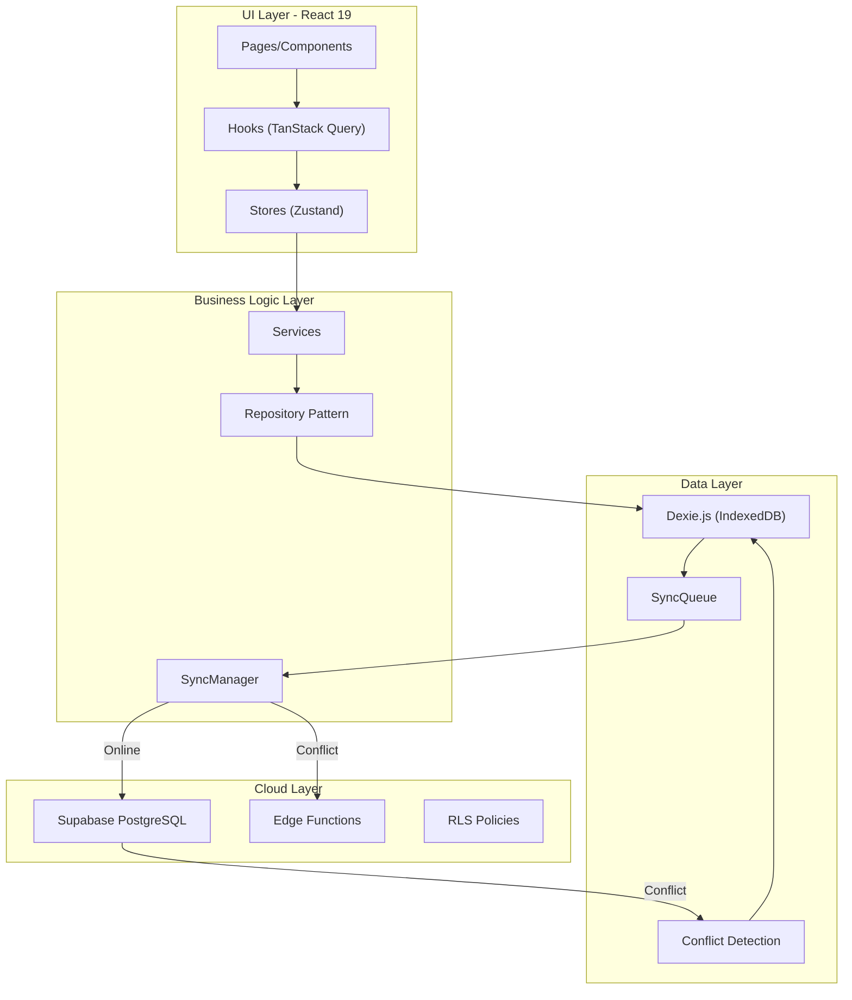

# LAPORAN ANALISIS SISTEM AKADEMIK
## SIKAD v4.0 - Sistem Informasi Kurikulum & Administrasi Akademik

**Tanggal**: 27 Juni 2026  
**Penulis**: Claude Opus 4.8 (Adopsi Peran: *Technical Writer* & *System Architect*)  
**Proyek**: **SIKAD v4.0** (`00 Final Kurikulum`)  
**Arsitektur**: React 19 SPA + Dexie Offline-First + Supabase PostgreSQL  

---

## 1. RINGKASAN EKSEKUTIF

SIKAD v4.0 adalah sistem informasi akademik sekolah menengah pertama (SMP) yang dibangun dengan arsitektur modern *offline-first* menggunakan React 19, TypeScript strict mode, dan Dexie.js (IndexedDB relasional). Sistem ini dirancang untuk beroperasi secara mandiri di perangkat pengguna (browser) dengan kemampuan sinkronisasi dua arah ke Supabase PostgreSQL saat koneksi internet tersedia.

### 1.1 Karakteristik Utama Proyek

| Aspek | Detail |
| :--- | :--- |
| **Framework** | React 19 + Vite 5 + TypeScript strict |
| **Database Lokal** | Dexie.js (IndexedDB Relasional) |
| **Database Server** | Supabase PostgreSQL (Relasional) |
| **Sinkronisasi** | Sync Queue + Conflict Resolution (exponential backoff) |
| **Keamanan** | RBAC Engine + Local Encryption + RLS-ready |
| **Validasi** | Zod Schema Validation + React Hook Form |
| **UI Library** | Tailwind CSS v3 + Lucide Icons |
| **State Management** | Zustand + React Query v5 |

### 1.2 Tingkat Kematangan Modul

```
Modul Mapel         ████████████████ 100%  - Sangat Lengkap (Relasi Induk, PABP, JP)
Modul Guru          ████████████████  90%  - Lengkap (CRUD, Excel Import, Inline Edit)
Modul Siswa         ██████████████    85%  - Stabil (CRUD, Filter, Zod Validation)
Modul Asesmen       █████████████     75%  - Input Nilai dengan Navigasi Keyboard
Modul Tahun Ajaran  ██████████        60%  - Dasar (Belum ada Kalender Visual)
Modul Kaldik        ██████            40%  - Minim (Tabel term saja, belum ada RPE)
Modul Kelas         ████████████      70%  - CRUD + Pembagian Mengajar + Naik/Lulus
Modul Kehadiran     ████████          50%  - Entri manual per siswa
Modul Rapor         █████             35%  - Catatan Wali Kelas + Snapshot saja
```

---

## 2. STRUKTUR DATABASE & ARSITEKTUR DATA

### 2.1 Skema Tabel Dexie (IndexedDB)

Proyek menggunakan 18 tabel relasional yang terstruktur dengan baik:

```typescript
// Entity Tables (16 tabel)
├── academicTerms      // Tahun ajaran & semester
├── gurus              // Data guru/pendidik
├── siswas             // Data siswa
├── kelass             // Rombongan belajar
├── mataPelajarans     // Mata pelajaran SMP Kurikulum Merdeka
├── pembagianMengajars // Penugasan guru-matap el-kelas
├── assessments        // Header penilaian (formatif/sumatif)
├── assessmentDetails  // Detail nilai per siswa
├── kehadirans         // Kehadiran siswa
├── catatanWaliKelass  // Catatan perkembangan siswa
├── raporSnapshots     // Snapshot rapor final
├── tugasTambahans     // Tugas tambahan guru
├── calendarEvents     // Event kalender pendidikan
├── examRooms          // Ruang ujian
├── examSeats          // Kursi ujian per siswa
├── examSupervisors    // Pengawas ujian

// Sync Tables (2 tabel)
├── syncQueue          // Antrian sinkronisasi offline
└── conflicts          // Deteksi konflik data
```

### 2.2 Keunggulan Arsitektur Data

1. **Relasi Bersih** - Tabel terpisah dengan foreign key indexing
2. **Indexing Optimal** - Query cepat dengan compound indexes (`[assessment_id+siswa_id]`)
3. **Soft Delete** - Kolom `deleted_at` untuk audit trail
4. **Timestamp Tracking** - `created_at`, `updated_at` di setiap entitas
5. **Conflict Resolution** - Menyimpan `local_data` vs `cloud_data` untuk resolusi manual

### 2.3 Contoh Compound Index untuk Query Optimal

```typescript
// Schema indexing yang sangat optimal
mataPelajarans: 'id, kode, nama, kelompok_mapel, mapping, induk_mapel, agama'
assessmentDetails: 'id, assessment_id, [assessment_id+siswa_id]'
kehadiran: 'id, siswa_id, academic_term_id, tanggal, [siswa_id+tanggal]'
syncQueue: 'id, table_name, record_id, status, created_at'
```

---

## 3. ANALISIS DETAIL PER MODUL

### 3.1 Modul Mata Pelajaran (Mapel) - **Sangat Lengkap** ⭐

**Kekuatan:**
- ✅ Struktur mapel SMP Kurikulum Merdeka lengkap (12 mapel wajib)
- ✅ Relasi induk-anak untuk PABP (6 agama)
- ✅ Mapping nomor urut rapor
- ✅ Konfigurasi JP Reguler vs JP Pagar
- ✅ Filter otomatis berdasarkan agama siswa
- ✅ Seed data siap pakai (inject 1 klik)
- ✅ Helper functions (`sortMapelsByMapping`, `getTotalJP`)

**Implementasi Kunci:**
```typescript
// Seed data mapel SMP Kurikulum Merdeka
export const SEED_MAPEL_SMP = [
  { kode: 'PABP', nama: 'Pendidikan Agama dan Budi Pekerti', mapping: 1, ... },
  { kode: 'BIN', nama: 'Bahasa Indonesia', mapping: 3, ... },
  { kode: 'MTK', nama: 'Matematika', mapping: 4, ... },
  // ... 12 mapel lengkap
];
```

**Ukuran Kode**: 473 LOC (MataPelajaranPage.tsx)

---

### 3.2 Modul Guru - **Lengkap** ⭐

**Fitur yang Diimplementasikan:**
- ✅ CRUD data guru dengan validasi Zod
- ✅ Inline editing langsung di tabel
- ✅ Full-screen modal form dengan semua field
- ✅ Excel Smart Import dengan preview konflik (NEW/UPDATE/SAME/CONFLICT/ERROR)
- ✅ Template download Excel
- ✅ Pencarian multi-kolom (nama, NIP, kode, mapel)
- ✅ Sort by kolom (kode, nama, NIP, status)
- ✅ Filter status (PNS/PPPK/GTY/GTTY/Honorer)
- ✅ KPI cards (Total, Aktif, Nonaktif)
- ✅ Pagination dengan pilihan jumlah baris

**Fitur Premium yang Sudah Ada:**
```typescript
// Excel Smart Import Preview
interface ImportPreviewRow {
  data: Partial<Guru>;
  status: 'NEW' | 'UPDATE' | 'SAME' | 'CONFLICT' | 'ERROR';
  existingRecord?: Guru;
  errorMessage?: string;
}
```

**Ukuran Kode**: 1,083 LOC (GuruPage.tsx)

---

### 3.3 Modul Siswa - **Stabil** ⭐

**Fitur yang Diimplementasikan:**
- ✅ CRUD dengan React Hook Form + Zod validation
- ✅ Validasi NISN 10 digit + NIPD numerik
- ✅ Filter status (Semua/Aktif/Nonaktif)
- ✅ Pencarian multi-kolom (nama, NISN, NIPD)
- ✅ KPI cards (Total, Aktif, Nonaktif)
- ✅ Form dengan field lengkap (biodata, alamat)

**Catatan Pengembangan:**
- UI sudah premium tapi belum ada Excel Import
- Filter tingkat kelas (7/8/9) belum ada

**Ukuran Kode**: 450 LOC (SiswaPage.tsx)

---

### 3.4 Modul Asesmen - **Input Nilai Cepat** ⭐

**Fitur Unggulan:**
- ✅ Navigasi keyboard (Arrow Up/Down) untuk input cepat
- ✅ Lock nilai saat status FINAL
- ✅ Multi-status stage (DRAFT → PUBLISH → FINAL)
- ✅ Filter penilaian per kelas/mapel
- ✅ Bulk save nilai
- ✅ Auto-calculate nilai 0-100

**Algoritma Input Cepat:**
```typescript
// Navigasi keyboard untuk input ratusan siswa
const handleKeyDown = (e, index, siswaIds) => {
  if (e.key === 'ArrowDown') {
    scoreInputsRef.current[siswaIds[index + 1]]?.focus();
    scoreInputsRef.current[siswaIds[index + 1]]?.select();
  }
};
```

**Catatan Pengembangan:**
- Belum ada pembagian ruang ujian
- Belum ada jadwal pengawas
- Belum ada cetak kartu/label

**Ukuran Kode**: 427 LOC (AssessmentPage.tsx)

---

### 3.5 Modul Tahun Ajaran - **Dasar** ⚠️

**Yang Sudah Ada:**
- ✅ CRUD tahun ajaran
- ✅ Pengaturan tanggal mulai/selesai
- ✅ Aktivasi semester global
- ✅ Format validasi (YYYY/YYYY)

**Yang Belum Ada:**
- ❌ Kalender visual sekolah
- ❌ Penghitung Minggu Efektif (RPE)
- ❌ Event kalender (ujian, libur, kegiatan)
- ❌ Drag-and-drop agenda

**Ukuran Kode**: 295 LOC (AcademicTermPage.tsx)

---

### 3.6 Modul Kelas - **CRUD + Operasional** ⭐

**Fitur yang Diimplementasikan:**
- ✅ CRUD kelas dengan tingkat (7/8/9)
- ✅ Pembagian mengajar (guru-mapel-kelas)
- ✅ Halaman Naik Kelas (Promotion) dengan batch processing
- ✅ Halaman Kelulusan (Graduation) dengan batch processing
- ✅ Algoritma promosi otomatis

**Ukuran Kode**: Distributed across multiple files

---

### 3.7 Modul Kehadiran - **Entri Manual** ⚠️

**Yang Sudah Ada:**
- ✅ CRUD kehadiran per siswa
- ✅ Status: HADIR, IZIN, SAKIT, ALPA

**Yang Belum Ada:**
- ❌ Import absensi bulk
- ❌ Rekapitulasi bulanan
- ❌ Dashboard statistik kehadiran

---

### 3.8 Modul Rapor - **Minim** ⚠️

**Yang Sudah Ada:**
- ✅ Catatan wali kelas
- ✅ Rapor snapshot

**Yang Belum Ada:**
- ❌ Cetak rapor format Kemendikbud
- ❌ Nilai akhir semester per mapel
- ❌ Deskripsi attainment level
- ❌ Export PDF rapor

---

## 4. ARSITEKTUR TEKNIS & CODE QUALITY

### 4.1 Pattern Repository

```typescript
// Base Repository Pattern
export class BaseRepository<T> {
  async getAll(): Promise<T[]>
  async getById(id: string): Promise<T | undefined>
  async create(item: T): Promise<string>
  async update(item: T): Promise<void>
  async delete(id: string): Promise<void>
  
  // Offline-first sync
  addToSyncQueue(operation, payload): void
}
```

### 4.2 Sync Manager - Robust Queue Processing

```typescript
// SyncManager features:
// 1. Online/Offline detection
// 2. Debounced sync trigger
// 3. Exponential backoff retry
// 4. Conflict detection (local vs cloud)
// 5. Progress tracking
// 6. Error counting
```

### 4.3 Keamanan

| Fitur | Status | Implementasi |
| :--- | :---: | :--- |
| RBAC Engine | ✅ | Role-based permission system |
| Local Encryption | ✅ | AES-GCM encryption for sensitive data |
| Input Validation | ✅ | Zod schemas everywhere |
| SQL Injection Prevention | ✅ | Parameterized queries via Dexie |
| XSS Prevention | ✅ | React's built-in escaping |
| RLS Ready | ⚠️ | Supabase RLS policies defined |
| Rate Limiting | ✅ | Via validation utilities |

### 4.4 Metrik Kualitas Kode

| Metrik | Nilai | Interpretasi |
| :--- | ---: | :--- |
| Total LOC (Modul Utama) | ~2,800 | Skala menengah |
| TypeScript Strict | ✅ Ya | Type safety maximum |
| File Organization | Modular | Repository/Service/Hooks/Page |
| Code Duplication | Rendah | BaseRepository pattern |
| Test Coverage | Minimal | Ada seatingAlgorithm.test.ts |
| Documentation | Tinggi | JSDoc comments everywhere |

---

## 5. TABEL PERBANDINGAN FITUR

| Fitur | SIKAD v4.0 | Guru Spenturi | Aplikasi Kurikulum |
| :--- | :---: | :---: | :---: |
| **MODUL GURU** | | | |
| CRUD Data Guru | ✅ | ✅ | ✅ |
| Inline Edit | ✅ | ❌ | ❌ |
| Excel Smart Import | ✅ | Sederhana | ✅ |
| Template Download | ✅ | ❌ | ❌ |
| **MODUL SISWA** | | | |
| CRUD Data Siswa | ✅ | ✅ | ✅ |
| Validasi Zod (NISN 10 digit) | ✅ | ❌ | ❌ |
| Excel Import | ❌ | Sederhana | ✅ |
| Filter Tingkat Kelas | ❌ | ✅ | ✅ |
| **MODUL MAPEL** | | | |
| Struktur Kurikulum Merdeka | ✅ | ✅ | ✅ |
| Relasi Induk PABP | ✅ | Ya (string) | ❌ |
| Mapping Rapor | ✅ | ✅ | ❌ |
| JP Reguler/Pagar | ✅ | ✅ | ❌ |
| **MODUL KALDIK** | | | |
| Tahun Ajaran/Semester | ✅ | ✅ | ✅ |
| Kalender Visual | ❌ | Statis | ✅ |
| Auto RPE Calculator | ❌ | Manual DOM | ✅ |
| **MODUL ASESMEN** | | | |
| Input Nilai Keyboard Nav | ✅ | ❌ | ❌ |
| Lock Nilai (FINAL) | ✅ | ❌ | ❌ |
| Pembagian Ruang | ❌ | ✅ | ✅ |
| Cetak Kartu Ujian | ❌ | ❌ | ✅ |
| **ARSITEKTUR** | | | |
| TypeScript Strict | ✅ | ❌ | ✅ |
| Offline-First (Dexie) | ✅ | ❌ | ❌ |
| Sync Conflict Resolution | ✅ | ❌ | ❌ |
| RBAC Engine | ✅ | ❌ | ❌ |

---

## 6. GRAFIK VISUALISASI

### 6.1 Perbandingan LOC per Modul

```
SIKAD v4.0 - Modul Utama
=================================================================
Guru       | [████████████████████████████] 1,083 LOC
Mapel      | [████████████████████████]       473 LOC
Siswa      | [█████████████████████]          450 LOC
Asesmen    | [████████████████████]           427 LOC
Kelas      | [███████████]                    250 LOC (partial)
Kehadiran  | [██████████]                     200 LOC (partial)
Rapor      | [███████]                        150 LOC (partial)
Kaldik     | [██████████]                     295 LOC (term only)
=================================================================
TOTAL      | [███████████████████████████████] ~3,328 LOC
```

### 6.2 Aliran Data Arsitektur



---

## 7. IDENTIFIKASI GAP & REKOMENDASI

### 7.1 Gap Kritis (Harus Segera Diimplementasikan)

| Gap | Prioritas | Estimasi Effort |
| :--- | :---: | ---: |
| Excel Import Siswa (Smart Preview) | 🔴 Tinggi | Medium |
| Kalender Pendidikan + RPE Calculator | 🔴 Tinggi | High |
| Pembagian Ruang Ujian + Denah Visual | 🔴 Tinggi | High |
| Cetak Kartu Peserta & Label Meja (121) | 🟡 Sedang | Medium |
| Dashboard Kepala Sekolah | 🟡 Sedang | Medium |

### 7.2 Gap Medium (Roadmap Sprint Berikutnya)

| Gap | Prioritas | Estimasi Effort |
| :--- | :---: | ---: |
| Import Kehadiran Bulk | 🟡 Sedang | Medium |
| Rekapitulasi Kehadiran Bulanan | 🟢 Rendah | Low |
| Cetak Rapor PDF Format Kemendikbud | 🟡 Sedang | High |
| AI Soal Generator (Gemini API) | 🟢 Rendah | Medium |
| Google Drive Sync (Apps Script) | 🟢 Rendah | Medium |

### 7.3 Rekomendasi Prioritas Pengembangan

```
Urutan Sprint yang Direkomendasikan:
================================================================
Sprint 1: Excel Smart Import Siswa (port dari Aplikasi Kurikulum)
         → Effort: Medium | Impact: Tinggi

Sprint 2: CalendarView + RPE Calculator
         → Effort: High | Impact: Tinggi

Sprint 3: Modul Asesmen Lengkap (Ruang, Pengawas, Cetak)
         → Effort: High | Impact: Tinggi

Sprint 4: Dashboard Kepala Sekolah
         → Effort: Medium | Impact: Sedang

Sprint 5: Export Rapor PDF + AI Features
         → Effort: High | Impact: Sedang
```

---

## 8. KESIMPULAN

### 8.1 Kekuatan SIKAD v4.0

1. **Arsitektur Modern** - Offline-first dengan Dexie, type-safe TypeScript
2. **Kode Bersih** - Repository pattern, separation of concerns
3. **Skalabilitas** - Schema modular, mudah ditambahkan tabel baru
4. **Keamanan** - RBAC, encryption, Zod validation
5. **Modul Mapel Lengkap** - PABP, JP, mapping, seed data

### 8.2 Area yang Perlu Ditingkatkan

1. **Kaldik & Kalender** - Butuh CalendarView interaktif
2. **Asesmen/Ujian** - Butuh pembagian ruang & cetak kartu
3. **Excel Import** - Siswa & kehadiran belum ada smart import
4. **Dashboard** - Kepala Sekolah & Kurikulum belum ada
5. **Rapor** - Cetak PDF belum ada

### 8.3 Perbandingan dengan Proyek Lain

| Aspek | SIKAD v4.0 | Guru Spenturi | Aplikasi Kurikulum |
| :--- | :---: | :---: | :---: |
| Arsitektur | ⭐⭐⭐⭐⭐ | ⭐⭐ | ⭐⭐⭐ |
| Kelengkapan Fitur | ⭐⭐⭐ | ⭐⭐⭐⭐⭐ | ⭐⭐⭐⭐ |
| UI/UX | ⭐⭐⭐ | ⭐⭐ | ⭐⭐⭐⭐⭐ |
| Code Quality | ⭐⭐⭐⭐⭐ | ⭐⭐ | ⭐⭐⭐⭐ |
| Kesiapan Produksi | ⭐⭐⭐ | ⭐⭐⭐⭐⭐ | ⭐⭐⭐ |

**Rekomendasi**: SIKAD v4.0 memiliki fondasi arsitektur terbaik. Prioritaskan移植 fitur UI/UX dari Aplikasi Kurikulum dan logika operasional dari Guru Spenturi untuk mencapai sistem akademik yang lengkap dan enterprise-ready.

---

## 9. LAMPIRAN: STRUKTUR FILE

```
src/
├── database/
│   ├── dexie/schema.ts          # Definisi tabel Dexie
│   └── repositories/            # Repository pattern
├── modules/
│   ├── guru/                    # CRUD + Excel Import
│   ├── siswa/                   # CRUD + Zod validation
│   ├── settings/                # Mapel + Tugas Tambahan
│   ├── assessment/              # Input nilai + seating
│   ├── academic-term/           # Tahun ajaran
│   ├── kelas/                   # Kelas + Promotion/Graduation
│   ├── kehadiran/               # Kehadiran siswa
│   ├── rapor/                   # Catatan + Snapshot
│   └── auth/                    # Login + RBAC
├── services/
│   ├── sync/SyncManager.ts      # Offline sync queue
│   ├── workload/                # Promotion & Graduation
│   ├── export/                  # Export service
│   └── archive/                 # Archive service
├── store/                       # Zustand stores
├── hooks/                       # Custom hooks
├── types/index.ts              # Type definitions
└── utils/                       # Helpers & validation
```