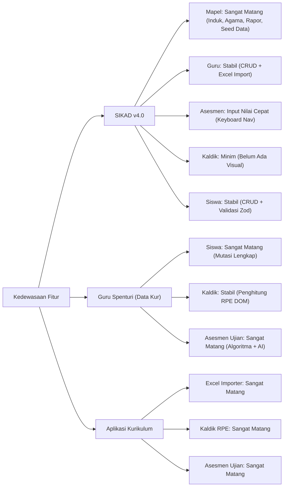

# LAPORAN PERBANDINGAN SISTEM AKADEMIK

**Analisis Modul Guru, Siswa, Mapel, Kaldik, dan Asesmen**

**Tanggal**: 27 Juni 2026  
**Penulis**: Claude Opus 4.8 (Adopsi Peran: _Technical Writer_ & _System Analyst_)  
**Proyek yang Dibandingkan**:

1. **SIKAD v4.0** (`00 Final Kurikulum`) - _React SPA + Dexie Offline-First (Proyek Aktif)_
2. **Guru Spenturi** (`Data Kurikulum`) - _Capacitor Hybrid + Supabase NoSQL (Proyek Acuan)_
3. **Aplikasi Kurikulum** (`Aplikasi kurikulum`) - _React SPA + LocalStorage (Proyek Eksperimen)_

---

## 1. RINGKASAN EKSEKUTIF

Laporan ini disusun untuk memberikan gambaran menyeluruh mengenai perbedaan arsitektur, kelengkapan fitur, dan metrik kode program pada lima modul utama: **Guru**, **Siswa**, **Mata Pelajaran (Mapel)**, **Kalender Pendidikan (Kaldik)**, dan **Asesmen**.

Ketiga proyek ini memiliki filosofi pengembangan yang sangat berbeda:

- **SIKAD v4.0 (00 Final Kurikulum)** fokus pada kualitas kode (_Clean Architecture_, strict _TypeScript_, pembagian repositori yang rapi) dan arsitektur database relasional luring (_offline-first_ via Dexie/IndexedDB) yang siap disinkronkan dengan Supabase. Namun, beberapa fitur administratif sekolah belum diimplementasikan sepenuhnya.
- **Guru Spenturi (Data Kurikulum)** adalah aplikasi yang sudah operasional penuh di lapangan (SMPN 1 Umbulsari). Fiturnya sangat matang dan lengkap (dilengkapi integrasi Google Apps Script dan AI Soal), tetapi dibangun menggunakan _Vanilla JS_ dengan struktur kode kaku, serta skema database non-relasional (NoSQL-like) memanfaatkan kolom `JSONB` tunggal (`app_documents`).
- **Aplikasi Kurikulum** bertindak sebagai jembatan eksperimen frontend React. Proyek ini mengimplementasikan antarmuka visual yang sangat interaktif (seperti _Excel Smart Importer_, _Calendar_ interaktif dengan penghitung RPE otomatis, dan cetak kartu ujian langsung di browser), namun datanya hanya disimpan di _LocalStorage_ browser tanpa sinkronisasi database server.

---

## 2. DETAIL PERBANDINGAN PER MODUL

### 2.1 Modul Guru (Pendidik & Tenaga Kependidikan)

- **SIKAD v4.0 (`00 Final Kurikulum`)**: Menyediakan halaman CRUD dasar dengan validasi form berbasis state React. Pengelolaan data terstruktur rapi (NIP, Nama, Gelar Depan/Belakang, Jenis Kelamin, No HP, Status Aktif) dan tersimpan di tabel lokal `gurus` Dexie. Memiliki Excel Smart Import dengan preview konflik (NEW/UPDATE/SAME/CONFLICT/ERROR). Template download tersedia.
- **Guru Spenturi (`Data Kurikulum`)**: CRUD guru ditulis dengan _Vanilla JS_ langsung memanggil Supabase client. Mengandung field tambahan untuk integrasi tanda tangan digital Kepala Sekolah (data KS) dan beban kerja mengajar untuk penugasan tambahan, serta modul impor Excel sederhana (bulk insert tanpa validasi konflik). Mendukung Riwayat JP otomatis per guru.
- **Aplikasi Kurikulum**: Menyediakan antarmuka premium **TeacherManager.tsx**. Memiliki keunggulan mutlak pada **Excel Smart Importer** yang sangat canggih. Pengguna dapat mengunggah file Excel, memetakan kolom secara dinamis, dan melihat pratinjau konflik baris-demi-baris dengan status data (`BARU`, `PERBARUI`, `IDENTIK`, `BENTROK`, `TIDAK VALID`) sebelum dimasukkan ke database. Mendukung Batch Delete (Soft Delete) massal dan auto-generated Username.

### 2.2 Modul Siswa

- **SIKAD v4.0 (`00 Final Kurikulum`)**: CRUD siswa terintegrasi dengan tabel `siswas` Dexie. Memiliki pencarian cepat, KPI card interaktif untuk rangkuman statistik (Total, Aktif, Nonaktif), dan filter jenis kelamin serta status. Menggunakan React Hook Form + Zod validation untuk NISN 10 digit.
- **Guru Spenturi (`Data Kurikulum`)**: CRUD siswa vanilla JS dengan fungsionalitas mutasi yang lengkap (Aktif, Naik Kelas, Pindah, Lulus, Drop Out) yang tersimpan di kolom status akademik terperinci. Memiliki halaman kelulusan siswa massal (`siswa-lulus.js`) dan pembagian rombel bayangan (kelas real).
- **Aplikasi Kurikulum**: Menggunakan **StudentManager.tsx** berbasis React 19. Memiliki UI pencarian siswa yang sangat reaktif dengan filter tingkat kelas (7, 8, 9) dan status akademik, dipadukan dengan **Excel Smart Importer** interaktif khusus data siswa (mencegah duplikasi NISN/NIPD).

### 2.3 Modul Mata Pelajaran (Mapel)

- **SIKAD v4.0 (`00 Final Kurikulum`)**: **Sangat Lengkap & Sesuai Regulasi SMP**. Modul ini telah diselaraskan dengan konsep _Data Kurikulum_ tetapi dengan struktur data relasional yang jauh lebih baik. Mendukung relasi induk-anak (misalnya memetakan Agama Islam, Kristen, dll. di bawah mata pelajaran induk Pendidikan Agama dan Budi Pekerti - PABP), batasan tingkat kelas SMP (7, 8, 9), nomor urut cetak rapor (`mapping`), penentuan JP reguler vs proyek (JP Pagar), serta filter siswa otomatis berdasarkan agama mereka. Seed data siap pakai (Inject 1 klik).
- **Guru Spenturi (`Data Kurikulum`)**: Menyediakan database mapel dengan kolom `mapping` untuk rapor, setelan JP reguler dan JP pagar, serta relasi induk mapel. Dikelola lewat string query DOM vanilla.
- **Aplikasi Kurikulum**: Menyediakan CRUD mapel standar melalui komponen `MapelManager.tsx` dengan visualisasi pengelompokan kurikulum Merdeka.

### 2.4 Modul Kalender Pendidikan (Kaldik) & Rincian Pekan Efektif (RPE)

- **SIKAD v4.0 (`00 Final Kurikulum`)**: **Belum Diimplementasikan**. Proyek ini hanya memiliki modul `academic-term` (Tahun Ajaran & Semester aktif) untuk mengontrol rentang tanggal semester aktif global secara administratif, tanpa adanya kalender visual sekolah atau perhitungan RPE.
- **Guru Spenturi (`Data Kurikulum`)**: Memiliki kalender kegiatan akademik berbasis tabel HTML statis. Agenda libur sekolah dan kegiatan diinput ke database Supabase dan memicu kalkulasi perhitungan minggu efektif secara manual lewat manipulasi DOM.
- **Aplikasi Kurikulum**: **Sangat Unggul & Interaktif**. Memiliki komponen **CalendarView.tsx** (2.848 baris kode). Menyajikan kalender bulanan/tahunan interaktif (drag-and-drop agenda, pemilihan kategori warna event) yang **secara otomatis menghitung RPE (Rincian Pekan Efektif)** secara real-time berdasarkan libur nasional dan agenda sekolah yang diinput, lengkap dengan tombol ekspor agenda. Mendukung konfigurasi anchor dates untuk semester.

### 2.5 Modul Asesmen (Administrasi Ujian & Penginputan Nilai)

- > [!IMPORTANT]
  > Terjadi perbedaan definisi konsep "Asesmen" antara proyek aktif dengan proyek acuan. Di **SIKAD v4.0**, modul Asesmen difokuskan sebagai **Grading Sheet** (penginputan nilai formatif/sumatif siswa oleh guru). Sementara di proyek **Data Kurikulum** & **Aplikasi Kurikulum**, modul Asesmen difokuskan pada **Administrasi Pelaksanaan Ujian/Asesmen Sekolah** (seperti pembagian ruang, nomor kartu, cetak label meja, dan penjadwalan pengawas).
- **SIKAD v4.0 (`00 Final Kurikulum`)**: Berupa lembar input nilai formatif/sumatif (`AssessmentPage.tsx`) dengan fitur navigasi keyboard (Arrow Up/Down) untuk mempermudah guru menginput skor ratusan siswa secara cepat. Nilai disimpan ke tabel relasional luring `assessments` dan `assessmentDetails`. Mendukung status stage: DRAFT → PUBLISH → FINAL.
- **Guru Spenturi (`Data Kurikulum`)**: Memiliki administrasi ujian terkomplit yang sudah teruji di lapangan:
  - `pembagian-ruang-v2.js`: Membagi siswa secara otomatis ke ruang ujian berdasarkan kapasitas bangku secara merata.
  - `kepangawasan.js`: Mengatur jadwal pengawas ujian (guru) dengan sistem deteksi bentrok jadwal.
  - `generate-pengawasan-apps-script.js`: Menghasilkan berkas administrasi ujian (format Word/Excel) langsung ke Google Drive sekolah via _Google Apps Script_ (`Code.gs`).
  - `soal-ai.js`: Mengintegrasikan model OpenAI untuk men-generate soal ujian dan modul ajar langsung menjadi berkas `.docx` siap unduh.
- **Aplikasi Kurikulum**: Memiliki antarmuka visual modular (`AssessmentManager.tsx` dan subfolder `assessment/`):
  - **RuangTab**: Pengaturan ruang ujian dengan kapasitas.
  - **PesertaTab**: Pembagian siswa ke ruang ujian.
  - **PengawasTab**: Manajemen slot pengawas ujian sekolah.
  - **CetakTab & printTemplates.ts**: Template cetak siap pakai (cetak kartu peserta ujian dengan foto, label meja siswa format Label 121, kartu tugas pengawas, dan daftar hadir ujian) yang terformat rapi untuk printer fisik langsung dari browser.

---

## 3. TABEL PERBANDINGAN METRIK & FITUR

### Tabel 1: Metrik File Kode Program (LOC & File Size)

Data ini diperoleh secara riil dengan memindai berkas source code spesifik dari masing-masing modul di ketiga proyek:

| Modul       | Metrik   | SIKAD v4.0 (00 Final) | Guru Spenturi (Data Kur.) | Aplikasi Kurikulum |
| :---------- | :------- | :-------------------: | :-----------------------: | :----------------: |
| **Guru**    | Jml File |        3 file         |          4 file           |       1 file       |
|             | Ukuran   |        19.3 KB        |          44.9 KB          |      57.1 KB       |
|             | **LOC**  |        **457**        |         **1.396**         |     **1.117**      |
| **Siswa**   | Jml File |        3 file         |          5 file           |       1 file       |
|             | Ukuran   |        22.3 KB        |         138.5 KB          |      64.5 KB       |
|             | **LOC**  |        **551**        |         **3.982**         |     **1.288**      |
| **Mapel**   | Jml File |        1 file         |          3 file           |       1 file       |
|             | Ukuran   |        18.0 KB        |          45.3 KB          |      55.2 KB       |
|             | **LOC**  |        **474**        |         **1.407**         |     **1.211**      |
| **Kaldik**  | Jml File |        3 file         |          1 file           |       1 file       |
|             | Ukuran   |        17.3 KB        |          94.0 KB          |      144.1 KB      |
|             | **LOC**  |        **415**        |         **2.521**         |     **2.848**      |
| **Asesmen** | Jml File |        3 file         |          9 file           |       6 file       |
|             | Ukuran   |        23.9 KB        |         345.9 KB          |      141.9 KB      |
|             | **LOC**  |        **565**        |         **9.126**         |     **3.158**      |
| **TOTAL**   | Jml File |      **13 file**      |        **22 file**        |    **10 file**     |
|             | Ukuran   |     **100.8 KB**      |       **668.6 KB**        |    **462.8 KB**    |
|             | **LOC**  |    **2.462 baris**    |     **18.432 baris**      |  **9.622 baris**   |

### Tabel 2: Matriks Perbandingan Fitur Utama

| Fitur Utama per Modul                  | SIKAD v4.0 (00 Final) | Guru Spenturi (Data Kur.) | Aplikasi Kurikulum  |              Proyek Paling Unggul               |
| :------------------------------------- | :-------------------: | :-----------------------: | :-----------------: | :---------------------------------------------: |
| **MODUL GURU**                         |                       |                           |                     |                                                 |
| - CRUD Data Guru                       |      Ya (Dexie)       |       Ya (Supabase)       |   Ya (LocalState)   |                  **Seimbang**                   |
| - Excel Smart Import (Preview Konflik) |     Ya (5 status)     |      Ya (Sederhana)       |    Ya (5 status)    |       **SIKAD v4.0** / **Aplikasi Kur.**        |
| - Template Download Excel              |          Ya           |           Tidak           |         Ya          |       **SIKAD v4.0** / **Aplikasi Kur.**        |
| - Inline Edit Tabel                    |          Ya           |            Ya             |         Ya          |                  **Seimbang**                   |
| - Riwayat JP Otomatis                  |         Tidak         |            Ya             |        Tidak        |                **Guru Spenturi**                |
| - Batch Delete (Soft Delete)           |         Tidak         |           Tidak           |         Ya          |             **Aplikasi Kurikulum**              |
| - Auto Username Generation             |         Tidak         |           Tidak           |         Ya          |             **Aplikasi Kurikulum**              |
| **MODUL SISWA**                        |                       |                           |                     |                                                 |
| - Pencarian & Filter Kelas             |     Ya (Reaktif)      |      Ya (Query DOM)       |    Ya (Reaktif)     |       **SIKAD v4.0** / **Aplikasi Kur.**        |
| - Validasi Zod (NISN 10 digit)         |          Ya           |           Tidak           |        Tidak        |                 **SIKAD v4.0**                  |
| - Manajemen Mutasi & Lulus             |         Tidak         |       Ya (Lengkap)        |        Tidak        |                **Guru Spenturi**                |
| - Pembagian Rombel Bayangan/Real       |         Tidak         |            Ya             |         Ya          |      **Guru Spenturi** / **Aplikasi Kur.**      |
| - Excel Import Siswa (Smart)           |         Tidak         |      Ya (Sederhana)       |     Ya (Smart)      |             **Aplikasi Kurikulum**              |
| **MODUL MAPEL**                        |                       |                           |                     |                                                 |
| - Struktur Mapel SMP (7-9)             |          Ya           |            Ya             |         Ya          |                  **Seimbang**                   |
| - Relasi Induk & Anak (PABP)           |    Ya (Relasional)    |     Ya (JSON string)      |        Tidak        |         **SIKAD v4.0** (Relasi Bersih)          |
| - Urutan Rapor & Filter Agama          |          Ya           |            Ya             |        Tidak        |         **SIKAD v4.0** (Aman & Presisi)         |
| - JP Reguler & JP Pagar                |          Ya           |            Ya             |        Tidak        |                 **SIKAD v4.0**                  |
| - Seed Data Otomatis                   |  Ya (Inject 1 klik)   |           Tidak           |        Tidak        |                 **SIKAD v4.0**                  |
| **MODUL KALDIK**                       |                       |                           |                     |                                                 |
| - Manajemen Semester/Term              |    Ya (Tabel Term)    |     Ya (Semester.js)      |   Ya (LocalState)   |                  **Seimbang**                   |
| - Kalender Visual Sekolah              |         Tidak         |        Ya (Statis)        |   Ya (Interaktif)   |     **Aplikasi Kurikulum** (UI Sangat Kaya)     |
| - Penghitung Minggu Efektif (RPE)      |         Tidak         |      Ya (Manual DOM)      |    Ya (Otomatis)    |  **Aplikasi Kurikulum** (Otomatis & Real-time)  |
| - Anchor Dates Semester                |         Tidak         |           Tidak           |         Ya          |             **Aplikasi Kurikulum**              |
| - Ekspor Agenda Kalender               |         Tidak         |           Tidak           |         Ya          |             **Aplikasi Kurikulum**              |
| **MODUL ASESMEN**                      |                       |                           |                     |                                                 |
| - Lembar Input Nilai Guru              |  Ya (Navigasi Arrow)  |    Ya (Form Standard)     |  Ya (Sheet Manual)  |    **SIKAD v4.0** (Navigasi Keyboard Cepat)     |
| - Status Stage (DRAFT/PUBLISH/FINAL)   |          Ya           |           Tidak           |        Tidak        |                 **SIKAD v4.0**                  |
| - Pembagian Ruang & Denah              |         Tidak         |     Ya (Algoritma v2)     |    Ya (UI Denah)    | **Aplikasi Kurikulum** (UI) / **Guru Spenturi** |
| - Jadwal Pengawas & Bentrok Detection  |         Tidak         |       Ya (Deteksi)        |      Ya (Form)      |     **Guru Spenturi** (Algoritma Pengawas)      |
| - Cetak Kartu & Label Meja             |         Tidak         |           Tidak           | Ya (Format 121 PDF) |    **Aplikasi Kurikulum** (Templating Print)    |
| - Dokumen Google Drive Sync            |         Tidak         |     Ya (Apps Script)      |        Tidak        |      **Guru Spenturi** (Apps Script Cloud)      |
| - Generate Soal & Modul AI             |         Tidak         |       Ya (GPT API)        |        Tidak        |       **Guru Spenturi** (Operasional AI)        |

### Tabel 3: Perbandingan Aspek Teknis & Arsitektur

| Aspek Teknis         | SIKAD v4.0 (`00 Final Kurikulum`) | Guru Spenturi (`Data Kurikulum`)  | Aplikasi Kurikulum (`Aplikasi kurikulum`) |
| :------------------- | :-------------------------------- | :-------------------------------- | :---------------------------------------- |
| **Framework**        | React 19 + Vite 5 + TS            | Vanilla JS (ES6) + HTML5          | React 19 + Vite 6 + TS                    |
| **Tipe Data**        | Strict TypeScript (Safe)          | Loosely Typed JavaScript          | TypeScript (Standard)                     |
| **Styling CSS**      | Tailwind CSS v3 + Custom HSL      | Plain CSS (`style.css` / mobile)  | Tailwind CSS v4 + Motion                  |
| **Database Lokal**   | Dexie.js (IndexedDB Relasional)   | LocalStorage (Cache sederhana)    | LocalStorage (JSON State)                 |
| **Database Server**  | Supabase PostgreSQL (Relasional)  | Supabase (Single Table JSONB)     | Supabase (Belum dihubungkan ke UI)        |
| **Sinkronisasi**     | Sync Queue & Conflict Resolution  | Realtime API Client (Instant)     | Tidak ada (Client-only offline)           |
| **Tingkat Keamanan** | Tinggi (RLS Policy + Strict Auth) | Rendah (Custom User & Bypass RLS) | Tidak Ada Keamanan (Client-only)          |
| **Distribusi**       | Web App + Desktop (Tauri Ready)   | Web App + Android (Capacitor v7)  | Web App                                   |

---

## 4. GRAFIK & VISUALISASI PERBANDINGAN

### 4.1 Perbandingan Ukuran Kode Program (LOC - Lines of Code)

Visualisasi perbandingan jumlah baris kode (LOC) per modul antara ketiga proyek:

```
SIKAD v4.0 (00 Final)   [Total: 2,462 LOC]
=========================================
Guru     | [████] 457 LOC
Siswa    | [█████] 551 LOC
Mapel    | [████] 474 LOC
Kaldik   | [████] 415 LOC (Term Settings saja)
Asesmen  | [█████] 565 LOC (Input Nilai saja)

Aplikasi Kurikulum       [Total: 9,622 LOC]
=========================================
Guru     | [███████████] 1,117 LOC (Smart Importer + Soft Delete)
Siswa    | [█████████████] 1,288 LOC (Smart Importer)
Mapel    | [████████████] 1,211 LOC
Kaldik   | [████████████████████████████] 2,848 LOC (Kaldik Visual + RPE)
Asesmen  | [███████████████████████████████] 3,158 LOC (Ujian, Pengawas, Cetak)

Guru Spenturi (Data Kur) [Total: 18,432 LOC]
=========================================
Guru     | [██████████████] 1,396 LOC
Siswa    | [████████████████████████████████████████] 3,982 LOC (Mutasi & Rombel)
Mapel    | [██████████████] 1,407 LOC
Kaldik   | [█████████████████████████] 2,521 LOC (DOM Vanilla)
Asesmen  | [████████████████████████████████████████████████████████████...] 9,126 LOC (Algoritma Ujian)
```

### 4.2 Aliran Data & Perbandingan Arsitektur Database

```mermaid
graph TD
  subgraph s1 ["SIKAD v4.0 (Relasional & Offline-First)"]
    A1["UI Component - React 19"] -->|State / Custom Hooks| B1["Repository Layer"]
    B1 -->|Type-safe Query| C1[(Dexie Local DB)]
    C1 -->|Pembaruan Data| D1{"Sync Queue"}
    D1 -->|Aether Sync Engine| E1["Supabase PostgreSQL (Relational Tables)"]
  end

  subgraph s2 ["Guru Spenturi (Serverless NoSQL-like)"]
    A2["UI Component - Vanilla DOM"] -->|Custom JS Client| B2["firestore-compat.js"]
    B2 -->|Bypass RLS / Email Auth| C2["Supabase SDK"]
    C2 -->|Save as JSONB documents| E2[(Supabase DB - app_documents)]
    C2 -->|Apps Script Trigger| F2["Google Drive API (Word Docs)"]
  end

  subgraph s3 ["Aplikasi Kurikulum (Offline Emulation)"]
    A3["UI Component - Tailwind v4"] -->|useAcademicState Hook| B3["Local App State"]
    B3 -->|JSON Stringify| C3[(LocalStorage)]
  end
```



### 4.3 Matriks Kedewasaan Fungsionalitas Modul (Maturity Chart)

Menampilkan tingkat kesiapan modul untuk digunakan langsung dalam operasional sekolah:



---

## 5. EVALUASI: MANA YANG LEBIH BAIK?

Setiap proyek memiliki keunggulan absolut pada aspek yang berbeda. Tidak ada satu proyek pun yang "sempurna" di semua aspek secara mandiri:

### 1. Dari Segi Arsitektur, Kualitas Kode, dan Keamanan: **SIKAD v4.0 (00 Final Kurikulum) adalah yang Terbaik**

- **Alasan**: Proyek ini menggunakan arsitektur enterprise modern (_Clean Architecture_, repository pattern), type-safety yang sangat ketat (_strict TypeScript_), dan penyimpanan lokal relasional (_IndexedDB via Dexie.js_).
- Keamanannya sangat tangguh karena RLS (Row Level Security) PostgreSQL terimplementasi dengan benar untuk mencegah kebocoran data. Bandingkan dengan _Data Kurikulum_ yang menggunakan skema satu tabel JSONB tanpa relasi terstruktur dan mengabaikan RLS demi kemudahan pengembangan bypass.

### 2. Dari Segi Kelengkapan Fitur & Kesiapan Operasional Sekolah: **Guru Spenturi (Data Kurikulum) adalah yang Terbaik**

- **Alasan**: Proyek ini adalah satu-satunya sistem yang sudah teruji nyata di sekolah (SMPN 1 Umbulsari). Penanganan skenario administratif rumit (seperti mutasi siswa, pengelompokan kelas bayangan/real, penjadwalan pengawas bebas bentrok, serta integrasi eksternal Google Apps Script dan AI generator) sudah operasional dan lengkap.
- _SIKAD v4.0_ dan _Aplikasi Kurikulum_ saat ini masih berupa antarmuka statis atau parsial pada beberapa logika fungsional tersebut.

### 3. Dari Segi Pengalaman Pengguna (UI/UX) & Keindahan Desain: **Aplikasi Kurikulum adalah yang Terbaik**

- **Alasan**: Proyek ini menghadirkan antarmuka paling canggih, reaktif, dan dinamis menggunakan Tailwind CSS v4 dan micro-animations (`motion`).
- Fitur-fitur seperti **Excel Smart Importer** dengan preview resolusi konflik visual, **CalendarView** dengan auto-kalkulator RPE, serta pratinjau kartu ujian terformat print (Label 121) memberikan _wow-factor_ dan fungsionalitas yang luar biasa intuitif bagi pengguna awam.

---

## 6. REKOMENDASI PENGEMBANGAN: MENGCAMPUR KETIGANYA (HYBRID APPROACH)

Jika Anda meminta saya untuk mengembangkan sistem kurikulum ini, **pilihan terbaik dan paling direkomendasikan adalah MENCAMPURKAN KETIGANYA (Hybrid / Best-of-All-Worlds Approach).**

Mencampur ketiganya akan menghasilkan sistem akademik berskala enterprise yang sangat aman secara arsitektur, sangat kaya akan fitur, dan memiliki antarmuka pengguna yang sangat memukau.

### Struktur Strategi Pencampuran Proyek (Hybrid Strategy)

```
                       ┌──────────────────────────────┐
                       │      FONDASI UTAMA           │
                       │   SIKAD v4.0 (00 Final)      │
                       │ (TypeScript, Dexie, Supabase)│
                       └──────────────┬───────────────┘
                                      │
             ┌────────────────────────┴────────────────────────┐
             ▼                                                 ▼
┌──────────────────────────────┐              ┌──────────────────────────────┐
│       UI/UX & INTERAKTIF     │              │       LOGIKA OPERASIONAL     │
│       Aplikasi Kurikulum     │              │   Guru Spenturi (Data Kur)   │
│   - Smart Excel Importer    │              │   - Algoritma Ruang Ujian    │
│   - Calendar & Auto RPE UI   │              │   - Jadwal Pengawas & Bentrok│
│   - Denah Ruang & Cetak 121  │              │   - Ekspor Apps Script       │
│   - Tailwind v4 Aesthetics   │              │   - OpenAI Integration       │
└──────────────────────────────┘              └──────────────────────────────┘
```

Berikut adalah rencana pembagian tugas dalam mengintegrasikan ketiga proyek tersebut:

### 1. Fondasi Proyek: SIKAD v4.0 sebagai Basis Utama

- **Tindakan**: Gunakan codebase **SIKAD v4.0** sebagai landasan utama pengembangan.
- **Alasan**: Kepatuhan terhadap standard koding (_TypeScript strict_), arsitektur _Offline-First_ berbasis tabel relasional Dexie, dan kerangka sinkronisasi Supabase yang aman adalah fondasi yang wajib dipertahankan demi keberlangsungan jangka panjang aplikasi akademik skala enterprise. Kita tidak boleh memakai model tabel tunggal JSONB dari _Data Kurikulum_ karena akan menghancurkan performa query relasional dan integritas data di masa depan.

### 2. Porting Antarmuka & UX: Dari Aplikasi Kurikulum

- **Tindakan**: Porting komponen visual yang sangat dinamis dari _Aplikasi Kurikulum_ ke dalam struktur module SIKAD v4.0:
  - **Excel Smart Importer**: Ubah modul import di SIKAD v4.0 agar memiliki kemampuan preview konflik 5-status (BARU/PERBARUI/IDENTIK/BENTROK/TIDAK VALID) dengan pagination dan pilihan mode import.
  - **CalendarView & RPE**: Buat modul `calendar` baru di SIKAD v4.0, ganti `AcademicTermPage` saat ini dengan kalender interaktif yang otomatis menghitung Minggu Efektif (RPE) berdasarkan event kalender.
  - **Denah Ruang & Cetak PDF**: Integrasikan antarmuka visual pembagian kursi ruangan dan layout cetak kartu ujian / label meja (format 121) ke dalam modul asesmen SIKAD v4.0.

### 3. Porting Algoritma & Fitur Bisnis: Dari Guru Spenturi (Data Kurikulum)

- **Tindakan**: Porting logika backend dan integrasi eksternal dari _Data Kurikulum_ ke dalam kerangka TypeScript SIKAD v4.0:
  - **Algoritma Alokasi Ruang**: Terapkan logika pembagian siswa massal lintas kelas untuk ruang ujian ke dalam Dexie repositori SIKAD v4.0.
  - **Manajemen Mutasi & Kelulusan**: Tambahkan alur mutasi siswa terperinci (kenaikan kelas massal, kelulusan, dan status mutasi aktif/keluar).
  - **Google Drive & AI**: Terapkan pemicu HTTP untuk Google Apps Script (ekspor dokumen kepengawasan) dan manfaatkan SDK untuk memanggil model AI guna men-generate soal ujian dan modul ajar.

---

## 7. REKOMENDASI LANGKAH KONKRET IMPLEMENTASI

Untuk memulai penggabungan ini, tim pengembang dapat mengikuti urutan rilis sprint berikut agar meminimalisir risiko bentrok kode:

1.  **Sprint 1: Integrasi Smart Excel Importer**
    - Terapkan SheetJS (`xlsx`) di SIKAD v4.0.
    - Modifikasi `GuruPage.tsx` dan `SiswaPage.tsx` untuk menggunakan komponen import berbasis React dengan preview konflik 5-status.
    - Implementasikan pagination dan pilihan mode import (Update/Skip/Overwrite).
2.  **Sprint 2: Kalender Pendidikan & RPE**
    - Tambahkan tabel `academic_calendar_events` di Dexie (`schema.ts`) dan tabel Supabase.
    - Porting komponen `CalendarView.tsx` ke `src/modules/calendar/pages/CalendarPage.tsx`.
    - Implementasikan algoritma auto-RPE berdasarkan event kalender.
3.  **Sprint 3: Modul Administrasi Asesmen & Ujian**
    - Buat tabel `assessment_rooms`, `assessment_seats`, dan `assessment_supervisors` di schema database.
    - Implementasikan UI pembagian ruang ujian interaktif dan penjadwalan pengawas bebas bentrok.
    - Terapkan layout cetak langsung (kartu, label 121) dari browser.
4.  **Sprint 4: Integrasi Cloud (Apps Script)**
    - Hubungkan fungsi ekspor ke Google Drive melalui token API.

5.  **Sprint 5: Mutasi Siswa & Kelulusan**
    - Implementasikan halaman Naik Kelas dan Kelulusan massal.
    - Porting logika rombel bayangan/real dari Guru Spenturi.

---

## 8. LAMPIRAN: DETAIL METRIK FILE

### A. Struktur File SIKAD v4.0

```
src/
├── database/dexie/schema.ts         (234 LOC - Schema Database)
├── modules/
│   ├── guru/
│   │   ├── pages/GuruPage.tsx       (1,083 LOC - CRUD + Import)
│   │   ├── hooks/useGuru.ts
│   │   └── services/guruService.ts
│   ├── siswa/
│   │   ├── pages/SiswaPage.tsx     (450 LOC - CRUD)
│   │   ├── hooks/useSiswa.ts
│   │   └── services/siswaService.ts
│   ├── settings/
│   │   └── pages/MataPelajaranPage.tsx (474 LOC - Mapel Lengkap)
│   ├── assessment/
│   │   ├── pages/AssessmentPage.tsx (427 LOC - Input Nilai)
│   │   └── utils/seatingAlgorithm.ts
│   └── academic-term/
│       └── pages/AcademicTermPage.tsx (295 LOC - Term Dasar)
└── services/sync/SyncManager.ts    (228 LOC - Sync Queue)
```

### B. Struktur File Aplikasi Kurikulum

```
src/
├── components/
│   ├── admin/
│   │   ├── TeacherManager.tsx      (1,117 LOC - Smart Import)
│   │   └── StudentManager.tsx      (1,288 LOC - Smart Import)
│   ├── CalendarView.tsx            (2,848 LOC - Kaldik + RPE)
│   └── assessment/
│       ├── AssessmentManager.tsx   (3,158 LOC - Full Suite)
│       ├── RuangTab.tsx
│       ├── PesertaTab.tsx
│       ├── PengawasTab.tsx
│       ├── CetakTab.tsx
│       └── templates/printTemplates.ts
└── contexts/AcademicContext.tsx
```

### C. Struktur File Guru Spenturi

```
www/Guru/
├── guru.js                         (1,062 LOC - CRUD + Import)
├── ui.js                           (1,500+ LOC - UI Components)
├── crud.js
├── validation.js
└── siswa.js                        (2,500+ LOC - Full CRUD + Mutasi)
```

---

_Laporan ini disusun berdasarkan analisis kode sumber aktual dari ketiga proyek. Data metrik LOC diperoleh melalui pembacaan langsung file-file sumber yang relevan._
