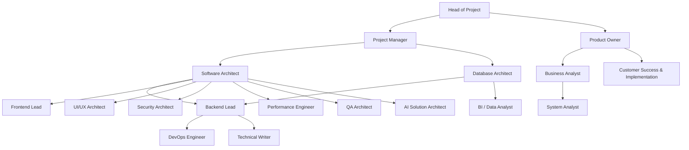

# 02. Organization Structure

Struktur organisasi proyek SIKAD v4.0 dirancang untuk memastikan pembagian peran yang jelas, pemisahan tugas (*separation of duties*), dan jalur koordinasi yang efisien antara tim manajemen, produk, dan teknis.

## 1. Bagan Organisasi Teknis

## 2. Hubungan Pelaporan & Jalur Koordinasi
- **Jalur Eskalasi Masalah Bisnis & Pelatihan:** CS -> BA -> PO -> HOP.
- **Jalur Eskalasi Masalah Teknis:** Developer -> Lead Engineer -> Software/Database Architect.
- **Jalur Rilis Produk:** DevOps -> QA -> PM -> PO -> HOP.

## 3. Panduan Penggabungan Peran (Role Consolidation Guidelines)
Untuk tim skala menengah/kecil yang mengalami keterbatasan sumber daya manusia (*role fatigue*), 16 peran spesifik dapat dirampingkan ke dalam 4 profil konsolidasi:

| Profil Konsolidasi | Peran yang Digabung | Deskripsi & Fokus Kerja |
|---|---|---|
| **Business & Product Profile** | PO + BA + SysA + CS | Mengelola hubungan dengan sekolah, menyusun backlog, melatih guru, dan merancang use case sistem. |
| **Core Architecture & Backend** | SwArch + DbArch + BE Lead + DevOps | Merancang database, menulis repositori/service backend, mengelola RLS, dan mengatur pipa CI/CD. |
| **Frontend & UI/UX Design** | FE Lead + UIUX Architect + Performance | Merancang mockups visual, membangun antarmuka web/Tauri, dan optimasi performa rendering/bundle. |
| **QA, Writer & Security** | QA Arch + Technical Writer + Security | Menulis pengujian otomatis, menyusun panduan buku manual, dan memverifikasi keamanan sistem dari kebocoran data. |
