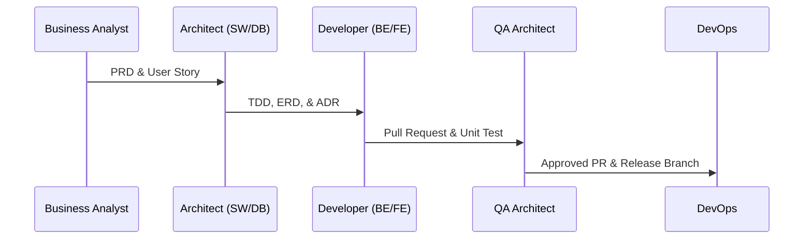

# 03. Engineering Workflow

Proses pengembangan SIKAD v4.0 mengikuti metodologi **Agile Scrum** dengan modifikasi khusus untuk mendukung pengembangan paralel oleh multi-agent AI (seperti Claude, Cline, Antigravity, dll.).

## 1. Upacara Scrum (Scrum Ceremonies)
- **Sprint Planning (Setiap 2 Minggu):** Menentukan Sprint Backlog berdasarkan User Story dari Product Owner.
- **Daily Standup (15 Menit):** Membahas pekerjaan kemarin, rencana hari ini, dan hambatan (*blockers*).
- **Sprint Review & Demo (Akhir Sprint):** Mendemonstrasikan fitur baru yang memenuhi Definition of Done (DoD).
- **Sprint Retrospective (Akhir Sprint):** Evaluasi performa tim dan rencana perbaikan proses.

## 2. Handoff Alur Kerja (Development Handoff)

## 3. Protokol Koordinasi Multi-Agent AI
Setiap agent AI harus menyertakan **Handoff Format** pada setiap commit/pesan status:
- **Completed:** Daftar fitur yang selesai.
- **Changed Files:** File-file yang dimodifikasi.
- **Dependencies:** Dependensi library atau schema baru.
- **Risks:** Risiko regresi atau performa.

### 3.1 Protokol Kunci Cabang & Folder (AI Branching & Folder Lock Protocol)
Untuk meminimalisir konflik penggabungan kode (*merge conflicts*) akibat pengerjaan paralel oleh multi-agent AI:
1. **Directory-Level Lock:** Setiap agent AI wajib mendaftarkan folder modul yang sedang dikerjakannya (misal: `src/modules/attendance/`) ke dalam berkas log kunci koordinasi tim (`.gitlocks.json`) sebelum melakukan perubahan kode.
2. **Aturan Satu Kunci (Single Lock Rule):** Satu folder modul hanya boleh dikunci dan dimodifikasi oleh satu agent AI dalam satu waktu. Agent AI lainnya harus menunggu hingga kunci tersebut dilepaskan (`Unlocked`).
3. **Penyelesaian Bentrokan:** Jika terdapat kebutuhan lintas-modul yang mendesak, modifikasi wajib diserahkan kepada Lead Developer untuk dikerjakan secara manual atau diselesaikan melalui satu agent AI konsolidasi.

